# AI 服务集成

<cite>
**本文引用的文件**   
- [ai_planner.js](file://extension/ai_planner.js)
- [provider_client.js](file://extension/ai/provider_client.js)
- [prompt_codec.js](file://extension/ai/prompt_codec.js)
- [response_codec.js](file://extension/ai/response_codec.js)
- [batching.js](file://extension/ai/batching.js)
- [plan_compiler.js](file://extension/ai/plan_compiler.js)
- [snapshot_model.js](file://extension/ai/snapshot_model.js)
- [fast_rules.js](file://extension/ai/fast_rules.js)
- [ai_endpoint.js](file://extension/shared/ai_endpoint.js)
- [message_protocol.js](file://extension/shared/message_protocol.js)
- [plan_schema.js](file://extension/shared/plan_schema.js)
- [storage.js](file://extension/shared/storage.js)
- [service_worker.js](file://extension/service_worker.js)
- [offscreen.js](file://extension/offscreen.js)
- [action_handlers.js](file://extension/background/action_handlers.js)
- [job_handlers.js](file://extension/background/job_handlers.js)
- [plan_executor.js](file://extension/background/plan_executor.js)
- [execution_policy.js](file://extension/background/execution_policy.js)
- [bookmark_api.js](file://extension/background/bookmark_api.js)
- [bookmark_tree.js](file://extension/background/bookmark_tree.js)
- [settings_store.js](file://extension/popup/settings_store.js)
- [secrets.js](file://extension/popup/secrets.js)
- [runtime_client.js](file://extension/popup/runtime_client.js)
- [test_extension_ai_batching.js](file://tests/test_extension_ai_batching.js)
- [test_extension_ai_prompt_codec.js](file://tests/test_extension_ai_prompt_codec.js)
- [test_extension_ai_provider_client.js](file://tests/test_extension_ai_provider_client.js)
- [test_extension_ai_response_codec.js](file://tests/test_extension_ai_response_codec.js)
- [test_extension_plan_compiler.js](file://tests/test_extension_plan_compiler.js)
- [test_extension_endpoint_urls.js](file://tests/test_extension_endpoint_urls.js)
- [test_extension_popup_secrets.js](file://tests/test_extension_popup_secrets.js)
- [test_extension_popup_settings_store.js](file://tests/test_extension_popup_settings_store.js)
</cite>

## 目录
1. [简介](#简介)
2. [项目结构](#项目结构)
3. [核心组件](#核心组件)
4. [架构总览](#架构总览)
5. [详细组件分析](#详细组件分析)
6. [依赖关系分析](#依赖关系分析)
7. [性能考虑](#性能考虑)
8. [故障排查指南](#故障排查指南)
9. [结论](#结论)
10. [附录](#附录)

## 简介
本文件面向“AI 服务集成”目标，围绕以下主题提供系统化文档：
- AI 规划器设计架构与智能重组计划生成流程、决策逻辑
- 多 AI 提供商统一接口设计与适配层（OpenAI、Anthropic 等）
- 提示词工程最佳实践：模板设计、上下文管理、安全过滤
- 响应处理编解码机制：JSON Schema 校验、错误处理、重试策略
- 批处理优化：请求合并、缓存策略、速率限制
- 配置说明：API 密钥管理、超时设置、错误恢复
- 使用示例与性能调优建议

## 项目结构
本项目采用分层与按职责划分相结合的组织方式：
- extension/ai：AI 能力核心模块（规划器、提示词编解码、响应编解码、批量调度、快照模型、快速规则）
- extension/background：后台任务与执行策略（动作处理、作业生命周期、书签 API、计划执行）
- extension/popup：弹出界面交互（设置、密钥、运行时客户端）
- extension/shared：跨进程共享协议与数据契约（消息协议、端点、计划模式、存储）
- tests：覆盖关键路径的测试用例

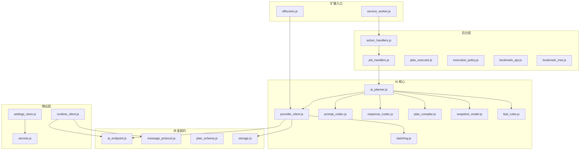

图表来源
- [service_worker.js](file://extension/service_worker.js)
- [offscreen.js](file://extension/offscreen.js)
- [action_handlers.js](file://extension/background/action_handlers.js)
- [job_handlers.js](file://extension/background/job_handlers.js)
- [plan_executor.js](file://extension/background/plan_executor.js)
- [execution_policy.js](file://extension/background/execution_policy.js)
- [bookmark_api.js](file://extension/background/bookmark_api.js)
- [bookmark_tree.js](file://extension/background/bookmark_tree.js)
- [ai_planner.js](file://extension/ai_planner.js)
- [provider_client.js](file://extension/ai/provider_client.js)
- [prompt_codec.js](file://extension/ai/prompt_codec.js)
- [response_codec.js](file://extension/ai/response_codec.js)
- [batching.js](file://extension/ai/batching.js)
- [plan_compiler.js](file://extension/ai/plan_compiler.js)
- [snapshot_model.js](file://extension/ai/snapshot_model.js)
- [fast_rules.js](file://extension/ai/fast_rules.js)
- [ai_endpoint.js](file://extension/shared/ai_endpoint.js)
- [message_protocol.js](file://extension/shared/message_protocol.js)
- [plan_schema.js](file://extension/shared/plan_schema.js)
- [storage.js](file://extension/shared/storage.js)
- [settings_store.js](file://extension/popup/settings_store.js)
- [secrets.js](file://extension/popup/secrets.js)
- [runtime_client.js](file://extension/popup/runtime_client.js)

章节来源
- [service_worker.js](file://extension/service_worker.js)
- [offscreen.js](file://extension/offscreen.js)
- [ai_planner.js](file://extension/ai_planner.js)
- [provider_client.js](file://extension/ai/provider_client.js)
- [prompt_codec.js](file://extension/ai/prompt_codec.js)
- [response_codec.js](file://extension/ai/response_codec.js)
- [batching.js](file://extension/ai/batching.js)
- [plan_compiler.js](file://extension/ai/plan_compiler.js)
- [snapshot_model.js](file://extension/ai/snapshot_model.js)
- [fast_rules.js](file://extension/ai/fast_rules.js)
- [ai_endpoint.js](file://extension/shared/ai_endpoint.js)
- [message_protocol.js](file://extension/shared/message_protocol.js)
- [plan_schema.js](file://extension/shared/plan_schema.js)
- [storage.js](file://extension/shared/storage.js)
- [settings_store.js](file://extension/popup/settings_store.js)
- [secrets.js](file://extension/popup/secrets.js)
- [runtime_client.js](file://extension/popup/runtime_client.js)

## 核心组件
- AI 规划器（ai_planner.js）：负责将书签快照与规则编译为可执行的重组计划，协调提示词构建、模型调用与结果解析。
- 提供商客户端（provider_client.js）：统一封装不同 AI 提供商的 HTTP 调用细节，屏蔽差异，暴露一致接口。
- 提示词编解码（prompt_codec.js）：负责提示词模板渲染、上下文注入与安全过滤。
- 响应编解码（response_codec.js）：负责模型返回的结构化解析、JSON Schema 校验与错误归一化。
- 批处理（batching.js）：实现请求合并、去重、并发控制与速率限制。
- 计划编译器（plan_compiler.js）：将高层意图与规则转换为结构化计划步骤。
- 快照模型（snapshot_model.js）：定义书签快照的数据结构与转换工具。
- 快速规则（fast_rules.js）：轻量级规则匹配与预筛选，降低大模型调用成本。
- 共享契约（ai_endpoint.js、message_protocol.js、plan_schema.js、storage.js）：定义端点、消息协议、计划模式与持久化约定。
- 后台执行（plan_executor.js、execution_policy.js、action_handlers.js、job_handlers.js）：编排作业生命周期、执行策略与书签操作。
- 弹出层（settings_store.js、secrets.js、runtime_client.js）：管理用户配置、密钥与运行时通信。

章节来源
- [ai_planner.js](file://extension/ai_planner.js)
- [provider_client.js](file://extension/ai/provider_client.js)
- [prompt_codec.js](file://extension/ai/prompt_codec.js)
- [response_codec.js](file://extension/ai/response_codec.js)
- [batching.js](file://extension/ai/batching.js)
- [plan_compiler.js](file://extension/ai/plan_compiler.js)
- [snapshot_model.js](file://extension/ai/snapshot_model.js)
- [fast_rules.js](file://extension/ai/fast_rules.js)
- [ai_endpoint.js](file://extension/shared/ai_endpoint.js)
- [message_protocol.js](file://extension/shared/message_protocol.js)
- [plan_schema.js](file://extension/shared/plan_schema.js)
- [storage.js](file://extension/shared/storage.js)
- [plan_executor.js](file://extension/background/plan_executor.js)
- [execution_policy.js](file://extension/background/execution_policy.js)
- [action_handlers.js](file://extension/background/action_handlers.js)
- [job_handlers.js](file://extension/background/job_handlers.js)
- [settings_store.js](file://extension/popup/settings_store.js)
- [secrets.js](file://extension/popup/secrets.js)
- [runtime_client.js](file://extension/popup/runtime_client.js)

## 架构总览
整体采用“前端触发—后台编排—AI 适配—结构化输出—执行落地”的分层架构。弹出层收集配置与指令，通过消息协议进入后台；后台根据策略与规则生成或委托 AI 规划器产出计划；提供商客户端统一调用外部模型；响应经编解码后落库并驱动书签操作。

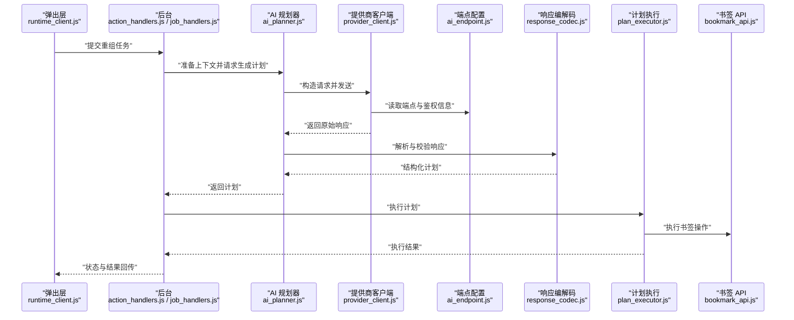

图表来源
- [runtime_client.js](file://extension/popup/runtime_client.js)
- [action_handlers.js](file://extension/background/action_handlers.js)
- [job_handlers.js](file://extension/background/job_handlers.js)
- [ai_planner.js](file://extension/ai_planner.js)
- [provider_client.js](file://extension/ai/provider_client.js)
- [ai_endpoint.js](file://extension/shared/ai_endpoint.js)
- [response_codec.js](file://extension/ai/response_codec.js)
- [plan_executor.js](file://extension/background/plan_executor.js)
- [bookmark_api.js](file://extension/background/bookmark_api.js)

## 详细组件分析

### AI 规划器（ai_planner.js）
- 职责
  - 聚合书签快照、规则与用户意图，构建提示词上下文
  - 调用提供商客户端生成计划
  - 对响应进行结构化解析与校验
  - 输出可执行计划供后台执行
- 关键流程
  - 输入：书签树、快照、规则、策略参数
  - 处理：提示词组装→模型调用→响应解析→计划编译
  - 输出：结构化计划（步骤、依赖、约束）
- 决策逻辑
  - 基于快速规则进行预筛选，减少不必要的大模型调用
  - 依据执行策略选择是否启用批处理、重试与降级
  - 结合计划模式进行二次校验与修正

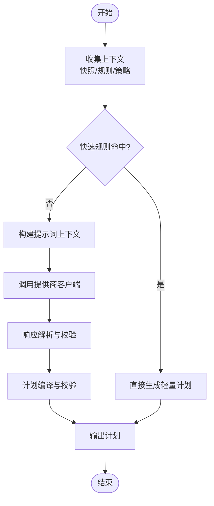

图表来源
- [ai_planner.js](file://extension/ai_planner.js)
- [fast_rules.js](file://extension/ai/fast_rules.js)
- [prompt_codec.js](file://extension/ai/prompt_codec.js)
- [provider_client.js](file://extension/ai/provider_client.js)
- [response_codec.js](file://extension/ai/response_codec.js)
- [plan_compiler.js](file://extension/ai/plan_compiler.js)

章节来源
- [ai_planner.js](file://extension/ai_planner.js)
- [fast_rules.js](file://extension/ai/fast_rules.js)
- [prompt_codec.js](file://extension/ai/prompt_codec.js)
- [provider_client.js](file://extension/ai/provider_client.js)
- [response_codec.js](file://extension/ai/response_codec.js)
- [plan_compiler.js](file://extension/ai/plan_compiler.js)

### 多 AI 提供商统一接口（provider_client.js + ai_endpoint.js）
- 统一抽象
  - 暴露一致的请求/响应接口，屏蔽各厂商差异
  - 支持动态端点、鉴权头、超时与重试参数
- 适配要点
  - OpenAI：标准 Chat Completions 风格
  - Anthropic：Claude 系列接口风格
  - 其他：可扩展适配器
- 端点与配置
  - 通过 ai_endpoint.js 集中管理端点 URL、鉴权字段映射与默认参数
  - 支持从存储中读取用户配置与密钥

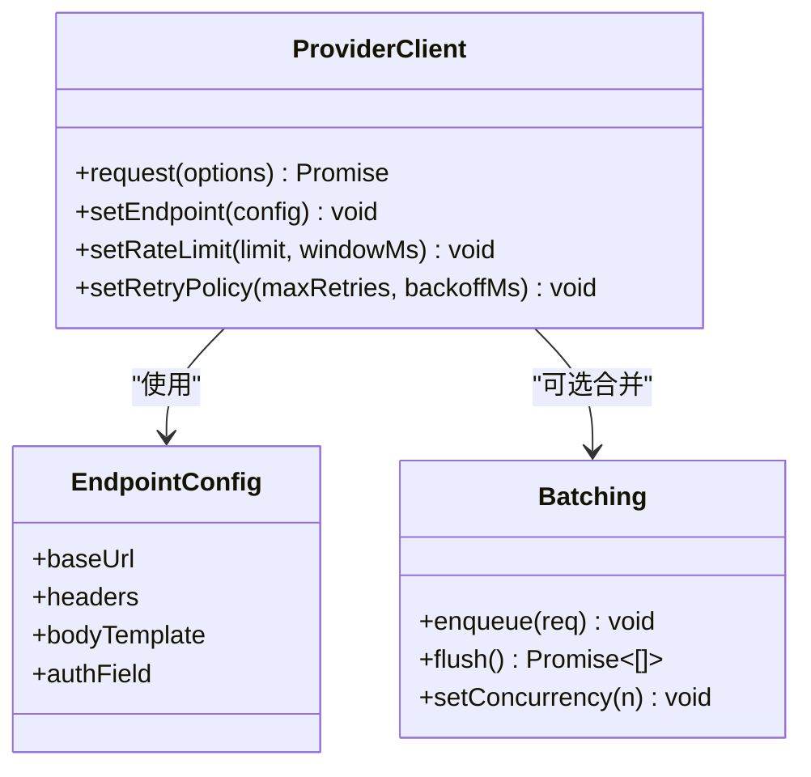

图表来源
- [provider_client.js](file://extension/ai/provider_client.js)
- [ai_endpoint.js](file://extension/shared/ai_endpoint.js)
- [batching.js](file://extension/ai/batching.js)

章节来源
- [provider_client.js](file://extension/ai/provider_client.js)
- [ai_endpoint.js](file://extension/shared/ai_endpoint.js)
- [batching.js](file://extension/ai/batching.js)
- [test_extension_ai_provider_client.js](file://tests/test_extension_ai_provider_client.js)
- [test_extension_endpoint_urls.js](file://tests/test_extension_endpoint_urls.js)

### 提示词工程（prompt_codec.js）
- 模板设计
  - 结构化模板：角色、任务、输入、约束、输出格式
  - 变量注入：书签摘要、规则片段、历史上下文
- 上下文管理
  - 增量上下文：仅注入相关片段，避免超限
  - 上下文裁剪：按相关性评分与长度阈值截断
- 安全过滤
  - 输入清洗：移除敏感信息与潜在注入内容
  - 输出白名单：限制模型返回字段与取值范围
- 最佳实践
  - 明确输出 JSON Schema，便于后续校验
  - 分步提示：复杂任务拆分为子问题
  - 少样本示例：在模板中嵌入少量高质量示例

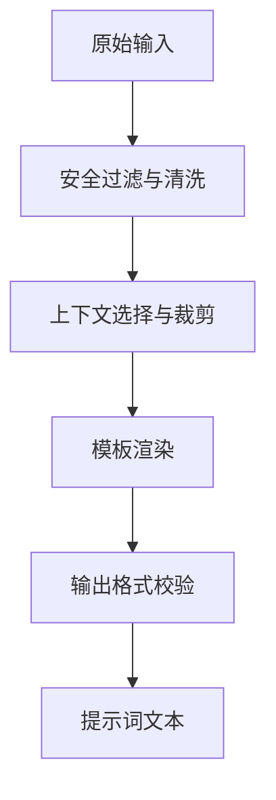

图表来源
- [prompt_codec.js](file://extension/ai/prompt_codec.js)
- [plan_schema.js](file://extension/shared/plan_schema.js)

章节来源
- [prompt_codec.js](file://extension/ai/prompt_codec.js)
- [plan_schema.js](file://extension/shared/plan_schema.js)
- [test_extension_ai_prompt_codec.js](file://tests/test_extension_ai_prompt_codec.js)

### 响应处理与编解码（response_codec.js）
- 解析流程
  - 原始响应→提取正文→尝试 JSON 解析→Schema 校验→规范化结构
- 错误处理
  - 网络异常、超时、非 2xx 状态码、空响应、非法 JSON、Schema 不匹配
  - 错误分类与可重试判定
- 重试策略
  - 指数退避、抖动、最大重试次数
  - 幂等性检查：避免重复执行副作用
- 降级与兜底
  - 失败时返回最小可用计划或标记待人工审核

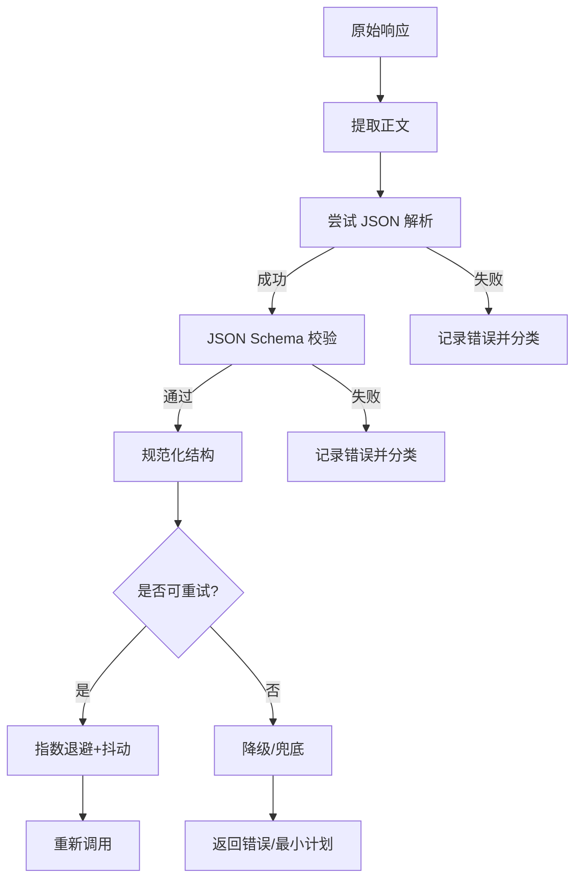

图表来源
- [response_codec.js](file://extension/ai/response_codec.js)
- [plan_schema.js](file://extension/shared/plan_schema.js)

章节来源
- [response_codec.js](file://extension/ai/response_codec.js)
- [plan_schema.js](file://extension/shared/plan_schema.js)
- [test_extension_ai_response_codec.js](file://tests/test_extension_ai_response_codec.js)

### 批处理优化（batching.js）
- 请求合并
  - 窗口内相似请求合并，减少重复调用
  - 去重键：基于输入指纹与语义哈希
- 并发控制
  - 固定并发度，防止过载
- 速率限制
  - 令牌桶/滑动窗口限流，保护后端稳定性
- 缓存策略
  - 读缓存：相同输入命中则直接返回
  - 失效策略：TTL 与变更感知

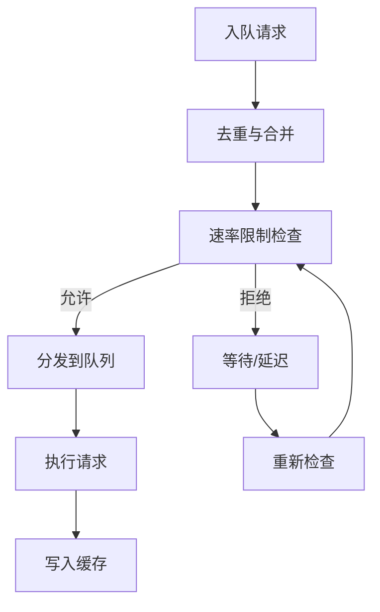

图表来源
- [batching.js](file://extension/ai/batching.js)

章节来源
- [batching.js](file://extension/ai/batching.js)
- [test_extension_ai_batching.js](file://tests/test_extension_ai_batching.js)

### 计划编译器与快照模型（plan_compiler.js + snapshot_model.js）
- 计划编译器
  - 将高层意图与规则转化为具体步骤序列
  - 维护步骤间依赖与约束，确保可执行顺序
- 快照模型
  - 定义书签快照数据结构与转换工具
  - 提供快照对比、差异计算与摘要生成

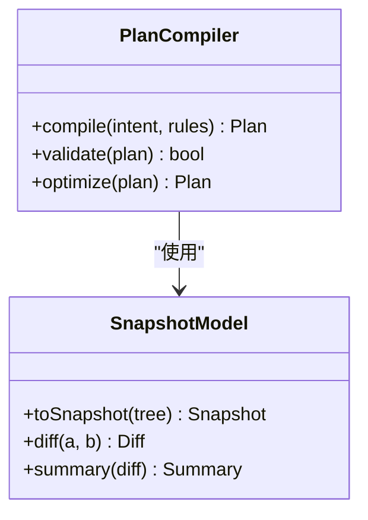

图表来源
- [plan_compiler.js](file://extension/ai/plan_compiler.js)
- [snapshot_model.js](file://extension/ai/snapshot_model.js)

章节来源
- [plan_compiler.js](file://extension/ai/plan_compiler.js)
- [snapshot_model.js](file://extension/ai/snapshot_model.js)
- [test_extension_plan_compiler.js](file://tests/test_extension_plan_compiler.js)

### 后台执行与策略（plan_executor.js + execution_policy.js + action_handlers.js + job_handlers.js）
- 执行器
  - 按依赖顺序执行计划步骤
  - 记录执行日志与中间状态
- 策略
  - 决定何时重试、何时跳过、何时中止
  - 与批处理、缓存、速率限制协同
- 作业与动作
  - 作业生命周期：创建、调度、执行、完成、清理
  - 动作处理器：接收 UI 指令并派发至后台

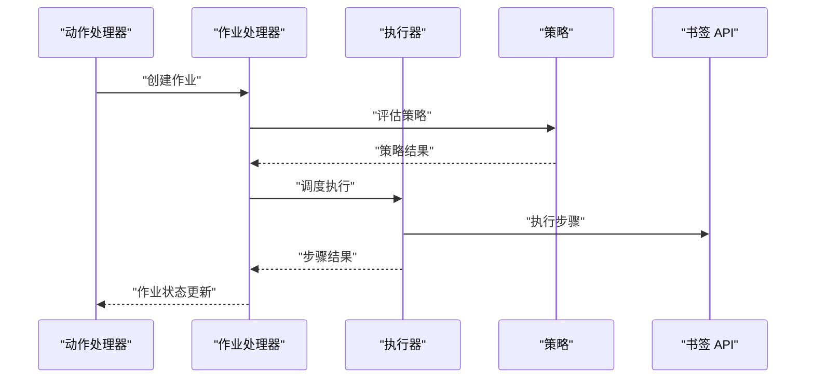

图表来源
- [action_handlers.js](file://extension/background/action_handlers.js)
- [job_handlers.js](file://extension/background/job_handlers.js)
- [plan_executor.js](file://extension/background/plan_executor.js)
- [execution_policy.js](file://extension/background/execution_policy.js)
- [bookmark_api.js](file://extension/background/bookmark_api.js)

章节来源
- [plan_executor.js](file://extension/background/plan_executor.js)
- [execution_policy.js](file://extension/background/execution_policy.js)
- [action_handlers.js](file://extension/background/action_handlers.js)
- [job_handlers.js](file://extension/background/job_handlers.js)
- [bookmark_api.js](file://extension/background/bookmark_api.js)

### 配置与密钥（settings_store.js + secrets.js + storage.js）
- 设置存储
  - 保存用户偏好、端点配置、批处理与重试参数
- 密钥管理
  - 安全存储 API 密钥，避免明文泄露
  - 提供访问控制与轮换支持
- 共享存储
  - 统一的读写接口，保证一致性

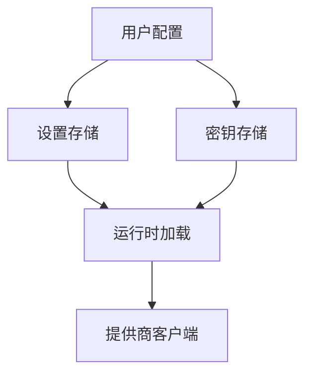

图表来源
- [settings_store.js](file://extension/popup/settings_store.js)
- [secrets.js](file://extension/popup/secrets.js)
- [storage.js](file://extension/shared/storage.js)

章节来源
- [settings_store.js](file://extension/popup/settings_store.js)
- [secrets.js](file://extension/popup/secrets.js)
- [storage.js](file://extension/shared/storage.js)
- [test_extension_popup_settings_store.js](file://tests/test_extension_popup_settings_store.js)
- [test_extension_popup_secrets.js](file://tests/test_extension_popup_secrets.js)

## 依赖关系分析
- 低耦合高内聚
  - AI 核心与后台执行通过消息协议与结构化计划解耦
  - 提供商客户端独立于业务逻辑，便于替换与扩展
- 外部依赖
  - 浏览器扩展 API（Service Worker、Offscreen）
  - 外部 AI 服务（OpenAI、Anthropic 等）
- 循环依赖
  - 通过共享契约与消息协议避免直接循环引用

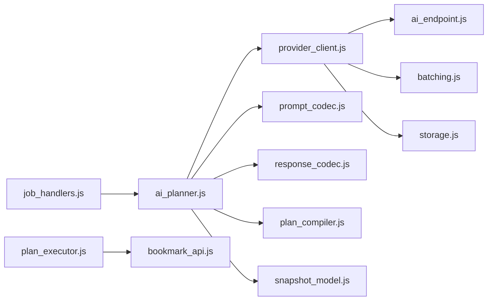

图表来源
- [ai_planner.js](file://extension/ai_planner.js)
- [provider_client.js](file://extension/ai/provider_client.js)
- [prompt_codec.js](file://extension/ai/prompt_codec.js)
- [response_codec.js](file://extension/ai/response_codec.js)
- [plan_compiler.js](file://extension/ai/plan_compiler.js)
- [snapshot_model.js](file://extension/ai/snapshot_model.js)
- [ai_endpoint.js](file://extension/shared/ai_endpoint.js)
- [batching.js](file://extension/ai/batching.js)
- [storage.js](file://extension/shared/storage.js)
- [job_handlers.js](file://extension/background/job_handlers.js)
- [plan_executor.js](file://extension/background/plan_executor.js)
- [bookmark_api.js](file://extension/background/bookmark_api.js)

章节来源
- [ai_planner.js](file://extension/ai_planner.js)
- [provider_client.js](file://extension/ai/provider_client.js)
- [prompt_codec.js](file://extension/ai/prompt_codec.js)
- [response_codec.js](file://extension/ai/response_codec.js)
- [plan_compiler.js](file://extension/ai/plan_compiler.js)
- [snapshot_model.js](file://extension/ai/snapshot_model.js)
- [ai_endpoint.js](file://extension/shared/ai_endpoint.js)
- [batching.js](file://extension/ai/batching.js)
- [storage.js](file://extension/shared/storage.js)
- [job_handlers.js](file://extension/background/job_handlers.js)
- [plan_executor.js](file://extension/background/plan_executor.js)
- [bookmark_api.js](file://extension/background/bookmark_api.js)

## 性能考虑
- 提示词优化
  - 精简上下文，优先注入高相关片段
  - 使用结构化模板与少样本示例提升准确率
- 批处理与缓存
  - 合理设置合并窗口与并发度
  - 针对只读查询启用缓存，缩短响应时间
- 速率限制与重试
  - 根据提供商配额调整限流参数
  - 指数退避与抖动避免雪崩
- 计划执行
  - 并行执行无依赖步骤
  - 失败步骤隔离与局部重试

[本节为通用指导，无需特定文件来源]

## 故障排查指南
- 常见问题
  - 端点不可达或鉴权失败：检查 ai_endpoint.js 配置与 secrets.js 中的密钥
  - 响应解析失败：查看 response_codec.js 的错误分类与日志
  - 计划不符合预期：核对 prompt_codec.js 的模板与 plan_schema.js 的模式
  - 批处理导致延迟：调整 batching.js 的窗口与并发参数
- 定位方法
  - 在 provider_client.js 增加请求/响应日志
  - 在 plan_executor.js 记录步骤执行耗时与错误堆栈
  - 使用测试用例复现：参考 test_extension_* 系列

章节来源
- [provider_client.js](file://extension/ai/provider_client.js)
- [response_codec.js](file://extension/ai/response_codec.js)
- [prompt_codec.js](file://extension/ai/prompt_codec.js)
- [plan_schema.js](file://extension/shared/plan_schema.js)
- [batching.js](file://extension/ai/batching.js)
- [plan_executor.js](file://extension/background/plan_executor.js)
- [test_extension_ai_provider_client.js](file://tests/test_extension_ai_provider_client.js)
- [test_extension_ai_response_codec.js](file://tests/test_extension_ai_response_codec.js)
- [test_extension_ai_prompt_codec.js](file://tests/test_extension_ai_prompt_codec.js)
- [test_extension_ai_batching.js](file://tests/test_extension_ai_batching.js)

## 结论
本集成方案以“统一接口、结构化输出、可执行计划”为核心，通过提示词工程与响应编解码保障质量，借助批处理与缓存提升效率，并以清晰的配置与错误恢复机制增强鲁棒性。建议在生产环境中持续监控指标（成功率、延迟、重试率），并结合实际负载调优批处理与限流参数。

[本节为总结，无需特定文件来源]

## 附录
- 使用示例
  - 在弹出层通过 runtime_client.js 发起重组任务
  - 在后台通过 action_handlers.js 与 job_handlers.js 管理作业
  - 在 AI 核心通过 ai_planner.js 生成计划并由 plan_executor.js 执行
- 配置清单
  - 端点与鉴权：ai_endpoint.js
  - 密钥管理：secrets.js
  - 设置项：settings_store.js
  - 存储接口：storage.js
- 测试参考
  - 提供商客户端：test_extension_ai_provider_client.js
  - 提示词编解码：test_extension_ai_prompt_codec.js
  - 响应编解码：test_extension_ai_response_codec.js
  - 批处理：test_extension_ai_batching.js
  - 计划编译：test_extension_plan_compiler.js
  - 端点 URL：test_extension_endpoint_urls.js
  - 设置与密钥：test_extension_popup_settings_store.js、test_extension_popup_secrets.js

章节来源
- [runtime_client.js](file://extension/popup/runtime_client.js)
- [action_handlers.js](file://extension/background/action_handlers.js)
- [job_handlers.js](file://extension/background/job_handlers.js)
- [ai_planner.js](file://extension/ai_planner.js)
- [plan_executor.js](file://extension/background/plan_executor.js)
- [ai_endpoint.js](file://extension/shared/ai_endpoint.js)
- [secrets.js](file://extension/popup/secrets.js)
- [settings_store.js](file://extension/popup/settings_store.js)
- [storage.js](file://extension/shared/storage.js)
- [test_extension_ai_provider_client.js](file://tests/test_extension_ai_provider_client.js)
- [test_extension_ai_prompt_codec.js](file://tests/test_extension_ai_prompt_codec.js)
- [test_extension_ai_response_codec.js](file://tests/test_extension_ai_response_codec.js)
- [test_extension_ai_batching.js](file://tests/test_extension_ai_batching.js)
- [test_extension_plan_compiler.js](file://tests/test_extension_plan_compiler.js)
- [test_extension_endpoint_urls.js](file://tests/test_extension_endpoint_urls.js)
- [test_extension_popup_settings_store.js](file://tests/test_extension_popup_settings_store.js)
- [test_extension_popup_secrets.js](file://tests/test_extension_popup_secrets.js)