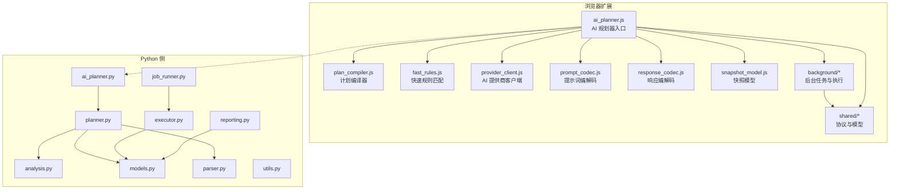
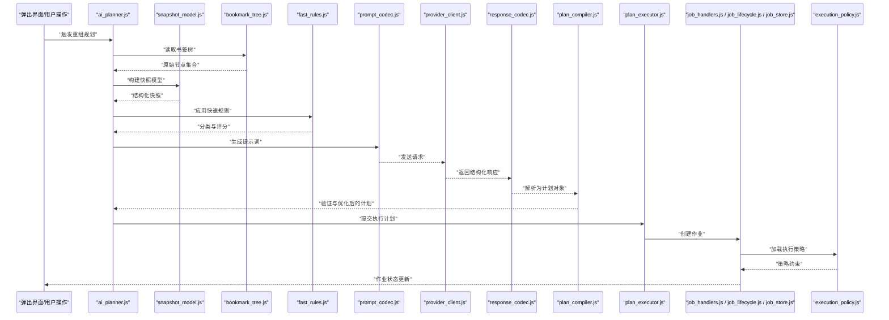
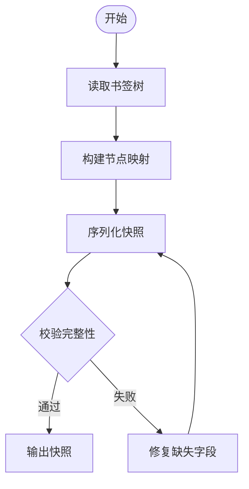
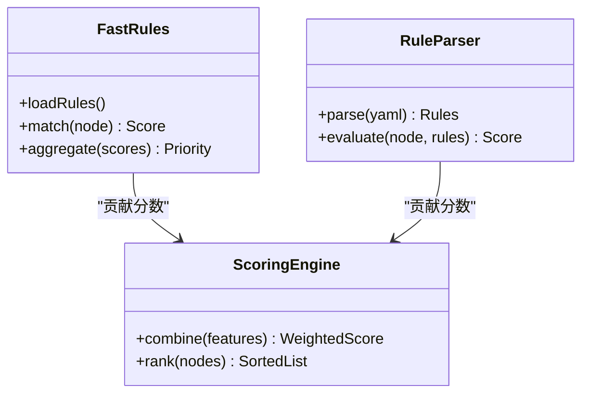
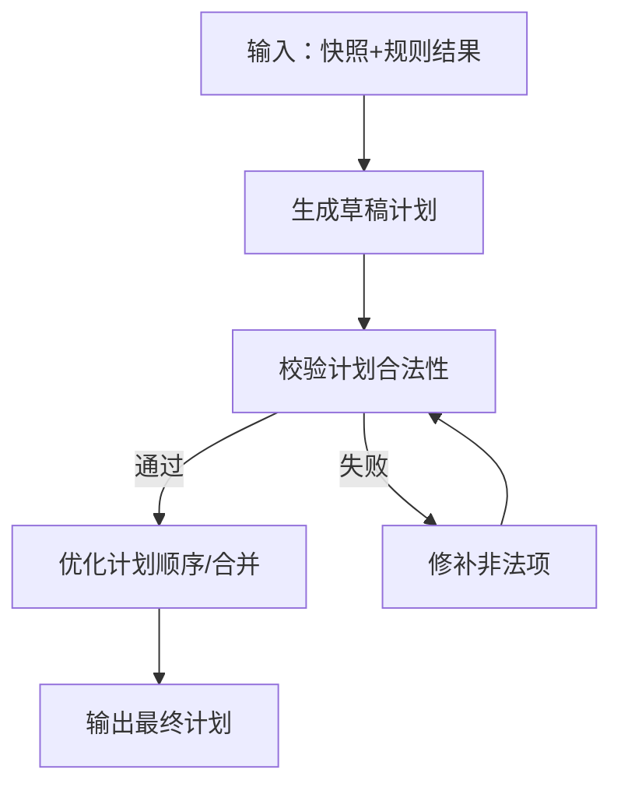
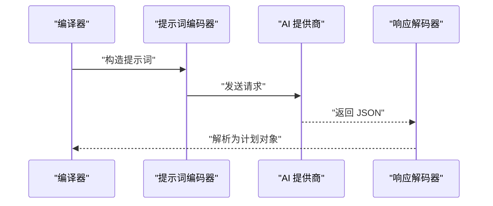
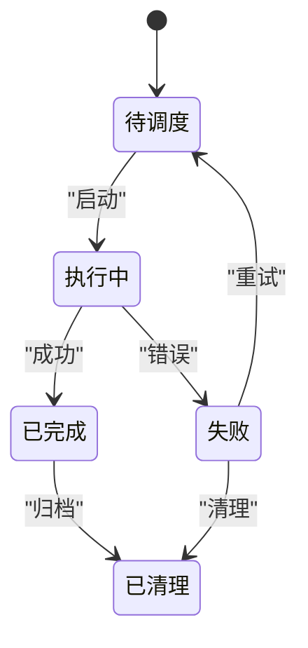
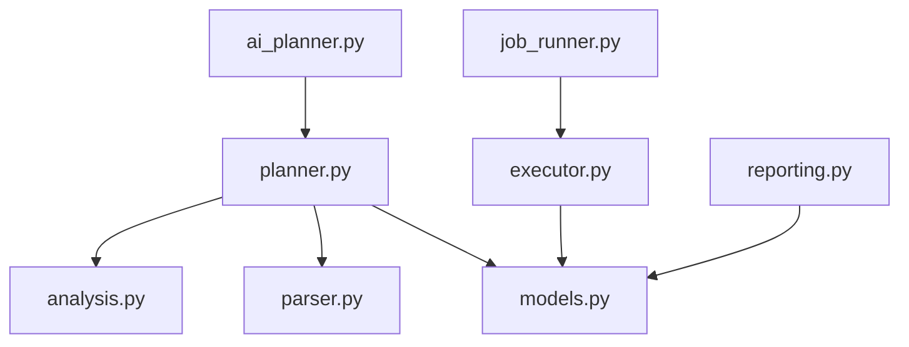
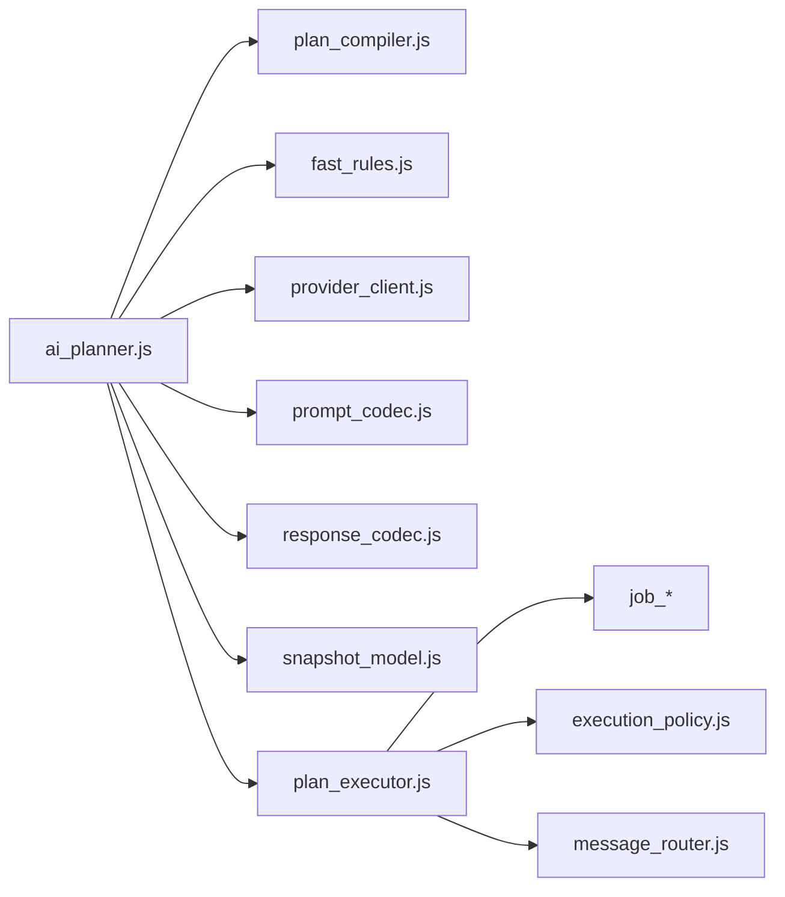

# AI 规划器架构

<cite>
**本文引用的文件**   
- [ai_planner.js](file://extension/ai_planner.js)
- [plan_compiler.js](file://extension/ai/plan_compiler.js)
- [fast_rules.js](file://extension/ai/fast_rules.js)
- [provider_client.js](file://extension/ai/provider_client.js)
- [prompt_codec.js](file://extension/ai/prompt_codec.js)
- [response_codec.js](file://extension/ai/response_codec.js)
- [snapshot_model.js](file://extension/ai/snapshot_model.js)
- [batching.js](file://extension/ai/batching.js)
- [plan_executor.js](file://extension/background/plan_executor.js)
- [job_handlers.js](file://extension/background/job_handlers.js)
- [job_lifecycle.js](file://extension/background/job_lifecycle.js)
- [job_store.js](file://extension/background/job_store.js)
- [execution_policy.js](file://extension/background/execution_policy.js)
- [message_router.js](file://extension/background/message_router.js)
- [offscreen_client.js](file://extension/background/offscreen_client.js)
- [bookmark_tree.js](file://extension/background/bookmark_tree.js)
- [bookmark_api.js](file://extension/background/bookmark_api.js)
- [plan_schema.js](file://extension/shared/plan_schema.js)
- [message_protocol.js](file://extension/shared/message_protocol.js)
- [storage.js](file://extension/shared/storage.js)
- [ai_endpoint.js](file://extension/shared/ai_endpoint.js)
- [rules.yaml](file://config/rules.yaml)
- [SKILL.md](file://skills/bookmark-reorg/SKILL.md)
- [ai_planner.py](file://src/bookmark_advisor/ai_planner.py)
- [planner.py](file://src/bookmark_advisor/planner.py)
- [analysis.py](file://src/bookmark_advisor/analysis.py)
- [executor.py](file://src/bookmark_advisor/executor.py)
- [job_runner.py](file://src/bookmark_advisor/job_runner.py)
- [models.py](file://src/bookmark_advisor/models.py)
- [parser.py](file://src/bookmark_advisor/parser.py)
- [reporting.py](file://src/bookmark_advisor/reporting.py)
- [utils.py](file://src/bookmark_advisor/utils.py)
</cite>

## 目录
1. [简介](#简介)
2. [项目结构](#项目结构)
3. [核心组件](#核心组件)
4. [架构总览](#架构总览)
5. [详细组件分析](#详细组件分析)
6. [依赖关系分析](#依赖关系分析)
7. [性能考虑](#性能考虑)
8. [故障排查指南](#故障排查指南)
9. [结论](#结论)
10. [附录](#附录)

## 简介
本文件面向“AI 规划器”的架构与实现，聚焦智能重组计划的生成流程与决策逻辑。文档覆盖以下关键主题：
- 书签分析算法、分类策略与优先级排序机制
- 规划器核心组件：书签状态评估、规则匹配引擎、执行计划生成器
- 与浏览器扩展其他模块的交互模式：作业管理系统集成、事件驱动的执行流程
- 规划器配置选项：性能调优参数与自定义策略设置
- 扩展能力与实践：如何扩展规划器功能并处理复杂书签重组场景

## 项目结构
本项目采用前后端协同的混合架构：
- 浏览器扩展侧（JavaScript）负责与浏览器书签树交互、调用外部 AI 服务、编译与执行计划、管理作业生命周期
- Python 侧（bookmark_advisor）提供离线分析、规则解析、计划生成与报告等能力
- 共享协议与数据模型在 shared 目录中定义，确保两端一致性

图表来源
- [ai_planner.js](file://extension/ai_planner.js)
- [plan_compiler.js](file://extension/ai/plan_compiler.js)
- [fast_rules.js](file://extension/ai/fast_rules.js)
- [provider_client.js](file://extension/ai/provider_client.js)
- [prompt_codec.js](file://extension/ai/prompt_codec.js)
- [response_codec.js](file://extension/ai/response_codec.js)
- [snapshot_model.js](file://extension/ai/snapshot_model.js)
- [plan_executor.js](file://extension/background/plan_executor.js)
- [job_handlers.js](file://extension/background/job_handlers.js)
- [job_lifecycle.js](file://extension/background/job_lifecycle.js)
- [job_store.js](file://extension/background/job_store.js)
- [execution_policy.js](file://extension/background/execution_policy.js)
- [message_router.js](file://extension/background/message_router.js)
- [offscreen_client.js](file://extension/background/offscreen_client.js)
- [bookmark_tree.js](file://extension/background/bookmark_tree.js)
- [bookmark_api.js](file://extension/background/bookmark_api.js)
- [plan_schema.js](file://extension/shared/plan_schema.js)
- [message_protocol.js](file://extension/shared/message_protocol.js)
- [storage.js](file://extension/shared/storage.js)
- [ai_endpoint.js](file://extension/shared/ai_endpoint.js)
- [ai_planner.py](file://src/bookmark_advisor/ai_planner.py)
- [planner.py](file://src/bookmark_advisor/planner.py)
- [analysis.py](file://src/bookmark_advisor/analysis.py)
- [executor.py](file://src/bookmark_advisor/executor.py)
- [job_runner.py](file://src/bookmark_advisor/job_runner.py)
- [models.py](file://src/bookmark_advisor/models.py)
- [parser.py](file://src/bookmark_advisor/parser.py)
- [reporting.py](file://src/bookmark_advisor/reporting.py)
- [utils.py](file://src/bookmark_advisor/utils.py)

章节来源
- [ai_planner.js](file://extension/ai_planner.js)
- [plan_schema.js](file://extension/shared/plan_schema.js)
- [message_protocol.js](file://extension/shared/message_protocol.js)
- [ai_planner.py](file://src/bookmark_advisor/ai_planner.py)
- [planner.py](file://src/bookmark_advisor/planner.py)

## 核心组件
本节深入剖析 AI 规划器的核心组件及其职责边界。

- 书签状态评估
  - 作用：对当前书签树进行快照建模，提取节点属性、层级关系与访问特征，为后续分析与规则匹配提供输入
  - 关键实现位置：快照模型与书签树读取
    - [snapshot_model.js](file://extension/ai/snapshot_model.js)
    - [bookmark_tree.js](file://extension/background/bookmark_tree.js)
    - [bookmark_api.js](file://extension/background/bookmark_api.js)

- 规则匹配引擎
  - 作用：基于规则集对书签进行分类与打分，支持快速规则与通用规则两类路径
  - 关键实现位置：
    - [fast_rules.js](file://extension/ai/fast_rules.js)
    - [rules.yaml](file://config/rules.yaml)
    - [parser.py](file://src/bookmark_advisor/parser.py)

- 执行计划生成器
  - 作用：将分析结果与规则匹配输出转化为可执行的计划（移动、重命名、合并、删除等），并进行校验与优化
  - 关键实现位置：
    - [plan_compiler.js](file://extension/ai/plan_compiler.js)
    - [plan_schema.js](file://extension/shared/plan_schema.js)
    - [planner.py](file://src/bookmark_advisor/planner.py)

- 提示词与响应编解码
  - 作用：将结构化上下文转换为 LLM 可读的提示词，并将返回的结构化响应解析为内部模型
  - 关键实现位置：
    - [prompt_codec.js](file://extension/ai/prompt_codec.js)
    - [response_codec.js](file://extension/ai/response_codec.js)

- AI 提供商客户端
  - 作用：封装对外部 AI 服务的请求、重试、超时与错误处理
  - 关键实现位置：
    - [provider_client.js](file://extension/ai/provider_client.js)
    - [ai_endpoint.js](file://extension/shared/ai_endpoint.js)

- 批处理与缓存
  - 作用：对大规模书签进行分批处理，降低单次请求体积与网络开销
  - 关键实现位置：
    - [batching.js](file://extension/ai/batching.js)

- 执行与作业管理
  - 作用：将计划提交至作业系统，按策略执行并记录撤销日志
  - 关键实现位置：
    - [plan_executor.js](file://extension/background/plan_executor.js)
    - [job_handlers.js](file://extension/background/job_handlers.js)
    - [job_lifecycle.js](file://extension/background/job_lifecycle.js)
    - [job_store.js](file://extension/background/job_store.js)
    - [execution_policy.js](file://extension/background/execution_policy.js)
    - [undo_log.js](file://extension/background/undo_log.js)

章节来源
- [snapshot_model.js](file://extension/ai/snapshot_model.js)
- [bookmark_tree.js](file://extension/background/bookmark_tree.js)
- [bookmark_api.js](file://extension/background/bookmark_api.js)
- [fast_rules.js](file://extension/ai/fast_rules.js)
- [rules.yaml](file://config/rules.yaml)
- [parser.py](file://src/bookmark_advisor/parser.py)
- [plan_compiler.js](file://extension/ai/plan_compiler.js)
- [plan_schema.js](file://extension/shared/plan_schema.js)
- [planner.py](file://src/bookmark_advisor/planner.py)
- [prompt_codec.js](file://extension/ai/prompt_codec.js)
- [response_codec.js](file://extension/ai/response_codec.js)
- [provider_client.js](file://extension/ai/provider_client.js)
- [ai_endpoint.js](file://extension/shared/ai_endpoint.js)
- [batching.js](file://extension/ai/batching.js)
- [plan_executor.js](file://extension/background/plan_executor.js)
- [job_handlers.js](file://extension/background/job_handlers.js)
- [job_lifecycle.js](file://extension/background/job_lifecycle.js)
- [job_store.js](file://extension/background/job_store.js)
- [execution_policy.js](file://extension/background/execution_policy.js)
- [undo_log.js](file://extension/background/undo_log.js)

## 架构总览
下图展示了从书签快照到计划生成的端到端流程，以及计划执行与作业管理的交互。

图表来源
- [ai_planner.js](file://extension/ai_planner.js)
- [snapshot_model.js](file://extension/ai/snapshot_model.js)
- [bookmark_tree.js](file://extension/background/bookmark_tree.js)
- [fast_rules.js](file://extension/ai/fast_rules.js)
- [prompt_codec.js](file://extension/ai/prompt_codec.js)
- [provider_client.js](file://extension/ai/provider_client.js)
- [response_codec.js](file://extension/ai/response_codec.js)
- [plan_compiler.js](file://extension/ai/plan_compiler.js)
- [plan_executor.js](file://extension/background/plan_executor.js)
- [job_handlers.js](file://extension/background/job_handlers.js)
- [job_lifecycle.js](file://extension/background/job_lifecycle.js)
- [job_store.js](file://extension/background/job_store.js)
- [execution_policy.js](file://extension/background/execution_policy.js)

## 详细组件分析

### 书签状态评估（快照模型）
- 目标：将浏览器书签树转换为稳定、可序列化的快照，便于规则匹配与 LLM 消费
- 关键点：
  - 节点去重与 ID 映射，避免循环引用
  - 保留必要元信息（标题、URL、父级路径、时间戳等）
  - 可选聚合视图（如按文件夹统计）
- 复杂度：O(N) 遍历与 O(N) 存储，N 为书签节点数
- 优化建议：
  - 增量快照：仅变更节点参与重建
  - 懒加载：按需展开深层子树

图表来源
- [snapshot_model.js](file://extension/ai/snapshot_model.js)
- [bookmark_tree.js](file://extension/background/bookmark_tree.js)

章节来源
- [snapshot_model.js](file://extension/ai/snapshot_model.js)
- [bookmark_tree.js](file://extension/background/bookmark_tree.js)
- [bookmark_api.js](file://extension/background/bookmark_api.js)

### 规则匹配引擎（快速规则与通用规则）
- 快速规则（JS）：
  - 基于 fast_rules.json/yaml 的规则表，进行高效匹配与打分
  - 适合高频、确定性强的分类与优先级计算
- 通用规则（Python）：
  - 使用 parser.py 解析 rules.yaml，支持更复杂的条件组合与表达式
- 分类策略：
  - 多标签分类：一个书签可属于多个类别
  - 权重聚合：结合访问频率、最近使用时间、路径深度等特征
- 优先级排序：
  - 综合得分 = 规则权重 × 特征因子 + 业务偏好
  - 阈值过滤：低于阈值的候选被丢弃或降级

图表来源
- [fast_rules.js](file://extension/ai/fast_rules.js)
- [parser.py](file://src/bookmark_advisor/parser.py)
- [rules.yaml](file://config/rules.yaml)

章节来源
- [fast_rules.js](file://extension/ai/fast_rules.js)
- [parser.py](file://src/bookmark_advisor/parser.py)
- [rules.yaml](file://config/rules.yaml)

### 执行计划生成器（计划编译器）
- 输入：快照、规则匹配结果、用户策略
- 输出：符合 plan_schema 的可执行计划（移动、重命名、合并、删除等）
- 校验与优化：
  - 冲突检测：目标路径是否存在、重复目标
  - 原子性：批量操作的顺序与回滚点
  - 最小改动：优先局部调整而非全局重构
- 扩展点：
  - 新增动作类型需在 schema 中声明并在编译器中实现转换逻辑

图表来源
- [plan_compiler.js](file://extension/ai/plan_compiler.js)
- [plan_schema.js](file://extension/shared/plan_schema.js)

章节来源
- [plan_compiler.js](file://extension/ai/plan_compiler.js)
- [plan_schema.js](file://extension/shared/plan_schema.js)

### 提示词与响应编解码（LLM 交互）
- 提示词编解码：
  - 将快照与规则摘要压缩为结构化提示词
  - 注入策略与约束（最大移动次数、禁止删除等）
- 响应编解码：
  - 将 LLM 返回的 JSON 解析为内部计划对象
  - 异常分支：格式错误、字段缺失、越界值
- 安全与健壮性：
  - 输入清洗与长度限制
  - 超时与重试策略

图表来源
- [prompt_codec.js](file://extension/ai/prompt_codec.js)
- [response_codec.js](file://extension/ai/response_codec.js)
- [provider_client.js](file://extension/ai/provider_client.js)

章节来源
- [prompt_codec.js](file://extension/ai/prompt_codec.js)
- [response_codec.js](file://extension/ai/response_codec.js)
- [provider_client.js](file://extension/ai/provider_client.js)

### 批处理与缓存
- 批处理：
  - 将大规模书签切分为批次，控制单次提示词大小
  - 合并多次 LLM 输出，减少往返次数
- 缓存：
  - 规则命中缓存与中间结果缓存
  - 失效策略：书签变化时自动失效

章节来源
- [batching.js](file://extension/ai/batching.js)

### 执行与作业管理（事件驱动）
- 作业生命周期：
  - 创建 -> 调度 -> 执行 -> 完成/失败 -> 清理
- 执行策略：
  - 串行/并行、限速、重试、幂等
- 撤销日志：
  - 记录每一步变更，支持一键回滚
- 消息路由：
  - 跨页面/Offscreen 进程通信

图表来源
- [job_lifecycle.js](file://extension/background/job_lifecycle.js)
- [job_handlers.js](file://extension/background/job_handlers.js)
- [job_store.js](file://extension/background/job_store.js)
- [execution_policy.js](file://extension/background/execution_policy.js)
- [message_router.js](file://extension/background/message_router.js)
- [offscreen_client.js](file://extension/background/offscreen_client.js)

章节来源
- [plan_executor.js](file://extension/background/plan_executor.js)
- [job_handlers.js](file://extension/background/job_handlers.js)
- [job_lifecycle.js](file://extension/background/job_lifecycle.js)
- [job_store.js](file://extension/background/job_store.js)
- [execution_policy.js](file://extension/background/execution_policy.js)
- [message_router.js](file://extension/background/message_router.js)
- [offscreen_client.js](file://extension/background/offscreen_client.js)

### Python 侧规划器与执行器
- ai_planner.py：协调分析、规则、计划生成与执行
- planner.py：核心规划算法与策略编排
- analysis.py：书签语义分析与特征提取
- executor.py：离线执行器，模拟或实际执行计划
- job_runner.py：作业运行器，管理并发与资源
- models.py：统一数据模型
- reporting.py：报告与可视化
- utils.py：通用工具函数

图表来源
- [ai_planner.py](file://src/bookmark_advisor/ai_planner.py)
- [planner.py](file://src/bookmark_advisor/planner.py)
- [analysis.py](file://src/bookmark_advisor/analysis.py)
- [executor.py](file://src/bookmark_advisor/executor.py)
- [job_runner.py](file://src/bookmark_advisor/job_runner.py)
- [models.py](file://src/bookmark_advisor/models.py)
- [parser.py](file://src/bookmark_advisor/parser.py)
- [reporting.py](file://src/bookmark_advisor/reporting.py)

章节来源
- [ai_planner.py](file://src/bookmark_advisor/ai_planner.py)
- [planner.py](file://src/bookmark_advisor/planner.py)
- [analysis.py](file://src/bookmark_advisor/analysis.py)
- [executor.py](file://src/bookmark_advisor/executor.py)
- [job_runner.py](file://src/bookmark_advisor/job_runner.py)
- [models.py](file://src/bookmark_advisor/models.py)
- [parser.py](file://src/bookmark_advisor/parser.py)
- [reporting.py](file://src/bookmark_advisor/reporting.py)
- [utils.py](file://src/bookmark_advisor/utils.py)

## 依赖关系分析
- 组件耦合：
  - ai_planner.js 作为编排者，依赖快照、规则、提示词、响应、编译器与执行器
  - background/* 模块通过消息协议与 offscreen 进程协作
- 外部依赖：
  - AI 提供商 API（通过 provider_client.js 与 ai_endpoint.js）
  - 浏览器书签 API（通过 bookmark_api.js）
- 潜在循环依赖：
  - 需避免 plan_executor 与 ai_planner 的直接双向调用，建议使用消息或事件总线解耦

图表来源
- [ai_planner.js](file://extension/ai_planner.js)
- [plan_compiler.js](file://extension/ai/plan_compiler.js)
- [fast_rules.js](file://extension/ai/fast_rules.js)
- [provider_client.js](file://extension/ai/provider_client.js)
- [prompt_codec.js](file://extension/ai/prompt_codec.js)
- [response_codec.js](file://extension/ai/response_codec.js)
- [snapshot_model.js](file://extension/ai/snapshot_model.js)
- [plan_executor.js](file://extension/background/plan_executor.js)
- [job_handlers.js](file://extension/background/job_handlers.js)
- [job_lifecycle.js](file://extension/background/job_lifecycle.js)
- [job_store.js](file://extension/background/job_store.js)
- [execution_policy.js](file://extension/background/execution_policy.js)
- [message_router.js](file://extension/background/message_router.js)

章节来源
- [ai_planner.js](file://extension/ai_planner.js)
- [plan_executor.js](file://extension/background/plan_executor.js)
- [message_protocol.js](file://extension/shared/message_protocol.js)

## 性能考虑
- 批处理与分页：
  - 合理设置批次大小，平衡内存占用与网络延迟
- 规则匹配优化：
  - 预编译规则索引，减少运行时匹配成本
- 缓存策略：
  - 对频繁访问的快照片段与规则结果进行缓存
- 异步与并发：
  - 使用 Offscreen 进程执行耗时任务，避免阻塞主线程
- 计划优化：
  - 合并相邻移动操作，减少 I/O 次数

[本节为通用指导，不直接分析具体文件]

## 故障排查指南
- 常见错误与定位：
  - 提示词过大：检查 batching 配置与快照裁剪策略
  - 响应格式错误：查看 response_codec 的解析分支与校验逻辑
  - 执行失败：检查 execution_policy 的约束与 job_lifecycle 的状态机
- 日志与诊断：
  - 启用详细日志，记录关键步骤输入输出
  - 使用 undo_log 进行回滚验证
- 复现场景：
  - 构造最小化书签样例，逐步缩小问题范围

章节来源
- [response_codec.js](file://extension/ai/response_codec.js)
- [execution_policy.js](file://extension/background/execution_policy.js)
- [job_lifecycle.js](file://extension/background/job_lifecycle.js)
- [undo_log.js](file://extension/background/undo_log.js)

## 结论
AI 规划器通过“快照建模—规则匹配—计划生成—作业执行”的分层架构，实现了可扩展、可观测且高可用的书签重组能力。其设计强调：
- 清晰的职责边界与模块化
- 强契约的数据模型与消息协议
- 灵活的规则系统与策略配置
- 稳健的错误处理与回滚机制

[本节为总结性内容，不直接分析具体文件]

## 附录

### 配置选项与调优参数
- 批处理参数：
  - 批次大小、最大提示词长度、重试次数、超时时间
- 规则与策略：
  - 快速规则阈值、通用规则优先级、禁止操作清单
- 执行策略：
  - 并发度、限速、幂等键、回滚窗口

章节来源
- [batching.js](file://extension/ai/batching.js)
- [fast_rules.js](file://extension/ai/fast_rules.js)
- [execution_policy.js](file://extension/background/execution_policy.js)
- [rules.yaml](file://config/rules.yaml)

### 扩展规划器功能与复杂场景示例
- 新增动作类型：
  - 在 plan_schema 中声明新动作字段
  - 在 plan_compiler 中实现转换与校验逻辑
  - 在 plan_executor 中实现执行与撤销逻辑
- 复杂重组场景：
  - 跨域迁移：合并来自不同来源的书签，去重与冲突解决
  - 动态分组：根据 URL 模式与访问历史动态创建文件夹
  - 渐进式优化：分阶段执行，每阶段验证与回滚

章节来源
- [plan_schema.js](file://extension/shared/plan_schema.js)
- [plan_compiler.js](file://extension/ai/plan_compiler.js)
- [plan_executor.js](file://extension/background/plan_executor.js)
- [SKILL.md](file://skills/bookmark-reorg/SKILL.md)