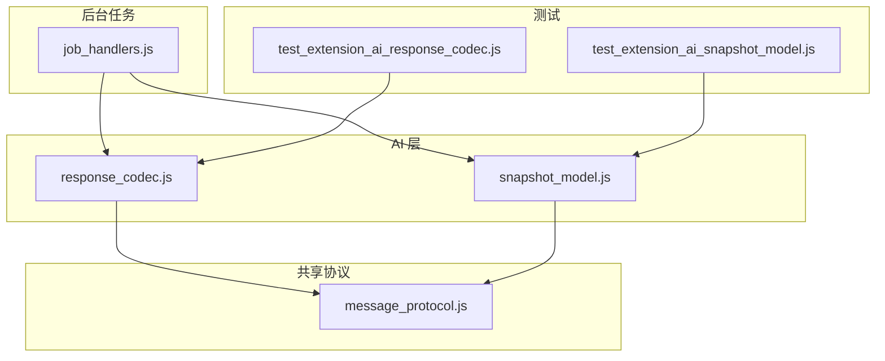
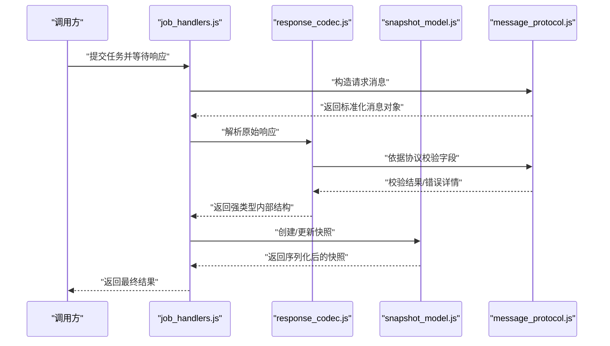
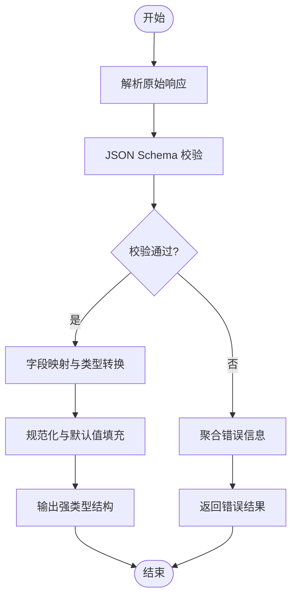
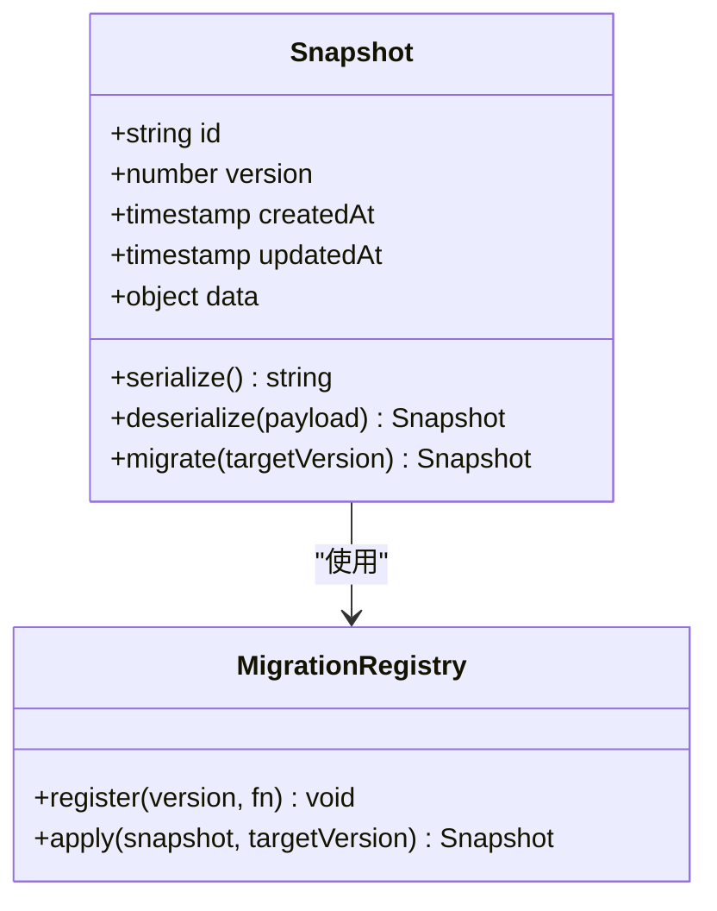
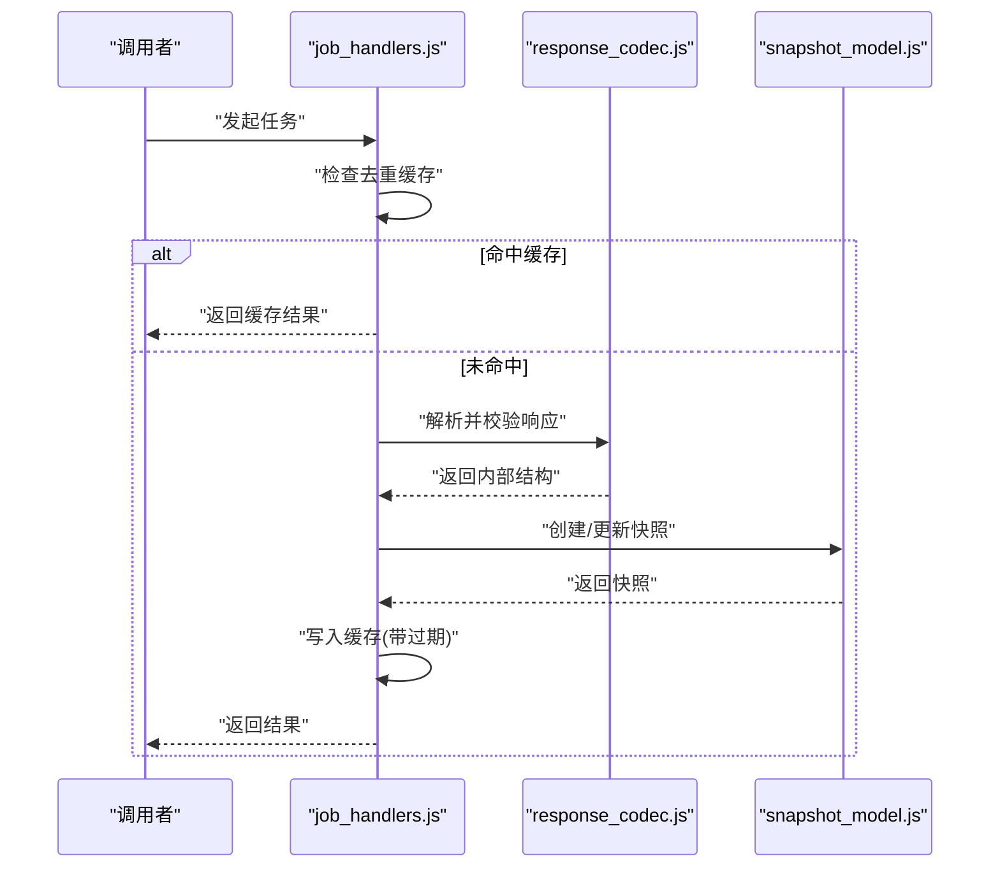
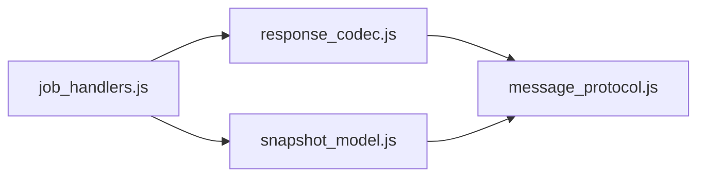

# 响应处理机制

<cite>
**本文引用的文件**   
- [extension/ai/response_codec.js](file://extension/ai/response_codec.js)
- [extension/ai/snapshot_model.js](file://extension/ai/snapshot_model.js)
- [extension/background/job_handlers.js](file://extension/background/job_handlers.js)
- [extension/shared/message_protocol.js](file://extension/shared/message_protocol.js)
- [tests/test_extension_ai_response_codec.js](file://tests/test_extension_ai_response_codec.js)
- [tests/test_extension_ai_snapshot_model.js](file://tests/test_extension_ai_snapshot_model.js)
</cite>

## 目录
1. [简介](#简介)
2. [项目结构](#项目结构)
3. [核心组件](#核心组件)
4. [架构总览](#架构总览)
5. [详细组件分析](#详细组件分析)
6. [依赖关系分析](#依赖关系分析)
7. [性能考虑](#性能考虑)
8. [故障排查指南](#故障排查指南)
9. [结论](#结论)
10. [附录](#附录)

## 简介
本文件围绕“响应处理机制”展开，聚焦以下目标：
- 深入解释响应编解码器的实现原理，包括 JSON Schema 验证、数据转换与类型安全保证。
- 详细说明快照模型的设计架构，包括数据结构定义、序列化机制与版本迁移策略。
- 介绍错误处理框架，包括异常分类、错误恢复与用户友好的错误消息生成。
- 说明响应缓存与去重机制，包括缓存键生成、过期策略与内存优化。
- 提供响应处理的监控与调试工具，包括性能指标收集、错误追踪与日志分析。
- 包含实际代码示例路径，展示如何处理复杂的 AI 响应数据与实现自定义响应处理器。

## 项目结构
与响应处理相关的核心模块位于扩展的 ai 与 background 层，以及共享协议与测试用例：
- extension/ai/response_codec.js：负责将原始 AI 响应解析为内部结构化数据，执行校验、转换与类型安全。
- extension/ai/snapshot_model.js：定义快照的数据结构与序列化/反序列化逻辑，支持版本演进。
- extension/background/job_handlers.js：编排任务生命周期中的响应处理流程，协调编解码器与快照模型。
- extension/shared/message_protocol.js：定义跨进程消息协议，确保请求/响应契约一致。
- tests/test_extension_ai_response_codec.js：覆盖响应编解码的关键路径与边界条件。
- tests/test_extension_ai_snapshot_model.js：覆盖快照模型的序列化、反序列化与迁移逻辑。

图表来源
- [extension/ai/response_codec.js](file://extension/ai/response_codec.js)
- [extension/ai/snapshot_model.js](file://extension/ai/snapshot_model.js)
- [extension/background/job_handlers.js](file://extension/background/job_handlers.js)
- [extension/shared/message_protocol.js](file://extension/shared/message_protocol.js)
- [tests/test_extension_ai_response_codec.js](file://tests/test_extension_ai_response_codec.js)
- [tests/test_extension_ai_snapshot_model.js](file://tests/test_extension_ai_snapshot_model.js)

章节来源
- [extension/ai/response_codec.js](file://extension/ai/response_codec.js)
- [extension/ai/snapshot_model.js](file://extension/ai/snapshot_model.js)
- [extension/background/job_handlers.js](file://extension/background/job_handlers.js)
- [extension/shared/message_protocol.js](file://extension/shared/message_protocol.js)
- [tests/test_extension_ai_response_codec.js](file://tests/test_extension_ai_response_codec.js)
- [tests/test_extension_ai_snapshot_model.js](file://tests/test_extension_ai_snapshot_model.js)

## 核心组件
- 响应编解码器（response_codec）
  - 职责：接收原始 AI 响应，进行 JSON Schema 校验、字段映射与类型转换，输出强类型的内部结构；同时支持反向编码用于持久化或传输。
  - 关键点：严格模式校验、默认值填充、可选字段降级、错误聚合与定位。
- 快照模型（snapshot_model）
  - 职责：定义快照数据结构，提供序列化/反序列化能力，管理版本迁移与兼容性。
  - 关键点：版本号字段、迁移函数注册表、增量更新策略、向后兼容。
- 任务处理器（job_handlers）
  - 职责：在任务生命周期中调用编解码器与快照模型，组装最终结果并写入存储或返回给上层。
  - 关键点：重试与退避、超时控制、错误分类与上报、幂等性保障。
- 消息协议（message_protocol）
  - 职责：定义跨进程消息格式，约束请求/响应字段与类型，作为编解码与快照的契约基础。
  - 关键点：字段命名规范、必填/可选标记、枚举值约束、扩展点预留。

章节来源
- [extension/ai/response_codec.js](file://extension/ai/response_codec.js)
- [extension/ai/snapshot_model.js](file://extension/ai/snapshot_model.js)
- [extension/background/job_handlers.js](file://extension/background/job_handlers.js)
- [extension/shared/message_protocol.js](file://extension/shared/message_protocol.js)

## 架构总览
下图展示了从原始 AI 响应到内部结构化数据的端到端流程，以及快照模型的参与方式。

图表来源
- [extension/background/job_handlers.js](file://extension/background/job_handlers.js)
- [extension/ai/response_codec.js](file://extension/ai/response_codec.js)
- [extension/ai/snapshot_model.js](file://extension/ai/snapshot_model.js)
- [extension/shared/message_protocol.js](file://extension/shared/message_protocol.js)

## 详细组件分析

### 响应编解码器（response_codec）
- 设计要点
  - JSON Schema 验证：对原始响应进行结构校验，缺失必填字段或类型不匹配时立即失败并返回详细错误位置。
  - 数据转换：将外部 API 的松散结构转换为内部强类型结构，包括日期时间规范化、数值范围裁剪、枚举归一化。
  - 类型安全保证：通过严格的类型断言与守卫函数，避免运行时类型错误扩散。
  - 错误聚合：收集多个字段的校验错误，按层级组织，便于前端呈现与定位。
- 关键流程
  - 输入：原始响应对象或字符串。
  - 步骤：解析 -> 校验 -> 转换 -> 输出。
  - 输出：内部强类型结构，附带元数据（如来源、时间戳）。
- 典型场景
  - 复杂嵌套对象：递归校验与转换，保留未识别字段以便向前兼容。
  - 部分成功：允许配置是否容忍非关键错误，返回部分有效数据与警告列表。

图表来源
- [extension/ai/response_codec.js](file://extension/ai/response_codec.js)
- [extension/shared/message_protocol.js](file://extension/shared/message_protocol.js)

章节来源
- [extension/ai/response_codec.js](file://extension/ai/response_codec.js)
- [extension/shared/message_protocol.js](file://extension/shared/message_protocol.js)
- [tests/test_extension_ai_response_codec.js](file://tests/test_extension_ai_response_codec.js)

### 快照模型（snapshot_model）
- 设计要点
  - 数据结构定义：明确主键、外键、索引字段与业务字段，区分可变与不可变属性。
  - 序列化机制：提供稳定的序列化格式，确保跨版本可读取；对大对象采用分片或压缩策略。
  - 版本迁移策略：维护版本迁移函数表，按顺序应用迁移脚本，支持回滚与幂等。
- 关键流程
  - 创建快照：基于当前状态生成快照对象，记录版本与时间戳。
  - 更新快照：增量合并变更，避免全量重写。
  - 迁移：检测目标版本，依次执行迁移函数，确保一致性。
- 兼容性
  - 向后兼容：旧版本快照可在新版本下读取，忽略未知字段。
  - 向前兼容：新版本可生成旧版本可读的快照（必要时降级字段）。

图表来源
- [extension/ai/snapshot_model.js](file://extension/ai/snapshot_model.js)

章节来源
- [extension/ai/snapshot_model.js](file://extension/ai/snapshot_model.js)
- [tests/test_extension_ai_snapshot_model.js](file://tests/test_extension_ai_snapshot_model.js)

### 任务处理器（job_handlers）
- 职责
  - 编排响应处理流程：调用编解码器与快照模型，组装最终结果。
  - 错误处理：捕获并分类异常，决定重试、降级或失败策略。
  - 幂等与去重：基于任务标识与响应内容哈希避免重复处理。
- 关键流程
  - 接收任务 -> 构建请求 -> 发送请求 -> 接收响应 -> 编解码 -> 快照更新 -> 返回结果。
  - 异常分支：网络错误、校验失败、序列化失败等分别处理。

图表来源
- [extension/background/job_handlers.js](file://extension/background/job_handlers.js)
- [extension/ai/response_codec.js](file://extension/ai/response_codec.js)
- [extension/ai/snapshot_model.js](file://extension/ai/snapshot_model.js)

章节来源
- [extension/background/job_handlers.js](file://extension/background/job_handlers.js)

### 消息协议（message_protocol）
- 作用
  - 统一请求/响应格式，约束字段类型与枚举值，作为编解码与快照的契约。
  - 提供扩展点，允许在不破坏兼容性的前提下增加新字段。
- 关键点
  - 必填字段：id、version、payload 等。
  - 可选字段：metadata、traceId 等。
  - 错误约定：code、message、details 的结构。

章节来源
- [extension/shared/message_protocol.js](file://extension/shared/message_protocol.js)

## 依赖关系分析
- 组件耦合
  - job_handlers 依赖 response_codec 与 snapshot_model，形成“编排层”。
  - response_codec 依赖 message_protocol，确保校验与转换遵循契约。
  - snapshot_model 独立性强，仅依赖协议以维持序列化格式稳定。
- 潜在循环依赖
  - 当前结构无直接循环依赖；若新增功能需避免双向引用。
- 外部依赖
  - 浏览器存储或 IndexedDB（由 job_handlers 或 snapshot_model 间接使用）。
  - 第三方 JSON Schema 库（由 response_codec 使用）。

图表来源
- [extension/background/job_handlers.js](file://extension/background/job_handlers.js)
- [extension/ai/response_codec.js](file://extension/ai/response_codec.js)
- [extension/ai/snapshot_model.js](file://extension/ai/snapshot_model.js)
- [extension/shared/message_protocol.js](file://extension/shared/message_protocol.js)

章节来源
- [extension/background/job_handlers.js](file://extension/background/job_handlers.js)
- [extension/ai/response_codec.js](file://extension/ai/response_codec.js)
- [extension/ai/snapshot_model.js](file://extension/ai/snapshot_model.js)
- [extension/shared/message_protocol.js](file://extension/shared/message_protocol.js)

## 性能考虑
- 响应编解码
  - 批量处理：对多段响应进行批量化解析，减少重复校验开销。
  - 懒加载：对大型嵌套对象按需解析，避免一次性加载导致卡顿。
- 快照模型
  - 增量更新：仅序列化变更字段，降低 I/O 压力。
  - 压缩与分片：对大对象进行压缩或分片存储，提升读写效率。
- 缓存与去重
  - 缓存键：基于任务 ID 与响应内容哈希生成唯一键，避免误命中。
  - 过期策略：设置合理 TTL，结合 LRU 淘汰策略控制内存占用。
  - 内存优化：限制缓存条目数量，定期清理过期项。
- 监控与调试
  - 指标收集：记录编解码耗时、快照大小、缓存命中率等。
  - 错误追踪：为每次处理分配 traceId，关联日志与指标。
  - 日志分析：结构化日志，便于检索与告警。

[本节为通用指导，无需特定文件来源]

## 故障排查指南
- 常见错误分类
  - 网络错误：连接超时、DNS 解析失败、HTTP 状态码异常。
  - 校验错误：缺少必填字段、类型不匹配、枚举值非法。
  - 序列化错误：快照版本不兼容、字段缺失、数据损坏。
- 错误恢复策略
  - 重试与退避：对瞬时错误实施指数退避重试。
  - 降级处理：当部分字段校验失败时，返回可用数据与警告。
  - 回滚机制：快照迁移失败时回滚至上一版本。
- 用户友好消息
  - 将技术错误映射为用户可读提示，并提供操作建议。
  - 显示错误位置与修复指引，帮助快速定位问题。
- 调试工具
  - 启用详细日志，输出请求/响应摘要与错误堆栈。
  - 提供可视化面板，展示缓存命中率与性能指标。

章节来源
- [extension/background/job_handlers.js](file://extension/background/job_handlers.js)
- [extension/ai/response_codec.js](file://extension/ai/response_codec.js)
- [extension/ai/snapshot_model.js](file://extension/ai/snapshot_model.js)

## 结论
本机制通过严格的响应编解码、健壮的快照模型与完善的错误处理，确保了 AI 响应的可靠性与可维护性。配合缓存与去重、监控与调试工具，系统在高并发与复杂数据场景下仍能保持稳定与高效。未来可进一步引入异步流式处理与更细粒度的缓存策略，以提升整体性能与用户体验。

[本节为总结，无需特定文件来源]

## 附录
- 实际代码示例路径
  - 处理复杂 AI 响应数据：参考 [tests/test_extension_ai_response_codec.js](file://tests/test_extension_ai_response_codec.js) 中的用例，了解如何构造输入、期望输出与边界条件。
  - 实现自定义响应处理器：基于 [extension/ai/response_codec.js](file://extension/ai/response_codec.js) 的接口，扩展新的字段映射与校验规则。
  - 快照版本迁移：参考 [tests/test_extension_ai_snapshot_model.js](file://tests/test_extension_ai_snapshot_model.js)，学习如何编写迁移函数与验证兼容性。

章节来源
- [tests/test_extension_ai_response_codec.js](file://tests/test_extension_ai_response_codec.js)
- [extension/ai/response_codec.js](file://extension/ai/response_codec.js)
- [tests/test_extension_ai_snapshot_model.js](file://tests/test_extension_ai_snapshot_model.js)