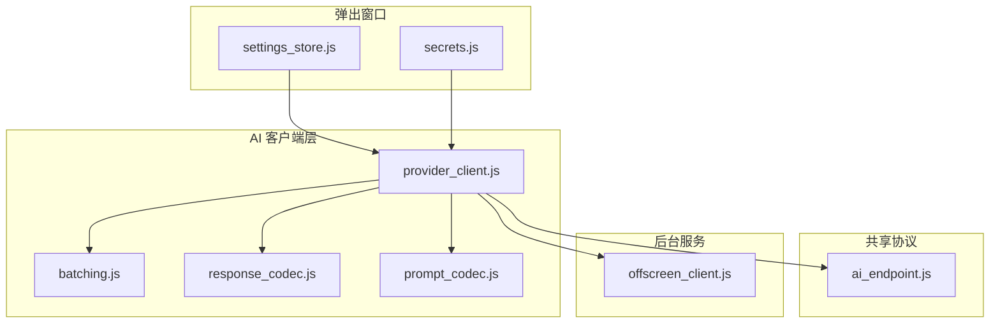
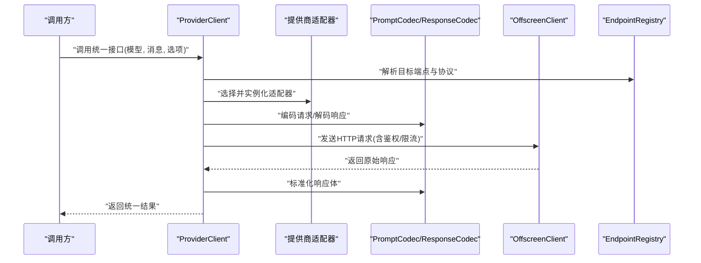
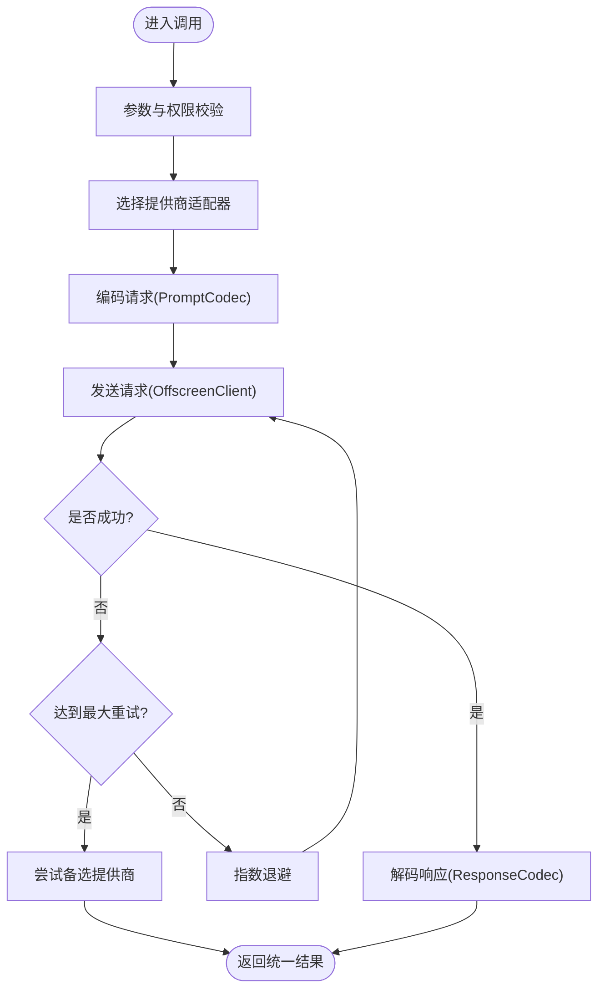
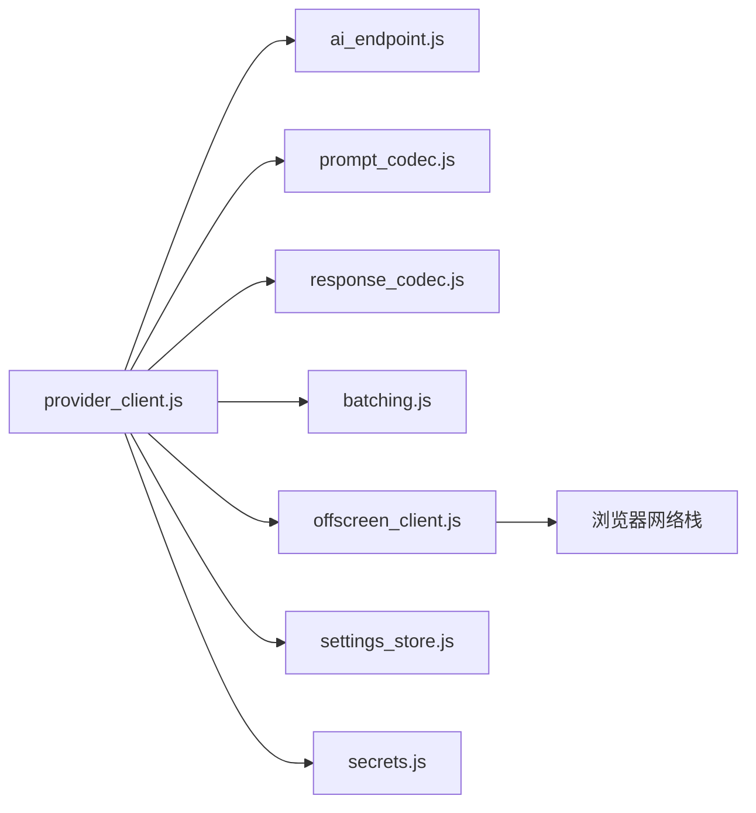

# 多提供商客户端

<cite>
**本文引用的文件**   
- [extension/ai/provider_client.js](file://extension/ai/provider_client.js)
- [extension/shared/ai_endpoint.js](file://extension/shared/ai_endpoint.js)
- [extension/ai/batching.js](file://extension/ai/batching.js)
- [extension/ai/response_codec.js](file://extension/ai/response_codec.js)
- [extension/ai/prompt_codec.js](file://extension/ai/prompt_codec.js)
- [extension/background/offscreen_client.js](file://extension/background/offscreen_client.js)
- [extension/popup/settings_store.js](file://extension/popup/settings_store.js)
- [extension/popup/secrets.js](file://extension/popup/secrets.js)
- [tests/test_extension_ai_provider_client.py](file://tests/test_extension_ai_provider_client.py)
- [tests/test_extension_shared_contracts.py](file://tests/test_extension_shared_contracts.py)
</cite>

## 目录
1. [简介](#简介)
2. [项目结构](#项目结构)
3. [核心组件](#核心组件)
4. [架构总览](#架构总览)
5. [详细组件分析](#详细组件分析)
6. [依赖关系分析](#依赖关系分析)
7. [性能考虑](#性能考虑)
8. [故障排查指南](#故障排查指南)
9. [结论](#结论)
10. [附录](#附录)

## 简介
本文件面向“多 AI 提供商客户端集成”的设计与实现，围绕统一接口设计模式展开，涵盖抽象层定义、提供商适配器与协议标准化、连接管理（认证、会话、重试）、提供商选择与负载均衡（动态路由与故障转移）、配置项（API 密钥、端点、速率限制），以及新增提供商的接入示例。文档以扩展侧的 JavaScript 实现为主，结合测试用例说明契约与行为预期。

## 项目结构
与多提供商客户端相关的代码主要分布在以下模块：
- 统一客户端与适配层：extension/ai/provider_client.js
- 共享协议与端点：extension/shared/ai_endpoint.js
- 请求批处理：extension/ai/batching.js
- 响应编解码：extension/ai/response_codec.js、extension/ai/prompt_codec.js
- 后台通信与隔离执行：extension/background/offscreen_client.js
- 设置与密钥存储：extension/popup/settings_store.js、extension/popup/secrets.js
- 契约与行为验证：tests/test_extension_ai_provider_client.py、tests/test_extension_shared_contracts.py

图表来源
- [extension/ai/provider_client.js](file://extension/ai/provider_client.js)
- [extension/shared/ai_endpoint.js](file://extension/shared/ai_endpoint.js)
- [extension/ai/batching.js](file://extension/ai/batching.js)
- [extension/ai/response_codec.js](file://extension/ai/response_codec.js)
- [extension/ai/prompt_codec.js](file://extension/ai/prompt_codec.js)
- [extension/background/offscreen_client.js](file://extension/background/offscreen_client.js)
- [extension/popup/settings_store.js](file://extension/popup/settings_store.js)
- [extension/popup/secrets.js](file://extension/popup/secrets.js)

章节来源
- [extension/ai/provider_client.js](file://extension/ai/provider_client.js)
- [extension/shared/ai_endpoint.js](file://extension/shared/ai_endpoint.js)
- [extension/ai/batching.js](file://extension/ai/batching.js)
- [extension/ai/response_codec.js](file://extension/ai/response_codec.js)
- [extension/ai/prompt_codec.js](file://extension/ai/prompt_codec.js)
- [extension/background/offscreen_client.js](file://extension/background/offscreen_client.js)
- [extension/popup/settings_store.js](file://extension/popup/settings_store.js)
- [extension/popup/secrets.js](file://extension/popup/secrets.js)

## 核心组件
- 统一客户端（ProviderClient）
  - 职责：对外暴露一致的调用接口；内部根据配置选择具体提供商适配器；负责鉴权注入、错误重试、超时控制、结果归一化。
  - 关键能力：
    - 基于配置的提供商选择与切换
    - 统一的请求/响应模型转换
    - 可插拔的适配器注册机制
    - 批处理与并发控制
    - 指标采集与可观测性钩子
- 共享端点与协议（ai_endpoint.js）
  - 职责：集中维护各提供商的标准端点、路径模板、查询参数与版本策略；提供解析与校验工具。
- 批处理器（batching.js）
  - 职责：将多个短请求合并为批量请求，降低网络开销；支持按提供商能力进行差异化合并。
- 编解码器（prompt_codec.js、response_codec.js）
  - 职责：将通用消息格式转换为特定提供商的输入/输出格式；处理流式与非流式差异。
- 后台通信（offscreen_client.js）
  - 职责：在 Offscreen Document 中发起网络请求，避免 Service Worker 生命周期限制；封装重试与错误上报。
- 设置与密钥（settings_store.js、secrets.js）
  - 职责：持久化保存提供商配置、API 密钥、速率限制等；提供安全访问与变更通知。

章节来源
- [extension/ai/provider_client.js](file://extension/ai/provider_client.js)
- [extension/shared/ai_endpoint.js](file://extension/shared/ai_endpoint.js)
- [extension/ai/batching.js](file://extension/ai/batching.js)
- [extension/ai/response_codec.js](file://extension/ai/response_codec.js)
- [extension/ai/prompt_codec.js](file://extension/ai/prompt_codec.js)
- [extension/background/offscreen_client.js](file://extension/background/offscreen_client.js)
- [extension/popup/settings_store.js](file://extension/popup/settings_store.js)
- [extension/popup/secrets.js](file://extension/popup/secrets.js)

## 架构总览
整体采用“统一接口 + 适配器”的分层架构：上层通过 ProviderClient 调用，底层由不同提供商适配器完成协议细节；共享协议与端点保证跨提供商的一致性；批处理与编解码提升效率与兼容性；后台通信保障稳定性与可用性。

图表来源
- [extension/ai/provider_client.js](file://extension/ai/provider_client.js)
- [extension/shared/ai_endpoint.js](file://extension/shared/ai_endpoint.js)
- [extension/ai/prompt_codec.js](file://extension/ai/prompt_codec.js)
- [extension/ai/response_codec.js](file://extension/ai/response_codec.js)
- [extension/background/offscreen_client.js](file://extension/background/offscreen_client.js)

## 详细组件分析

### 统一客户端与适配器（ProviderClient）
- 设计要点
  - 抽象层：定义统一的调用签名与错误模型，屏蔽提供商差异。
  - 适配器注册：通过工厂或注册表按需加载具体提供商实现。
  - 选择算法：基于配置优先级、健康度、延迟与配额剩余进行动态选择。
  - 重试与退避：对瞬态错误（如 429、5xx、网络抖动）实施指数退避与熔断。
  - 会话管理：维护上下文、历史消息与令牌计数，必要时自动截断或压缩。
- 关键流程
  - 请求进入后先做参数校验与鉴权注入，再根据目标提供商选择适配器。
  - 使用 PromptCodec 将通用消息转为提供商格式，调用后端后使用 ResponseCodec 归一化。
  - 失败时触发重试策略，若全部失败则回退到备选提供商或抛出聚合错误。

图表来源
- [extension/ai/provider_client.js](file://extension/ai/provider_client.js)
- [extension/ai/prompt_codec.js](file://extension/ai/prompt_codec.js)
- [extension/ai/response_codec.js](file://extension/ai/response_codec.js)
- [extension/background/offscreen_client.js](file://extension/background/offscreen_client.js)

章节来源
- [extension/ai/provider_client.js](file://extension/ai/provider_client.js)

### 共享端点与协议（ai_endpoint.js）
- 职责
  - 集中管理各提供商的 API 基础地址、路径模板、查询参数、版本前缀。
  - 提供端点解析、URL 构建与参数校验工具。
- 关键点
  - 支持按环境（开发/生产）切换端点。
  - 提供端点健康检查与可用性探测接口。
  - 对不兼容字段进行映射与降级处理。

章节来源
- [extension/shared/ai_endpoint.js](file://extension/shared/ai_endpoint.js)

### 批处理（batching.js）
- 职责
  - 将多次短请求合并为批量请求，减少握手与序列化开销。
  - 针对不支持批处理的提供商进行拆分与串行化。
- 关键点
  - 按提供商能力开关批处理。
  - 控制批次大小与等待窗口，避免尾部延迟放大。
  - 失败时仅重试失败的子任务，不影响其他批次。

章节来源
- [extension/ai/batching.js](file://extension/ai/batching.js)

### 编解码器（prompt_codec.js、response_codec.js）
- 职责
  - 将通用消息模型转换为各提供商的输入格式（包括系统提示、用户消息、工具调用等）。
  - 将各提供商的响应体（文本、函数调用、流式增量）转换为统一结构。
- 关键点
  - 支持非流式与流式两种模式。
  - 对缺失字段进行默认值填充与兼容处理。
  - 记录编解码前后统计信息用于诊断。

章节来源
- [extension/ai/prompt_codec.js](file://extension/ai/prompt_codec.js)
- [extension/ai/response_codec.js](file://extension/ai/response_codec.js)

### 后台通信（offscreen_client.js）
- 职责
  - 在 Offscreen Document 中发起 HTTP 请求，规避 Service Worker 生命周期限制。
  - 封装重试、超时、取消与错误分类。
- 关键点
  - 提供统一的错误码与诊断信息。
  - 支持请求级取消与幂等键。
  - 与 ProviderClient 协作实现全局重试与熔断。

章节来源
- [extension/background/offscreen_client.js](file://extension/background/offscreen_client.js)

### 设置与密钥（settings_store.js、secrets.js）
- 职责
  - 持久化提供商配置（端点、速率限制、功能开关）。
  - 安全存储 API 密钥并提供最小权限访问。
- 关键点
  - 变更事件通知，供运行时热更新。
  - 密钥加密存储与自动轮换提示。
  - 提供配置校验与默认值合并。

章节来源
- [extension/popup/settings_store.js](file://extension/popup/settings_store.js)
- [extension/popup/secrets.js](file://extension/popup/secrets.js)

## 依赖关系分析
- 耦合与内聚
  - ProviderClient 作为入口，低耦合地依赖编码器、端点注册表与后台通信。
  - 适配器通过统一协议与编码器交互，避免直接耦合到网络层。
- 外部依赖
  - 浏览器 Offscreen API 与 Fetch 网络栈。
  - 本地存储与加密存储用于配置与密钥。
- 潜在循环依赖
  - 通过接口与注册表解耦，避免模块间直接相互引用。

图表来源
- [extension/ai/provider_client.js](file://extension/ai/provider_client.js)
- [extension/shared/ai_endpoint.js](file://extension/shared/ai_endpoint.js)
- [extension/ai/prompt_codec.js](file://extension/ai/prompt_codec.js)
- [extension/ai/response_codec.js](file://extension/ai/response_codec.js)
- [extension/ai/batching.js](file://extension/ai/batching.js)
- [extension/background/offscreen_client.js](file://extension/background/offscreen_client.js)
- [extension/popup/settings_store.js](file://extension/popup/settings_store.js)
- [extension/popup/secrets.js](file://extension/popup/secrets.js)

章节来源
- [extension/ai/provider_client.js](file://extension/ai/provider_client.js)
- [extension/shared/ai_endpoint.js](file://extension/shared/ai_endpoint.js)
- [extension/ai/batching.js](file://extension/ai/batching.js)
- [extension/ai/response_codec.js](file://extension/ai/response_codec.js)
- [extension/ai/prompt_codec.js](file://extension/ai/prompt_codec.js)
- [extension/background/offscreen_client.js](file://extension/background/offscreen_client.js)
- [extension/popup/settings_store.js](file://extension/popup/settings_store.js)
- [extension/popup/secrets.js](file://extension/popup/secrets.js)

## 性能考虑
- 批处理与合并：合理设置批次大小与等待窗口，避免尾延迟放大。
- 连接复用：利用浏览器连接池，减少握手成本。
- 流式响应：优先使用流式以降低首字节延迟。
- 缓存与去重：对相同请求使用幂等键与短期缓存。
- 自适应限流：根据提供商返回的速率限制头动态调整并发与退避。

[本节为通用指导，无需源码引用]

## 故障排查指南
- 常见问题定位
  - 鉴权失败：检查密钥是否正确加载与有效期。
  - 429 限流：确认速率限制配置与退避策略生效。
  - 5xx 服务端错误：观察重试次数与熔断状态。
  - 超时：检查网络连通性与 Offscreen 页面状态。
- 诊断建议
  - 启用请求/响应日志与指标上报。
  - 使用健康检查端点验证提供商可用性。
  - 对比不同提供商的延迟与成功率，辅助路由决策。

章节来源
- [tests/test_extension_ai_provider_client.py](file://tests/test_extension_ai_provider_client.py)
- [tests/test_extension_shared_contracts.py](file://tests/test_extension_shared_contracts.py)

## 结论
通过统一接口与适配器模式，本项目实现了多 AI 提供商的无缝集成与动态路由。借助批处理、编解码与后台通信，系统在可用性与性能之间取得平衡。完善的配置与密钥管理、重试与熔断策略，使得系统具备较强的鲁棒性与可扩展性。

[本节为总结性内容，无需源码引用]

## 附录

### 支持的提供商与配置要点
- OpenAI
  - 端点：标准 Chat Completions 端点
  - 鉴权：Bearer Token
  - 特性：支持流式、函数调用、多模态（视模型而定）
  - 速率限制：依据配额与返回头动态调整
- Anthropic
  - 端点：Messages API
  - 鉴权：API Key
  - 特性：支持流式、系统提示、工具调用
  - 速率限制：按账户与模型维度限制

章节来源
- [extension/shared/ai_endpoint.js](file://extension/shared/ai_endpoint.js)
- [extension/popup/settings_store.js](file://extension/popup/settings_store.js)
- [extension/popup/secrets.js](file://extension/popup/secrets.js)

### 提供商选择与负载均衡
- 选择策略
  - 权重轮询：按配置权重分配流量。
  - 延迟感知：优先选择延迟较低的提供商。
  - 健康度：剔除不可用或高错误率的提供商。
  - 配额感知：在接近限额时降低权重或暂停路由。
- 故障转移
  - 主备切换：主提供商失败时自动切换到备用。
  - 熔断与恢复：连续失败后熔断，周期性探测恢复。

章节来源
- [extension/ai/provider_client.js](file://extension/ai/provider_client.js)

### 连接管理与错误重试
- 认证处理
  - 从密钥存储读取并按提供商要求注入到请求头或查询参数。
- 会话管理
  - 维护上下文与消息历史，必要时进行压缩或裁剪。
- 重试策略
  - 指数退避与抖动，区分瞬态与永久错误。
  - 支持请求级取消与幂等键。

章节来源
- [extension/background/offscreen_client.js](file://extension/background/offscreen_client.js)
- [extension/popup/secrets.js](file://extension/popup/secrets.js)

### 新增提供商接入步骤（示例）
- 步骤概览
  - 在端点注册表中添加新提供商的基础地址与路径模板。
  - 实现 PromptCodec 与 ResponseCodec 的适配逻辑。
  - 在 ProviderClient 中注册新适配器并配置默认权重与健康检查。
  - 在设置界面增加对应配置项（端点、密钥、速率限制）。
  - 编写单元测试覆盖编解码、重试与路由逻辑。
- 参考位置
  - 端点注册：extension/shared/ai_endpoint.js
  - 编解码：extension/ai/prompt_codec.js、extension/ai/response_codec.js
  - 客户端注册：extension/ai/provider_client.js
  - 设置与密钥：extension/popup/settings_store.js、extension/popup/secrets.js
  - 测试契约：tests/test_extension_shared_contracts.py、tests/test_extension_ai_provider_client.py

章节来源
- [extension/shared/ai_endpoint.js](file://extension/shared/ai_endpoint.js)
- [extension/ai/prompt_codec.js](file://extension/ai/prompt_codec.js)
- [extension/ai/response_codec.js](file://extension/ai/response_codec.js)
- [extension/ai/provider_client.js](file://extension/ai/provider_client.js)
- [extension/popup/settings_store.js](file://extension/popup/settings_store.js)
- [extension/popup/secrets.js](file://extension/popup/secrets.js)
- [tests/test_extension_shared_contracts.py](file://tests/test_extension_shared_contracts.py)
- [tests/test_extension_ai_provider_client.py](file://tests/test_extension_ai_provider_client.py)