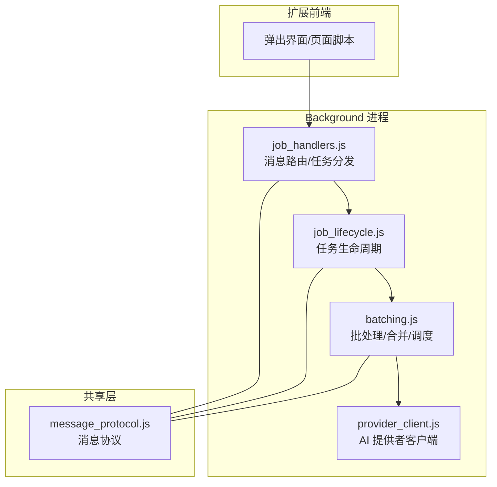
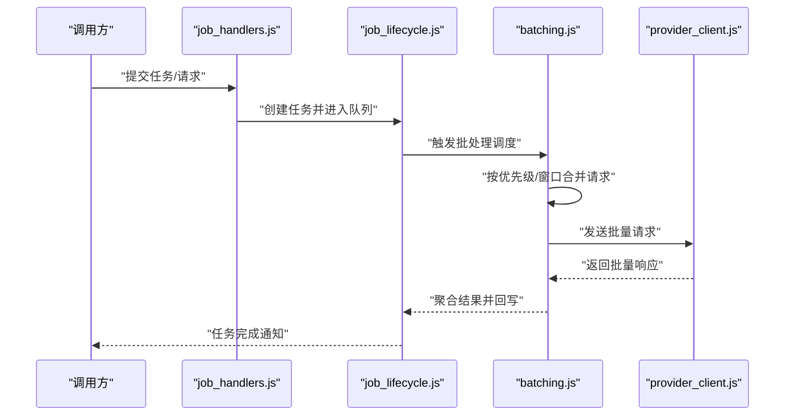
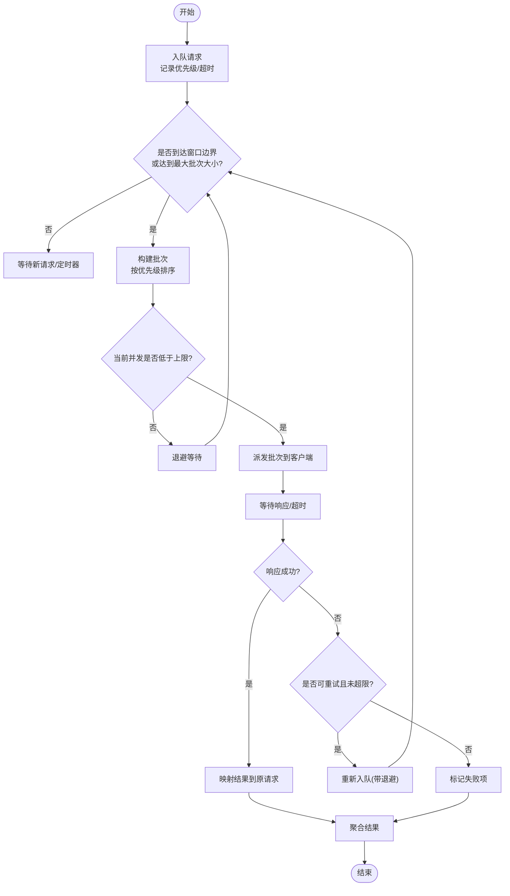
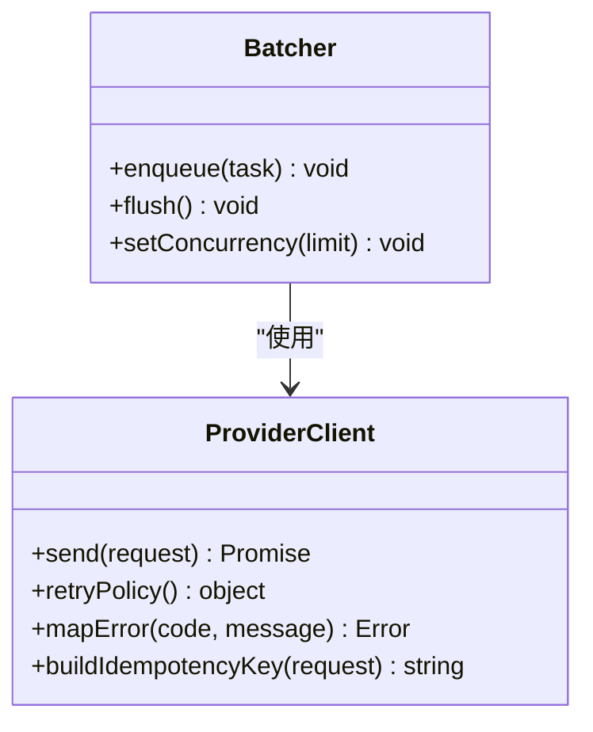
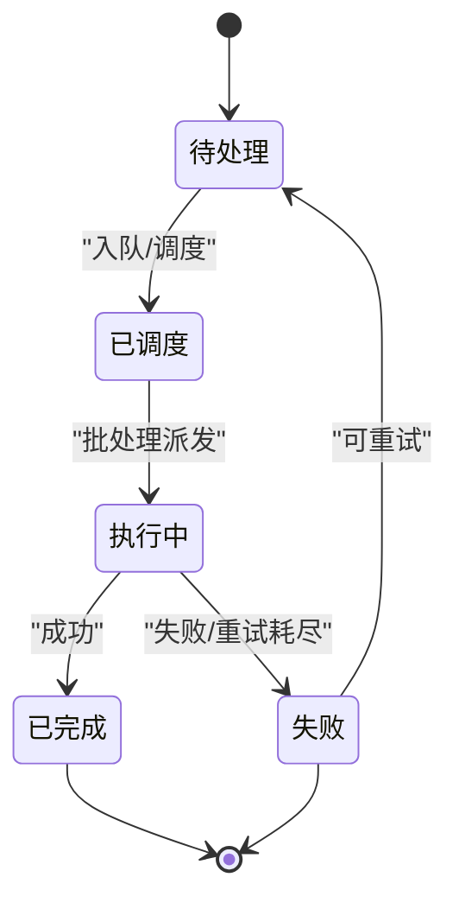
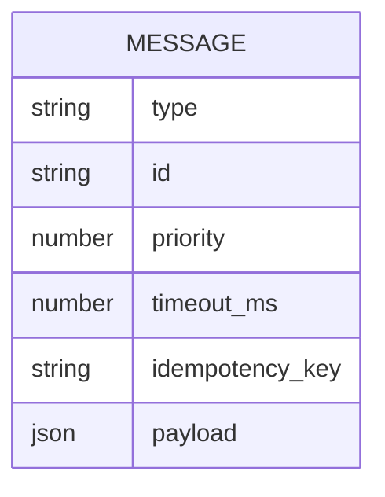
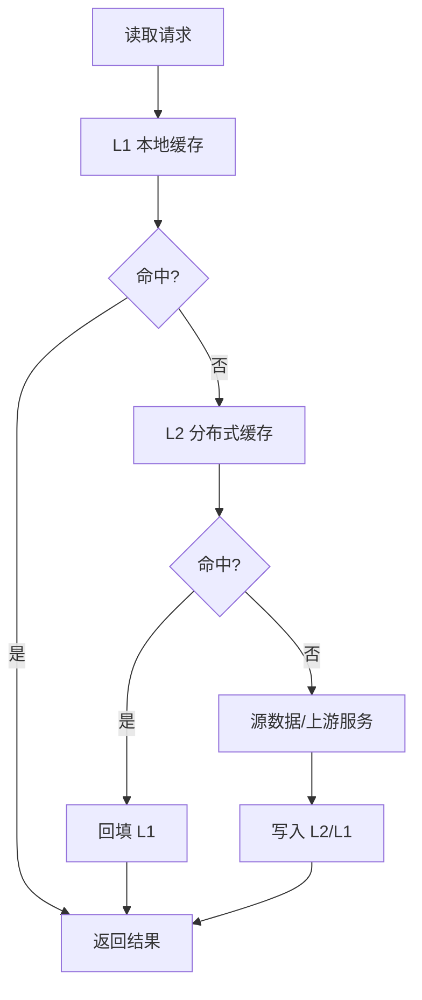
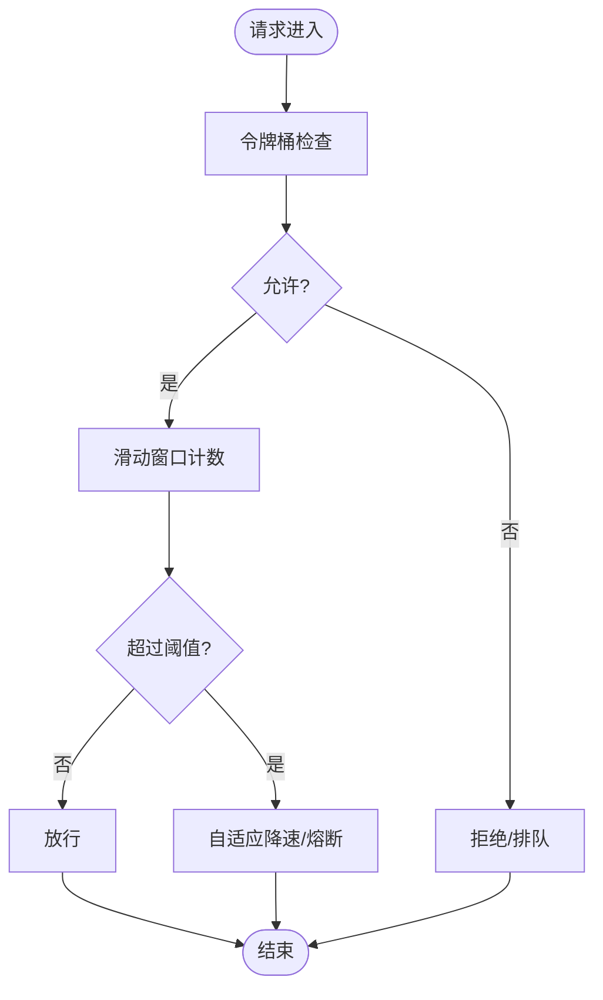
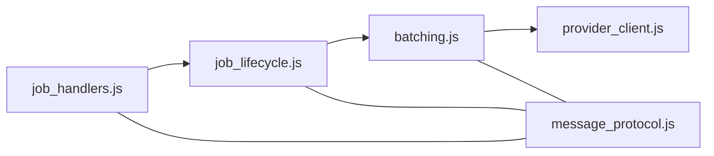

# 批处理优化

<cite>
**本文引用的文件**   
- [extension/ai/batching.js](file://extension/ai/batching.js)
- [extension/ai/provider_client.js](file://extension/ai/provider_client.js)
- [extension/background/job_lifecycle.js](file://extension/background/job_lifecycle.js)
- [extension/background/job_handlers.js](file://extension/background/job_handlers.js)
- [extension/shared/message_protocol.js](file://extension/shared/message_protocol.js)
- [tests/test_extension_ai_batching.js](file://tests/test_extension_ai_batching.js)
</cite>

## 目录
1. [简介](#简介)
2. [项目结构](#项目结构)
3. [核心组件](#核心组件)
4. [架构总览](#架构总览)
5. [详细组件分析](#详细组件分析)
6. [依赖关系分析](#依赖关系分析)
7. [性能考虑](#性能考虑)
8. [故障排查指南](#故障排查指南)
9. [结论](#结论)
10. [附录](#附录)

## 简介
本文件围绕“批处理优化”主题，结合仓库中扩展侧的批处理与任务执行相关代码，系统化阐述以下能力：
- 请求合并算法：批量大小控制、优先级队列与并发管理
- 缓存策略：多级缓存架构、失效策略与一致性保证
- 速率限制与流量控制：令牌桶、滑动窗口与自适应调整
- 批处理生命周期：任务调度、执行监控与结果聚合
- 性能调优：内存、网络与 CPU 利用率的优化建议
- 配置示例与基准测试思路：面向 AI 服务调用效率提升的实践方法

说明：本文所有实现细节均基于仓库现有源码进行分析与归纳；未在当前仓库中发现服务端侧的缓存或限速实现，因此相关内容以扩展端可观测到的行为与接口为主，并结合通用工程实践给出建议。

## 项目结构
与批处理相关的核心位置集中在扩展的 ai 模块与 background 任务系统：
- extension/ai/batching.js：批处理调度与合并逻辑
- extension/ai/provider_client.js：AI 提供者客户端（负责实际网络请求）
- extension/background/job_lifecycle.js：任务生命周期管理（创建、调度、完成）
- extension/background/job_handlers.js：消息路由与任务处理器
- extension/shared/message_protocol.js：跨上下文消息协议定义
- tests/test_extension_ai_batching.js：批处理行为的测试用例

图表来源
- [extension/background/job_handlers.js](file://extension/background/job_handlers.js)
- [extension/background/job_lifecycle.js](file://extension/background/job_lifecycle.js)
- [extension/ai/batching.js](file://extension/ai/batching.js)
- [extension/ai/provider_client.js](file://extension/ai/provider_client.js)
- [extension/shared/message_protocol.js](file://extension/shared/message_protocol.js)

章节来源
- [extension/ai/batching.js](file://extension/ai/batching.js)
- [extension/ai/provider_client.js](file://extension/ai/provider_client.js)
- [extension/background/job_lifecycle.js](file://extension/background/job_lifecycle.js)
- [extension/background/job_handlers.js](file://extension/background/job_handlers.js)
- [extension/shared/message_protocol.js](file://extension/shared/message_protocol.js)

## 核心组件
- 批处理调度器（batching.js）
  - 职责：接收来自上层任务的请求，进行请求合并、批量组装、优先级排序与并发控制，并驱动 provider_client 发起批量调用。
  - 关键机制：批量窗口、最大批次大小、优先级队列、并发上限、重试与超时。
- AI 提供者客户端（provider_client.js）
  - 职责：封装对具体 AI 服务的 HTTP 调用，统一错误码与响应格式，提供幂等键与重试策略。
- 任务生命周期（job_lifecycle.js）
  - 职责：维护任务状态机（创建、排队、执行、完成、失败），协调批处理入口与回调聚合。
- 消息协议（message_protocol.js）
  - 职责：定义跨上下文消息类型、字段约定与校验规则，确保批处理与任务系统的稳定通信。

章节来源
- [extension/ai/batching.js](file://extension/ai/batching.js)
- [extension/ai/provider_client.js](file://extension/ai/provider_client.js)
- [extension/background/job_lifecycle.js](file://extension/background/job_lifecycle.js)
- [extension/shared/message_protocol.js](file://extension/shared/message_protocol.js)

## 架构总览
下图展示了从任务创建到批处理执行再到结果聚合的整体流程，以及各组件之间的交互关系。

图表来源
- [extension/background/job_handlers.js](file://extension/background/job_handlers.js)
- [extension/background/job_lifecycle.js](file://extension/background/job_lifecycle.js)
- [extension/ai/batching.js](file://extension/ai/batching.js)
- [extension/ai/provider_client.js](file://extension/ai/provider_client.js)

## 详细组件分析

### 批处理调度器（batching.js）
- 请求合并算法
  - 批量窗口：在时间窗口内累积请求，达到阈值后触发一次批量调用，降低网络往返次数。
  - 最大批次大小：限制单次批量的条目数，避免单批过大导致延迟抖动与内存峰值。
  - 优先级队列：为不同任务分配优先级，高优先级任务优先入队并在窗口边界前尽量提前触发。
  - 并发管理：限制同时运行的批次数，防止资源争用与下游限流。
- 执行与重试
  - 超时控制：为每个批次设置整体超时，避免长时间阻塞。
  - 失败重试：对部分失败项进行有限次重试，区分可重试与不可重试错误。
- 结果聚合
  - 将批量响应映射回原始请求，保持顺序与关联关系，支持部分成功与部分失败的组合结果。

图表来源
- [extension/ai/batching.js](file://extension/ai/batching.js)

章节来源
- [extension/ai/batching.js](file://extension/ai/batching.js)

### AI 提供者客户端（provider_client.js）
- 请求封装
  - 统一构造请求头、路径与参数，支持幂等键以避免重复提交。
  - 序列化/反序列化处理，适配不同提供者的差异。
- 错误处理
  - 标准化错误码与消息，便于上层重试与降级。
  - 区分网络错误、业务错误与限流错误，采取不同策略。
- 重试与退避
  - 指数退避与抖动，避免雪崩效应。
  - 针对 429/5xx 等场景的可配置重试策略。

图表来源
- [extension/ai/provider_client.js](file://extension/ai/provider_client.js)
- [extension/ai/batching.js](file://extension/ai/batching.js)

章节来源
- [extension/ai/provider_client.js](file://extension/ai/provider_client.js)

### 任务生命周期（job_lifecycle.js）
- 状态机
  - 常见状态：待处理、已调度、执行中、已完成、失败。
  - 状态转换由事件驱动，确保幂等与可恢复性。
- 与批处理的集成
  - 任务入队时携带优先级与超时信息。
  - 批处理完成后，根据映射关系更新对应任务状态。
- 监控与日志
  - 记录关键指标：排队时长、执行时长、失败率、重试次数。
  - 暴露查询接口供上层统计与告警。

图表来源
- [extension/background/job_lifecycle.js](file://extension/background/job_lifecycle.js)

章节来源
- [extension/background/job_lifecycle.js](file://extension/background/job_lifecycle.js)

### 消息协议（message_protocol.js）
- 消息类型
  - 任务提交、批处理触发、结果回传、状态查询等。
- 字段约定
  - 统一的 id、优先级、超时、幂等键、负载结构等。
- 校验与兼容
  - 版本化字段，向后兼容旧版本消息。
  - 缺失必填字段时的快速失败与友好错误提示。

图表来源
- [extension/shared/message_protocol.js](file://extension/shared/message_protocol.js)

章节来源
- [extension/shared/message_protocol.js](file://extension/shared/message_protocol.js)

### 概念性概览：缓存策略（多级缓存、失效与一致性）
说明：当前仓库未发现显式的缓存实现，以下为面向 AI 服务调用的通用多级缓存设计建议，可作为后续扩展方向。
- 多级缓存架构
  - L1 本地缓存：内存级，TTL 短，命中率高，适合热点请求。
  - L2 分布式缓存：如 Redis，用于跨实例共享，TTL 中等。
  - L3 持久化缓存：对象存储或数据库，用于离线分析与回放。
- 失效策略
  - TTL 过期、LRU/LFU 淘汰、主动失效（发布订阅）。
  - 基于版本号或哈希的强一致失效。
- 一致性保证
  - 读写穿透：先查缓存，未命中再读源数据并回填。
  - 双写一致性：更新源数据与缓存原子化，或使用延迟双删。
  - 最终一致性：通过消息队列异步同步缓存。

[此图为概念性流程图，不直接映射到具体源码文件，故无图表来源]

### 概念性概览：速率限制与流量控制（令牌桶、滑动窗口、自适应）
说明：当前仓库未见服务端限速实现，以下为通用方案建议，可在客户端或服务端部署。
- 令牌桶
  - 固定速率生成令牌，请求消耗令牌，不足则排队或拒绝。
- 滑动窗口
  - 统计最近时间窗内的请求数，超过阈值则限流。
- 自适应调整
  - 基于错误率、延迟与下游反馈动态调整速率。
  - 结合背压与熔断，保护系统稳定性。

[此图为概念性流程图，不直接映射到具体源码文件，故无图表来源]

## 依赖关系分析
- 组件耦合
  - job_handlers.js 与 job_lifecycle.js 通过消息协议解耦，职责清晰。
  - batching.js 依赖 provider_client.js 完成实际网络调用。
- 外部依赖
  - 浏览器/Edge 扩展 API（消息通道、后台进程、计时器等）。
  - AI 服务提供方 HTTP 接口。

图表来源
- [extension/background/job_handlers.js](file://extension/background/job_handlers.js)
- [extension/background/job_lifecycle.js](file://extension/background/job_lifecycle.js)
- [extension/ai/batching.js](file://extension/ai/batching.js)
- [extension/ai/provider_client.js](file://extension/ai/provider_client.js)
- [extension/shared/message_protocol.js](file://extension/shared/message_protocol.js)

章节来源
- [extension/background/job_handlers.js](file://extension/background/job_handlers.js)
- [extension/background/job_lifecycle.js](file://extension/background/job_lifecycle.js)
- [extension/ai/batching.js](file://extension/ai/batching.js)
- [extension/ai/provider_client.js](file://extension/ai/provider_client.js)
- [extension/shared/message_protocol.js](file://extension/shared/message_protocol.js)

## 性能考虑
- 内存使用优化
  - 控制批量大小与并发上限，避免一次性加载过多请求体。
  - 及时释放临时对象引用，避免长生命周期闭包持有大对象。
- 网络请求优化
  - 合理设置批量窗口与最大批次大小，平衡吞吐与时延。
  - 启用连接复用与压缩，减少握手开销。
  - 针对 429/5xx 实施指数退避与抖动，避免雪崩。
- CPU 利用率提升
  - 将耗时计算移出主线程（Web Worker/Offscreen），避免阻塞 UI。
  - 批处理内部采用惰性排序与增量合并，减少全量重排。
- 监控与度量
  - 采集关键指标：排队时长、批处理耗时、成功率、重试率、P95/P99 延迟。
  - 基于指标自动调节批量窗口与并发上限。

[本节为通用指导，不直接分析具体文件，故无章节来源]

## 故障排查指南
- 常见问题定位
  - 批处理堆积：检查批量窗口与并发上限是否过小，观察队列长度与丢弃率。
  - 频繁重试：确认错误类型是否为可重试，检查退避策略与上限。
  - 结果错乱：核对幂等键与结果映射逻辑，确保顺序与关联正确。
- 日志与调试
  - 在关键路径打印结构化日志（任务 id、优先级、批次大小、耗时、错误码）。
  - 使用测试用例复现问题，逐步缩小范围。
- 参考测试
  - 批处理行为验证可参考测试文件中的断言与用例组织方式。

章节来源
- [tests/test_extension_ai_batching.js](file://tests/test_extension_ai_batching.js)

## 结论
通过对批处理调度、任务生命周期与消息协议的梳理，可以形成一套可扩展、可观测、可优化的批处理体系。建议在现有基础上引入多级缓存与速率限制，配合完善的监控与自动化调参，进一步提升 AI 服务调用的吞吐与稳定性。

[本节为总结性内容，不直接分析具体文件，故无章节来源]

## 附录
- 配置示例（建议）
  - 批量窗口：例如 50ms~200ms，依据延迟与吞吐目标调整。
  - 最大批次大小：例如 10~50，依据模型输入尺寸与内存预算设定。
  - 并发上限：例如 2~8，依据后端 QPS 与连接池容量设定。
  - 重试策略：最大重试次数 2~3，指数退避初始 100ms，最大 2s，抖动 20%。
- 基准测试思路
  - 场景一：低延迟优先，小批量窗口+较小批次大小，关注 P95 延迟。
  - 场景二：高吞吐优先，较大数据批+较高并发，关注吞吐与错误率。
  - 场景三：不稳定网络，开启重试与退避，关注成功率与平均耗时。
  - 指标：QPS、P50/P95/P99 延迟、CPU/内存占用、重试率、失败率。

[本节为通用指导，不直接分析具体文件，故无章节来源]