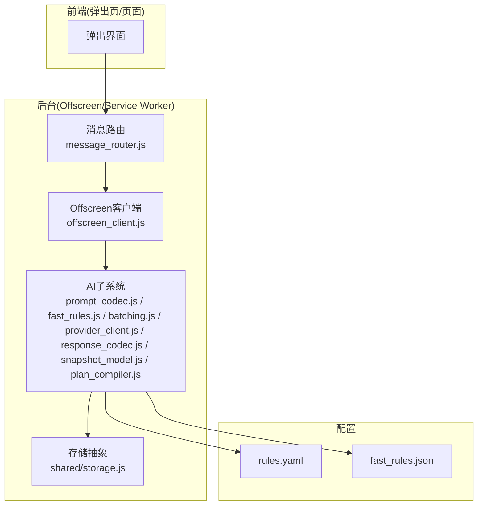
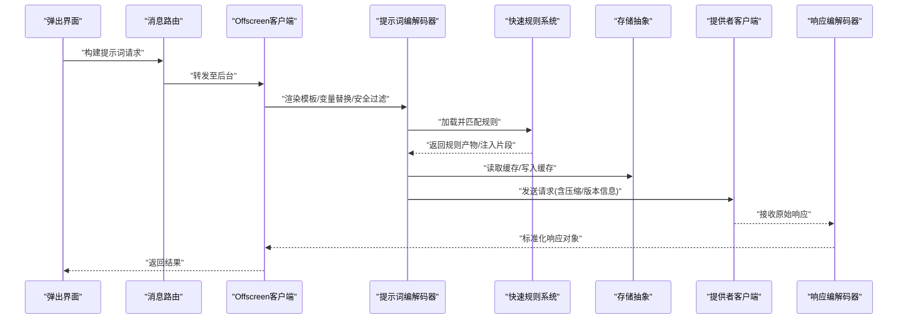
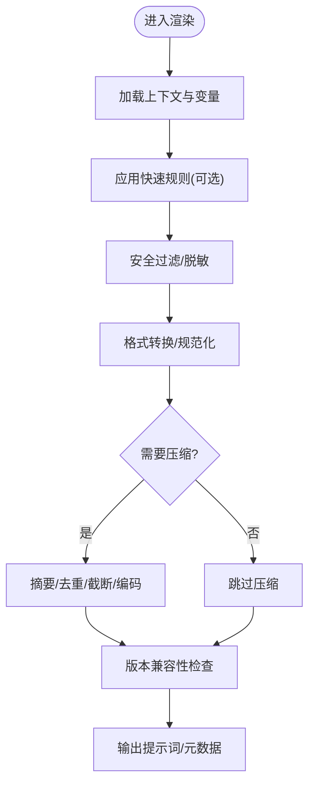
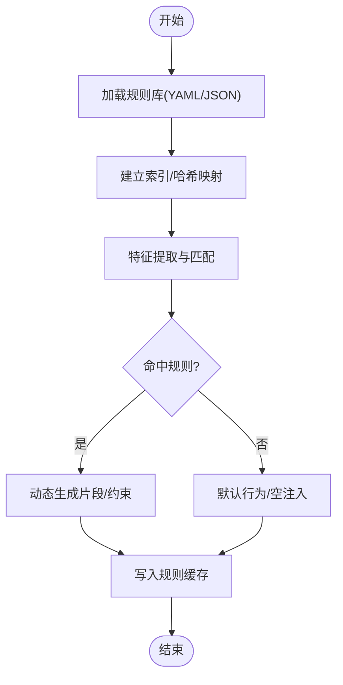
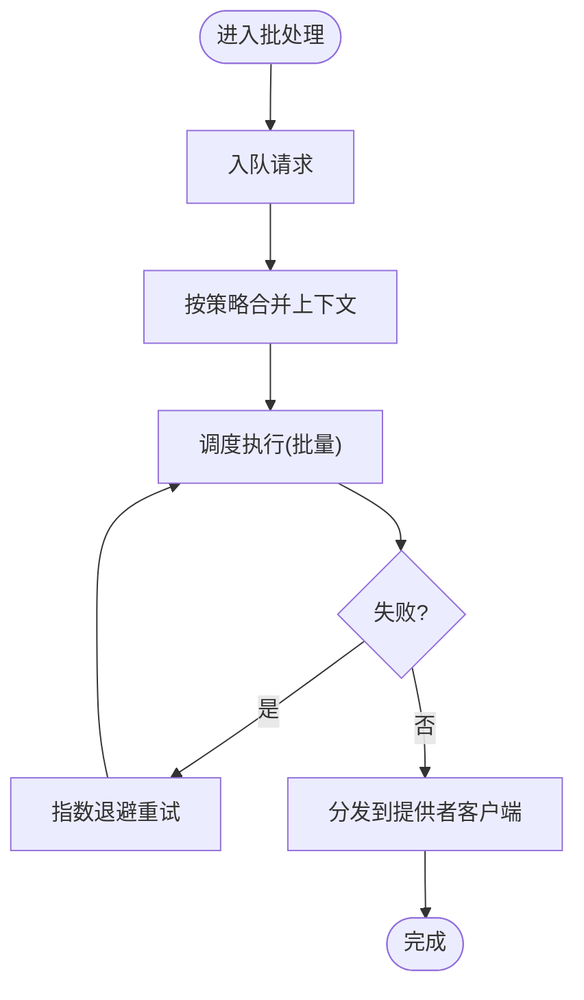
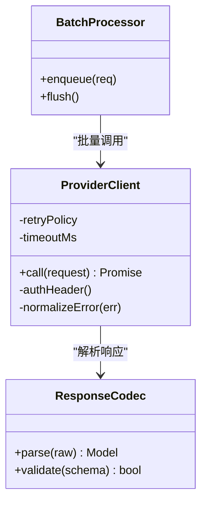
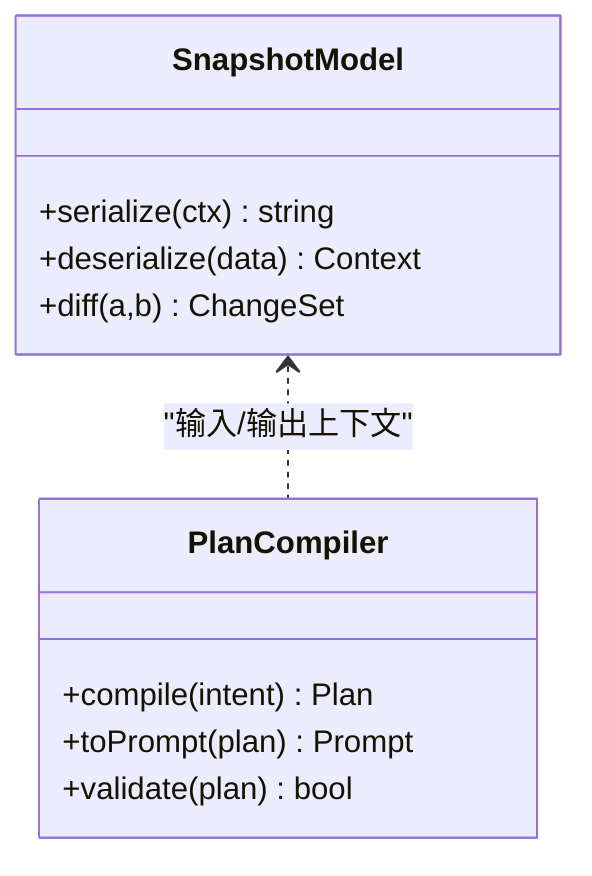
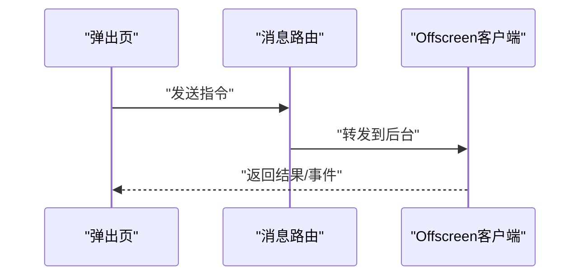
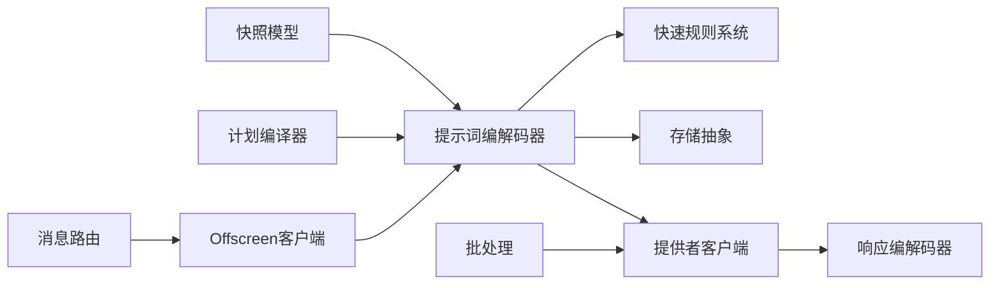

# 提示词工程系统

<cite>
**本文引用的文件**   
- [extension/ai/prompt_codec.js](file://extension/ai/prompt_codec.js)
- [extension/ai/fast_rules.js](file://extension/ai/fast_rules.js)
- [extension/ai/batching.js](file://extension/ai/batching.js)
- [extension/ai/provider_client.js](file://extension/ai/provider_client.js)
- [extension/ai/response_codec.js](file://extension/ai/response_codec.js)
- [extension/ai/snapshot_model.js](file://extension/ai/snapshot_model.js)
- [extension/ai/plan_compiler.js](file://extension/ai/plan_compiler.js)
- [extension/background/message_router.js](file://extension/background/message_router.js)
- [extension/background/offscreen_client.js](file://extension/background/offscreen_client.js)
- [extension/shared/message_protocol.js](file://extension/shared/message_protocol.js)
- [extension/shared/storage.js](file://extension/shared/storage.js)
- [config/rules.yaml](file://config/rules.yaml)
- [extension/fast_rules.json](file://extension/fast_rules.json)
- [tests/test_extension_ai_prompt_codec.js](file://tests/test_extension_ai_prompt_codec.js)
- [tests/test_extension_fast_rules.js](file://tests/test_extension_fast_rules.js)
- [tests/test_prompt_sanitization.js](file://tests/test_prompt_sanitization.js)
</cite>

## 目录
1. [简介](#简介)
2. [项目结构](#项目结构)
3. [核心组件](#核心组件)
4. [架构总览](#架构总览)
5. [详细组件分析](#详细组件分析)
6. [依赖关系分析](#依赖关系分析)
7. [性能考虑](#性能考虑)
8. [故障排查指南](#故障排查指南)
9. [结论](#结论)
10. [附录](#附录)

## 简介
本文件面向“提示词工程系统”的设计与实现，聚焦以下目标：
- 提示词模板设计原则与最佳实践（上下文管理、变量替换、安全过滤）
- 快速规则系统工作原理（预定义规则库、匹配算法、动态生成）
- 提示词编解码器（格式转换、压缩优化、版本兼容）
- 缓存策略与性能优化（内存管理、磁盘持久化、热更新）
- 调试工具使用（日志记录、性能分析、错误诊断）
- 实战示例（高效模板与自定义规则）

## 项目结构
本项目采用浏览器扩展与后台服务协同的架构。提示词工程相关能力集中在 extension/ai 子模块，并通过消息协议与 background/offscreen 通信；配置与规则通过 YAML/JSON 提供；测试覆盖关键路径。

图表来源
- [extension/background/message_router.js](file://extension/background/message_router.js)
- [extension/background/offscreen_client.js](file://extension/background/offscreen_client.js)
- [extension/ai/prompt_codec.js](file://extension/ai/prompt_codec.js)
- [extension/ai/fast_rules.js](file://extension/ai/fast_rules.js)
- [extension/ai/batching.js](file://extension/ai/batching.js)
- [extension/ai/provider_client.js](file://extension/ai/provider_client.js)
- [extension/ai/response_codec.js](file://extension/ai/response_codec.js)
- [extension/ai/snapshot_model.js](file://extension/ai/snapshot_model.js)
- [extension/ai/plan_compiler.js](file://extension/ai/plan_compiler.js)
- [extension/shared/storage.js](file://extension/shared/storage.js)
- [config/rules.yaml](file://config/rules.yaml)
- [extension/fast_rules.json](file://extension/fast_rules.json)

章节来源
- [extension/background/message_router.js](file://extension/background/message_router.js)
- [extension/background/offscreen_client.js](file://extension/background/offscreen_client.js)
- [extension/shared/message_protocol.js](file://extension/shared/message_protocol.js)
- [extension/shared/storage.js](file://extension/shared/storage.js)
- [config/rules.yaml](file://config/rules.yaml)
- [extension/fast_rules.json](file://extension/fast_rules.json)

## 核心组件
- 提示词编解码器：负责模板渲染、变量替换、格式转换、压缩与版本兼容处理。
- 快速规则系统：加载预定义规则库，执行匹配与动态生成，输出结构化约束或注入片段。
- 批处理与调度：聚合请求、合并上下文、降低调用开销。
- 提供者客户端：封装外部模型/服务的调用契约与重试、超时等策略。
- 响应编解码器：统一解析不同返回格式，校验并转换为内部模型。
- 快照模型：对上下文快照进行序列化/反序列化，支持跨进程传输。
- 计划编译器：将高层意图编译为可执行的提示词任务序列。
- 消息路由与 Offscreen 客户端：在弹出页与后台之间传递指令与数据。
- 存储抽象：提供键值存取接口，用于缓存与持久化。

章节来源
- [extension/ai/prompt_codec.js](file://extension/ai/prompt_codec.js)
- [extension/ai/fast_rules.js](file://extension/ai/fast_rules.js)
- [extension/ai/batching.js](file://extension/ai/batching.js)
- [extension/ai/provider_client.js](file://extension/ai/provider_client.js)
- [extension/ai/response_codec.js](file://extension/ai/response_codec.js)
- [extension/ai/snapshot_model.js](file://extension/ai/snapshot_model.js)
- [extension/ai/plan_compiler.js](file://extension/ai/plan_compiler.js)
- [extension/background/message_router.js](file://extension/background/message_router.js)
- [extension/background/offscreen_client.js](file://extension/background/offscreen_client.js)
- [extension/shared/storage.js](file://extension/shared/storage.js)

## 架构总览
下图展示从用户触发到最终返回结果的端到端流程，突出提示词工程的关键环节。

图表来源
- [extension/background/message_router.js](file://extension/background/message_router.js)
- [extension/background/offscreen_client.js](file://extension/background/offscreen_client.js)
- [extension/ai/prompt_codec.js](file://extension/ai/prompt_codec.js)
- [extension/ai/fast_rules.js](file://extension/ai/fast_rules.js)
- [extension/shared/storage.js](file://extension/shared/storage.js)
- [extension/ai/provider_client.js](file://extension/ai/provider_client.js)
- [extension/ai/response_codec.js](file://extension/ai/response_codec.js)

## 详细组件分析

### 提示词编解码器
职责
- 模板渲染：基于上下文与变量表生成最终提示词。
- 格式转换：在不同表示形式间转换（如 JSON/YAML/纯文本）。
- 压缩优化：对长上下文进行摘要、去重、截断与编码压缩。
- 版本兼容：根据 schema 版本选择渲染路径与迁移逻辑。
- 安全过滤：移除敏感字段、脱敏与白名单校验。

关键流程

图表来源
- [extension/ai/prompt_codec.js](file://extension/ai/prompt_codec.js)
- [extension/ai/fast_rules.js](file://extension/ai/fast_rules.js)
- [extension/shared/storage.js](file://extension/shared/storage.js)

章节来源
- [extension/ai/prompt_codec.js](file://extension/ai/prompt_codec.js)
- [tests/test_extension_ai_prompt_codec.js](file://tests/test_extension_ai_prompt_codec.js)
- [tests/test_prompt_sanitization.js](file://tests/test_prompt_sanitization.js)

### 快速规则系统
职责
- 规则库加载：从 YAML/JSON 加载预定义规则集。
- 规则匹配：基于上下文特征、标签、阈值等进行匹配。
- 动态生成：根据匹配结果生成注入片段、约束或参数。
- 缓存命中：复用已计算规则结果，减少重复计算。

匹配与生成流程

图表来源
- [extension/ai/fast_rules.js](file://extension/ai/fast_rules.js)
- [config/rules.yaml](file://config/rules.yaml)
- [extension/fast_rules.json](file://extension/fast_rules.json)
- [extension/shared/storage.js](file://extension/shared/storage.js)

章节来源
- [extension/ai/fast_rules.js](file://extension/ai/fast_rules.js)
- [config/rules.yaml](file://config/rules.yaml)
- [extension/fast_rules.json](file://extension/fast_rules.json)
- [tests/test_extension_fast_rules.js](file://tests/test_extension_fast_rules.js)

### 批处理与调度
职责
- 请求聚合：将多个小请求合并，降低网络与模型调用成本。
- 上下文合并：按主题/会话维度合并上下文，避免冗余。
- 优先级与退避：高优任务优先，失败指数退避重试。

图表来源
- [extension/ai/batching.js](file://extension/ai/batching.js)
- [extension/ai/provider_client.js](file://extension/ai/provider_client.js)

章节来源
- [extension/ai/batching.js](file://extension/ai/batching.js)
- [extension/ai/provider_client.js](file://extension/ai/provider_client.js)

### 提供者客户端
职责
- 统一调用：封装对外部模型的 HTTP/gRPC 调用。
- 重试与超时：配置最大重试次数、超时时间、退避策略。
- 鉴权与签名：注入认证头、签名与限流令牌。
- 错误归一化：将不同提供商的错误码映射为统一错误模型。

图表来源
- [extension/ai/provider_client.js](file://extension/ai/provider_client.js)
- [extension/ai/response_codec.js](file://extension/ai/response_codec.js)
- [extension/ai/batching.js](file://extension/ai/batching.js)

章节来源
- [extension/ai/provider_client.js](file://extension/ai/provider_client.js)
- [extension/ai/response_codec.js](file://extension/ai/response_codec.js)
- [extension/ai/batching.js](file://extension/ai/batching.js)

### 快照模型与计划编译器
职责
- 快照模型：对上下文/状态进行序列化，便于跨进程传输与缓存。
- 计划编译器：将高层任务分解为步骤，生成对应的提示词与执行顺序。

图表来源
- [extension/ai/snapshot_model.js](file://extension/ai/snapshot_model.js)
- [extension/ai/plan_compiler.js](file://extension/ai/plan_compiler.js)

章节来源
- [extension/ai/snapshot_model.js](file://extension/ai/snapshot_model.js)
- [extension/ai/plan_compiler.js](file://extension/ai/plan_compiler.js)

### 消息路由与 Offscreen 客户端
职责
- 消息路由：在弹出页与后台之间转发命令与事件。
- Offscreen 客户端：封装后台 API，屏蔽跨上下文细节。

图表来源
- [extension/background/message_router.js](file://extension/background/message_router.js)
- [extension/background/offscreen_client.js](file://extension/background/offscreen_client.js)
- [extension/shared/message_protocol.js](file://extension/shared/message_protocol.js)

章节来源
- [extension/background/message_router.js](file://extension/background/message_router.js)
- [extension/background/offscreen_client.js](file://extension/background/offscreen_client.js)
- [extension/shared/message_protocol.js](file://extension/shared/message_protocol.js)

## 依赖关系分析
- 低耦合：各 AI 子模块通过明确接口交互，避免直接依赖具体实现。
- 配置驱动：规则与策略由 YAML/JSON 驱动，便于热更新与灰度发布。
- 存储抽象：所有持久化操作通过 storage 抽象层，便于切换后端。

图表来源
- [extension/ai/prompt_codec.js](file://extension/ai/prompt_codec.js)
- [extension/ai/fast_rules.js](file://extension/ai/fast_rules.js)
- [extension/ai/batching.js](file://extension/ai/batching.js)
- [extension/ai/provider_client.js](file://extension/ai/provider_client.js)
- [extension/ai/response_codec.js](file://extension/ai/response_codec.js)
- [extension/ai/snapshot_model.js](file://extension/ai/snapshot_model.js)
- [extension/ai/plan_compiler.js](file://extension/ai/plan_compiler.js)
- [extension/background/message_router.js](file://extension/background/message_router.js)
- [extension/background/offscreen_client.js](file://extension/background/offscreen_client.js)
- [extension/shared/storage.js](file://extension/shared/storage.js)

章节来源
- [extension/ai/prompt_codec.js](file://extension/ai/prompt_codec.js)
- [extension/ai/fast_rules.js](file://extension/ai/fast_rules.js)
- [extension/ai/batching.js](file://extension/ai/batching.js)
- [extension/ai/provider_client.js](file://extension/ai/provider_client.js)
- [extension/ai/response_codec.js](file://extension/ai/response_codec.js)
- [extension/ai/snapshot_model.js](file://extension/ai/snapshot_model.js)
- [extension/ai/plan_compiler.js](file://extension/ai/plan_compiler.js)
- [extension/background/message_router.js](file://extension/background/message_router.js)
- [extension/background/offscreen_client.js](file://extension/background/offscreen_client.js)
- [extension/shared/storage.js](file://extension/shared/storage.js)

## 性能考虑
- 缓存策略
  - 内存缓存：热点提示词、规则产物、最近上下文快照。
  - 磁盘持久化：长期缓存与离线可用，结合过期策略与容量上限。
  - 热更新：规则变更时增量刷新，避免全量重建。
- 压缩优化
  - 上下文去重与摘要，保留关键语义片段。
  - 二进制编码与分块传输，减少体积与延迟。
- 批处理与并发控制
  - 合并相似请求，共享上下文，降低重复计算。
  - 限制并发度，避免资源争用与抖动。
- 版本兼容
  - 通过 schema 版本选择渲染路径，向后兼容旧格式。
  - 渐进式迁移，保证平滑升级。

[本节为通用指导，不直接分析具体文件]

## 故障排查指南
- 日志记录
  - 在提示词渲染、规则匹配、网络调用与响应解析阶段输出结构化日志。
  - 包含请求 ID、耗时、缓存命中情况与错误堆栈。
- 性能分析
  - 统计各阶段耗时分布，识别瓶颈（如规则匹配、压缩、网络）。
  - 监控缓存命中率与回源比例。
- 错误诊断
  - 统一错误码与分类（网络、鉴权、超时、格式、业务）。
  - 提供最小复现信息与上下文快照，便于定位问题。

章节来源
- [extension/ai/prompt_codec.js](file://extension/ai/prompt_codec.js)
- [extension/ai/fast_rules.js](file://extension/ai/fast_rules.js)
- [extension/ai/provider_client.js](file://extension/ai/provider_client.js)
- [extension/ai/response_codec.js](file://extension/ai/response_codec.js)
- [extension/shared/storage.js](file://extension/shared/storage.js)

## 结论
本系统围绕“提示词工程”构建了从模板渲染、规则匹配、压缩优化到调用与解析的完整链路。通过配置驱动与缓存策略，系统在可扩展性与性能之间取得平衡。建议在生产环境持续完善日志与指标，逐步引入更细粒度的规则与压缩策略，以提升整体质量与稳定性。

[本节为总结性内容，不直接分析具体文件]

## 附录

### 提示词模板设计原则与最佳实践
- 上下文管理
  - 分层组织：角色设定、任务描述、约束条件、参考样例。
  - 边界清晰：明确输入范围与输出格式，避免歧义。
- 变量替换
  - 命名规范：使用稳定键名，避免运行时冲突。
  - 类型校验：确保变量类型与长度符合预期。
- 安全过滤
  - 白名单机制：仅允许必要字段参与渲染。
  - 脱敏策略：对敏感信息进行掩码或丢弃。
- 版本兼容
  - 显式声明版本，提供迁移脚本与降级路径。

章节来源
- [extension/ai/prompt_codec.js](file://extension/ai/prompt_codec.js)
- [tests/test_prompt_sanitization.js](file://tests/test_prompt_sanitization.js)

### 快速规则系统工作要点
- 预定义规则库
  - YAML/JSON 双格式支持，便于人类编辑与机器解析。
  - 规则条目包含匹配条件、动作与优先级。
- 匹配算法
  - 基于特征向量与权重打分，支持模糊匹配与阈值控制。
- 动态生成
  - 根据命中规则组合注入片段，支持条件分支与函数式扩展。

章节来源
- [extension/ai/fast_rules.js](file://extension/ai/fast_rules.js)
- [config/rules.yaml](file://config/rules.yaml)
- [extension/fast_rules.json](file://extension/fast_rules.json)
- [tests/test_extension_fast_rules.js](file://tests/test_extension_fast_rules.js)

### 提示词编解码器实现要点
- 格式转换
  - 支持多输入输出格式，统一中间表示。
- 压缩优化
  - 去重、摘要、截断与编码压缩，兼顾可读性与体积。
- 版本兼容
  - 以 schema 版本为核心，提供迁移与回滚能力。

章节来源
- [extension/ai/prompt_codec.js](file://extension/ai/prompt_codec.js)
- [tests/test_extension_ai_prompt_codec.js](file://tests/test_extension_ai_prompt_codec.js)

### 缓存策略与热更新
- 内存管理
  - LRU/LFU 策略，设置上限与淘汰阈值。
- 磁盘持久化
  - 原子写入与校验，防止损坏。
- 热更新
  - 监听配置变更，增量刷新规则与模板。

章节来源
- [extension/shared/storage.js](file://extension/shared/storage.js)
- [extension/ai/fast_rules.js](file://extension/ai/fast_rules.js)

### 调试工具使用方法
- 日志记录
  - 开启详细日志级别，导出结构化日志以便分析。
- 性能分析
  - 采集关键路径耗时，绘制热力图与瀑布图。
- 错误诊断
  - 捕获异常并附带上下文快照，便于复现与修复。

章节来源
- [extension/ai/prompt_codec.js](file://extension/ai/prompt_codec.js)
- [extension/ai/provider_client.js](file://extension/ai/provider_client.js)
- [extension/ai/response_codec.js](file://extension/ai/response_codec.js)

### 实战示例：创建高效提示词模板与自定义规则
- 高效模板
  - 明确任务目标与输出格式，拆分复杂任务为子步骤。
  - 使用变量注入动态内容，保持模板简洁与可复用。
- 自定义规则
  - 在规则库中新增条目，定义匹配条件与注入片段。
  - 通过单元测试验证规则命中与生成结果。

章节来源
- [extension/ai/fast_rules.js](file://extension/ai/fast_rules.js)
- [config/rules.yaml](file://config/rules.yaml)
- [extension/fast_rules.json](file://extension/fast_rules.json)
- [tests/test_extension_fast_rules.js](file://tests/test_extension_fast_rules.js)