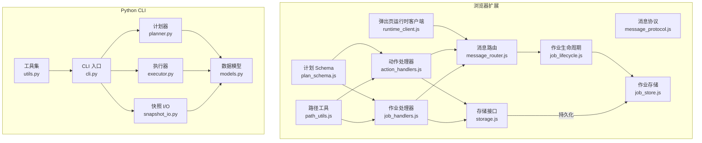
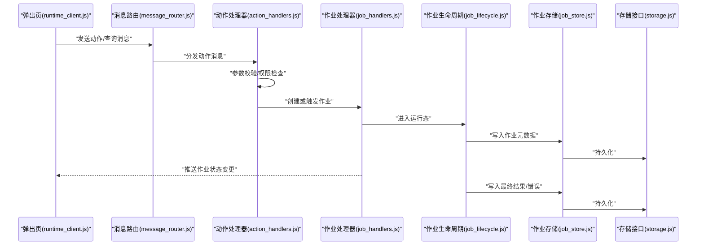
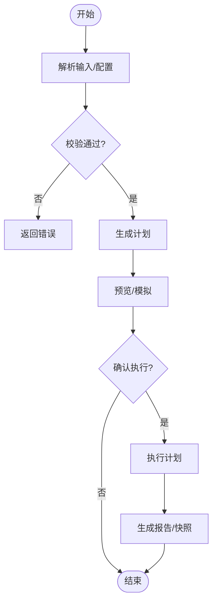
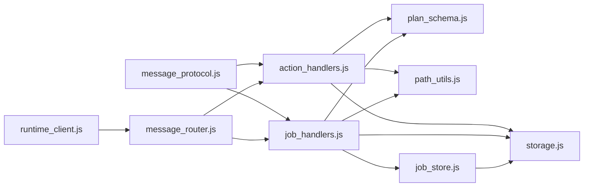

# API 参考

<cite>
**本文引用的文件**   
- [extension/shared/message_protocol.js](file://extension/shared/message_protocol.js)
- [extension/shared/path_utils.js](file://extension/shared/path_utils.js)
- [extension/shared/plan_schema.js](file://extension/shared/plan_schema.js)
- [extension/shared/storage.js](file://extension/shared/storage.js)
- [extension/background/action_handlers.js](file://extension/background/action_handlers.js)
- [extension/background/job_handlers.js](file://extension/background/job_handlers.js)
- [extension/background/job_lifecycle.js](file://extension/background/job_lifecycle.js)
- [extension/background/job_store.js](file://extension/background/job_store.js)
- [extension/background/message_router.js](file://extension/background/message_router.js)
- [extension/popup/runtime_client.js](file://extension/popup/runtime_client.js)
- [src/bookmark_advisor/models.py](file://src/bookmark_advisor/models.py)
- [src/bookmark_advisor/planner.py](file://src/bookmark_advisor/planner.py)
- [src/bookmark_advisor/executor.py](file://src/bookmark_advisor/executor.py)
- [src/bookmark_advisor/cli.py](file://src/bookmark_advisor/cli.py)
- [src/bookmark_advisor/snapshot_io.py](file://src/bookmark_advisor/snapshot_io.py)
- [src/bookmark_advisor/utils.py](file://src/bookmark_advisor/utils.py)
</cite>

## 目录
1. [简介](#简介)
2. [项目结构](#项目结构)
3. [核心组件](#核心组件)
4. [架构总览](#架构总览)
5. [详细组件分析](#详细组件分析)
6. [依赖关系分析](#依赖关系分析)
7. [性能考虑](#性能考虑)
8. [故障排查指南](#故障排查指南)
9. [结论](#结论)
10. [附录](#附录)

## 简介
本 API 参考文档面向浏览器扩展与 Python CLI 的开发者，系统性说明以下能力：
- 浏览器扩展内部 API：存储接口、路径工具、消息协议、计划 Schema。
- Python CLI 公共 API：核心模块函数接口、类定义与数据结构。
- 数据模型：书签节点、重组计划、作业状态等实体的字段与约束。
- 消息协议：消息格式、事件类型与错误码规范。
- 配置接口：设置项、验证规则与默认值。
- 代码示例：各 API 的调用方式与返回值处理（以“代码片段路径”形式给出）。
- 版本兼容性与迁移指南。

## 项目结构
本项目由两部分组成：
- 浏览器扩展（JavaScript）：负责与浏览器书签系统交互、编排执行计划、持久化作业状态、通过消息协议与 UI 和后台服务通信。
- Python CLI（Python）：提供命令行入口、计划生成与校验、快照读写、执行器与报告输出。

图表来源
- [extension/shared/message_protocol.js](file://extension/shared/message_protocol.js)
- [extension/shared/path_utils.js](file://extension/shared/path_utils.js)
- [extension/shared/plan_schema.js](file://extension/shared/plan_schema.js)
- [extension/shared/storage.js](file://extension/shared/storage.js)
- [extension/background/action_handlers.js](file://extension/background/action_handlers.js)
- [extension/background/job_handlers.js](file://extension/background/job_handlers.js)
- [extension/background/job_lifecycle.js](file://extension/background/job_lifecycle.js)
- [extension/background/job_store.js](file://extension/background/job_store.js)
- [extension/background/message_router.js](file://extension/background/message_router.js)
- [extension/popup/runtime_client.js](file://extension/popup/runtime_client.js)
- [src/bookmark_advisor/models.py](file://src/bookmark_advisor/models.py)
- [src/bookmark_advisor/planner.py](file://src/bookmark_advisor/planner.py)
- [src/bookmark_advisor/executor.py](file://src/bookmark_advisor/executor.py)
- [src/bookmark_advisor/cli.py](file://src/bookmark_advisor/cli.py)
- [src/bookmark_advisor/snapshot_io.py](file://src/bookmark_advisor/snapshot_io.py)
- [src/bookmark_advisor/utils.py](file://src/bookmark_advisor/utils.py)

章节来源
- [extension/shared/message_protocol.js](file://extension/shared/message_protocol.js)
- [extension/shared/path_utils.js](file://extension/shared/path_utils.js)
- [extension/shared/plan_schema.js](file://extension/shared/plan_schema.js)
- [extension/shared/storage.js](file://extension/shared/storage.js)
- [extension/background/action_handlers.js](file://extension/background/action_handlers.js)
- [extension/background/job_handlers.js](file://extension/background/job_handlers.js)
- [extension/background/job_lifecycle.js](file://extension/background/job_lifecycle.js)
- [extension/background/job_store.js](file://extension/background/job_store.js)
- [extension/background/message_router.js](file://extension/background/message_router.js)
- [extension/popup/runtime_client.js](file://extension/popup/runtime_client.js)
- [src/bookmark_advisor/models.py](file://src/bookmark_advisor/models.py)
- [src/bookmark_advisor/planner.py](file://src/bookmark_advisor/planner.py)
- [src/bookmark_advisor/executor.py](file://src/bookmark_advisor/executor.py)
- [src/bookmark_advisor/cli.py](file://src/bookmark_advisor/cli.py)
- [src/bookmark_advisor/snapshot_io.py](file://src/bookmark_advisor/snapshot_io.py)
- [src/bookmark_advisor/utils.py](file://src/bookmark_advisor/utils.py)

## 核心组件
本节概述关键 API 的职责与边界，便于快速定位使用点。

- 消息协议（message_protocol.js）
  - 定义跨上下文的消息类型、事件名、载荷结构与错误码常量。
  - 供 action_handlers、job_handlers、message_router、popup runtime_client 统一消费。
- 路径工具（path_utils.js）
  - 提供书签路径解析、规范化与匹配工具，供动作与作业处理器使用。
- 计划 Schema（plan_schema.js）
  - 定义重组计划的 JSON Schema 与校验逻辑，确保计划可被安全编译与执行。
- 存储接口（storage.js）
  - 封装浏览器本地存储访问，提供键空间管理、批量读写与事务语义。
- 动作处理器（action_handlers.js）
  - 接收来自 UI 或外部调用的动作请求，进行参数校验并调度执行。
- 作业处理器（job_handlers.js）
  - 负责作业的创建、更新、取消与结果回传，协调生命周期与持久化。
- 作业生命周期（job_lifecycle.js）
  - 维护作业状态机（新建、运行中、完成、失败、取消），驱动状态转换。
- 作业存储（job_store.js）
  - 基于 storage.js 对作业元数据与进度进行持久化。
- 消息路由（message_router.js）
  - 将消息按类型分发到对应处理器，实现解耦与可扩展性。
- 弹出页运行时客户端（runtime_client.js）
  - 为 popup 页面提供与后台服务的异步通信封装。

章节来源
- [extension/shared/message_protocol.js](file://extension/shared/message_protocol.js)
- [extension/shared/path_utils.js](file://extension/shared/path_utils.js)
- [extension/shared/plan_schema.js](file://extension/shared/plan_schema.js)
- [extension/shared/storage.js](file://extension/shared/storage.js)
- [extension/background/action_handlers.js](file://extension/background/action_handlers.js)
- [extension/background/job_handlers.js](file://extension/background/job_handlers.js)
- [extension/background/job_lifecycle.js](file://extension/background/job_lifecycle.js)
- [extension/background/job_store.js](file://extension/background/job_store.js)
- [extension/background/message_router.js](file://extension/background/message_router.js)
- [extension/popup/runtime_client.js](file://extension/popup/runtime_client.js)

## 架构总览
下图展示扩展内部与 Python CLI 之间的职责划分与交互边界。

图表来源
- [extension/popup/runtime_client.js](file://extension/popup/runtime_client.js)
- [extension/background/message_router.js](file://extension/background/message_router.js)
- [extension/background/action_handlers.js](file://extension/background/action_handlers.js)
- [extension/background/job_handlers.js](file://extension/background/job_handlers.js)
- [extension/background/job_lifecycle.js](file://extension/background/job_lifecycle.js)
- [extension/background/job_store.js](file://extension/background/job_store.js)
- [extension/shared/storage.js](file://extension/shared/storage.js)

## 详细组件分析

### 消息协议（message_protocol.js）
- 作用
  - 统一定义消息类型、事件名称、载荷结构与错误码常量，作为扩展内各模块通信契约。
- 关键约定
  - 消息对象包含：类型、时间戳、来源、目标、载荷、追踪 ID。
  - 事件类型覆盖：作业生命周期事件、计划执行事件、系统通知等。
  - 错误码采用枚举常量，区分业务错误与系统错误。
- 使用建议
  - 新增事件需在协议层集中声明，避免散落在各模块。
  - 载荷结构应遵循最小必要原则，必要时引入子模式。

章节来源
- [extension/shared/message_protocol.js](file://extension/shared/message_protocol.js)

### 路径工具（path_utils.js）
- 作用
  - 提供书签路径解析、规范化、层级提取与匹配工具。
- 典型能力
  - 路径拆分与合并、相对路径计算、通配符匹配、非法字符过滤。
- 使用建议
  - 所有涉及路径比较的逻辑均应通过该模块，保证一致性。
  - 输入需先经规范化再参与匹配，避免大小写与分隔符差异导致误判。

章节来源
- [extension/shared/path_utils.js](file://extension/shared/path_utils.js)

### 计划 Schema（plan_schema.js）
- 作用
  - 定义重组计划的 JSON Schema 与校验流程，确保计划可被安全编译与执行。
- 关键要素
  - 计划根对象字段、步骤数组、步骤类型枚举、条件表达式、副作用白名单。
  - 校验失败时返回结构化错误信息，便于前端提示与重试。
- 使用建议
  - 在计划提交前强制走一次 schema 校验。
  - 对未知字段采取拒绝策略，防止向后不兼容。

章节来源
- [extension/shared/plan_schema.js](file://extension/shared/plan_schema.js)

### 存储接口（storage.js）
- 作用
  - 封装浏览器本地存储访问，提供键空间管理、批量读写与事务语义。
- 关键能力
  - 命名空间隔离、增量更新、并发安全、失败重试与降级。
- 使用建议
  - 所有持久化操作均通过该接口，禁止直接调用底层 API。
  - 大对象写入建议分片或压缩。

章节来源
- [extension/shared/storage.js](file://extension/shared/storage.js)

### 动作处理器（action_handlers.js）
- 作用
  - 接收来自 UI 或外部调用的动作请求，进行参数校验并调度执行。
- 典型动作
  - 创建重组计划、启动执行、暂停/恢复、取消、查询状态。
- 错误处理
  - 参数校验失败返回明确错误码；执行异常记录日志并上报。

章节来源
- [extension/background/action_handlers.js](file://extension/background/action_handlers.js)

### 作业处理器（job_handlers.js）
- 作用
  - 负责作业的创建、更新、取消与结果回传，协调生命周期与持久化。
- 关键流程
  - 接收动作 -> 校验计划 -> 初始化作业 -> 派发执行 -> 汇总结果。
- 并发控制
  - 同一计划实例串行执行，避免重复任务。

章节来源
- [extension/background/job_handlers.js](file://extension/background/job_handlers.js)

### 作业生命周期（job_lifecycle.js）
- 作用
  - 维护作业状态机（新建、运行中、完成、失败、取消），驱动状态转换。
- 状态转换
  - 仅允许合法边转移，非法转移抛出错误并记录审计日志。
- 超时与重试
  - 支持可配置的重试次数与退避策略。

章节来源
- [extension/background/job_lifecycle.js](file://extension/background/job_lifecycle.js)

### 作业存储（job_store.js）
- 作用
  - 基于 storage.js 对作业元数据与进度进行持久化。
- 设计要点
  - 原子写入、幂等更新、增量快照。
- 查询优化
  - 提供按状态、时间范围、计划 ID 的索引查询。

章节来源
- [extension/background/job_store.js](file://extension/background/job_store.js)

### 消息路由（message_router.js）
- 作用
  - 将消息按类型分发到对应处理器，实现解耦与可扩展性。
- 扩展点
  - 注册/注销处理器、优先级队列、超时与熔断。

章节来源
- [extension/background/message_router.js](file://extension/background/message_router.js)

### 弹出页运行时客户端（runtime_client.js）
- 作用
  - 为 popup 页面提供与后台服务的异步通信封装。
- 特性
  - 自动重连、去抖、错误重试、超时控制。
- 使用建议
  - 所有 UI 与后台交互均通过该客户端，避免直接调用 runtime API。

章节来源
- [extension/popup/runtime_client.js](file://extension/popup/runtime_client.js)

### Python CLI 公共 API

#### 数据模型（models.py）
- 角色
  - 定义书签节点、重组计划、作业状态等核心实体。
- 主要实体
  - 书签节点：标识、标题、URL、父节点、排序、标签等。
  - 重组计划：目标分组、操作步骤、条件、副作用声明。
  - 作业状态：ID、计划引用、状态、进度、错误信息、时间戳。
- 约束
  - 必填字段校验、唯一性约束、枚举值限制、长度与格式限制。

章节来源
- [src/bookmark_advisor/models.py](file://src/bookmark_advisor/models.py)

#### 计划器（planner.py）
- 角色
  - 根据输入规则与当前书签树生成重组计划。
- 接口
  - 生成计划、预检冲突、模拟执行、输出计划摘要。
- 输出
  - 符合 plan_schema 的计划对象，附带依赖图与风险评估。

章节来源
- [src/bookmark_advisor/planner.py](file://src/bookmark_advisor/planner.py)

#### 执行器（executor.py）
- 角色
  - 将计划转换为可执行步骤序列，并在浏览器环境中执行。
- 能力
  - 步骤编排、错误恢复、回滚、进度上报。
- 集成
  - 通过消息协议与扩展后端交互。

章节来源
- [src/bookmark_advisor/executor.py](file://src/bookmark_advisor/executor.py)

#### CLI 入口（cli.py）
- 角色
  - 提供命令行子命令：生成计划、预览、执行、导出快照、查看作业。
- 选项
  - 配置文件路径、输出格式、是否只读模式、并行度等。
- 退出码
  - 成功、参数错误、执行失败、网络错误等。

章节来源
- [src/bookmark_advisor/cli.py](file://src/bookmark_advisor/cli.py)

#### 快照 I/O（snapshot_io.py）
- 角色
  - 读取/写入书签快照，支持多种格式与压缩。
- 能力
  - 增量快照、差异对比、导入导出、校验完整性。

章节来源
- [src/bookmark_advisor/snapshot_io.py](file://src/bookmark_advisor/snapshot_io.py)

#### 工具集（utils.py）
- 角色
  - 通用工具：日志、时间格式化、路径处理、重试装饰器等。
- 使用
  - 被 CLI、计划器、执行器广泛复用。

章节来源
- [src/bookmark_advisor/utils.py](file://src/bookmark_advisor/utils.py)

### 概念总览
下图为概念层面的工作流示意，用于帮助理解整体协作关系。

[本图为概念流程图，无需图表来源]

## 依赖关系分析
- 耦合与内聚
  - 消息协议与路由高度内聚，处理器之间松耦合。
  - 存储接口抽象了底层实现，提升可测试性与可替换性。
- 外部依赖
  - 浏览器 API（书签、本地存储、runtime）。
  - Python 标准库与第三方序列化/校验库。
- 循环依赖
  - 通过消息路由与事件总线避免直接循环引用。

图表来源
- [extension/shared/message_protocol.js](file://extension/shared/message_protocol.js)
- [extension/shared/plan_schema.js](file://extension/shared/plan_schema.js)
- [extension/shared/path_utils.js](file://extension/shared/path_utils.js)
- [extension/shared/storage.js](file://extension/shared/storage.js)
- [extension/background/action_handlers.js](file://extension/background/action_handlers.js)
- [extension/background/job_handlers.js](file://extension/background/job_handlers.js)
- [extension/background/job_store.js](file://extension/background/job_store.js)
- [extension/background/message_router.js](file://extension/background/message_router.js)
- [extension/popup/runtime_client.js](file://extension/popup/runtime_client.js)

章节来源
- [extension/shared/message_protocol.js](file://extension/shared/message_protocol.js)
- [extension/shared/plan_schema.js](file://extension/shared/plan_schema.js)
- [extension/shared/path_utils.js](file://extension/shared/path_utils.js)
- [extension/shared/storage.js](file://extension/shared/storage.js)
- [extension/background/action_handlers.js](file://extension/background/action_handlers.js)
- [extension/background/job_handlers.js](file://extension/background/job_handlers.js)
- [extension/background/job_store.js](file://extension/background/job_store.js)
- [extension/background/message_router.js](file://extension/background/message_router.js)
- [extension/popup/runtime_client.js](file://extension/popup/runtime_client.js)

## 性能考虑
- 批量操作
  - 优先使用批量写入与增量更新，减少 IO 次数。
- 缓存与索引
  - 对高频查询建立内存索引，定期持久化。
- 超时与限流
  - 为长耗时操作设置超时与重试上限，避免阻塞主线程。
- 序列化开销
  - 大对象采用压缩或分块传输，降低带宽占用。

[本节为通用指导，无需章节来源]

## 故障排查指南
- 常见问题
  - 消息未到达：检查路由注册与消息类型是否一致。
  - 作业卡住：核对生命周期状态机与持久化落盘是否成功。
  - 计划校验失败：对照 plan_schema 的错误信息进行修正。
- 诊断手段
  - 启用调试日志，关注错误码与堆栈。
  - 导出快照与作业历史，复现问题。
- 恢复策略
  - 使用最近快照回滚，清理中间状态后重试。

章节来源
- [extension/shared/message_protocol.js](file://extension/shared/message_protocol.js)
- [extension/shared/plan_schema.js](file://extension/shared/plan_schema.js)
- [extension/background/job_lifecycle.js](file://extension/background/job_lifecycle.js)
- [extension/background/job_store.js](file://extension/background/job_store.js)

## 结论
本参考文档梳理了扩展内部 API 与 Python CLI 的公共接口，明确了数据模型、消息协议与配置约束，提供了架构图与流程图辅助理解。建议在新增功能时严格遵循现有契约，保持向后兼容与可观测性。

[本节为总结，无需章节来源]

## 附录

### 数据模型定义（Python）
- 书签节点
  - 字段：标识、标题、URL、父节点、排序、标签、创建/更新时间等。
  - 约束：标识唯一、URL 格式合法、父节点存在性校验。
- 重组计划
  - 字段：目标分组、步骤列表、条件、副作用声明、元数据。
  - 约束：步骤顺序有效、无环依赖、副作用在白名单内。
- 作业状态
  - 字段：作业 ID、计划引用、状态、进度、错误信息、时间戳。
  - 约束：状态转换合法、错误信息非空当状态为失败。

章节来源
- [src/bookmark_advisor/models.py](file://src/bookmark_advisor/models.py)

### 消息协议规范
- 消息格式
  - 类型、时间戳、来源、目标、载荷、追踪 ID。
- 事件类型
  - 作业生命周期事件、计划执行事件、系统通知等。
- 错误码
  - 业务错误与系统错误分类，具体编码见协议常量。

章节来源
- [extension/shared/message_protocol.js](file://extension/shared/message_protocol.js)

### 配置接口
- 设置项
  - 存储命名空间、重试次数、超时时间、日志级别等。
- 验证规则
  - 必填项检查、取值范围、正则匹配。
- 默认值
  - 合理默认值保障开箱即用，同时允许覆盖。

章节来源
- [extension/shared/storage.js](file://extension/shared/storage.js)
- [extension/shared/plan_schema.js](file://extension/shared/plan_schema.js)

### 代码示例（以“代码片段路径”形式）
- 在弹出页中发送动作消息
  - 参考：[extension/popup/runtime_client.js](file://extension/popup/runtime_client.js)
- 在后台处理动作并创建作业
  - 参考：[extension/background/action_handlers.js](file://extension/background/action_handlers.js)
  - 参考：[extension/background/job_handlers.js](file://extension/background/job_handlers.js)
- 校验并编译计划
  - 参考：[extension/shared/plan_schema.js](file://extension/shared/plan_schema.js)
- 持久化作业状态
  - 参考：[extension/background/job_store.js](file://extension/background/job_store.js)
  - 参考：[extension/shared/storage.js](file://extension/shared/storage.js)
- 使用 Python CLI 生成与执行计划
  - 参考：[src/bookmark_advisor/cli.py](file://src/bookmark_advisor/cli.py)
  - 参考：[src/bookmark_advisor/planner.py](file://src/bookmark_advisor/planner.py)
  - 参考：[src/bookmark_advisor/executor.py](file://src/bookmark_advisor/executor.py)
  - 参考：[src/bookmark_advisor/snapshot_io.py](file://src/bookmark_advisor/snapshot_io.py)

### API 版本兼容性与迁移指南
- 兼容性原则
  - 新增字段默认可选且带默认值；废弃字段保留一段时间并提供迁移脚本。
- 迁移步骤
  - 升级协议常量与 Schema；更新处理器对旧版本的兼容分支；发布迁移工具。
- 回滚策略
  - 保留旧版本二进制与配置，支持一键回滚。

[本节为通用指导，无需章节来源]