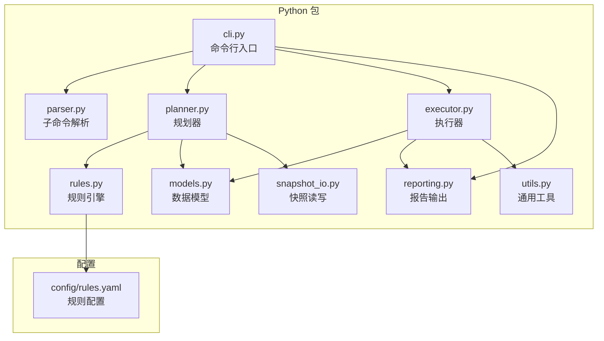
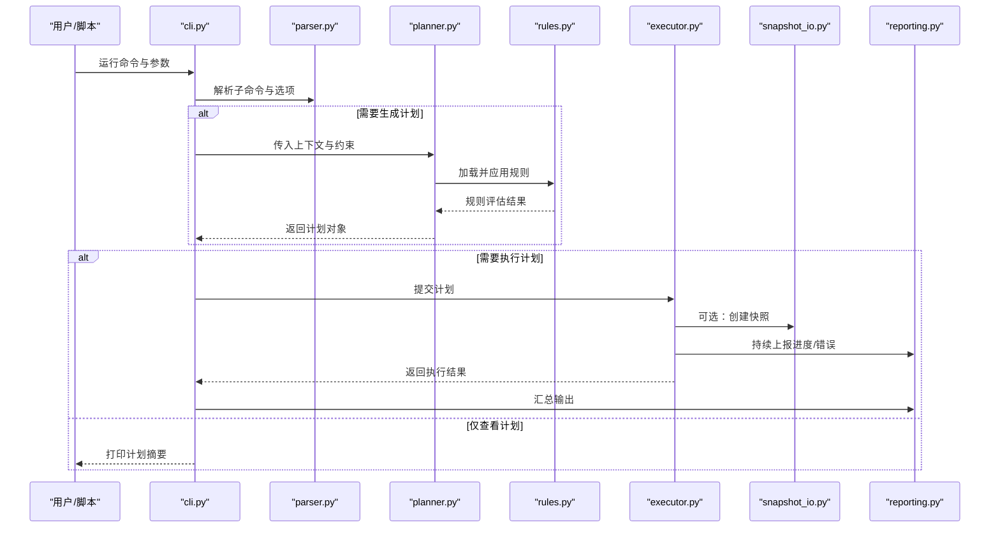
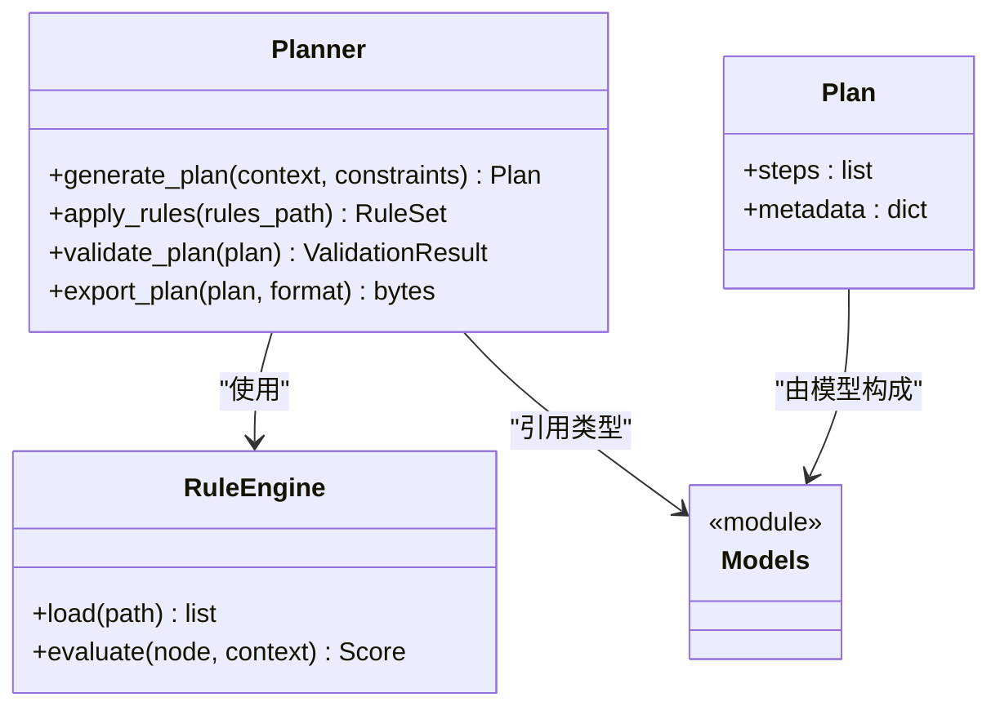
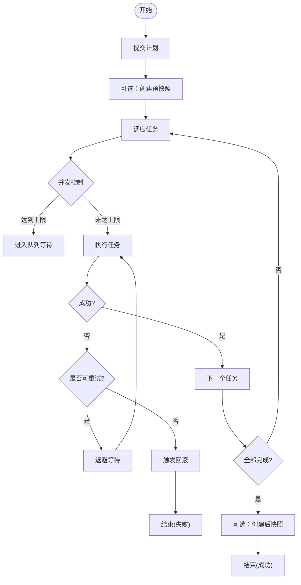
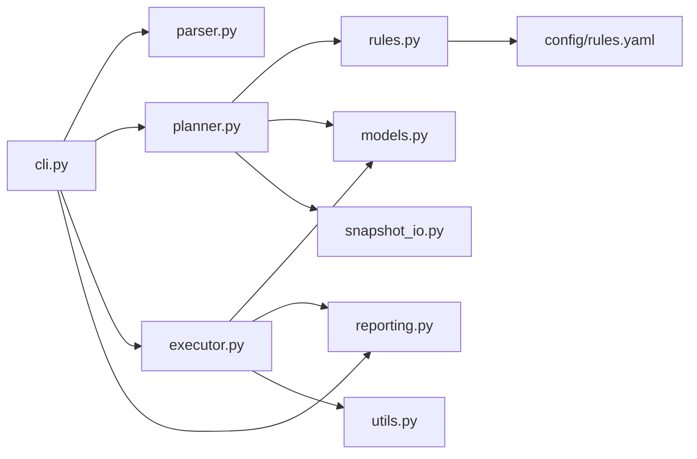

# Python CLI API

<cite>
**本文引用的文件**   
- [src/bookmark_advisor/cli.py](file://src/bookmark_advisor/cli.py)
- [src/bookmark_advisor/planner.py](file://src/bookmark_advisor/planner.py)
- [src/bookmark_advisor/executor.py](file://src/bookmark_advisor/executor.py)
- [src/bookmark_advisor/parser.py](file://src/bookmark_advisor/parser.py)
- [src/bookmark_advisor/models.py](file://src/bookmark_advisor/models.py)
- [src/bookmark_advisor/rules.py](file://src/bookmark_advisor/rules.py)
- [src/bookmark_advisor/snapshot_io.py](file://src/bookmark_advisor/snapshot_io.py)
- [src/bookmark_advisor/reporting.py](file://src/bookmark_advisor/reporting.py)
- [src/bookmark_advisor/utils.py](file://src/bookmark_advisor/utils.py)
- [config/rules.yaml](file://config/rules.yaml)
</cite>

## 目录
1. [简介](#简介)
2. [项目结构](#项目结构)
3. [核心组件](#核心组件)
4. [架构总览](#架构总览)
5. [详细组件分析](#详细组件分析)
6. [依赖关系分析](#依赖关系分析)
7. [性能考虑](#性能考虑)
8. [故障排查指南](#故障排查指南)
9. [结论](#结论)
10. [附录](#附录)

## 简介
本文件面向使用与集成该项目的开发者，提供 Python CLI 工具的公共 API 文档。内容覆盖：
- 命令行接口的完整命令列表（书签重组、批量操作、快照管理等）及其参数选项与使用方法
- 规划器模块 planner.py 的 API（计划生成算法、规则应用、智能分析）
- 执行器模块 executor.py 的任务执行接口（作业调度、并发控制、错误恢复）
- CLI 编程接口在脚本中的调用方式、返回值处理与自动化集成方法
- 完整的代码示例路径，展示常见场景的实际调用方法与结果处理

## 项目结构
本项目采用分层组织：CLI 入口位于 src/bookmark_advisor/cli.py；规划与执行分别由 planner.py 与 executor.py 承担；数据模型、规则、快照 I/O、报告与工具函数分布在同包下。配置项集中于 config/rules.yaml。

图表来源
- [src/bookmark_advisor/cli.py](file://src/bookmark_advisor/cli.py)
- [src/bookmark_advisor/planner.py](file://src/bookmark_advisor/planner.py)
- [src/bookmark_advisor/executor.py](file://src/bookmark_advisor/executor.py)
- [src/bookmark_advisor/parser.py](file://src/bookmark_advisor/parser.py)
- [src/bookmark_advisor/models.py](file://src/bookmark_advisor/models.py)
- [src/bookmark_advisor/rules.py](file://src/bookmark_advisor/rules.py)
- [src/bookmark_advisor/snapshot_io.py](file://src/bookmark_advisor/snapshot_io.py)
- [src/bookmark_advisor/reporting.py](file://src/bookmark_advisor/reporting.py)
- [src/bookmark_advisor/utils.py](file://src/bookmark_advisor/utils.py)
- [config/rules.yaml](file://config/rules.yaml)

章节来源
- [src/bookmark_advisor/cli.py](file://src/bookmark_advisor/cli.py)
- [src/bookmark_advisor/parser.py](file://src/bookmark_advisor/parser.py)
- [src/bookmark_advisor/planner.py](file://src/bookmark_advisor/planner.py)
- [src/bookmark_advisor/executor.py](file://src/bookmark_advisor/executor.py)
- [src/bookmark_advisor/models.py](file://src/bookmark_advisor/models.py)
- [src/bookmark_advisor/rules.py](file://src/bookmark_advisor/rules.py)
- [src/bookmark_advisor/snapshot_io.py](file://src/bookmark_advisor/snapshot_io.py)
- [src/bookmark_advisor/reporting.py](file://src/bookmark_advisor/reporting.py)
- [src/bookmark_advisor/utils.py](file://src/bookmark_advisor/utils.py)
- [config/rules.yaml](file://config/rules.yaml)

## 核心组件
- 命令行入口 cli.py：注册子命令、解析全局与子命令参数、编排规划与执行流程、统一输出与退出码。
- 规划器 planner.py：根据输入与规则生成可执行计划，支持规则匹配、优先级排序、冲突检测与优化建议。
- 执行器 executor.py：将计划转换为任务并调度执行，支持并发控制、重试与回滚策略、进度与错误上报。
- 数据模型 models.py：定义计划、任务、状态等核心数据结构。
- 规则引擎 rules.py：加载与评估规则，支持 YAML 配置驱动。
- 快照 I/O snapshot_io.py：导出/导入书签快照，用于备份与恢复。
- 报告 reporting.py：结构化输出执行结果与统计信息。
- 工具 utils.py：日志、路径、序列化等通用能力。

章节来源
- [src/bookmark_advisor/cli.py](file://src/bookmark_advisor/cli.py)
- [src/bookmark_advisor/planner.py](file://src/bookmark_advisor/planner.py)
- [src/bookmark_advisor/executor.py](file://src/bookmark_advisor/executor.py)
- [src/bookmark_advisor/models.py](file://src/bookmark_advisor/models.py)
- [src/bookmark_advisor/rules.py](file://src/bookmark_advisor/rules.py)
- [src/bookmark_advisor/snapshot_io.py](file://src/bookmark_advisor/snapshot_io.py)
- [src/bookmark_advisor/reporting.py](file://src/bookmark_advisor/reporting.py)
- [src/bookmark_advisor/utils.py](file://src/bookmark_advisor/utils.py)

## 架构总览
下图展示了从 CLI 到规划与执行的端到端流程，以及快照与规则的参与点。

图表来源
- [src/bookmark_advisor/cli.py](file://src/bookmark_advisor/cli.py)
- [src/bookmark_advisor/parser.py](file://src/bookmark_advisor/parser.py)
- [src/bookmark_advisor/planner.py](file://src/bookmark_advisor/planner.py)
- [src/bookmark_advisor/rules.py](file://src/bookmark_advisor/rules.py)
- [src/bookmark_advisor/executor.py](file://src/bookmark_advisor/executor.py)
- [src/bookmark_advisor/snapshot_io.py](file://src/bookmark_advisor/snapshot_io.py)
- [src/bookmark_advisor/reporting.py](file://src/bookmark_advisor/reporting.py)

## 详细组件分析

### 命令行接口（CLI）
- 子命令与用途
  - 书签重组：对现有书签进行重排、合并、清理等操作，通常包含目标范围、策略与预览/执行开关。
  - 批量操作：对多个书签或分组进行批处理，支持过滤条件、并行度与失败策略。
  - 快照管理：创建、列出、恢复与删除书签快照，支持路径与命名约定。
- 常用全局选项
  - 配置文件路径：指定规则与行为配置。
  - 输出格式：文本、JSON 等。
  - 日志级别：调试、信息、警告、错误。
  - 干跑模式：仅生成计划或模拟执行，不改变实际状态。
- 典型用法
  - 生成并预览重组计划：通过“预览”模式输出步骤与影响面。
  - 执行批量操作：设置并发度与失败策略，结合快照确保可回滚。
  - 快照恢复：选择快照版本并确认恢复范围。

章节来源
- [src/bookmark_advisor/cli.py](file://src/bookmark_advisor/cli.py)
- [src/bookmark_advisor/parser.py](file://src/bookmark_advisor/parser.py)

### 规划器 API（planner.py）
- 职责
  - 接收输入上下文（书签树、筛选条件、目标策略），结合规则生成有序的执行计划。
  - 提供计划校验、冲突检测与优化建议。
- 关键能力
  - 计划生成算法：基于规则与启发式策略构建步骤序列，保证依赖顺序与最小变更。
  - 规则应用：加载 YAML 规则，按优先级与条件匹配进行决策。
  - 智能分析：识别冗余、孤立节点与潜在风险，给出改进建议。
- 主要接口（概念性说明）
  - 生成计划：接受上下文与约束，返回计划对象。
  - 应用规则：加载并评估规则集，返回匹配结果与权重。
  - 校验计划：检查步骤合法性、循环依赖与资源冲突。
  - 导出计划：以 JSON/YAML 形式输出供后续使用。
- 数据模型交互
  - 与 models.py 中的计划、任务、状态等类型紧密协作。

图表来源
- [src/bookmark_advisor/planner.py](file://src/bookmark_advisor/planner.py)
- [src/bookmark_advisor/rules.py](file://src/bookmark_advisor/rules.py)
- [src/bookmark_advisor/models.py](file://src/bookmark_advisor/models.py)

章节来源
- [src/bookmark_advisor/planner.py](file://src/bookmark_advisor/planner.py)
- [src/bookmark_advisor/rules.py](file://src/bookmark_advisor/rules.py)
- [src/bookmark_advisor/models.py](file://src/bookmark_advisor/models.py)
- [config/rules.yaml](file://config/rules.yaml)

### 执行器 API（executor.py）
- 职责
  - 将计划转换为可执行任务，负责调度、并发控制、重试与回滚。
  - 收集执行结果与错误，上报至报告系统。
- 关键能力
  - 作业调度：按依赖顺序与资源限制派发任务。
  - 并发控制：可配置最大并发数与队列长度。
  - 错误恢复：支持重试次数、退避策略与失败后回滚。
- 主要接口（概念性说明）
  - 执行计划：提交计划并返回执行结果摘要。
  - 查询状态：获取任务与整体执行状态。
  - 取消执行：中断正在进行的任务。
- 与快照和报告的集成
  - 在执行前后可自动创建/恢复快照，保障一致性。
  - 实时上报进度与错误，便于监控与审计。

图表来源
- [src/bookmark_advisor/executor.py](file://src/bookmark_advisor/executor.py)
- [src/bookmark_advisor/snapshot_io.py](file://src/bookmark_advisor/snapshot_io.py)
- [src/bookmark_advisor/reporting.py](file://src/bookmark_advisor/reporting.py)

章节来源
- [src/bookmark_advisor/executor.py](file://src/bookmark_advisor/executor.py)
- [src/bookmark_advisor/snapshot_io.py](file://src/bookmark_advisor/snapshot_io.py)
- [src/bookmark_advisor/reporting.py](file://src/bookmark_advisor/reporting.py)

### 快照管理（snapshot_io.py）
- 功能
  - 导出当前书签状态为快照文件。
  - 从快照恢复书签状态。
  - 列出可用快照并按时间或名称筛选。
- 使用要点
  - 建议在批量操作与重组前创建快照，以便快速回滚。
  - 快照文件路径与命名需遵循约定，便于自动化检索。

章节来源
- [src/bookmark_advisor/snapshot_io.py](file://src/bookmark_advisor/snapshot_io.py)

### 规则与配置（rules.py 与 config/rules.yaml）
- 规则加载与评估
  - 从 YAML 配置中加载规则集合。
  - 对节点或上下文进行评估，返回评分或布尔判定。
- 配置项
  - 规则优先级、匹配条件、动作与副作用。
  - 全局阈值与默认策略。

章节来源
- [src/bookmark_advisor/rules.py](file://src/bookmark_advisor/rules.py)
- [config/rules.yaml](file://config/rules.yaml)

### 数据模型（models.py）
- 核心类型
  - 计划、任务、步骤、状态等数据结构。
- 作用
  - 作为规划与执行之间的契约，确保一致性与可序列化。

章节来源
- [src/bookmark_advisor/models.py](file://src/bookmark_advisor/models.py)

### 报告与工具（reporting.py 与 utils.py）
- 报告
  - 结构化输出执行结果、统计信息与错误详情。
- 工具
  - 日志、路径处理、序列化等通用能力。

章节来源
- [src/bookmark_advisor/reporting.py](file://src/bookmark_advisor/reporting.py)
- [src/bookmark_advisor/utils.py](file://src/bookmark_advisor/utils.py)

## 依赖关系分析
- 模块耦合
  - CLI 依赖 parser、planner、executor、reporting。
  - planner 依赖 rules、models、snapshot_io。
  - executor 依赖 models、snapshot_io、reporting、utils。
- 外部依赖
  - 规则配置来自 YAML 文件。
  - 文件系统用于快照持久化。

图表来源
- [src/bookmark_advisor/cli.py](file://src/bookmark_advisor/cli.py)
- [src/bookmark_advisor/parser.py](file://src/bookmark_advisor/parser.py)
- [src/bookmark_advisor/planner.py](file://src/bookmark_advisor/planner.py)
- [src/bookmark_advisor/executor.py](file://src/bookmark_advisor/executor.py)
- [src/bookmark_advisor/reporting.py](file://src/bookmark_advisor/reporting.py)
- [src/bookmark_advisor/utils.py](file://src/bookmark_advisor/utils.py)
- [src/bookmark_advisor/rules.py](file://src/bookmark_advisor/rules.py)
- [src/bookmark_advisor/snapshot_io.py](file://src/bookmark_advisor/snapshot_io.py)
- [config/rules.yaml](file://config/rules.yaml)

章节来源
- [src/bookmark_advisor/cli.py](file://src/bookmark_advisor/cli.py)
- [src/bookmark_advisor/planner.py](file://src/bookmark_advisor/planner.py)
- [src/bookmark_advisor/executor.py](file://src/bookmark_advisor/executor.py)
- [src/bookmark_advisor/rules.py](file://src/bookmark_advisor/rules.py)
- [src/bookmark_advisor/snapshot_io.py](file://src/bookmark_advisor/snapshot_io.py)
- [src/bookmark_advisor/reporting.py](file://src/bookmark_advisor/reporting.py)
- [src/bookmark_advisor/utils.py](file://src/bookmark_advisor/utils.py)
- [config/rules.yaml](file://config/rules.yaml)

## 性能考虑
- 并发与队列
  - 合理设置最大并发数，避免 IO 或 CPU 瓶颈。
  - 使用队列缓冲突发任务，降低抖动。
- 规则评估
  - 缓存规则加载结果，减少重复解析。
  - 对大规模书签树进行分块评估，降低内存峰值。
- 快照与 I/O
  - 增量快照与压缩存储，减少磁盘占用与写入时间。
  - 异步写入与批处理，提高吞吐。
- 错误恢复
  - 指数退避与限流，避免雪崩。
  - 细粒度回滚，缩短恢复时间。

[本节为通用指导，无需源码引用]

## 故障排查指南
- 常见问题定位
  - 规则不生效：检查 YAML 语法与优先级，确认匹配条件。
  - 计划冲突：查看冲突检测结果，调整策略或约束。
  - 执行失败：关注错误上报与重试次数，必要时启用回滚。
- 诊断手段
  - 提升日志级别，捕获详细上下文。
  - 导出计划与快照，对比差异定位问题。
  - 使用报告输出进行统计分析。

章节来源
- [src/bookmark_advisor/reporting.py](file://src/bookmark_advisor/reporting.py)
- [src/bookmark_advisor/utils.py](file://src/bookmark_advisor/utils.py)
- [src/bookmark_advisor/snapshot_io.py](file://src/bookmark_advisor/snapshot_io.py)
- [src/bookmark_advisor/rules.py](file://src/bookmark_advisor/rules.py)

## 结论
本 API 文档梳理了 CLI 命令、规划器与执行器的核心能力与集成方式。通过规则驱动的计划生成与具备并发与恢复能力的执行器，配合快照机制，可实现安全、可控的书签重组与批量操作。建议在自动化流程中优先采用“预览—执行—快照验证”的模式，以获得最佳稳定性与可观测性。

[本节为总结，无需源码引用]

## 附录

### CLI 命令速查
- 书签重组
  - 目的：对书签进行重排、合并、清理。
  - 关键选项：目标范围、策略、预览/执行、并发度、失败策略。
- 批量操作
  - 目的：对多节点进行批处理。
  - 关键选项：过滤条件、并行度、失败策略、快照开关。
- 快照管理
  - 目的：创建、列出、恢复、删除快照。
  - 关键选项：路径、命名、版本选择、确认开关。

章节来源
- [src/bookmark_advisor/cli.py](file://src/bookmark_advisor/cli.py)
- [src/bookmark_advisor/parser.py](file://src/bookmark_advisor/parser.py)

### 编程接口使用示例（路径指引）
- 在脚本中调用 CLI 主入口
  - 参考：[src/bookmark_advisor/cli.py](file://src/bookmark_advisor/cli.py)
- 直接调用规划器生成计划
  - 参考：[src/bookmark_advisor/planner.py](file://src/bookmark_advisor/planner.py)
- 直接调用执行器执行计划
  - 参考：[src/bookmark_advisor/executor.py](file://src/bookmark_advisor/executor.py)
- 读取与导出快照
  - 参考：[src/bookmark_advisor/snapshot_io.py](file://src/bookmark_advisor/snapshot_io.py)
- 加载与应用规则
  - 参考：[src/bookmark_advisor/rules.py](file://src/bookmark_advisor/rules.py)、[config/rules.yaml](file://config/rules.yaml)
- 处理返回值与错误
  - 参考：[src/bookmark_advisor/reporting.py](file://src/bookmark_advisor/reporting.py)、[src/bookmark_advisor/utils.py](file://src/bookmark_advisor/utils.py)

[本节为路径指引，不包含具体代码内容]