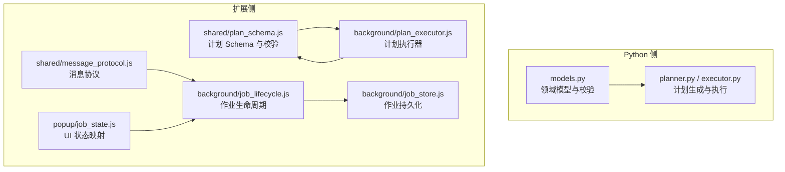
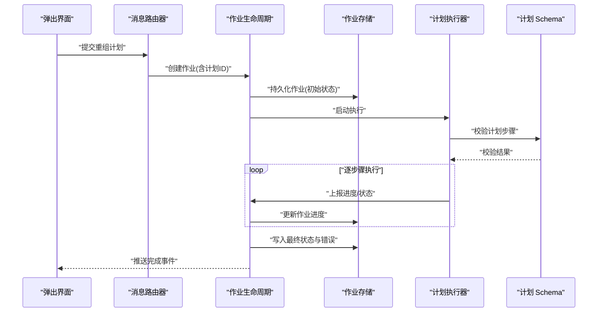
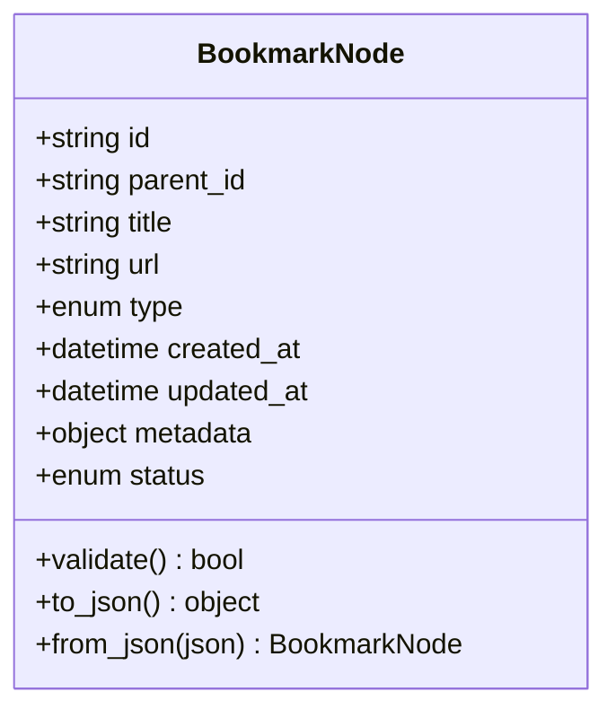
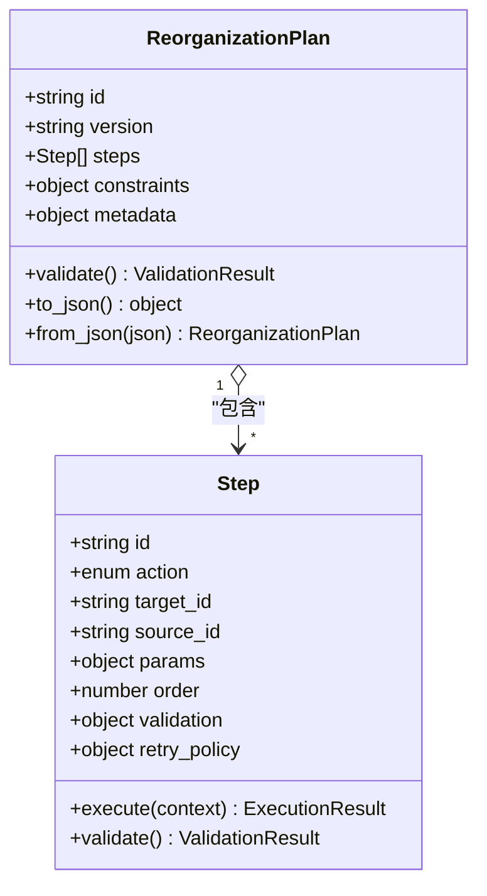
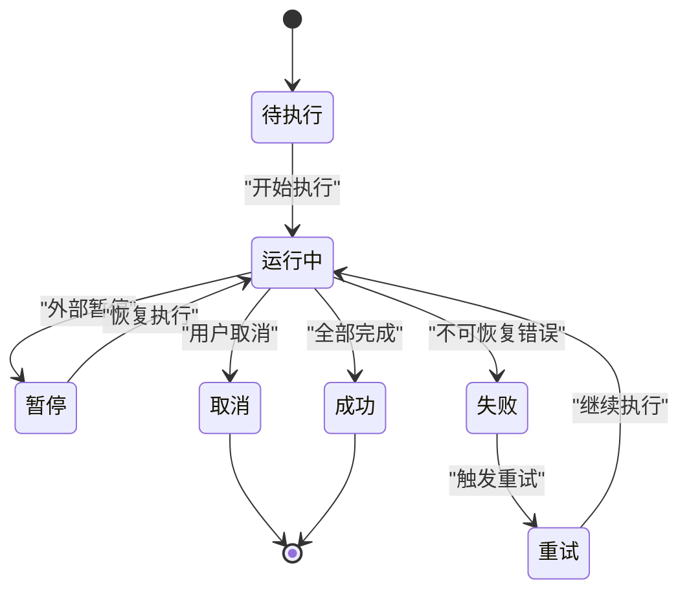
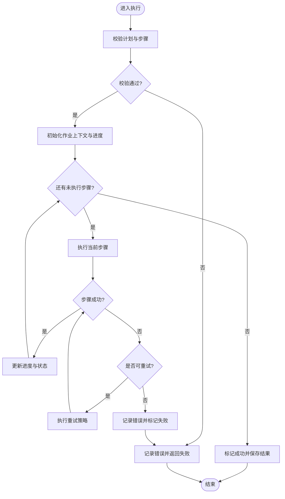
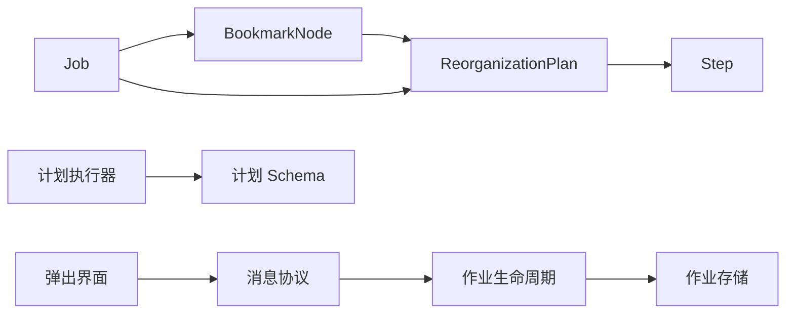

# 数据模型定义

<cite>
**本文引用的文件**   
- [src/bookmark_advisor/models.py](file://src/bookmark_advisor/models.py)
- [extension/shared/plan_schema.js](file://extension/shared/plan_schema.js)
- [extension/background/job_lifecycle.js](file://extension/background/job_lifecycle.js)
- [extension/background/job_store.js](file://extension/background/job_store.js)
- [extension/shared/message_protocol.js](file://extension/shared/message_protocol.js)
- [extension/background/plan_executor.js](file://extension/background/plan_executor.js)
- [extension/popup/job_state.js](file://extension/popup/job_state.js)
- [tests/test_reorg_job.py](file://tests/test_reorg_job.py)
- [tests/test_extension_plan_executor_module.py](file://tests/test_extension_plan_executor_module.py)
</cite>

## 目录
1. [简介](#简介)
2. [项目结构](#项目结构)
3. [核心组件](#核心组件)
4. [架构总览](#架构总览)
5. [详细组件分析](#详细组件分析)
6. [依赖关系分析](#依赖关系分析)
7. [性能考虑](#性能考虑)
8. [故障排查指南](#故障排查指南)
9. [结论](#结论)
10. [附录](#附录)

## 简介
本文件面向书签重组与作业执行子系统，系统化梳理并定义以下关键数据模型：
- 书签节点 BookmarkNode：节点属性、父子关系、元数据与状态字段
- 重组计划 ReorganizationPlan：计划步骤、操作类型、约束条件与验证规则
- 作业 Job：完整生命周期模型（状态转换、执行上下文、进度跟踪、错误信息）
- 消息协议数据结构：请求/响应格式、事件对象、错误对象

文档提供字段类型、必填项、默认值与约束说明，并给出数据验证与序列化/反序列化的处理建议，以及 JSON 示例与 TypeScript 接口定义。

## 项目结构
本项目在 Python 侧与浏览器扩展侧分别维护数据模型与协议：
- Python 侧集中定义领域模型与校验逻辑
- 扩展侧通过共享 schema 与消息协议进行跨进程通信与 UI 展示

图表来源
- [src/bookmark_advisor/models.py](file://src/bookmark_advisor/models.py)
- [extension/shared/plan_schema.js](file://extension/shared/plan_schema.js)
- [extension/shared/message_protocol.js](file://extension/shared/message_protocol.js)
- [extension/background/job_lifecycle.js](file://extension/background/job_lifecycle.js)
- [extension/background/job_store.js](file://extension/background/job_store.js)
- [extension/background/plan_executor.js](file://extension/background/plan_executor.js)
- [extension/popup/job_state.js](file://extension/popup/job_state.js)

章节来源
- [src/bookmark_advisor/models.py](file://src/bookmark_advisor/models.py)
- [extension/shared/plan_schema.js](file://extension/shared/plan_schema.js)
- [extension/shared/message_protocol.js](file://extension/shared/message_protocol.js)
- [extension/background/job_lifecycle.js](file://extension/background/job_lifecycle.js)
- [extension/background/job_store.js](file://extension/background/job_store.js)
- [extension/background/plan_executor.js](file://extension/background/plan_executor.js)
- [extension/popup/job_state.js](file://extension/popup/job_state.js)

## 核心组件
本节聚焦四大模型族：BookmarkNode、ReorganizationPlan、Job、消息协议对象。每个模型均包含字段类型、必填性、默认值、约束与序列化/反序列化策略。

### 书签节点 BookmarkNode
- 用途：表示书签树中的单个节点，承载 URL、标题、分组等属性及元数据与状态
- 关键字段
  - id: 字符串，唯一标识，必填
  - parent_id: 字符串或空，父节点 ID，可选；根节点为空
  - title: 字符串，显示名称，必填
  - url: 字符串或空，URL 地址，可选；文件夹节点为空
  - type: 枚举，取值包括“文件夹”、“书签”，必填
  - created_at: 时间戳或空，创建时间，可选
  - updated_at: 时间戳或空，更新时间，可选
  - metadata: 键值对，任意扩展元数据，可选
  - status: 枚举，节点状态（如“正常”、“待迁移”、“冲突”），可选，默认“正常”
- 约束
  - 若 type 为“文件夹”，url 必须为空
  - 若 type 为“书签”，url 必须非空且符合 URL 规范
  - id 全局唯一，parent_id 若存在需指向有效父节点
  - 时间戳遵循 ISO 8601 或统一时间格式
- 序列化/反序列化
  - 推荐 JSON 序列化，时间字段使用字符串时间戳或 ISO 字符串
  - 反序列化时进行类型校验与约束检查，失败返回结构化错误
- JSON 示例
  - 见附录“JSON 示例”
- TypeScript 接口
  - 见附录“TypeScript 接口定义”

章节来源
- [src/bookmark_advisor/models.py](file://src/bookmark_advisor/models.py)
- [tests/test_reorg_job.py](file://tests/test_reorg_job.py)

### 重组计划 ReorganizationPlan
- 用途：描述一次书签重组的完整计划，包含多个有序步骤与操作
- 关键字段
  - id: 字符串，计划唯一标识，必填
  - version: 字符串或数字，计划版本，可选，默认“1.0.0”
  - steps: 数组，计划步骤列表，必填
  - constraints: 对象，约束条件集合，可选
  - metadata: 键值对，计划级元数据，可选
- 步骤 Step
  - id: 字符串，步骤唯一标识，必填
  - action: 枚举，操作类型（如“移动”、“重命名”、“删除”、“合并”、“新建文件夹”），必填
  - target_id: 字符串，目标节点 ID，必填
  - source_id: 字符串或空，源节点 ID（用于移动/合并），可选
  - params: 对象，操作参数（如新标题、新父节点 ID 等），可选
  - order: 数字，执行顺序，可选，默认按数组顺序
  - validation: 对象，前置/后置校验规则，可选
  - retry_policy: 对象，重试策略（最大次数、退避策略），可选
- 约束与验证规则
  - 所有 target_id 必须存在于当前书签树中
  - 若 action 为“移动”，source_id 必须存在且不为空
  - 禁止形成环状父子关系（移动后不得使某节点成为其自身祖先）
  - 同一目标在同一计划中仅允许被修改一次（除非显式声明幂等）
  - 操作参数需满足动作语义（例如重命名需提供新标题）
- 序列化/反序列化
  - 计划以 JSON 传输，步骤按 order 排序执行
  - 反序列化阶段执行 schema 校验与业务约束校验，失败返回错误列表
- JSON 示例
  - 见附录“JSON 示例”
- TypeScript 接口
  - 见附录“TypeScript 接口定义”

章节来源
- [extension/shared/plan_schema.js](file://extension/shared/plan_schema.js)
- [extension/background/plan_executor.js](file://extension/background/plan_executor.js)
- [tests/test_extension_plan_executor_module.py](file://tests/test_extension_plan_executor_module.py)

### 作业 Job
- 用途：表示一次重组计划的执行实例，贯穿调度、执行、完成与清理的全生命周期
- 关键字段
  - id: 字符串，作业唯一标识，必填
  - plan_id: 字符串，关联的计划 ID，必填
  - status: 枚举，作业状态（详见生命周期），必填
  - context: 对象，执行上下文（如用户会话、策略配置、快照引用），可选
  - progress: 对象，进度跟踪（已完成步骤数、总步骤数、百分比、当前步骤 ID），可选
  - errors: 数组，错误记录列表，可选
  - started_at: 时间戳或空，开始时间，可选
  - finished_at: 时间戳或空，结束时间，可选
  - metadata: 键值对，作业级元数据，可选
- 生命周期与状态转换
  - 初始态：待执行
  - 运行中：已接受并开始执行
  - 暂停：因外部策略或用户干预而暂停
  - 成功：全部步骤完成且无错误
  - 失败：出现不可恢复错误或达到重试上限
  - 取消：由用户主动终止
  - 重试：从失败或暂停恢复继续执行
- 执行上下文
  - 包含策略配置（如并发度、回滚策略）、快照 ID、审计日志路径等
- 进度跟踪
  - 每步完成后更新已完成计数与当前步骤 ID
  - 支持增量上报与最终汇总
- 错误信息
  - 每条错误包含错误码、消息、发生步骤、时间戳与可恢复标志
- 序列化/反序列化
  - 作业状态与进度需持久化，支持断点续跑
  - 反序列化后进行一致性校验（如状态机合法性）
- JSON 示例
  - 见附录“JSON 示例”
- TypeScript 接口
  - 见附录“TypeScript 接口定义”

章节来源
- [extension/background/job_lifecycle.js](file://extension/background/job_lifecycle.js)
- [extension/background/job_store.js](file://extension/background/job_store.js)
- [extension/popup/job_state.js](file://extension/popup/job_state.js)

### 消息协议数据结构
- 用途：定义扩展内部各模块间以及与后台脚本之间的通信契约
- 通用字段
  - type: 字符串，消息类型（请求/响应/事件），必填
  - id: 字符串，消息唯一标识，必填
  - timestamp: 时间戳，发送时间，必填
  - payload: 对象，负载内容，依类型而定
  - error: 对象或空，错误信息，可选
- 请求/响应
  - 请求：type 为“请求”，payload 包含方法名与参数
  - 响应：type 为“响应”，payload 包含结果或错误
- 事件对象
  - type 为“事件”，payload 包含事件名与事件数据（如进度更新、步骤完成）
- 错误对象
  - code: 字符串，错误码
  - message: 字符串，人类可读消息
  - details: 对象或空，附加详情
  - recoverable: 布尔，是否可恢复
- 序列化/反序列化
  - 所有消息统一 JSON 编码
  - 接收端根据 type 路由到对应处理器，并进行 payload 校验
- JSON 示例
  - 见附录“JSON 示例”
- TypeScript 接口
  - 见附录“TypeScript 接口定义”

章节来源
- [extension/shared/message_protocol.js](file://extension/shared/message_protocol.js)

## 架构总览
下图展示了模型在各模块间的交互与数据流向：

图表来源
- [extension/shared/message_protocol.js](file://extension/shared/message_protocol.js)
- [extension/background/job_lifecycle.js](file://extension/background/job_lifecycle.js)
- [extension/background/job_store.js](file://extension/background/job_store.js)
- [extension/background/plan_executor.js](file://extension/background/plan_executor.js)
- [extension/shared/plan_schema.js](file://extension/shared/plan_schema.js)

## 详细组件分析

### BookmarkNode 类图

图表来源
- [src/bookmark_advisor/models.py](file://src/bookmark_advisor/models.py)

章节来源
- [src/bookmark_advisor/models.py](file://src/bookmark_advisor/models.py)

### ReorganizationPlan 与 Step 类图

图表来源
- [extension/shared/plan_schema.js](file://extension/shared/plan_schema.js)
- [extension/background/plan_executor.js](file://extension/background/plan_executor.js)

章节来源
- [extension/shared/plan_schema.js](file://extension/shared/plan_schema.js)
- [extension/background/plan_executor.js](file://extension/background/plan_executor.js)

### 作业状态机

图表来源
- [extension/background/job_lifecycle.js](file://extension/background/job_lifecycle.js)

章节来源
- [extension/background/job_lifecycle.js](file://extension/background/job_lifecycle.js)

### 计划执行流程（算法流程图）

图表来源
- [extension/background/plan_executor.js](file://extension/background/plan_executor.js)
- [extension/shared/plan_schema.js](file://extension/shared/plan_schema.js)

章节来源
- [extension/background/plan_executor.js](file://extension/background/plan_executor.js)
- [extension/shared/plan_schema.js](file://extension/shared/plan_schema.js)

## 依赖关系分析
- 模型耦合
  - Plan 依赖 Step，Step 依赖 BookmarkNode（通过 target_id/source_id 引用）
  - Job 依赖 Plan（plan_id 外键）与 BookmarkNode（执行过程中读取/更新）
  - 消息协议作为跨模块契约，解耦 UI、生命周期与执行器
- 直接依赖
  - 执行器依赖计划 Schema 校验
  - 生命周期依赖作业存储进行持久化
  - UI 通过消息协议订阅作业事件
- 潜在循环
  - 避免在 Step 中反向持有 BookmarkNode 实例，仅保留 ID 引用以降低耦合
- 外部依赖
  - 时间戳与序列化依赖统一时间库
  - 校验依赖 JSON Schema 或自定义校验器

图表来源
- [src/bookmark_advisor/models.py](file://src/bookmark_advisor/models.py)
- [extension/shared/plan_schema.js](file://extension/shared/plan_schema.js)
- [extension/background/job_lifecycle.js](file://extension/background/job_lifecycle.js)
- [extension/background/job_store.js](file://extension/background/job_store.js)
- [extension/background/plan_executor.js](file://extension/background/plan_executor.js)
- [extension/shared/message_protocol.js](file://extension/shared/message_protocol.js)

章节来源
- [src/bookmark_advisor/models.py](file://src/bookmark_advisor/models.py)
- [extension/shared/plan_schema.js](file://extension/shared/plan_schema.js)
- [extension/background/job_lifecycle.js](file://extension/background/job_lifecycle.js)
- [extension/background/job_store.js](file://extension/background/job_store.js)
- [extension/background/plan_executor.js](file://extension/background/plan_executor.js)
- [extension/shared/message_protocol.js](file://extension/shared/message_protocol.js)

## 性能考虑
- 批量校验：计划与步骤在校验阶段一次性收集错误，减少往返
- 增量进度：作业进度采用增量上报，避免频繁全量持久化
- 重试退避：对瞬时错误采用指数退避，降低系统压力
- 内存占用：仅保留节点 ID 引用，避免在大树结构中复制大量对象
- 并行执行：在安全前提下对独立步骤进行有限并行，注意资源竞争与顺序约束

## 故障排查指南
- 常见错误
  - 计划校验失败：检查步骤参数与目标节点是否存在
  - 作业状态非法：确认状态转换是否符合状态机
  - 消息路由异常：核对消息 type 与 payload 结构
- 定位手段
  - 查看作业错误列表与最后一步的错误详情
  - 检查计划执行日志与步骤重试记录
  - 使用消息协议的事件流追踪进度与异常
- 恢复策略
  - 对可恢复错误启用重试策略
  - 对不可恢复错误提供回滚或补偿步骤

章节来源
- [extension/background/job_lifecycle.js](file://extension/background/job_lifecycle.js)
- [extension/background/job_store.js](file://extension/background/job_store.js)
- [extension/shared/message_protocol.js](file://extension/shared/message_protocol.js)

## 结论
本文档系统化定义了书签重组与作业执行的核心数据模型与协议，覆盖字段规范、约束规则、序列化策略与可视化图示。建议在实现中严格遵循校验与状态机约定，确保跨模块一致性与可观测性。

## 附录

### JSON 示例
- 书签节点
  - 参考路径：[src/bookmark_advisor/models.py](file://src/bookmark_advisor/models.py)
- 重组计划
  - 参考路径：[extension/shared/plan_schema.js](file://extension/shared/plan_schema.js)
- 作业
  - 参考路径：[extension/background/job_lifecycle.js](file://extension/background/job_lifecycle.js)
- 消息协议（请求/响应/事件/错误）
  - 参考路径：[extension/shared/message_protocol.js](file://extension/shared/message_protocol.js)

### TypeScript 接口定义
- 书签节点
  - 参考路径：[src/bookmark_advisor/models.py](file://src/bookmark_advisor/models.py)
- 重组计划与步骤
  - 参考路径：[extension/shared/plan_schema.js](file://extension/shared/plan_schema.js)
- 作业
  - 参考路径：[extension/background/job_lifecycle.js](file://extension/background/job_lifecycle.js)
- 消息协议
  - 参考路径：[extension/shared/message_protocol.js](file://extension/shared/message_protocol.js)