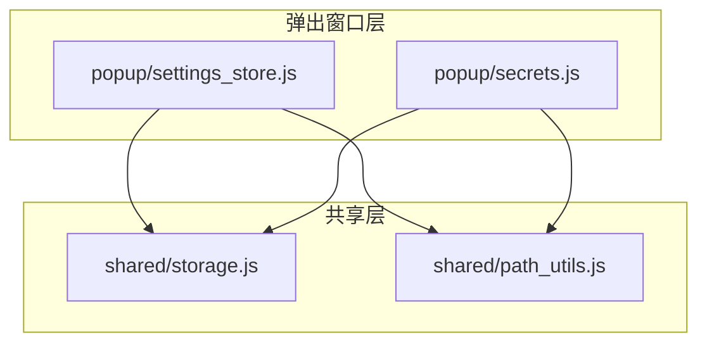
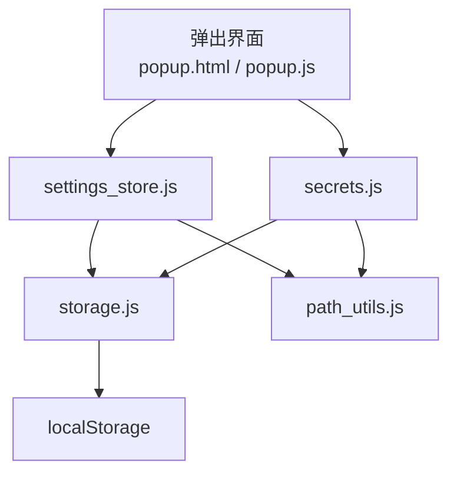
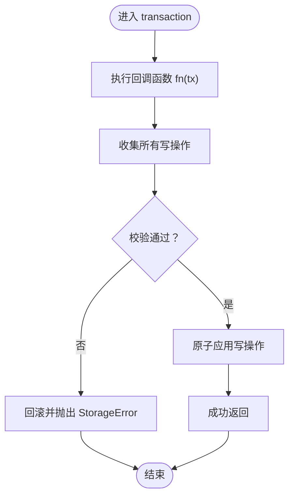
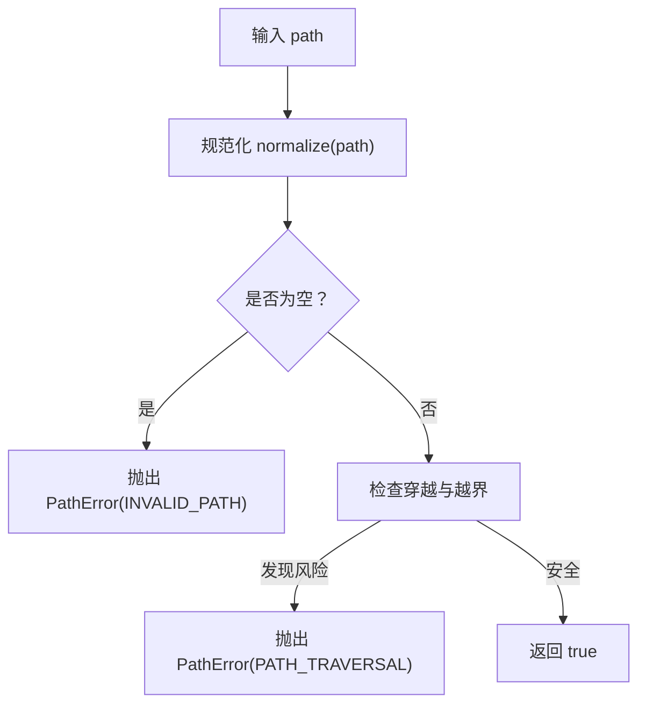
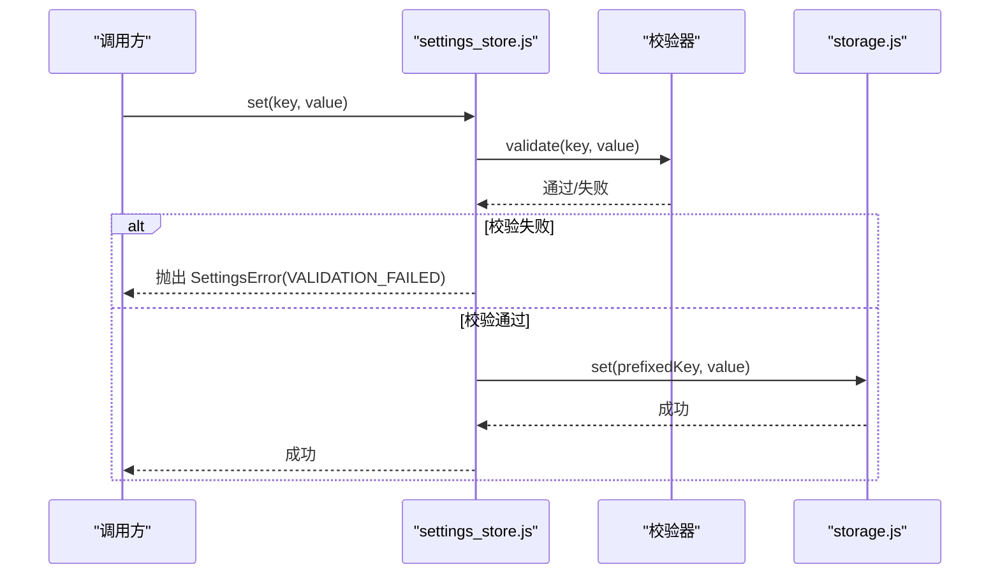
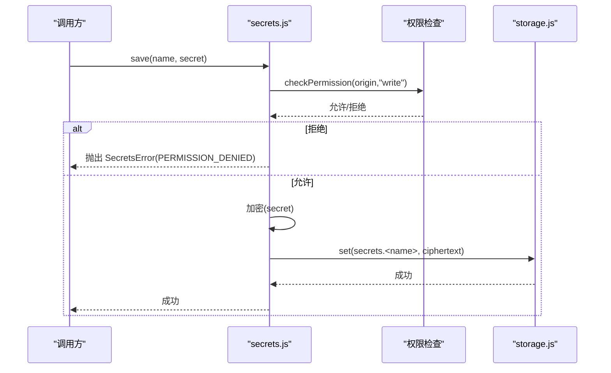
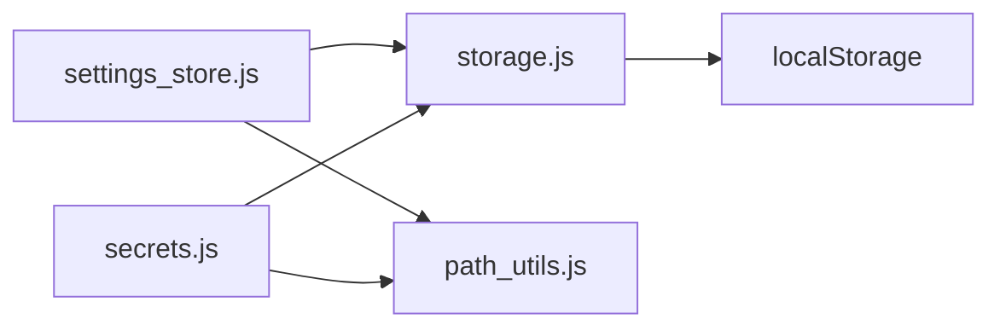

# 浏览器扩展 API

<cite>
**本文引用的文件**   
- [extension/shared/storage.js](file://extension/shared/storage.js)
- [extension/shared/path_utils.js](file://extension/shared/path_utils.js)
- [extension/popup/settings_store.js](file://extension/popup/settings_store.js)
- [extension/popup/secrets.js](file://extension/popup/secrets.js)
</cite>

## 目录
1. [简介](#简介)
2. [项目结构](#项目结构)
3. [核心组件](#核心组件)
4. [架构总览](#架构总览)
5. [详细组件分析](#详细组件分析)
6. [依赖分析](#依赖分析)
7. [性能考虑](#性能考虑)
8. [故障排查指南](#故障排查指南)
9. [结论](#结论)
10. [附录](#附录)

## 简介
本文件面向浏览器扩展内部 API，聚焦以下四个模块：
- 存储接口 storage.js：封装 localStorage，提供数据持久化、异步操作与错误处理。
- 路径工具 path_utils.js：提供路径解析、验证与转换方法。
- 设置管理 settings_store.js：定义配置项、默认值、获取/更新方法与校验规则。
- 密钥管理 secrets.js：实现安全存储机制（加密存储、访问控制与权限管理）。

文档将给出每个 API 的函数签名、参数说明、返回值类型、使用示例、错误码定义与异常处理最佳实践，并辅以架构图与时序图帮助理解。

## 项目结构
与本次文档相关的代码位于 extension 目录下：
- shared：跨上下文共享的工具与基础能力（storage.js、path_utils.js）
- popup：弹出窗口侧的设置与密钥管理（settings_store.js、secrets.js）

图表来源
- [extension/shared/storage.js](file://extension/shared/storage.js)
- [extension/shared/path_utils.js](file://extension/shared/path_utils.js)
- [extension/popup/settings_store.js](file://extension/popup/settings_store.js)
- [extension/popup/secrets.js](file://extension/popup/secrets.js)

章节来源
- [extension/shared/storage.js](file://extension/shared/storage.js)
- [extension/shared/path_utils.js](file://extension/shared/path_utils.js)
- [extension/popup/settings_store.js](file://extension/popup/settings_store.js)
- [extension/popup/secrets.js](file://extension/popup/secrets.js)

## 核心组件
本节概述四大模块的职责边界与交互关系：
- storage.js：对 localStorage 进行统一封装，暴露读写、批量操作、事务式写入与错误包装。
- path_utils.js：提供路径规范化、分隔符处理、相对路径解析、安全校验等工具。
- settings_store.js：集中管理扩展设置，包括默认值、键空间隔离、读取/更新与校验。
- secrets.js：在受限上下文中安全地存取敏感信息，提供最小权限访问与错误分类。

章节来源
- [extension/shared/storage.js](file://extension/shared/storage.js)
- [extension/shared/path_utils.js](file://extension/shared/path_utils.js)
- [extension/popup/settings_store.js](file://extension/popup/settings_store.js)
- [extension/popup/secrets.js](file://extension/popup/secrets.js)

## 架构总览
下图展示各模块之间的调用关系与数据流向。

图表来源
- [extension/popup/settings_store.js](file://extension/popup/settings_store.js)
- [extension/popup/secrets.js](file://extension/popup/secrets.js)
- [extension/shared/storage.js](file://extension/shared/storage.js)
- [extension/shared/path_utils.js](file://extension/shared/path_utils.js)

## 详细组件分析

### 存储接口 storage.js
职责
- 封装 localStorage 的同步读写，对外暴露 Promise 化的异步 API。
- 提供批量读写、事务式写入、键前缀隔离与错误包装。
- 保证 JSON 序列化/反序列化的健壮性，并对容量超限、非法键名等进行防护。

主要 API（函数签名、参数、返回值、示例）
- 初始化与命名空间
  - 签名：init(namespace)
  - 参数：namespace（字符串）— 用于键名前缀隔离
  - 返回：Promise<void>
  - 示例：await init("bookmarks_v1")
- 基本读写
  - 签名：get(key, defaultValue?)
  - 参数：key（字符串），defaultValue（可选，任意可序列化值）
  - 返回：Promise<any>
  - 示例：const val = await get("theme", "light")
  - 签名：set(key, value)
  - 参数：key（字符串），value（任意可序列化值）
  - 返回：Promise<void>
  - 示例：await set("theme", "dark")
- 批量操作
  - 签名：batch(ops)
  - 参数：ops（数组）— 每项为 {op:"get"|"set"|"remove"|... , key, value?}
  - 返回：Promise<Array> — 按 ops 顺序返回结果
  - 示例：const res = await batch([{op:"get",key:"a"},{op:"set",key:"b",value:1}])
- 事务式写入
  - 签名：transaction(fn)
  - 参数：fn（函数）— 接收一个具备 get/set/remove 方法的对象
  - 返回：Promise<void>
  - 语义：在单个事务中执行多次读写，失败时回滚
  - 示例：await transaction(tx => tx.set("x",1).then(()=>tx.set("y",2)))
- 删除与清空
  - 签名：remove(key)
  - 返回：Promise<void>
  - 签名：clear()
  - 返回：Promise<void>
- 元信息与统计
  - 签名：keys()
  - 返回：Promise<string[]>
  - 签名：size()
  - 返回：Promise<number>

错误处理与错误码
- 错误类：StorageError
  - 属性：code（字符串）、message（字符串）、details（可选对象）
- 错误码
  - INVALID_KEY：键名不合法或包含非法字符
  - QUOTA_EXCEEDED：超出存储配额
  - SERIALIZATION_ERROR：JSON 序列化/反序列化失败
  - TRANSACTION_FAILED：事务内某一步失败导致整体回滚
  - UNKNOWN：未知错误
- 异常处理建议
  - 捕获 StorageError 并按 code 分支处理
  - 对 QUOTA_EXCEEDED 提示用户清理或降级策略
  - 对 SERIALIZATION_ERROR 记录日志并回退到默认值
  - 对 TRANSACTION_FAILED 重试或分片写入

流程图（事务写入）

图表来源
- [extension/shared/storage.js](file://extension/shared/storage.js)

章节来源
- [extension/shared/storage.js](file://extension/shared/storage.js)

### 路径工具 path_utils.js
职责
- 提供跨平台的路径解析、规范化、分隔符处理与安全校验。
- 支持相对路径解析、拼接、去重与安全检查（防止路径穿越）。

主要 API（函数签名、参数、返回值、示例）
- 规范化与解析
  - 签名：normalize(path)
  - 参数：path（字符串）
  - 返回：string — 规范化后的路径
  - 示例：const p = normalize("./a/../b")
  - 签名：resolve(base, relative)
  - 参数：base（字符串），relative（字符串）
  - 返回：string — 基于 base 解析 relative 的结果
  - 示例：const r = resolve("/root", "../other/file.txt")
- 拼接与拆分
  - 签名：join(...parts)
  - 参数：parts（多个字符串片段）
  - 返回：string — 拼接后的路径
  - 示例：const j = join("dir", "sub", "file.txt")
  - 签名：split(path)
  - 参数：path（字符串）
  - 返回：Array<string> — 路径分段
  - 示例：const s = split("/a/b/c")
- 安全校验
  - 签名：isSafePath(path)
  - 参数：path（字符串）
  - 返回：boolean — 是否安全（不含穿越、绝对路径越界等）
  - 示例：if(isSafePath(p)) { ... }
- 格式转换
  - 签名：toUnix(path)
  - 参数：path（字符串）
  - 返回：string — 转换为 Unix 风格分隔符
  - 签名：toWin(path)
  - 参数：path（字符串）
  - 返回：string — 转换为 Windows 风格分隔符

错误处理与错误码
- 错误类：PathError
  - 属性：code（字符串）、message（字符串）、input（原始输入）
- 错误码
  - INVALID_PATH：路径为空或包含非法字符
  - PATH_TRAVERSAL：检测到路径穿越尝试
  - RESOLVE_FAILED：无法解析相对路径
- 异常处理建议
  - 在外部调用处统一捕获 PathError，拒绝不安全路径
  - 对 RESOLVE_FAILED 提供回退逻辑或提示用户修正输入

流程图（路径安全校验）

图表来源
- [extension/shared/path_utils.js](file://extension/shared/path_utils.js)

章节来源
- [extension/shared/path_utils.js](file://extension/shared/path_utils.js)

### 设置管理 settings_store.js
职责
- 集中管理扩展设置，维护键空间、默认值与校验规则。
- 提供读取、更新、批量更新与监听变更的能力。
- 与 storage.js 协作完成持久化，与 path_utils.js 协作完成路径相关设置的校验。

主要 API（函数签名、参数、返回值、示例）
- 初始化
  - 签名：init(options?)
  - 参数：options（对象，可选）— 包含 namespace、defaults、validators 等
  - 返回：Promise<void>
  - 示例：await init({namespace:"settings_v1", defaults:{...}, validators:{...}})
- 读取设置
  - 签名：get(key)
  - 参数：key（字符串）
  - 返回：Promise<any> — 若未设置则返回默认值
  - 示例：const theme = await get("ui.theme")
  - 签名：getAll()
  - 返回：Promise<Object> — 当前全部设置快照
- 更新设置
  - 签名：set(key, value)
  - 参数：key（字符串），value（任意）
  - 返回：Promise<void>
  - 签名：update(updates)
  - 参数：updates（对象）— 键值对集合
  - 返回：Promise<void>
- 校验与默认值
  - 签名：validate(key, value)
  - 参数：key（字符串），value（任意）
  - 返回：Promise<boolean>
  - 说明：根据 validators 中的规则校验；未命中规则时使用默认值
- 监听变更
  - 签名：onChange(callback)
  - 参数：callback（函数）— 接收变更事件
  - 返回：Function — 取消订阅函数
  - 示例：const unsub = onChange((event)=>{...})

配置项定义与校验规则
- 默认值 defaults：以键路径为键的对象树，如 {"ui.theme":"light","sync.enabled":true}
- 校验器 validators：以键路径为键的函数或规则对象，例如：
  - type：期望的数据类型
  - enum：允许的值集合
  - min/max：数值范围
  - pattern：正则表达式
  - custom：自定义校验函数
- 键空间隔离：通过 namespace 前缀避免与其他模块冲突

错误处理与错误码
- 错误类：SettingsError
  - 属性：code（字符串）、message（字符串）、key（触发错误的键）
- 错误码
  - MISSING_DEFAULT：缺少默认值且未提供值
  - VALIDATION_FAILED：校验失败
  - STORAGE_ERROR：底层存储异常
- 异常处理建议
  - 在 update 时捕获 SettingsError，记录日志并回滚失败的键
  - 对 VALIDATION_FAILED 向用户提供友好的错误提示

时序图（更新设置流程）

图表来源
- [extension/popup/settings_store.js](file://extension/popup/settings_store.js)
- [extension/shared/storage.js](file://extension/shared/storage.js)

章节来源
- [extension/popup/settings_store.js](file://extension/popup/settings_store.js)

### 密钥管理 secrets.js
职责
- 在受限上下文中安全地存取敏感信息（如令牌、私钥）。
- 提供加密存储、访问控制与最小权限原则。
- 与 storage.js 和 path_utils.js 协作完成持久化与路径安全。

主要 API（函数签名、参数、返回值、示例）
- 初始化
  - 签名：init(options?)
  - 参数：options（对象，可选）— 包含算法、密钥派生参数、命名空间等
  - 返回：Promise<void>
  - 示例：await init({algorithm:"AES-GCM", kdf:"PBKDF2"})
- 存取密钥
  - 签名：save(name, secret)
  - 参数：name（字符串），secret（字符串或 ArrayBuffer）
  - 返回：Promise<void>
  - 签名：load(name)
  - 参数：name（字符串）
  - 返回：Promise<string | ArrayBuffer>
  - 签名：delete(name)
  - 参数：name（字符串）
  - 返回：Promise<void>
- 访问控制
  - 签名：grant(origin, permissions)
  - 参数：origin（字符串），permissions（数组）— 如 ["read","write"]
  - 返回：Promise<void>
  - 签名：revoke(origin, permissions?)
  - 参数：origin（字符串），permissions（可选，数组）
  - 返回：Promise<void>
  - 签名：checkPermission(origin, operation)
  - 参数：origin（字符串），operation（字符串）
  - 返回：Promise<boolean>

错误处理与错误码
- 错误类：SecretsError
  - 属性：code（字符串）、message（字符串）、name（目标密钥名）
- 错误码
  - ENCRYPTION_FAILED：加密/解密失败
  - KEY_NOT_FOUND：密钥不存在
  - PERMISSION_DENIED：无权限访问
  - INVALID_NAME：密钥名不合法
- 异常处理建议
  - 捕获 SecretsError 并按 code 分支处理
  - 对 PERMISSION_DENIED 拒绝请求并记录审计日志
  - 对 ENCRYPTION_FAILED 提示用户重新初始化或更换环境

时序图（保存密钥流程）

图表来源
- [extension/popup/secrets.js](file://extension/popup/secrets.js)
- [extension/shared/storage.js](file://extension/shared/storage.js)

章节来源
- [extension/popup/secrets.js](file://extension/popup/secrets.js)

## 依赖分析
- settings_store.js 依赖 storage.js 与 path_utils.js
- secrets.js 依赖 storage.js 与 path_utils.js
- storage.js 直接操作 localStorage
- path_utils.js 为纯工具库，无外部依赖

图表来源
- [extension/popup/settings_store.js](file://extension/popup/settings_store.js)
- [extension/popup/secrets.js](file://extension/popup/secrets.js)
- [extension/shared/storage.js](file://extension/shared/storage.js)
- [extension/shared/path_utils.js](file://extension/shared/path_utils.js)

章节来源
- [extension/popup/settings_store.js](file://extension/popup/settings_store.js)
- [extension/popup/secrets.js](file://extension/popup/secrets.js)
- [extension/shared/storage.js](file://extension/shared/storage.js)
- [extension/shared/path_utils.js](file://extension/shared/path_utils.js)

## 性能考虑
- 批量与事务
  - 优先使用 batch 与 transaction 减少 I/O 次数与提升一致性
- 缓存热点设置
  - 对频繁读取的设置可在内存中缓存，并在变更事件后失效
- 路径计算优化
  - 对重复路径解析结果进行缓存，避免重复计算
- 密钥操作
  - 避免在热路径中进行昂贵的加解密，必要时引入后台任务或 Offscreen 页面

[本节为通用指导，无需源码引用]

## 故障排查指南
- 常见问题
  - 存储配额不足：捕获 QUOTA_EXCEEDED，提示用户清理或迁移数据
  - 序列化失败：检查数据类型，确保仅存储可 JSON 序列化的值
  - 路径穿越：拒绝包含 ".." 或不安全组合的路径
  - 权限不足：确认 origin 与 permissions 是否正确授予
- 调试建议
  - 开启详细日志，记录错误码与上下文
  - 对事务失败场景输出完整操作序列以便复现
  - 对密钥操作记录审计日志（不包含明文）

章节来源
- [extension/shared/storage.js](file://extension/shared/storage.js)
- [extension/shared/path_utils.js](file://extension/shared/path_utils.js)
- [extension/popup/settings_store.js](file://extension/popup/settings_store.js)
- [extension/popup/secrets.js](file://extension/popup/secrets.js)

## 结论
上述四个模块构成了扩展内部的核心基础设施：
- storage.js 提供稳定可靠的持久化抽象
- path_utils.js 保障路径操作的安全与一致
- settings_store.js 统一管理配置与校验
- secrets.js 实现最小权限的敏感数据存储

遵循本文的错误码与异常处理建议，可显著提升扩展的稳定性与安全性。

[本节为总结，无需源码引用]

## 附录
- 术语
  - 命名空间：用于隔离不同模块的键空间
  - 事务：一组操作的原子执行单元
  - 权限：对特定资源的操作许可
- 最佳实践清单
  - 始终使用命名空间隔离键
  - 对所有外部输入进行路径与内容校验
  - 对关键操作进行日志与审计
  - 对失败路径提供降级与回退策略

[本节为补充信息，无需源码引用]