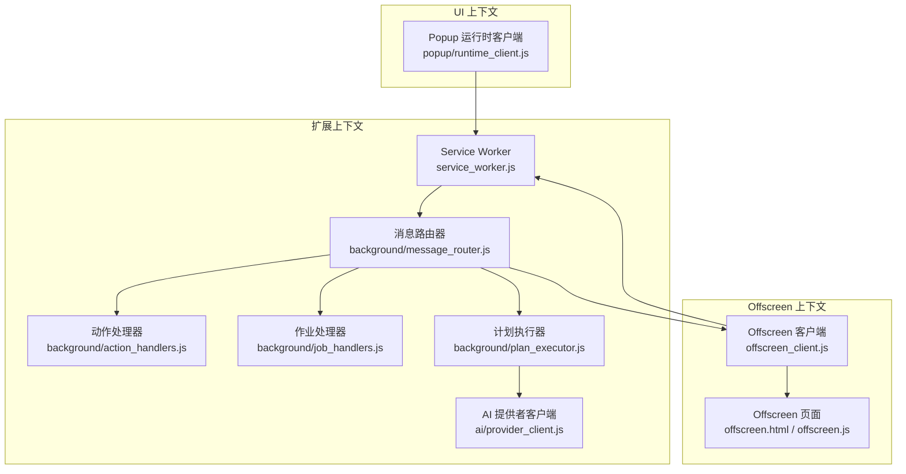
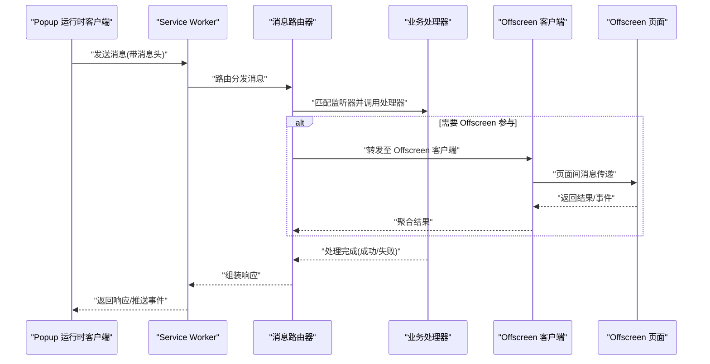
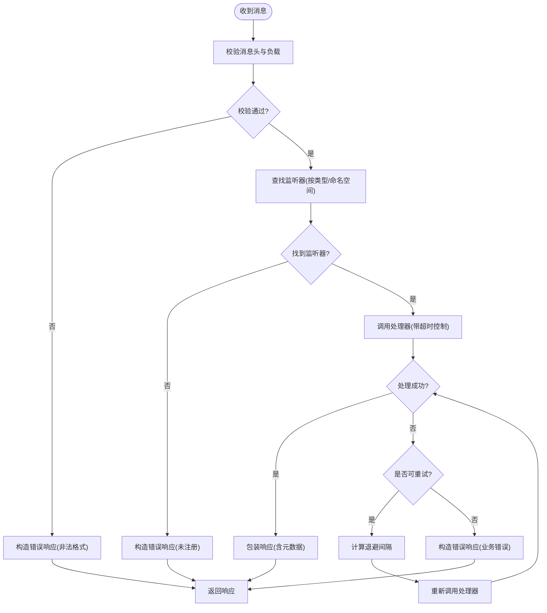
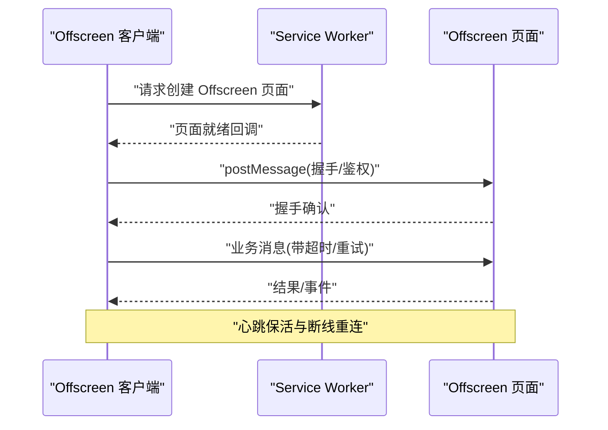
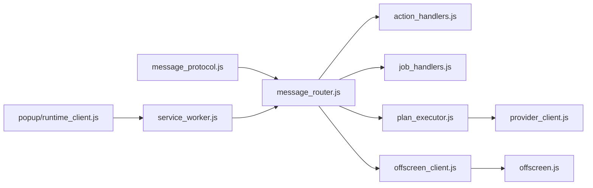

# 消息协议规范

<cite>
**本文引用的文件**   
- [extension/shared/message_protocol.js](file://extension/shared/message_protocol.js)
- [extension/background/message_router.js](file://extension/background/message_router.js)
- [extension/offscreen_client.js](file://extension/offscreen_client.js)
- [extension/offscreen.html](file://extension/offscreen.html)
- [extension/offscreen.js](file://extension/offscreen.js)
- [extension/service_worker.js](file://extension/service_worker.js)
- [extension/popup/runtime_client.js](file://extension/popup/runtime_client.js)
- [extension/background/action_handlers.js](file://extension/background/action_handlers.js)
- [extension/background/job_handlers.js](file://extension/background/job_handlers.js)
- [extension/background/plan_executor.js](file://extension/background/plan_executor.js)
- [extension/ai/provider_client.js](file://extension/ai/provider_client.js)
- [tests/test_extension_message_router.js](file://tests/test_extension_message_router.js)
- [tests/test_extension_offscreen_client.js](file://tests/test_extension_offscreen_client.js)
</cite>

## 目录
1. [简介](#简介)
2. [项目结构](#项目结构)
3. [核心组件](#核心组件)
4. [架构总览](#架构总览)
5. [详细组件分析](#详细组件分析)
6. [依赖关系分析](#依赖关系分析)
7. [性能考虑](#性能考虑)
8. [故障排查指南](#故障排查指南)
9. [结论](#结论)
10. [附录](#附录)

## 简介
本规范定义跨上下文（Service Worker、Offscreen 页面、Popup）之间的消息通信协议，涵盖：
- 消息头与负载结构、元数据字段
- 路由规则与分发机制（message_router.js）
- Offscreen 页面通信协议（页面间消息传递、状态同步、生命周期管理）
- 支持的消息类型（用户操作、系统事件、AI 服务、后台任务）
- 序列化/反序列化规范（含版本兼容性与向后兼容保证）
- 错误码、重试机制与超时策略
- 完整消息流示例与调试方法

## 项目结构
本项目采用分层组织方式：共享协议定义位于 shared，背景逻辑在 background，UI 交互在 popup，AI 能力在 ai，测试在 tests。消息协议的核心实现集中在以下文件：
- 协议定义：extension/shared/message_protocol.js
- 路由分发：extension/background/message_router.js
- Offscreen 客户端：extension/offscreen_client.js
- Offscreen 页面：extension/offscreen.html、extension/offscreen.js
- 入口与服务：extension/service_worker.js
- UI 侧运行时客户端：extension/popup/runtime_client.js
- 业务处理器：extension/background/action_handlers.js、job_handlers.js、plan_executor.js
- AI 客户端：extension/ai/provider_client.js

图表来源
- [extension/service_worker.js](file://extension/service_worker.js)
- [extension/background/message_router.js](file://extension/background/message_router.js)
- [extension/background/action_handlers.js](file://extension/background/action_handlers.js)
- [extension/background/job_handlers.js](file://extension/background/job_handlers.js)
- [extension/background/plan_executor.js](file://extension/background/plan_executor.js)
- [extension/ai/provider_client.js](file://extension/ai/provider_client.js)
- [extension/popup/runtime_client.js](file://extension/popup/runtime_client.js)
- [extension/offscreen_client.js](file://extension/offscreen_client.js)
- [extension/offscreen.html](file://extension/offscreen.html)
- [extension/offscreen.js](file://extension/offscreen.js)

章节来源
- [extension/shared/message_protocol.js](file://extension/shared/message_protocol.js)
- [extension/background/message_router.js](file://extension/background/message_router.js)
- [extension/offscreen_client.js](file://extension/offscreen_client.js)
- [extension/offscreen.html](file://extension/offscreen.html)
- [extension/offscreen.js](file://extension/offscreen.js)
- [extension/service_worker.js](file://extension/service_worker.js)
- [extension/popup/runtime_client.js](file://extension/popup/runtime_client.js)
- [extension/background/action_handlers.js](file://extension/background/action_handlers.js)
- [extension/background/job_handlers.js](file://extension/background/job_handlers.js)
- [extension/background/plan_executor.js](file://extension/background/plan_executor.js)
- [extension/ai/provider_client.js](file://extension/ai/provider_client.js)

## 核心组件
- 消息协议定义（shared/message_protocol.js）
  - 定义消息头、负载、元数据、版本号、错误码等常量与校验规则
  - 提供序列化/反序列化工具函数，确保跨上下文一致解析
- 消息路由器（background/message_router.js）
  - 维护监听器注册表，按消息类型分发到对应处理器
  - 处理错误、超时、重试与响应回写
- Offscreen 客户端（offscreen_client.js）
  - 封装与 Offscreen 页面的双向通信、会话管理与重连
- Offscreen 页面（offscreen.html / offscreen.js）
  - 承载长时任务与浏览器 API 受限场景下的工作负载
- 入口与服务（service_worker.js）
  - 初始化路由、注册全局消息通道、协调各模块
- UI 运行时客户端（popup/runtime_client.js）
  - Popup 向 Service Worker 发送请求并订阅结果/事件
- 业务处理器（action_handlers.js、job_handlers.js、plan_executor.js）
  - 具体业务逻辑：动作处理、作业调度、计划执行
- AI 客户端（ai/provider_client.js）
  - 与外部 AI 服务交互的客户端封装

章节来源
- [extension/shared/message_protocol.js](file://extension/shared/message_protocol.js)
- [extension/background/message_router.js](file://extension/background/message_router.js)
- [extension/offscreen_client.js](file://extension/offscreen_client.js)
- [extension/offscreen.html](file://extension/offscreen.html)
- [extension/offscreen.js](file://extension/offscreen.js)
- [extension/service_worker.js](file://extension/service_worker.js)
- [extension/popup/runtime_client.js](file://extension/popup/runtime_client.js)
- [extension/background/action_handlers.js](file://extension/background/action_handlers.js)
- [extension/background/job_handlers.js](file://extension/background/job_handlers.js)
- [extension/background/plan_executor.js](file://extension/background/plan_executor.js)
- [extension/ai/provider_client.js](file://extension/ai/provider_client.js)

## 架构总览
下图展示跨上下文消息流转的整体架构：Popup 与 Offscreen 通过 Service Worker 进行通信，Service Worker 内部由消息路由器统一分发至业务处理器或转发至 Offscreen 页面。

图表来源
- [extension/popup/runtime_client.js](file://extension/popup/runtime_client.js)
- [extension/service_worker.js](file://extension/service_worker.js)
- [extension/background/message_router.js](file://extension/background/message_router.js)
- [extension/offscreen_client.js](file://extension/offscreen_client.js)
- [extension/offscreen.html](file://extension/offscreen.html)
- [extension/offscreen.js](file://extension/offscreen.js)

## 详细组件分析

### 消息协议定义（shared/message_protocol.js）
- 消息头
  - 必需字段：消息类型、唯一标识、时间戳、版本、来源上下文、目标上下文
  - 可选字段：优先级、超时、重试次数、关联 ID、追踪 ID
- 负载结构
  - 通用负载包含：操作名、参数对象、上下文快照
  - 特定负载根据消息类型扩展，遵循 JSON Schema 约束
- 元数据字段
  - 用于审计与诊断：来源 IP/进程、设备信息、插件版本、环境标签
- 序列化/反序列化
  - 提供 encode/decode 工具，严格校验必填字段与类型
  - 版本兼容：头部携带协议版本；解码器对未知字段忽略，对缺失字段使用默认值
  - 向后兼容：新字段不破坏旧版解析；旧字段在新版中保留只读语义

章节来源
- [extension/shared/message_protocol.js](file://extension/shared/message_protocol.js)

### 消息路由器（background/message_router.js）
- 路由规则
  - 基于“消息类型”精确匹配；支持通配前缀与命名空间
  - 每个监听器可声明支持的上下文范围（如仅 Service Worker、仅 Offscreen）
- 分发机制
  - 入站消息经校验后进入路由表，查找首个匹配的监听器
  - 若处理器为异步，路由器负责等待 Promise 并包装为响应
- 监听器注册
  - 提供 register(type, handler, options) 接口
  - 支持优先级排序与条件过滤（如按来源上下文）
- 错误处理
  - 捕获处理器异常，转换为标准错误响应
  - 记录错误码、堆栈摘要与上下文快照
- 超时与重试
  - 支持 per-message 超时配置；超时触发重试（指数退避）
  - 最大重试次数与退避上限可配置

图表来源
- [extension/background/message_router.js](file://extension/background/message_router.js)

章节来源
- [extension/background/message_router.js](file://extension/background/message_router.js)
- [tests/test_extension_message_router.js](file://tests/test_extension_message_router.js)

### Offscreen 通信协议（offscreen_client.js / offscreen.html / offscreen.js）
- 页面间消息传递
  - 客户端通过 postMessage 发送结构化消息，包含消息头与负载
  - Offscreen 页面监听消息，按类型路由到本地处理器
- 状态同步
  - 支持增量状态更新与全量快照两种模式
  - 客户端维护本地缓存，合并服务端变更
- 生命周期管理
  - 启动：按需创建 Offscreen 文档，建立连接
  - 保活：心跳检测与自动重连
  - 关闭：优雅退出，清理资源与待处理任务
- 错误与恢复
  - 网络中断、页面崩溃等异常下自动重建会话
  - 未决请求在重连后继续或回退为失败

图表来源
- [extension/offscreen_client.js](file://extension/offscreen_client.js)
- [extension/offscreen.html](file://extension/offscreen.html)
- [extension/offscreen.js](file://extension/offscreen.js)

章节来源
- [extension/offscreen_client.js](file://extension/offscreen_client.js)
- [extension/offscreen.html](file://extension/offscreen.html)
- [extension/offscreen.js](file://extension/offscreen.js)
- [tests/test_extension_offscreen_client.js](file://tests/test_extension_offscreen_client.js)

### 支持的消息类型
- 用户操作消息
  - 用途：来自 Popup 的用户意图（如打开设置、执行收藏整理）
  - 典型字段：操作名、参数、目标上下文
- 系统事件消息
  - 用途：扩展生命周期、权限变更、存储变化等通知
  - 典型字段：事件类型、时间戳、影响范围
- AI 服务消息
  - 用途：与 AI 提供者交互（生成计划、批量处理）
  - 典型字段：模型参数、提示词、批大小、超时
- 后台任务消息
  - 用途：长时作业（导出、迁移、清理）
  - 典型字段：作业 ID、优先级、重试策略、进度回调

章节来源
- [extension/shared/message_protocol.js](file://extension/shared/message_protocol.js)
- [extension/background/action_handlers.js](file://extension/background/action_handlers.js)
- [extension/background/job_handlers.js](file://extension/background/job_handlers.js)
- [extension/background/plan_executor.js](file://extension/background/plan_executor.js)
- [extension/ai/provider_client.js](file://extension/ai/provider_client.js)

### 序列化与反序列化规范
- 编码流程
  - 构建消息头与负载 -> 附加元数据 -> 应用版本策略 -> 输出 JSON
- 解码流程
  - 解析 JSON -> 校验必填字段 -> 兼容处理未知字段 -> 返回结构化对象
- 版本兼容性
  - 头部 version 字段决定解析策略
  - 新增字段：旧版忽略；旧字段：新版保留只读
  - 破坏性变更需升级 major 版本并迁移路径
- 错误处理
  - 解析失败返回标准化错误码
  - 记录最小必要日志以保护隐私

章节来源
- [extension/shared/message_protocol.js](file://extension/shared/message_protocol.js)

### 错误码、重试与超时
- 错误码分类
  - 协议层：格式错误、版本不兼容、签名无效
  - 路由层：未注册监听器、上下文不匹配
  - 业务层：参数校验失败、资源不可用、外部服务错误
  - 传输层：超时、断线、页面不可达
- 重试机制
  - 指数退避 + 抖动，限制最大重试次数
  - 幂等性要求：仅对幂等操作启用自动重试
- 超时策略
  - 默认超时与 per-message 覆盖
  - 长时任务采用分段超时与进度上报

章节来源
- [extension/background/message_router.js](file://extension/background/message_router.js)
- [extension/offscreen_client.js](file://extension/offscreen_client.js)
- [extension/shared/message_protocol.js](file://extension/shared/message_protocol.js)

### 消息流示例与调试方法
- 端到端示例
  - Popup 发起“执行收藏整理” -> Service Worker 路由 -> 作业处理器 -> 计划执行器 -> AI 提供者 -> 返回结果
- 调试建议
  - 开启扩展日志与追踪 ID
  - 在路由器与 Offscreen 客户端注入拦截器打印消息头与负载摘要
  - 使用浏览器开发者工具监控 postMessage 与 Service Worker 控制台

章节来源
- [extension/popup/runtime_client.js](file://extension/popup/runtime_client.js)
- [extension/background/message_router.js](file://extension/background/message_router.js)
- [extension/offscreen_client.js](file://extension/offscreen_client.js)
- [extension/background/job_handlers.js](file://extension/background/job_handlers.js)
- [extension/background/plan_executor.js](file://extension/background/plan_executor.js)
- [extension/ai/provider_client.js](file://extension/ai/provider_client.js)

## 依赖关系分析
- 耦合与内聚
  - 路由器与处理器松耦合，通过消息类型解耦
  - Offscreen 客户端独立封装页面通信细节
- 直接/间接依赖
  - Service Worker 依赖路由器与 Offscreen 客户端
  - 业务处理器依赖 AI 客户端与作业管理器
- 循环依赖
  - 避免处理器反向依赖路由器，防止循环
- 外部依赖
  - AI 提供者通过 provider_client 抽象，便于替换实现

图表来源
- [extension/shared/message_protocol.js](file://extension/shared/message_protocol.js)
- [extension/background/message_router.js](file://extension/background/message_router.js)
- [extension/background/action_handlers.js](file://extension/background/action_handlers.js)
- [extension/background/job_handlers.js](file://extension/background/job_handlers.js)
- [extension/background/plan_executor.js](file://extension/background/plan_executor.js)
- [extension/ai/provider_client.js](file://extension/ai/provider_client.js)
- [extension/offscreen_client.js](file://extension/offscreen_client.js)
- [extension/offscreen.js](file://extension/offscreen.js)
- [extension/service_worker.js](file://extension/service_worker.js)
- [extension/popup/runtime_client.js](file://extension/popup/runtime_client.js)

章节来源
- [extension/shared/message_protocol.js](file://extension/shared/message_protocol.js)
- [extension/background/message_router.js](file://extension/background/message_router.js)
- [extension/offscreen_client.js](file://extension/offscreen_client.js)
- [extension/offscreen.js](file://extension/offscreen.js)
- [extension/service_worker.js](file://extension/service_worker.js)
- [extension/popup/runtime_client.js](file://extension/popup/runtime_client.js)
- [extension/background/action_handlers.js](file://extension/background/action_handlers.js)
- [extension/background/job_handlers.js](file://extension/background/job_handlers.js)
- [extension/background/plan_executor.js](file://extension/background/plan_executor.js)
- [extension/ai/provider_client.js](file://extension/ai/provider_client.js)

## 性能考虑
- 批量与合并
  - 对高频小消息进行批处理，减少路由开销
- 懒加载与按需创建
  - Offscreen 页面按需创建，空闲回收
- 超时与取消
  - 合理设置超时，避免阻塞主线程
- 序列化优化
  - 大负载采用压缩或分片传输

[本节为通用指导，无需源码引用]

## 故障排查指南
- 常见问题
  - 消息未到达：检查监听器注册与上下文匹配
  - 解析失败：核对消息头必填字段与版本
  - 超时频繁：调整超时阈值与重试策略
  - Offscreen 不可用：检查页面创建与心跳
- 定位手段
  - 在路由器与客户端增加日志钩子
  - 使用追踪 ID 串联一次请求的全链路
  - 对比不同版本的协议行为差异

章节来源
- [extension/background/message_router.js](file://extension/background/message_router.js)
- [extension/offscreen_client.js](file://extension/offscreen_client.js)
- [extension/shared/message_protocol.js](file://extension/shared/message_protocol.js)

## 结论
本规范明确了跨上下文消息协议的格式、路由与处理流程，定义了 Offscreen 通信协议与消息类型，提供了序列化/反序列化与兼容性策略，以及错误码、重试与超时的处理方案。遵循本规范可实现稳定、可扩展且可观测的消息通信体系。

[本节为总结，无需源码引用]

## 附录
- 术语
  - 上下文：Service Worker、Offscreen 页面、Popup 等运行环境
  - 监听器：注册在路由器上的消息处理器
  - 幂等：多次执行产生相同结果的操作
- 参考实现位置
  - 协议定义：[extension/shared/message_protocol.js](file://extension/shared/message_protocol.js)
  - 路由实现：[extension/background/message_router.js](file://extension/background/message_router.js)
  - Offscreen 通信：[extension/offscreen_client.js](file://extension/offscreen_client.js)、[extension/offscreen.html](file://extension/offscreen.html)、[extension/offscreen.js](file://extension/offscreen.js)
  - 入口与服务：[extension/service_worker.js](file://extension/service_worker.js)
  - UI 客户端：[extension/popup/runtime_client.js](file://extension/popup/runtime_client.js)
  - 业务处理器：[extension/background/action_handlers.js](file://extension/background/action_handlers.js)、[extension/background/job_handlers.js](file://extension/background/job_handlers.js)、[extension/background/plan_executor.js](file://extension/background/plan_executor.js)
  - AI 客户端：[extension/ai/provider_client.js](file://extension/ai/provider_client.js)