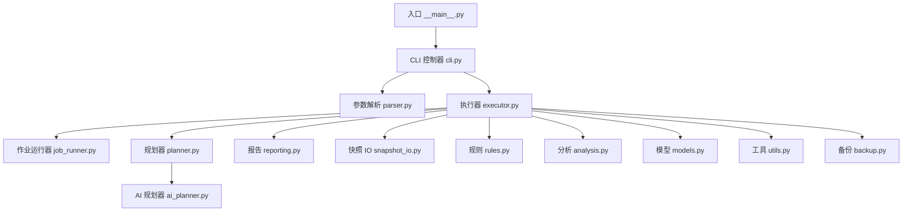
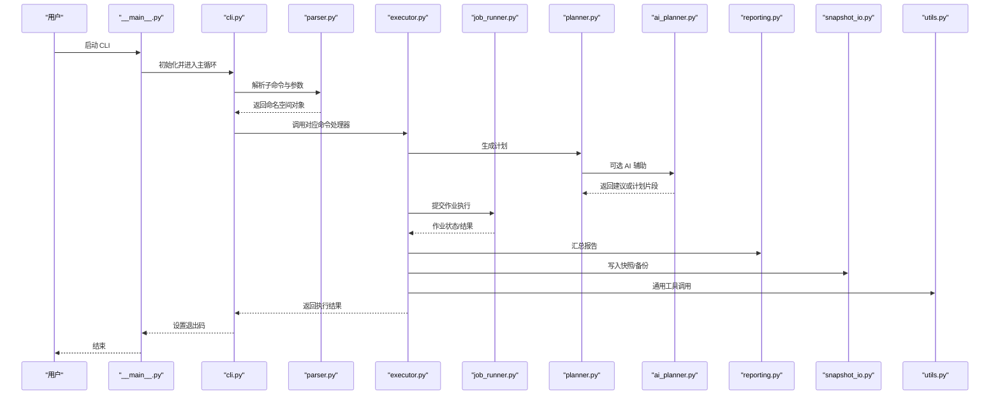
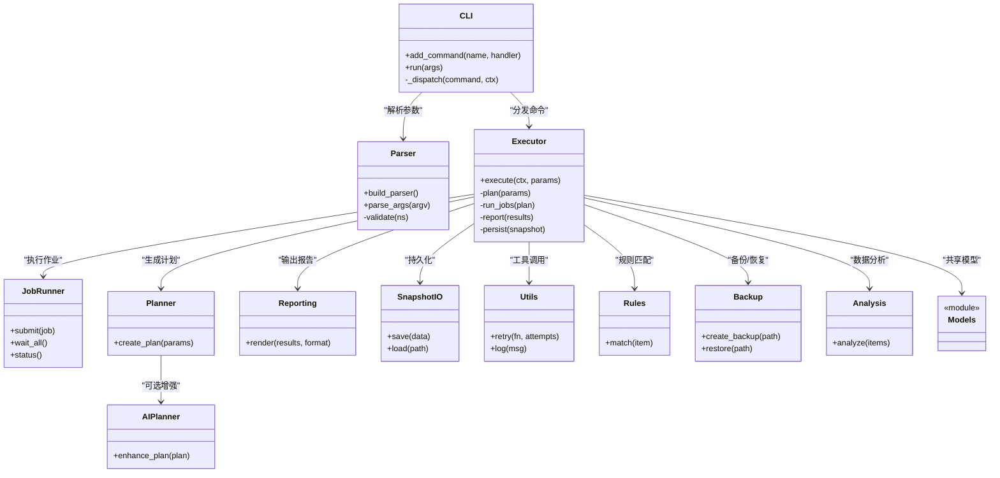
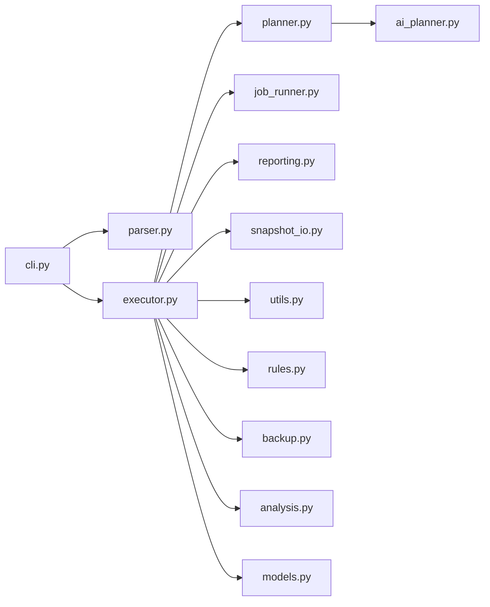

# CLI 架构设计

<cite>
**本文引用的文件**   
- [src/bookmark_advisor/__main__.py](file://src/bookmark_advisor/__main__.py)
- [src/bookmark_advisor/cli.py](file://src/bookmark_advisor/cli.py)
- [src/bookmark_advisor/parser.py](file://src/bookmark_advisor/parser.py)
- [src/bookmark_advisor/executor.py](file://src/bookmark_advisor/executor.py)
- [src/bookmark_advisor/job_runner.py](file://src/bookmark_advisor/job_runner.py)
- [src/bookmark_advisor/planner.py](file://src/bookmark_advisor/planner.py)
- [src/bookmark_advisor/ai_planner.py](file://src/bookmark_advisor/ai_planner.py)
- [src/bookmark_advisor/models.py](file://src/bookmark_advisor/models.py)
- [src/bookmark_advisor/reporting.py](file://src/bookmark_advisor/reporting.py)
- [src/bookmark_advisor/snapshot_io.py](file://src/bookmark_advisor/snapshot_io.py)
- [src/bookmark_advisor/utils.py](file://src/bookmark_advisor/utils.py)
- [src/bookmark_advisor/rule s.py](file://src/bookmark_advisor/rules.py)
- [src/bookmark_advisor/backup.py](file://src/bookmark_advisor/backup.py)
- [src/bookmark_advisor/analysis.py](file://src/bookmark_advisor/analysis.py)
- [pyproject.toml](file://pyproject.toml)
</cite>

## 目录
1. [简介](#简介)
2. [项目结构](#项目结构)
3. [核心组件](#核心组件)
4. [架构总览](#架构总览)
5. [详细组件分析](#详细组件分析)
6. [依赖关系分析](#依赖关系分析)
7. [性能考量](#性能考量)
8. [故障排查指南](#故障排查指南)
9. [结论](#结论)
10. [附录：扩展与自定义命令开发指南](#附录扩展与自定义命令开发指南)

## 简介
本文件面向开发者，系统化阐述 bookmark-advisor CLI 的架构设计与实现要点。内容覆盖入口点设计、命令解析机制、模块加载流程、命令注册系统、参数验证、错误处理策略、插件系统与动态导入、以及扩展点与自定义命令开发指南。通过架构图与组件关系图，帮助读者快速理解整体结构与协作方式。

## 项目结构
CLI 位于 Python 包 bookmark_advisor 下，采用“按职责分层 + 功能域”的组织方式：
- 入口与命令行层：__main__.py、cli.py、parser.py
- 执行与编排层：executor.py、job_runner.py
- 规划与分析层：planner.py、ai_planner.py、analysis.py、models.py
- 数据与工具层：snapshot_io.py、utils.py、rules.py、backup.py、reporting.py

图表来源
- [src/bookmark_advisor/__main__.py](file://src/bookmark_advisor/__main__.py)
- [src/bookmark_advisor/cli.py](file://src/bookmark_advisor/cli.py)
- [src/bookmark_advisor/parser.py](file://src/bookmark_advisor/parser.py)
- [src/bookmark_advisor/executor.py](file://src/bookmark_advisor/executor.py)
- [src/bookmark_advisor/job_runner.py](file://src/bookmark_advisor/job_runner.py)
- [src/bookmark_advisor/planner.py](file://src/bookmark_advisor/planner.py)
- [src/bookmark_advisor/ai_planner.py](file://src/bookmark_advisor/ai_planner.py)
- [src/bookmark_advisor/reporting.py](file://src/bookmark_advisor/reporting.py)
- [src/bookmark_advisor/snapshot_io.py](file://src/bookmark_advisor/snapshot_io.py)
- [src/bookmark_advisor/utils.py](file://src/bookmark_advisor/utils.py)
- [src/bookmark_advisor/rules.py](file://src/bookmark_advisor/rules.py)
- [src/bookmark_advisor/backup.py](file://src/bookmark_advisor/backup.py)
- [src/bookmark_advisor/analysis.py](file://src/bookmark_advisor/analysis.py)
- [src/bookmark_advisor/models.py](file://src/bookmark_advisor/models.py)

章节来源
- [src/bookmark_advisor/__main__.py](file://src/bookmark_advisor/__main__.py)
- [src/bookmark_advisor/cli.py](file://src/bookmark_advisor/cli.py)
- [src/bookmark_advisor/parser.py](file://src/bookmark_advisor/parser.py)
- [src/bookmark_advisor/executor.py](file://src/bookmark_advisor/executor.py)
- [src/bookmark_advisor/job_runner.py](file://src/bookmark_advisor/job_runner.py)
- [src/bookmark_advisor/planner.py](file://src/bookmark_advisor/planner.py)
- [src/bookmark_advisor/ai_planner.py](file://src/bookmark_advisor/ai_planner.py)
- [src/bookmark_advisor/reporting.py](file://src/bookmark_advisor/reporting.py)
- [src/bookmark_advisor/snapshot_io.py](file://src/bookmark_advisor/snapshot_io.py)
- [src/bookmark_advisor/utils.py](file://src/bookmark_advisor/utils.py)
- [src/bookmark_advisor/rules.py](file://src/bookmark_advisor/rules.py)
- [src/bookmark_advisor/backup.py](file://src/bookmark_advisor/backup.py)
- [src/bookmark_advisor/analysis.py](file://src/bookmark_advisor/analysis.py)
- [src/bookmark_advisor/models.py](file://src/bookmark_advisor/models.py)

## 核心组件
- 入口点（__main__.py）
  - 负责程序启动、异常兜底、退出码设置与日志初始化。
- CLI 控制器（cli.py）
  - 统一暴露子命令、注册命令处理器、组装上下文对象、分发到具体命令函数。
- 参数解析器（parser.py）
  - 基于标准库 argparse 构建子命令树、定义参数与校验逻辑、生成命名空间对象。
- 执行器（executor.py）
  - 接收解析后的参数，协调规划器、作业运行器、报告与快照等子系统完成一次任务。
- 作业运行器（job_runner.py）
  - 管理作业生命周期、并发控制、重试与状态上报。
- 规划器（planner.py / ai_planner.py）
  - 将用户意图转化为可执行的计划；AI 规划器提供基于模型的辅助能力。
- 数据与工具（snapshot_io.py / utils.py / rules.py / backup.py / analysis.py / models.py / reporting.py）
  - 提供数据持久化、通用工具、规则引擎、备份恢复、分析与模型定义、结果输出等能力。

章节来源
- [src/bookmark_advisor/__main__.py](file://src/bookmark_advisor/__main__.py)
- [src/bookmark_advisor/cli.py](file://src/bookmark_advisor/cli.py)
- [src/bookmark_advisor/parser.py](file://src/bookmark_advisor/parser.py)
- [src/bookmark_advisor/executor.py](file://src/bookmark_advisor/executor.py)
- [src/bookmark_advisor/job_runner.py](file://src/bookmark_advisor/job_runner.py)
- [src/bookmark_advisor/planner.py](file://src/bookmark_advisor/planner.py)
- [src/bookmark_advisor/ai_planner.py](file://src/bookmark_advisor/ai_planner.py)
- [src/bookmark_advisor/reporting.py](file://src/bookmark_advisor/reporting.py)
- [src/bookmark_advisor/snapshot_io.py](file://src/bookmark_advisor/snapshot_io.py)
- [src/bookmark_advisor/utils.py](file://src/bookmark_advisor/utils.py)
- [src/bookmark_advisor/rules.py](file://src/bookmark_advisor/rules.py)
- [src/bookmark_advisor/backup.py](file://src/bookmark_advisor/backup.py)
- [src/bookmark_advisor/analysis.py](file://src/bookmark_advisor/analysis.py)
- [src/bookmark_advisor/models.py](file://src/bookmark_advisor/models.py)

## 架构总览
下图展示了从命令行输入到任务落地的端到端调用链，体现“入口 → CLI 控制器 → 解析器 → 执行器 → 作业运行器/规划器/报告/快照/规则/工具”的分层协作。

图表来源
- [src/bookmark_advisor/__main__.py](file://src/bookmark_advisor/__main__.py)
- [src/bookmark_advisor/cli.py](file://src/bookmark_advisor/cli.py)
- [src/bookmark_advisor/parser.py](file://src/bookmark_advisor/parser.py)
- [src/bookmark_advisor/executor.py](file://src/bookmark_advisor/executor.py)
- [src/bookmark_advisor/job_runner.py](file://src/bookmark_advisor/job_runner.py)
- [src/bookmark_advisor/planner.py](file://src/bookmark_advisor/planner.py)
- [src/bookmark_advisor/ai_planner.py](file://src/bookmark_advisor/ai_planner.py)
- [src/bookmark_advisor/reporting.py](file://src/bookmark_advisor/reporting.py)
- [src/bookmark_advisor/snapshot_io.py](file://src/bookmark_advisor/snapshot_io.py)
- [src/bookmark_advisor/utils.py](file://src/bookmark_advisor/utils.py)

## 详细组件分析

### 入口点与异常兜底（__main__.py）
- 职责
  - 初始化日志与全局配置
  - 捕获顶层异常，记录错误信息并设置合适的退出码
  - 调用 CLI 控制器的主入口
- 关键流程
  - 启动 → 初始化 → 调用 CLI.main() → 返回退出码 → 进程退出

章节来源
- [src/bookmark_advisor/__main__.py](file://src/bookmark_advisor/__main__.py)

### CLI 控制器与命令注册（cli.py）
- 职责
  - 维护命令注册表（名称 → 处理器）
  - 提供 add_command 接口用于扩展
  - 根据解析结果路由到具体命令处理器
  - 构造统一的上下文对象（包含配置、日志、IO 等）
- 设计模式
  - 命令注册表 + 分派器：新增命令只需注册即可被 CLI 发现
  - 上下文注入：为各命令处理器提供一致的依赖环境
- 扩展点
  - 在应用初始化阶段扫描并注册外部命令模块
  - 支持通过配置文件或环境变量启用特定命令集

章节来源
- [src/bookmark_advisor/cli.py](file://src/bookmark_advisor/cli.py)

### 参数解析与校验（parser.py）
- 职责
  - 使用 argparse 构建子命令树
  - 定义每个子命令的参数、默认值与类型约束
  - 在解析后执行二次校验（如互斥参数、业务约束）
- 关键点
  - 参数校验失败时抛出明确异常，便于上层统一处理
  - 支持 help 与版本信息的自动生成

章节来源
- [src/bookmark_advisor/parser.py](file://src/bookmark_advisor/parser.py)

### 执行器与编排（executor.py）
- 职责
  - 接收解析后的参数，组织执行上下文
  - 协调规划器生成计划、作业运行器执行计划、报告器输出结果、快照 IO 持久化
  - 统一错误收集与重试策略
- 关键流程
  - 准备上下文 → 生成计划 → 执行计划 → 产出报告 → 持久化快照 → 返回结果

章节来源
- [src/bookmark_advisor/executor.py](file://src/bookmark_advisor/executor.py)

### 作业运行器（job_runner.py）
- 职责
  - 管理作业的创建、调度、并发与取消
  - 跟踪作业状态（待执行、执行中、成功、失败）
  - 提供重试与回滚钩子
- 并发与资源
  - 通过线程池或进程池控制并发度
  - 对长耗时任务进行超时保护

章节来源
- [src/bookmark_advisor/job_runner.py](file://src/bookmark_advisor/job_runner.py)

### 规划器与 AI 规划器（planner.py / ai_planner.py）
- 职责
  - planner.py：将用户意图转换为结构化计划（步骤、依赖、参数）
  - ai_planner.py：可选地调用 AI 服务以增强计划质量（如推荐优化项）
- 交互
  - executor 优先使用本地规划器，必要时委托 AI 规划器补充
  - 两者均遵循统一的计划模型（models.py）

章节来源
- [src/bookmark_advisor/planner.py](file://src/bookmark_advisor/planner.py)
- [src/bookmark_advisor/ai_planner.py](file://src/bookmark_advisor/ai_planner.py)
- [src/bookmark_advisor/models.py](file://src/bookmark_advisor/models.py)

### 数据与工具（snapshot_io.py / utils.py / rules.py / backup.py / analysis.py / reporting.py）
- snapshot_io.py：读写快照与中间态数据，保证幂等与一致性
- utils.py：路径处理、序列化、重试、日志封装等通用能力
- rules.py：规则定义与匹配，驱动分析和建议
- backup.py：备份与恢复策略，保障数据安全
- analysis.py：对书签数据进行深度分析，产出洞察
- reporting.py：格式化输出（文本/JSON/表格），供 CLI 展示

章节来源
- [src/bookmark_advisor/snapshot_io.py](file://src/bookmark_advisor/snapshot_io.py)
- [src/bookmark_advisor/utils.py](file://src/bookmark_advisor/utils.py)
- [src/bookmark_advisor/rules.py](file://src/bookmark_advisor/rules.py)
- [src/bookmark_advisor/backup.py](file://src/bookmark_advisor/backup.py)
- [src/bookmark_advisor/analysis.py](file://src/bookmark_advisor/analysis.py)
- [src/bookmark_advisor/reporting.py](file://src/bookmark_advisor/reporting.py)

### 类与模块关系图

图表来源
- [src/bookmark_advisor/cli.py](file://src/bookmark_advisor/cli.py)
- [src/bookmark_advisor/parser.py](file://src/bookmark_advisor/parser.py)
- [src/bookmark_advisor/executor.py](file://src/bookmark_advisor/executor.py)
- [src/bookmark_advisor/job_runner.py](file://src/bookmark_advisor/job_runner.py)
- [src/bookmark_advisor/planner.py](file://src/bookmark_advisor/planner.py)
- [src/bookmark_advisor/ai_planner.py](file://src/bookmark_advisor/ai_planner.py)
- [src/bookmark_advisor/reporting.py](file://src/bookmark_advisor/reporting.py)
- [src/bookmark_advisor/snapshot_io.py](file://src/bookmark_advisor/snapshot_io.py)
- [src/bookmark_advisor/utils.py](file://src/bookmark_advisor/utils.py)
- [src/bookmark_advisor/rules.py](file://src/bookmark_advisor/rules.py)
- [src/bookmark_advisor/backup.py](file://src/bookmark_advisor/backup.py)
- [src/bookmark_advisor/analysis.py](file://src/bookmark_advisor/analysis.py)
- [src/bookmark_advisor/models.py](file://src/bookmark_advisor/models.py)

## 依赖关系分析
- 内部依赖
  - cli.py 依赖 parser.py 与 executor.py
  - executor.py 聚合 planner.py、job_runner.py、reporting.py、snapshot_io.py、utils.py、rules.py、backup.py、analysis.py、models.py
  - planner.py 可选依赖 ai_planner.py
- 外部依赖
  - argparse（参数解析）
  - 文件系统与 JSON/YAML（快照与配置）
  - 可选网络请求（AI 规划器）
- 潜在耦合点
  - executor 与各子系统的接口契约需保持稳定
  - 模型定义集中在 models.py，避免重复结构

图表来源
- [src/bookmark_advisor/cli.py](file://src/bookmark_advisor/cli.py)
- [src/bookmark_advisor/parser.py](file://src/bookmark_advisor/parser.py)
- [src/bookmark_advisor/executor.py](file://src/bookmark_advisor/executor.py)
- [src/bookmark_advisor/planner.py](file://src/bookmark_advisor/planner.py)
- [src/bookmark_advisor/ai_planner.py](file://src/bookmark_advisor/ai_planner.py)
- [src/bookmark_advisor/job_runner.py](file://src/bookmark_advisor/job_runner.py)
- [src/bookmark_advisor/reporting.py](file://src/bookmark_advisor/reporting.py)
- [src/bookmark_advisor/snapshot_io.py](file://src/bookmark_advisor/snapshot_io.py)
- [src/bookmark_advisor/utils.py](file://src/bookmark_advisor/utils.py)
- [src/bookmark_advisor/rules.py](file://src/bookmark_advisor/rules.py)
- [src/bookmark_advisor/backup.py](file://src/bookmark_advisor/backup.py)
- [src/bookmark_advisor/analysis.py](file://src/bookmark_advisor/analysis.py)
- [src/bookmark_advisor/models.py](file://src/bookmark_advisor/models.py)

## 性能考量
- 解析阶段
  - 合理划分子命令与参数，减少不必要的校验开销
- 执行阶段
  - 作业并行度可调，避免 I/O 与 CPU 争用
  - 对大对象（如快照）采用流式读写与增量更新
- 规划阶段
  - 缓存常用规则与索引，降低重复计算
- 报告阶段
  - 按需渲染，避免全量格式化带来的内存峰值

[本节为通用指导，不直接分析具体文件]

## 故障排查指南
- 常见错误分类
  - 参数错误：由 parser.py 抛出，检查参数名、类型与互斥关系
  - 运行时错误：executor.py 捕获并记录堆栈，关注作业失败原因
  - 数据错误：snapshot_io.py 读写失败，检查权限与路径有效性
  - 网络错误：ai_planner.py 调用失败，检查网络与凭据
- 定位方法
  - 开启详细日志（__main__.py 初始化处）
  - 使用 --dry-run 或最小数据集复现问题
  - 查看快照与临时文件，确认中间状态
- 恢复策略
  - 利用 backup.py 进行回滚
  - 清理损坏的快照后重试

章节来源
- [src/bookmark_advisor/__main__.py](file://src/bookmark_advisor/__main__.py)
- [src/bookmark_advisor/parser.py](file://src/bookmark_advisor/parser.py)
- [src/bookmark_advisor/executor.py](file://src/bookmark_advisor/executor.py)
- [src/bookmark_advisor/snapshot_io.py](file://src/bookmark_advisor/snapshot_io.py)
- [src/bookmark_advisor/ai_planner.py](file://src/bookmark_advisor/ai_planner.py)
- [src/bookmark_advisor/backup.py](file://src/bookmark_advisor/backup.py)

## 结论
该 CLI 采用清晰的层次化架构：入口点负责启动与兜底，CLI 控制器负责命令注册与分发，解析器负责参数校验，执行器负责编排与协调，作业运行器负责并发与状态，规划器与 AI 规划器负责计划生成，数据与工具层提供支撑能力。通过模块化与可扩展的命令注册机制，新增命令与插件具备良好内聚性与低耦合性。

[本节为总结性内容，不直接分析具体文件]

## 附录：扩展与自定义命令开发指南

### 新增内置命令
- 步骤
  - 在 cli.py 中注册新命令（名称 → 处理器）
  - 在 parser.py 中为该命令添加子命令与参数
  - 在 executor.py 或独立模块中实现命令处理逻辑
  - 如需持久化或报告，集成 snapshot_io.py 与 reporting.py
- 注意事项
  - 保持参数校验严格且友好
  - 对可能失败的步骤增加重试与回滚
  - 使用 models.py 中的统一数据结构传递数据

章节来源
- [src/bookmark_advisor/cli.py](file://src/bookmark_advisor/cli.py)
- [src/bookmark_advisor/parser.py](file://src/bookmark_advisor/parser.py)
- [src/bookmark_advisor/executor.py](file://src/bookmark_advisor/executor.py)
- [src/bookmark_advisor/snapshot_io.py](file://src/bookmark_advisor/snapshot_io.py)
- [src/bookmark_advisor/reporting.py](file://src/bookmark_advisor/reporting.py)
- [src/bookmark_advisor/models.py](file://src/bookmark_advisor/models.py)

### 插件系统与动态模块导入
- 原理
  - 在 CLI 初始化阶段扫描指定目录或元数据，动态导入插件模块
  - 插件模块暴露标准接口（如 register_commands、get_handlers）
  - CLI 控制器通过反射或约定式 API 加载插件命令
- 接口约定
  - 插件需提供命令注册函数，返回命令名与处理器映射
  - 插件可声明依赖与版本要求，由 CLI 在安装阶段校验
- 依赖注入
  - CLI 向插件注入上下文（配置、日志、IO、规则等）
  - 插件仅依赖稳定接口，避免强耦合

章节来源
- [src/bookmark_advisor/cli.py](file://src/bookmark_advisor/cli.py)

### 安装与入口点（pyproject.toml）
- 通过 pyproject.toml 配置可执行入口点，使 CLI 可通过命令行直接调用
- 建议在打包时包含必要的资源与配置文件

章节来源
- [pyproject.toml](file://pyproject.toml)