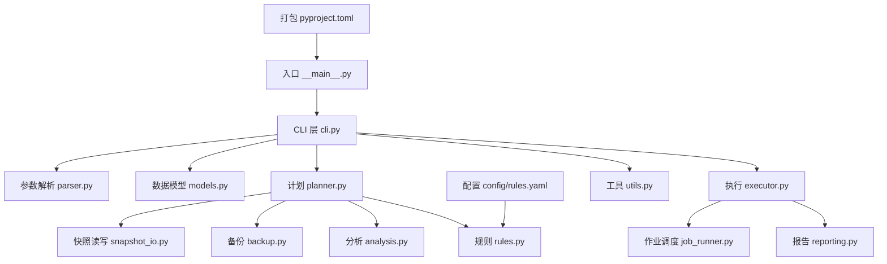
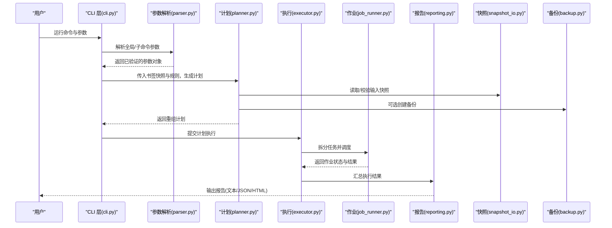
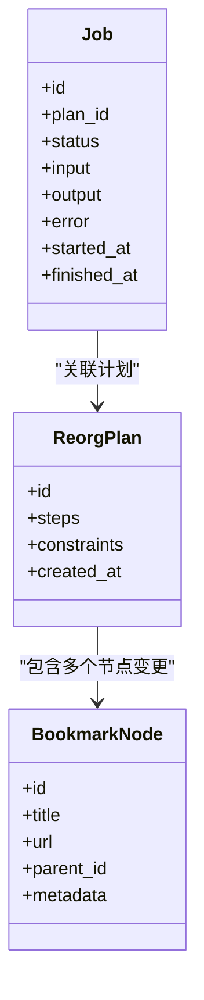
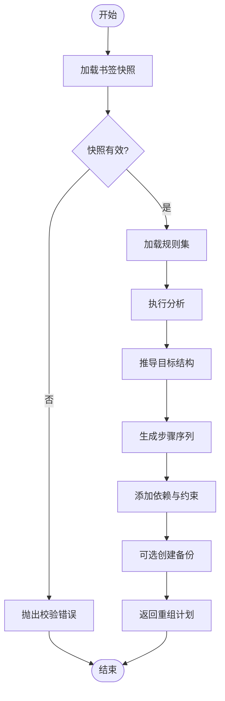
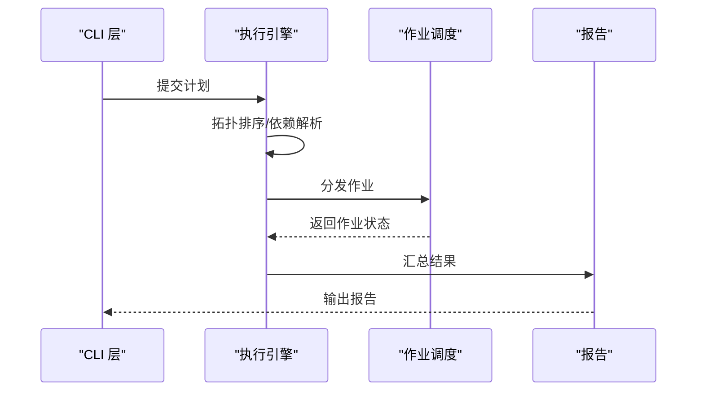
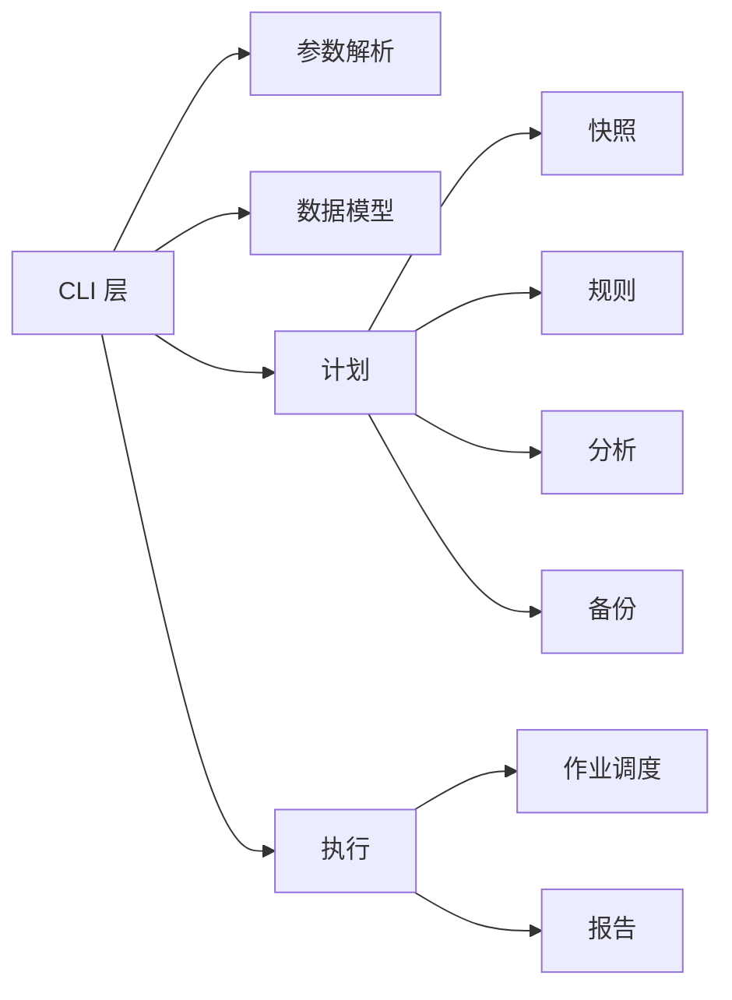

# Python CLI 工具

<cite>
**本文引用的文件**   
- [src/bookmark_advisor/__main__.py](file://src/bookmark_advisor/__main__.py)
- [src/bookmark_advisor/cli.py](file://src/bookmark_advisor/cli.py)
- [src/bookmark_advisor/parser.py](file://src/bookmark_advisor/parser.py)
- [src/bookmark_advisor/models.py](file://src/bookmark_advisor/models.py)
- [src/bookmark_advisor/planner.py](file://src/bookmark_advisor/planner.py)
- [src/bookmark_advisor/executor.py](file://src/bookmark_advisor/executor.py)
- [src/bookmark_advisor/job_runner.py](file://src/bookmark_advisor/job_runner.py)
- [src/bookmark_advisor/reporting.py](file://src/bookmark_advisor/reporting.py)
- [src/bookmark_advisor/snapshot_io.py](file://src/bookmark_advisor/snapshot_io.py)
- [src/bookmark_advisor/backup.py](file://src/bookmark_advisor/backup.py)
- [src/bookmark_advisor/analysis.py](file://src/bookmark_advisor/analysis.py)
- [src/bookmark_advisor/rules.py](file://src/bookmark_advisor/rules.py)
- [src/bookmark_advisor/utils.py](file://src/bookmark_advisor/utils.py)
- [config/rules.yaml](file://config/rules.yaml)
- [pyproject.toml](file://pyproject.toml)
</cite>

## 目录
1. [简介](#简介)
2. [项目结构](#项目结构)
3. [核心组件](#核心组件)
4. [架构总览](#架构总览)
5. [详细组件分析](#详细组件分析)
6. [依赖关系分析](#依赖关系分析)
7. [性能考虑](#性能考虑)
8. [故障排查指南](#故障排查指南)
9. [结论](#结论)
10. [附录：API 参考与使用示例](#附录api-参考与使用示例)

## 简介
本仓库包含一个基于 Python 的命令行工具，用于对浏览器书签进行智能分析与重组。CLI 提供命令解析、计划生成、执行引擎与报告输出等能力，并通过模块化设计与可扩展机制支持自定义命令与插件化扩展。后端处理逻辑围绕“计划”和“作业”展开：先根据规则与分析结果生成重组计划，再由执行引擎按策略执行并产出结构化报告。

## 项目结构
Python CLI 代码位于 src/bookmark_advisor 包中，采用分层与职责分离的组织方式：
- 入口与 CLI 层：__main__.py、cli.py、parser.py
- 数据模型：models.py
- 业务逻辑：planner.py（计划）、executor.py（执行）、job_runner.py（作业调度）、reporting.py（报告）
- 外部交互与持久化：snapshot_io.py、backup.py
- 辅助能力：analysis.py、rules.py、utils.py
- 配置：config/rules.yaml
- 打包与入口点：pyproject.toml

图表来源
- [src/bookmark_advisor/__main__.py](file://src/bookmark_advisor/__main__.py)
- [src/bookmark_advisor/cli.py](file://src/bookmark_advisor/cli.py)
- [src/bookmark_advisor/parser.py](file://src/bookmark_advisor/parser.py)
- [src/bookmark_advisor/models.py](file://src/bookmark_advisor/models.py)
- [src/bookmark_advisor/planner.py](file://src/bookmark_advisor/planner.py)
- [src/bookmark_advisor/executor.py](file://src/bookmark_advisor/executor.py)
- [src/bookmark_advisor/job_runner.py](file://src/bookmark_advisor/job_runner.py)
- [src/bookmark_advisor/reporting.py](file://src/bookmark_advisor/reporting.py)
- [src/bookmark_advisor/snapshot_io.py](file://src/bookmark_advisor/snapshot_io.py)
- [src/bookmark_advisor/backup.py](file://src/bookmark_advisor/backup.py)
- [src/bookmark_advisor/analysis.py](file://src/bookmark_advisor/analysis.py)
- [src/bookmark_advisor/rules.py](file://src/bookmark_advisor/rules.py)
- [src/bookmark_advisor/utils.py](file://src/bookmark_advisor/utils.py)
- [config/rules.yaml](file://config/rules.yaml)
- [pyproject.toml](file://pyproject.toml)

章节来源
- [src/bookmark_advisor/__main__.py](file://src/bookmark_advisor/__main__.py)
- [src/bookmark_advisor/cli.py](file://src/bookmark_advisor/cli.py)
- [src/bookmark_advisor/parser.py](file://src/bookmark_advisor/parser.py)
- [src/bookmark_advisor/models.py](file://src/bookmark_advisor/models.py)
- [src/bookmark_advisor/planner.py](file://src/bookmark_advisor/planner.py)
- [src/bookmark_advisor/executor.py](file://src/bookmark_advisor/executor.py)
- [src/bookmark_advisor/job_runner.py](file://src/bookmark_advisor/job_runner.py)
- [src/bookmark_advisor/reporting.py](file://src/bookmark_advisor/reporting.py)
- [src/bookmark_advisor/snapshot_io.py](file://src/bookmark_advisor/snapshot_io.py)
- [src/bookmark_advisor/backup.py](file://src/bookmark_advisor/backup.py)
- [src/bookmark_advisor/analysis.py](file://src/bookmark_advisor/analysis.py)
- [src/bookmark_advisor/rules.py](file://src/bookmark_advisor/rules.py)
- [src/bookmark_advisor/utils.py](file://src/bookmark_advisor/utils.py)
- [config/rules.yaml](file://config/rules.yaml)
- [pyproject.toml](file://pyproject.toml)

## 核心组件
- 入口与 CLI 层
  - 负责注册子命令、解析全局与子命令参数、组装上下文并调用业务模块。
  - 关键文件：__main__.py、cli.py、parser.py
- 数据模型
  - 定义书签节点、重组计划、作业状态等核心数据结构。
  - 关键文件：models.py
- 计划与执行
  - 计划：依据规则与分析结果生成可执行的重组计划。
  - 执行：将计划拆分为作业并按策略执行，管理并发与重试。
  - 关键文件：planner.py、executor.py、job_runner.py
- 报告与持久化
  - 报告：汇总执行结果、统计指标与错误信息。
  - 快照与备份：读取/写入书签快照，提供安全回滚能力。
  - 关键文件：reporting.py、snapshot_io.py、backup.py
- 辅助能力
  - 分析：对书签树进行语义或结构分析。
  - 规则：加载与评估规则集。
  - 工具：通用工具函数。
  - 关键文件：analysis.py、rules.py、utils.py

章节来源
- [src/bookmark_advisor/cli.py](file://src/bookmark_advisor/cli.py)
- [src/bookmark_advisor/parser.py](file://src/bookmark_advisor/parser.py)
- [src/bookmark_advisor/models.py](file://src/bookmark_advisor/models.py)
- [src/bookmark_advisor/planner.py](file://src/bookmark_advisor/planner.py)
- [src/bookmark_advisor/executor.py](file://src/bookmark_advisor/executor.py)
- [src/bookmark_advisor/job_runner.py](file://src/bookmark_advisor/job_runner.py)
- [src/bookmark_advisor/reporting.py](file://src/bookmark_advisor/reporting.py)
- [src/bookmark_advisor/snapshot_io.py](file://src/bookmark_advisor/snapshot_io.py)
- [src/bookmark_advisor/backup.py](file://src/bookmark_advisor/backup.py)
- [src/bookmark_advisor/analysis.py](file://src/bookmark_advisor/analysis.py)
- [src/bookmark_advisor/rules.py](file://src/bookmark_advisor/rules.py)
- [src/bookmark_advisor/utils.py](file://src/bookmark_advisor/utils.py)

## 架构总览
整体流程遵循“命令解析 → 计划生成 → 作业执行 → 报告输出”的分层架构。CLI 层仅负责参数与上下文装配；计划与执行业务由独立模块承担；报告与持久化作为横切关注点被统一接入。

图表来源
- [src/bookmark_advisor/cli.py](file://src/bookmark_advisor/cli.py)
- [src/bookmark_advisor/parser.py](file://src/bookmark_advisor/parser.py)
- [src/bookmark_advisor/planner.py](file://src/bookmark_advisor/planner.py)
- [src/bookmark_advisor/executor.py](file://src/bookmark_advisor/executor.py)
- [src/bookmark_advisor/job_runner.py](file://src/bookmark_advisor/job_runner.py)
- [src/bookmark_advisor/reporting.py](file://src/bookmark_advisor/reporting.py)
- [src/bookmark_advisor/snapshot_io.py](file://src/bookmark_advisor/snapshot_io.py)
- [src/bookmark_advisor/backup.py](file://src/bookmark_advisor/backup.py)

## 详细组件分析

### 入口与 CLI 层
- 职责
  - 注册子命令与全局选项
  - 解析并校验参数
  - 构建运行时上下文（日志级别、输出格式、规则路径等）
  - 委派到具体业务模块
- 关键点
  - 通过统一的参数解析器集中管理所有开关与选项
  - 为每个子命令提供独立的处理函数，便于扩展
  - 在异常时输出清晰的错误信息与退出码

章节来源
- [src/bookmark_advisor/__main__.py](file://src/bookmark_advisor/__main__.py)
- [src/bookmark_advisor/cli.py](file://src/bookmark_advisor/cli.py)
- [src/bookmark_advisor/parser.py](file://src/bookmark_advisor/parser.py)

### 数据模型
- 核心实体
  - 书签节点：表示书签树的节点，包含标识、标题、URL、父节点引用等
  - 重组计划：描述一系列待执行的原子操作集合，含顺序与约束
  - 作业状态：记录单个作业的输入、输出、开始/结束时间、错误信息等
- 设计要点
  - 使用不可变或半不可变结构保证计划的可重复性与可审计性
  - 明确字段类型与约束，便于序列化与校验
  - 提供工厂方法或构造器以简化实例创建

图表来源
- [src/bookmark_advisor/models.py](file://src/bookmark_advisor/models.py)

章节来源
- [src/bookmark_advisor/models.py](file://src/bookmark_advisor/models.py)

### 计划生成（Planner）
- 输入
  - 书签快照（来自快照读取）
  - 规则集（来自规则加载）
  - 分析结果（来自分析模块）
- 输出
  - 重组计划（步骤列表、依赖关系、约束条件）
- 处理逻辑
  - 加载并校验输入快照
  - 应用规则与分析结果，推导目标结构
  - 生成最小变更步骤序列，标注依赖与优先级
  - 可选创建备份以确保可回滚

图表来源
- [src/bookmark_advisor/planner.py](file://src/bookmark_advisor/planner.py)
- [src/bookmark_advisor/snapshot_io.py](file://src/bookmark_advisor/snapshot_io.py)
- [src/bookmark_advisor/rules.py](file://src/bookmark_advisor/rules.py)
- [src/bookmark_advisor/analysis.py](file://src/bookmark_advisor/analysis.py)
- [src/bookmark_advisor/backup.py](file://src/bookmark_advisor/backup.py)

章节来源
- [src/bookmark_advisor/planner.py](file://src/bookmark_advisor/planner.py)
- [src/bookmark_advisor/snapshot_io.py](file://src/bookmark_advisor/snapshot_io.py)
- [src/bookmark_advisor/rules.py](file://src/bookmark_advisor/rules.py)
- [src/bookmark_advisor/analysis.py](file://src/bookmark_advisor/analysis.py)
- [src/bookmark_advisor/backup.py](file://src/bookmark_advisor/backup.py)

### 执行引擎（Executor）
- 职责
  - 接收重组计划，将其拆分为可执行的作业
  - 管理并发度、重试与超时
  - 收集作业结果并上报给报告模块
- 关键点
  - 作业图拓扑排序确保依赖正确执行
  - 失败快速失败或容错重试策略可配置
  - 中间状态持久化以便中断恢复

图表来源
- [src/bookmark_advisor/executor.py](file://src/bookmark_advisor/executor.py)
- [src/bookmark_advisor/job_runner.py](file://src/bookmark_advisor/job_runner.py)
- [src/bookmark_advisor/reporting.py](file://src/bookmark_advisor/reporting.py)

章节来源
- [src/bookmark_advisor/executor.py](file://src/bookmark_advisor/executor.py)
- [src/bookmark_advisor/job_runner.py](file://src/bookmark_advisor/job_runner.py)
- [src/bookmark_advisor/reporting.py](file://src/bookmark_advisor/reporting.py)

### 报告生成（Reporting）
- 功能
  - 聚合作业执行结果，生成人类可读与机器可读的报告
  - 支持多种输出格式（如文本、JSON、HTML）
- 内容
  - 总体统计（成功/失败数量、耗时）
  - 错误详情与堆栈摘要
  - 变更清单与影响范围

章节来源
- [src/bookmark_advisor/reporting.py](file://src/bookmark_advisor/reporting.py)

### 快照与备份（Snapshot & Backup）
- 快照
  - 从外部源读取书签快照，并进行结构与完整性校验
  - 提供序列化/反序列化接口
- 备份
  - 在执行前创建快照副本，支持一键回滚
  - 提供增量差异与合并能力（若实现）

章节来源
- [src/bookmark_advisor/snapshot_io.py](file://src/bookmark_advisor/snapshot_io.py)
- [src/bookmark_advisor/backup.py](file://src/bookmark_advisor/backup.py)

### 规则与分析（Rules & Analysis）
- 规则
  - 从配置文件加载规则集，支持条件匹配与动作定义
  - 提供规则评估器与冲突检测
- 分析
  - 对书签树进行结构或语义分析，识别冗余、孤立、分类不当等问题
  - 输出分析结果供计划生成阶段使用

章节来源
- [src/bookmark_advisor/rules.py](file://src/bookmark_advisor/rules.py)
- [src/bookmark_advisor/analysis.py](file://src/bookmark_advisor/analysis.py)
- [config/rules.yaml](file://config/rules.yaml)

### 工具与配置（Utils & Config）
- 工具
  - 通用函数：路径处理、时间戳、日志封装、IO 辅助等
- 配置
  - 全局配置项：日志级别、输出格式、并发度、超时等
  - 规则配置文件路径与版本兼容

章节来源
- [src/bookmark_advisor/utils.py](file://src/bookmark_advisor/utils.py)
- [config/rules.yaml](file://config/rules.yaml)

## 依赖关系分析
- 内部依赖
  - CLI 层依赖参数解析、数据模型、计划与执行模块
  - 计划模块依赖快照、规则、分析与备份
  - 执行模块依赖作业调度与报告
- 外部依赖
  - 文件系统与标准库 IO
  - 可能的 JSON/YAML 解析库（用于快照与规则）
- 耦合与内聚
  - 模块间通过清晰接口通信，降低耦合
  - 数据模型集中定义，提升内聚性

图表来源
- [src/bookmark_advisor/cli.py](file://src/bookmark_advisor/cli.py)
- [src/bookmark_advisor/parser.py](file://src/bookmark_advisor/parser.py)
- [src/bookmark_advisor/models.py](file://src/bookmark_advisor/models.py)
- [src/bookmark_advisor/planner.py](file://src/bookmark_advisor/planner.py)
- [src/bookmark_advisor/executor.py](file://src/bookmark_advisor/executor.py)
- [src/bookmark_advisor/job_runner.py](file://src/bookmark_advisor/job_runner.py)
- [src/bookmark_advisor/reporting.py](file://src/bookmark_advisor/reporting.py)
- [src/bookmark_advisor/snapshot_io.py](file://src/bookmark_advisor/snapshot_io.py)
- [src/bookmark_advisor/backup.py](file://src/bookmark_advisor/backup.py)
- [src/bookmark_advisor/analysis.py](file://src/bookmark_advisor/analysis.py)
- [src/bookmark_advisor/rules.py](file://src/bookmark_advisor/rules.py)

章节来源
- [src/bookmark_advisor/cli.py](file://src/bookmark_advisor/cli.py)
- [src/bookmark_advisor/parser.py](file://src/bookmark_advisor/parser.py)
- [src/bookmark_advisor/models.py](file://src/bookmark_advisor/models.py)
- [src/bookmark_advisor/planner.py](file://src/bookmark_advisor/planner.py)
- [src/bookmark_advisor/executor.py](file://src/bookmark_advisor/executor.py)
- [src/bookmark_advisor/job_runner.py](file://src/bookmark_advisor/job_runner.py)
- [src/bookmark_advisor/reporting.py](file://src/bookmark_advisor/reporting.py)
- [src/bookmark_advisor/snapshot_io.py](file://src/bookmark_advisor/snapshot_io.py)
- [src/bookmark_advisor/backup.py](file://src/bookmark_advisor/backup.py)
- [src/bookmark_advisor/analysis.py](file://src/bookmark_advisor/analysis.py)
- [src/bookmark_advisor/rules.py](file://src/bookmark_advisor/rules.py)

## 性能考虑
- 并发与吞吐
  - 合理设置作业并发度，避免资源争用
  - 对大书签快照采用流式读取与分块处理
- 内存占用
  - 控制计划与中间结果的体积，必要时落盘
  - 避免一次性加载全部规则与分析结果到内存
- I/O 优化
  - 批量写入与缓冲输出
  - 使用原子写减少部分写入风险
- 可观测性
  - 结构化日志与指标采集，便于定位瓶颈

[本节为通用指导，不直接分析具体文件]

## 故障排查指南
- 常见问题
  - 参数解析失败：检查必填参数与类型约束
  - 快照无效：确认文件格式与完整性
  - 规则冲突：查看规则评估日志与冲突提示
  - 执行失败：检查作业状态与错误堆栈
- 诊断建议
  - 启用更详细的日志级别
  - 输出中间产物（计划、作业列表）
  - 使用备份进行回滚验证

章节来源
- [src/bookmark_advisor/parser.py](file://src/bookmark_advisor/parser.py)
- [src/bookmark_advisor/snapshot_io.py](file://src/bookmark_advisor/snapshot_io.py)
- [src/bookmark_advisor/rules.py](file://src/bookmark_advisor/rules.py)
- [src/bookmark_advisor/executor.py](file://src/bookmark_advisor/executor.py)
- [src/bookmark_advisor/reporting.py](file://src/bookmark_advisor/reporting.py)

## 结论
该 CLI 工具通过清晰的模块化设计与稳健的执行流程，实现了书签重组的自动化与可审计化。计划与执行解耦、报告与持久化横切关注点的设计，使其具备良好的可扩展性与可维护性。配合规则与分析能力，可在复杂场景下稳定工作。

[本节为总结，不直接分析具体文件]

## 附录：API 参考与使用示例

### 公共接口概览
- CLI 入口
  - 主程序入口：负责注册子命令与启动 CLI
  - CLI 控制器：组装上下文并调用业务模块
- 参数解析
  - 全局选项：日志级别、输出格式、并发度、超时、规则路径等
  - 子命令选项：输入快照路径、输出路径、是否创建备份、调试开关等
- 数据模型
  - 书签节点、重组计划、作业状态的结构与字段说明
- 计划与执行
  - 计划生成接口：输入快照与规则，输出重组计划
  - 执行接口：提交计划，返回执行结果与报告
- 报告与持久化
  - 报告生成接口：支持多格式输出
  - 快照与备份接口：读取/写入与回滚

章节来源
- [src/bookmark_advisor/__main__.py](file://src/bookmark_advisor/__main__.py)
- [src/bookmark_advisor/cli.py](file://src/bookmark_advisor/cli.py)
- [src/bookmark_advisor/parser.py](file://src/bookmark_advisor/parser.py)
- [src/bookmark_advisor/models.py](file://src/bookmark_advisor/models.py)
- [src/bookmark_advisor/planner.py](file://src/bookmark_advisor/planner.py)
- [src/bookmark_advisor/executor.py](file://src/bookmark_advisor/executor.py)
- [src/bookmark_advisor/reporting.py](file://src/bookmark_advisor/reporting.py)
- [src/bookmark_advisor/snapshot_io.py](file://src/bookmark_advisor/snapshot_io.py)
- [src/bookmark_advisor/backup.py](file://src/bookmark_advisor/backup.py)

### 命令行使用示例
- 基本用法
  - 生成重组计划：指定输入快照与规则路径，选择输出格式
  - 执行重组计划：提交计划并输出报告
  - 创建备份：在执行前自动创建快照副本
- 脚本集成
  - 通过子进程调用 CLI，捕获标准输出与退出码
  - 将报告输出为 JSON 以便后续处理
  - 结合定时任务或 CI/CD 流水线定期执行

章节来源
- [src/bookmark_advisor/cli.py](file://src/bookmark_advisor/cli.py)
- [src/bookmark_advisor/parser.py](file://src/bookmark_advisor/parser.py)
- [src/bookmark_advisor/reporting.py](file://src/bookmark_advisor/reporting.py)
- [pyproject.toml](file://pyproject.toml)