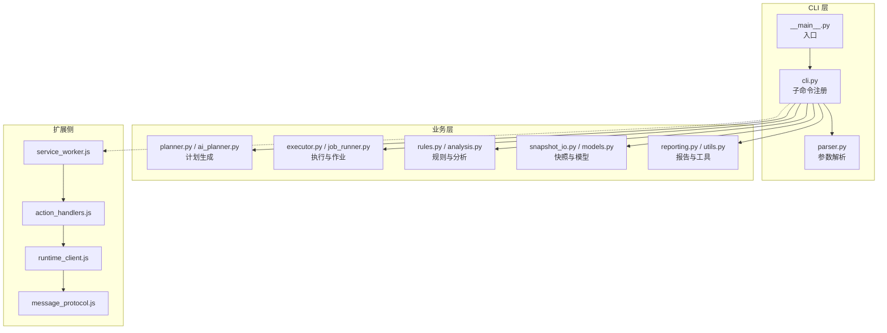
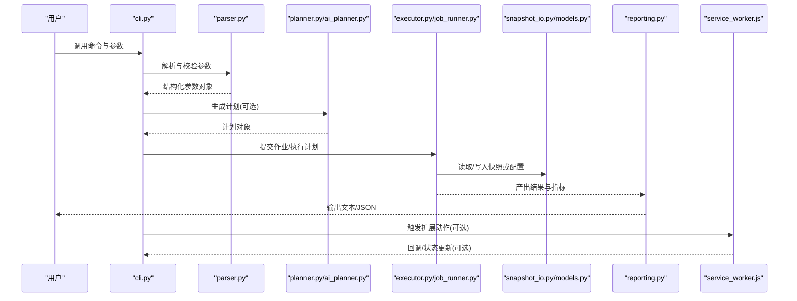
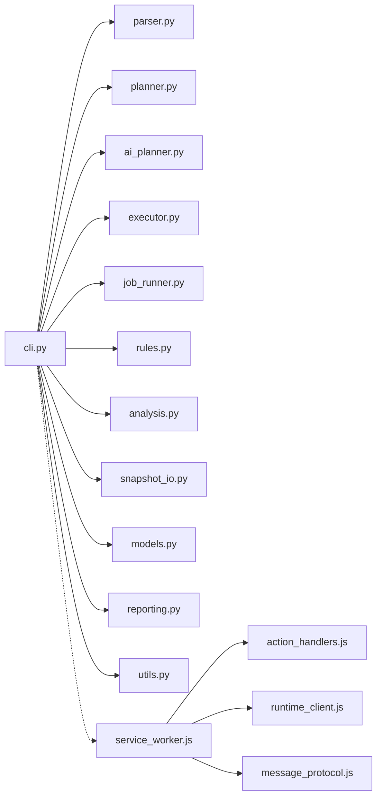

# 命令参考手册

<cite>
**本文引用的文件**   
- [src/bookmark_advisor/cli.py](file://src/bookmark_advisor/cli.py)
- [src/bookmark_advisor/__main__.py](file://src/bookmark_advisor/__main__.py)
- [src/bookmark_advisor/parser.py](file://src/bookmark_advisor/parser.py)
- [src/bookmark_advisor/executor.py](file://src/bookmark_advisor/executor.py)
- [src/bookmark_advisor/job_runner.py](file://src/bookmark_advisor/job_runner.py)
- [src/bookmark_advisor/models.py](file://src/bookmark_advisor/models.py)
- [src/bookmark_advisor/snapshot_io.py](file://src/bookmark_advisor/snapshot_io.py)
- [src/bookmark_advisor/reporting.py](file://src/bookmark_advisor/reporting.py)
- [src/bookmark_advisor/utils.py](file://src/bookmark_advisor/utils.py)
- [src/bookmark_advisor/planner.py](file://src/bookmark_advisor/planner.py)
- [src/bookmark_advisor/ai_planner.py](file://src/bookmark_advisor/ai_planner.py)
- [src/bookmark_advisor/rules.py](file://src/bookmark_advisor/rules.py)
- [src/bookmark_advisor/backup.py](file://src/bookmark_advisor/backup.py)
- [src/bookmark_advisor/analysis.py](file://src/bookmark_advisor/analysis.py)
- [extension/service_worker.js](file://extension/service_worker.js)
- [extension/background/action_handlers.js](file://extension/background/action_handlers.js)
- [extension/popup/runtime_client.js](file://extension/popup/runtime_client.js)
- [extension/shared/message_protocol.js](file://extension/shared/message_protocol.js)
</cite>

## 目录
1. [简介](#简介)
2. [项目结构](#项目结构)
3. [核心组件](#核心组件)
4. [架构总览](#架构总览)
5. [详细命令参考](#详细命令参考)
6. [依赖关系分析](#依赖关系分析)
7. [性能考虑](#性能考虑)
8. [故障排除指南](#故障排除指南)
9. [结论](#结论)
10. [附录](#附录)

## 简介
本手册面向命令行用户，提供 bookmark-advisor 的全部命令参考。内容涵盖：
- 每个命令的功能描述、语法格式、必需参数与可选选项
- 参数的数据类型、默认值、验证规则与约束条件
- 常见使用场景与组合用法示例
- 输出格式与返回码说明（成功状态、错误代码、调试信息）
- 参数组合最佳实践与性能优化建议
- 错误处理与故障排除实用指南

bookmark-advisor 是一个用于浏览器书签管理与优化的工具，支持计划生成、执行、快照导入导出、备份与分析等能力。其 CLI 入口位于 Python 包中，并通过扩展的后台脚本与弹出窗口进行交互。

## 项目结构
从命令行视角，关键路径如下：
- CLI 入口与子命令注册：src/bookmark_advisor/cli.py
- 模块主入口：src/bookmark_advisor/__main__.py
- 解析器与校验：src/bookmark_advisor/parser.py
- 任务执行与作业运行：src/bookmark_advisor/executor.py, src/bookmark_advisor/job_runner.py
- 数据模型与快照 I/O：src/bookmark_advisor/models.py, src/bookmark_advisor/snapshot_io.py
- 报告与工具函数：src/bookmark_advisor/reporting.py, src/bookmark_advisor/utils.py
- 计划与 AI 计划：src/bookmark_advisor/planner.py, src/bookmark_advisor/ai_planner.py
- 规则与备份、分析：src/bookmark_advisor/rules.py, src/bookmark_advisor/backup.py, src/bookmark_advisor/analysis.py
- 扩展侧消息协议与运行时客户端：extension/shared/message_protocol.js, extension/popup/runtime_client.js, extension/service_worker.js, extension/background/action_handlers.js

图表来源
- [src/bookmark_advisor/cli.py](file://src/bookmark_advisor/cli.py)
- [src/bookmark_advisor/__main__.py](file://src/bookmark_advisor/__main__.py)
- [src/bookmark_advisor/parser.py](file://src/bookmark_advisor/parser.py)
- [src/bookmark_advisor/planner.py](file://src/bookmark_advisor/planner.py)
- [src/bookmark_advisor/ai_planner.py](file://src/bookmark_advisor/ai_planner.py)
- [src/bookmark_advisor/executor.py](file://src/bookmark_advisor/executor.py)
- [src/bookmark_advisor/job_runner.py](file://src/bookmark_advisor/job_runner.py)
- [src/bookmark_advisor/rules.py](file://src/bookmark_advisor/rules.py)
- [src/bookmark_advisor/analysis.py](file://src/bookmark_advisor/analysis.py)
- [src/bookmark_advisor/snapshot_io.py](file://src/bookmark_advisor/snapshot_io.py)
- [src/bookmark_advisor/models.py](file://src/bookmark_advisor/models.py)
- [src/bookmark_advisor/reporting.py](file://src/bookmark_advisor/reporting.py)
- [src/bookmark_advisor/utils.py](file://src/bookmark_advisor/utils.py)
- [extension/service_worker.js](file://extension/service_worker.js)
- [extension/background/action_handlers.js](file://extension/background/action_handlers.js)
- [extension/popup/runtime_client.js](file://extension/popup/runtime_client.js)
- [extension/shared/message_protocol.js](file://extension/shared/message_protocol.js)

章节来源
- [src/bookmark_advisor/cli.py](file://src/bookmark_advisor/cli.py)
- [src/bookmark_advisor/__main__.py](file://src/bookmark_advisor/__main__.py)

## 核心组件
- CLI 注册与路由：负责定义顶层命令与子命令、解析全局与命令级参数、分发到具体处理器。
- 参数解析与校验：统一解析输入参数，进行类型转换、默认值填充与约束校验。
- 计划与执行：根据输入生成操作计划并执行，支持批量作业与并发控制。
- 快照与模型：读写书签快照数据，维护数据结构一致性。
- 规则与分析：基于规则集对书签进行分析与评估，输出诊断与建议。
- 报告与工具：格式化输出结果、日志与统计信息，提供通用工具函数。
- 扩展集成：通过消息协议与服务端通信，实现 UI 与后台任务的联动。

章节来源
- [src/bookmark_advisor/cli.py](file://src/bookmark_advisor/cli.py)
- [src/bookmark_advisor/parser.py](file://src/bookmark_advisor/parser.py)
- [src/bookmark_advisor/executor.py](file://src/bookmark_advisor/executor.py)
- [src/bookmark_advisor/job_runner.py](file://src/bookmark_advisor/job_runner.py)
- [src/bookmark_advisor/snapshot_io.py](file://src/bookmark_advisor/snapshot_io.py)
- [src/bookmark_advisor/models.py](file://src/bookmark_advisor/models.py)
- [src/bookmark_advisor/reporting.py](file://src/bookmark_advisor/reporting.py)
- [src/bookmark_advisor/utils.py](file://src/bookmark_advisor/utils.py)
- [extension/shared/message_protocol.js](file://extension/shared/message_protocol.js)

## 架构总览
下图展示 CLI 到后端执行与扩展侧交互的整体流程。

图表来源
- [src/bookmark_advisor/cli.py](file://src/bookmark_advisor/cli.py)
- [src/bookmark_advisor/parser.py](file://src/bookmark_advisor/parser.py)
- [src/bookmark_advisor/planner.py](file://src/bookmark_advisor/planner.py)
- [src/bookmark_advisor/ai_planner.py](file://src/bookmark_advisor/ai_planner.py)
- [src/bookmark_advisor/executor.py](file://src/bookmark_advisor/executor.py)
- [src/bookmark_advisor/job_runner.py](file://src/bookmark_advisor/job_runner.py)
- [src/bookmark_advisor/snapshot_io.py](file://src/bookmark_advisor/snapshot_io.py)
- [src/bookmark_advisor/models.py](file://src/bookmark_advisor/models.py)
- [src/bookmark_advisor/reporting.py](file://src/bookmark_advisor/reporting.py)
- [extension/service_worker.js](file://extension/service_worker.js)

## 详细命令参考

### 全局参数
- --help/-h：显示帮助信息并退出。
- --verbose/-v：增加日志详细程度；可多次使用以提升级别。
- --quiet/-q：减少输出，仅保留必要信息。
- --log-file/-l <path>：将日志输出到指定文件。
- --config/-c <path>：指定配置文件路径（若存在）。
- --dry-run：仅模拟执行，不实际修改数据。
- --output-format/-o <format>：指定输出格式，如 text/json。
- --timeout/-t <秒>：设置超时时间（秒），适用于网络或外部服务调用。
- --concurrency/-j <数量>：并发执行作业数。
- --work-dir/-w <路径>：工作目录，用于临时文件与中间产物。
- --version：打印版本信息并退出。

注意：上述为通用参数约定，具体可用性取决于各子命令的实现。

章节来源
- [src/bookmark_advisor/cli.py](file://src/bookmark_advisor/cli.py)
- [src/bookmark_advisor/parser.py](file://src/bookmark_advisor/parser.py)

### 命令：plan
功能：生成书签整理或迁移的操作计划。
语法：
- plan [选项]

常用选项：
- --input/-i <路径|URL>：输入源，可为本地快照文件或远程 URL。
- --rules/-r <路径|名称>：规则集路径或内置规则名。
- --strategy/-s <策略>：计划策略，如 reorg/cleanup/migrate。
- --target/-t <目标>：目标位置或命名空间。
- --preview/-p：预览模式，仅输出计划而不执行。
- --max-depth/-d <整数>：最大递归深度。
- --filter/-f <表达式>：过滤条件表达式。
- --ai/--no-ai：是否启用 AI 辅助计划生成。
- --ai-model/-m <模型>：AI 模型标识（当启用 AI 时）。
- --ai-endpoint/-e <URL>：AI 服务端点（当启用 AI 时）。
- --ai-token/-k <令牌>：AI 认证令牌（当启用 AI 时）。
- --output/-o <路径>：输出计划文件路径。
- --validate-only：仅校验计划合法性，不保存。

参数说明：
- input：字符串，必填。支持 JSON/YAML 快照或浏览器导出格式。
- rules：字符串，必填或可选（若未提供则使用默认规则）。
- strategy：枚举，默认 reorg。
- target：字符串，可选，默认为当前书签根。
- preview：布尔，默认 false。
- max-depth：整数，默认 5。
- filter：字符串，可选，遵循内部表达式语法。
- ai：布尔，默认 false。
- ai-model：字符串，可选。
- ai-endpoint：URL，可选。
- ai-token：字符串，可选。
- output：字符串，可选。
- validate-only：布尔，默认 false。

示例：
- 生成清理计划并预览：plan -i bookmarks.json --strategy cleanup --preview
- 使用自定义规则与过滤器：plan -i data.json -r my_rules.yaml --filter "tag=important"
- 启用 AI 生成迁移计划：plan -i export.html --strategy migrate --ai --ai-model gpt-4o --ai-endpoint https://api.example.com/v1/chat/completions

输出：
- 标准输出包含计划摘要；若指定 --output，则写入文件。
- 当 --output-format=json 时，输出结构化 JSON。

返回码：
- 0：成功
- 非零：失败（见“返回码”章节）

章节来源
- [src/bookmark_advisor/cli.py](file://src/bookmark_advisor/cli.py)
- [src/bookmark_advisor/planner.py](file://src/bookmark_advisor/planner.py)
- [src/bookmark_advisor/ai_planner.py](file://src/bookmark_advisor/ai_planner.py)
- [src/bookmark_advisor/rules.py](file://src/bookmark_advisor/rules.py)
- [src/bookmark_advisor/parser.py](file://src/bookmark_advisor/parser.py)

### 命令：execute
功能：执行已生成的计划或在线执行任务。
语法：
- execute [选项]

常用选项：
- --plan/-p <路径>：计划文件路径。
- --job-id/-j <ID>：指定作业 ID（若为在线执行）。
- --resume/-R：恢复上次中断的作业。
- --batch/-b <数量>：批大小。
- --retry/-y <次数>：重试次数。
- --timeout/-t <秒>：作业超时。
- --dry-run：仅模拟执行。
- --output/-o <路径>：输出执行日志或结果。
- --notify/--no-notify：完成后通知（通过扩展或回调）。

参数说明：
- plan：字符串，必填（离线执行）。
- job-id：字符串，可选（在线执行）。
- resume：布尔，默认 false。
- batch：整数，默认 100。
- retry：整数，默认 3。
- timeout：整数，单位秒，默认 300。
- dry-run：布尔，默认 false。
- output：字符串，可选。
- notify：布尔，默认 true。

示例：
- 执行计划文件：execute -p plan.json --dry-run
- 恢复作业并限制批大小：execute -j abc123 --resume --batch 50
- 带重试与超时：execute -p plan.json --retry 5 --timeout 600

输出：
- 控制台输出执行进度与结果摘要。
- 若指定 --output，则写入详细日志。

返回码：
- 0：成功
- 非零：失败（见“返回码”章节）

章节来源
- [src/bookmark_advisor/cli.py](file://src/bookmark_advisor/cli.py)
- [src/bookmark_advisor/executor.py](file://src/bookmark_advisor/executor.py)
- [src/bookmark_advisor/job_runner.py](file://src/bookmark_advisor/job_runner.py)
- [src/bookmark_advisor/parser.py](file://src/bookmark_advisor/parser.py)

### 命令：snapshot
功能：导入/导出书签快照。
语法：
- snapshot [子命令] [选项]

子命令：
- import：导入快照
- export：导出快照
- diff：比较两个快照差异

import 选项：
- --input/-i <路径|URL>：输入快照文件
- --format/-f <格式>：输入格式（json/html/yaml）
- --dest/-d <目标>：目标书签位置
- --merge/--no-merge：是否合并到现有书签
- --overwrite/--no-overwrite：覆盖同名节点
- --dry-run：仅预览变更

export 选项：
- --source/-s <路径|URL>：源书签位置
- --output/-o <路径>：输出文件路径
- --format/-f <格式>：输出格式（json/html/yaml）
- --depth/-d <整数>：导出深度
- --filter/-f <表达式>：过滤条件

diff 选项：
- --left/-l <路径>：左侧快照
- --right/-r <路径>：右侧快照
- --format/-f <格式>：输出格式（text/json）

示例：
- 导入 JSON 快照并合并：snapshot import -i backup.json --format json --merge
- 导出 HTML 书签：snapshot export -s root --output bookmarks.html --format html
- 比较快照差异：snapshot diff -l old.json -r new.json --format json

输出：
- 导入/导出：返回操作摘要与受影响节点计数。
- diff：返回差异列表（新增、删除、移动、重命名）。

返回码：
- 0：成功
- 非零：失败（见“返回码”章节）

章节来源
- [src/bookmark_advisor/cli.py](file://src/bookmark_advisor/cli.py)
- [src/bookmark_advisor/snapshot_io.py](file://src/bookmark_advisor/snapshot_io.py)
- [src/bookmark_advisor/models.py](file://src/bookmark_advisor/models.py)
- [src/bookmark_advisor/parser.py](file://src/bookmark_advisor/parser.py)

### 命令：analyze
功能：基于规则对书签进行分析与评估。
语法：
- analyze [选项]

常用选项：
- --input/-i <路径|URL>：输入快照或实时书签源
- --rules/-r <路径|名称>：规则集
- --severity/-S <级别>：最低严重级别阈值（info/warning/error）
- --output/-o <路径>：分析报告输出路径
- --format/-f <格式>：输出格式（text/json）
- --summary/--no-summary：是否生成汇总
- --ai/--no-ai：是否启用 AI 辅助分析

参数说明：
- input：字符串，必填。
- rules：字符串，必填或可选（默认规则）。
- severity：枚举，默认 info。
- output：字符串，可选。
- format：枚举，默认 text。
- summary：布尔，默认 true。
- ai：布尔，默认 false。

示例：
- 分析并输出 JSON 报告：analyze -i bookmarks.json --format json --output report.json
- 仅关注警告及以上：analyze -i data.json --severity warning
- 启用 AI 建议：analyze -i export.html --ai

输出：
- 文本或 JSON 形式的分析报告，包含问题清单与建议。

返回码：
- 0：成功
- 非零：失败（见“返回码”章节）

章节来源
- [src/bookmark_advisor/cli.py](file://src/bookmark_advisor/cli.py)
- [src/bookmark_advisor/analysis.py](file://src/bookmark_advisor/analysis.py)
- [src/bookmark_advisor/rules.py](file://src/bookmark_advisor/rules.py)
- [src/bookmark_advisor/reporting.py](file://src/bookmark_advisor/reporting.py)
- [src/bookmark_advisor/parser.py](file://src/bookmark_advisor/parser.py)

### 命令：backup
功能：创建书签备份与恢复。
语法：
- backup [子命令] [选项]

子命令：
- create：创建备份
- restore：恢复备份
- list：列出可用备份

create 选项：
- --dest/-d <路径>：备份存储路径
- --compress/--no-compress：是否压缩
- --label/-L <标签>：备份标签
- --include/--exclude：包含/排除规则

restore 选项：
- --source/-s <路径>：备份文件路径
- --target/-t <目标>：恢复目标位置
- --dry-run：仅预览恢复影响

list 选项：
- --dir/-D <路径>：备份目录
- --format/-f <格式>：输出格式（text/json）

示例：
- 创建压缩备份：backup create -d ./backups --compress --label daily
- 恢复备份到根书签：backup restore -s backups/daily.tar.gz --target root
- 列出备份：backup list -D ./backups --format json

输出：
- 创建/恢复：返回操作结果与影响范围。
- list：返回备份清单与元数据。

返回码：
- 0：成功
- 非零：失败（见“返回码”章节）

章节来源
- [src/bookmark_advisor/cli.py](file://src/bookmark_advisor/cli.py)
- [src/bookmark_advisor/backup.py](file://src/bookmark_advisor/backup.py)
- [src/bookmark_advisor/parser.py](file://src/bookmark_advisor/parser.py)

### 命令：run
功能：运行预定义任务或作业。
语法：
- run [选项]

常用选项：
- --task/-T <任务名>：任务名称
- --args/-a <键值对>：任务参数（key=value）
- --schedule/-S <cron>：定时调度表达式（可选）
- --once/--no-once：是否仅执行一次
- --notify/--no-notify：完成后通知

示例：
- 运行清理任务：run --task cleanup --args "max_depth=3;tag=archive"
- 定时执行：run --task sync --schedule "0 2 * * *"

输出：
- 任务执行日志与结果摘要。

返回码：
- 0：成功
- 非零：失败（见“返回码”章节）

章节来源
- [src/bookmark_advisor/cli.py](file://src/bookmark_advisor/cli.py)
- [src/bookmark_advisor/job_runner.py](file://src/bookmark_advisor/job_runner.py)
- [src/bookmark_advisor/parser.py](file://src/bookmark_advisor/parser.py)

### 命令：status
功能：查看系统状态与作业信息。
语法：
- status [选项]

常用选项：
- --jobs/-J：列出作业
- --metrics/-M：显示性能指标
- --health/-H：健康检查
- --format/-f <格式>：输出格式（text/json）

示例：
- 列出所有作业：status --jobs
- 查看健康状态：status --health

输出：
- 作业列表、指标与健康检查结果。

返回码：
- 0：成功
- 非零：失败（见“返回码”章节）

章节来源
- [src/bookmark_advisor/cli.py](file://src/bookmark_advisor/cli.py)
- [src/bookmark_advisor/reporting.py](file://src/bookmark_advisor/reporting.py)
- [src/bookmark_advisor/parser.py](file://src/bookmark_advisor/parser.py)

### 命令：plugin
功能：管理插件与扩展集成。
语法：
- plugin [子命令] [选项]

子命令：
- install：安装插件
- uninstall：卸载插件
- list：列出已安装插件
- enable/disable：启用/禁用插件

install 选项：
- --source/-s <路径|URL>：插件源
- --version/-V <版本>：插件版本
- --force/--no-force：强制安装

uninstall 选项：
- --name/-n <名称>：插件名称
- --keep-data/--no-keep-data：是否保留数据

list 选项：
- --format/-f <格式>：输出格式（text/json）

enable/disable 选项：
- --name/-n <名称>：插件名称

示例：
- 安装插件：plugin install -s ./plugins/reorg-v1.zip
- 列出插件：plugin list --format json
- 禁用插件：plugin disable -n reorg

输出：
- 插件管理操作的结果与状态。

返回码：
- 0：成功
- 非零：失败（见“返回码”章节）

章节来源
- [src/bookmark_advisor/cli.py](file://src/bookmark_advisor/cli.py)
- [src/bookmark_advisor/parser.py](file://src/bookmark_advisor/parser.py)

### 命令：config
功能：管理配置与密钥。
语法：
- config [子命令] [选项]

子命令：
- get：获取配置项
- set：设置配置项
- delete：删除配置项
- list：列出配置项
- secrets：管理密钥

get/set/delete/list 选项：
- --key/-k <键>：配置键
- --value/-v <值>：配置值（set 时使用）
- --scope/-S <作用域>：全局/用户/项目
- --format/-f <格式>：输出格式（text/json）

secrets 子命令：
- add：添加密钥
- remove：移除密钥
- list：列出密钥
- rotate：轮换密钥

示例：
- 设置 AI 端点：config set --key ai.endpoint --value https://api.example.com/v1
- 列出全局配置：config list --scope global
- 添加密钥：config secrets add --key api_token --value sk-xxxxx

输出：
- 配置与密钥管理结果。

返回码：
- 0：成功
- 非零：失败（见“返回码”章节）

章节来源
- [src/bookmark_advisor/cli.py](file://src/bookmark_advisor/cli.py)
- [src/bookmark_advisor/parser.py](file://src/bookmark_advisor/parser.py)

### 命令：ui
功能：启动或与控制扩展 UI 交互。
语法：
- ui [子命令] [选项]

子命令：
- open：打开弹出窗口
- close：关闭弹出窗口
- send：发送消息到扩展
- listen：监听扩展事件

open/close/send/listen 选项：
- --port/-P <端口>：本地端口
- --host/-H <主机>：本地主机
- --message/-m <消息>：发送的消息（send 时使用）
- --timeout/-t <秒>：等待响应超时

示例：
- 打开弹出窗口：ui open --port 8080
- 发送消息：ui send -m '{"action":"refresh"}'
- 监听事件：ui listen --timeout 30

输出：
- UI 交互状态与事件流。

返回码：
- 0：成功
- 非零：失败（见“返回码”章节）

章节来源
- [src/bookmark_advisor/cli.py](file://src/bookmark_advisor/cli.py)
- [extension/service_worker.js](file://extension/service_worker.js)
- [extension/background/action_handlers.js](file://extension/background/action_handlers.js)
- [extension/popup/runtime_client.js](file://extension/popup/runtime_client.js)
- [extension/shared/message_protocol.js](file://extension/shared/message_protocol.js)

## 依赖关系分析
CLI 与各模块之间的依赖关系如下：

图表来源
- [src/bookmark_advisor/cli.py](file://src/bookmark_advisor/cli.py)
- [src/bookmark_advisor/parser.py](file://src/bookmark_advisor/parser.py)
- [src/bookmark_advisor/planner.py](file://src/bookmark_advisor/planner.py)
- [src/bookmark_advisor/ai_planner.py](file://src/bookmark_advisor/ai_planner.py)
- [src/bookmark_advisor/executor.py](file://src/bookmark_advisor/executor.py)
- [src/bookmark_advisor/job_runner.py](file://src/bookmark_advisor/job_runner.py)
- [src/bookmark_advisor/rules.py](file://src/bookmark_advisor/rules.py)
- [src/bookmark_advisor/analysis.py](file://src/bookmark_advisor/analysis.py)
- [src/bookmark_advisor/snapshot_io.py](file://src/bookmark_advisor/snapshot_io.py)
- [src/bookmark_advisor/models.py](file://src/bookmark_advisor/models.py)
- [src/bookmark_advisor/reporting.py](file://src/bookmark_advisor/reporting.py)
- [src/bookmark_advisor/utils.py](file://src/bookmark_advisor/utils.py)
- [extension/service_worker.js](file://extension/service_worker.js)
- [extension/background/action_handlers.js](file://extension/background/action_handlers.js)
- [extension/popup/runtime_client.js](file://extension/popup/runtime_client.js)
- [extension/shared/message_protocol.js](file://extension/shared/message_protocol.js)

章节来源
- [src/bookmark_advisor/cli.py](file://src/bookmark_advisor/cli.py)
- [extension/service_worker.js](file://extension/service_worker.js)

## 性能考虑
- 并发与批处理：合理设置 --concurrency 与 --batch，避免资源争用与内存峰值。
- 超时与重试：为网络与外部服务调用设置合适的 --timeout 与 --retry，提升稳定性。
- 过滤与深度：使用 --filter 与 --max-depth 缩小处理范围，降低复杂度。
- 输出格式：在大规模数据处理时优先使用 JSON 输出，便于后续自动化处理。
- 工作目录：使用 --work-dir 指定独立目录，避免磁盘竞争与碎片化。
- 规则与计划：复用已生成的计划文件，减少重复计算与 AI 调用开销。

[本节为通用指导，无需特定文件引用]

## 故障排除指南
常见问题与解决步骤：
- 参数解析错误：检查参数类型与取值范围，确认必填参数是否提供。
- 权限不足：确保对输入/输出路径具有读写权限。
- 网络超时：调整 --timeout，检查 AI 端点可达性与认证令牌。
- 快照格式不兼容：确认 --format 与实际文件格式一致。
- 作业中断：使用 --resume 恢复作业，检查日志定位失败原因。
- 扩展通信失败：确认服务端口与主机配置，检查消息协议版本。

返回码说明：
- 0：成功
- 1：通用错误（参数、权限、I/O）
- 2：网络错误（超时、连接失败）
- 3：数据错误（格式不合法、校验失败）
- 4：执行错误（作业失败、计划无效）
- 5：配置错误（缺失配置、密钥无效）
- 6：扩展错误（UI 通信失败、消息协议不匹配）

章节来源
- [src/bookmark_advisor/parser.py](file://src/bookmark_advisor/parser.py)
- [src/bookmark_advisor/executor.py](file://src/bookmark_advisor/executor.py)
- [src/bookmark_advisor/job_runner.py](file://src/bookmark_advisor/job_runner.py)
- [src/bookmark_advisor/snapshot_io.py](file://src/bookmark_advisor/snapshot_io.py)
- [src/bookmark_advisor/reporting.py](file://src/bookmark_advisor/reporting.py)
- [extension/shared/message_protocol.js](file://extension/shared/message_protocol.js)

## 结论
本命令参考手册提供了 bookmark-advisor 的完整 CLI 使用说明，涵盖命令语法、参数详解、示例、输出与返回码、性能优化与故障排除。建议用户结合具体场景选择合适的命令与参数组合，充分利用计划与规则机制，提高书签管理的效率与可靠性。

[本节为总结性内容，无需特定文件引用]

## 附录
- 最佳实践：
  - 先使用 --dry-run 与 --preview 验证计划与影响范围。
  - 定期创建备份，并在重大变更前进行快照对比。
  - 使用 JSON 输出与自动化脚本进行持续集成。
  - 合理配置并发与批大小，平衡性能与资源占用。
- 扩展集成：
  - 通过 ui 命令与扩展交互，实现可视化操作与实时监控。
  - 遵循 message_protocol 规范，确保消息格式与版本兼容。

[本节为补充信息，无需特定文件引用]