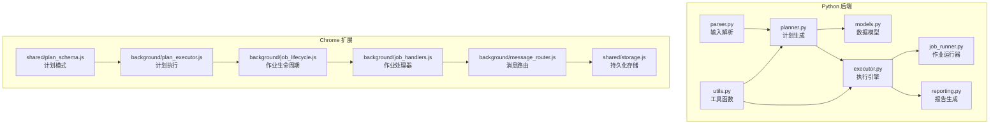
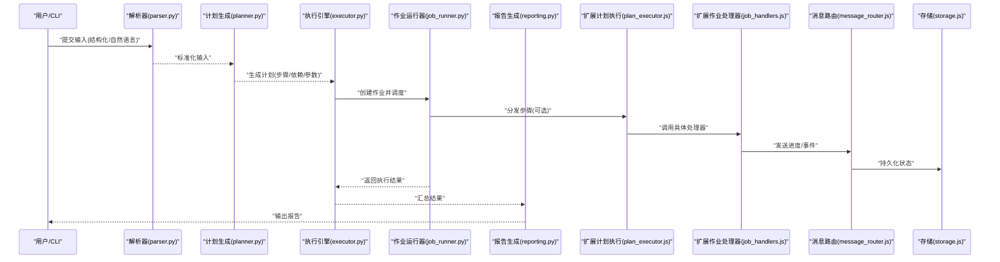
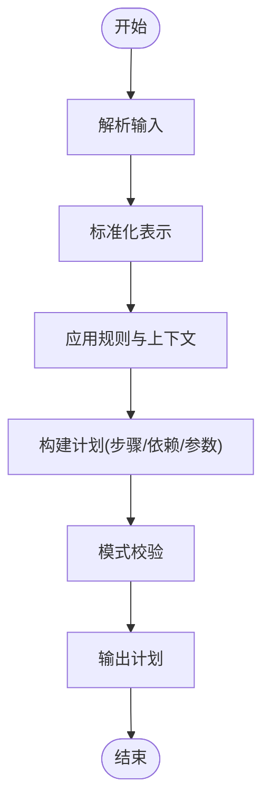
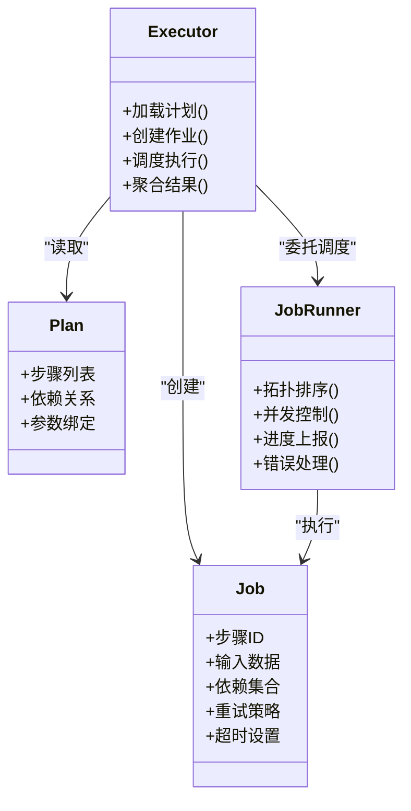
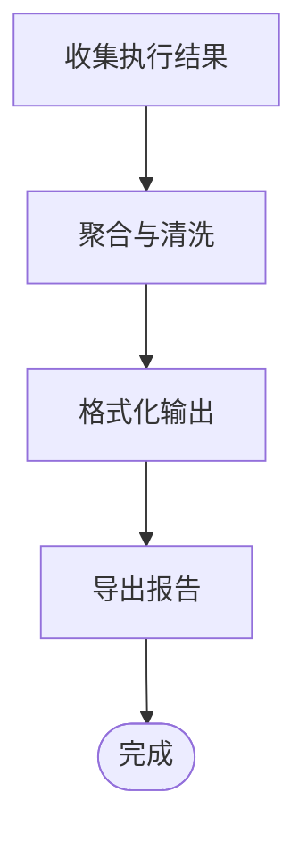
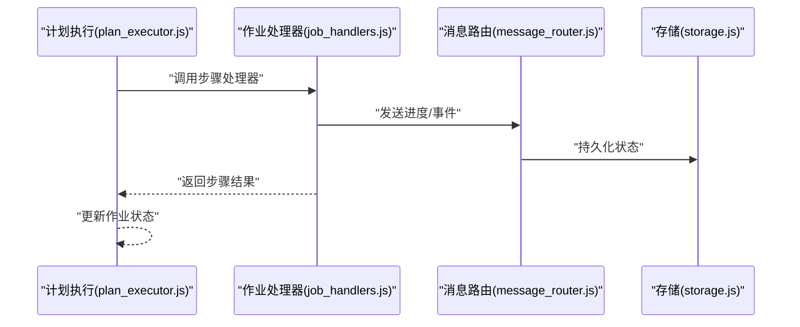
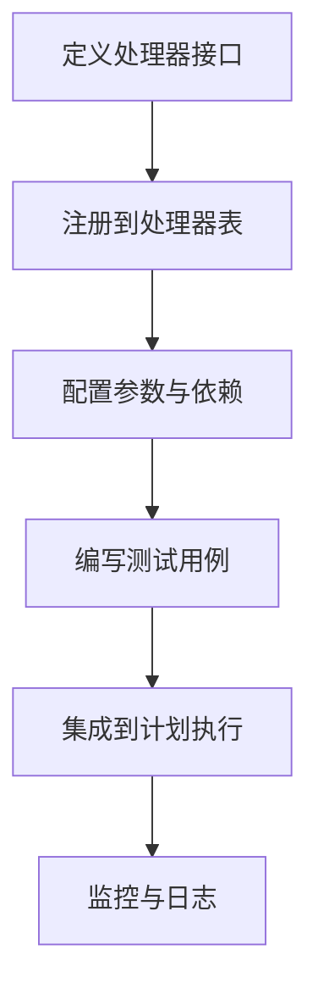
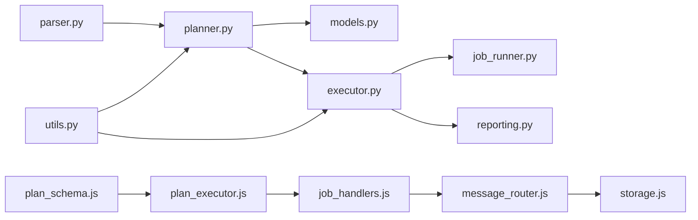

# 处理工作流

<cite>
**本文引用的文件**   
- [src/bookmark_advisor/planner.py](file://src/bookmark_advisor/planner.py)
- [src/bookmark_advisor/executor.py](file://src/bookmark_advisor/executor.py)
- [src/bookmark_advisor/job_runner.py](file://src/bookmark_advisor/job_runner.py)
- [src/bookmark_advisor/reporting.py](file://src/bookmark_advisor/reporting.py)
- [src/bookmark_advisor/models.py](file://src/bookmark_advisor/models.py)
- [src/bookmark_advisor/parser.py](file://src/bookmark_advisor/parser.py)
- [src/bookmark_advisor/utils.py](file://src/bookmark_advisor/utils.py)
- [extension/background/plan_executor.js](file://extension/background/plan_executor.js)
- [extension/background/job_lifecycle.js](file://extension/background/job_lifecycle.js)
- [extension/background/job_handlers.js](file://extension/background/job_handlers.js)
- [extension/background/message_router.js](file://extension/background/message_router.js)
- [extension/shared/plan_schema.js](file://extension/shared/plan_schema.js)
- [extension/shared/storage.js](file://extension/shared/storage.js)
</cite>

## 目录
1. [简介](#简介)
2. [项目结构](#项目结构)
3. [核心组件](#核心组件)
4. [架构总览](#架构总览)
5. [详细组件分析](#详细组件分析)
6. [依赖关系分析](#依赖关系分析)
7. [性能考虑](#性能考虑)
8. [故障排查指南](#故障排查指南)
9. [结论](#结论)
10. [附录](#附录)

## 简介
本文件面向“处理工作流”的端到端实现，覆盖从输入到输出的完整数据处理流程，包括计划生成、执行引擎与报告生成三大阶段。文档将深入解释每个处理步骤的具体实现（数据预处理、业务逻辑处理、结果后处理），并说明异步处理与并发执行的机制（任务调度、进度跟踪、错误恢复）。同时介绍中间数据的存储与管理方式（临时文件、缓存策略、内存优化），并提供监控与调试方法（日志记录、性能分析、故障诊断）以及自定义处理步骤的集成指南。

## 项目结构
本项目包含两条并行但互补的工作流路径：
- Python 后端（bookmark_advisor）：负责计划生成、执行与报告输出，提供 CLI 入口与可复现的数据处理管线。
- Chrome 扩展（extension）：在浏览器侧进行计划编译、执行与 UI 交互，并通过消息协议与后台服务通信。

图表来源
- [src/bookmark_advisor/planner.py](file://src/bookmark_advisor/planner.py)
- [src/bookmark_advisor/executor.py](file://src/bookmark_advisor/executor.py)
- [src/bookmark_advisor/job_runner.py](file://src/bookmark_advisor/job_runner.py)
- [src/bookmark_advisor/reporting.py](file://src/bookmark_advisor/reporting.py)
- [src/bookmark_advisor/models.py](file://src/bookmark_advisor/models.py)
- [src/bookmark_advisor/parser.py](file://src/bookmark_advisor/parser.py)
- [src/bookmark_advisor/utils.py](file://src/bookmark_advisor/utils.py)
- [extension/background/plan_executor.js](file://extension/background/plan_executor.js)
- [extension/background/job_lifecycle.js](file://extension/background/job_lifecycle.js)
- [extension/background/job_handlers.js](file://extension/background/job_handlers.js)
- [extension/background/message_router.js](file://extension/background/message_router.js)
- [extension/shared/plan_schema.js](file://extension/shared/plan_schema.js)
- [extension/shared/storage.js](file://extension/shared/storage.js)

章节来源
- [src/bookmark_advisor/planner.py](file://src/bookmark_advisor/planner.py)
- [src/bookmark_advisor/executor.py](file://src/bookmark_advisor/executor.py)
- [src/bookmark_advisor/job_runner.py](file://src/bookmark_advisor/job_runner.py)
- [src/bookmark_advisor/reporting.py](file://src/bookmark_advisor/reporting.py)
- [src/bookmark_advisor/models.py](file://src/bookmark_advisor/models.py)
- [src/bookmark_advisor/parser.py](file://src/bookmark_advisor/parser.py)
- [src/bookmark_advisor/utils.py](file://src/bookmark_advisor/utils.py)
- [extension/background/plan_executor.js](file://extension/background/plan_executor.js)
- [extension/background/job_lifecycle.js](file://extension/background/job_lifecycle.js)
- [extension/background/job_handlers.js](file://extension/background/job_handlers.js)
- [extension/background/message_router.js](file://extension/background/message_router.js)
- [extension/shared/plan_schema.js](file://extension/shared/plan_schema.js)
- [extension/shared/storage.js](file://extension/shared/storage.js)

## 核心组件
- 计划生成器（Python planner）：接收结构化或自然语言输入，结合规则与上下文，产出可执行的计划（步骤序列、参数、依赖关系）。
- 执行引擎（Python executor + job_runner）：将计划转换为作业（Job），按依赖顺序调度执行，支持并发与重试，维护状态与进度。
- 报告生成器（Python reporting）：汇总执行结果，生成可读报告（文本/结构化），便于审计与回溯。
- 浏览器侧计划执行（extension plan_executor）：校验计划模式、分发步骤、管理作业生命周期、与消息路由和存储交互。
- 作业处理器（extension job_handlers）：具体步骤的业务逻辑封装，统一接口供执行器调用。
- 消息路由与存储（extension message_router + storage）：跨模块通信与持久化，保证状态一致性与可恢复性。

章节来源
- [src/bookmark_advisor/planner.py](file://src/bookmark_advisor/planner.py)
- [src/bookmark_advisor/executor.py](file://src/bookmark_advisor/executor.py)
- [src/bookmark_advisor/job_runner.py](file://src/bookmark_advisor/job_runner.py)
- [src/bookmark_advisor/reporting.py](file://src/bookmark_advisor/reporting.py)
- [extension/background/plan_executor.js](file://extension/background/plan_executor.js)
- [extension/background/job_handlers.js](file://extension/background/job_handlers.js)
- [extension/background/message_router.js](file://extension/background/message_router.js)
- [extension/shared/storage.js](file://extension/shared/storage.js)

## 架构总览
下图展示从输入到输出的端到端工作流，涵盖计划生成、执行与报告三个阶段，以及前后端的协作点。

图表来源
- [src/bookmark_advisor/parser.py](file://src/bookmark_advisor/parser.py)
- [src/bookmark_advisor/planner.py](file://src/bookmark_advisor/planner.py)
- [src/bookmark_advisor/executor.py](file://src/bookmark_advisor/executor.py)
- [src/bookmark_advisor/job_runner.py](file://src/bookmark_advisor/job_runner.py)
- [src/bookmark_advisor/reporting.py](file://src/bookmark_advisor/reporting.py)
- [extension/background/plan_executor.js](file://extension/background/plan_executor.js)
- [extension/background/job_handlers.js](file://extension/background/job_handlers.js)
- [extension/background/message_router.js](file://extension/background/message_router.js)
- [extension/shared/storage.js](file://extension/shared/storage.js)

## 详细组件分析

### 计划生成阶段（数据预处理与计划构建）
- 输入解析：将原始输入规范化为内部表示，提取关键实体、约束与目标。
- 规则与上下文：结合领域规则与上下文信息，生成步骤序列、依赖图与参数绑定。
- 计划校验：依据共享模式对计划进行结构校验，确保后续执行可被正确消费。

图表来源
- [src/bookmark_advisor/parser.py](file://src/bookmark_advisor/parser.py)
- [src/bookmark_advisor/planner.py](file://src/bookmark_advisor/planner.py)
- [extension/shared/plan_schema.js](file://extension/shared/plan_schema.js)

章节来源
- [src/bookmark_advisor/parser.py](file://src/bookmark_advisor/parser.py)
- [src/bookmark_advisor/planner.py](file://src/bookmark_advisor/planner.py)
- [extension/shared/plan_schema.js](file://extension/shared/plan_schema.js)

### 执行引擎阶段（作业调度、并发与进度）
- 作业建模：将计划步骤映射为作业对象，携带输入、依赖、超时与重试策略。
- 调度与并发：基于依赖拓扑进行拓扑排序，使用并发控制限制并行度，避免资源争用。
- 进度与状态：通过消息通道上报进度，持久化中间状态以支持中断恢复。
- 错误恢复：捕获异常、记录原因、触发重试或回退策略，保证整体健壮性。

图表来源
- [src/bookmark_advisor/models.py](file://src/bookmark_advisor/models.py)
- [src/bookmark_advisor/executor.py](file://src/bookmark_advisor/executor.py)
- [src/bookmark_advisor/job_runner.py](file://src/bookmark_advisor/job_runner.py)

章节来源
- [src/bookmark_advisor/models.py](file://src/bookmark_advisor/models.py)
- [src/bookmark_advisor/executor.py](file://src/bookmark_advisor/executor.py)
- [src/bookmark_advisor/job_runner.py](file://src/bookmark_advisor/job_runner.py)

### 报告生成阶段（结果后处理与输出）
- 结果聚合：收集各作业的执行结果与指标，合并为统一视图。
- 格式化与导出：根据需求生成文本、表格或结构化报告，便于审计与分享。
- 可追溯性：附带时间戳、版本信息与执行摘要，支持问题定位与复盘。

图表来源
- [src/bookmark_advisor/reporting.py](file://src/bookmark_advisor/reporting.py)

章节来源
- [src/bookmark_advisor/reporting.py](file://src/bookmark_advisor/reporting.py)

### 浏览器侧计划执行与作业生命周期
- 计划执行：校验计划模式、分发步骤、管理执行上下文。
- 作业生命周期：创建、运行、暂停、恢复、取消与清理。
- 处理器集成：通过统一接口注册与调用具体业务处理器。
- 消息与存储：通过消息路由传递事件，持久化状态以便刷新后恢复。

图表来源
- [extension/background/plan_executor.js](file://extension/background/plan_executor.js)
- [extension/background/job_handlers.js](file://extension/background/job_handlers.js)
- [extension/background/message_router.js](file://extension/background/message_router.js)
- [extension/shared/storage.js](file://extension/shared/storage.js)

章节来源
- [extension/background/plan_executor.js](file://extension/background/plan_executor.js)
- [extension/background/job_lifecycle.js](file://extension/background/job_lifecycle.js)
- [extension/background/job_handlers.js](file://extension/background/job_handlers.js)
- [extension/background/message_router.js](file://extension/background/message_router.js)
- [extension/shared/storage.js](file://extension/shared/storage.js)

### 自定义处理步骤集成指南
- 定义处理器接口：遵循统一的输入/输出契约，确保可被执行器识别与调用。
- 注册与发现：在处理器注册表中声明新步骤，支持动态加载与版本兼容。
- 配置与参数：通过计划参数注入运行时配置，保持步骤的可复用性。
- 测试与验证：编写单元测试与集成测试，覆盖正常路径与异常分支。

[本节为概念性指导，不直接分析具体文件]

## 依赖关系分析
- 模块内聚与耦合：
  - planner 与 parser 紧密耦合于输入规范；executor 与 job_runner 围绕作业生命周期形成高内聚。
  - extension 侧 plan_executor 与 job_handlers 通过消息路由解耦，降低直接依赖。
- 外部依赖与集成点：
  - 存储层用于持久化作业状态与中间结果，支持恢复与审计。
  - 计划模式作为前后端契约，保障计划结构的稳定性与兼容性。

图表来源
- [src/bookmark_advisor/planner.py](file://src/bookmark_advisor/planner.py)
- [src/bookmark_advisor/executor.py](file://src/bookmark_advisor/executor.py)
- [src/bookmark_advisor/job_runner.py](file://src/bookmark_advisor/job_runner.py)
- [src/bookmark_advisor/reporting.py](file://src/bookmark_advisor/reporting.py)
- [src/bookmark_advisor/models.py](file://src/bookmark_advisor/models.py)
- [src/bookmark_advisor/parser.py](file://src/bookmark_advisor/parser.py)
- [src/bookmark_advisor/utils.py](file://src/bookmark_advisor/utils.py)
- [extension/shared/plan_schema.js](file://extension/shared/plan_schema.js)
- [extension/background/plan_executor.js](file://extension/background/plan_executor.js)
- [extension/background/job_handlers.js](file://extension/background/job_handlers.js)
- [extension/background/message_router.js](file://extension/background/message_router.js)
- [extension/shared/storage.js](file://extension/shared/storage.js)

章节来源
- [src/bookmark_advisor/planner.py](file://src/bookmark_advisor/planner.py)
- [src/bookmark_advisor/executor.py](file://src/bookmark_advisor/executor.py)
- [src/bookmark_advisor/job_runner.py](file://src/bookmark_advisor/job_runner.py)
- [src/bookmark_advisor/reporting.py](file://src/bookmark_advisor/reporting.py)
- [src/bookmark_advisor/models.py](file://src/bookmark_advisor/models.py)
- [src/bookmark_advisor/parser.py](file://src/bookmark_advisor/parser.py)
- [src/bookmark_advisor/utils.py](file://src/bookmark_advisor/utils.py)
- [extension/shared/plan_schema.js](file://extension/shared/plan_schema.js)
- [extension/background/plan_executor.js](file://extension/background/plan_executor.js)
- [extension/background/job_handlers.js](file://extension/background/job_handlers.js)
- [extension/background/message_router.js](file://extension/background/message_router.js)
- [extension/shared/storage.js](file://extension/shared/storage.js)

## 性能考虑
- 并发控制：限制最大并行度，避免 I/O 或 CPU 瓶颈；对长耗时步骤采用批处理或分片。
- 缓存策略：对重复计算或昂贵查询引入缓存键与失效策略，减少冗余开销。
- 内存优化：流式处理大对象，及时释放中间引用，避免峰值内存过高。
- 批处理与去重：合并相似步骤，减少重复执行与网络往返。
- 监控指标：采集吞吐、延迟、错误率与资源占用，辅助容量规划与调优。

[本节提供通用指导，不直接分析具体文件]

## 故障排查指南
- 日志记录：在各阶段输出结构化日志（时间戳、作业ID、步骤ID、输入摘要、错误堆栈），便于检索与分析。
- 进度追踪：通过消息通道持续上报进度，前端或控制台可视化显示当前状态。
- 错误恢复：对可重试错误实施指数退避与上限控制；对不可恢复错误快速失败并保留现场数据。
- 断点与快照：在执行关键点保存快照，支持从最近成功点恢复。
- 诊断工具：提供最小复现实例与回放能力，缩短定位周期。

章节来源
- [src/bookmark_advisor/reporting.py](file://src/bookmark_advisor/reporting.py)
- [extension/background/message_router.js](file://extension/background/message_router.js)
- [extension/shared/storage.js](file://extension/shared/storage.js)

## 结论
该工作流以“计划—执行—报告”为主线，前后端协同实现稳定、可观测且可扩展的处理管道。通过清晰的职责划分、严格的计划模式与完善的错误恢复机制，系统能够在复杂场景下保持高可用与高性能。建议在生产环境中完善监控与告警，持续优化并发与缓存策略，并逐步沉淀可复用的处理步骤库。

## 附录
- 术语表
  - 计划：由步骤、依赖与参数组成的可执行描述。
  - 作业：计划中单个步骤的运行实例，携带上下文与状态。
  - 处理器：实现具体业务逻辑的步骤实现。
  - 消息路由：跨模块的事件与状态通信机制。
  - 存储：持久化作业状态与中间结果的子系统。

[本节为概念性内容，不直接分析具体文件]