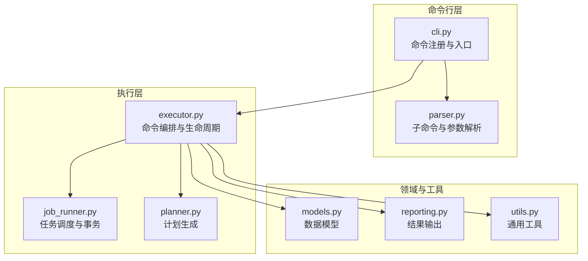
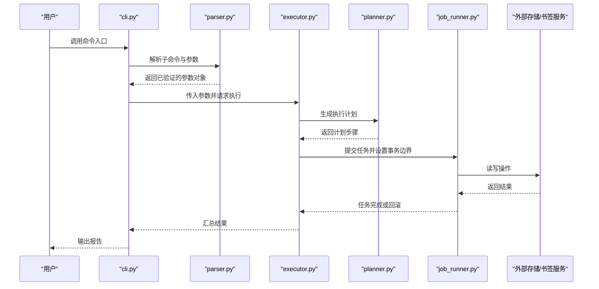
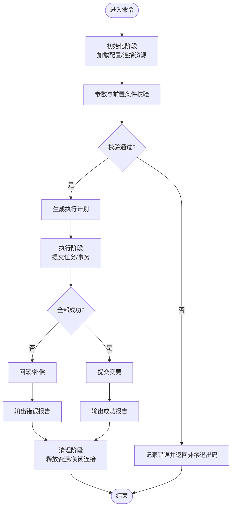
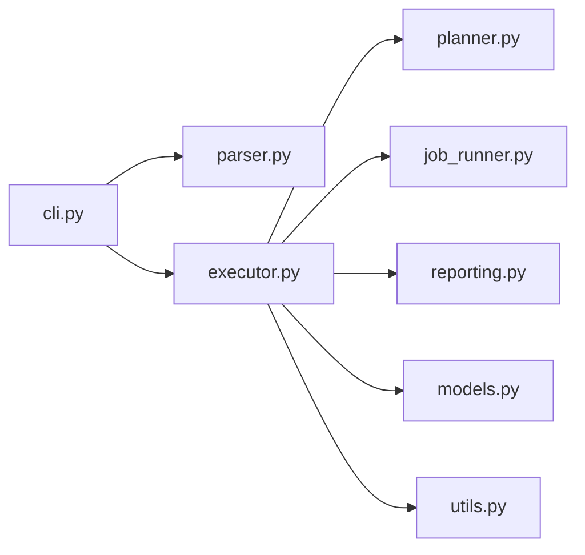

# 命令插件开发

<cite>
**本文引用的文件**   
- [src/bookmark_advisor/cli.py](file://src/bookmark_advisor/cli.py)
- [src/bookmark_advisor/parser.py](file://src/bookmark_advisor/parser.py)
- [src/bookmark_advisor/executor.py](file://src/bookmark_advisor/executor.py)
- [src/bookmark_advisor/job_runner.py](file://src/bookmark_advisor/job_runner.py)
- [src/bookmark_advisor/planner.py](file://src/bookmark_advisor/planner.py)
- [src/bookmark_advisor/models.py](file://src/bookmark_advisor/models.py)
- [src/bookmark_advisor/reporting.py](file://src/bookmark_advisor/reporting.py)
- [src/bookmark_advisor/utils.py](file://src/bookmark_advisor/utils.py)
- [pyproject.toml](file://pyproject.toml)
</cite>

## 目录
1. [简介](#简介)
2. [项目结构](#项目结构)
3. [核心组件](#核心组件)
4. [架构总览](#架构总览)
5. [详细组件分析](#详细组件分析)
6. [依赖关系分析](#依赖关系分析)
7. [性能考虑](#性能考虑)
8. [故障排查指南](#故障排查指南)
9. [结论](#结论)
10. [附录](#附录)

## 简介
本指南面向希望为 bookmark-advisor 扩展“命令插件”的开发者，系统讲解如何创建自定义命令处理器、注册命令、实现参数解析器与业务逻辑，并覆盖命令生命周期（初始化、执行、清理）、参数校验、错误处理与日志记录的最佳实践。文档同时提供从简单到复杂的示例路径指引，帮助读者快速上手并构建健壮的可插拔命令体系。

## 项目结构
本项目采用分层组织：CLI 入口负责命令注册与分发；Parser 负责参数解析；Executor 负责命令编排与生命周期管理；JobRunner 负责任务调度与事务边界；Planner 负责计划生成；Models 定义数据模型；Reporting 负责输出；Utils 提供通用工具。

图表来源
- [src/bookmark_advisor/cli.py](file://src/bookmark_advisor/cli.py)
- [src/bookmark_advisor/parser.py](file://src/bookmark_advisor/parser.py)
- [src/bookmark_advisor/executor.py](file://src/bookmark_advisor/executor.py)
- [src/bookmark_advisor/job_runner.py](file://src/bookmark_advisor/job_runner.py)
- [src/bookmark_advisor/planner.py](file://src/bookmark_advisor/planner.py)
- [src/bookmark_advisor/models.py](file://src/bookmark_advisor/models.py)
- [src/bookmark_advisor/reporting.py](file://src/bookmark_advisor/reporting.py)
- [src/bookmark_advisor/utils.py](file://src/bookmark_advisor/utils.py)

章节来源
- [src/bookmark_advisor/cli.py](file://src/bookmark_advisor/cli.py)
- [src/bookmark_advisor/parser.py](file://src/bookmark_advisor/parser.py)
- [src/bookmark_advisor/executor.py](file://src/bookmark_advisor/executor.py)
- [src/bookmark_advisor/job_runner.py](file://src/bookmark_advisor/job_runner.py)
- [src/bookmark_advisor/planner.py](file://src/bookmark_advisor/planner.py)
- [src/bookmark_advisor/models.py](file://src/bookmark_advisor/models.py)
- [src/bookmark_advisor/reporting.py](file://src/bookmark_advisor/reporting.py)
- [src/bookmark_advisor/utils.py](file://src/bookmark_advisor/utils.py)

## 核心组件
- 命令注册与入口：集中注册子命令，统一入口启动流程。
- 参数解析器：基于子命令树进行参数校验与类型转换。
- 命令执行器：封装命令生命周期（初始化、执行、清理），协调计划与任务。
- 任务运行器：负责任务调度、并发控制与事务边界。
- 计划器：将用户意图转换为可执行的步骤序列。
- 数据模型：统一的输入输出结构与约束。
- 报告器：结构化输出与格式化展示。
- 工具库：通用辅助函数与配置读取。

章节来源
- [src/bookmark_advisor/cli.py](file://src/bookmark_advisor/cli.py)
- [src/bookmark_advisor/parser.py](file://src/bookmark_advisor/parser.py)
- [src/bookmark_advisor/executor.py](file://src/bookmark_advisor/executor.py)
- [src/bookmark_advisor/job_runner.py](file://src/bookmark_advisor/job_runner.py)
- [src/bookmark_advisor/planner.py](file://src/bookmark_advisor/planner.py)
- [src/bookmark_advisor/models.py](file://src/bookmark_advisor/models.py)
- [src/bookmark_advisor/reporting.py](file://src/bookmark_advisor/reporting.py)
- [src/bookmark_advisor/utils.py](file://src/bookmark_advisor/utils.py)

## 架构总览
下图展示了命令从注册到执行的生命周期流转，以及各组件之间的协作关系。

图表来源
- [src/bookmark_advisor/cli.py](file://src/bookmark_advisor/cli.py)
- [src/bookmark_advisor/parser.py](file://src/bookmark_advisor/parser.py)
- [src/bookmark_advisor/executor.py](file://src/bookmark_advisor/executor.py)
- [src/bookmark_advisor/planner.py](file://src/bookmark_advisor/planner.py)
- [src/bookmark_advisor/job_runner.py](file://src/bookmark_advisor/job_runner.py)

## 详细组件分析

### 命令注册与入口（cli.py）
- 职责
  - 注册所有子命令及其描述、帮助信息。
  - 统一入口，接收 sys.argv 并委派给解析器与执行器。
  - 捕获顶层异常，保证退出码与日志一致性。
- 最佳实践
  - 使用命名空间隔离不同子命令的参数组。
  - 对全局选项（如 --verbose、--config）在入口层解析。
  - 通过工厂模式按需加载插件模块，避免冷启动开销。
- 参考路径
  - [命令注册与入口实现](file://src/bookmark_advisor/cli.py)

章节来源
- [src/bookmark_advisor/cli.py](file://src/bookmark_advisor/cli.py)

### 参数解析器（parser.py）
- 职责
  - 定义子命令树与参数规则（必填、可选、默认值、枚举、范围）。
  - 执行类型转换与基础校验，返回强类型的参数对象。
- 最佳实践
  - 将复杂参数拆分为多个子命令，降低认知负担。
  - 使用互斥组与依赖组表达参数间的约束。
  - 对路径、URL、时间等常见类型提供专用解析器。
- 参考路径
  - [参数解析与校验实现](file://src/bookmark_advisor/parser.py)

章节来源
- [src/bookmark_advisor/parser.py](file://src/bookmark_advisor/parser.py)

### 命令执行器（executor.py）
- 职责
  - 封装命令生命周期：初始化（加载配置、建立连接）、执行（调用计划与任务）、清理（释放资源、写日志）。
  - 协调计划器与任务运行器，确保错误传播与状态一致。
- 最佳实践
  - 使用上下文管理器或 try/finally 确保清理阶段必达。
  - 将可重试操作与幂等性设计结合，提升鲁棒性。
  - 暴露清晰的 Hook 点以便插件注入前置/后置逻辑。
- 参考路径
  - [命令生命周期与编排实现](file://src/bookmark_advisor/executor.py)

章节来源
- [src/bookmark_advisor/executor.py](file://src/bookmark_advisor/executor.py)

### 任务运行器（job_runner.py）
- 职责
  - 任务队列与并发控制，支持优先级与限流。
  - 事务边界管理：提交前收集变更，提交后持久化，失败时回滚。
- 最佳实践
  - 为每个命令定义最小事务单元，减少锁竞争。
  - 使用补偿动作处理部分失败场景。
  - 对长耗时任务提供进度回调与取消信号。
- 参考路径
  - [任务调度与事务实现](file://src/bookmark_advisor/job_runner.py)

章节来源
- [src/bookmark_advisor/job_runner.py](file://src/bookmark_advisor/job_runner.py)

### 计划器（planner.py）
- 职责
  - 将高层指令分解为原子步骤，构建 DAG 或线性计划。
  - 评估依赖关系，确定执行顺序与并行度。
- 最佳实践
  - 对步骤进行幂等标记，便于重试与恢复。
  - 提供计划预览与校验接口，提前发现冲突。
- 参考路径
  - [计划生成与依赖分析实现](file://src/bookmark_advisor/planner.py)

章节来源
- [src/bookmark_advisor/planner.py](file://src/bookmark_advisor/planner.py)

### 数据模型（models.py）
- 职责
  - 定义命令输入、输出、中间状态的统一结构。
  - 提供序列化/反序列化与约束校验。
- 最佳实践
  - 使用不可变对象传递只读数据，降低副作用。
  - 对关键路径字段添加注释与示例，提升可读性。
- 参考路径
  - [数据模型定义](file://src/bookmark_advisor/models.py)

章节来源
- [src/bookmark_advisor/models.py](file://src/bookmark_advisor/models.py)

### 报告器（reporting.py）
- 职责
  - 将执行结果格式化为人类可读或机器可读的输出。
  - 支持多种后端（控制台、文件、远程上报）。
- 最佳实践
  - 分离数据与呈现，便于多端复用。
  - 对敏感信息进行脱敏处理。
- 参考路径
  - [结果输出与格式化实现](file://src/bookmark_advisor/reporting.py)

章节来源
- [src/bookmark_advisor/reporting.py](file://src/bookmark_advisor/reporting.py)

### 工具库（utils.py）
- 职责
  - 提供通用能力：配置读取、路径处理、时间格式化、重试策略等。
- 最佳实践
  - 保持无副作用与纯函数风格，便于测试。
  - 对 I/O 操作进行抽象，方便替换为 Mock。
- 参考路径
  - [通用工具实现](file://src/bookmark_advisor/utils.py)

章节来源
- [src/bookmark_advisor/utils.py](file://src/bookmark_advisor/utils.py)

### 命令生命周期流程图

图表来源
- [src/bookmark_advisor/executor.py](file://src/bookmark_advisor/executor.py)
- [src/bookmark_advisor/job_runner.py](file://src/bookmark_advisor/job_runner.py)
- [src/bookmark_advisor/planner.py](file://src/bookmark_advisor/planner.py)
- [src/bookmark_advisor/reporting.py](file://src/bookmark_advisor/reporting.py)

## 依赖关系分析
- 组件耦合
  - cli 仅依赖 parser 与 executor，保持入口简洁。
  - executor 聚合 planner、job_runner、reporting、models、utils，形成执行中心。
- 外部依赖
  - 通过 utils 抽象外部服务（如书签存储、文件系统），便于替换与测试。
- 潜在循环
  - 当前分层清晰，未见直接循环导入；新增插件时应遵循单向依赖原则。

图表来源
- [src/bookmark_advisor/cli.py](file://src/bookmark_advisor/cli.py)
- [src/bookmark_advisor/parser.py](file://src/bookmark_advisor/parser.py)
- [src/bookmark_advisor/executor.py](file://src/bookmark_advisor/executor.py)
- [src/bookmark_advisor/planner.py](file://src/bookmark_advisor/planner.py)
- [src/bookmark_advisor/job_runner.py](file://src/bookmark_advisor/job_runner.py)
- [src/bookmark_advisor/reporting.py](file://src/bookmark_advisor/reporting.py)
- [src/bookmark_advisor/models.py](file://src/bookmark_advisor/models.py)
- [src/bookmark_advisor/utils.py](file://src/bookmark_advisor/utils.py)

章节来源
- [src/bookmark_advisor/cli.py](file://src/bookmark_advisor/cli.py)
- [src/bookmark_advisor/parser.py](file://src/bookmark_advisor/parser.py)
- [src/bookmark_advisor/executor.py](file://src/bookmark_advisor/executor.py)
- [src/bookmark_advisor/planner.py](file://src/bookmark_advisor/planner.py)
- [src/bookmark_advisor/job_runner.py](file://src/bookmark_advisor/job_runner.py)
- [src/bookmark_advisor/reporting.py](file://src/bookmark_advisor/reporting.py)
- [src/bookmark_advisor/models.py](file://src/bookmark_advisor/models.py)
- [src/bookmark_advisor/utils.py](file://src/bookmark_advisor/utils.py)

## 性能考虑
- 延迟加载：仅在需要时导入重型模块，缩短冷启动时间。
- 批处理与合并：对批量写入操作进行合并，减少 I/O 次数。
- 并发控制：限制最大并发数，避免资源争用与抖动。
- 缓存热点：对只读配置与字典进行内存缓存，注意失效策略。
- 计划优化：利用 DAG 拓扑排序最大化并行度，减少关键路径长度。

[本节为通用指导，不直接分析具体文件]

## 故障排查指南
- 常见问题
  - 参数缺失或类型错误：检查 parser 中必填项与类型映射。
  - 事务未回滚：确认 job_runner 的事务边界与异常分支。
  - 资源泄漏：确保 executor 的清理阶段在所有路径下均被执行。
  - 输出不一致：核对 reporting 的格式化逻辑与脱敏规则。
- 定位建议
  - 开启详细日志，关注初始化、计划生成、任务提交与清理阶段的日志。
  - 使用最小复现用例，逐步缩小问题范围。
  - 对关键路径增加断言与快照，便于回溯。
- 参考路径
  - [命令生命周期与异常处理](file://src/bookmark_advisor/executor.py)
  - [任务事务与回滚](file://src/bookmark_advisor/job_runner.py)
  - [结果输出与格式化](file://src/bookmark_advisor/reporting.py)

章节来源
- [src/bookmark_advisor/executor.py](file://src/bookmark_advisor/executor.py)
- [src/bookmark_advisor/job_runner.py](file://src/bookmark_advisor/job_runner.py)
- [src/bookmark_advisor/reporting.py](file://src/bookmark_advisor/reporting.py)

## 结论
通过清晰的命令注册、严格的参数解析、稳健的执行器与任务运行器，以及完善的计划与报告机制，bookmark-advisor 提供了可扩展的命令插件体系。遵循本文的最佳实践，开发者可以快速构建从简单到复杂的命令，并确保其可靠性、可维护性与可观测性。

[本节为总结性内容，不直接分析具体文件]

## 附录

### 从零开始：创建自定义命令的步骤清单
- 在 parser 中新增子命令与参数定义，完成类型与约束校验。
- 在 executor 中实现命令生命周期钩子，编写初始化、执行与清理逻辑。
- 在 planner 中将业务目标拆解为可执行步骤，声明依赖关系。
- 在 job_runner 中提交任务，设置事务边界与补偿动作。
- 在 reporting 中输出结构化结果，包含成功与失败详情。
- 在 utils 中抽取通用能力，保持代码整洁与可复用。
- 在 pyproject 中注册入口点，使命令可通过命令行调用。

章节来源
- [src/bookmark_advisor/parser.py](file://src/bookmark_advisor/parser.py)
- [src/bookmark_advisor/executor.py](file://src/bookmark_advisor/executor.py)
- [src/bookmark_advisor/planner.py](file://src/bookmark_advisor/planner.py)
- [src/bookmark_advisor/job_runner.py](file://src/bookmark_advisor/job_runner.py)
- [src/bookmark_advisor/reporting.py](file://src/bookmark_advisor/reporting.py)
- [src/bookmark_advisor/utils.py](file://src/bookmark_advisor/utils.py)
- [pyproject.toml](file://pyproject.toml)