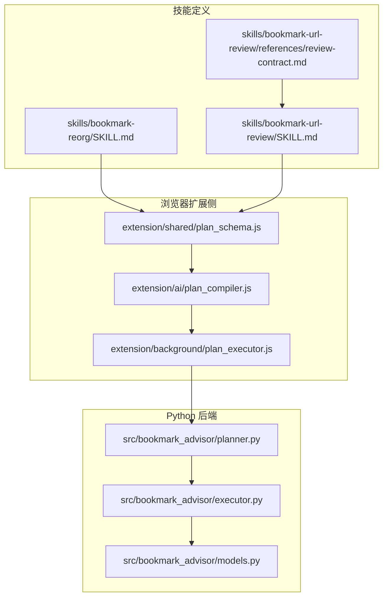
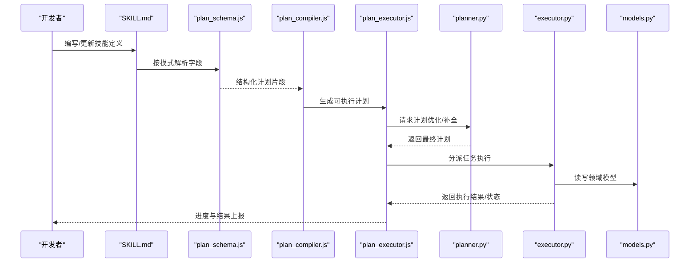
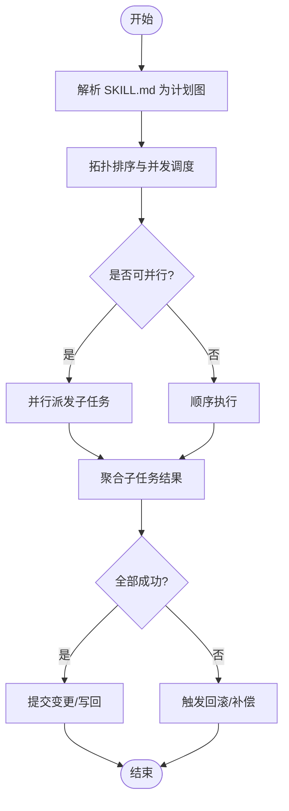
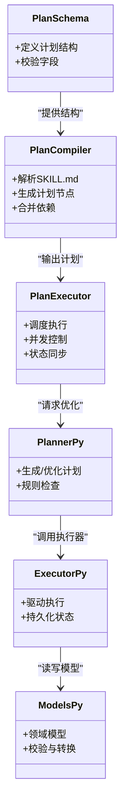
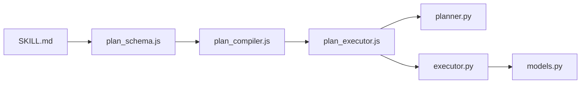

# 技能模块开发

<cite>
**本文引用的文件**   
- [skills/bookmark-reorg/SKILL.md](file://skills/bookmark-reorg/SKILL.md)
- [skills/bookmark-url-review/SKILL.md](file://skills/bookmark-url-review/SKILL.md)
- [skills/bookmark-url-review/references/review-contract.md](file://skills/bookmark-url-review/references/review-contract.md)
- [extension/ai/plan_compiler.js](file://extension/ai/plan_compiler.js)
- [extension/background/plan_executor.js](file://extension/background/plan_executor.js)
- [extension/shared/plan_schema.js](file://extension/shared/plan_schema.js)
- [src/bookmark_advisor/planner.py](file://src/bookmark_advisor/planner.py)
- [src/bookmark_advisor/executor.py](file://src/bookmark_advisor/executor.py)
- [src/bookmark_advisor/models.py](file://src/bookmark_advisor/models.py)
- [tests/test_planner.py](file://tests/test_planner.py)
- [tests/test_extension_plan_executor_module.py](file://tests/test_extension_plan_executor_module.py)
- [tests/test_reorg_job.py](file://tests/test_reorg_job.py)
</cite>

## 目录
1. [简介](#简介)
2. [项目结构](#项目结构)
3. [核心组件](#核心组件)
4. [架构总览](#架构总览)
5. [详细组件分析](#详细组件分析)
6. [依赖分析](#依赖分析)
7. [性能考虑](#性能考虑)
8. [故障排查指南](#故障排查指南)
9. [结论](#结论)
10. [附录](#附录)

## 简介
本指南面向希望基于本项目构建“技能模块”的开发者，目标是：
- 明确 SKILL.md 文件格式规范（元数据、能力描述、执行流程配置）
- 说明引用资源的组织与版本管理策略
- 介绍多代理协作机制（任务分发、结果聚合、状态同步）
- 提供测试方法（单元、集成、端到端）
- 给出从简单书签操作到复杂 AI 分析任务的完整示例路径

## 项目结构
技能模块位于 skills 目录下，每个子目录代表一个独立技能。以 bookmark-reorg 和 bookmark-url-review 为例，它们分别展示了“纯本地编排型”和“带外部参考契约型”的技能形态。

图表来源
- [skills/bookmark-reorg/SKILL.md](file://skills/bookmark-reorg/SKILL.md)
- [skills/bookmark-url-review/SKILL.md](file://skills/bookmark-url-review/SKILL.md)
- [skills/bookmark-url-review/references/review-contract.md](file://skills/bookmark-url-review/references/review-contract.md)
- [extension/shared/plan_schema.js](file://extension/shared/plan_schema.js)
- [extension/ai/plan_compiler.js](file://extension/ai/plan_compiler.js)
- [extension/background/plan_executor.js](file://extension/background/plan_executor.js)
- [src/bookmark_advisor/planner.py](file://src/bookmark_advisor/planner.py)
- [src/bookmark_advisor/executor.py](file://src/bookmark_advisor/executor.py)
- [src/bookmark_advisor/models.py](file://src/bookmark_advisor/models.py)

章节来源
- [skills/bookmark-reorg/SKILL.md](file://skills/bookmark-reorg/SKILL.md)
- [skills/bookmark-url-review/SKILL.md](file://skills/bookmark-url-review/SKILL.md)
- [skills/bookmark-url-review/references/review-contract.md](file://skills/bookmark-url-review/references/review-contract.md)
- [extension/shared/plan_schema.js](file://extension/shared/plan_schema.js)
- [extension/ai/plan_compiler.js](file://extension/ai/plan_compiler.js)
- [extension/background/plan_executor.js](file://extension/background/plan_executor.js)
- [src/bookmark_advisor/planner.py](file://src/bookmark_advisor/planner.py)
- [src/bookmark_advisor/executor.py](file://src/bookmark_advisor/executor.py)
- [src/bookmark_advisor/models.py](file://src/bookmark_advisor/models.py)

## 核心组件
- SKILL.md 规范
  - 元数据：名称、版本、作者、描述、适用场景等
  - 能力描述：输入约束、输出约定、前置条件、副作用说明
  - 执行流程：步骤序列、分支条件、错误处理、回滚策略
- 引用资源
  - references 目录存放契约、规则、模板等外部依赖
  - 通过相对路径或命名空间引用，便于复用与版本锁定
- 计划编译与执行
  - plan_schema.js 定义计划数据结构
  - plan_compiler.js 将 SKILL.md 解析为可执行计划
  - plan_executor.js 负责调度、并发控制、状态同步
- Python 后端
  - planner.py 生成/优化计划
  - executor.py 驱动执行并持久化状态
  - models.py 定义领域模型与校验

章节来源
- [extension/shared/plan_schema.js](file://extension/shared/plan_schema.js)
- [extension/ai/plan_compiler.js](file://extension/ai/plan_compiler.js)
- [extension/background/plan_executor.js](file://extension/background/plan_executor.js)
- [src/bookmark_advisor/planner.py](file://src/bookmark_advisor/planner.py)
- [src/bookmark_advisor/executor.py](file://src/bookmark_advisor/executor.py)
- [src/bookmark_advisor/models.py](file://src/bookmark_advisor/models.py)

## 架构总览
下图展示从 SKILL.md 到执行的端到端链路，包括浏览器扩展与 Python 后端的交互。

图表来源
- [extension/shared/plan_schema.js](file://extension/shared/plan_schema.js)
- [extension/ai/plan_compiler.js](file://extension/ai/plan_compiler.js)
- [extension/background/plan_executor.js](file://extension/background/plan_executor.js)
- [src/bookmark_advisor/planner.py](file://src/bookmark_advisor/planner.py)
- [src/bookmark_advisor/executor.py](file://src/bookmark_advisor/executor.py)
- [src/bookmark_advisor/models.py](file://src/bookmark_advisor/models.py)

## 详细组件分析

### SKILL.md 文件格式规范
- 元数据
  - 字段建议：名称、版本、作者、描述、适用场景、依赖项、许可证
  - 版本语义：遵循语义化版本，变更需记录在变更日志或提交信息中
- 能力描述
  - 输入：参数类型、取值范围、必填/可选
  - 输出：成功/失败结构、中间产物位置
  - 前置条件：环境要求、权限、外部服务可用性
  - 副作用：对书签树、存储、网络的影响
- 执行流程配置
  - 步骤：顺序/并行/条件分支
  - 错误处理：重试、降级、补偿动作
  - 回滚：原子性边界、撤销清单
  - 监控：指标埋点、日志级别、审计字段

章节来源
- [skills/bookmark-reorg/SKILL.md](file://skills/bookmark-reorg/SKILL.md)
- [skills/bookmark-url-review/SKILL.md](file://skills/bookmark-url-review/SKILL.md)

### 引用资源组织与版本管理
- 组织结构
  - 使用 references 目录集中存放契约、规则、模板等
  - 通过相对路径引用，避免硬编码绝对路径
- 版本管理
  - 与 SKILL.md 同仓库管理，采用标签或分支锁定版本
  - 对外部依赖建议使用哈希或固定版本号，确保可重现

章节来源
- [skills/bookmark-url-review/references/review-contract.md](file://skills/bookmark-url-review/references/review-contract.md)
- [skills/bookmark-url-review/SKILL.md](file://skills/bookmark-url-review/SKILL.md)

### 多代理协作机制
- 任务分发
  - 由 plan_executor.js 根据计划图进行拓扑排序与并发控制
  - 支持按资源隔离的任务分组，避免冲突
- 结果聚合
  - 各代理产出标准化结果对象，统一归集到执行上下文
  - 支持部分成功与整体失败的策略选择
- 状态同步
  - 通过共享状态载体（如计划实例）实现跨代理可见性
  - 事件驱动的状态变更通知，保证 UI 与日志一致性

图表来源
- [extension/background/plan_executor.js](file://extension/background/plan_executor.js)
- [extension/ai/plan_compiler.js](file://extension/ai/plan_compiler.js)

章节来源
- [extension/background/plan_executor.js](file://extension/background/plan_executor.js)
- [extension/ai/plan_compiler.js](file://extension/ai/plan_compiler.js)

### 计划编译与执行（代码级关系）

图表来源
- [extension/shared/plan_schema.js](file://extension/shared/plan_schema.js)
- [extension/ai/plan_compiler.js](file://extension/ai/plan_compiler.js)
- [extension/background/plan_executor.js](file://extension/background/plan_executor.js)
- [src/bookmark_advisor/planner.py](file://src/bookmark_advisor/planner.py)
- [src/bookmark_advisor/executor.py](file://src/bookmark_advisor/executor.py)
- [src/bookmark_advisor/models.py](file://src/bookmark_advisor/models.py)

章节来源
- [extension/shared/plan_schema.js](file://extension/shared/plan_schema.js)
- [extension/ai/plan_compiler.js](file://extension/ai/plan_compiler.js)
- [extension/background/plan_executor.js](file://extension/background/plan_executor.js)
- [src/bookmark_advisor/planner.py](file://src/bookmark_advisor/planner.py)
- [src/bookmark_advisor/executor.py](file://src/bookmark_advisor/executor.py)
- [src/bookmark_advisor/models.py](file://src/bookmark_advisor/models.py)

### 测试方法与用例
- 单元测试
  - 针对 plan_schema.js 的结构校验与默认值
  - 针对 plan_compiler.js 的解析与合并逻辑
  - 针对 models.py 的数据模型与约束
- 集成测试
  - 验证 plan_executor.js 与 planner.py/executor.py 的协作
  - 覆盖并发、失败重试、回滚路径
- 端到端测试
  - 以真实 SKILL.md 驱动完整流程，断言最终状态与产物
  - 包含书签重排与 URL 审查两类典型场景

章节来源
- [tests/test_extension_plan_executor_module.py](file://tests/test_extension_plan_executor_module.py)
- [tests/test_planner.py](file://tests/test_planner.py)
- [tests/test_reorg_job.py](file://tests/test_reorg_job.py)

### 开发示例路径
- 简单书签操作
  - 参考书签重排技能的 SKILL.md，理解最小可用流程
  - 重点观察步骤定义、输入输出与副作用说明
- 复杂 AI 分析任务
  - 参考 URL 审查技能的 SKILL.md 与 references 契约
  - 结合 planner.py 的规则与 executor.py 的执行细节，设计多步分析与回滚策略

章节来源
- [skills/bookmark-reorg/SKILL.md](file://skills/bookmark-reorg/SKILL.md)
- [skills/bookmark-url-review/SKILL.md](file://skills/bookmark-url-review/SKILL.md)
- [skills/bookmark-url-review/references/review-contract.md](file://skills/bookmark-url-review/references/review-contract.md)
- [src/bookmark_advisor/planner.py](file://src/bookmark_advisor/planner.py)
- [src/bookmark_advisor/executor.py](file://src/bookmark_advisor/executor.py)

## 依赖分析
- 内部依赖
  - SKILL.md 依赖 plan_schema.js 的结构定义
  - plan_compiler.js 依赖 plan_schema.js 并产出给 plan_executor.js
  - plan_executor.js 依赖 planner.py 与 executor.py，并通过 models.py 访问领域模型
- 外部依赖
  - 浏览器 API（书签树、消息通道）
  - Python 运行时与第三方库（由项目依赖声明管理）

图表来源
- [extension/shared/plan_schema.js](file://extension/shared/plan_schema.js)
- [extension/ai/plan_compiler.js](file://extension/ai/plan_compiler.js)
- [extension/background/plan_executor.js](file://extension/background/plan_executor.js)
- [src/bookmark_advisor/planner.py](file://src/bookmark_advisor/planner.py)
- [src/bookmark_advisor/executor.py](file://src/bookmark_advisor/executor.py)
- [src/bookmark_advisor/models.py](file://src/bookmark_advisor/models.py)

章节来源
- [extension/shared/plan_schema.js](file://extension/shared/plan_schema.js)
- [extension/ai/plan_compiler.js](file://extension/ai/plan_compiler.js)
- [extension/background/plan_executor.js](file://extension/background/plan_executor.js)
- [src/bookmark_advisor/planner.py](file://src/bookmark_advisor/planner.py)
- [src/bookmark_advisor/executor.py](file://src/bookmark_advisor/executor.py)
- [src/bookmark_advisor/models.py](file://src/bookmark_advisor/models.py)

## 性能考虑
- 计划粒度
  - 合理拆分步骤，避免单步过大导致阻塞
  - 对可并行步骤启用并发执行，注意资源竞争
- 缓存与去重
  - 对只读查询结果进行缓存，减少重复 IO
  - 对幂等操作进行去重，避免重复执行
- 错误恢复
  - 短重试+指数退避，长耗时任务支持断点续跑
  - 关键路径增加超时与熔断保护

[本节为通用指导，不直接分析具体文件]

## 故障排查指南
- 常见问题定位
  - 计划解析失败：检查 SKILL.md 字段是否符合 plan_schema.js 定义
  - 执行卡住：查看 plan_executor.js 的并发与锁策略，确认是否存在循环依赖
  - 状态不一致：核对 executor.py 的状态写入与回滚逻辑
- 调试建议
  - 开启更详细的日志级别，关注关键节点的时间戳与错误码
  - 使用最小复现用例，逐步缩小问题范围

章节来源
- [extension/shared/plan_schema.js](file://extension/shared/plan_schema.js)
- [extension/background/plan_executor.js](file://extension/background/plan_executor.js)
- [src/bookmark_advisor/executor.py](file://src/bookmark_advisor/executor.py)

## 结论
通过统一的 SKILL.md 规范、清晰的计划编译与执行链路、以及完善的测试体系，团队可以高效地开发、迭代与维护技能模块。建议在新增技能时优先参考现有示例，并在 CI 中引入自动化测试与质量门禁，确保稳定性与可维护性。

[本节为总结性内容，不直接分析具体文件]

## 附录
- 术语表
  - 技能：以 SKILL.md 描述的、可被系统自动编排与执行的能力单元
  - 计划：由 SKILL.md 编译得到的可执行步骤图
  - 代理：执行计划中某个节点的独立工作单元
- 最佳实践
  - 保持 SKILL.md 的可读性与自描述性
  - 将契约与规则外置至 references，提高复用度
  - 为关键路径编写端到端测试，覆盖异常分支

[本节为概念性内容，不直接分析具体文件]