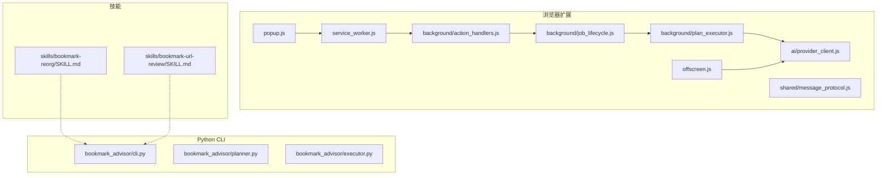
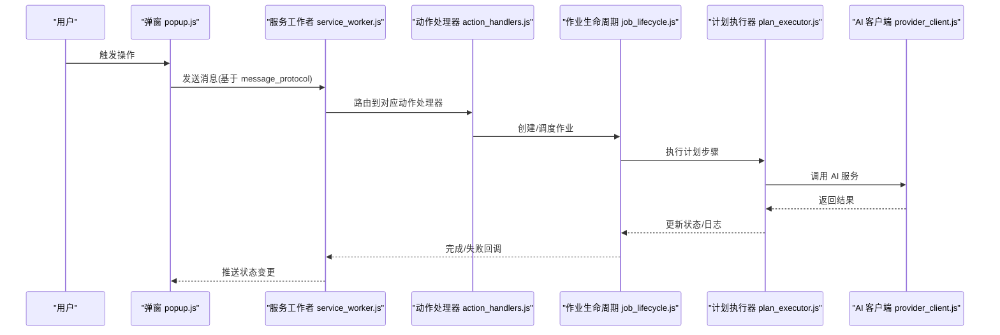
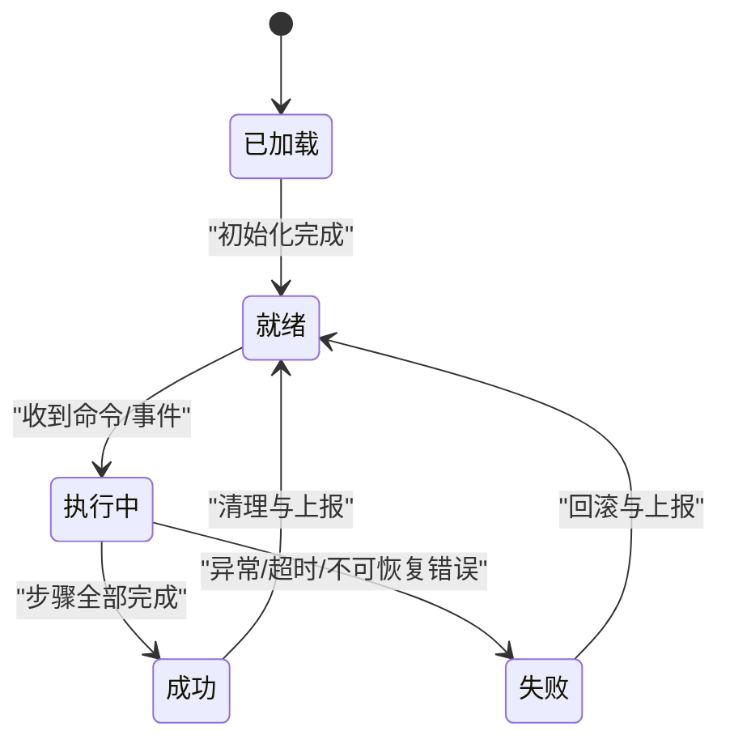
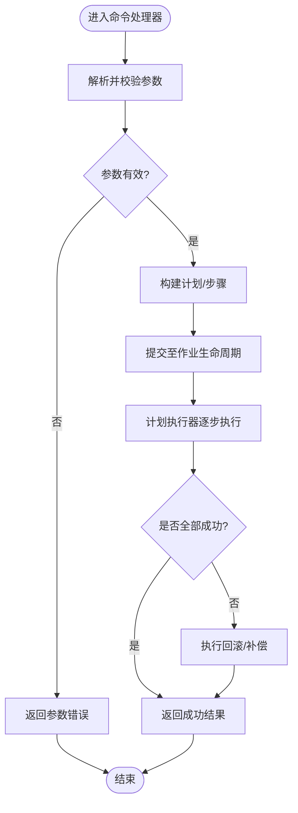
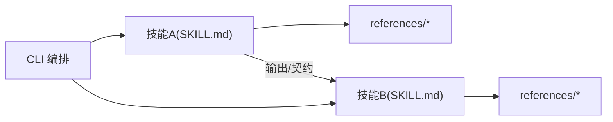
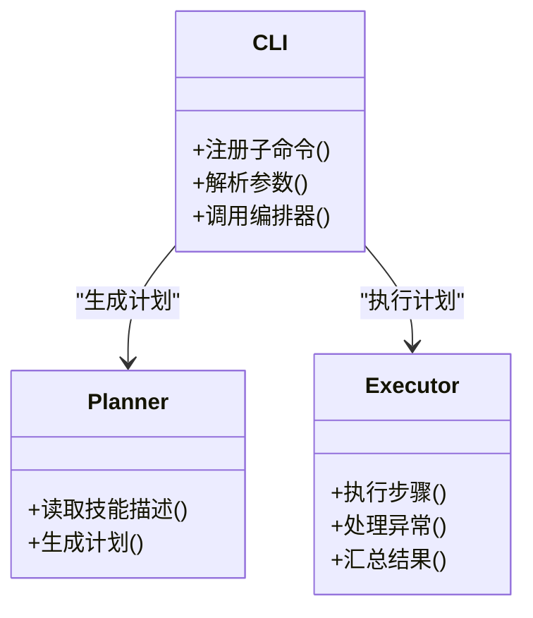
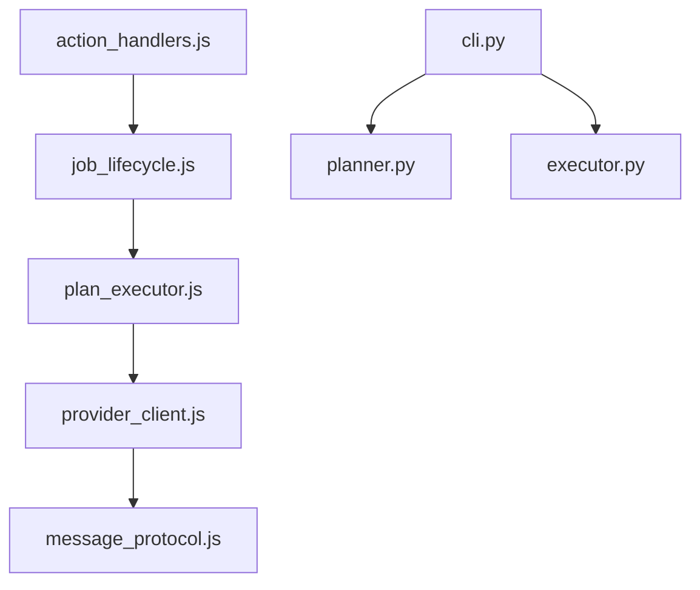

# 插件开发指南

<cite>
**本文引用的文件**   
- [README.md](file://README.md)
- [AGENTS.md](file://AGENTS.md)
- [CLAUDE.md](file://CLAUDE.md)
- [pyproject.toml](file://pyproject.toml)
- [extension/manifest.json](file://extension/manifest.json)
- [extension/service_worker.js](file://extension/service_worker.js)
- [extension/offscreen.js](file://extension/offscreen.js)
- [extension/popup.js](file://extension/popup.js)
- [extension/shared/message_protocol.js](file://extension/shared/message_protocol.js)
- [extension/background/action_handlers.js](file://extension/background/action_handlers.js)
- [extension/background/job_lifecycle.js](file://extension/background/job_lifecycle.js)
- [extension/background/plan_executor.js](file://extension/background/plan_executor.js)
- [extension/ai/provider_client.js](file://extension/ai/provider_client.js)
- [skills/bookmark-reorg/SKILL.md](file://skills/bookmark-reorg/SKILL.md)
- [skills/bookmark-url-review/SKILL.md](file://skills/bookmark-url-review/SKILL.md)
- [src/bookmark_advisor/cli.py](file://src/bookmark_advisor/cli.py)
- [src/bookmark_advisor/planner.py](file://src/bookmark_advisor/planner.py)
- [src/bookmark_advisor/executor.py](file://src/bookmark_advisor/executor.py)
- [tests/test_extension_action_handlers.js](file://tests/test_extension_action_handlers.js)
- [tests/test_extension_job_lifecycle.js](file://tests/test_extension_job_lifecycle.js)
- [tests/test_planner.py](file://tests/test_planner.py)
</cite>

## 目录
1. [简介](#简介)
2. [项目结构](#项目结构)
3. [核心组件](#核心组件)
4. [架构总览](#架构总览)
5. [详细组件分析](#详细组件分析)
6. [依赖分析](#依赖分析)
7. [性能考虑](#性能考虑)
8. [故障排查指南](#故障排查指南)
9. [结论](#结论)
10. [附录](#附录)

## 简介
本指南面向希望为书签管理扩展与命令行工具开发“插件”的工程师。内容覆盖：
- 插件系统架构与扩展机制（接口、生命周期、依赖注入）
- 自定义命令处理器（注册、参数解析、业务逻辑）
- 技能模块开发（SKILL.md 规范、资源组织、多代理协作）
- 测试与调试（单元、集成、性能）
- 打包与分发（版本、依赖、兼容性）
- 完整示例与模板路径，帮助快速上手

## 项目结构
仓库采用“浏览器扩展 + Python CLI + 技能文档”的多端协同结构：
- extension：Chrome 扩展侧，包含服务工作者、弹窗、后台任务、AI 客户端、共享协议等
- skills：以 SKILL.md 描述的技能包，支持书签整理与 URL 审查等场景
- src：Python 实现的书签顾问 CLI，提供计划生成、执行、报告等能力
- tests：覆盖扩展与 Python 端的单元测试与集成测试

图表来源
- [extension/service_worker.js](file://extension/service_worker.js)
- [extension/offscreen.js](file://extension/offscreen.js)
- [extension/popup.js](file://extension/popup.js)
- [extension/shared/message_protocol.js](file://extension/shared/message_protocol.js)
- [extension/background/action_handlers.js](file://extension/background/action_handlers.js)
- [extension/background/job_lifecycle.js](file://extension/background/job_lifecycle.js)
- [extension/background/plan_executor.js](file://extension/background/plan_executor.js)
- [extension/ai/provider_client.js](file://extension/ai/provider_client.js)
- [skills/bookmark-reorg/SKILL.md](file://skills/bookmark-reorg/SKILL.md)
- [skills/bookmark-url-review/SKILL.md](file://skills/bookmark-url-review/SKILL.md)
- [src/bookmark_advisor/cli.py](file://src/bookmark_advisor/cli.py)
- [src/bookmark_advisor/planner.py](file://src/bookmark_advisor/planner.py)
- [src/bookmark_advisor/executor.py](file://src/bookmark_advisor/executor.py)

章节来源
- [README.md](file://README.md)
- [AGENTS.md](file://AGENTS.md)
- [CLAUDE.md](file://CLAUDE.md)
- [pyproject.toml](file://pyproject.toml)

## 核心组件
- 消息协议与路由：定义跨上下文通信契约，统一消息类型与载荷结构，支撑弹窗、服务工作者、离屏页面之间的调用。
- 动作处理与作业生命周期：将用户操作映射为可编排的作业，管理创建、调度、执行、完成与回滚。
- 计划执行器：负责将高层计划分解为具体步骤并驱动执行，协调 AI 客户端与外部资源。
- AI 提供者客户端：封装对大模型服务的调用，包括批处理、编解码、快照模型等。
- 技能模块：以 SKILL.md 描述的能力边界、输入输出、引用资源与协作方式，供 CLI 或扩展消费。
- CLI 入口与编排：提供命令注册、参数解析、计划生成与执行、结果上报。

章节来源
- [extension/shared/message_protocol.js](file://extension/shared/message_protocol.js)
- [extension/background/action_handlers.js](file://extension/background/action_handlers.js)
- [extension/background/job_lifecycle.js](file://extension/background/job_lifecycle.js)
- [extension/background/plan_executor.js](file://extension/background/plan_executor.js)
- [extension/ai/provider_client.js](file://extension/ai/provider_client.js)
- [skills/bookmark-reorg/SKILL.md](file://skills/bookmark-reorg/SKILL.md)
- [skills/bookmark-url-review/SKILL.md](file://skills/bookmark-url-review/SKILL.md)
- [src/bookmark_advisor/cli.py](file://src/bookmark_advisor/cli.py)
- [src/bookmark_advisor/planner.py](file://src/bookmark_advisor/planner.py)
- [src/bookmark_advisor/executor.py](file://src/bookmark_advisor/executor.py)

## 架构总览
插件体系围绕“可扩展的命令与技能”展开：
- 命令层：CLI 与扩展均通过统一的命令/动作抽象接入；命令处理器实现具体业务。
- 技能层：SKILL.md 作为能力契约，约束输入、输出、依赖与协作流程。
- 执行层：作业生命周期与计划执行器确保幂等、可观测与可恢复。
- 集成层：消息协议与 AI 客户端提供跨进程与外部服务集成。

图表来源
- [extension/popup.js](file://extension/popup.js)
- [extension/service_worker.js](file://extension/service_worker.js)
- [extension/shared/message_protocol.js](file://extension/shared/message_protocol.js)
- [extension/background/action_handlers.js](file://extension/background/action_handlers.js)
- [extension/background/job_lifecycle.js](file://extension/background/job_lifecycle.js)
- [extension/background/plan_executor.js](file://extension/background/plan_executor.js)
- [extension/ai/provider_client.js](file://extension/ai/provider_client.js)

## 详细组件分析

### 插件接口与生命周期
- 插件接口
  - 命令处理器：暴露可被注册的动作名称、参数模式、权限范围与副作用说明。
  - 技能描述：SKILL.md 声明能力、输入输出、依赖资源、错误语义与重试策略。
- 生命周期
  - 初始化：加载配置、校验依赖、预热缓存。
  - 运行期：接收命令/事件，进入作业队列，按策略调度。
  - 销毁：释放资源、持久化状态、上报指标。

章节来源
- [extension/background/job_lifecycle.js](file://extension/background/job_lifecycle.js)
- [extension/background/action_handlers.js](file://extension/background/action_handlers.js)
- [skills/bookmark-reorg/SKILL.md](file://skills/bookmark-reorg/SKILL.md)
- [skills/bookmark-url-review/SKILL.md](file://skills/bookmark-url-review/SKILL.md)

### 自定义命令处理器（注册、参数解析、业务逻辑）
- 命令注册
  - 在动作处理器中集中注册命令名与处理函数，避免散点式耦合。
  - 使用消息协议中的类型字段进行路由匹配。
- 参数解析
  - 在处理器入口处对入参进行校验与规范化，缺失必填项时尽早失败。
- 业务逻辑
  - 将复杂流程拆分为可复用的步骤，交由计划执行器编排。
  - 对副作用操作（如写入存储、网络请求）进行幂等设计与重试控制。

章节来源
- [extension/background/action_handlers.js](file://extension/background/action_handlers.js)
- [extension/shared/message_protocol.js](file://extension/shared/message_protocol.js)
- [extension/background/plan_executor.js](file://extension/background/plan_executor.js)

### 技能模块开发（SKILL.md、资源组织、多代理协作）
- SKILL.md 约定
  - 明确能力目标、输入输出格式、前置条件、依赖资源与失败语义。
  - 标注与其他技能的协作关系与数据流转。
- 引用资源组织
  - 将参考文档、规则、模板放在 references 子目录，便于复用与版本管理。
- 多代理协作
  - 通过 CLI 或扩展编排多个技能，形成端到端工作流；每个技能保持单一职责。

图表来源
- [skills/bookmark-reorg/SKILL.md](file://skills/bookmark-reorg/SKILL.md)
- [skills/bookmark-url-review/SKILL.md](file://skills/bookmark-url-review/SKILL.md)

章节来源
- [skills/bookmark-reorg/SKILL.md](file://skills/bookmark-reorg/SKILL.md)
- [skills/bookmark-url-review/SKILL.md](file://skills/bookmark-url-review/SKILL.md)

### 依赖注入与配置
- 配置来源
  - 扩展清单 manifest.json 提供基础能力与权限声明。
  - Python 端 pyproject.toml 声明依赖与入口点。
- 注入方式
  - 通过构造函数或工厂方法注入依赖对象（如存储、网络、AI 客户端）。
  - 在初始化阶段完成依赖装配，运行时仅持有轻量引用。

章节来源
- [extension/manifest.json](file://extension/manifest.json)
- [pyproject.toml](file://pyproject.toml)

### CLI 命令与编排（Python）
- 命令注册与参数解析
  - 在 CLI 入口集中注册子命令，定义参数与默认值。
- 计划生成与执行
  - planner 负责从输入与技能描述生成可执行计划。
  - executor 负责分步执行、错误处理与结果汇总。

图表来源
- [src/bookmark_advisor/cli.py](file://src/bookmark_advisor/cli.py)
- [src/bookmark_advisor/planner.py](file://src/bookmark_advisor/planner.py)
- [src/bookmark_advisor/executor.py](file://src/bookmark_advisor/executor.py)

章节来源
- [src/bookmark_advisor/cli.py](file://src/bookmark_advisor/cli.py)
- [src/bookmark_advisor/planner.py](file://src/bookmark_advisor/planner.py)
- [src/bookmark_advisor/executor.py](file://src/bookmark_advisor/executor.py)

### 扩展侧关键流程
- 消息协议
  - 定义消息类型、载荷结构与错误码，保证跨上下文稳定通信。
- 服务工作者与离屏页面
  - 服务工作者负责路由与状态同步；离屏页面用于长耗时任务与隔离执行。
- 弹窗交互
  - 弹窗发起操作、展示进度与结果，与服务工作者双向通信。

章节来源
- [extension/shared/message_protocol.js](file://extension/shared/message_protocol.js)
- [extension/service_worker.js](file://extension/service_worker.js)
- [extension/offscreen.js](file://extension/offscreen.js)
- [extension/popup.js](file://extension/popup.js)

## 依赖分析
- 内部依赖
  - 动作处理器依赖作业生命周期与计划执行器。
  - 计划执行器依赖 AI 客户端与共享协议。
  - CLI 依赖 planner 与 executor。
- 外部依赖
  - 浏览器 API（扩展侧）、网络与存储。
  - Python 标准库与第三方包（由 pyproject.toml 声明）。

图表来源
- [extension/background/action_handlers.js](file://extension/background/action_handlers.js)
- [extension/background/job_lifecycle.js](file://extension/background/job_lifecycle.js)
- [extension/background/plan_executor.js](file://extension/background/plan_executor.js)
- [extension/ai/provider_client.js](file://extension/ai/provider_client.js)
- [extension/shared/message_protocol.js](file://extension/shared/message_protocol.js)
- [src/bookmark_advisor/cli.py](file://src/bookmark_advisor/cli.py)
- [src/bookmark_advisor/planner.py](file://src/bookmark_advisor/planner.py)
- [src/bookmark_advisor/executor.py](file://src/bookmark_advisor/executor.py)

章节来源
- [extension/background/action_handlers.js](file://extension/background/action_handlers.js)
- [extension/background/job_lifecycle.js](file://extension/background/job_lifecycle.js)
- [extension/background/plan_executor.js](file://extension/background/plan_executor.js)
- [extension/ai/provider_client.js](file://extension/ai/provider_client.js)
- [extension/shared/message_protocol.js](file://extension/shared/message_protocol.js)
- [src/bookmark_advisor/cli.py](file://src/bookmark_advisor/cli.py)
- [src/bookmark_advisor/planner.py](file://src/bookmark_advisor/planner.py)
- [src/bookmark_advisor/executor.py](file://src/bookmark_advisor/executor.py)

## 性能考虑
- 批处理与合并：在 AI 客户端侧启用批处理以减少往返开销。
- 懒加载与按需初始化：仅在需要时加载重型依赖。
- 增量更新与缓存：对只读数据建立缓存，减少重复计算。
- 限流与退避：对外部服务调用增加指数退避与并发限制。
- 可观测性：记录关键指标（耗时、成功率、错误分布），便于定位瓶颈。

[本节为通用指导，不直接分析具体文件]

## 故障排查指南
- 常见问题
  - 消息路由失败：检查消息协议类型与路由表一致性。
  - 作业卡死：查看作业生命周期状态机与日志，确认是否缺少完成回调。
  - AI 调用失败：核对端点、鉴权、配额与重试策略。
- 定位手段
  - 扩展侧：打开开发者工具，过滤消息与网络请求。
  - CLI 侧：开启详细日志，结合计划与执行步骤定位问题。
- 回归验证
  - 使用现有测试用例覆盖关键路径，确保修复不引入回归。

章节来源
- [extension/shared/message_protocol.js](file://extension/shared/message_protocol.js)
- [extension/background/job_lifecycle.js](file://extension/background/job_lifecycle.js)
- [extension/ai/provider_client.js](file://extension/ai/provider_client.js)

## 结论
本指南梳理了插件系统的接口、生命周期、命令与技能模型，以及扩展与 CLI 的协作方式。遵循本文的规范与最佳实践，可以快速构建稳定、可维护且可演进的插件生态。

[本节为总结性内容，不直接分析具体文件]

## 附录

### 开发示例与模板路径
- 命令处理器模板
  - 参考路径：[extension/background/action_handlers.js](file://extension/background/action_handlers.js)
- 作业生命周期模板
  - 参考路径：[extension/background/job_lifecycle.js](file://extension/background/job_lifecycle.js)
- 计划执行器模板
  - 参考路径：[extension/background/plan_executor.js](file://extension/background/plan_executor.js)
- 技能描述模板
  - 参考路径：[skills/bookmark-reorg/SKILL.md](file://skills/bookmark-reorg/SKILL.md)、[skills/bookmark-url-review/SKILL.md](file://skills/bookmark-url-review/SKILL.md)
- CLI 命令与编排模板
  - 参考路径：[src/bookmark_advisor/cli.py](file://src/bookmark_advisor/cli.py)、[src/bookmark_advisor/planner.py](file://src/bookmark_advisor/planner.py)、[src/bookmark_advisor/executor.py](file://src/bookmark_advisor/executor.py)

### 测试与调试
- 单元测试
  - 扩展侧：参考 [tests/test_extension_action_handlers.js](file://tests/test_extension_action_handlers.js)、[tests/test_extension_job_lifecycle.js](file://tests/test_extension_job_lifecycle.js)
  - Python 侧：参考 [tests/test_planner.py](file://tests/test_planner.py)
- 集成测试
  - 模拟消息协议与外部依赖，验证端到端流程。
- 性能测试
  - 针对 AI 客户端批处理与高并发场景设计压测脚本，关注吞吐与延迟。

章节来源
- [tests/test_extension_action_handlers.js](file://tests/test_extension_action_handlers.js)
- [tests/test_extension_job_lifecycle.js](file://tests/test_extension_job_lifecycle.js)
- [tests/test_planner.py](file://tests/test_planner.py)

### 打包与分发
- 版本管理
  - 扩展：在 manifest.json 中维护版本号与兼容范围。
  - Python：在 pyproject.toml 中声明版本与依赖。
- 依赖声明
  - 显式声明必要依赖，锁定关键版本，避免漂移。
- 兼容性保证
  - 发布前运行全量测试套件，覆盖关键用例与边界条件。
  - 对破坏性变更提供迁移指引与向后兼容层。

章节来源
- [extension/manifest.json](file://extension/manifest.json)
- [pyproject.toml](file://pyproject.toml)