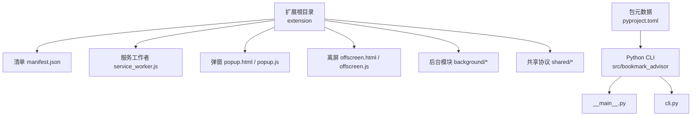
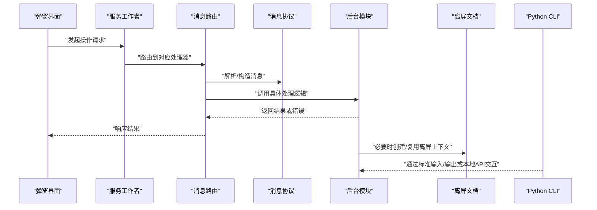
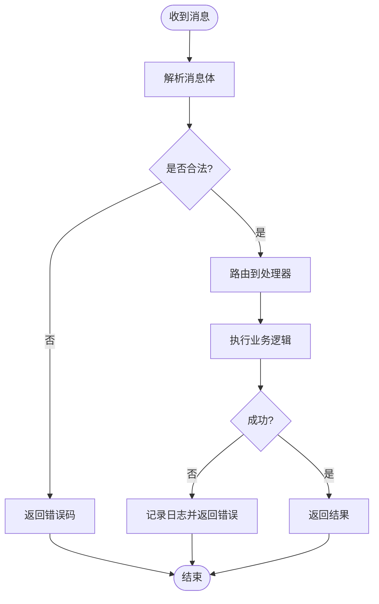
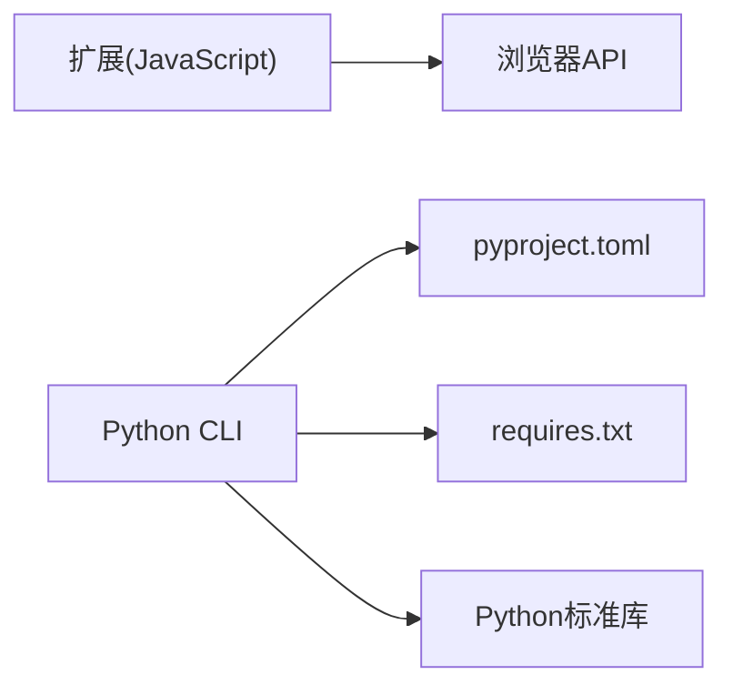

# 插件打包与分发

<cite>
**本文引用的文件**   
- [README.md](file://README.md)
- [pyproject.toml](file://pyproject.toml)
- [extension/manifest.json](file://extension/manifest.json)
- [extension/service_worker.js](file://extension/service_worker.js)
- [extension/offscreen.html](file://extension/offscreen.html)
- [extension/offscreen.js](file://extension/offscreen.js)
- [extension/popup.html](file://extension/popup.html)
- [extension/popup.js](file://extension/popup.js)
- [extension/background/action_handlers.js](file://extension/background/action_handlers.js)
- [extension/background/bookmark_api.js](file://extension/background/bookmark_api.js)
- [extension/background/message_router.js](file://extension/background/message_router.js)
- [extension/shared/message_protocol.js](file://extension/shared/message_protocol.js)
- [src/bookmark_advisor/__main__.py](file://src/bookmark_advisor/__main__.py)
- [src/bookmark_advisor/cli.py](file://src/bookmark_advisor/cli.py)
- [src/bookmark_advisor.egg-info/requires.txt](file://src/bookmark_advisor.egg-info/requires.txt)
</cite>

## 目录
1. [简介](#简介)
2. [项目结构](#项目结构)
3. [核心组件](#核心组件)
4. [架构总览](#架构总览)
5. [详细组件分析](#详细组件分析)
6. [依赖分析](#依赖分析)
7. [性能考虑](#性能考虑)
8. [故障排查指南](#故障排查指南)
9. [结论](#结论)
10. [附录](#附录)

## 简介
本指南面向Edge浏览器书签插件的打包与分发，围绕以下目标提供可操作的最佳实践：
- 插件打包格式、目录结构与配置文件要求
- 版本管理策略（语义化版本控制、变更日志维护、向后兼容性）
- 依赖声明与管理（第三方库、运行时依赖与环境要求）
- 发布与分发流程（代码签名、安全扫描、部署自动化）
- 插件市场或仓库集成指南

本项目包含两部分：
- Edge扩展前端：位于 extension 目录，遵循Manifest V3规范，使用Service Worker与Offscreen文档。
- Python CLI工具：位于 src/bookmark_advisor，用于计划生成、执行与报告等能力，通过 pyproject.toml 进行包管理与依赖声明。

## 项目结构
从打包与分发视角，关键目录与职责如下：
- extension：浏览器扩展源码与清单，包含入口页面、后台脚本、弹窗界面、共享协议与消息路由等。
- src/bookmark_advisor：Python侧CLI与核心逻辑，提供命令行接口与业务实现。
- tests：覆盖扩展行为与Python逻辑的测试用例，可用于构建前验证。
- docs：设计说明与审计记录，可作为发布文档与合规材料归档。

图表来源
- [extension/manifest.json](file://extension/manifest.json)
- [extension/service_worker.js](file://extension/service_worker.js)
- [extension/popup.html](file://extension/popup.html)
- [extension/popup.js](file://extension/popup.js)
- [extension/offscreen.html](file://extension/offscreen.html)
- [extension/offscreen.js](file://extension/offscreen.js)
- [extension/background/action_handlers.js](file://extension/background/action_handlers.js)
- [extension/background/bookmark_api.js](file://extension/background/bookmark_api.js)
- [extension/background/message_router.js](file://extension/background/message_router.js)
- [extension/shared/message_protocol.js](file://extension/shared/message_protocol.js)
- [src/bookmark_advisor/__main__.py](file://src/bookmark_advisor/__main__.py)
- [src/bookmark_advisor/cli.py](file://src/bookmark_advisor/cli.py)
- [pyproject.toml](file://pyproject.toml)

章节来源
- [README.md](file://README.md)
- [pyproject.toml](file://pyproject.toml)
- [extension/manifest.json](file://extension/manifest.json)

## 核心组件
- 扩展清单与权限：在清单中声明名称、版本、描述、图标、权限、内容脚本、背景脚本、弹窗入口、离屏文档等。确保仅申请必要权限，减少攻击面。
- Service Worker：作为扩展的后台运行环境，负责事件监听、任务调度、与UI通信。
- Offscreen文档：用于需要DOM访问的场景（如渲染复杂视图），需显式创建并管理生命周期。
- 弹窗界面：用户交互入口，展示状态、触发操作、读取设置。
- 消息协议与路由：统一的消息定义与转发机制，解耦前后端模块。
- Python CLI：提供本地命令，支持计划生成、规则校验、快照导出等，便于自动化流水线集成。

章节来源
- [extension/manifest.json](file://extension/manifest.json)
- [extension/service_worker.js](file://extension/service_worker.js)
- [extension/offscreen.html](file://extension/offscreen.html)
- [extension/offscreen.js](file://extension/offscreen.js)
- [extension/popup.html](file://extension/popup.html)
- [extension/popup.js](file://extension/popup.js)
- [extension/background/message_router.js](file://extension/background/message_router.js)
- [extension/shared/message_protocol.js](file://extension/shared/message_protocol.js)
- [src/bookmark_advisor/__main__.py](file://src/bookmark_advisor/__main__.py)
- [src/bookmark_advisor/cli.py](file://src/bookmark_advisor/cli.py)

## 架构总览
下图展示了扩展内部各组件之间的调用关系与数据流向，以及Python CLI与扩展的协作点。

图表来源
- [extension/popup.js](file://extension/popup.js)
- [extension/service_worker.js](file://extension/service_worker.js)
- [extension/background/message_router.js](file://extension/background/message_router.js)
- [extension/shared/message_protocol.js](file://extension/shared/message_protocol.js)
- [extension/background/action_handlers.js](file://extension/background/action_handlers.js)
- [extension/background/bookmark_api.js](file://extension/background/bookmark_api.js)
- [extension/offscreen.html](file://extension/offscreen.html)
- [extension/offscreen.js](file://extension/offscreen.js)
- [src/bookmark_advisor/cli.py](file://src/bookmark_advisor/cli.py)

## 详细组件分析

### 扩展清单与权限模型
- 清单字段建议：
  - 标识与元信息：名称、版本、描述、作者、图标、最小Chrome/Edge版本。
  - 权限范围：按需声明 host_permissions、permissions、optional_permissions。
  - 入口与脚本：background.service_worker、action.default_popup、offscreen文档路径。
  - 内容脚本：仅在必要时注入，严格匹配host与path。
- 安全建议：
  - 避免全局读写敏感API；对跨域资源启用CSP限制。
  - 将动态加载的资源置于白名单，禁止eval与内联脚本。

章节来源
- [extension/manifest.json](file://extension/manifest.json)

### 服务工作者与消息路由
- 服务工作者职责：
  - 注册与监听扩展事件（安装、更新、卸载）。
  - 管理离屏文档生命周期。
  - 接收来自UI的消息并委派给后台处理器。
- 消息路由：
  - 集中注册处理器，按类型分发。
  - 统一错误码与重试策略。
  - 与消息协议保持一致，保证前后端契约稳定。

图表来源
- [extension/service_worker.js](file://extension/service_worker.js)
- [extension/background/message_router.js](file://extension/background/message_router.js)
- [extension/shared/message_protocol.js](file://extension/shared/message_protocol.js)

章节来源
- [extension/service_worker.js](file://extension/service_worker.js)
- [extension/background/message_router.js](file://extension/background/message_router.js)
- [extension/shared/message_protocol.js](file://extension/shared/message_protocol.js)

### 弹窗界面与用户交互
- 弹窗职责：
  - 展示当前状态与操作入口。
  - 向服务工作者发送消息并渲染结果。
  - 读取与保存用户设置。
- 最佳实践：
  - 保持UI轻量，避免阻塞主线程。
  - 对网络请求与长耗时操作采用异步与进度反馈。

章节来源
- [extension/popup.html](file://extension/popup.html)
- [extension/popup.js](file://extension/popup.js)

### 离屏文档与DOM场景
- 适用场景：
  - 需要完整DOM环境的渲染任务。
  - 与PDF/HTML预览相关的功能。
- 生命周期管理：
  - 按需创建与销毁，避免常驻占用内存。
  - 与Service Worker之间通过postMessage通信。

章节来源
- [extension/offscreen.html](file://extension/offscreen.html)
- [extension/offscreen.js](file://extension/offscreen.js)

### 后台模块与书签API
- 动作处理器：
  - 封装常见用户动作（如批量整理、规则检查）。
  - 与书签API交互，确保事务性与回滚策略。
- 书签API：
  - 提供统一的CRUD与树形遍历方法。
  - 对异常进行捕获与上报。

章节来源
- [extension/background/action_handlers.js](file://extension/background/action_handlers.js)
- [extension/background/bookmark_api.js](file://extension/background/bookmark_api.js)

### Python CLI与本地集成
- CLI职责：
  - 提供计划生成、规则校验、快照导出等命令。
  - 作为CI/CD中的质量门禁与预检工具。
- 集成方式：
  - 通过标准输入/输出与扩展或外部系统交互。
  - 结合pyproject.toml进行依赖锁定与版本管理。

章节来源
- [src/bookmark_advisor/__main__.py](file://src/bookmark_advisor/__main__.py)
- [src/bookmark_advisor/cli.py](file://src/bookmark_advisor/cli.py)
- [pyproject.toml](file://pyproject.toml)

## 依赖分析
- 扩展侧依赖：
  - 浏览器内置API（书签、存储、消息、离屏文档）。
  - 无外部第三方库时，可直接打包为ZIP。
- Python侧依赖：
  - 通过 pyproject.toml 声明依赖与构建配置。
  - requires.txt 反映已解析的依赖列表，可用于镜像与离线环境。

图表来源
- [pyproject.toml](file://pyproject.toml)
- [src/bookmark_advisor.egg-info/requires.txt](file://src/bookmark_advisor.egg-info/requires.txt)

章节来源
- [pyproject.toml](file://pyproject.toml)
- [src/bookmark_advisor.egg-info/requires.txt](file://src/bookmark_advisor.egg-info/requires.txt)

## 性能考虑
- 扩展侧：
  - 避免在Service Worker中进行长时间计算，必要时拆分至离屏文档或Web Worker。
  - 合理使用缓存与去重，减少重复I/O。
- Python侧：
  - 大对象序列化与传输注意体积与时间开销。
  - 并行任务与批处理结合，提升吞吐。

## 故障排查指南
- 常见问题定位：
  - 权限不足：核对清单中权限与实际使用API的匹配度。
  - 消息未到达：检查消息路由注册与协议一致性。
  - 离屏文档无法创建：确认宿主页面与权限，避免循环引用。
- 调试建议：
  - 在Service Worker与离屏文档中开启详细日志。
  - 使用浏览器开发者工具的Network与Console面板跟踪错误。

## 结论
通过清晰的清单与权限模型、稳定的消息协议与服务工作者编排、以及Python CLI的质量门禁，可实现高可靠、易维护的插件打包与分发体系。配合严格的版本管理与自动化流水线，可显著提升发布效率与安全性。

## 附录

### 打包格式与目录结构
- 推荐产物：
  - ZIP压缩包：包含扩展根目录所有必需文件（清单、脚本、资源）。
  - 可选：附带README与许可证文件，便于仓库展示。
- 目录组织：
  - 将JS模块按职责分层（background、popup、shared）。
  - 静态资源与模板分离，便于缓存与增量更新。

章节来源
- [extension/manifest.json](file://extension/manifest.json)
- [extension/service_worker.js](file://extension/service_worker.js)
- [extension/popup.html](file://extension/popup.html)
- [extension/offscreen.html](file://extension/offscreen.html)

### 配置文件要求
- 清单文件：
  - 必填字段：名称、版本、描述、权限、入口脚本。
  - 建议字段：图标、最小版本、更新URL、隐私政策链接。
- Python包配置：
  - 在pyproject.toml中声明包名、版本、依赖、脚本入口。
  - 使用锁文件或固定版本区间，确保可重现构建。

章节来源
- [extension/manifest.json](file://extension/manifest.json)
- [pyproject.toml](file://pyproject.toml)

### 版本管理策略
- 语义化版本控制：
  - 主版本：破坏性变更（如消息协议不兼容）。
  - 次版本：新增功能（保持向后兼容）。
  - 修订号：缺陷修复与小改进。
- 变更日志维护：
  - 每次发布记录重要变更、已知问题与升级指引。
  - 与标签或分支命名一致，便于追溯。
- 向后兼容性保证：
  - 对消息协议与API进行版本协商与降级处理。
  - 在清单中声明最小兼容版本，避免低版本宿主崩溃。

### 依赖声明与管理
- 扩展依赖：
  - 优先使用浏览器原生API，减少外部依赖。
  - 若必须引入第三方库，使用CDN或内嵌资源，并确保完整性校验。
- Python依赖：
  - 在pyproject.toml中声明依赖与约束。
  - 使用requires.txt辅助离线环境与镜像构建。

章节来源
- [pyproject.toml](file://pyproject.toml)
- [src/bookmark_advisor.egg-info/requires.txt](file://src/bookmark_advisor.egg-info/requires.txt)

### 发布与分发流程
- 代码签名：
  - 使用企业证书对扩展进行签名，确保来源可信。
  - 在CI中自动注入签名步骤，失败即阻断发布。
- 安全扫描：
  - 静态分析：检测潜在漏洞与不安全用法。
  - 依赖审计：识别已知CVE与高风险依赖。
- 部署自动化：
  - 构建ZIP、生成哈希与签名文件。
  - 上传至内部仓库或应用商店，并通知相关团队。

### 插件市场或仓库集成
- 清单与元数据：
  - 准备标题、描述、截图、更新URL、隐私政策等素材。
  - 确保版本号与仓库标签一致。
- 自动化上架：
  - CI完成后自动提交到仓库或商店API。
  - 保留构建产物与日志，便于回溯与审计。