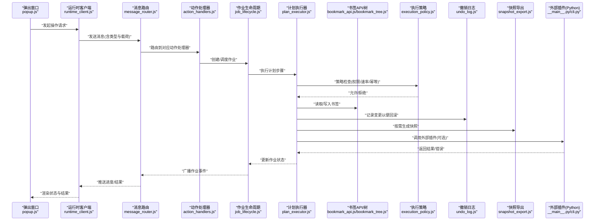
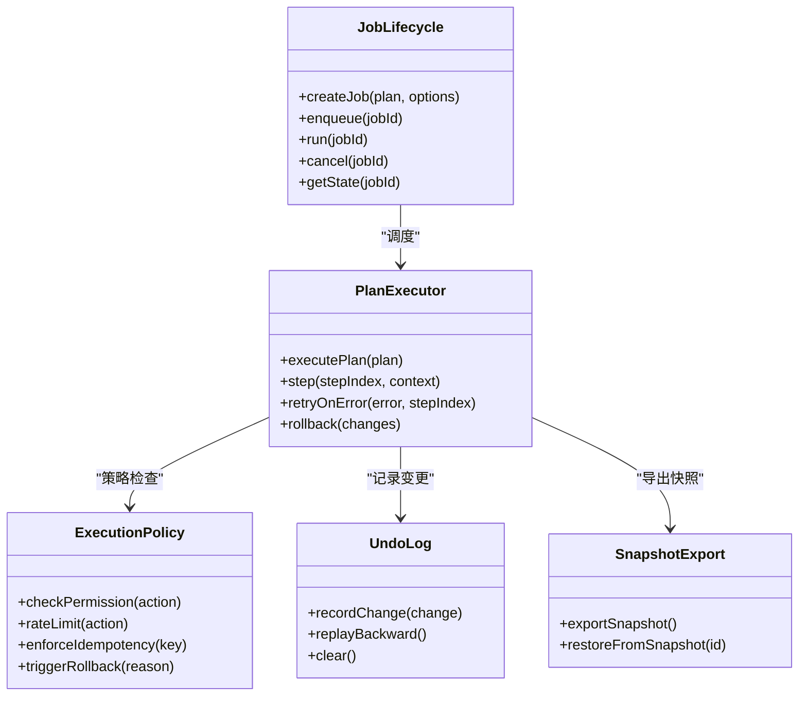
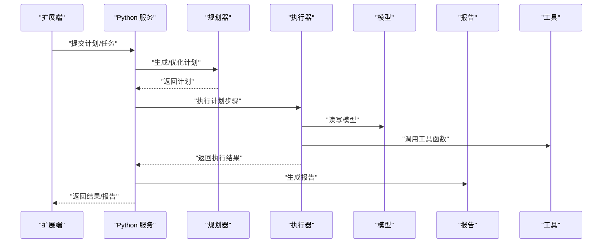
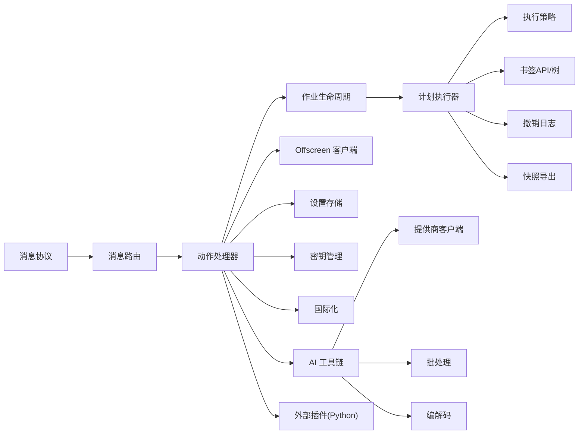

# 插件架构设计

<cite>
**本文引用的文件**   
- [extension/manifest.json](file://extension/manifest.json)
- [extension/service_worker.js](file://extension/service_worker.js)
- [extension/offscreen.js](file://extension/offscreen.js)
- [extension/background/message_router.js](file://extension/background/message_router.js)
- [extension/shared/message_protocol.js](file://extension/shared/message_protocol.js)
- [extension/background/action_handlers.js](file://extension/background/action_handlers.js)
- [extension/background/job_lifecycle.js](file://extension/background/job_lifecycle.js)
- [extension/background/job_store.js](file://extension/background/job_store.js)
- [extension/background/plan_executor.js](file://extension/background/plan_executor.js)
- [extension/popup/runtime_client.js](file://extension/popup/runtime_client.js)
- [extension/ai/provider_client.js](file://extension/ai/provider_client.js)
- [extension/ai/batching.js](file://extension/ai/batching.js)
- [extension/ai/response_codec.js](file://extension/ai/response_codec.js)
- [extension/ai/prompt_codec.js](file://extension/ai/prompt_codec.js)
- [extension/ai/snapshot_model.js](file://extension/ai/snapshot_model.js)
- [extension/background/bookmark_api.js](file://extension/background/bookmark_api.js)
- [extension/background/bookmark_tree.js](file://extension/background/bookmark_tree.js)
- [extension/background/execution_policy.js](file://extension/background/execution_policy.js)
- [extension/background/undo_log.js](file://extension/background/undo_log.js)
- [extension/background/offscreen_client.js](file://extension/background/offscreen_client.js)
- [extension/background/snapshot_export.js](file://extension/background/snapshot_export.js)
- [extension/popup/settings_store.js](file://extension/popup/settings_store.js)
- [extension/popup/i18n.js](file://extension/popup/i18n.js)
- [extension/popup/job_state.js](file://extension/popup/job_state.js)
- [extension/popup/plan_view.js](file://extension/popup/plan_view.js)
- [extension/popup/secrets.js](file://extension/popup/secrets.js)
- [extension/storage_helpers.js](file://extension/storage_helpers.js)
- [extension/AGENTS.md](file://extension/AGENTS.md)
- [src/bookmark_advisor/__main__.py](file://src/bookmark_advisor/__main__.py)
- [src/bookmark_advisor/cli.py](file://src/bookmark_advisor/cli.py)
- [src/bookmark_advisor/planner.py](file://src/bookmark_advisor/planner.py)
- [src/bookmark_advisor/executor.py](file://src/bookmark_advisor/executor.py)
- [src/bookmark_advisor/models.py](file://src/bookmark_advisor/models.py)
- [src/bookmark_advisor/reporting.py](file://src/bookmark_advisor/reporting.py)
- [src/bookmark_advisor/utils.py](file://src/bookmark_advisor/utils.py)
- [config/rules.yaml](file://config/rules.yaml)
</cite>

## 目录
1. [引言](#引言)
2. [项目结构](#项目结构)
3. [核心组件](#核心组件)
4. [架构总览](#架构总览)
5. [详细组件分析](#详细组件分析)
6. [依赖关系分析](#依赖关系分析)
7. [性能考量](#性能考量)
8. [故障排查指南](#故障排查指南)
9. [结论](#结论)
10. [附录](#附录)

## 引言
本文件面向开发者，系统化阐述书签管理项目的“插件架构设计”。文档围绕以下目标展开：
- 明确插件系统的整体架构与边界：主进程（Service Worker）、后台任务页（Offscreen）、弹出窗口（Popup）以及外部 Python 服务之间的职责划分。
- 定义核心接口契约：消息协议、计划模型、执行策略与存储约定。
- 描述插件生命周期：从发现、加载、初始化到运行与卸载的完整流程。
- 解释依赖注入机制：通过配置与运行时上下文将能力注入到各模块。
- 说明消息传递协议：跨上下文通信、事件驱动与异步处理模式。
- 给出错误处理策略：可观测性、回滚与重试。
- 提供架构图与数据流图，帮助理解技术决策与扩展点。

## 项目结构
本项目采用浏览器扩展与桌面脚本协同的方式组织代码：
- extension：Chrome 扩展主体，包含 Service Worker、Offscreen 页面、Popup UI、共享协议与 AI 工具链。
- src：Python 侧的书签顾问服务，提供规划器、执行器、报告等能力，可作为“外部插件”被扩展调用。
- config：规则与策略配置文件。
- tests：覆盖关键路径的测试用例。

```mermaid
graph TB
subgraph "浏览器扩展"
SW["Service Worker<br/>service_worker.js"]
OS["Offscreen 页面<br/>offscreen.js"]
POP["弹出窗口<br/>popup.js"]
MSGR["消息路由<br/>background/message_router.js"]
SHARED["共享协议<br/>shared/message_protocol.js"]
BKAPI["书签 API 封装<br/>background/bookmark_api.js"]
BKTREE["书签树<br/>background/bookmark_tree.js"]
POLICY["执行策略<br/>background/execution_policy.js"]
JOBLC["作业生命周期<br/>background/job_lifecycle.js"]
JOBSTORE["作业存储<br/>background/job_store.js"]
PLANEX["计划执行器<br/>background/plan_executor.js"]
OFFCLI["Offscreen 客户端<br/>background/offscreen_client.js"]
SNAPEXP["快照导出<br/>background/snapshot_export.js"]
UNDOLOG["撤销日志<br/>background/undo_log.js"]
ACTH["动作处理器<br/>background/action_handlers.js"]
RUNTIME["运行时客户端<br/>popup/runtime_client.js"]
SETS["设置存储<br/>popup/settings_store.js"]
I18N["国际化<br/>popup/i18n.js"]
SECRETS["密钥管理<br/>popup/secrets.js"]
AI["AI 工具链<br/>ai/*"]
end
subgraph "外部服务(可选)"
PYMAIN["Python 入口<br/>__main__.py / cli.py"]
PLANNER["规划器<br/>planner.py"]
EXEC["执行器<br/>executor.py"]
MODELS["数据模型<br/>models.py"]
REPORT["报告<br/>reporting.py"]
UTILS["工具<br/>utils.py"]
end
subgraph "配置"
RULES["规则配置<br/>config/rules.yaml"]
end
SW --> MSGR
SW --> ACTH
SW --> JOBLC
SW --> JOBSTORE
SW --> PLANEX
SW --> OFFCLI
SW --> BKAPI
SW --> BKTREE
SW --> POLICY
SW --> SNAPEXP
SW --> UNDOLOG
POP --> RUNTIME
RUNTIME --> MSGR
MSGR --> SHARED
AI --> SHARED
AI --> BKAPI
AI --> BKTREE
AI --> POLICY
AI --> PLANEX
AI --> JOBLC
AI --> JOBSTORE
AI --> OFFCLI
AI --> SNAPEXP
AI --> UNDOLOG
AI --> SETS
AI --> SECRETS
AI --> I18N
OFFCLI --> OS
ACTH --> JOBLC
ACTH --> PLANEX
ACTH --> BKAPI
ACTH --> BKTREE
ACTH --> POLICY
ACTH --> SNAPEXP
ACTH --> UNDOLOG
ACTH --> JOBSTORE
ACTH --> JOBLC
ACTH --> OFFCLI
ACTH --> SETS
ACTH --> SECRETS
ACTH --> I18N
ACTH --> RUNTIME
ACTH --> MSGR
ACTH --> SHARED
ACTH --> AI
ACTH --> RULES
ACTH --> PYMAIN
PYMAIN --> PLANNER
PYMAIN --> EXEC
PYMAIN --> MODELS
PYMAIN --> REPORT
PYMAIN --> UTILS
```

图表来源
- [extension/service_worker.js](file://extension/service_worker.js)
- [extension/offscreen.js](file://extension/offscreen.js)
- [extension/background/message_router.js](file://extension/background/message_router.js)
- [extension/shared/message_protocol.js](file://extension/shared/message_protocol.js)
- [extension/background/action_handlers.js](file://extension/background/action_handlers.js)
- [extension/background/job_lifecycle.js](file://extension/background/job_lifecycle.js)
- [extension/background/job_store.js](file://extension/background/job_store.js)
- [extension/background/plan_executor.js](file://extension/background/plan_executor.js)
- [extension/background/offscreen_client.js](file://extension/background/offscreen_client.js)
- [extension/background/bookmark_api.js](file://extension/background/bookmark_api.js)
- [extension/background/bookmark_tree.js](file://extension/background/bookmark_tree.js)
- [extension/background/execution_policy.js](file://extension/background/execution_policy.js)
- [extension/background/snapshot_export.js](file://extension/background/snapshot_export.js)
- [extension/background/undo_log.js](file://extension/background/undo_log.js)
- [extension/popup/runtime_client.js](file://extension/popup/runtime_client.js)
- [extension/popup/settings_store.js](file://extension/popup/settings_store.js)
- [extension/popup/i18n.js](file://extension/popup/i18n.js)
- [extension/popup/secrets.js](file://extension/popup/secrets.js)
- [extension/ai/provider_client.js](file://extension/ai/provider_client.js)
- [extension/ai/batching.js](file://extension/ai/batching.js)
- [extension/ai/response_codec.js](file://extension/ai/response_codec.js)
- [extension/ai/prompt_codec.js](file://extension/ai/prompt_codec.js)
- [extension/ai/snapshot_model.js](file://extension/ai/snapshot_model.js)
- [src/bookmark_advisor/__main__.py](file://src/bookmark_advisor/__main__.py)
- [src/bookmark_advisor/cli.py](file://src/bookmark_advisor/cli.py)
- [src/bookmark_advisor/planner.py](file://src/bookmark_advisor/planner.py)
- [src/bookmark_advisor/executor.py](file://src/bookmark_advisor/executor.py)
- [src/bookmark_advisor/models.py](file://src/bookmark_advisor/models.py)
- [src/bookmark_advisor/reporting.py](file://src/bookmark_advisor/reporting.py)
- [src/bookmark_advisor/utils.py](file://src/bookmark_advisor/utils.py)
- [config/rules.yaml](file://config/rules.yaml)

章节来源
- [extension/manifest.json](file://extension/manifest.json)
- [extension/AGENTS.md](file://extension/AGENTS.md)

## 核心组件
本节聚焦插件系统的关键抽象与契约，包括：
- 插件清单与元数据：用于声明插件能力、版本与权限。
- 消息协议：统一的消息类型、载荷结构与校验约束。
- 作业与计划：以“作业”为最小执行单元，以“计划”为可编排的工作流。
- 执行策略：安全沙箱、速率限制、幂等与回滚。
- 存储与快照：持久化作业状态、撤销日志与快照导出。
- 外部插件：通过 CLI/进程或 HTTP 暴露能力的 Python 服务。

章节来源
- [extension/shared/message_protocol.js](file://extension/shared/message_protocol.js)
- [extension/background/job_lifecycle.js](file://extension/background/job_lifecycle.js)
- [extension/background/job_store.js](file://extension/background/job_store.js)
- [extension/background/plan_executor.js](file://extension/background/plan_executor.js)
- [extension/background/execution_policy.js](file://extension/background/execution_policy.js)
- [extension/background/snapshot_export.js](file://extension/background/snapshot_export.js)
- [extension/background/undo_log.js](file://extension/background/undo_log.js)
- [extension/ai/snapshot_model.js](file://extension/ai/snapshot_model.js)
- [src/bookmark_advisor/models.py](file://src/bookmark_advisor/models.py)

## 架构总览
下图展示插件系统与主系统交互的整体视图，涵盖事件驱动、异步处理与错误处理策略。

图表来源
- [extension/popup/runtime_client.js](file://extension/popup/runtime_client.js)
- [extension/background/message_router.js](file://extension/background/message_router.js)
- [extension/background/action_handlers.js](file://extension/background/action_handlers.js)
- [extension/background/job_lifecycle.js](file://extension/background/job_lifecycle.js)
- [extension/background/plan_executor.js](file://extension/background/plan_executor.js)
- [extension/background/bookmark_api.js](file://extension/background/bookmark_api.js)
- [extension/background/bookmark_tree.js](file://extension/background/bookmark_tree.js)
- [extension/background/execution_policy.js](file://extension/background/execution_policy.js)
- [extension/background/undo_log.js](file://extension/background/undo_log.js)
- [extension/background/snapshot_export.js](file://extension/background/snapshot_export.js)
- [src/bookmark_advisor/__main__.py](file://src/bookmark_advisor/__main__.py)
- [src/bookmark_advisor/cli.py](file://src/bookmark_advisor/cli.py)

## 详细组件分析

### 插件清单与元数据
- 作用：声明插件名称、版本、能力范围、权限与入口点；用于加载前校验与兼容性检查。
- 关键点：
  - 版本号语义化，支持主版本不兼容升级提示。
  - 能力标签映射到具体动作处理器与消息类型。
  - 权限白名单控制对敏感 API 的访问。

章节来源
- [extension/manifest.json](file://extension/manifest.json)

### 消息协议与路由
- 作用：统一跨上下文通信格式，确保消息类型、载荷结构与校验一致。
- 关键点：
  - 消息类型枚举与载荷 Schema 校验。
  - 路由表维护消息类型到处理器的映射。
  - 超时与重试策略，避免阻塞主线程。

```mermaid
flowchart TD
Start(["收到消息"]) --> Parse["解析并校验消息类型/载荷"]
Parse --> Valid{"校验通过?"}
Valid -- "否" --> Reject["返回错误码/原因"]
Valid -- "是" --> Lookup["查找处理器映射"]
Lookup --> Found{"找到处理器?"}
Found -- "否" --> Unknown["未知动作/降级处理"]
Found -- "是" --> Dispatch["分发到处理器"]
Dispatch --> Handle["执行业务逻辑"]
Handle --> Result["构造响应/事件"]
Result --> End(["返回/广播"])
```

图表来源
- [extension/shared/message_protocol.js](file://extension/shared/message_protocol.js)
- [extension/background/message_router.js](file://extension/background/message_router.js)

章节来源
- [extension/shared/message_protocol.js](file://extension/shared/message_protocol.js)
- [extension/background/message_router.js](file://extension/background/message_router.js)

### 作业与计划执行
- 作业生命周期：创建、排队、执行、完成、失败、取消。
- 计划执行器：按步骤顺序执行，支持条件分支与并行度控制。
- 执行策略：权限校验、速率限制、幂等键、回滚触发。
- 撤销日志：记录变更前后的差异，支持一键回滚。
- 快照导出：在关键节点导出当前书签状态，便于审计与恢复。

图表来源
- [extension/background/job_lifecycle.js](file://extension/background/job_lifecycle.js)
- [extension/background/plan_executor.js](file://extension/background/plan_executor.js)
- [extension/background/execution_policy.js](file://extension/background/execution_policy.js)
- [extension/background/undo_log.js](file://extension/background/undo_log.js)
- [extension/background/snapshot_export.js](file://extension/background/snapshot_export.js)

章节来源
- [extension/background/job_lifecycle.js](file://extension/background/job_lifecycle.js)
- [extension/background/plan_executor.js](file://extension/background/plan_executor.js)
- [extension/background/execution_policy.js](file://extension/background/execution_policy.js)
- [extension/background/undo_log.js](file://extension/background/undo_log.js)
- [extension/background/snapshot_export.js](file://extension/background/snapshot_export.js)

### 书签 API 与树
- 作用：封装底层书签读写与树形结构遍历，提供一致的查询与变更接口。
- 关键点：
  - 批量操作与事务语义，减少多次 IO。
  - 树形索引与缓存，提升查询性能。
  - 变更事件发布，供其他模块订阅。

章节来源
- [extension/background/bookmark_api.js](file://extension/background/bookmark_api.js)
- [extension/background/bookmark_tree.js](file://extension/background/bookmark_tree.js)

### Offscreen 与长任务
- 作用：在独立页面中执行耗时任务，避免 Service Worker 休眠导致中断。
- 关键点：
  - 通过专用客户端进行跨上下文通信。
  - 任务队列与心跳保活，防止页面回收。
  - 错误隔离与重启恢复。

章节来源
- [extension/offscreen.js](file://extension/offscreen.js)
- [extension/background/offscreen_client.js](file://extension/background/offscreen_client.js)

### 外部插件（Python 服务）
- 作用：作为“外部插件”，通过 CLI/进程或 HTTP 暴露规划与执行能力。
- 关键点：
  - 标准化输入输出模型，保证与扩展端数据一致性。
  - 错误码与诊断信息结构化，便于上层聚合。
  - 可插拔实现，支持替换不同后端。

图表来源
- [src/bookmark_advisor/__main__.py](file://src/bookmark_advisor/__main__.py)
- [src/bookmark_advisor/cli.py](file://src/bookmark_advisor/cli.py)
- [src/bookmark_advisor/planner.py](file://src/bookmark_advisor/planner.py)
- [src/bookmark_advisor/executor.py](file://src/bookmark_advisor/executor.py)
- [src/bookmark_advisor/models.py](file://src/bookmark_advisor/models.py)
- [src/bookmark_advisor/reporting.py](file://src/bookmark_advisor/reporting.py)
- [src/bookmark_advisor/utils.py](file://src/bookmark_advisor/utils.py)

章节来源
- [src/bookmark_advisor/__main__.py](file://src/bookmark_advisor/__main__.py)
- [src/bookmark_advisor/cli.py](file://src/bookmark_advisor/cli.py)
- [src/bookmark_advisor/planner.py](file://src/bookmark_advisor/planner.py)
- [src/bookmark_advisor/executor.py](file://src/bookmark_advisor/executor.py)
- [src/bookmark_advisor/models.py](file://src/bookmark_advisor/models.py)
- [src/bookmark_advisor/reporting.py](file://src/bookmark_advisor/reporting.py)
- [src/bookmark_advisor/utils.py](file://src/bookmark_advisor/utils.py)

### AI 工具链与批处理
- 作用：封装与 AI 提供商的交互、提示词编解码、响应解析与批处理。
- 关键点：
  - 批处理合并请求，降低延迟与成本。
  - 响应解码容错，支持多格式与降级策略。
  - 快照模型对齐，确保 AI 输出与本地结构一致。

章节来源
- [extension/ai/provider_client.js](file://extension/ai/provider_client.js)
- [extension/ai/batching.js](file://extension/ai/batching.js)
- [extension/ai/response_codec.js](file://extension/ai/response_codec.js)
- [extension/ai/prompt_codec.js](file://extension/ai/prompt_codec.js)
- [extension/ai/snapshot_model.js](file://extension/ai/snapshot_model.js)

### 弹出窗口与运行时
- 作用：用户界面与运行时客户端，负责状态展示与交互。
- 关键点：
  - 与消息路由对接，实时获取作业状态。
  - 设置与密钥管理，支持多环境切换。
  - 国际化与主题适配。

章节来源
- [extension/popup/runtime_client.js](file://extension/popup/runtime_client.js)
- [extension/popup/settings_store.js](file://extension/popup/settings_store.js)
- [extension/popup/i18n.js](file://extension/popup/i18n.js)
- [extension/popup/secrets.js](file://extension/popup/secrets.js)
- [extension/popup/job_state.js](file://extension/popup/job_state.js)
- [extension/popup/plan_view.js](file://extension/popup/plan_view.js)

### 动作处理器与入口
- 作用：接收来自 UI 或内部的事件，协调各子系统完成业务。
- 关键点：
  - 参数校验与权限检查前置。
  - 组合多个子任务，统一错误聚合。
  - 与外部插件集成，支持动态扩展。

章节来源
- [extension/background/action_handlers.js](file://extension/background/action_handlers.js)

### 配置与规则
- 作用：集中管理行为规则与策略，支持热更新。
- 关键点：
  - YAML 配置，易于维护与审查。
  - 运行时重载，无需重启服务。
  - 规则优先级与冲突解决。

章节来源
- [config/rules.yaml](file://config/rules.yaml)

## 依赖关系分析
- 松耦合：通过消息协议与路由解耦各模块，新增插件只需注册新消息类型与处理器。
- 内聚性：每个子系统职责单一，如计划执行器专注编排，策略模块专注约束。
- 外部依赖：Python 服务作为可选插件，通过标准接口接入，不影响核心链路。
- 循环依赖规避：通过分层与接口抽象避免直接循环引用。

图表来源
- [extension/shared/message_protocol.js](file://extension/shared/message_protocol.js)
- [extension/background/message_router.js](file://extension/background/message_router.js)
- [extension/background/action_handlers.js](file://extension/background/action_handlers.js)
- [extension/background/job_lifecycle.js](file://extension/background/job_lifecycle.js)
- [extension/background/plan_executor.js](file://extension/background/plan_executor.js)
- [extension/background/execution_policy.js](file://extension/background/execution_policy.js)
- [extension/background/bookmark_api.js](file://extension/background/bookmark_api.js)
- [extension/background/bookmark_tree.js](file://extension/background/bookmark_tree.js)
- [extension/background/undo_log.js](file://extension/background/undo_log.js)
- [extension/background/snapshot_export.js](file://extension/background/snapshot_export.js)
- [extension/background/offscreen_client.js](file://extension/background/offscreen_client.js)
- [extension/popup/settings_store.js](file://extension/popup/settings_store.js)
- [extension/popup/secrets.js](file://extension/popup/secrets.js)
- [extension/popup/i18n.js](file://extension/popup/i18n.js)
- [extension/ai/provider_client.js](file://extension/ai/provider_client.js)
- [extension/ai/batching.js](file://extension/ai/batching.js)
- [extension/ai/response_codec.js](file://extension/ai/response_codec.js)
- [extension/ai/prompt_codec.js](file://extension/ai/prompt_codec.js)
- [src/bookmark_advisor/__main__.py](file://src/bookmark_advisor/__main__.py)

章节来源
- [extension/manifest.json](file://extension/manifest.json)
- [extension/AGENTS.md](file://extension/AGENTS.md)

## 性能考量
- 批处理与合并：AI 请求与书签批量操作应合并以减少网络与 IO 开销。
- 懒加载与缓存：树形结构与常用配置按需加载，热点数据缓存。
- 异步与背压：长任务进入 Offscreen 队列，避免阻塞主线程。
- 幂等与去重：基于幂等键避免重复执行，降低副作用风险。
- 资源清理：及时释放监听器与定时器，防止内存泄漏。

[本节为通用指导，不涉及具体文件分析]

## 故障排查指南
- 常见错误分类：
  - 协议层：消息类型不存在、载荷校验失败。
  - 策略层：权限不足、速率限制触发。
  - 执行层：外部插件不可用、书签 API 异常。
  - 持久化层：快照损坏、撤销日志不一致。
- 定位方法：
  - 查看作业状态与事件日志，确认失败阶段。
  - 核对消息协议与载荷结构，确保前后端一致。
  - 检查执行策略配置与规则文件是否生效。
  - 验证外部插件健康状态与返回码。
- 恢复策略：
  - 使用撤销日志回滚到上一稳定状态。
  - 从快照恢复书签集合。
  - 重试失败步骤，必要时降级到非 AI 方案。

章节来源
- [extension/background/job_lifecycle.js](file://extension/background/job_lifecycle.js)
- [extension/background/plan_executor.js](file://extension/background/plan_executor.js)
- [extension/background/execution_policy.js](file://extension/background/execution_policy.js)
- [extension/background/undo_log.js](file://extension/background/undo_log.js)
- [extension/background/snapshot_export.js](file://extension/background/snapshot_export.js)
- [extension/shared/message_protocol.js](file://extension/shared/message_protocol.js)

## 结论
本插件架构通过清晰的分层与契约，实现了高内聚、低耦合的可扩展系统。消息协议与路由确保了跨上下文通信的一致性；作业与计划执行器提供了可靠的编排与回滚能力；执行策略与撤销日志保障了安全性与可恢复性；外部插件机制使系统具备横向扩展能力。结合批处理、缓存与异步策略，系统在性能与稳定性之间取得平衡。

[本节为总结性内容，不涉及具体文件分析]

## 附录
- 术语表：
  - 插件：可扩展的功能单元，可通过清单声明能力与权限。
  - 作业：一次可追踪的执行单元，具有明确的生命周期。
  - 计划：由若干步骤组成的可执行工作流。
  - 策略：在执行过程中施加的约束与规则。
  - 快照：某一时刻的系统状态副本。
- 最佳实践：
  - 为新功能注册新的消息类型与处理器，保持向后兼容。
  - 所有外部调用需具备超时与重试策略。
  - 变更操作必须记录撤销日志，确保可回滚。
  - 对外部插件进行健康检查与熔断保护。

[本节为补充信息，不涉及具体文件分析]