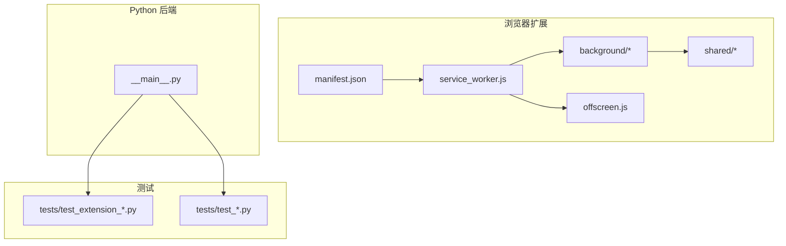
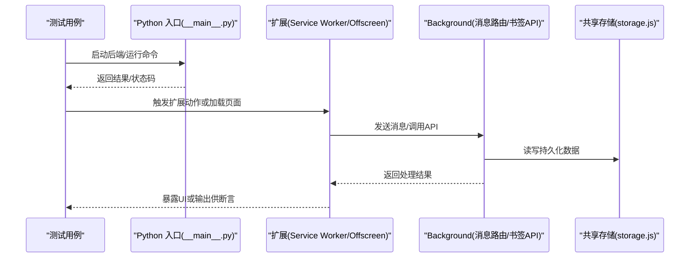
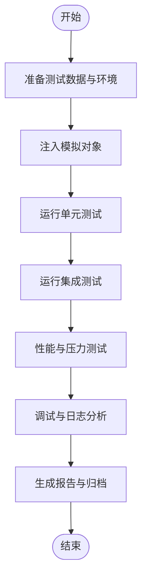
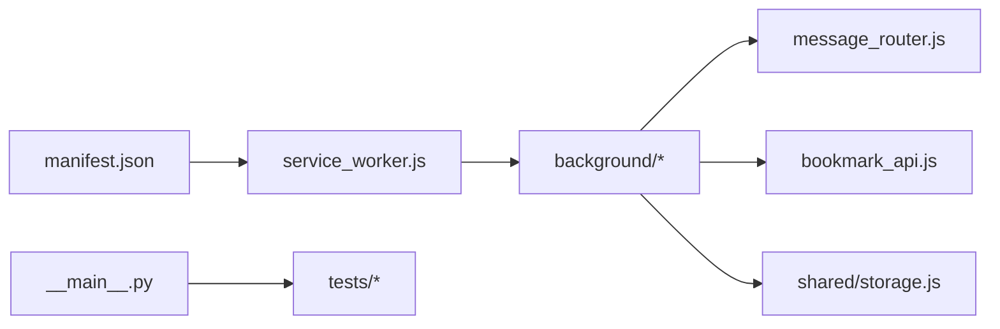

# 插件测试与调试

<cite>
**本文引用的文件**   
- [README.md](file://README.md)
- [pyproject.toml](file://pyproject.toml)
- [extension/manifest.json](file://extension/manifest.json)
- [extension/service_worker.js](file://extension/service_worker.js)
- [extension/offscreen.js](file://extension/offscreen.js)
- [extension/background/bookmark_api.js](file://extension/background/bookmark_api.js)
- [extension/background/message_router.js](file://extension/background/message_router.js)
- [extension/shared/storage.js](file://extension/shared/storage.js)
- [src/bookmark_advisor/__main__.py](file://src/bookmark_advisor/__main__.py)
- [tests/test_extension_bookmark_tree.py](file://tests/test_extension_bookmark_tree.py)
- [tests/test_extension_job_handlers.py](file://tests/test_extension_job_handlers.py)
- [tests/test_extension_plan_executor_module.py](file://tests/test_extension_plan_executor_module.py)
- [tests/test_planner.py](file://tests/test_planner.py)
- [tests/test_rules.py](file://tests/test_rules.py)
- [tests/test_utils.py](file://tests/test_utils.py)
</cite>

## 目录
1. [简介](#简介)
2. [项目结构](#项目结构)
3. [核心组件](#核心组件)
4. [架构总览](#架构总览)
5. [详细组件分析](#详细组件分析)
6. [依赖分析](#依赖分析)
7. [性能考虑](#性能考虑)
8. [故障排查指南](#故障排查指南)
9. [结论](#结论)
10. [附录](#附录)

## 简介
本指南面向插件（浏览器扩展）与后端服务的测试与调试实践，覆盖单元测试、集成测试、性能与压力测试策略，以及断点调试、日志分析与性能剖析等技巧。文档基于仓库现有测试与代码组织，提供可操作的步骤与最佳实践，帮助团队稳定地验证插件行为并快速定位问题。

## 项目结构
仓库包含浏览器扩展（extension）、Python 后端服务（src/bookmark_advisor）与集中式测试集（tests）。测试按功能域拆分，便于并行执行与持续集成。

图表来源
- [extension/manifest.json](file://extension/manifest.json)
- [extension/service_worker.js](file://extension/service_worker.js)
- [extension/offscreen.js](file://extension/offscreen.js)
- [extension/background/bookmark_api.js](file://extension/background/bookmark_api.js)
- [extension/background/message_router.js](file://extension/background/message_router.js)
- [extension/shared/storage.js](file://extension/shared/storage.js)
- [src/bookmark_advisor/__main__.py](file://src/bookmark_advisor/__main__.py)

章节来源
- [README.md](file://README.md)
- [pyproject.toml](file://pyproject.toml)
- [extension/manifest.json](file://extension/manifest.json)

## 核心组件
- 扩展入口与消息路由：Service Worker 负责生命周期与事件分发；Offscreen Document 承载重任务；Background 脚本处理书签 API 与业务逻辑；共享模块提供存储与协议。
- Python 后端：命令行入口用于驱动计划生成、规则校验与执行流程，测试通过调用该入口进行端到端验证。
- 测试套件：以 pytest 为主，针对扩展的 JS 模块与 Python 模块分别编写单测与集成用例。

章节来源
- [extension/service_worker.js](file://extension/service_worker.js)
- [extension/offscreen.js](file://extension/offscreen.js)
- [extension/background/message_router.js](file://extension/background/message_router.js)
- [extension/background/bookmark_api.js](file://extension/background/bookmark_api.js)
- [extension/shared/storage.js](file://extension/shared/storage.js)
- [src/bookmark_advisor/__main__.py](file://src/bookmark_advisor/__main__.py)

## 架构总览
下图展示扩展内部与后端的交互关系，以及测试如何挂载到这些边界上。

图表来源
- [src/bookmark_advisor/__main__.py](file://src/bookmark_advisor/__main__.py)
- [extension/service_worker.js](file://extension/service_worker.js)
- [extension/offscreen.js](file://extension/offscreen.js)
- [extension/background/message_router.js](file://extension/background/message_router.js)
- [extension/background/bookmark_api.js](file://extension/background/bookmark_api.js)
- [extension/shared/storage.js](file://extension/shared/storage.js)

## 详细组件分析

### 单元测试框架与选择
- Python 侧：使用 pytest 作为统一测试框架，配合标准库与第三方包完成断言、夹具与参数化。
- JavaScript 侧：在 Python 测试中通过子进程或 HTTP 方式驱动扩展相关能力，结合临时文件系统与内存对象模拟外部依赖。

章节来源
- [pyproject.toml](file://pyproject.toml)
- [tests/test_utils.py](file://tests/test_utils.py)

### 模拟对象与测试数据准备
- 外部服务模拟：对网络请求与 AI 提供商客户端进行替换，避免真实网络访问。
- 数据库与存储模拟：使用内存字典或临时目录替代持久化存储，确保测试隔离与可重复性。
- 测试数据：为书签树、计划与规则准备最小可用数据集，覆盖正常路径与边界条件。

章节来源
- [tests/test_extension_ai_provider_client.py](file://tests/test_extension_ai_provider_client.py)
- [tests/test_extension_offscreen_client.py](file://tests/test_extension_offscreen_client.py)
- [tests/test_extension_shared_contracts.py](file://tests/test_extension_shared_contracts.py)

### 扩展背景脚本与消息路由测试
- 目标：验证消息路由的正确性、错误传播与超时处理。
- 方法：构造不同消息类型与异常场景，断言回调与返回值。

章节来源
- [extension/background/message_router.js](file://extension/background/message_router.js)
- [tests/test_extension_message_router.py](file://tests/test_extension_message_router.py)

### 书签 API 与树操作测试
- 目标：验证读取、创建、更新、删除书签及树形结构的正确性。
- 方法：注入模拟书签数据，断言树遍历与导出结果。

章节来源
- [extension/background/bookmark_api.js](file://extension/background/bookmark_api.js)
- [tests/test_extension_bookmark_tree.py](file://tests/test_extension_bookmark_tree.py)

### 作业处理器与生命周期测试
- 目标：验证作业创建、调度、执行与清理流程。
- 方法：模拟外部依赖与时间推进，断言状态机转换与副作用。

章节来源
- [extension/background/job_handlers.js](file://extension/background/job_handlers.js)
- [extension/background/job_lifecycle.js](file://extension/background/job_lifecycle.js)
- [tests/test_extension_job_handlers.py](file://tests/test_extension_job_handlers.py)
- [tests/test_extension_job_lifecycle.py](file://tests/test_extension_job_lifecycle.py)

### 计划执行器与编译器测试
- 目标：验证计划编译、执行与回滚逻辑。
- 方法：构造计划样例，断言执行顺序与中间状态。

章节来源
- [extension/plan_executor.js](file://extension/plan_executor.js)
- [extension/plan_compiler.js](file://extension/plan_compiler.js)
- [tests/test_extension_plan_executor_module.py](file://tests/test_extension_plan_executor_module.py)
- [tests/test_extension_plan_compiler.py](file://tests/test_extension_plan_compiler.py)

### Python 规划器与规则测试
- 目标：验证规划器输出与规则匹配/应用逻辑。
- 方法：使用固定输入与期望输出，断言一致性。

章节来源
- [tests/test_planner.py](file://tests/test_planner.py)
- [tests/test_rules.py](file://tests/test_rules.py)

### 端到端与集成测试
- 目标：从命令行入口驱动完整流程，验证跨语言协作。
- 方法：调用 __main__.py 的 CLI，检查返回码与产物文件。

章节来源
- [src/bookmark_advisor/__main__.py](file://src/bookmark_advisor/__main__.py)
- [tests/test_reorg_job.py](file://tests/test_reorg_job.py)

### 概念性概览
以下流程图概括插件测试的关键阶段，适用于大多数功能模块。

[此图为概念性流程图，不直接映射具体源码文件]

## 依赖分析
- 扩展依赖：Service Worker 管理 Offscreen 与 Background 通信；Background 依赖共享存储与书签 API。
- 测试依赖：pytest 驱动所有测试；部分测试需要临时目录与网络模拟。

图表来源
- [extension/manifest.json](file://extension/manifest.json)
- [extension/service_worker.js](file://extension/service_worker.js)
- [extension/background/message_router.js](file://extension/background/message_router.js)
- [extension/background/bookmark_api.js](file://extension/background/bookmark_api.js)
- [extension/shared/storage.js](file://extension/shared/storage.js)
- [src/bookmark_advisor/__main__.py](file://src/bookmark_advisor/__main__.py)

章节来源
- [pyproject.toml](file://pyproject.toml)
- [extension/manifest.json](file://extension/manifest.json)

## 性能考虑
- 基准测试：对关键算法（如树遍历、计划编译）建立基准，定期回归。
- 压测策略：批量构造大规模书签与计划，评估内存占用与耗时。
- 资源隔离：Offscreen 文档用于重任务，避免阻塞主线程。
- 缓存与去重：对频繁计算的结果进行缓存，减少重复开销。

[本节为通用指导，不直接分析具体文件]

## 故障排查指南
- 断点调试：在 Service Worker 与 Offscreen 页面设置断点，逐步跟踪消息传递与异步回调。
- 日志分析：集中记录关键路径日志，包括错误堆栈与上下文信息，便于定位问题。
- 常见问题：
  - 消息未到达：检查路由键与权限配置。
  - 存储不一致：确认写入时机与事务边界。
  - 外部服务失败：启用重试与降级策略，记录失败详情。
- 复现与最小化：将问题收敛到最小用例，便于快速修复与回归验证。

章节来源
- [extension/background/message_router.js](file://extension/background/message_router.js)
- [extension/shared/storage.js](file://extension/shared/storage.js)

## 结论
通过分层测试（单元、集成、性能）与系统化调试手段，可有效保障插件质量与稳定性。建议将测试纳入持续集成，定期回归并监控性能指标，持续提升交付可靠性。

[本节为总结性内容，不直接分析具体文件]

## 附录
- 运行测试：使用 pytest 执行全部或指定测试文件。
- 覆盖率统计：开启覆盖率收集，关注关键模块覆盖率阈值。
- 报告归档：将测试结果与日志归档，便于审计与回溯。

章节来源
- [pyproject.toml](file://pyproject.toml)
- [tests/test_utils.py](file://tests/test_utils.py)