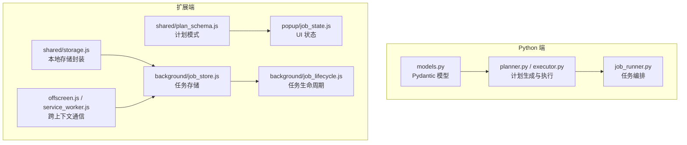
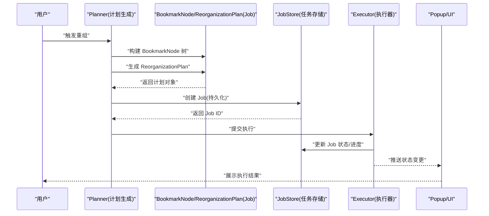
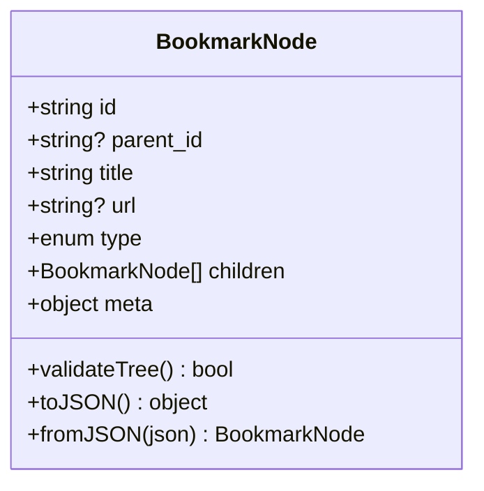
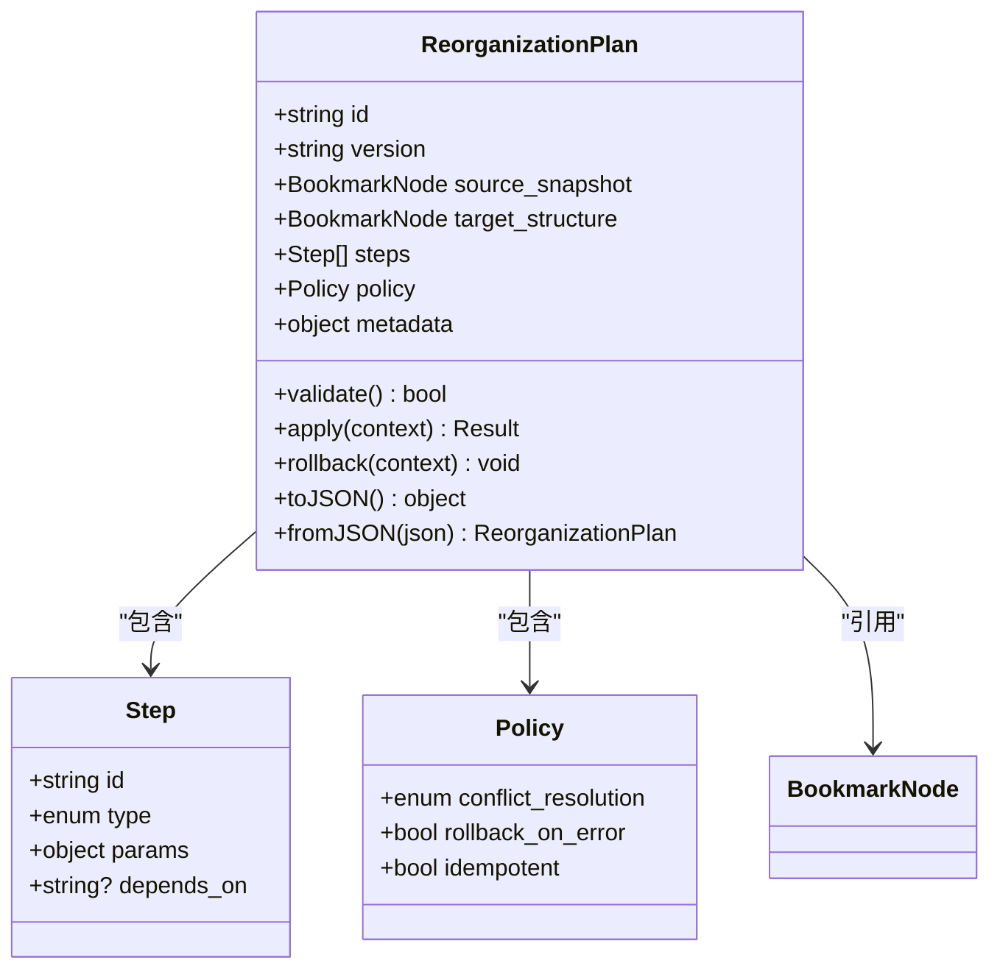
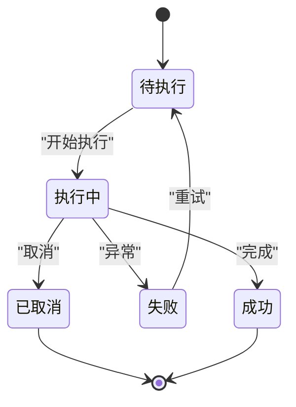
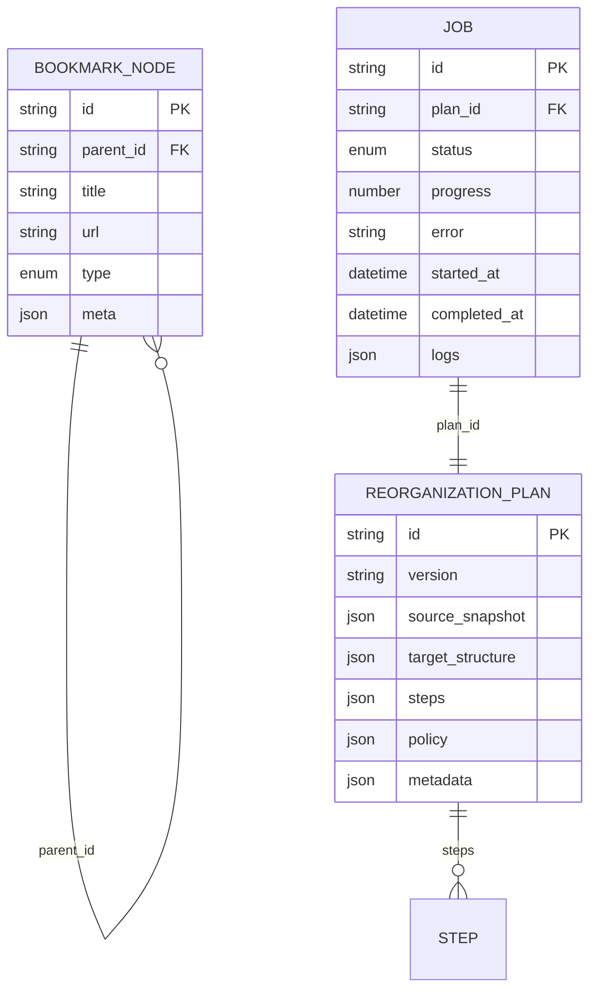
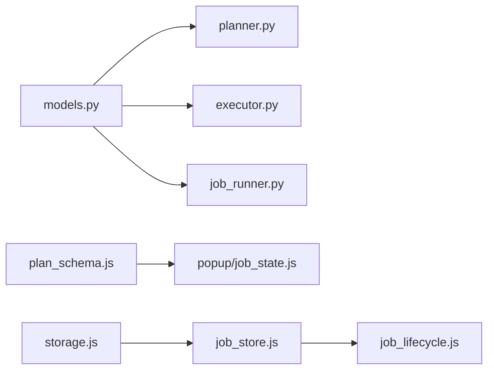

# 数据模型定义

<cite>
**本文引用的文件**   
- [src/bookmark_advisor/models.py](file://src/bookmark_advisor/models.py)
- [extension/shared/plan_schema.js](file://extension/shared/plan_schema.js)
- [extension/background/job_store.js](file://extension/background/job_store.js)
- [extension/background/job_lifecycle.js](file://extension/background/job_lifecycle.js)
- [extension/popup/job_state.js](file://extension/popup/job_state.js)
- [extension/shared/storage.js](file://extension/shared/storage.js)
- [extension/offscreen.js](file://extension/offscreen.js)
- [extension/service_worker.js](file://extension/service_worker.js)
- [tests/test_reorg_job.py](file://tests/test_reorg_job.py)
</cite>

## 目录
1. [简介](#简介)
2. [项目结构](#项目结构)
3. [核心组件](#核心组件)
4. [架构总览](#架构总览)
5. [详细组件分析](#详细组件分析)
6. [依赖关系分析](#依赖关系分析)
7. [性能考虑](#性能考虑)
8. [故障排查指南](#故障排查指南)
9. [结论](#结论)
10. [附录](#附录)

## 简介
本文件聚焦于“书签重组助手”的数据模型，系统性梳理并文档化以下关键数据结构：
- BookmarkNode（书签节点）
- ReorganizationPlan（重组计划）
- Job（任务）

内容覆盖字段含义、数据类型、约束与业务规则；实体间的主键/外键/继承/关联关系；序列化与反序列化的处理方式（含 JSON 转换与版本兼容）；数据验证与完整性检查机制；并提供实际示例与使用场景，帮助开发者正确使用这些数据结构。

## 项目结构
本项目包含 Python 后端逻辑与浏览器扩展前端两部分，数据模型在两端均有体现：
- Python 侧：以 Pydantic 模型为核心，承载领域模型、校验与序列化能力
- 扩展侧：以 JS 对象与 Schema 为中心，负责 UI 展示、消息协议与持久化

图表来源
- [src/bookmark_advisor/models.py](file://src/bookmark_advisor/models.py)
- [extension/shared/plan_schema.js](file://extension/shared/plan_schema.js)
- [extension/background/job_store.js](file://extension/background/job_store.js)
- [extension/background/job_lifecycle.js](file://extension/background/job_lifecycle.js)
- [extension/popup/job_state.js](file://extension/popup/job_state.js)
- [extension/shared/storage.js](file://extension/shared/storage.js)
- [extension/offscreen.js](file://extension/offscreen.js)
- [extension/service_worker.js](file://extension/service_worker.js)

章节来源
- [src/bookmark_advisor/models.py](file://src/bookmark_advisor/models.py)
- [extension/shared/plan_schema.js](file://extension/shared/plan_schema.js)
- [extension/background/job_store.js](file://extension/background/job_store.js)
- [extension/background/job_lifecycle.js](file://extension/background/job_lifecycle.js)
- [extension/popup/job_state.js](file://extension/popup/job_state.js)
- [extension/shared/storage.js](file://extension/shared/storage.js)
- [extension/offscreen.js](file://extension/offscreen.js)
- [extension/service_worker.js](file://extension/service_worker.js)

## 核心组件
本节概述三大核心数据模型及其职责边界：
- BookmarkNode：描述书签树中的单个节点，包括标识、层级关系、元数据等
- ReorganizationPlan：描述一次书签重组的完整计划，包含目标结构、步骤与策略
- Job：描述一次可执行的重组任务，包含状态机、执行上下文与结果

章节来源
- [src/bookmark_advisor/models.py](file://src/bookmark_advisor/models.py)
- [extension/shared/plan_schema.js](file://extension/shared/plan_schema.js)
- [extension/background/job_store.js](file://extension/background/job_store.js)

## 架构总览
下图展示了从“计划生成”到“任务执行”的数据流转，以及两端模型的映射关系。

图表来源
- [src/bookmark_advisor/models.py](file://src/bookmark_advisor/models.py)
- [extension/background/job_store.js](file://extension/background/job_store.js)
- [extension/popup/job_state.js](file://extension/popup/job_state.js)

## 详细组件分析

### BookmarkNode（书签节点）
- 角色与用途
  - 表示书签树中的一个节点，用于描述当前书签结构与目标结构的差异，作为重组计划的输入与中间产物
- 关键字段与语义
  - id：唯一标识符，通常由上游系统提供或内部生成
  - parent_id：父节点标识，根节点的父为 null
  - title：显示标题
  - url：链接地址（若为文件夹则为空）
  - type：节点类型（如“文件夹”、“链接”）
  - children：子节点列表（仅当类型为“文件夹”时有效）
  - meta：扩展元数据（如标签、备注等）
- 约束与业务规则
  - 树形结构无环：任意节点通过 parent_id 向上追溯不能回到自身
  - 父子关系一致性：所有非根节点的 parent_id 必须指向存在的父节点
  - 类型一致性：type 为“文件夹”时，children 应存在且为数组；type 为“链接”时，url 必填
- 主键/外键关系
  - 主键：id
  - 外键：parent_id 引用同集合中其他节点的 id
- 继承与多态
  - 通过 type 字段实现简单多态（文件夹 vs 链接），children 仅在文件夹类型下有效
- 序列化与版本兼容
  - JSON 序列化需保留 id、parent_id、title、url、type、children、meta
  - 新增字段时应向后兼容：旧客户端忽略未知字段；读取时需对缺失字段设置默认值
- 验证与完整性检查
  - 递归校验树无环
  - 校验 parent_id 存在性
  - 校验 type/url/children 的一致性
- 典型使用场景
  - 从浏览器书签导出后构建初始树
  - 作为重组计划的输入，计算差异并生成操作步骤

图表来源
- [src/bookmark_advisor/models.py](file://src/bookmark_advisor/models.py)

章节来源
- [src/bookmark_advisor/models.py](file://src/bookmark_advisor/models.py)

### ReorganizationPlan（重组计划）
- 角色与用途
  - 描述一次完整的书签重组方案，包括目标结构、迁移步骤、冲突处理策略等
- 关键字段与语义
  - id：计划唯一标识
  - version：计划格式版本，用于兼容性判断
  - source_snapshot：源书签快照引用（通常为 BookmarkNode 树的序列化）
  - target_structure：目标结构（可为 BookmarkNode 树或结构化描述）
  - steps：执行步骤列表（移动、重命名、合并、删除等）
  - policy：策略配置（冲突解决、回滚策略、幂等性要求）
  - metadata：附加信息（生成时间、作者、备注等）
- 约束与业务规则
  - 步骤顺序满足依赖：后续步骤不得破坏前置步骤的结果
  - 幂等性：重复应用同一计划不应产生副作用
  - 可回滚：每个步骤需提供反向操作或整体回滚路径
- 主键/外键关系
  - 主键：id
  - 关联：source_snapshot/target_structure 可能引用 BookmarkNode 树
- 继承与多态
  - steps 项可通过 type 字段区分不同操作类型（move/rename/merge/delete）
- 序列化与版本兼容
  - 明确声明 version 字段，读取时根据版本进行适配
  - 对可选字段提供默认值，确保旧版本能安全降级
- 验证与完整性检查
  - 校验步骤依赖图无环
  - 校验步骤参数合法性（如目标位置存在）
  - 校验策略配置合法
- 典型使用场景
  - AI 规划器输出重组建议
  - 用户手动编辑后的最终计划
  - 批量导入/导出的中间表示

图表来源
- [src/bookmark_advisor/models.py](file://src/bookmark_advisor/models.py)
- [extension/shared/plan_schema.js](file://extension/shared/plan_schema.js)

章节来源
- [src/bookmark_advisor/models.py](file://src/bookmark_advisor/models.py)
- [extension/shared/plan_schema.js](file://extension/shared/plan_schema.js)

### Job（任务）
- 角色与用途
  - 描述一次具体的重组任务实例，承载执行状态、进度、错误信息与审计日志
- 关键字段与语义
  - id：任务唯一标识
  - plan_id：关联的重组计划 id
  - status：任务状态（待执行、执行中、成功、失败、已取消）
  - progress：进度（百分比或步数计数）
  - error：错误信息（失败时记录）
  - started_at/completed_at：时间戳
  - logs：执行日志摘要
- 约束与业务规则
  - 状态机严格：状态转换必须符合预定义转移表
  - 幂等重试：支持按 id 重试且保证结果一致
  - 超时与取消：支持外部取消与超时终止
- 主键/外键关系
  - 主键：id
  - 外键：plan_id 关联 ReorganizationPlan.id
- 继承与多态
  - 可通过 type 区分不同任务类型（如“全量重组”、“增量同步”）
- 序列化与版本兼容
  - 持久化前进行规范化（去除临时字段、统一时间格式）
  - 读取时对缺失字段设置默认值
- 验证与完整性检查
  - 校验 plan_id 存在
  - 校验状态转换合法性
  - 校验时间戳先后顺序
- 典型使用场景
  - 后台异步执行重组计划
  - UI 实时展示任务进度与结果
  - 历史任务查询与审计

图表来源
- [extension/background/job_store.js](file://extension/background/job_store.js)
- [extension/background/job_lifecycle.js](file://extension/background/job_lifecycle.js)
- [extension/popup/job_state.js](file://extension/popup/job_state.js)

章节来源
- [extension/background/job_store.js](file://extension/background/job_store.js)
- [extension/background/job_lifecycle.js](file://extension/background/job_lifecycle.js)
- [extension/popup/job_state.js](file://extension/popup/job_state.js)

### 数据关系与依赖
- 主键/外键
  - BookmarkNode.id 为主键；BookmarkNode.parent_id 为自引用外键
  - Job.plan_id 外键关联 ReorganizationPlan.id
- 关联关系
  - ReorganizationPlan 包含多个 Step，并引用 BookmarkNode 树
  - Job 关联一个 ReorganizationPlan，并在执行过程中产生日志
- 继承/多态
  - BookmarkNode.type 决定节点行为
  - Step.type 决定具体操作类型
  - Job.type 决定任务类型

图表来源
- [src/bookmark_advisor/models.py](file://src/bookmark_advisor/models.py)
- [extension/shared/plan_schema.js](file://extension/shared/plan_schema.js)
- [extension/background/job_store.js](file://extension/background/job_store.js)

章节来源
- [src/bookmark_advisor/models.py](file://src/bookmark_advisor/models.py)
- [extension/shared/plan_schema.js](file://extension/shared/plan_schema.js)
- [extension/background/job_store.js](file://extension/background/job_store.js)

## 依赖关系分析
- 模块耦合
  - models.py 被 planner/executor/job_runner 等模块消费，承担领域模型职责
  - 扩展端的 plan_schema.js 与 job_store.js 分别对应计划与任务的持久化与交互
- 外部依赖
  - 浏览器书签 API（用于读写真实书签）
  - 本地存储（IndexedDB/LocalStorage）用于持久化 Job 与 Plan
- 潜在循环依赖
  - 应避免 Job 直接依赖 BookmarkNode 的修改方法，改为通过 Plan 与 Executor 间接操作

图表来源
- [src/bookmark_advisor/models.py](file://src/bookmark_advisor/models.py)
- [extension/shared/plan_schema.js](file://extension/shared/plan_schema.js)
- [extension/background/job_store.js](file://extension/background/job_store.js)
- [extension/background/job_lifecycle.js](file://extension/background/job_lifecycle.js)
- [extension/popup/job_state.js](file://extension/popup/job_state.js)
- [extension/shared/storage.js](file://extension/shared/storage.js)

章节来源
- [src/bookmark_advisor/models.py](file://src/bookmark_advisor/models.py)
- [extension/shared/plan_schema.js](file://extension/shared/plan_schema.js)
- [extension/background/job_store.js](file://extension/background/job_store.js)
- [extension/background/job_lifecycle.js](file://extension/background/job_lifecycle.js)
- [extension/popup/job_state.js](file://extension/popup/job_state.js)
- [extension/shared/storage.js](file://extension/shared/storage.js)

## 性能考虑
- 大树的序列化与传输
  - 对 BookmarkNode 树进行分页或增量传输，避免一次性加载全部节点
- 计划校验复杂度
  - 步骤依赖图的环检测采用拓扑排序，时间复杂度 O(V+E)
- 任务状态更新
  - 使用批处理与去抖动减少频繁写入
- 索引与查询
  - 对 Job 的 plan_id、status 建立索引以提升查询效率

[本节为通用指导，不直接分析具体文件]

## 故障排查指南
- 常见错误
  - 树结构环检测失败：检查 parent_id 链是否形成环
  - 状态转换非法：确认状态机转移是否符合定义
  - 版本不兼容：读取旧版 Plan/Job 时未设置默认字段导致解析失败
- 定位手段
  - 查看 Job.logs 获取最近错误堆栈
  - 对比 Plan.version 与期望版本，必要时进行迁移
- 恢复策略
  - 基于 Plan 的幂等性与回滚策略进行重试或撤销

章节来源
- [extension/background/job_lifecycle.js](file://extension/background/job_lifecycle.js)
- [extension/popup/job_state.js](file://extension/popup/job_state.js)
- [tests/test_reorg_job.py](file://tests/test_reorg_job.py)

## 结论
通过对 BookmarkNode、ReorganizationPlan、Job 三大核心数据模型的系统化梳理，明确了其字段语义、约束规则、关系建模与序列化策略。结合状态机与幂等设计，可在复杂重组场景中保证一致性与可恢复性。建议在后续迭代中持续完善版本迁移与兼容性测试，提升系统的健壮性与可维护性。

[本节为总结性内容，不直接分析具体文件]

## 附录

### 字段规范与约束清单
- BookmarkNode
  - id：必填，全局唯一
  - parent_id：可选，若存在则必须指向有效父节点
  - title：必填
  - url：当 type=链接 时必填
  - type：枚举，取值受限于“文件夹/链接”
  - children：当 type=文件夹 时必填且为数组
  - meta：可选，自由扩展
- ReorganizationPlan
  - id：必填，全局唯一
  - version：必填，字符串版本号
  - source_snapshot/target_structure：必填，BookmarkNode 树
  - steps：必填，非空数组，每项包含 type/params/depends_on
  - policy：必填，包含冲突解决与回滚策略
  - metadata：可选
- Job
  - id：必填，全局唯一
  - plan_id：必填，存在对应 Plan
  - status：必填，符合状态机
  - progress：可选，数值范围 0-100
  - error：可选，失败时填写
  - started_at/completed_at：可选，ISO 时间字符串
  - logs：可选，数组或对象

章节来源
- [src/bookmark_advisor/models.py](file://src/bookmark_advisor/models.py)
- [extension/shared/plan_schema.js](file://extension/shared/plan_schema.js)
- [extension/background/job_store.js](file://extension/background/job_store.js)

### 序列化与反序列化要点
- JSON 字段命名与类型稳定，新增字段需向后兼容
- 时间字段统一为 ISO 8601
- 对缺失字段设置合理默认值
- 在读取时进行最小化校验，拒绝非法结构

章节来源
- [extension/shared/plan_schema.js](file://extension/shared/plan_schema.js)
- [extension/shared/storage.js](file://extension/shared/storage.js)
- [extension/offscreen.js](file://extension/offscreen.js)
- [extension/service_worker.js](file://extension/service_worker.js)

### 数据示例与使用场景
- 示例一：从浏览器导出书签，构建 BookmarkNode 树，生成 ReorganizationPlan，并创建 Job 执行
- 示例二：用户在前端调整计划后，重新序列化并提交执行
- 示例三：任务失败后，依据 Job.logs 与 Plan 的回滚策略进行恢复

章节来源
- [tests/test_reorg_job.py](file://tests/test_reorg_job.py)
- [extension/popup/job_state.js](file://extension/popup/job_state.js)
- [extension/background/job_lifecycle.js](file://extension/background/job_lifecycle.js)