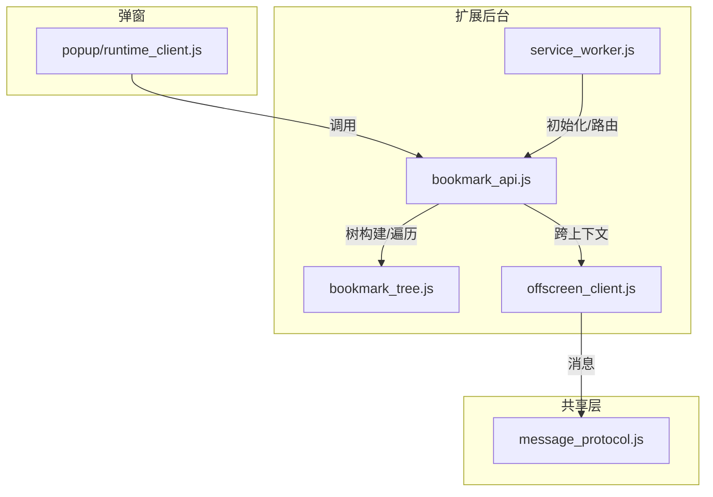
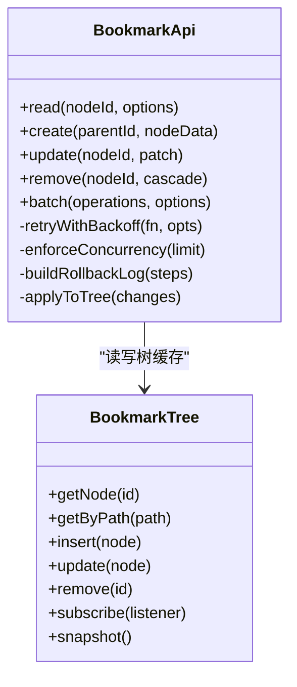
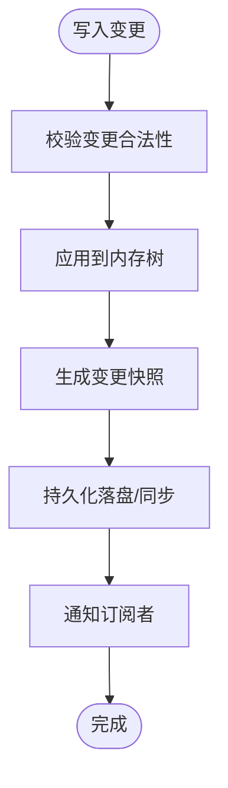
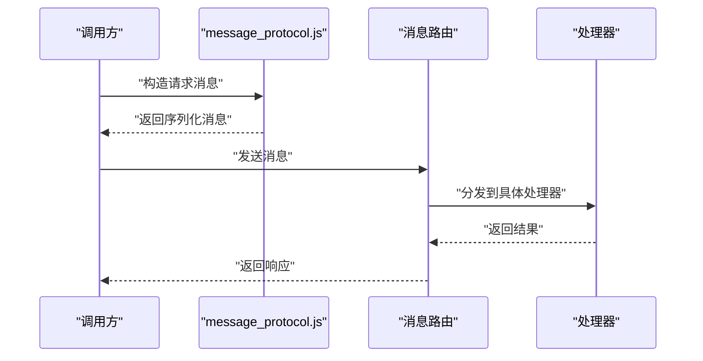
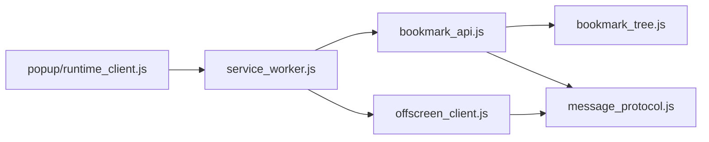

# 书签 API 封装层

<cite>
**本文引用的文件**   
- [extension/background/bookmark_api.js](file://extension/background/bookmark_api.js)
- [extension/background/bookmark_tree.js](file://extension/background/bookmark_tree.js)
- [extension/shared/message_protocol.js](file://extension/shared/message_protocol.js)
- [extension/offscreen_client.js](file://extension/offscreen_client.js)
- [extension/service_worker.js](file://extension/service_worker.js)
- [extension/popup/runtime_client.js](file://extension/popup/runtime_client.js)
- [tests/test_extension_bookmark_tree.py](file://tests/test_extension_bookmark_tree.py)
</cite>

## 目录
1. [简介](#简介)
2. [项目结构](#项目结构)
3. [核心组件](#核心组件)
4. [架构总览](#架构总览)
5. [详细组件分析](#详细组件分析)
6. [依赖分析](#依赖分析)
7. [性能考虑](#性能考虑)
8. [故障排查指南](#故障排查指南)
9. [结论](#结论)
10. [附录：API 使用示例](#附录api-使用示例)

## 简介
本文件面向“书签 API 封装层”，系统化梳理对浏览器原生书签 API 的抽象与增强实现，重点覆盖以下方面：
- 异步操作封装、错误处理与重试机制
- 统一接口设计：读取、创建、更新、删除（CRUD）
- 批量操作的优化策略：并发控制与事务保证
- 与消息协议的集成：跨上下文通信与数据序列化
- 完整 API 使用示例：基本操作与高级用法
- 性能优化建议与最佳实践

## 项目结构
围绕书签 API 的关键代码分布在扩展后台脚本、共享协议与弹窗运行时客户端中。下图给出与书签 API 相关的模块关系概览。



图表来源
- [extension/background/bookmark_api.js](file://extension/background/bookmark_api.js)
- [extension/background/bookmark_tree.js](file://extension/background/bookmark_tree.js)
- [extension/shared/message_protocol.js](file://extension/shared/message_protocol.js)
- [extension/offscreen_client.js](file://extension/offscreen_client.js)
- [extension/service_worker.js](file://extension/service_worker.js)
- [extension/popup/runtime_client.js](file://extension/popup/runtime_client.js)

章节来源
- [extension/background/bookmark_api.js](file://extension/background/bookmark_api.js)
- [extension/background/bookmark_tree.js](file://extension/background/bookmark_tree.js)
- [extension/shared/message_protocol.js](file://extension/shared/message_protocol.js)
- [extension/offscreen_client.js](file://extension/offscreen_client.js)
- [extension/service_worker.js](file://extension/service_worker.js)
- [extension/popup/runtime_client.js](file://extension/popup/runtime_client.js)

## 核心组件
- 书签 API 封装层（bookmark_api.js）
  - 职责：对外暴露统一的 CRUD 接口；封装浏览器原生书签 API 的异步调用；提供错误处理、重试与幂等保障；协调批量操作与事务语义。
  - 关键能力：
    - 统一接口：read、create、update、remove、batch
    - 异步封装：将 Promise 化与回调式 API 统一为一致的异步模型
    - 错误处理：分类错误码、可恢复错误自动重试、不可恢复错误快速失败
    - 批量优化：并发上限、顺序/乱序执行、事务边界、回滚日志
- 书签树（bookmark_tree.js）
  - 职责：维护内存中的书签树视图，支持高效查询、路径解析、增量同步与变更合并。
  - 关键能力：
    - 树形结构缓存与懒加载
    - 基于 ID/路径的定位与导航
    - 变更事件与订阅
- 消息协议（message_protocol.js）
  - 职责：定义跨上下文（Service Worker、Offscreen、Popup）的消息契约、类型与序列化规则。
  - 关键能力：
    - 请求/响应模式与超时控制
    - 结构化消息体与校验
    - 错误码映射与诊断信息
- Offscreen 客户端（offscreen_client.js）
  - 职责：在 Offscreen 文档中桥接浏览器书签 API，向 Service Worker 转发请求并返回结果。
  - 关键能力：
    - 生命周期管理
    - 消息路由与重试
    - 资源隔离与权限最小化
- 服务工作者（service_worker.js）
  - 职责：扩展入口，注册消息路由、初始化书签 API 封装层、协调各子模块。
- 弹窗运行时客户端（popup/runtime_client.js）
  - 职责：为 UI 侧提供简洁的调用入口，屏蔽底层消息细节。

章节来源
- [extension/background/bookmark_api.js](file://extension/background/bookmark_api.js)
- [extension/background/bookmark_tree.js](file://extension/background/bookmark_tree.js)
- [extension/shared/message_protocol.js](file://extension/shared/message_protocol.js)
- [extension/offscreen_client.js](file://extension/offscreen_client.js)
- [extension/service_worker.js](file://extension/service_worker.js)
- [extension/popup/runtime_client.js](file://extension/popup/runtime_client.js)

## 架构总览
下图展示从 UI 到浏览器书签 API 的端到端调用链路与关键交互点。

```mermaid
sequenceDiagram
participant UI as "弹窗 runtime_client.js"
participant SW as "service_worker.js"
participant API as "bookmark_api.js"
participant TREE as "bookmark_tree.js"
participant OFF as "offscreen_client.js"
participant MSG as "message_protocol.js"
participant BK as "浏览器书签 API"
UI->>SW : "发送书签操作消息"
SW->>API : "路由到书签 API 封装层"
API->>TREE : "读取/更新树缓存"
API->>OFF : "发起跨上下文请求"
OFF->>MSG : "构造/校验消息体"
MSG-->>OFF : "返回序列化后的消息"
OFF->>BK : "调用浏览器书签 API"
BK-->>OFF : "返回结果或错误"
OFF-->>API : "反序列化为统一结果"
API-->>SW : "返回业务结果"
SW-->>UI : "响应 UI 请求"
```

图表来源
- [extension/popup/runtime_client.js](file://extension/popup/runtime_client.js)
- [extension/service_worker.js](file://extension/service_worker.js)
- [extension/background/bookmark_api.js](file://extension/background/bookmark_api.js)
- [extension/background/bookmark_tree.js](file://extension/background/bookmark_tree.js)
- [extension/offscreen_client.js](file://extension/offscreen_client.js)
- [extension/shared/message_protocol.js](file://extension/shared/message_protocol.js)

## 详细组件分析

### 书签 API 封装层（bookmark_api.js）
- 统一接口设计
  - read：按节点 ID 或路径读取节点及子树，支持分页与深度限制
  - create：在指定父节点下创建新节点，支持批量创建
  - update：更新节点属性（标题、URL、位置等），支持部分更新
  - remove：删除节点及其子树，支持级联清理
  - batch：批量执行一组操作，提供事务语义与回滚日志
- 异步封装与错误处理
  - 将浏览器 API 的 Promise 化调用统一为一致的异步模型
  - 错误分类：网络/权限/状态不一致/数据校验等
  - 重试策略：指数退避、最大重试次数、可恢复错误判定
- 批量操作与事务保证
  - 并发控制：通过令牌桶或信号量限制并发度
  - 事务边界：提交前预检、提交后一致性校验
  - 回滚日志：记录每一步变更，失败时按逆序撤销
- 与树缓存协同
  - 写操作后触发增量更新，保持内存树与持久存储一致
  - 读操作优先命中缓存，必要时触发懒加载与增量同步



图表来源
- [extension/background/bookmark_api.js](file://extension/background/bookmark_api.js)
- [extension/background/bookmark_tree.js](file://extension/background/bookmark_tree.js)

章节来源
- [extension/background/bookmark_api.js](file://extension/background/bookmark_api.js)
- [extension/background/bookmark_tree.js](file://extension/background/bookmark_tree.js)

### 书签树（bookmark_tree.js）
- 数据结构与复杂度
  - 以邻接表+哈希索引维护父子关系，节点查找 O(1)，路径解析 O(h)（h 为树高）
  - 变更采用增量合并，避免全量重建
- 并发安全
  - 写操作串行化，读操作无锁访问快照
- 事件与订阅
  - 发布订阅模型，监听插入、更新、删除事件，供上层缓存与 UI 刷新



图表来源
- [extension/background/bookmark_tree.js](file://extension/background/bookmark_tree.js)

章节来源
- [extension/background/bookmark_tree.js](file://extension/background/bookmark_tree.js)

### 消息协议（message_protocol.js）
- 消息契约
  - 请求体：包含操作类型、目标对象、参数与可选的事务 ID
  - 响应体：包含成功标志、数据载荷、错误码与诊断信息
- 序列化与校验
  - 严格类型约束，缺失字段拒绝
  - 大对象分片传输与压缩（可选）
- 超时与重试
  - 请求级超时配置
  - 服务端错误码映射至客户端重试策略



图表来源
- [extension/shared/message_protocol.js](file://extension/shared/message_protocol.js)

章节来源
- [extension/shared/message_protocol.js](file://extension/shared/message_protocol.js)

### Offscreen 客户端（offscreen_client.js）
- 职责与生命周期
  - 启动/关闭 Offscreen 文档
  - 维持长连接与心跳
- 跨上下文通信
  - 将 Service Worker 的请求转发至 Offscreen，再调用浏览器书签 API
  - 错误透传与重试
- 资源与权限
  - 按需启用，最小权限原则

```mermaid
sequenceDiagram
participant SW as "service_worker.js"
participant OFF as "offscreen_client.js"
participant BK as "浏览器书签 API"
SW->>OFF : "书签操作请求"
OFF->>BK : "调用原生 API"
BK-->>OFF : "返回结果"
OFF-->>SW : "转发结果"
```

图表来源
- [extension/offscreen_client.js](file://extension/offscreen_client.js)

章节来源
- [extension/offscreen_client.js](file://extension/offscreen_client.js)

### 服务工作者（service_worker.js）
- 作为扩展入口，负责：
  - 初始化书签 API 封装层
  - 注册消息路由与中间件
  - 协调 Offscreen 与弹窗客户端

章节来源
- [extension/service_worker.js](file://extension/service_worker.js)

### 弹窗运行时客户端（popup/runtime_client.js）
- 为 UI 提供简洁 API，屏蔽消息细节
- 支持本地缓存与乐观更新

章节来源
- [extension/popup/runtime_client.js](file://extension/popup/runtime_client.js)

## 依赖分析
- 组件耦合
  - bookmark_api.js 强依赖 bookmark_tree.js 与 message_protocol.js
  - offscreen_client.js 依赖 message_protocol.js 与浏览器书签 API
  - service_worker.js 聚合各模块并提供路由
- 外部依赖
  - 浏览器书签 API（通过 Offscreen 间接调用）
  - 扩展消息系统（runtime.sendMessage/onMessage）



图表来源
- [extension/background/bookmark_api.js](file://extension/background/bookmark_api.js)
- [extension/background/bookmark_tree.js](file://extension/background/bookmark_tree.js)
- [extension/shared/message_protocol.js](file://extension/shared/message_protocol.js)
- [extension/offscreen_client.js](file://extension/offscreen_client.js)
- [extension/service_worker.js](file://extension/service_worker.js)
- [extension/popup/runtime_client.js](file://extension/popup/runtime_client.js)

章节来源
- [extension/background/bookmark_api.js](file://extension/background/bookmark_api.js)
- [extension/background/bookmark_tree.js](file://extension/background/bookmark_tree.js)
- [extension/shared/message_protocol.js](file://extension/shared/message_protocol.js)
- [extension/offscreen_client.js](file://extension/offscreen_client.js)
- [extension/service_worker.js](file://extension/service_worker.js)
- [extension/popup/runtime_client.js](file://extension/popup/runtime_client.js)

## 性能考虑
- 批量操作
  - 合理设置并发上限，避免阻塞主线程
  - 使用事务边界减少重复 I/O
- 缓存与懒加载
  - 读多写少场景优先命中内存树
  - 大子树按需加载，避免一次性拉取
- 重试与退避
  - 针对瞬时错误采用指数退避，避免雪崩
- 序列化开销
  - 大对象分片传输，必要时启用压缩
- 树结构优化
  - 路径解析缓存，减少重复计算
  - 变更合并，降低树重建频率

[本节为通用指导，不直接分析具体文件]

## 故障排查指南
- 常见问题定位
  - 消息超时：检查 message_protocol.js 的超时配置与路由链路
  - 权限不足：确认 Offscreen 是否具备书签访问权限
  - 树不一致：比对内存树快照与持久化数据，检查事务回滚日志
- 调试手段
  - 开启详细日志，记录请求/响应与错误码
  - 使用单元测试验证关键路径
- 参考测试用例
  - 书签树行为与边界条件验证

章节来源
- [extension/shared/message_protocol.js](file://extension/shared/message_protocol.js)
- [extension/offscreen_client.js](file://extension/offscreen_client.js)
- [tests/test_extension_bookmark_tree.py](file://tests/test_extension_bookmark_tree.py)

## 结论
本封装层通过对浏览器原生书签 API 的统一抽象、完善的异步与错误处理、以及高效的批量与事务机制，显著提升了扩展在书签操作上的稳定性与性能。结合消息协议与 Offscreen 的跨上下文通信，实现了清晰的职责分离与可扩展的架构。

[本节为总结性内容，不直接分析具体文件]

## 附录：API 使用示例
以下为常见用法指引（不含具体代码，仅说明调用方式与要点）：

- 基本操作
  - 读取节点：传入节点 ID 或路径，获取节点详情与子节点列表
  - 创建节点：指定父节点与节点数据，返回新节点 ID
  - 更新节点：传入节点 ID 与补丁对象，仅更新指定字段
  - 删除节点：传入节点 ID，可选择级联删除子树
- 批量操作
  - 使用 batch 接口传入操作数组，设置并发上限与事务选项
  - 失败时根据回滚日志进行撤销，确保最终一致性
- 高级用法
  - 订阅树变更事件，实现 UI 实时刷新
  - 使用懒加载与分页，处理大型书签树
  - 自定义重试策略与错误处理逻辑

章节来源
- [extension/background/bookmark_api.js](file://extension/background/bookmark_api.js)
- [extension/background/bookmark_tree.js](file://extension/background/bookmark_tree.js)
- [extension/shared/message_protocol.js](file://extension/shared/message_protocol.js)
- [extension/offscreen_client.js](file://extension/offscreen_client.js)
- [extension/popup/runtime_client.js](file://extension/popup/runtime_client.js)