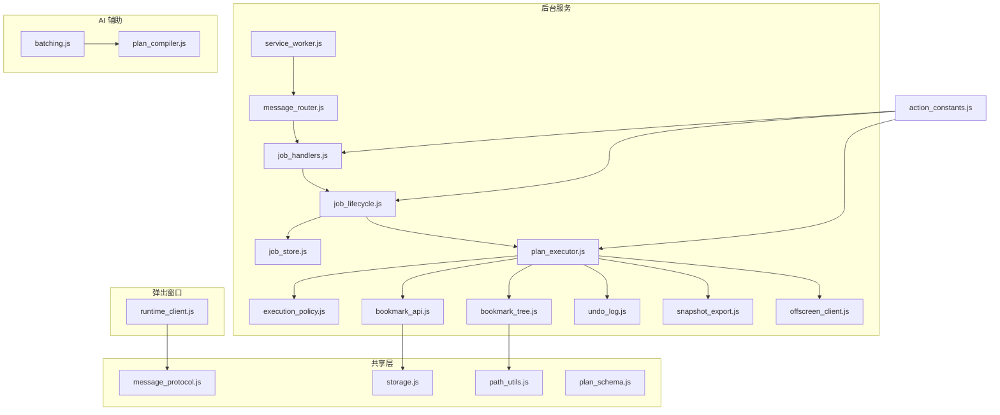
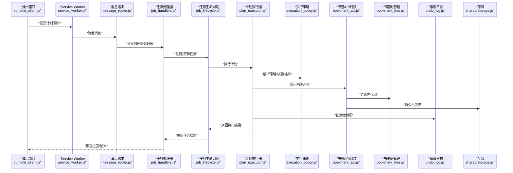
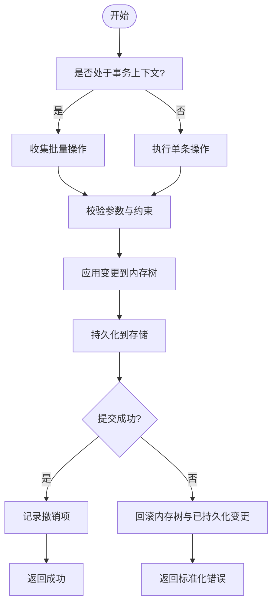
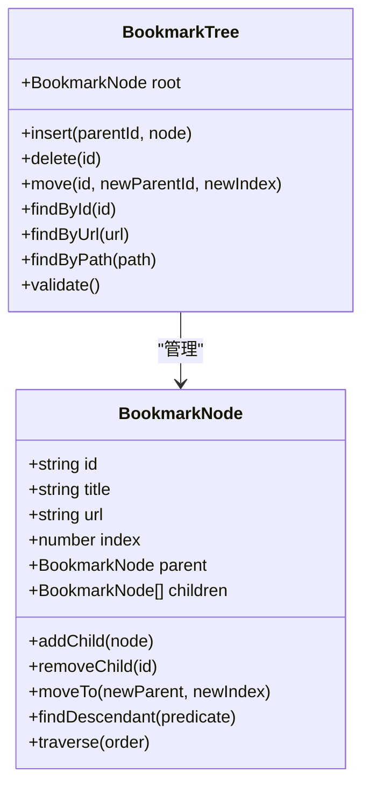
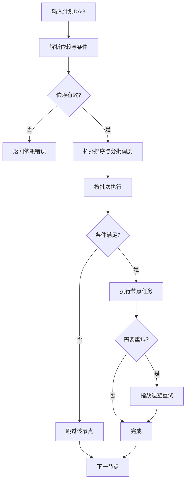
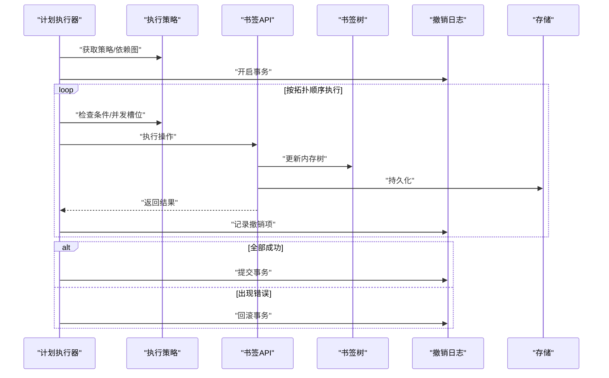
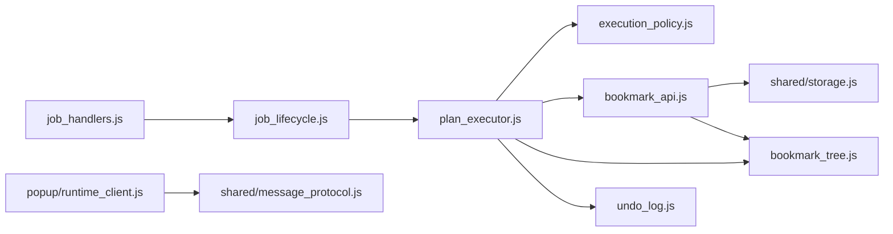

# 书签操作核心

<cite>
**本文引用的文件**   
- [extension/background/bookmark_api.js](file://extension/background/bookmark_api.js)
- [extension/background/bookmark_tree.js](file://extension/background/bookmark_tree.js)
- [extension/background/execution_policy.js](file://extension/background/execution_policy.js)
- [extension/background/plan_executor.js](file://extension/background/plan_executor.js)
- [extension/action_constants.js](file://extension/action_constants.js)
- [extension/shared/message_protocol.js](file://extension/shared/message_protocol.js)
- [extension/shared/storage.js](file://extension/shared/storage.js)
- [extension/offscreen_client.js](file://extension/offscreen_client.js)
- [extension/service_worker.js](file://extension/service_worker.js)
- [extension/popup/runtime_client.js](file://extension/popup/runtime_client.js)
- [extension/background/undo_log.js](file://extension/background/undo_log.js)
- [extension/background/snapshot_export.js](file://extension/background/snapshot_export.js)
- [extension/background/job_handlers.js](file://extension/background/job_handlers.js)
- [extension/background/job_lifecycle.js](file://extension/background/job_lifecycle.js)
- [extension/background/job_store.js](file://extension/background/job_store.js)
- [extension/background/message_router.js](file://extension/background/message_router.js)
- [extension/shared/path_utils.js](file://extension/shared/path_utils.js)
- [extension/shared/plan_schema.js](file://extension/shared/plan_schema.js)
- [extension/ai/batching.js](file://extension/ai/batching.js)
- [extension/ai/plan_compiler.js](file://extension/ai/plan_compiler.js)
- [tests/test_extension_bookmark_tree.py](file://tests/test_extension_bookmark_tree.py)
- [tests/test_extension_execution_policy.py](file://tests/test_extension_execution_policy.py)
- [tests/test_extension_plan_executor_module.py](file://tests/test_extension_plan_executor_module.py)
</cite>

## 目录
1. [简介](#简介)
2. [项目结构](#项目结构)
3. [核心组件](#核心组件)
4. [架构总览](#架构总览)
5. [详细组件分析](#详细组件分析)
6. [依赖关系分析](#依赖关系分析)
7. [性能考虑](#性能考虑)
8. [故障排查指南](#故障排查指南)
9. [结论](#结论)
10. [附录](#附录)

## 简介
本文件聚焦于“书签操作核心”的设计与实现，围绕以下目标展开：
- 封装浏览器原生书签 API，提供稳定、可测试的抽象层与增强能力。
- 管理书签树结构，支持节点遍历、查找、插入、删除与移动等基础操作。
- 设计批量操作引擎，提供事务处理、原子性保证与错误恢复机制。
- 配置并执行执行策略，包括条件判断、依赖解析与并行执行。
- 统一管理动作类型、状态码与错误信息。
- 给出从简单单操作到复杂批量重组的完整示例路径。
- 总结性能优化技巧与最佳实践。

## 项目结构
本项目采用分层组织方式：
- background 层负责与浏览器书签 API 交互、计划执行、撤销日志、快照导出、任务生命周期与存储等。
- shared 层提供跨模块共享协议、存储与工具函数。
- popup 层提供运行时客户端以驱动 UI 侧交互。
- ai 层提供批量化与计划编译等辅助能力。
- tests 层覆盖关键模块行为与契约。

图表来源
- [extension/service_worker.js](file://extension/service_worker.js)
- [extension/background/message_router.js](file://extension/background/message_router.js)
- [extension/background/job_handlers.js](file://extension/background/job_handlers.js)
- [extension/background/job_lifecycle.js](file://extension/background/job_lifecycle.js)
- [extension/background/job_store.js](file://extension/background/job_store.js)
- [extension/background/plan_executor.js](file://extension/background/plan_executor.js)
- [extension/background/execution_policy.js](file://extension/background/execution_policy.js)
- [extension/background/bookmark_api.js](file://extension/background/bookmark_api.js)
- [extension/background/bookmark_tree.js](file://extension/background/bookmark_tree.js)
- [extension/background/undo_log.js](file://extension/background/undo_log.js)
- [extension/background/snapshot_export.js](file://extension/background/snapshot_export.js)
- [extension/offscreen_client.js](file://extension/offscreen_client.js)
- [extension/shared/message_protocol.js](file://extension/shared/message_protocol.js)
- [extension/shared/storage.js](file://extension/shared/storage.js)
- [extension/shared/path_utils.js](file://extension/shared/path_utils.js)
- [extension/shared/plan_schema.js](file://extension/shared/plan_schema.js)
- [extension/popup/runtime_client.js](file://extension/popup/runtime_client.js)
- [extension/ai/batching.js](file://extension/ai/batching.js)
- [extension/ai/plan_compiler.js](file://extension/ai/plan_compiler.js)
- [extension/action_constants.js](file://extension/action_constants.js)

章节来源
- [extension/service_worker.js](file://extension/service_worker.js)
- [extension/background/message_router.js](file://extension/background/message_router.js)
- [extension/background/job_handlers.js](file://extension/background/job_handlers.js)
- [extension/background/job_lifecycle.js](file://extension/background/job_lifecycle.js)
- [extension/background/job_store.js](file://extension/background/job_store.js)
- [extension/background/plan_executor.js](file://extension/background/plan_executor.js)
- [extension/background/execution_policy.js](file://extension/background/execution_policy.js)
- [extension/background/bookmark_api.js](file://extension/background/bookmark_api.js)
- [extension/background/bookmark_tree.js](file://extension/background/bookmark_tree.js)
- [extension/background/undo_log.js](file://extension/background/undo_log.js)
- [extension/background/snapshot_export.js](file://extension/background/snapshot_export.js)
- [extension/offscreen_client.js](file://extension/offscreen_client.js)
- [extension/shared/message_protocol.js](file://extension/shared/message_protocol.js)
- [extension/shared/storage.js](file://extension/shared/storage.js)
- [extension/shared/path_utils.js](file://extension/shared/path_utils.js)
- [extension/shared/plan_schema.js](file://extension/shared/plan_schema.js)
- [extension/popup/runtime_client.js](file://extension/popup/runtime_client.js)
- [extension/ai/batching.js](file://extension/ai/batching.js)
- [extension/ai/plan_compiler.js](file://extension/ai/plan_compiler.js)
- [extension/action_constants.js](file://extension/action_constants.js)

## 核心组件
本节概述与书签操作直接相关的核心模块及其职责边界。

- 书签 API 封装（bookmark_api.js）
  - 对浏览器原生书签 API 进行统一封装，屏蔽差异并提供重试、超时与错误归一化。
  - 暴露增删改查、批量写入、事务边界控制等接口。
- 书签树管理（bookmark_tree.js）
  - 维护内存中的书签树视图，提供遍历、查找、插入、删除、移动等操作。
  - 与持久化层解耦，便于单元测试与回放。
- 执行策略（execution_policy.js）
  - 定义条件判断、依赖解析与并行度控制策略。
  - 支持按条件跳过、按依赖顺序执行与并发限制。
- 计划执行器（plan_executor.js）
  - 将高层计划分解为可执行步骤，协调策略、API 与撤销日志。
  - 提供事务语义、原子提交与失败回滚。
- 常量与协议（action_constants.js, message_protocol.js, plan_schema.js）
  - 集中定义动作类型、状态码、错误信息与消息协议字段。
  - 确保前后端一致性与可维护性。
- 撤销与快照（undo_log.js, snapshot_export.js）
  - 记录操作历史，支持撤销/重做；导出/导入书签快照用于备份与迁移。
- 任务编排（job_handlers.js, job_lifecycle.js, job_store.js）
  - 接收外部请求，创建任务、调度执行、持久化状态与结果。
- 运行时客户端（popup/runtime_client.js）
  - 面向 UI 的轻量客户端，发送计划、查询状态、订阅事件。
- 离屏客户端（offscreen_client.js）
  - 在离屏页面中执行耗时或受限操作，降低主线程压力。

章节来源
- [extension/background/bookmark_api.js](file://extension/background/bookmark_api.js)
- [extension/background/bookmark_tree.js](file://extension/background/bookmark_tree.js)
- [extension/background/execution_policy.js](file://extension/background/execution_policy.js)
- [extension/background/plan_executor.js](file://extension/background/plan_executor.js)
- [extension/action_constants.js](file://extension/action_constants.js)
- [extension/shared/message_protocol.js](file://extension/shared/message_protocol.js)
- [extension/shared/plan_schema.js](file://extension/shared/plan_schema.js)
- [extension/background/undo_log.js](file://extension/background/undo_log.js)
- [extension/background/snapshot_export.js](file://extension/background/snapshot_export.js)
- [extension/background/job_handlers.js](file://extension/background/job_handlers.js)
- [extension/background/job_lifecycle.js](file://extension/background/job_lifecycle.js)
- [extension/background/job_store.js](file://extension/background/job_store.js)
- [extension/popup/runtime_client.js](file://extension/popup/runtime_client.js)
- [extension/offscreen_client.js](file://extension/offscreen_client.js)

## 架构总览
下图展示了从 UI 发起计划到后台执行、落盘与撤销记录的端到端流程。

图表来源
- [extension/popup/runtime_client.js](file://extension/popup/runtime_client.js)
- [extension/service_worker.js](file://extension/service_worker.js)
- [extension/background/message_router.js](file://extension/background/message_router.js)
- [extension/background/job_handlers.js](file://extension/background/job_handlers.js)
- [extension/background/job_lifecycle.js](file://extension/background/job_lifecycle.js)
- [extension/background/plan_executor.js](file://extension/background/plan_executor.js)
- [extension/background/execution_policy.js](file://extension/background/execution_policy.js)
- [extension/background/bookmark_api.js](file://extension/background/bookmark_api.js)
- [extension/background/bookmark_tree.js](file://extension/background/bookmark_tree.js)
- [extension/background/undo_log.js](file://extension/background/undo_log.js)
- [extension/shared/storage.js](file://extension/shared/storage.js)

## 详细组件分析

### 书签 API 封装（bookmark_api.js）
- 设计要点
  - 对浏览器原生 API 进行统一封装，屏蔽版本差异与异常细节。
  - 提供重试与退避策略，提升稳定性。
  - 暴露事务接口，支持多步操作的原子提交与回滚。
  - 与存储层（storage.js）协作，确保变更持久化。
- 关键能力
  - 读取/写入书签元数据与层级关系。
  - 批量写入时合并相邻操作以减少 IO。
  - 错误归一化，输出标准状态码与错误信息。
- 与书签树的关系
  - 在执行成功后同步更新内存树，保持一致性。
- 典型调用链
  - 计划执行器 -> 书签 API -> 书签树 -> 存储 -> 撤销日志

图表来源
- [extension/background/bookmark_api.js](file://extension/background/bookmark_api.js)
- [extension/background/bookmark_tree.js](file://extension/background/bookmark_tree.js)
- [extension/shared/storage.js](file://extension/shared/storage.js)
- [extension/background/undo_log.js](file://extension/background/undo_log.js)

章节来源
- [extension/background/bookmark_api.js](file://extension/background/bookmark_api.js)
- [extension/shared/storage.js](file://extension/shared/storage.js)
- [extension/background/undo_log.js](file://extension/background/undo_log.js)

### 书签树管理（bookmark_tree.js）
- 数据结构
  - 根节点包含若干子节点，每个节点具备唯一标识、标题、URL、位置索引与父引用。
  - 使用邻接表+索引结构，支持快速查找与路径计算。
- 核心操作
  - 遍历：深度优先/广度优先，支持过滤与映射。
  - 查找：按 ID、URL、路径匹配，支持模糊搜索。
  - 插入：在指定父节点下按索引插入，自动调整后续索引。
  - 删除：级联删除子树，回收索引。
  - 移动：在同一父节点内交换位置或跨父节点迁移，保持索引连续。
- 一致性保障
  - 所有写操作后触发内部校验，确保无环、索引合法、父子关系正确。
- 复杂度分析
  - 查找 O(1)~O(log n)（取决于索引），插入/删除/移动 O(k)（k 为受影响子树大小）。
- 单元测试参考
  - 参见测试文件中对遍历、查找、插入、删除、移动的断言用例。

图表来源
- [extension/background/bookmark_tree.js](file://extension/background/bookmark_tree.js)

章节来源
- [extension/background/bookmark_tree.js](file://extension/background/bookmark_tree.js)
- [tests/test_extension_bookmark_tree.py](file://tests/test_extension_bookmark_tree.py)

### 执行策略（execution_policy.js）
- 策略要素
  - 条件判断：基于节点属性、环境或前置结果决定是否执行。
  - 依赖解析：根据依赖图确定执行顺序，避免循环依赖。
  - 并行执行：控制最大并发度，隔离资源竞争。
- 执行模型
  - 将计划转换为 DAG，拓扑排序后分批次执行。
  - 支持短路求值：当某分支不满足条件时跳过整段子图。
- 容错与重试
  - 针对幂等操作启用重试；非幂等操作需人工确认或补偿逻辑。
- 配置入口
  - 通过计划中的策略字段注入，或由默认策略工厂生成。

图表来源
- [extension/background/execution_policy.js](file://extension/background/execution_policy.js)

章节来源
- [extension/background/execution_policy.js](file://extension/background/execution_policy.js)
- [tests/test_extension_execution_policy.py](file://tests/test_extension_execution_policy.py)

### 计划执行器（plan_executor.js）
- 职责
  - 将高层计划解析为可执行步骤，协调策略、API 与撤销日志。
  - 提供事务语义：开始事务 -> 执行步骤 -> 提交或回滚。
- 事务与原子性
  - 开始事务时冻结策略与快照，确保执行期间一致性。
  - 任一步骤失败触发回滚，撤销已持久化的中间变更。
- 错误恢复
  - 区分可恢复与不可恢复错误，前者重试，后者终止并上报。
- 与撤销日志集成
  - 每步操作记录最小化撤销项，支持细粒度撤销与重做。

图表来源
- [extension/background/plan_executor.js](file://extension/background/plan_executor.js)
- [extension/background/execution_policy.js](file://extension/background/execution_policy.js)
- [extension/background/bookmark_api.js](file://extension/background/bookmark_api.js)
- [extension/background/bookmark_tree.js](file://extension/background/bookmark_tree.js)
- [extension/background/undo_log.js](file://extension/background/undo_log.js)
- [extension/shared/storage.js](file://extension/shared/storage.js)

章节来源
- [extension/background/plan_executor.js](file://extension/background/plan_executor.js)
- [tests/test_extension_plan_executor_module.py](file://tests/test_extension_plan_executor_module.py)

### 常量与协议（action_constants.js, message_protocol.js, plan_schema.js）
- action_constants.js
  - 集中定义动作类型、状态码与错误信息键名，供各模块统一引用。
- message_protocol.js
  - 定义消息结构与字段约定，确保前后端通信一致。
- plan_schema.js
  - 定义计划的 JSON Schema，用于校验与静态分析。
- 使用建议
  - 新增动作或状态码时，同步更新常量与测试断言。
  - 对外暴露的错误信息应可读且可定位。

章节来源
- [extension/action_constants.js](file://extension/action_constants.js)
- [extension/shared/message_protocol.js](file://extension/shared/message_protocol.js)
- [extension/shared/plan_schema.js](file://extension/shared/plan_schema.js)

### 任务编排与持久化（job_handlers.js, job_lifecycle.js, job_store.js）
- job_handlers.js
  - 接收来自 Service Worker 的消息，路由到具体处理器。
- job_lifecycle.js
  - 管理任务状态机：创建、运行、暂停、完成、失败、取消。
- job_store.js
  - 持久化任务元数据、进度与结果，支持查询与列表。
- 与执行器协作
  - 处理器创建任务后交由执行器执行，执行器回调更新任务状态。

章节来源
- [extension/background/job_handlers.js](file://extension/background/job_handlers.js)
- [extension/background/job_lifecycle.js](file://extension/background/job_lifecycle.js)
- [extension/background/job_store.js](file://extension/background/job_store.js)

### 撤销与快照（undo_log.js, snapshot_export.js）
- undo_log.js
  - 记录最小化变更集，支持撤销/重做与时间旅行调试。
- snapshot_export.js
  - 导出完整书签快照，支持导入恢复与迁移。
- 与执行器集成
  - 执行器在事务边界内写入撤销日志，提交后生效。

章节来源
- [extension/background/undo_log.js](file://extension/background/undo_log.js)
- [extension/background/snapshot_export.js](file://extension/background/snapshot_export.js)

### 运行时与离屏客户端（runtime_client.js, offscreen_client.js）
- runtime_client.js
  - 面向弹出窗口的轻量客户端，发送计划、查询状态、订阅事件。
- offscreen_client.js
  - 在离屏页面执行耗时任务，降低主线程阻塞风险。
- 与消息协议配合
  - 遵循 message_protocol.js 定义的字段与生命周期。

章节来源
- [extension/popup/runtime_client.js](file://extension/popup/runtime_client.js)
- [extension/offscreen_client.js](file://extension/offscreen_client.js)
- [extension/shared/message_protocol.js](file://extension/shared/message_protocol.js)

### AI 辅助（batching.js, plan_compiler.js）
- batching.js
  - 将多个小操作合并为批量请求，减少 IO 次数。
- plan_compiler.js
  - 将自然语言或高层描述编译为结构化计划，供执行器消费。
- 与执行器协作
  - 编译器输出符合 plan_schema.js 的计划，执行器据此构建 DAG。

章节来源
- [extension/ai/batching.js](file://extension/ai/batching.js)
- [extension/ai/plan_compiler.js](file://extension/ai/plan_compiler.js)
- [extension/shared/plan_schema.js](file://extension/shared/plan_schema.js)

## 依赖关系分析
- 模块耦合
  - 计划执行器强依赖执行策略、书签 API、书签树、撤销日志与存储。
  - 书签 API 依赖存储与书签树，形成闭环一致性。
  - 任务编排与执行器松耦合，通过状态回调与消息协议交互。
- 外部依赖
  - 浏览器书签 API 与存储 API。
  - 离屏页面通信通道。
- 潜在循环依赖
  - 通过消息协议与回调接口解耦，避免直接循环引用。

图表来源
- [extension/background/plan_executor.js](file://extension/background/plan_executor.js)
- [extension/background/execution_policy.js](file://extension/background/execution_policy.js)
- [extension/background/bookmark_api.js](file://extension/background/bookmark_api.js)
- [extension/background/bookmark_tree.js](file://extension/background/bookmark_tree.js)
- [extension/background/undo_log.js](file://extension/background/undo_log.js)
- [extension/shared/storage.js](file://extension/shared/storage.js)
- [extension/background/job_handlers.js](file://extension/background/job_handlers.js)
- [extension/background/job_lifecycle.js](file://extension/background/job_lifecycle.js)
- [extension/popup/runtime_client.js](file://extension/popup/runtime_client.js)
- [extension/shared/message_protocol.js](file://extension/shared/message_protocol.js)

章节来源
- [extension/background/plan_executor.js](file://extension/background/plan_executor.js)
- [extension/background/execution_policy.js](file://extension/background/execution_policy.js)
- [extension/background/bookmark_api.js](file://extension/background/bookmark_api.js)
- [extension/background/bookmark_tree.js](file://extension/background/bookmark_tree.js)
- [extension/background/undo_log.js](file://extension/background/undo_log.js)
- [extension/shared/storage.js](file://extension/shared/storage.js)
- [extension/background/job_handlers.js](file://extension/background/job_handlers.js)
- [extension/background/job_lifecycle.js](file://extension/background/job_lifecycle.js)
- [extension/popup/runtime_client.js](file://extension/popup/runtime_client.js)
- [extension/shared/message_protocol.js](file://extension/shared/message_protocol.js)

## 性能考虑
- 批量合并
  - 使用 batching.js 将相邻写入合并，减少磁盘与浏览器 API 调用次数。
- 事务与快照
  - 在大计划中使用事务，避免中间态污染；必要时取快照以便快速回滚。
- 并行与限流
  - 通过 execution_policy.js 控制并发度，避免 I/O 热点与锁竞争。
- 索引与查找
  - 利用 bookmark_tree.js 的索引结构，避免全树扫描。
- 撤销日志压缩
  - 对频繁的小操作进行压缩，降低日志体积与回滚成本。
- 离屏执行
  - 将耗时任务移至 offscreen_client.js，降低主线程压力。

[本节为通用指导，无需列出具体文件来源]

## 故障排查指南
- 常见错误分类
  - 依赖错误：循环依赖或缺失前置节点。
  - 条件不满足：策略判定导致跳过。
  - 权限或配额：浏览器 API 限制。
  - 网络或离屏通信：offscreen 通道异常。
- 定位方法
  - 查看任务状态与执行日志，结合撤销日志定位失败步骤。
  - 使用快照导出对比变更前后的差异。
- 恢复策略
  - 对幂等操作启用重试；对非幂等操作使用补偿或重新规划。
  - 通过撤销日志回滚到最近一致点。

章节来源
- [extension/background/plan_executor.js](file://extension/background/plan_executor.js)
- [extension/background/execution_policy.js](file://extension/background/execution_policy.js)
- [extension/background/undo_log.js](file://extension/background/undo_log.js)
- [extension/background/snapshot_export.js](file://extension/background/snapshot_export.js)
- [extension/offscreen_client.js](file://extension/offscreen_client.js)

## 结论
本方案通过清晰的层次划分与严格的契约定义，实现了可扩展、可测试、可恢复的书签操作核心。书签 API 封装屏蔽了底层差异，书签树管理提供了高效的数据结构，执行策略与计划执行器共同保证了复杂场景下的正确性与性能。常量与协议的统一管理提升了可维护性，撤销与快照机制增强了可靠性。建议在大规模重组场景中优先采用批量与事务模式，并结合并行策略与离屏执行以获得更佳体验。

[本节为总结性内容，无需列出具体文件来源]

## 附录

### 书签操作示例路径
- 简单单操作
  - 在指定文件夹下插入新书签：参考计划执行器与书签 API 的调用路径。
  - 修改书签标题或 URL：参考书签树更新与存储持久化流程。
- 复杂批量重组
  - 将多个文件夹内容合并到一个目标文件夹：参考批量合并与事务提交流程。
  - 跨父节点移动大量节点：参考书签树的移动算法与索引调整。
  - 带条件的选择性移动：参考执行策略的条件判断与依赖解析。

章节来源
- [extension/background/plan_executor.js](file://extension/background/plan_executor.js)
- [extension/background/execution_policy.js](file://extension/background/execution_policy.js)
- [extension/background/bookmark_api.js](file://extension/background/bookmark_api.js)
- [extension/background/bookmark_tree.js](file://extension/background/bookmark_tree.js)
- [extension/shared/plan_schema.js](file://extension/shared/plan_schema.js)

### 最佳实践清单
- 始终使用事务包裹批量操作。
- 优先使用批量 API 减少 IO。
- 合理设置并发度，避免资源争用。
- 对非幂等操作增加幂等键或去重逻辑。
- 在关键路径记录撤销项，便于回滚与审计。
- 使用快照进行变更前后对比与问题复现。
- 将耗时任务下沉至离屏页面执行。

[本节为通用指导，无需列出具体文件来源]