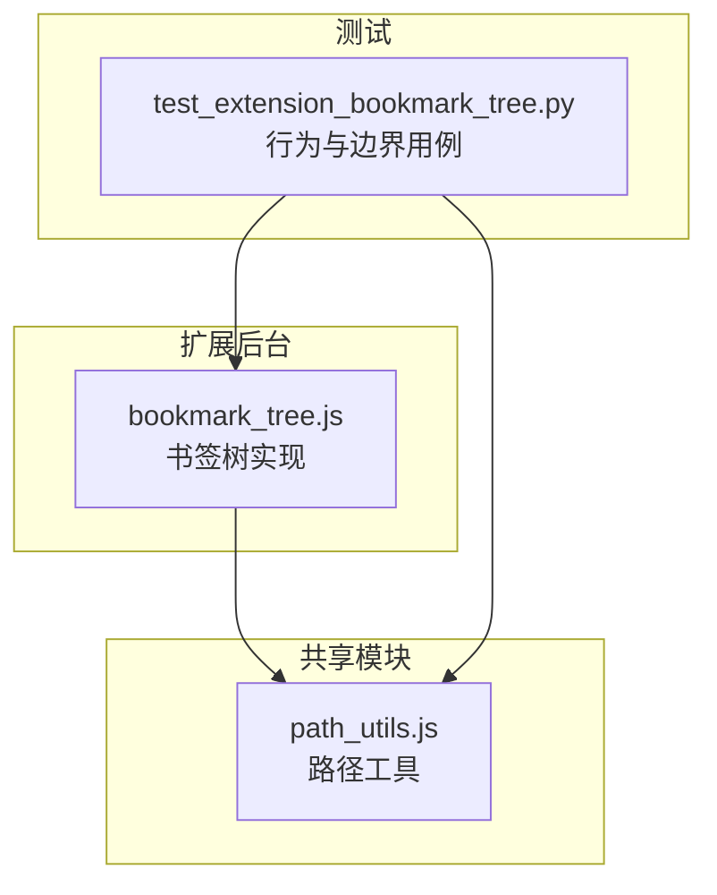
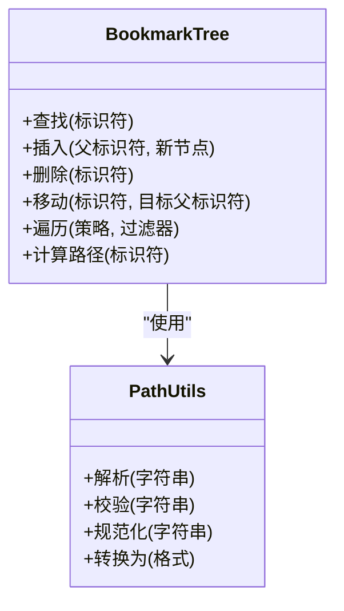
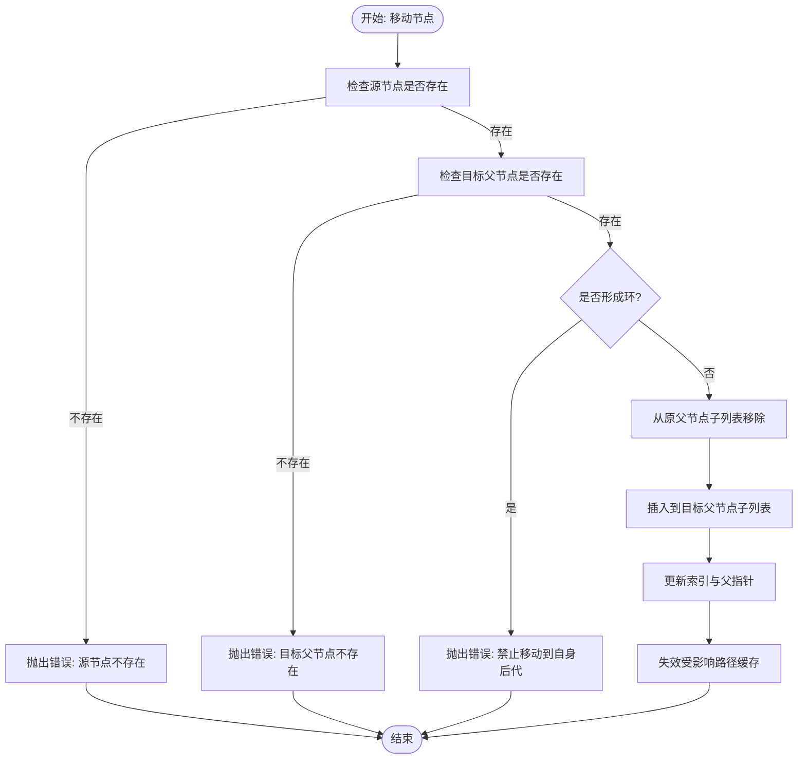
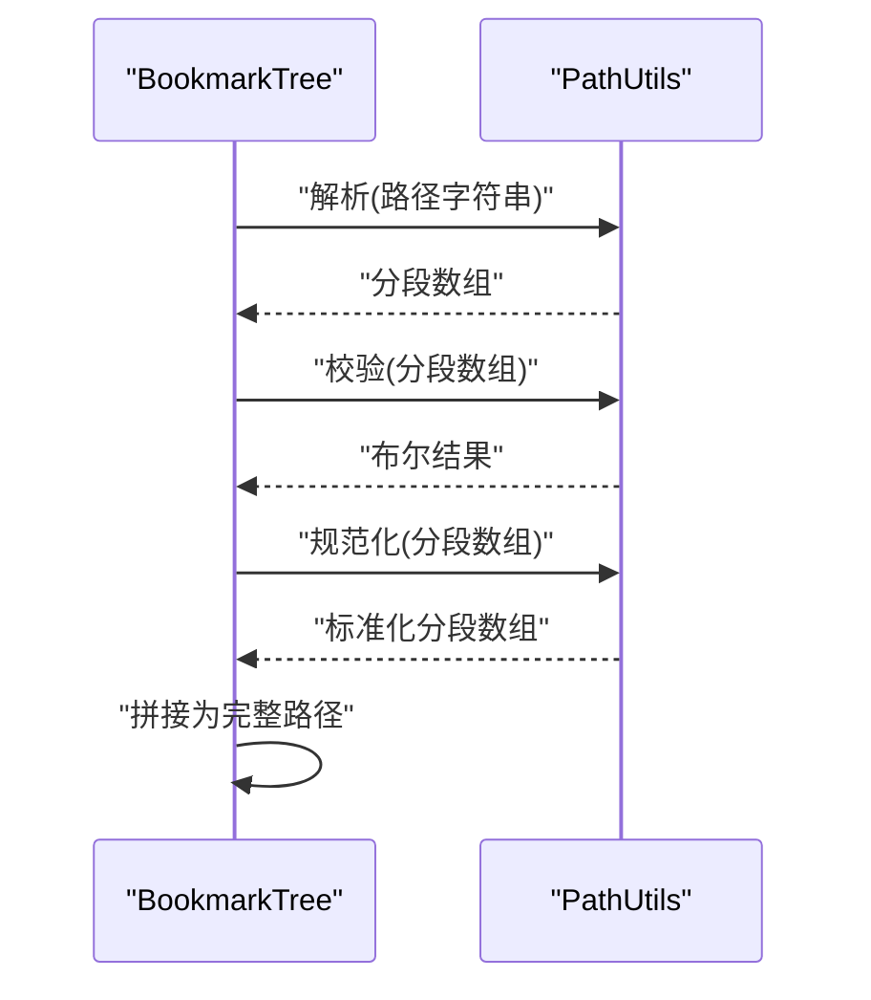
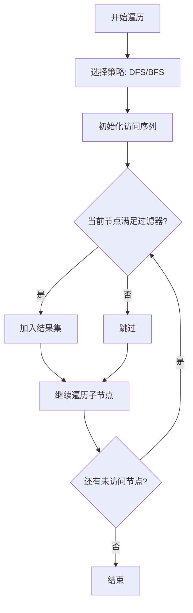
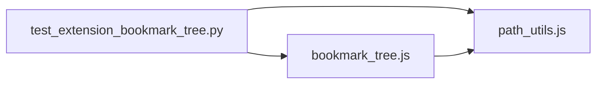

# 书签树结构管理

<cite>
**本文引用的文件**   
- [extension/background/bookmark_tree.js](file://extension/background/bookmark_tree.js)
- [extension/shared/path_utils.js](file://extension/shared/path_utils.js)
- [tests/test_extension_bookmark_tree.py](file://tests/test_extension_bookmark_tree.py)
</cite>

## 目录
1. [简介](#简介)
2. [项目结构](#项目结构)
3. [核心组件](#核心组件)
4. [架构总览](#架构总览)
5. [详细组件分析](#详细组件分析)
6. [依赖分析](#依赖分析)
7. [性能考虑](#性能考虑)
8. [故障排查指南](#故障排查指南)
9. [结论](#结论)
10. [附录](#附录)

## 简介
本文件围绕“书签树结构管理”展开，聚焦于内存中的书签树模型与操作。内容涵盖：
- 节点数据结构、父子关系维护与路径计算算法
- 树的遍历（深度优先、广度优先）与条件过滤
- 节点查找、插入、删除、移动的实现细节与边界处理
- 路径工具函数的使用（解析、验证、转换）
- 完整示例与重构场景
- 内存管理与性能调优建议

## 项目结构
本项目在扩展后台脚本中实现书签树的核心逻辑，并在共享模块中提供路径工具函数；测试覆盖主要行为与边界情况。

图表来源
- [extension/background/bookmark_tree.js](file://extension/background/bookmark_tree.js)
- [extension/shared/path_utils.js](file://extension/shared/path_utils.js)
- [tests/test_extension_bookmark_tree.py](file://tests/test_extension_bookmark_tree.py)

章节来源
- [extension/background/bookmark_tree.js](file://extension/background/bookmark_tree.js)
- [extension/shared/path_utils.js](file://extension/shared/path_utils.js)
- [tests/test_extension_bookmark_tree.py](file://tests/test_extension_bookmark_tree.py)

## 核心组件
- 书签树（BookmarkTree）
  - 负责节点的增删改查、层级维护、路径计算与遍历
  - 对外暴露稳定的 API：查找、插入、删除、移动、遍历、按条件筛选等
- 路径工具（PathUtils）
  - 提供路径解析、校验、规范化与转换能力
  - 被书签树用于生成/验证节点路径

章节来源
- [extension/background/bookmark_tree.js](file://extension/background/bookmark_tree.js)
- [extension/shared/path_utils.js](file://extension/shared/path_utils.js)

## 架构总览
下图展示了书签树与路径工具之间的交互关系，以及测试对两者的驱动方式。

图表来源
- [extension/background/bookmark_tree.js](file://extension/background/bookmark_tree.js)
- [extension/shared/path_utils.js](file://extension/shared/path_utils.js)

## 详细组件分析

### 书签树（BookmarkTree）
- 内存模型
  - 节点包含唯一标识、显示名、URL、索引、子节点集合等字段
  - 通过父指针或父标识符维护父子关系，支持快速定位父节点
  - 子节点通常以有序容器存储，便于维持顺序与索引一致性
- 路径计算
  - 自底向上回溯父链，结合路径工具将各段拼接为完整路径
  - 路径分隔符与规范化由路径工具统一处理
- 遍历算法
  - 深度优先搜索（DFS）：递归或显式栈实现，适合先序/后序处理
  - 广度优先搜索（BFS）：队列实现，适合层级相关统计与渲染
  - 条件过滤：在遍历时应用谓词，返回匹配节点集合
- 查找
  - 基于唯一标识的 O(1) 查找（哈希表）
  - 基于路径的查找：先解析路径，再逐级定位
- 插入
  - 校验父节点存在性与合法性
  - 分配索引并更新父节点子列表
  - 必要时刷新路径缓存
- 删除
  - 校验待删除节点存在性
  - 从父节点子列表中移除，释放引用
  - 清理路径缓存与索引
- 移动
  - 校验源节点与目标父节点存在性
  - 防止循环引用（如移动到自身后代）
  - 更新源节点父指针与索引，更新目标父节点子列表
  - 批量刷新受影响子树的路径缓存

图表来源
- [extension/background/bookmark_tree.js](file://extension/background/bookmark_tree.js)

章节来源
- [extension/background/bookmark_tree.js](file://extension/background/bookmark_tree.js)

### 路径工具（PathUtils）
- 功能要点
  - 解析：将字符串路径拆分为分段数组
  - 校验：检查分隔符、空段、非法字符等
  - 规范化：去除冗余分隔符、统一大小写或编码
  - 转换：在不同表示形式之间转换（例如数组与字符串）
- 与书签树的关系
  - 书签树在计算路径时调用解析与规范化
  - 在查找与验证时使用校验逻辑，确保路径合法

图表来源
- [extension/shared/path_utils.js](file://extension/shared/path_utils.js)
- [extension/background/bookmark_tree.js](file://extension/background/bookmark_tree.js)

章节来源
- [extension/shared/path_utils.js](file://extension/shared/path_utils.js)

### 遍历与过滤
- 深度优先搜索（DFS）
  - 适用于需要整体子树处理的场景（如导出、序列化）
  - 可配合过滤器进行剪枝
- 广度优先搜索（BFS）
  - 适用于按层级聚合或渲染的场景
  - 可限制最大深度以提升性能
- 条件过滤
  - 在遍历过程中应用谓词，减少不必要的数据传输与处理

[此图为概念流程示意，不直接映射具体源码，故无图表来源]

章节来源
- [extension/background/bookmark_tree.js](file://extension/background/bookmark_tree.js)

### 查找、插入、删除、移动
- 查找
  - 基于标识符：O(1) 查找
  - 基于路径：解析→逐级定位→返回节点
- 插入
  - 前置校验（父节点存在、名称合法、索引范围）
  - 更新父节点子列表与索引
  - 可选：增量更新路径缓存
- 删除
  - 前置校验（节点存在、非根节点若不允许）
  - 从父节点子列表移除
  - 清理路径缓存与索引
- 移动
  - 前置校验（源/目标存在、避免环）
  - 更新父子关系与索引
  - 批量失效受影响路径缓存

章节来源
- [extension/background/bookmark_tree.js](file://extension/background/bookmark_tree.js)

### 路径工具函数使用
- 路径解析
  - 输入：字符串路径
  - 输出：分段数组
- 路径校验
  - 输入：分段数组或字符串
  - 输出：布尔值（是否合法）
- 路径规范化
  - 输入：分段数组或字符串
  - 输出：标准化后的分段数组或字符串
- 路径转换
  - 在不同表示形式间转换（数组↔字符串）

章节来源
- [extension/shared/path_utils.js](file://extension/shared/path_utils.js)

### 完整示例与重构场景
以下为典型操作流程（以步骤描述为主，不包含代码片段）：
- 创建根节点并插入若干一级子节点
- 在指定父节点下插入二级子节点，并设置索引
- 根据路径查找节点并打印其层级信息
- 将某节点移动到新的父节点下，同时调整索引
- 删除一个叶子节点并验证父节点子列表长度变化
- 使用 DFS 遍历整棵树并按条件过滤出特定类型的节点
- 使用 BFS 遍历前两层节点并统计数量
- 对路径进行解析、校验与规范化，确保后续查找稳定

章节来源
- [tests/test_extension_bookmark_tree.py](file://tests/test_extension_bookmark_tree.py)

## 依赖分析
书签树依赖路径工具完成路径相关的解析、校验与规范化；测试覆盖书签树与路径工具的行为契约。

图表来源
- [tests/test_extension_bookmark_tree.py](file://tests/test_extension_bookmark_tree.py)
- [extension/background/bookmark_tree.js](file://extension/background/bookmark_tree.js)
- [extension/shared/path_utils.js](file://extension/shared/path_utils.js)

章节来源
- [tests/test_extension_bookmark_tree.py](file://tests/test_extension_bookmark_tree.py)
- [extension/background/bookmark_tree.js](file://extension/background/bookmark_tree.js)
- [extension/shared/path_utils.js](file://extension/shared/path_utils.js)

## 性能考虑
- 时间复杂度
  - 查找（按标识符）：O(1)
  - 查找（按路径）：O(h)，h 为树高
  - 插入/删除/移动：O(k)，k 为受影响的子树规模（含索引更新与缓存失效）
  - 遍历：O(n)，n 为节点数
- 空间复杂度
  - 节点对象与父子指针：O(n)
  - 路径缓存：按需启用，最坏 O(n·h)
- 优化建议
  - 批量操作合并：将多次插入/移动合并为一次批处理，减少重复缓存失效
  - 惰性路径计算：仅在需要时计算路径，避免频繁重建
  - 局部失效：仅失效受影响子树的路径缓存
  - 索引维护：在插入/删除时保持子列表有序，避免二次排序
  - 遍历优化：在 DFS/BFS 中加入深度上限与过滤器剪枝

[本节为通用性能指导，不直接分析具体文件]

## 故障排查指南
- 常见问题
  - 路径非法：分隔符异常、空段、非法字符
  - 循环引用：移动到自身后代导致环
  - 索引越界：插入位置超出父节点子列表范围
  - 节点不存在：查找/删除/移动时源或目标缺失
- 排查步骤
  - 使用路径工具的解析与校验接口确认路径合法性
  - 在移动前检测环：判断目标是否为源的祖先
  - 在插入前校验索引范围与父节点存在性
  - 在删除前校验节点存在性与是否为根节点（若不允许删除根）
  - 在遍历中使用过滤器缩小范围，定位问题节点

章节来源
- [extension/shared/path_utils.js](file://extension/shared/path_utils.js)
- [extension/background/bookmark_tree.js](file://extension/background/bookmark_tree.js)

## 结论
书签树通过清晰的内存模型与稳定的 API 提供了高效的层级管理能力。配合路径工具，可实现健壮的路径解析与校验。通过合理的遍历策略与条件过滤，能够高效地支撑复杂的重构与查询场景。遵循本文的性能与排障建议，可在大规模数据下保持稳定与可扩展性。

## 附录
- 术语
  - 节点：书签树中的一个元素，包含标识、名称、URL、索引与子节点集合
  - 路径：从根到节点的层级表示，由分段组成
  - 遍历：按特定顺序访问所有节点的过程
  - 过滤器：在遍历过程中用于筛选节点的谓词
- 参考
  - 书签树实现：[extension/background/bookmark_tree.js](file://extension/background/bookmark_tree.js)
  - 路径工具实现：[extension/shared/path_utils.js](file://extension/shared/path_utils.js)
  - 行为与边界用例：[tests/test_extension_bookmark_tree.py](file://tests/test_extension_bookmark_tree.py)