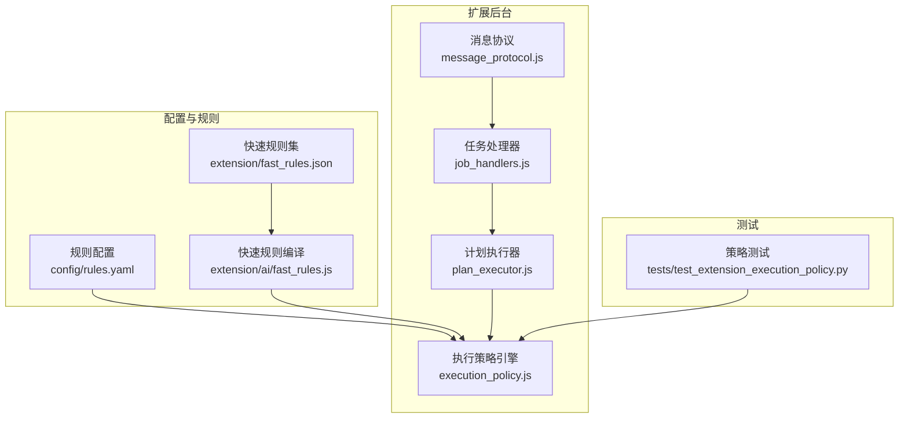
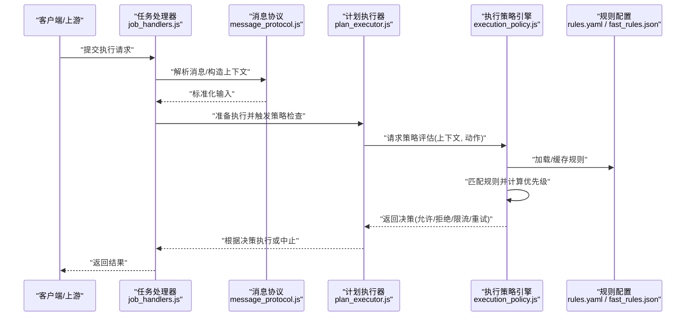
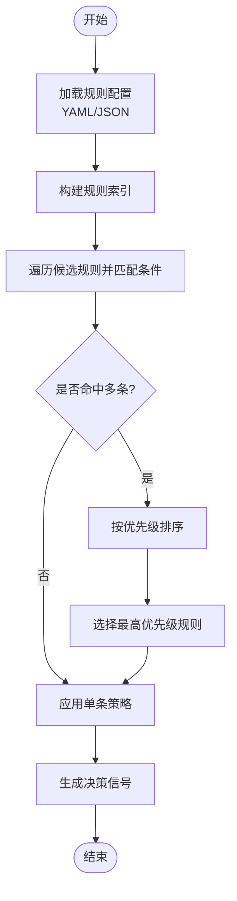
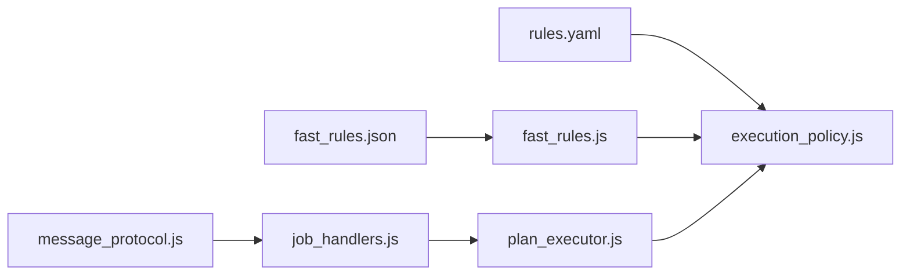

# 执行策略系统

<cite>
**本文引用的文件**   
- [execution_policy.js](file://extension/background/execution_policy.js)
- [test_extension_execution_policy.py](file://tests/test_extension_execution_policy.py)
- [rules.yaml](file://config/rules.yaml)
- [fast_rules.json](file://extension/fast_rules.json)
- [fast_rules.js](file://extension/ai/fast_rules.js)
- [plan_executor.js](file://extension/background/plan_executor.js)
- [job_handlers.js](file://extension/background/job_handlers.js)
- [message_protocol.js](file://extension/shared/message_protocol.js)
</cite>

## 目录
1. [简介](#简介)
2. [项目结构](#项目结构)
3. [核心组件](#核心组件)
4. [架构总览](#架构总览)
5. [详细组件分析](#详细组件分析)
6. [依赖关系分析](#依赖关系分析)
7. [性能考虑](#性能考虑)
8. [故障排查指南](#故障排查指南)
9. [结论](#结论)
10. [附录](#附录)

## 简介
本文件面向“执行策略系统”的设计与实现，聚焦以下目标：
- 解释策略配置机制：规则定义、条件判断与优先级排序
- 说明策略执行流程：匹配、参数绑定与动态决策
- 介绍内置策略类型：时间窗口限制、资源使用控制、安全检查
- 指导自定义策略开发：接口定义与注册机制
- 提供完整配置示例：基础与高级场景
- 给出调试与性能监控指南

## 项目结构
执行策略系统主要位于扩展后台脚本中，围绕策略加载、匹配与执行形成闭环。关键位置如下：
- 策略引擎与运行时：extension/background/execution_policy.js
- 策略执行入口（计划执行）：extension/background/plan_executor.js
- 任务处理与消息路由：extension/background/job_handlers.js、extension/shared/message_protocol.js
- 策略配置来源：config/rules.yaml、extension/fast_rules.json
- 快速规则编译与优化：extension/ai/fast_rules.js
- 单元测试覆盖：tests/test_extension_execution_policy.py

图示来源
- [execution_policy.js](file://extension/background/execution_policy.js)
- [plan_executor.js](file://extension/background/plan_executor.js)
- [job_handlers.js](file://extension/background/job_handlers.js)
- [message_protocol.js](file://extension/shared/message_protocol.js)
- [rules.yaml](file://config/rules.yaml)
- [fast_rules.json](file://extension/fast_rules.json)
- [fast_rules.js](file://extension/ai/fast_rules.js)
- [test_extension_execution_policy.py](file://tests/test_extension_execution_policy.py)

章节来源
- [execution_policy.js](file://extension/background/execution_policy.js)
- [plan_executor.js](file://extension/background/plan_executor.js)
- [job_handlers.js](file://extension/background/job_handlers.js)
- [message_protocol.js](file://extension/shared/message_protocol.js)
- [rules.yaml](file://config/rules.yaml)
- [fast_rules.json](file://extension/fast_rules.json)
- [fast_rules.js](file://extension/ai/fast_rules.js)
- [test_extension_execution_policy.py](file://tests/test_extension_execution_policy.py)

## 核心组件
- 策略引擎（ExecutionPolicy）
  - 负责加载策略配置、构建索引、进行规则匹配与优先级排序
  - 维护上下文环境，支持参数绑定与动态决策
- 快速规则编译器（FastRules）
  - 将声明式规则转换为可高效执行的规则集合
  - 用于加速常见路径的匹配与判定
- 计划执行器（PlanExecutor）
  - 在计划执行前调用策略引擎进行准入检查与约束校验
- 任务处理器（JobHandlers）
  - 接收外部请求，触发策略评估并协调执行结果
- 消息协议（MessageProtocol）
  - 定义策略相关消息结构与交互契约

章节来源
- [execution_policy.js](file://extension/background/execution_policy.js)
- [fast_rules.js](file://extension/ai/fast_rules.js)
- [plan_executor.js](file://extension/background/plan_executor.js)
- [job_handlers.js](file://extension/background/job_handlers.js)
- [message_protocol.js](file://extension/shared/message_protocol.js)

## 架构总览
下图展示从请求进入、策略匹配到最终决策的主流程。

图示来源
- [job_handlers.js](file://extension/background/job_handlers.js)
- [message_protocol.js](file://extension/shared/message_protocol.js)
- [plan_executor.js](file://extension/background/plan_executor.js)
- [execution_policy.js](file://extension/background/execution_policy.js)
- [rules.yaml](file://config/rules.yaml)
- [fast_rules.json](file://extension/fast_rules.json)

## 详细组件分析

### 执行策略引擎（ExecutionPolicy）
职责与能力
- 规则加载与缓存：从 YAML 与 JSON 快速规则源加载策略，构建内部索引
- 匹配与排序：基于条件表达式对候选规则进行匹配，按优先级选择最佳策略
- 参数绑定：将上下文变量绑定到规则参数，支持动态决策
- 决策输出：返回允许、拒绝、限流、延迟等决策信号

关键流程（匹配与优先级）

图示来源
- [execution_policy.js](file://extension/background/execution_policy.js)
- [rules.yaml](file://config/rules.yaml)
- [fast_rules.json](file://extension/fast_rules.json)

章节来源
- [execution_policy.js](file://extension/background/execution_policy.js)

### 快速规则编译器（FastRules）
职责与能力
- 将声明式规则转换为紧凑的可执行形式，减少运行时开销
- 预编译常见条件组合，提升匹配速度
- 与主引擎协作，优先走快速路径，回退到通用匹配

章节来源
- [fast_rules.js](file://extension/ai/fast_rules.js)
- [fast_rules.json](file://extension/fast_rules.json)

### 计划执行器（PlanExecutor）
职责与能力
- 在执行计划步骤前调用策略引擎进行准入检查
- 根据策略决策调整执行行为（跳过、降级、重试、终止）

章节来源
- [plan_executor.js](file://extension/background/plan_executor.js)

### 任务处理器（JobHandlers）
职责与能力
- 接收外部消息，构造策略上下文
- 协调策略评估与执行生命周期

章节来源
- [job_handlers.js](file://extension/background/job_handlers.js)

### 消息协议（MessageProtocol）
职责与能力
- 定义策略相关消息字段、版本与校验规则
- 为策略上下文提供统一的数据契约

章节来源
- [message_protocol.js](file://extension/shared/message_protocol.js)

### 内置策略类型
- 时间窗口限制
  - 作用：限制单位时间内某类操作的次数或频率
  - 典型条件：当前时间、操作类型、用户/会话标识
  - 决策：允许、限流、排队或拒绝
- 资源使用控制
  - 作用：基于内存、CPU、并发度等指标进行保护
  - 典型条件：资源阈值、队列长度、活跃任务数
  - 决策：降速、拒绝新任务或等待
- 安全检查
  - 作用：校验权限、来源可信度、敏感操作白名单
  - 典型条件：角色、签名、域名/IP、操作范围
  - 决策：允许、拒绝、要求二次确认

章节来源
- [execution_policy.js](file://extension/background/execution_policy.js)
- [rules.yaml](file://config/rules.yaml)
- [fast_rules.json](file://extension/fast_rules.json)

### 自定义策略开发方法
- 接口定义
  - 策略项需包含：唯一标识、条件表达式、优先级、动作与参数模板
  - 上下文对象应暴露必要字段供条件与参数绑定使用
- 注册机制
  - 通过配置中心（YAML/JSON）声明策略条目
  - 引擎启动时加载并建立索引；热更新时可增量刷新
- 开发与验证
  - 编写单元测试覆盖边界条件与异常路径
  - 使用日志与度量指标辅助定位问题

章节来源
- [execution_policy.js](file://extension/background/execution_policy.js)
- [test_extension_execution_policy.py](file://tests/test_extension_execution_policy.py)

### 策略配置示例
- 基础配置
  - 定义最小可用策略：仅含条件与动作，优先级默认
  - 适用于简单开关与黑白名单
- 高级场景
  - 多条件复合：时间窗口 + 资源阈值 + 安全校验
  - 动态参数：基于上下文变量注入阈值与超时
  - 优先级编排：不同来源的规则合并并按业务重要性排序

章节来源
- [rules.yaml](file://config/rules.yaml)
- [fast_rules.json](file://extension/fast_rules.json)

## 依赖关系分析

图示来源
- [rules.yaml](file://config/rules.yaml)
- [fast_rules.json](file://extension/fast_rules.json)
- [fast_rules.js](file://extension/ai/fast_rules.js)
- [execution_policy.js](file://extension/background/execution_policy.js)
- [message_protocol.js](file://extension/shared/message_protocol.js)
- [job_handlers.js](file://extension/background/job_handlers.js)
- [plan_executor.js](file://extension/background/plan_executor.js)

章节来源
- [execution_policy.js](file://extension/background/execution_policy.js)
- [fast_rules.js](file://extension/ai/fast_rules.js)
- [plan_executor.js](file://extension/background/plan_executor.js)
- [job_handlers.js](file://extension/background/job_handlers.js)
- [message_protocol.js](file://extension/shared/message_protocol.js)
- [rules.yaml](file://config/rules.yaml)
- [fast_rules.json](file://extension/fast_rules.json)

## 性能考虑
- 规则索引与缓存
  - 启动阶段构建索引，避免重复解析
  - 对高频规则进行热点缓存
- 快速路径优先
  - 通过快速规则编译器减少分支与表达式求值
- 条件短路
  - 对高代价条件进行前置过滤
- 批量化与去重
  - 批量评估相似上下文，复用中间结果
- 观测与限流
  - 记录匹配耗时、命中率与拒绝率，设置告警阈值

[本节为通用建议，不直接分析具体文件]

## 故障排查指南
- 常见问题
  - 规则未生效：检查规则是否被正确加载与索引
  - 优先级冲突：确认优先级数值与排序逻辑
  - 参数绑定失败：核对上下文字段名与类型
  - 性能退化：观察快速规则命中与慢路径比例
- 定位手段
  - 启用策略评估日志，记录匹配链路与决策原因
  - 使用单元测试复现问题，逐步缩小范围
  - 结合指标看板观察错误率与延迟分布

章节来源
- [test_extension_execution_policy.py](file://tests/test_extension_execution_policy.py)
- [execution_policy.js](file://extension/background/execution_policy.js)

## 结论
执行策略系统以“配置驱动 + 快速编译 + 动态决策”为核心，兼顾灵活性与性能。通过清晰的匹配与优先级机制，以及可扩展的自定义策略接口，能够支撑复杂业务场景下的准入与治理需求。配合完善的测试与观测体系，可在保证稳定性的同时持续演进策略能力。

## 附录
- 术语
  - 策略：由条件与动作组成的可执行规则
  - 上下文：策略评估时的运行期数据
  - 决策：策略引擎输出的执行信号
- 参考
  - 策略测试用例：tests/test_extension_execution_policy.py
  - 规则配置样例：config/rules.yaml、extension/fast_rules.json