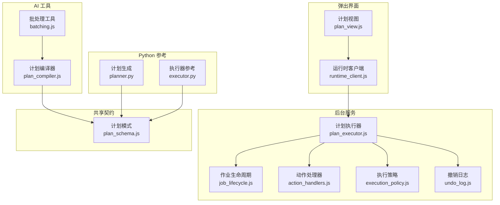
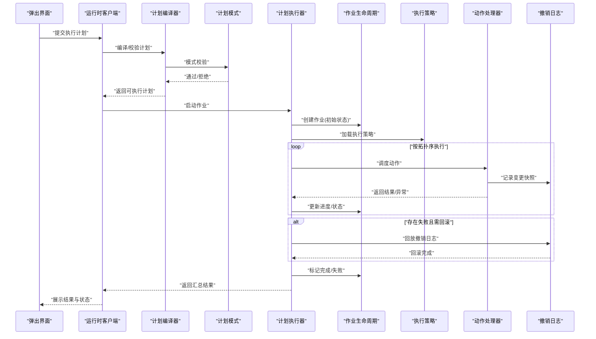
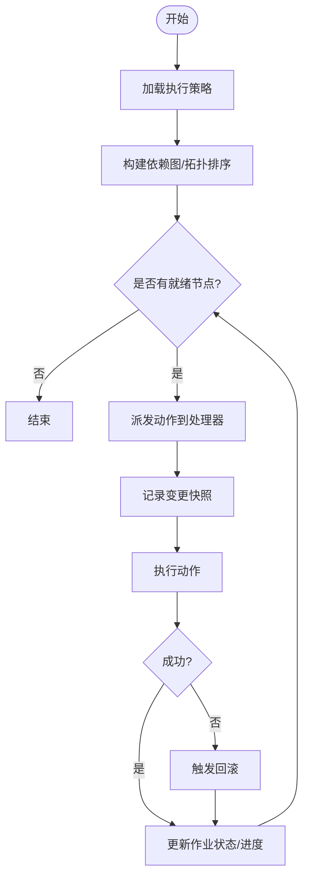
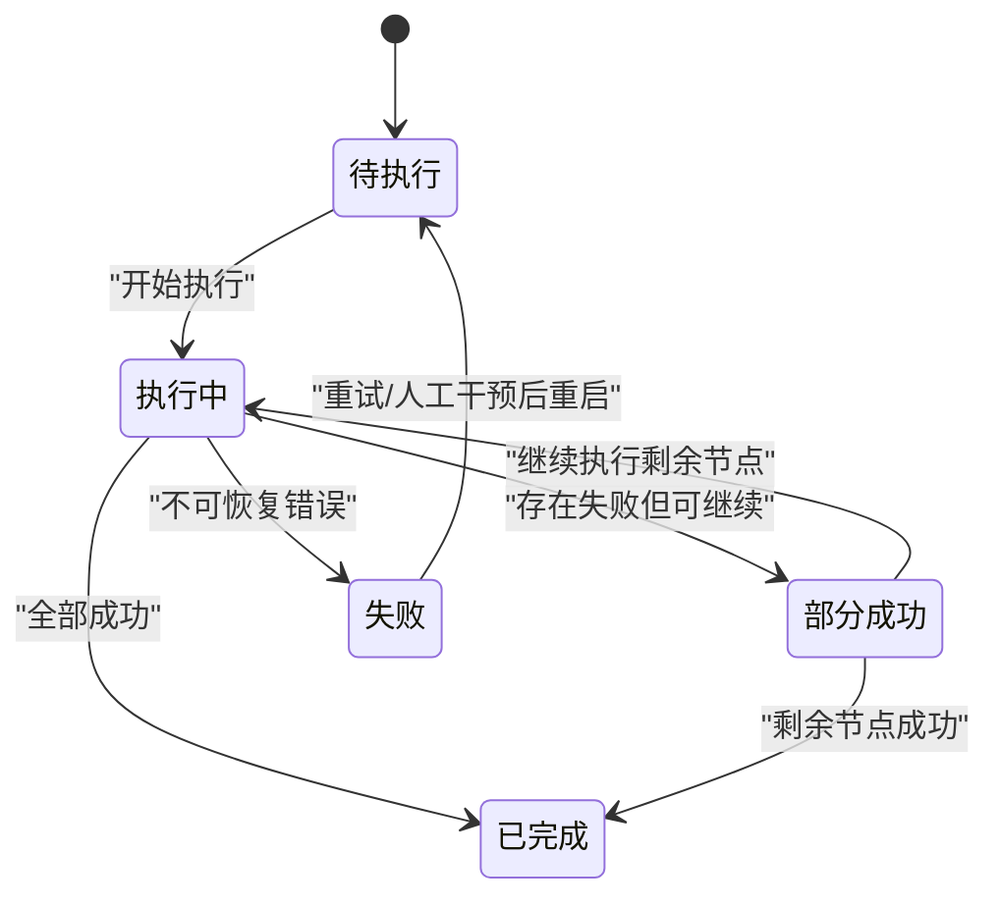
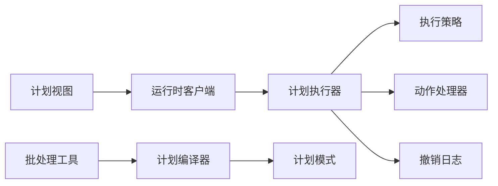

# 批量操作引擎

<cite>
**本文引用的文件**   
- [extension/background/plan_executor.js](file://extension/background/plan_executor.js)
- [extension/background/job_lifecycle.js](file://extension/background/job_lifecycle.js)
- [extension/background/job_handlers.js](file://extension/background/job_handlers.js)
- [extension/background/execution_policy.js](file://extension/background/execution_policy.js)
- [extension/background/action_handlers.js](file://extension/background/action_handlers.js)
- [extension/background/undo_log.js](file://extension/background/undo_log.js)
- [extension/shared/plan_schema.js](file://extension/shared/plan_schema.js)
- [extension/ai/plan_compiler.js](file://extension/ai/plan_compiler.js)
- [extension/ai/batching.js](file://extension/ai/batching.js)
- [extension/popup/plan_view.js](file://extension/popup/plan_view.js)
- [extension/popup/runtime_client.js](file://extension/popup/runtime_client.js)
- [extension/action_constants.js](file://extension/action_constants.js)
- [src/bookmark_advisor/planner.py](file://src/bookmark_advisor/planner.py)
- [src/bookmark_advisor/executor.py](file://src/bookmark_advisor/executor.py)
- [tests/test_extension_plan_executor_module.py](file://tests/test_extension_plan_executor_module.py)
- [tests/test_extension_job_lifecycle.py](file://tests/test_extension_job_lifecycle.py)
</cite>

## 目录
1. [简介](#简介)
2. [项目结构](#项目结构)
3. [核心组件](#核心组件)
4. [架构总览](#架构总览)
5. [详细组件分析](#详细组件分析)
6. [依赖关系分析](#依赖关系分析)
7. [性能考量](#性能考量)
8. [故障排查指南](#故障排查指南)
9. [结论](#结论)
10. [附录](#附录)

## 简介
本文件面向“批量操作引擎”的设计与实现，围绕以下目标展开：
- 操作队列管理、依赖解析与执行调度
- 事务处理机制（原子性、回滚策略、状态一致性）
- 操作常量定义与使用（动作类型枚举、状态码、错误信息标准化）
- 执行计划生命周期（编译、验证、执行、结果收集）
- 完整示例（简单批量与复杂嵌套场景）
- 错误恢复机制与调试技巧

该引擎在浏览器扩展的后台脚本中运行，负责将高层“执行计划”转换为可执行的“操作序列”，并在保证一致性的前提下进行批量化执行。

## 项目结构
与批量操作引擎直接相关的代码主要分布在以下模块：
- 后台执行层：计划执行器、作业生命周期、执行策略、动作处理器、撤销日志
- 共享契约：执行计划的数据模型与校验规则
- AI 侧：计划编译器与批处理工具
- 弹出界面：计划视图与运行时客户端
- Python 侧：计划生成与执行参考实现
- 测试：覆盖关键路径与边界条件

图表来源
- [extension/background/plan_executor.js](file://extension/background/plan_executor.js)
- [extension/background/job_lifecycle.js](file://extension/background/job_lifecycle.js)
- [extension/background/execution_policy.js](file://extension/background/execution_policy.js)
- [extension/background/action_handlers.js](file://extension/background/action_handlers.js)
- [extension/background/undo_log.js](file://extension/background/undo_log.js)
- [extension/shared/plan_schema.js](file://extension/shared/plan_schema.js)
- [extension/ai/plan_compiler.js](file://extension/ai/plan_compiler.js)
- [extension/ai/batching.js](file://extension/ai/batching.js)
- [extension/popup/plan_view.js](file://extension/popup/plan_view.js)
- [extension/popup/runtime_client.js](file://extension/popup/runtime_client.js)
- [src/bookmark_advisor/planner.py](file://src/bookmark_advisor/planner.py)
- [src/bookmark_advisor/executor.py](file://src/bookmark_advisor/executor.py)

章节来源
- [extension/background/plan_executor.js](file://extension/background/plan_executor.js)
- [extension/background/job_lifecycle.js](file://extension/background/job_lifecycle.js)
- [extension/background/execution_policy.js](file://extension/background/execution_policy.js)
- [extension/background/action_handlers.js](file://extension/background/action_handlers.js)
- [extension/background/undo_log.js](file://extension/background/undo_log.js)
- [extension/shared/plan_schema.js](file://extension/shared/plan_schema.js)
- [extension/ai/plan_compiler.js](file://extension/ai/plan_compiler.js)
- [extension/ai/batching.js](file://extension/ai/batching.js)
- [extension/popup/plan_view.js](file://extension/popup/plan_view.js)
- [extension/popup/runtime_client.js](file://extension/popup/runtime_client.js)
- [src/bookmark_advisor/planner.py](file://src/bookmark_advisor/planner.py)
- [src/bookmark_advisor/executor.py](file://src/bookmark_advisor/executor.py)

## 核心组件
- 计划执行器：负责接收已编译的执行计划，按依赖拓扑顺序调度执行，维护作业状态与进度，并协调事务与回滚。
- 作业生命周期：定义作业从创建、排队、执行到完成/失败的全生命周期事件与状态迁移。
- 执行策略：控制并发度、重试次数、超时、节流等执行参数。
- 动作处理器：将计划中的具体动作映射到实际 API 调用，封装副作用与返回值。
- 撤销日志：记录每个操作的变更快照，用于失败时的回滚与一致性恢复。
- 计划模式：定义执行计划的 JSON Schema，确保输入合法性与字段完整性。
- 计划编译器：将高层意图或自然语言描述转化为可执行的计划结构。
- 批处理工具：对计划进行合并、去重、分组与优化，提升吞吐。
- 弹出界面：提供计划可视化、提交与监控能力。
- Python 参考：提供计划生成与执行器的参考实现，便于跨端对齐语义。

章节来源
- [extension/background/plan_executor.js](file://extension/background/plan_executor.js)
- [extension/background/job_lifecycle.js](file://extension/background/job_lifecycle.js)
- [extension/background/execution_policy.js](file://extension/background/execution_policy.js)
- [extension/background/action_handlers.js](file://extension/background/action_handlers.js)
- [extension/background/undo_log.js](file://extension/background/undo_log.js)
- [extension/shared/plan_schema.js](file://extension/shared/plan_schema.js)
- [extension/ai/plan_compiler.js](file://extension/ai/plan_compiler.js)
- [extension/ai/batching.js](file://extension/ai/batching.js)
- [extension/popup/plan_view.js](file://extension/popup/plan_view.js)
- [extension/popup/runtime_client.js](file://extension/popup/runtime_client.js)
- [src/bookmark_advisor/planner.py](file://src/bookmark_advisor/planner.py)
- [src/bookmark_advisor/executor.py](file://src/bookmark_advisor/executor.py)

## 架构总览
整体流程分为四个阶段：
- 编译：将高层意图转换为结构化执行计划，并进行模式校验。
- 验证：检查依赖图无环、资源约束满足、权限与配额可用。
- 执行：按拓扑序调度动作，支持并发与重试，记录撤销日志。
- 收尾：汇总结果，持久化作业状态，必要时触发回滚。

图表来源
- [extension/popup/plan_view.js](file://extension/popup/plan_view.js)
- [extension/popup/runtime_client.js](file://extension/popup/runtime_client.js)
- [extension/ai/plan_compiler.js](file://extension/ai/plan_compiler.js)
- [extension/shared/plan_schema.js](file://extension/shared/plan_schema.js)
- [extension/background/plan_executor.js](file://extension/background/plan_executor.js)
- [extension/background/job_lifecycle.js](file://extension/background/job_lifecycle.js)
- [extension/background/execution_policy.js](file://extension/background/execution_policy.js)
- [extension/background/action_handlers.js](file://extension/background/action_handlers.js)
- [extension/background/undo_log.js](file://extension/background/undo_log.js)

## 详细组件分析

### 计划执行器（Plan Executor）
职责
- 接收已编译的计划，构建依赖有向无环图（DAG），进行拓扑排序。
- 根据执行策略控制并发度、重试与超时。
- 协调动作处理器与撤销日志，保证事务性与一致性。
- 维护作业状态机，广播进度与结果。

关键流程
- 初始化：加载策略、准备撤销日志、建立作业上下文。
- 调度：按拓扑序选择就绪节点，派发至动作处理器。
- 事务：每步执行前记录快照，失败时统一回滚。
- 收尾：聚合结果、持久化状态、清理资源。

图表来源
- [extension/background/plan_executor.js](file://extension/background/plan_executor.js)
- [extension/background/execution_policy.js](file://extension/background/execution_policy.js)
- [extension/background/action_handlers.js](file://extension/background/action_handlers.js)
- [extension/background/undo_log.js](file://extension/background/undo_log.js)

章节来源
- [extension/background/plan_executor.js](file://extension/background/plan_executor.js)
- [extension/background/execution_policy.js](file://extension/background/execution_policy.js)
- [extension/background/action_handlers.js](file://extension/background/action_handlers.js)
- [extension/background/undo_log.js](file://extension/background/undo_log.js)

### 作业生命周期（Job Lifecycle）
职责
- 定义作业状态集合与迁移规则（如：待执行、执行中、部分成功、失败、已完成）。
- 提供事件钩子，供执行器与界面订阅。
- 保证状态持久化与恢复。

状态迁移要点
- 进入执行中：锁定作业，防止重复提交。
- 部分成功：允许继续执行后续节点，但需记录失败分支。
- 失败：触发回滚或补偿逻辑，最终落盘失败原因。
- 完成：释放锁，输出汇总报告。

图表来源
- [extension/background/job_lifecycle.js](file://extension/background/job_lifecycle.js)

章节来源
- [extension/background/job_lifecycle.js](file://extension/background/job_lifecycle.js)

### 执行策略（Execution Policy）
职责
- 配置并发度、最大重试次数、单次动作超时、全局超时。
- 定义节流与退避策略，避免过载与雪崩。
- 提供策略校验与默认值填充。

典型参数
- 并发度：限制同时运行的动作数。
- 重试：指数退避或固定间隔。
- 超时：单动作与全局上限。
- 限流：基于令牌桶或滑动窗口。

章节来源
- [extension/background/execution_policy.js](file://extension/background/execution_policy.js)

### 动作处理器（Action Handlers）
职责
- 将计划中的动作类型映射到具体实现。
- 封装副作用、返回值与错误码。
- 与撤销日志协作，记录变更前后的状态快照。

设计要点
- 单一职责：每个处理器只负责一类动作。
- 幂等性：尽量保证多次执行不产生额外副作用。
- 错误标准化：统一错误码与消息格式。

章节来源
- [extension/background/action_handlers.js](file://extension/background/action_handlers.js)

### 撤销日志（Undo Log）
职责
- 记录每次动作执行前的状态快照。
- 提供按顺序回放的能力，用于失败回滚。
- 支持增量快照与压缩，降低存储开销。

回滚策略
- 逆序回放：从最后一步向前撤销。
- 选择性回滚：仅回滚失败分支及其依赖。
- 一致性检查：回滚后校验关键不变式。

章节来源
- [extension/background/undo_log.js](file://extension/background/undo_log.js)

### 计划模式（Plan Schema）
职责
- 定义执行计划的 JSON Schema，包括必填字段、类型约束、依赖关系。
- 提供校验函数，拒绝非法计划。
- 作为编译器与执行器的共同契约。

关键字段
- 动作列表：包含类型、参数、依赖 ID。
- 元数据：版本、标签、优先级。
- 策略引用：关联执行策略。

章节来源
- [extension/shared/plan_schema.js](file://extension/shared/plan_schema.js)

### 计划编译器（Plan Compiler）
职责
- 将高层意图或自然语言描述转换为符合模式的执行计划。
- 进行初步验证与规范化（如依赖补全、ID 生成）。
- 与批处理工具协作，进行合并与优化。

章节来源
- [extension/ai/plan_compiler.js](file://extension/ai/plan_compiler.js)

### 批处理工具（Batching）
职责
- 对计划进行合并、去重、分组与并行化优化。
- 识别可批量化的动作，减少往返与锁竞争。
- 生成更紧凑的执行计划以提升吞吐。

章节来源
- [extension/ai/batching.js](file://extension/ai/batching.js)

### 弹出界面（Plan View & Runtime Client）
职责
- 提供计划可视化、编辑与提交入口。
- 监听作业状态变化，渲染进度与结果。
- 与后台通信，发起执行与查询。

章节来源
- [extension/popup/plan_view.js](file://extension/popup/plan_view.js)
- [extension/popup/runtime_client.js](file://extension/popup/runtime_client.js)

### Python 参考实现（Planner & Executor）
职责
- 提供计划生成与执行器的参考实现，便于跨端对齐语义。
- 可用于离线验证与回归测试。

章节来源
- [src/bookmark_advisor/planner.py](file://src/bookmark_advisor/planner.py)
- [src/bookmark_advisor/executor.py](file://src/bookmark_advisor/executor.py)

## 依赖关系分析
- 低耦合：执行器通过接口与动作处理器交互，避免硬编码。
- 高内聚：撤销日志独立于业务动作，专注状态快照与回放。
- 外部依赖：计划模式为共享契约，编译器与执行器均依赖其校验能力。
- 循环依赖规避：通过分层与接口隔离，避免执行器与处理器互相导入。

图表来源
- [extension/background/plan_executor.js](file://extension/background/plan_executor.js)
- [extension/background/execution_policy.js](file://extension/background/execution_policy.js)
- [extension/background/action_handlers.js](file://extension/background/action_handlers.js)
- [extension/background/undo_log.js](file://extension/background/undo_log.js)
- [extension/ai/plan_compiler.js](file://extension/ai/plan_compiler.js)
- [extension/ai/batching.js](file://extension/ai/batching.js)
- [extension/popup/plan_view.js](file://extension/popup/plan_view.js)
- [extension/popup/runtime_client.js](file://extension/popup/runtime_client.js)
- [extension/shared/plan_schema.js](file://extension/shared/plan_schema.js)

章节来源
- [extension/background/plan_executor.js](file://extension/background/plan_executor.js)
- [extension/background/execution_policy.js](file://extension/background/execution_policy.js)
- [extension/background/action_handlers.js](file://extension/background/action_handlers.js)
- [extension/background/undo_log.js](file://extension/background/undo_log.js)
- [extension/ai/plan_compiler.js](file://extension/ai/plan_compiler.js)
- [extension/ai/batching.js](file://extension/ai/batching.js)
- [extension/popup/plan_view.js](file://extension/popup/plan_view.js)
- [extension/popup/runtime_client.js](file://extension/popup/runtime_client.js)
- [extension/shared/plan_schema.js](file://extension/shared/plan_schema.js)

## 性能考量
- 并发度调优：根据 I/O 与 CPU 特征设置合适的并发度，避免过度争用。
- 批量化合并：将同类动作合并执行，减少锁与网络往返。
- 快照压缩：对撤销日志进行增量与压缩，降低存储与回放成本。
- 超时与退避：合理设置超时与重试退避，避免雪崩与长尾。
- 惰性加载：按需加载动作处理器，减少启动开销。

[本节为通用指导，无需特定文件来源]

## 故障排查指南
常见问题与定位方法
- 计划校验失败：检查计划模式字段与依赖关系是否合法。
- 死锁或饥饿：检查依赖图是否存在环，调整并发度与超时。
- 回滚不一致：核对撤销日志快照完整性与回放顺序。
- 动作幂等性问题：确认动作实现是否具备幂等性，避免重复副作用。
- 界面不同步：检查作业状态事件是否正确广播与订阅。

调试技巧
- 启用详细日志：记录计划编译、依赖解析、动作执行与回滚过程。
- 断点与快照：在执行前后打印关键状态，对比快照差异。
- 最小复现：构造最小计划以复现问题，逐步增加复杂度。
- 单元测试：利用现有测试用例覆盖关键路径与边界条件。

章节来源
- [tests/test_extension_plan_executor_module.py](file://tests/test_extension_plan_executor_module.py)
- [tests/test_extension_job_lifecycle.py](file://tests/test_extension_job_lifecycle.py)

## 结论
本批量操作引擎通过清晰的层次划分与严格的契约定义，实现了可扩展、可观测、可回滚的批处理执行框架。借助计划编译器与批处理工具，系统能够在保证一致性的前提下提升吞吐与稳定性。建议在生产环境中结合监控与告警，持续优化执行策略与资源使用。

[本节为总结性内容，无需特定文件来源]

## 附录

### 操作常量与错误标准化
- 动作类型枚举：集中定义所有支持的动作文档与行为约定。
- 状态码定义：统一的成功、失败与中间状态码，便于前端展示与后端处理。
- 错误信息标准化：结构化错误对象，包含代码、消息、上下文与建议修复步骤。

章节来源
- [extension/action_constants.js](file://extension/action_constants.js)

### 完整示例

#### 简单批量示例
- 目标：批量移动书签到指定文件夹。
- 步骤：
  - 使用计划编译器生成移动动作列表。
  - 批处理工具合并相同目标的动作。
  - 执行器按拓扑序执行，记录撤销日志。
  - 成功后持久化状态，失败则回滚。

章节来源
- [extension/ai/plan_compiler.js](file://extension/ai/plan_compiler.js)
- [extension/ai/batching.js](file://extension/ai/batching.js)
- [extension/background/plan_executor.js](file://extension/background/plan_executor.js)
- [extension/background/undo_log.js](file://extension/background/undo_log.js)

#### 复杂嵌套示例
- 目标：先创建多个临时文件夹，再批量移动书签，最后删除临时文件夹。
- 步骤：
  - 计划中包含依赖关系：创建文件夹 → 移动书签 → 删除文件夹。
  - 执行器构建 DAG 并拓扑排序。
  - 若移动书签失败，仅回滚相关分支，保留已创建的文件夹以便诊断。
  - 完成后输出汇总报告与审计日志。

章节来源
- [extension/background/plan_executor.js](file://extension/background/plan_executor.js)
- [extension/background/job_lifecycle.js](file://extension/background/job_lifecycle.js)
- [extension/background/undo_log.js](file://extension/background/undo_log.js)