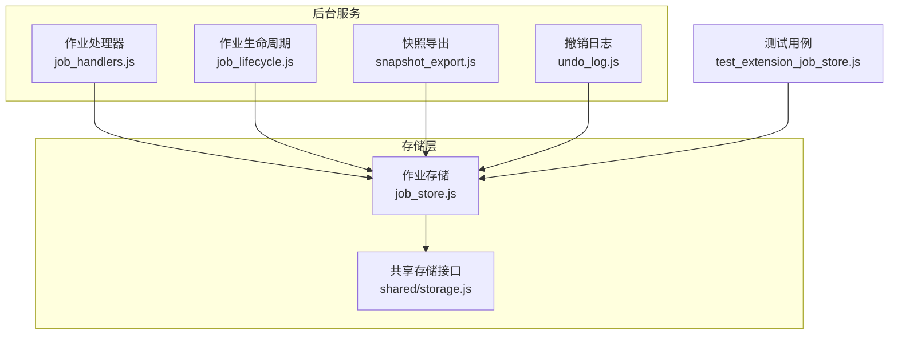
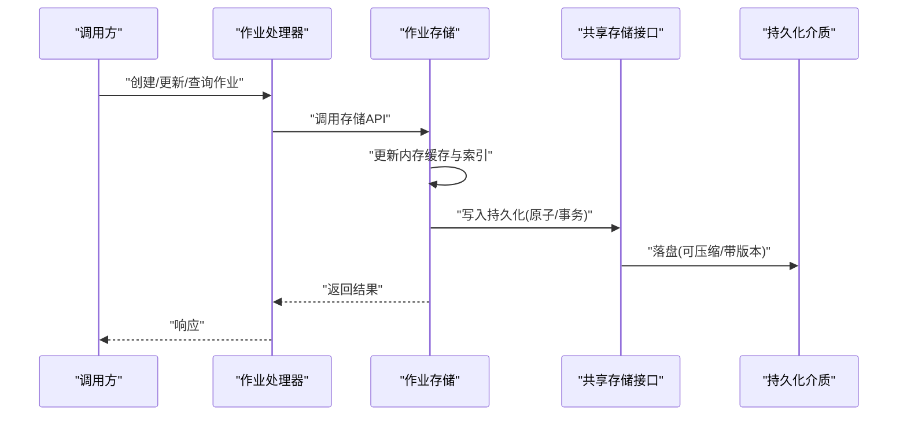
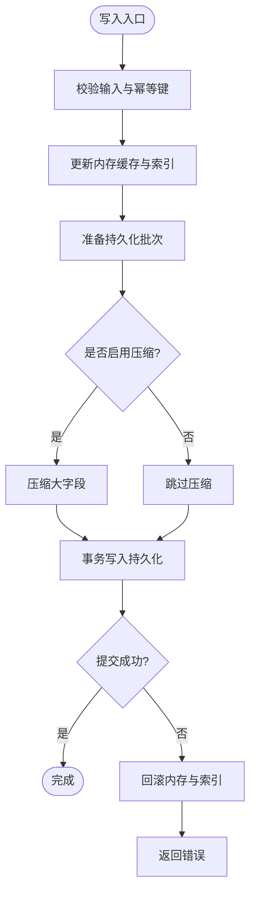
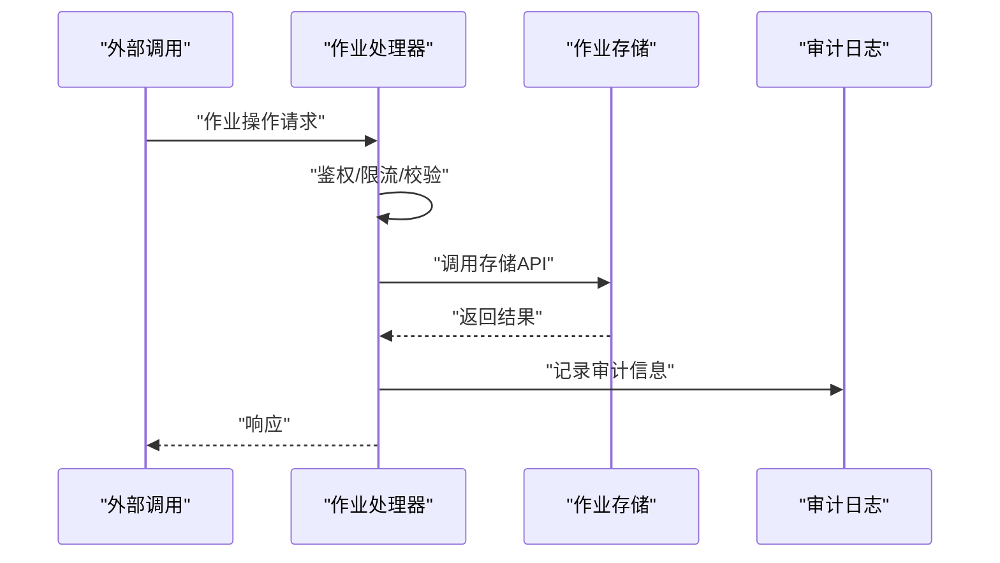
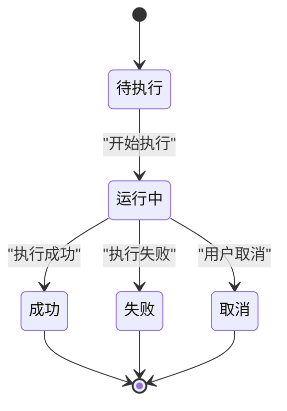
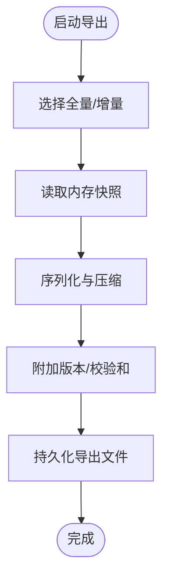
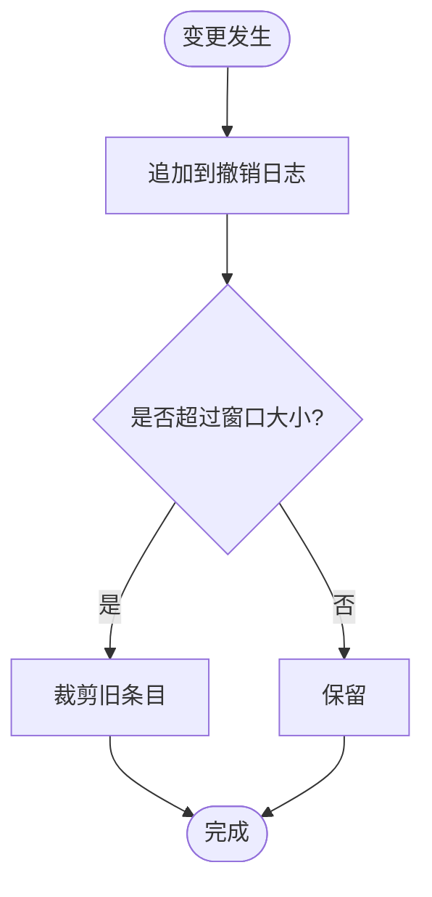
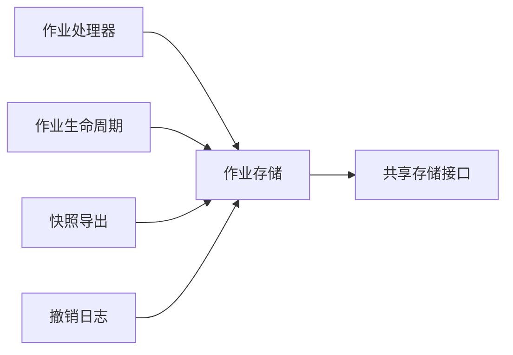

# 作业存储系统

<cite>
**本文引用的文件**   
- [job_store.js](file://extension/background/job_store.js)
- [job_handlers.js](file://extension/background/job_handlers.js)
- [job_lifecycle.js](file://extension/background/job_lifecycle.js)
- [snapshot_export.js](file://extension/background/snapshot_export.js)
- [undo_log.js](file://extension/background/undo_log.js)
- [shared_storage.js](file://extension/shared/storage.js)
- [test_extension_job_store.js](file://tests/test_extension_job_store.js)
</cite>

## 目录
1. [简介](#简介)
2. [项目结构](#项目结构)
3. [核心组件](#核心组件)
4. [架构总览](#架构总览)
5. [详细组件分析](#详细组件分析)
6. [依赖关系分析](#依赖关系分析)
7. [性能考虑](#性能考虑)
8. [故障排查指南](#故障排查指南)
9. [结论](#结论)
10. [附录](#附录)

## 简介
本文件面向“作业存储系统”，聚焦于作业数据的内存缓存层与持久化存储层设计、数据格式与序列化策略（含压缩与版本兼容）、性能优化（批量操作、增量更新、索引）、备份与恢复（含迁移与损坏修复）、配置项与扩展点，以及大规模作业数据的存储优化案例与最佳实践。文档以仓库中的实际实现为依据，提供可追溯的源码定位与图示说明。

## 项目结构
作业存储相关代码主要位于浏览器扩展的后台脚本与共享模块中：
- 后台服务层负责作业生命周期、事件处理与状态同步
- 存储层封装内存缓存与持久化读写
- 快照导出与撤销日志提供备份与回滚能力
- 测试覆盖关键路径，保障行为一致性

图表来源
- [job_handlers.js](file://extension/background/job_handlers.js)
- [job_lifecycle.js](file://extension/background/job_lifecycle.js)
- [snapshot_export.js](file://extension/background/snapshot_export.js)
- [undo_log.js](file://extension/background/undo_log.js)
- [job_store.js](file://extension/background/job_store.js)
- [shared_storage.js](file://extension/shared/storage.js)
- [test_extension_job_store.js](file://tests/test_extension_job_store.js)

章节来源
- [job_store.js](file://extension/background/job_store.js)
- [job_handlers.js](file://extension/background/job_handlers.js)
- [job_lifecycle.js](file://extension/background/job_lifecycle.js)
- [snapshot_export.js](file://extension/background/snapshot_export.js)
- [undo_log.js](file://extension/background/undo_log.js)
- [shared_storage.js](file://extension/shared/storage.js)
- [test_extension_job_store.js](file://tests/test_extension_job_store.js)

## 核心组件
- 作业存储（内存+持久化）
  - 职责：维护作业集合的内存视图，提供增删改查、批量写入、增量合并、索引构建与查询；将变更落盘并保证幂等与一致性。
  - 关键点：原子写入、事务式提交、失败回滚、版本号与校验和。
- 作业处理器
  - 职责：接收外部消息或调度器指令，调用存储层完成作业创建、状态推进、结果归档。
- 作业生命周期
  - 职责：驱动作业从创建到终态的状态机流转，触发存储层的增量更新与快照。
- 快照导出
  - 职责：导出完整或增量快照，支持压缩与版本标记，用于备份与迁移。
- 撤销日志
  - 职责：记录最近变更序列，支持有限时间窗口内的回滚与修复。
- 共享存储接口
  - 职责：抽象底层持久化介质（如 IndexedDB/文件系统），统一读写契约与错误语义。

章节来源
- [job_store.js](file://extension/background/job_store.js)
- [job_handlers.js](file://extension/background/job_handlers.js)
- [job_lifecycle.js](file://extension/background/job_lifecycle.js)
- [snapshot_export.js](file://extension/background/snapshot_export.js)
- [undo_log.js](file://extension/background/undo_log.js)
- [shared_storage.js](file://extension/shared/storage.js)

## 架构总览
整体采用“内存缓存 + 持久化”的双层架构：
- 内存缓存层：提供低延迟读写、并发安全、索引加速查询。
- 持久化层：提供可靠落盘、压缩存储、版本兼容、快照与增量合并。

图表来源
- [job_handlers.js](file://extension/background/job_handlers.js)
- [job_store.js](file://extension/background/job_store.js)
- [shared_storage.js](file://extension/shared/storage.js)

## 详细组件分析

### 作业存储（内存缓存与持久化）
- 内存模型
  - 作业实体：包含标识、元数据、状态、时间戳、结果引用等字段。
  - 索引：按状态、标签、时间范围、优先级等多维索引，支持快速过滤与分页。
- 持久化格式
  - 结构化记录：每条作业一条记录，附带版本号与校验和。
  - 压缩策略：对大字段（如结果体、日志）进行压缩，元数据保持可读。
  - 版本兼容：通过版本号与迁移钩子实现向前/向后兼容。
- 写入路径
  - 原子写入：先写临时文件/分区，再原子替换，避免半写状态。
  - 事务提交：多记录写入打包为一次事务，失败全部回滚。
- 读取路径
  - 优先命中内存索引，未命中时按需加载并回填索引。
- 增量更新
  - 基于变更日志的增量合并，减少全量重写开销。
- 一致性
  - 幂等键：确保重复写入不产生副作用。
  - 冲突解决：基于时间戳/版本号合并策略。

图表来源
- [job_store.js](file://extension/background/job_store.js)
- [shared_storage.js](file://extension/shared/storage.js)

章节来源
- [job_store.js](file://extension/background/job_store.js)
- [shared_storage.js](file://extension/shared/storage.js)

### 作业处理器
- 职责边界
  - 解析外部请求/消息协议，路由到存储层对应方法。
  - 参数校验、权限检查、限流与重试。
- 与存储交互
  - 使用统一的存储API，屏蔽底层差异。
  - 对关键路径添加审计日志与指标上报。

图表来源
- [job_handlers.js](file://extension/background/job_handlers.js)
- [job_store.js](file://extension/background/job_store.js)

章节来源
- [job_handlers.js](file://extension/background/job_handlers.js)
- [job_store.js](file://extension/background/job_store.js)

### 作业生命周期
- 状态机
  - 典型状态：待执行、运行中、成功、失败、取消。
  - 转换规则：由处理器与执行器共同驱动，最终一致地更新存储。
- 与存储协作
  - 每次状态变更触发增量更新，必要时生成快照。
  - 失败路径记录错误上下文，便于诊断与重放。

图表来源
- [job_lifecycle.js](file://extension/background/job_lifecycle.js)
- [job_store.js](file://extension/background/job_store.js)

章节来源
- [job_lifecycle.js](file://extension/background/job_lifecycle.js)
- [job_store.js](file://extension/background/job_store.js)

### 快照导出
- 功能要点
  - 全量快照：导出当前所有作业及索引。
  - 增量快照：仅导出自某时间点以来的变更。
  - 压缩与版本：导出包包含元数据、版本、校验和。
- 使用场景
  - 备份、迁移、灾备恢复、问题复现。

图表来源
- [snapshot_export.js](file://extension/background/snapshot_export.js)
- [job_store.js](file://extension/background/job_store.js)

章节来源
- [snapshot_export.js](file://extension/background/snapshot_export.js)
- [job_store.js](file://extension/background/job_store.js)

### 撤销日志
- 设计目标
  - 记录最近N条变更，支持有限时间窗口的回滚。
  - 与存储层紧密集成，保证顺序性与一致性。
- 适用场景
  - 误操作修复、中间状态恢复、调试回溯。

图表来源
- [undo_log.js](file://extension/background/undo_log.js)
- [job_store.js](file://extension/background/job_store.js)

章节来源
- [undo_log.js](file://extension/background/undo_log.js)
- [job_store.js](file://extension/background/job_store.js)

### 共享存储接口
- 抽象内容
  - 统一读写契约：读/写/事务/删除/扫描。
  - 错误语义：区分网络/IO/格式/权限等错误类型。
  - 配置注入：压缩开关、批大小、超时、重试策略。
- 扩展性
  - 可通过适配器接入不同后端（IndexedDB、本地文件、云存储）。

章节来源
- [shared_storage.js](file://extension/shared/storage.js)

## 依赖关系分析
- 组件耦合
  - 处理器与生命周期均依赖存储层，形成稳定的上层控制面。
  - 快照与撤销日志作为辅助能力，增强可靠性与可观测性。
- 外部依赖
  - 共享存储接口屏蔽底层差异，降低耦合度。
- 潜在循环
  - 通过单向依赖避免循环：上层不反向依赖下层具体实现。

图表来源
- [job_handlers.js](file://extension/background/job_handlers.js)
- [job_lifecycle.js](file://extension/background/job_lifecycle.js)
- [snapshot_export.js](file://extension/background/snapshot_export.js)
- [undo_log.js](file://extension/background/undo_log.js)
- [job_store.js](file://extension/background/job_store.js)
- [shared_storage.js](file://extension/shared/storage.js)

章节来源
- [job_handlers.js](file://extension/background/job_handlers.js)
- [job_lifecycle.js](file://extension/background/job_lifecycle.js)
- [snapshot_export.js](file://extension/background/snapshot_export.js)
- [undo_log.js](file://extension/background/undo_log.js)
- [job_store.js](file://extension/background/job_store.js)
- [shared_storage.js](file://extension/shared/storage.js)

## 性能考虑
- 批量操作
  - 聚合多次写入为单次事务，减少锁竞争与I/O次数。
  - 合理设置批大小，平衡吞吐与延迟。
- 增量更新
  - 基于变更日志的增量合并，避免全量重写。
  - 对热点作业建立局部索引，提升查询效率。
- 索引策略
  - 多维索引：状态、标签、时间范围、优先级等。
  - 懒加载与缓存：按需构建与淘汰，控制内存占用。
- 压缩与序列化
  - 大字段压缩，元数据保持可读，兼顾空间与CPU。
  - 选择高效序列化格式，减少解析开销。
- 并发与一致性
  - 读写分离：读走内存索引，写走事务通道。
  - 幂等键与冲突解决，确保高并发下的正确性。

[本节为通用性能建议，无需源码引用]

## 故障排查指南
- 常见问题
  - 写入失败：检查事务提交、磁盘空间、权限与压缩配置。
  - 读取异常：确认索引是否一致、是否存在损坏记录。
  - 快照导入失败：验证版本兼容、校验和与完整性。
- 定位手段
  - 查看撤销日志，回放最近变更。
  - 对比内存与持久化快照，定位不一致点。
  - 开启详细日志，追踪关键路径耗时与错误码。
- 修复流程
  - 使用快照恢复至最近稳定点。
  - 应用增量补丁，重建索引。
  - 校验和校验通过后重启服务。

章节来源
- [undo_log.js](file://extension/background/undo_log.js)
- [snapshot_export.js](file://extension/background/snapshot_export.js)
- [job_store.js](file://extension/background/job_store.js)

## 结论
作业存储系统通过内存缓存与持久化双层架构，结合批量与增量机制、索引优化与压缩策略，实现了高性能与高可靠的作业数据管理。快照与撤销日志提供了完善的备份与恢复能力，配合清晰的配置与扩展点，能够支撑大规模作业场景的演进需求。

[本节为总结性内容，无需源码引用]

## 附录

### 配置选项与扩展点
- 配置项（示例）
  - 压缩开关：是否对大字段启用压缩。
  - 批大小：事务内最大记录数。
  - 超时与重试：持久化操作的超时阈值与重试次数。
  - 快照窗口：撤销日志保留的时间窗口或数量上限。
- 扩展点
  - 存储适配器：实现共享存储接口以接入新后端。
  - 序列化器：替换默认序列化/反序列化逻辑。
  - 索引插件：注册自定义索引策略与查询优化。

章节来源
- [shared_storage.js](file://extension/shared/storage.js)
- [job_store.js](file://extension/background/job_store.js)

### 大规模作业数据存储优化案例与最佳实践
- 分片与分区
  - 按时间或业务域分片，降低单表/单文件规模。
- 冷热分层
  - 热数据常驻内存与SSD，冷数据归档至低成本介质。
- 索引瘦身
  - 仅对高频查询维度建索引，定期重建与合并。
- 监控与告警
  - 跟踪写入延迟、吞吐、索引命中率、存储空间增长。
- 灰度与回滚
  - 新版本迁移前在只读环境验证，具备一键回滚能力。

[本节为通用最佳实践，无需源码引用]

### 测试与验证
- 单元测试覆盖
  - 存储层CRUD、事务与回滚、索引一致性、快照导入导出。
- 回归与压力
  - 模拟高并发写入与查询，验证吞吐与稳定性。
- 兼容性
  - 跨版本快照导入导出、序列化格式升级。

章节来源
- [test_extension_job_store.js](file://tests/test_extension_job_store.js)