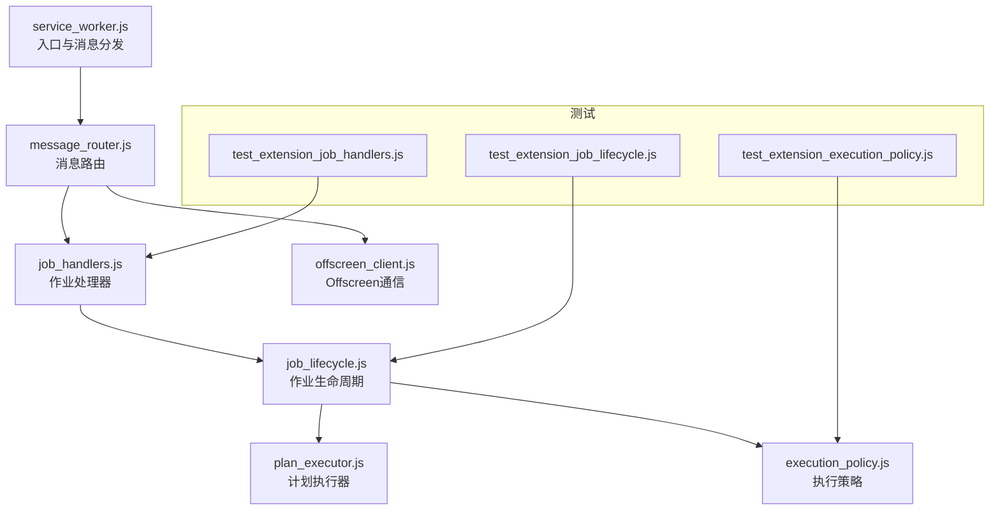
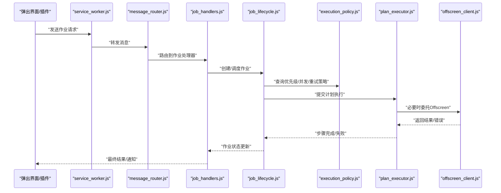
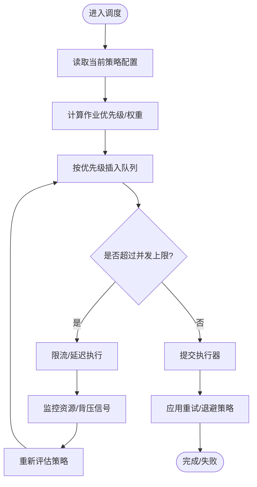
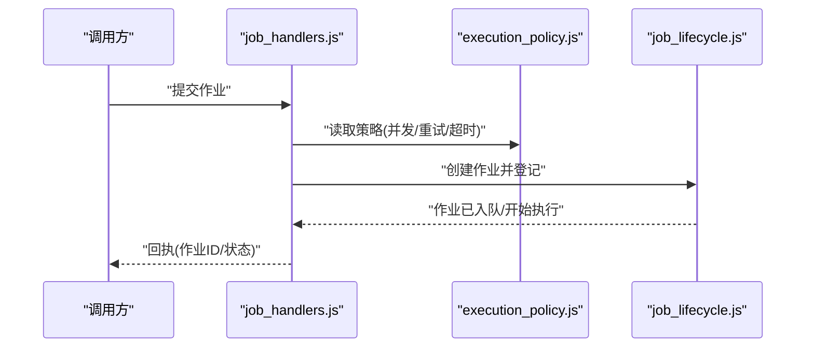
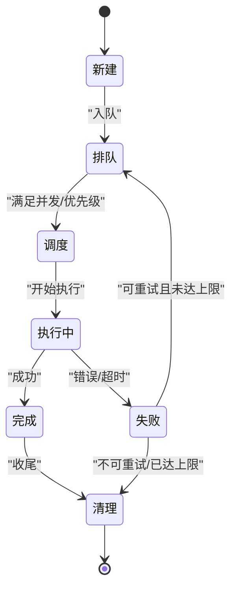
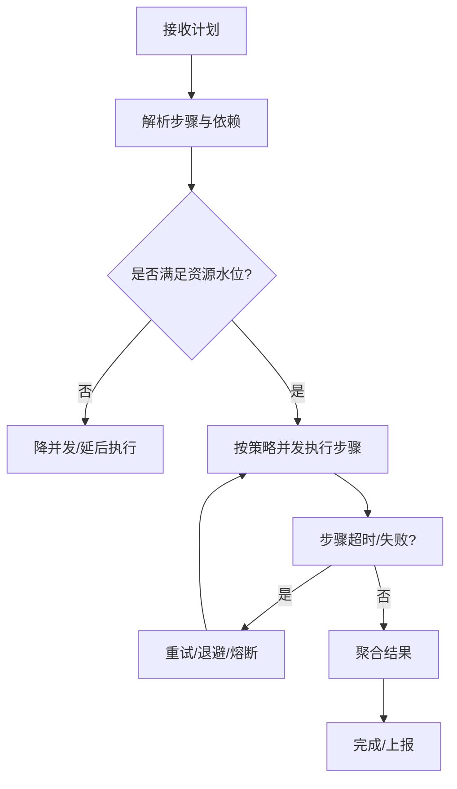
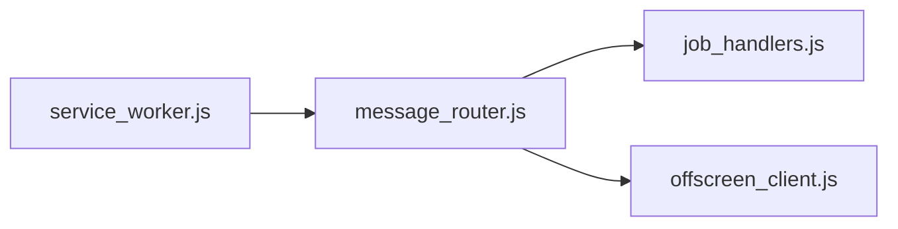
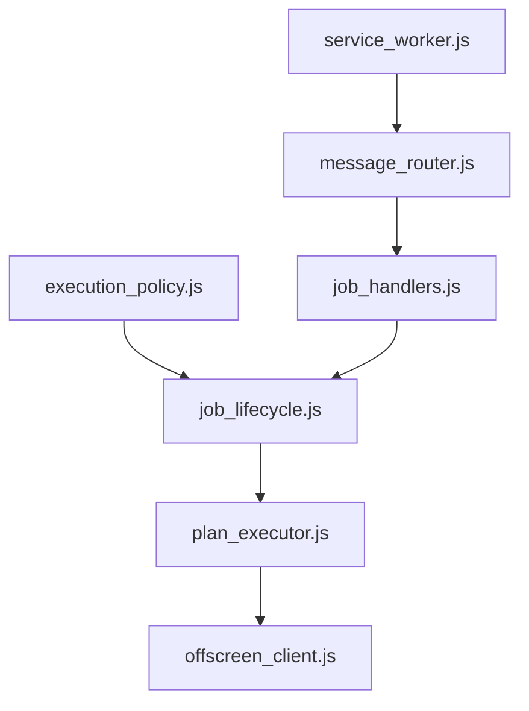

# 作业执行策略

<cite>
**本文引用的文件**   
- [execution_policy.js](file://extension/background/execution_policy.js)
- [job_handlers.js](file://extension/background/job_handlers.js)
- [job_lifecycle.js](file://extension/background/job_lifecycle.js)
- [plan_executor.js](file://extension/background/plan_executor.js)
- [service_worker.js](file://extension/service_worker.js)
- [offscreen_client.js](file://extension/background/offscreen_client.js)
- [message_router.js](file://extension/background/message_router.js)
- [test_extension_execution_policy.js](file://tests/test_extension_execution_policy.js)
- [test_extension_job_handlers.js](file://tests/test_extension_job_handlers.js)
- [test_extension_job_lifecycle.js](file://tests/test_extension_job_lifecycle.js)
</cite>

## 目录
1. [简介](#简介)
2. [项目结构](#项目结构)
3. [核心组件](#核心组件)
4. [架构总览](#架构总览)
5. [详细组件分析](#详细组件分析)
6. [依赖关系分析](#依赖关系分析)
7. [性能考虑](#性能考虑)
8. [故障排查指南](#故障排查指南)
9. [结论](#结论)
10. [附录](#附录)

## 简介
本文件聚焦于“作业执行策略”的设计与实现，围绕以下目标展开：
- 作业调度与优先级管理：不同优先级策略的实现与动态调整机制
- 并发控制策略：线程池（任务队列）管理、资源限制与死锁预防
- 执行容错机制：重试策略、超时处理与异常恢复
- 资源管理机制：内存使用监控、CPU时间片分配与I/O限流
- 配置选项与自定义扩展方法
- 高负载场景下的优化案例与性能调优指南

该文档以浏览器扩展的后台执行环境为背景，结合测试用例对关键路径进行说明，帮助读者理解从消息路由到计划执行的全链路策略。

## 项目结构
与作业执行策略直接相关的代码主要位于 extension/background 目录，并通过 service_worker 作为入口协调 offscreen 页面与后台模块。测试覆盖策略、生命周期与处理器等关键路径。

图表来源
- [service_worker.js](file://extension/service_worker.js)
- [message_router.js](file://extension/background/message_router.js)
- [job_handlers.js](file://extension/background/job_handlers.js)
- [offscreen_client.js](file://extension/background/offscreen_client.js)
- [job_lifecycle.js](file://extension/background/job_lifecycle.js)
- [plan_executor.js](file://extension/background/plan_executor.js)
- [execution_policy.js](file://extension/background/execution_policy.js)
- [test_extension_execution_policy.js](file://tests/test_extension_execution_policy.js)
- [test_extension_job_handlers.js](file://tests/test_extension_job_handlers.js)
- [test_extension_job_lifecycle.js](file://tests/test_extension_job_lifecycle.js)

章节来源
- [service_worker.js](file://extension/service_worker.js)
- [message_router.js](file://extension/background/message_router.js)
- [job_handlers.js](file://extension/background/job_handlers.js)
- [job_lifecycle.js](file://extension/background/job_lifecycle.js)
- [plan_executor.js](file://extension/background/plan_executor.js)
- [execution_policy.js](file://extension/background/execution_policy.js)
- [offscreen_client.js](file://extension/background/offscreen_client.js)
- [test_extension_execution_policy.js](file://tests/test_extension_execution_policy.js)
- [test_extension_job_handlers.js](file://tests/test_extension_job_handlers.js)
- [test_extension_job_lifecycle.js](file://tests/test_extension_job_lifecycle.js)

## 核心组件
- 执行策略（execution_policy.js）：定义优先级策略、并发上限、退避与重试参数、资源配额等；提供动态调整接口。
- 作业处理器（job_handlers.js）：接收并校验作业请求，委派给生命周期与执行器，负责错误上报与结果回传。
- 作业生命周期（job_lifecycle.js）：编排作业的创建、排队、调度、执行、完成与清理；维护状态机与审计日志。
- 计划执行器（plan_executor.js）：将高层计划分解为可执行步骤，按策略顺序与并发度执行，处理中间结果与副作用。
- Offscreen客户端（offscreen_client.js）：与Offscreen页面通信，承载重计算或受限API调用，避免主线程阻塞。
- 消息路由（message_router.js）：统一消息协议与路由表，解耦前端与后台模块。
- Service Worker（service_worker.js）：注册监听、初始化路由、启动必要子进程（如Offscreen）。

章节来源
- [execution_policy.js](file://extension/background/execution_policy.js)
- [job_handlers.js](file://extension/background/job_handlers.js)
- [job_lifecycle.js](file://extension/background/job_lifecycle.js)
- [plan_executor.js](file://extension/background/plan_executor.js)
- [offscreen_client.js](file://extension/background/offscreen_client.js)
- [message_router.js](file://extension/background/message_router.js)
- [service_worker.js](file://extension/service_worker.js)

## 架构总览
下图展示了从消息到达至作业执行的端到端流程，以及策略在其中的作用点。

图表来源
- [service_worker.js](file://extension/service_worker.js)
- [message_router.js](file://extension/background/message_router.js)
- [job_handlers.js](file://extension/background/job_handlers.js)
- [job_lifecycle.js](file://extension/background/job_lifecycle.js)
- [execution_policy.js](file://extension/background/execution_policy.js)
- [plan_executor.js](file://extension/background/plan_executor.js)
- [offscreen_client.js](file://extension/background/offscreen_client.js)

## 详细组件分析

### 执行策略（优先级与动态调整）
- 优先级策略
  - 支持多级别优先级（例如紧急、高、普通、低），在入队时根据策略决定插入位置。
  - 支持基于权重或分数的动态排序，允许运行时调整权重以改变相对优先级。
- 并发控制
  - 全局并发上限与按类型隔离的并发上限，防止热点作业抢占资源。
  - 令牌桶/滑动窗口限流，平滑突发流量。
- 重试与退避
  - 指数退避与抖动，避免雪崩；最大重试次数与可配置的最大等待时长。
- 资源配额
  - 内存占用阈值、CPU时间片上限、I/O速率限制；超限则降级或暂停非关键作业。
- 动态调整
  - 提供运行时接口更新策略参数（如并发上限、重试次数、优先级权重），无需重启。
- 可观测性
  - 暴露指标：队列长度、平均等待时间、吞吐、失败率、重试次数分布等。

图表来源
- [execution_policy.js](file://extension/background/execution_policy.js)
- [job_lifecycle.js](file://extension/background/job_lifecycle.js)
- [plan_executor.js](file://extension/background/plan_executor.js)

章节来源
- [execution_policy.js](file://extension/background/execution_policy.js)
- [test_extension_execution_policy.js](file://tests/test_extension_execution_policy.js)

### 作业处理器（请求接入与错误上报）
- 职责
  - 解析与校验作业请求，生成唯一ID，写入持久化存储（若需要）。
  - 根据策略选择执行通道（同步/异步/Offscreen）。
  - 捕获异常并转换为标准错误码，记录审计日志。
- 与策略集成
  - 通过策略对象获取并发上限、重试次数、超时时间等。
- 与生命周期协作
  - 创建作业实例后，交由生命周期编排后续阶段。

图表来源
- [job_handlers.js](file://extension/background/job_handlers.js)
- [execution_policy.js](file://extension/background/execution_policy.js)
- [job_lifecycle.js](file://extension/background/job_lifecycle.js)

章节来源
- [job_handlers.js](file://extension/background/job_handlers.js)
- [test_extension_job_handlers.js](file://tests/test_extension_job_handlers.js)

### 作业生命周期（状态机与编排）
- 状态流转
  - 新建 -> 排队 -> 调度 -> 执行中 -> 完成/失败 -> 清理
- 关键点
  - 入队与出队遵循策略的优先级与并发约束。
  - 执行前检查资源水位，必要时推迟或取消。
  - 执行失败触发重试与退避；达到上限则转入失败态并告警。
  - 完成后清理临时资源，释放句柄与缓存。
- 与执行器交互
  - 将计划拆分为步骤，逐个或批量提交给执行器，聚合结果。

图表来源
- [job_lifecycle.js](file://extension/background/job_lifecycle.js)
- [plan_executor.js](file://extension/background/plan_executor.js)
- [execution_policy.js](file://extension/background/execution_policy.js)

章节来源
- [job_lifecycle.js](file://extension/background/job_lifecycle.js)
- [test_extension_job_lifecycle.js](file://tests/test_extension_job_lifecycle.js)

### 计划执行器（步骤执行与资源治理）
- 计划到步骤
  - 将高层计划解析为有序/有向无环的步骤图，识别依赖关系。
- 执行模型
  - 支持串行、扇出并行、受控并行（按策略上限）。
  - 步骤级超时与整体作业超时双重保护。
- 资源治理
  - 内存水位检测：超过阈值则降低并发或暂停非关键步骤。
  - CPU时间片：长耗时步骤采用分片执行，避免长时间独占事件循环。
  - I/O限流：对网络/磁盘访问进行速率限制与批量化合并。
- Offscreen协同
  - 将重型计算或受限API调用委托至Offscreen页面，避免主线程阻塞。

图表来源
- [plan_executor.js](file://extension/background/plan_executor.js)
- [offscreen_client.js](file://extension/background/offscreen_client.js)
- [execution_policy.js](file://extension/background/execution_policy.js)

章节来源
- [plan_executor.js](file://extension/background/plan_executor.js)
- [offscreen_client.js](file://extension/background/offscreen_client.js)

### 消息路由与服务入口
- 服务入口（service_worker.js）
  - 注册消息监听，初始化路由表，按需启动Offscreen页面。
- 消息路由（message_router.js）
  - 统一协议格式，按命名空间与动作分发到对应处理器。
  - 提供鉴权、限流与审计钩子。

图表来源
- [service_worker.js](file://extension/service_worker.js)
- [message_router.js](file://extension/background/message_router.js)
- [job_handlers.js](file://extension/background/job_handlers.js)
- [offscreen_client.js](file://extension/background/offscreen_client.js)

章节来源
- [service_worker.js](file://extension/service_worker.js)
- [message_router.js](file://extension/background/message_router.js)

## 依赖关系分析
- 松耦合设计
  - 处理器与生命周期通过策略对象解耦，便于替换策略实现。
  - 执行器与生命周期通过明确的接口契约交互，屏蔽具体执行细节。
- 外部依赖
  - Offscreen页面用于重计算与受限API调用，需确保其可用性与健康检查。
- 潜在风险
  - 循环依赖：应通过接口抽象与事件总线避免直接循环引用。
  - 单点瓶颈：消息路由与策略中心需具备水平扩展能力（在多Worker场景下）。

图表来源
- [execution_policy.js](file://extension/background/execution_policy.js)
- [job_lifecycle.js](file://extension/background/job_lifecycle.js)
- [plan_executor.js](file://extension/background/plan_executor.js)
- [job_handlers.js](file://extension/background/job_handlers.js)
- [message_router.js](file://extension/background/message_router.js)
- [service_worker.js](file://extension/service_worker.js)
- [offscreen_client.js](file://extension/background/offscreen_client.js)

章节来源
- [execution_policy.js](file://extension/background/execution_policy.js)
- [job_lifecycle.js](file://extension/background/job_lifecycle.js)
- [plan_executor.js](file://extension/background/plan_executor.js)
- [job_handlers.js](file://extension/background/job_handlers.js)
- [message_router.js](file://extension/background/message_router.js)
- [service_worker.js](file://extension/service_worker.js)
- [offscreen_client.js](file://extension/background/offscreen_client.js)

## 性能考虑
- 高负载场景优化
  - 自适应并发：根据系统负载（CPU、内存、I/O）动态调整并发上限。
  - 优先级抢占：紧急作业可中断低优先级任务的空闲槽位，但避免频繁上下文切换。
  - 批处理与合并：对相似I/O操作进行批量化，减少握手与序列化开销。
  - 背压与丢弃：当队列深度超过阈值，优先丢弃低优先级作业或拒绝新请求。
- 资源治理
  - 内存：设置堆大小阈值，触发GC后仍不达标则暂停非关键作业。
  - CPU：长任务分片执行，配合时间片轮转，保证响应性。
  - I/O：令牌桶限流，跨作业共享令牌，避免热点资源争用。
- 可观测性
  - 采集关键指标：队列长度、P95/P99延迟、吞吐、失败率、重试次数、资源水位。
  - 告警规则：当关键指标越界时自动扩容或降级。

[本节为通用指导，不涉及具体文件分析]

## 故障排查指南
- 常见问题定位
  - 作业堆积：检查策略的并发上限与优先级权重，确认是否存在热点作业导致饥饿。
  - 频繁重试：查看重试次数与退避参数，确认是否为瞬时错误还是系统性问题。
  - 超时频发：核对步骤与作业级超时配置，检查依赖服务的SLA与网络质量。
  - 内存泄漏：关注长期运行作业的资源释放路径，验证清理逻辑是否被触发。
- 诊断手段
  - 启用审计日志与指标导出，关联作业ID追踪全链路。
  - 使用Offscreen页面的独立日志，区分主线程与子进程问题。
  - 模拟高负载压测，观察策略自适应效果与瓶颈点。

章节来源
- [test_extension_execution_policy.js](file://tests/test_extension_execution_policy.js)
- [test_extension_job_handlers.js](file://tests/test_extension_job_handlers.js)
- [test_extension_job_lifecycle.js](file://tests/test_extension_job_lifecycle.js)

## 结论
本方案通过“策略驱动+生命周期编排+执行器治理”的分层设计，实现了可扩展的作业执行体系。优先级与并发控制由策略集中管理，生命周期负责状态与编排，执行器专注步骤执行与资源治理。配合Offscreen协同与完善的可观测性，可在高负载环境下保持稳定性与响应性。建议在生产环境中持续收集指标，结合业务特征微调策略参数，并定期演练故障恢复流程。

[本节为总结性内容，不涉及具体文件分析]

## 附录
- 配置项建议
  - 优先级权重映射、并发上限（全局/按类型）、重试次数与退避系数、超时时间（步骤/作业）、资源阈值（内存/CPU/I/O）、队列容量与丢弃策略。
- 扩展点
  - 自定义优先级函数、自定义限流器、自定义资源监控器、自定义重试策略与熔断器。
- 最佳实践
  - 小步快跑：将大计划拆分为细粒度步骤，提升可观测性与可恢复性。
  - 幂等设计：步骤与作业尽量幂等，便于重试与补偿。
  - 优雅降级：在资源紧张时主动放弃低价值工作，保障核心路径。

[本节为补充信息，不涉及具体文件分析]