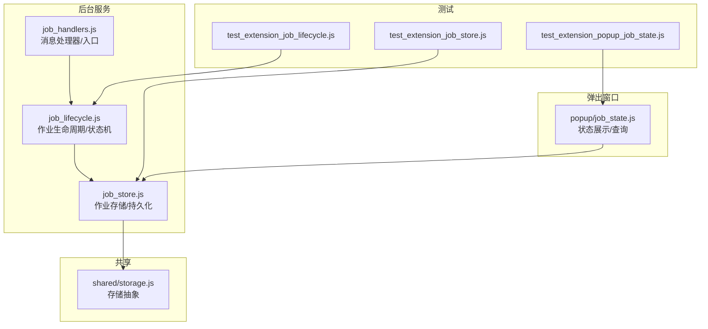
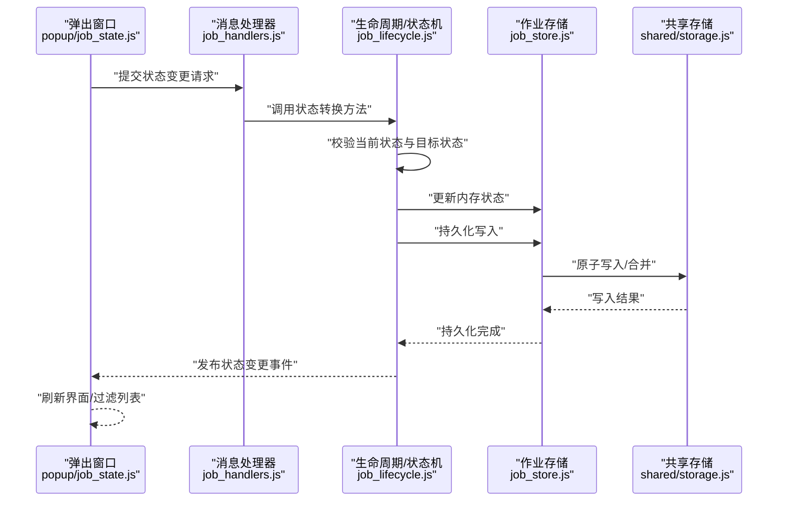
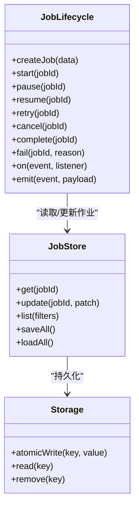
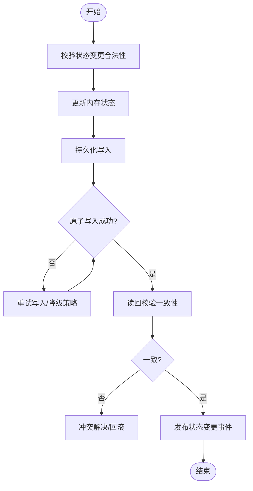
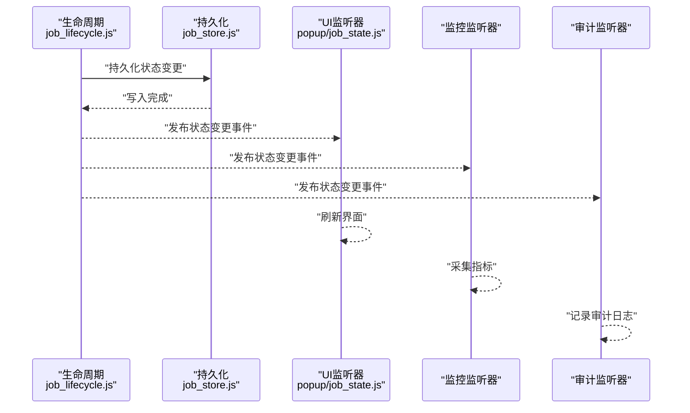
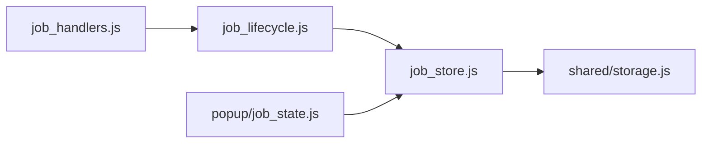

# 作业状态机设计

<cite>
**本文引用的文件**   
- [extension/background/job_lifecycle.js](file://extension/background/job_lifecycle.js)
- [extension/background/job_store.js](file://extension/background/job_store.js)
- [extension/background/job_handlers.js](file://extension/background/job_handlers.js)
- [extension/popup/job_state.js](file://extension/popup/job_state.js)
- [extension/shared/storage.js](file://extension/shared/storage.js)
- [tests/test_extension_job_lifecycle.js](file://tests/test_extension_job_lifecycle.js)
- [tests/test_extension_job_store.js](file://tests/test_extension_job_store.js)
- [tests/test_extension_popup_job_state.js](file://tests/test_extension_popup_job_state.js)
</cite>

## 目录
1. [简介](#简介)
2. [项目结构](#项目结构)
3. [核心组件](#核心组件)
4. [架构总览](#架构总览)
5. [详细组件分析](#详细组件分析)
6. [依赖关系分析](#依赖关系分析)
7. [性能考虑](#性能考虑)
8. [故障排查指南](#故障排查指南)
9. [结论](#结论)
10. [附录](#附录)

## 简介
本文件围绕“作业状态机”的设计与实现进行系统化说明，覆盖以下方面：
- 状态模型定义与转换规则
- 内存与磁盘状态的持久化与同步策略
- 状态验证与一致性保证
- 事件驱动与监听器模式在状态变更中的应用
- 状态查询与过滤的API接口说明
- 复杂转换场景处理示例与错误恢复策略

该文档面向不同技术背景的读者，既提供高层概览，也深入到代码级细节与可视化图示。

## 项目结构
与作业状态机相关的核心模块位于扩展后台（background）与弹出窗口（popup），并辅以共享存储与测试用例：
- background 层负责作业生命周期、状态机流转、持久化与消息路由
- popup 层提供状态展示与用户交互
- shared 层提供通用存储抽象
- tests 层覆盖关键路径与边界条件

图表来源
- [extension/background/job_lifecycle.js](file://extension/background/job_lifecycle.js)
- [extension/background/job_store.js](file://extension/background/job_store.js)
- [extension/background/job_handlers.js](file://extension/background/job_handlers.js)
- [extension/popup/job_state.js](file://extension/popup/job_state.js)
- [extension/shared/storage.js](file://extension/shared/storage.js)
- [tests/test_extension_job_lifecycle.js](file://tests/test_extension_job_lifecycle.js)
- [tests/test_extension_job_store.js](file://tests/test_extension_job_store.js)
- [tests/test_extension_popup_job_state.js](file://tests/test_extension_popup_job_state.js)

章节来源
- [extension/background/job_lifecycle.js](file://extension/background/job_lifecycle.js)
- [extension/background/job_store.js](file://extension/background/job_store.js)
- [extension/background/job_handlers.js](file://extension/background/job_handlers.js)
- [extension/popup/job_state.js](file://extension/popup/job_state.js)
- [extension/shared/storage.js](file://extension/shared/storage.js)
- [tests/test_extension_job_lifecycle.js](file://tests/test_extension_job_lifecycle.js)
- [tests/test_extension_job_store.js](file://tests/test_extension_job_store.js)
- [tests/test_extension_popup_job_state.js](file://tests/test_extension_popup_job_state.js)

## 核心组件
- 作业生命周期与状态机（job_lifecycle.js）
  - 职责：维护作业状态、执行合法转换、触发事件、协调持久化
- 作业存储（job_store.js）
  - 职责：提供作业的增删改查、事务性写入、版本与校验、与底层存储对接
- 消息处理器（job_handlers.js）
  - 职责：接收外部请求（如创建、暂停、重试、取消等），委派给生命周期与存储
- 弹出窗口状态视图（popup/job_state.js）
  - 职责：订阅状态变更、渲染UI、提供查询与过滤能力
- 共享存储抽象（shared/storage.js）
  - 职责：封装浏览器存储或离线存储，提供原子读写与一致性保障

章节来源
- [extension/background/job_lifecycle.js](file://extension/background/job_lifecycle.js)
- [extension/background/job_store.js](file://extension/background/job_store.js)
- [extension/background/job_handlers.js](file://extension/background/job_handlers.js)
- [extension/popup/job_state.js](file://extension/popup/job_state.js)
- [extension/shared/storage.js](file://extension/shared/storage.js)

## 架构总览
下图展示了从外部调用到状态变更落盘的完整链路，以及事件分发与监听机制。

图表来源
- [extension/background/job_handlers.js](file://extension/background/job_handlers.js)
- [extension/background/job_lifecycle.js](file://extension/background/job_lifecycle.js)
- [extension/background/job_store.js](file://extension/background/job_store.js)
- [extension/popup/job_state.js](file://extension/popup/job_state.js)
- [extension/shared/storage.js](file://extension/shared/storage.js)

## 详细组件分析

### 状态模型与转换规则
- 状态集合
  - 待处理：作业已创建但未开始执行
  - 运行中：作业正在执行任务
  - 暂停：作业被主动暂停，可恢复
  - 失败：作业执行出现异常，需人工或自动重试
  - 成功：作业顺利完成
  - 取消：作业被取消，不可恢复
- 转换规则（示例）
  - 待处理 → 运行中：启动执行
  - 运行中 → 暂停：收到暂停指令
  - 暂停 → 运行中：恢复执行
  - 运行中 → 失败：执行异常或断言失败
  - 失败 → 运行中：重试成功
  - 任意终态前 → 取消：收到取消指令
  - 运行中 → 成功：正常结束
- 约束与不变式
  - 终态（成功、取消）不可再转换
  - 失败仅在允许的重试窗口内可转回运行中
  - 同一时刻仅允许一个活跃转换，避免并发冲突

章节来源
- [extension/background/job_lifecycle.js](file://extension/background/job_lifecycle.js)
- [tests/test_extension_job_lifecycle.js](file://tests/test_extension_job_lifecycle.js)

#### 状态机类图

图表来源
- [extension/background/job_lifecycle.js](file://extension/background/job_lifecycle.js)
- [extension/background/job_store.js](file://extension/background/job_store.js)
- [extension/shared/storage.js](file://extension/shared/storage.js)

### 持久化与同步策略
- 内存状态
  - 运行时由 job_lifecycle.js 维护，提供快速访问与转换校验
- 磁盘状态
  - 通过 job_store.js 统一写入，使用 shared/storage.js 提供的原子写入能力
- 同步策略
  - 写后读确认：每次状态变更后立即读取并校验一致
  - 幂等写入：基于版本号或时间戳合并，避免覆盖
  - 批量落盘：对高频变更采用批处理，降低IO压力
  - 崩溃恢复：启动时加载磁盘快照，重建内存状态

章节来源
- [extension/background/job_store.js](file://extension/background/job_store.js)
- [extension/shared/storage.js](file://extension/shared/storage.js)
- [tests/test_extension_job_store.js](file://tests/test_extension_job_store.js)

#### 持久化流程图

图表来源
- [extension/background/job_lifecycle.js](file://extension/background/job_lifecycle.js)
- [extension/background/job_store.js](file://extension/background/job_store.js)
- [extension/shared/storage.js](file://extension/shared/storage.js)

### 状态验证与一致性保证
- 前置校验
  - 检查当前状态是否允许目标转换
  - 检查业务约束（如重试次数上限、超时窗口）
- 并发控制
  - 单作业串行化处理，避免重复转换
  - 使用锁或队列确保顺序性
- 数据一致性
  - 写入后读校验，必要时触发补偿操作
  - 记录变更审计日志，便于回溯

章节来源
- [extension/background/job_lifecycle.js](file://extension/background/job_lifecycle.js)
- [extension/background/job_store.js](file://extension/background/job_store.js)

### 事件驱动与监听器模式
- 事件类型
  - 状态变更事件：包含作业ID、旧状态、新状态、时间戳
  - 错误事件：包含错误码、错误信息、上下文
- 监听器
  - UI 监听器：刷新界面、高亮变化
  - 统计监听器：收集指标、上报监控
  - 审计监听器：记录变更轨迹
- 发布订阅
  - 生命周期模块作为发布者，各监听器按需订阅
  - 支持一次性监听与长期订阅

章节来源
- [extension/background/job_lifecycle.js](file://extension/background/job_lifecycle.js)
- [extension/popup/job_state.js](file://extension/popup/job_state.js)

#### 事件流时序图

图表来源
- [extension/background/job_lifecycle.js](file://extension/background/job_lifecycle.js)
- [extension/popup/job_state.js](file://extension/popup/job_state.js)

### 状态查询与过滤API
- 查询接口
  - 按ID获取作业详情
  - 按状态过滤列表
  - 按时间范围、标签、优先级筛选
- 过滤能力
  - 多条件组合（AND/OR）
  - 分页与排序
- 返回结构
  - 作业基础信息
  - 状态与元数据
  - 最近变更时间与原因

章节来源
- [extension/popup/job_state.js](file://extension/popup/job_state.js)
- [extension/background/job_store.js](file://extension/background/job_store.js)

### 复杂转换场景与错误恢复
- 场景示例
  - 并发暂停与重试：通过队列串行化，保证最终一致
  - 长时间失败后的自动重试：引入退避策略与最大重试次数
  - 中断恢复：进程重启后从磁盘快照恢复内存状态
- 错误恢复策略
  - 幂等操作：相同输入多次执行结果一致
  - 补偿事务：失败时回滚部分变更
  - 降级与熔断：当存储不可用时，缓存本地并在可用后同步

章节来源
- [extension/background/job_lifecycle.js](file://extension/background/job_lifecycle.js)
- [extension/background/job_store.js](file://extension/background/job_store.js)
- [tests/test_extension_job_lifecycle.js](file://tests/test_extension_job_lifecycle.js)
- [tests/test_extension_job_store.js](file://tests/test_extension_job_store.js)

## 依赖关系分析
- 耦合度
  - 生命周期与存储解耦，通过接口调用，便于替换实现
  - 事件系统松耦合，监听器可独立扩展
- 外部依赖
  - shared/storage.js 屏蔽底层存储差异，提升可移植性
- 潜在循环依赖
  - 通过分层与事件解耦避免循环引用

图表来源
- [extension/background/job_lifecycle.js](file://extension/background/job_lifecycle.js)
- [extension/background/job_store.js](file://extension/background/job_store.js)
- [extension/popup/job_state.js](file://extension/popup/job_state.js)
- [extension/background/job_handlers.js](file://extension/background/job_handlers.js)
- [extension/shared/storage.js](file://extension/shared/storage.js)

章节来源
- [extension/background/job_lifecycle.js](file://extension/background/job_lifecycle.js)
- [extension/background/job_store.js](file://extension/background/job_store.js)
- [extension/popup/job_state.js](file://extension/popup/job_state.js)
- [extension/background/job_handlers.js](file://extension/background/job_handlers.js)
- [extension/shared/storage.js](file://extension/shared/storage.js)

## 性能考虑
- 减少不必要的持久化：合并频繁变更，批量写入
- 索引优化：为常用查询字段建立索引
- 懒加载：只加载必要字段，按需展开详情
- 事件节流：对高频事件进行节流与去抖，避免UI抖动

[本节为通用指导，不直接分析具体文件]

## 故障排查指南
- 常见问题
  - 状态不一致：检查持久化写入与读回校验逻辑
  - 事件丢失：确认监听器注册时机与订阅范围
  - 并发冲突：检查串行化队列与锁机制
- 诊断手段
  - 启用审计日志，追踪状态变更链
  - 增加断点与中间状态打印
  - 使用测试用例复现问题路径

章节来源
- [extension/background/job_lifecycle.js](file://extension/background/job_lifecycle.js)
- [extension/background/job_store.js](file://extension/background/job_store.js)
- [tests/test_extension_job_lifecycle.js](file://tests/test_extension_job_lifecycle.js)
- [tests/test_extension_job_store.js](file://tests/test_extension_job_store.js)

## 结论
本设计通过清晰的状态模型、严格的转换规则、健壮的持久化与一致性保障、以及事件驱动的监听机制，构建了可扩展且可靠的作业状态机。配合完善的查询与过滤API，能够支撑复杂的业务场景与高并发需求。建议在生产环境中持续完善监控与审计，以进一步提升可观测性与可维护性。

[本节为总结性内容，不直接分析具体文件]

## 附录
- 术语表
  - 作业：一次可编排、可执行的任务单元
  - 状态：作业在生命周期中的阶段标识
  - 转换：从一个状态到另一个状态的有界行为
  - 持久化：将内存状态保存到磁盘的过程
  - 事件：状态变更产生的通知信号
- 参考测试
  - 生命周期测试：验证状态转换与事件发布
  - 存储测试：验证持久化与一致性
  - 弹出窗口测试：验证查询与过滤能力

章节来源
- [tests/test_extension_job_lifecycle.js](file://tests/test_extension_job_lifecycle.js)
- [tests/test_extension_job_store.js](file://tests/test_extension_job_store.js)
- [tests/test_extension_popup_job_state.js](file://tests/test_extension_popup_job_state.js)