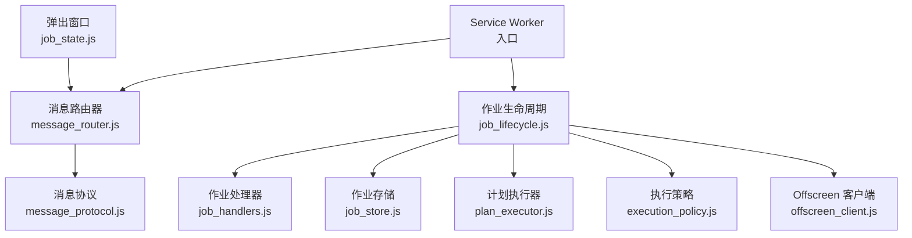
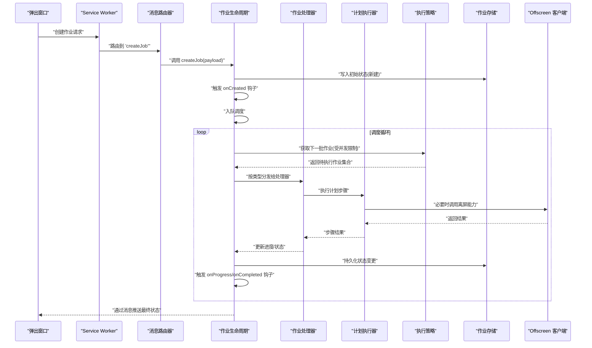
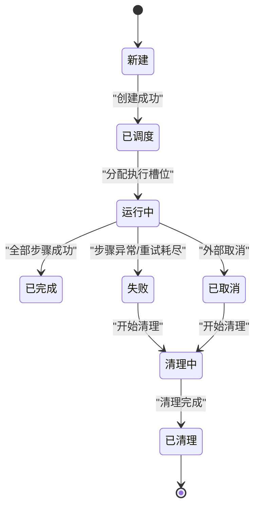
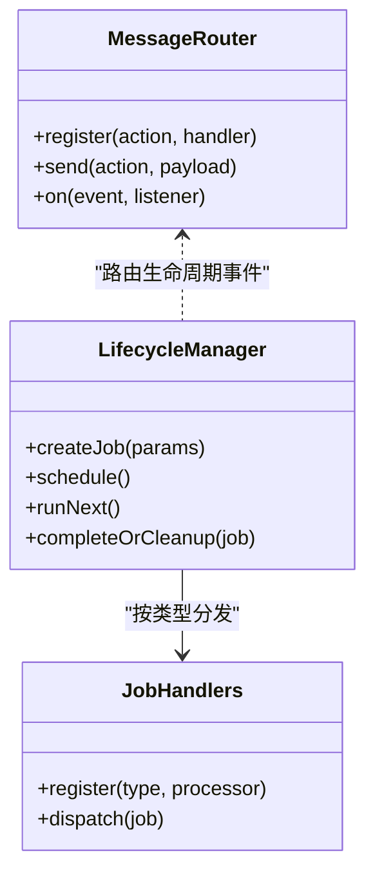
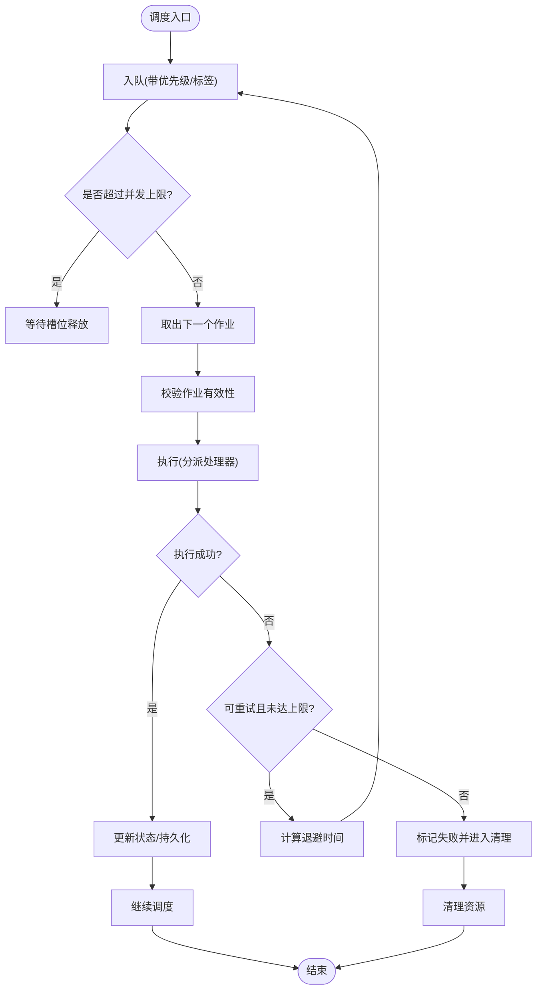
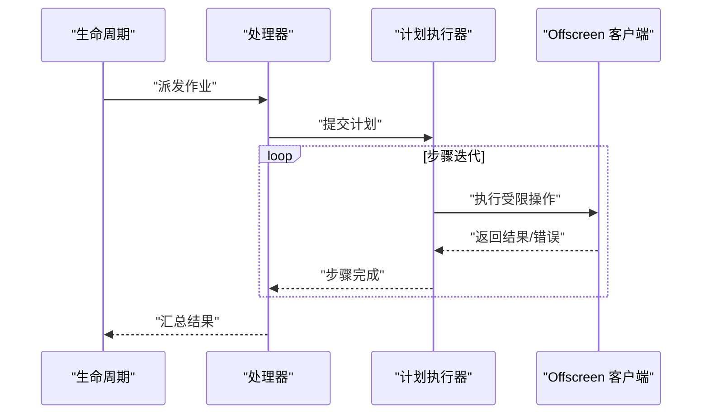
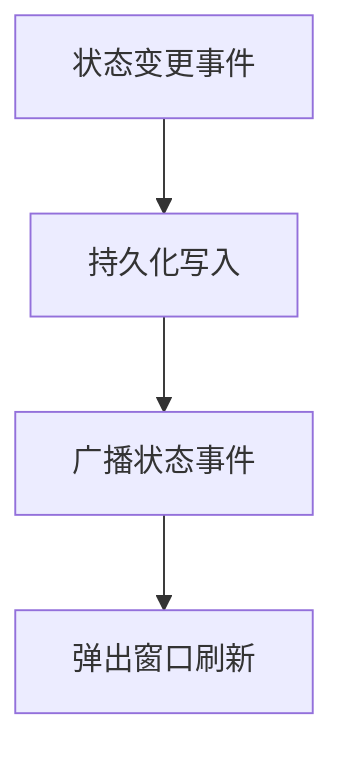
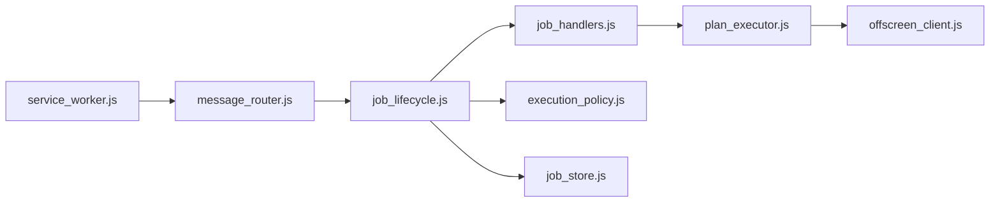

# 作业生命周期管理

<cite>
**本文引用的文件**   
- [service_worker.js](file://extension/service_worker.js)
- [job_lifecycle.js](file://extension/background/job_lifecycle.js)
- [job_handlers.js](file://extension/background/job_handlers.js)
- [job_store.js](file://extension/background/job_store.js)
- [message_router.js](file://extension/background/message_router.js)
- [plan_executor.js](file://extension/background/plan_executor.js)
- [execution_policy.js](file://extension/background/execution_policy.js)
- [offscreen_client.js](file://extension/background/offscreen_client.js)
- [message_protocol.js](file://extension/shared/message_protocol.js)
- [job_state.js](file://extension/popup/job_state.js)
- [test_extension_job_lifecycle.js](file://tests/test_extension_job_lifecycle.js)
- [test_extension_job_handlers.js](file://tests/test_extension_job_handlers.js)
- [test_extension_message_router.js](file://tests/test_extension_message_router.js)
</cite>

## 目录
1. [简介](#简介)
2. [项目结构](#项目结构)
3. [核心组件](#核心组件)
4. [架构总览](#架构总览)
5. [详细组件分析](#详细组件分析)
6. [依赖关系分析](#依赖关系分析)
7. [性能与并发控制](#性能与并发控制)
8. [监控与调试](#监控与调试)
9. [故障排查指南](#故障排查指南)
10. [结论](#结论)
11. [附录：示例与最佳实践](#附录示例与最佳实践)

## 简介
本文件围绕“作业生命周期管理”展开，系统化阐述作业的创建、初始化、调度、执行、完成与清理各阶段；解释处理器注册与消息路由机制；说明异步作业调度的实现原理（任务队列与并发控制）；并提供监控、调试方法以及典型使用模式。文档面向不同技术背景的读者，既提供高层概览，也给出代码级映射与图示。

## 项目结构
本项目在浏览器扩展的 Service Worker 中承载作业系统，背景脚本负责作业生命周期、持久化、调度与执行，弹出窗口用于状态展示与交互，共享模块定义消息协议。

图表来源
- [service_worker.js](file://extension/service_worker.js)
- [message_router.js](file://extension/background/message_router.js)
- [job_lifecycle.js](file://extension/background/job_lifecycle.js)
- [job_handlers.js](file://extension/background/job_handlers.js)
- [job_store.js](file://extension/background/job_store.js)
- [plan_executor.js](file://extension/background/plan_executor.js)
- [execution_policy.js](file://extension/background/execution_policy.js)
- [offscreen_client.js](file://extension/background/offscreen_client.js)
- [message_protocol.js](file://extension/shared/message_protocol.js)
- [job_state.js](file://extension/popup/job_state.js)

章节来源
- [service_worker.js](file://extension/service_worker.js)
- [message_router.js](file://extension/background/message_router.js)
- [job_lifecycle.js](file://extension/background/job_lifecycle.js)
- [job_handlers.js](file://extension/background/job_handlers.js)
- [job_store.js](file://extension/background/job_store.js)
- [plan_executor.js](file://extension/background/plan_executor.js)
- [execution_policy.js](file://extension/background/execution_policy.js)
- [offscreen_client.js](file://extension/background/offscreen_client.js)
- [message_protocol.js](file://extension/shared/message_protocol.js)
- [job_state.js](file://extension/popup/job_state.js)

## 核心组件
- 作业生命周期管理器：负责作业从创建到清理的全流程编排，维护状态机与钩子。
- 作业处理器注册表：按类型分发作业到具体处理逻辑。
- 消息路由器：统一接收/转发跨上下文消息，解耦调用方与被调用方。
- 作业存储：持久化作业元数据与状态变更事件。
- 计划执行器：将高层计划分解为可执行步骤并驱动执行。
- 执行策略：控制并发度、重试、超时等执行约束。
- Offscreen 客户端：与离屏页面通信以执行受限操作。
- 弹出窗口状态视图：订阅作业状态变化，供用户界面展示。

章节来源
- [job_lifecycle.js](file://extension/background/job_lifecycle.js)
- [job_handlers.js](file://extension/background/job_handlers.js)
- [message_router.js](file://extension/background/message_router.js)
- [job_store.js](file://extension/background/job_store.js)
- [plan_executor.js](file://extension/background/plan_executor.js)
- [execution_policy.js](file://extension/background/execution_policy.js)
- [offscreen_client.js](file://extension/background/offscreen_client.js)
- [job_state.js](file://extension/popup/job_state.js)

## 架构总览
下图展示了作业从创建到完成的端到端路径，包括消息路由、生命周期编排、处理器分发、执行与持久化。

图表来源
- [service_worker.js](file://extension/service_worker.js)
- [message_router.js](file://extension/background/message_router.js)
- [job_lifecycle.js](file://extension/background/job_lifecycle.js)
- [job_handlers.js](file://extension/background/job_handlers.js)
- [plan_executor.js](file://extension/background/plan_executor.js)
- [execution_policy.js](file://extension/background/execution_policy.js)
- [job_store.js](file://extension/background/job_store.js)
- [offscreen_client.js](file://extension/background/offscreen_client.js)

## 详细组件分析

### 作业生命周期状态机与阶段
- 状态集合：新建、已调度、运行中、已完成、失败、已取消、清理中、已清理。
- 关键阶段
  - 创建：校验输入、生成 ID、落库、触发 onCreated。
  - 初始化：解析参数、准备上下文、预检查资源。
  - 调度：根据策略入队，等待执行槽位。
  - 执行：按处理器类型分发，逐步推进计划步骤。
  - 完成：汇总结果、持久化、触发 onCompleted。
  - 清理：释放资源、归档日志、触发 onCleaned。
- 转换规则
  - 新建 → 已调度：创建后进入调度队列。
  - 已调度 → 运行中：获得执行槽位并开始执行。
  - 运行中 → 已完成/失败/已取消：依据执行结果或外部指令。
  - 失败/已取消 → 清理中 → 已清理：进行收尾工作。

图表来源
- [job_lifecycle.js](file://extension/background/job_lifecycle.js)
- [job_store.js](file://extension/background/job_store.js)

章节来源
- [job_lifecycle.js](file://extension/background/job_lifecycle.js)
- [job_store.js](file://extension/background/job_store.js)

### 处理器注册与消息路由
- 处理器注册
  - 支持按作业类型动态注册处理器。
  - 注册时绑定类型到处理函数，并可选配置优先级/限流。
- 消息路由
  - 基于统一协议的消息通道，由路由器按动作名分发。
  - 支持跨上下文（如弹出窗口与 Service Worker）通信。
  - 错误与超时在路由器层统一捕获并回传。

图表来源
- [message_router.js](file://extension/background/message_router.js)
- [job_handlers.js](file://extension/background/job_handlers.js)
- [job_lifecycle.js](file://extension/background/job_lifecycle.js)

章节来源
- [message_router.js](file://extension/background/message_router.js)
- [job_handlers.js](file://extension/background/job_handlers.js)
- [job_lifecycle.js](file://extension/background/job_lifecycle.js)

### 异步调度与任务队列
- 任务队列
  - 先进先出为主，支持按策略重排（如优先级）。
  - 队列容量上限与背压策略防止内存膨胀。
- 并发控制
  - 全局最大并发数由执行策略决定。
  - 每类作业可设置独立并发上限。
- 重试与退避
  - 指数退避与最大重试次数。
  - 失败分类：可重试/不可重试。
- 超时与取消
  - 单步超时、整体作业超时。
  - 支持外部取消信号传播至执行器。

图表来源
- [job_lifecycle.js](file://extension/background/job_lifecycle.js)
- [execution_policy.js](file://extension/background/execution_policy.js)
- [job_store.js](file://extension/background/job_store.js)

章节来源
- [job_lifecycle.js](file://extension/background/job_lifecycle.js)
- [execution_policy.js](file://extension/background/execution_policy.js)
- [job_store.js](file://extension/background/job_store.js)

### 计划执行器与离屏能力
- 计划执行器
  - 将高层计划拆解为步骤序列。
  - 支持步骤间依赖、条件分支与聚合结果。
- 离屏能力
  - 通过 Offscreen 客户端访问受限 API。
  - 失败时回退或上报错误，保证主流程健壮性。

图表来源
- [plan_executor.js](file://extension/background/plan_executor.js)
- [offscreen_client.js](file://extension/background/offscreen_client.js)
- [job_handlers.js](file://extension/background/job_handlers.js)
- [job_lifecycle.js](file://extension/background/job_lifecycle.js)

章节来源
- [plan_executor.js](file://extension/background/plan_executor.js)
- [offscreen_client.js](file://extension/background/offscreen_client.js)
- [job_handlers.js](file://extension/background/job_handlers.js)
- [job_lifecycle.js](file://extension/background/job_lifecycle.js)

### 持久化与状态同步
- 作业存储
  - 记录作业元数据、状态、进度、错误信息。
  - 支持增量更新与快照。
- 状态同步
  - 生命周期变更事件广播给监听者（如弹出窗口）。
  - 确保 UI 与后台一致。

图表来源
- [job_store.js](file://extension/background/job_store.js)
- [job_state.js](file://extension/popup/job_state.js)
- [message_router.js](file://extension/background/message_router.js)

章节来源
- [job_store.js](file://extension/background/job_store.js)
- [job_state.js](file://extension/popup/job_state.js)
- [message_router.js](file://extension/background/message_router.js)

## 依赖关系分析
- 低耦合设计
  - 消息路由器作为中心总线，降低直接调用耦合。
  - 处理器注册表与生命周期解耦，便于扩展新作业类型。
- 关键依赖链
  - Service Worker 启动后注册路由与生命周期。
  - 生命周期依赖执行策略与存储。
  - 执行器依赖 Offscreen 客户端。

图表来源
- [service_worker.js](file://extension/service_worker.js)
- [message_router.js](file://extension/background/message_router.js)
- [job_lifecycle.js](file://extension/background/job_lifecycle.js)
- [job_handlers.js](file://extension/background/job_handlers.js)
- [execution_policy.js](file://extension/background/execution_policy.js)
- [job_store.js](file://extension/background/job_store.js)
- [plan_executor.js](file://extension/background/plan_executor.js)
- [offscreen_client.js](file://extension/background/offscreen_client.js)

章节来源
- [service_worker.js](file://extension/service_worker.js)
- [message_router.js](file://extension/background/message_router.js)
- [job_lifecycle.js](file://extension/background/job_lifecycle.js)
- [job_handlers.js](file://extension/background/job_handlers.js)
- [execution_policy.js](file://extension/background/execution_policy.js)
- [job_store.js](file://extension/background/job_store.js)
- [plan_executor.js](file://extension/background/plan_executor.js)
- [offscreen_client.js](file://extension/background/offscreen_client.js)

## 性能与并发控制
- 并发上限
  - 全局与按类型并发上限可配置，避免资源争用。
- 队列背压
  - 当队列接近上限时拒绝新作业或延迟入队。
- 重试与退避
  - 指数退避减少瞬时压力，结合抖动避免雪崩。
- I/O 优化
  - 批量持久化与最小化写放大。
- 资源回收
  - 及时释放临时对象与句柄，避免泄漏。

[本节为通用指导，不直接分析具体文件]

## 监控与调试
- 状态跟踪
  - 通过作业存储查询历史状态与变更事件。
  - 弹出窗口实时订阅状态变化。
- 事件监听
  - 生命周期钩子：onCreated、onProgress、onCompleted、onFailed、onCleaned。
  - 消息路由事件：发送/接收/错误/超时。
- 诊断要点
  - 查看失败原因与堆栈。
  - 检查并发与队列长度指标。
  - 验证 Offscreen 调用成功率。

章节来源
- [job_store.js](file://extension/background/job_store.js)
- [job_state.js](file://extension/popup/job_state.js)
- [message_router.js](file://extension/background/message_router.js)
- [job_lifecycle.js](file://extension/background/job_lifecycle.js)

## 故障排查指南
- 常见问题
  - 作业卡在“已调度”：检查并发上限与执行槽位占用。
  - 频繁失败：确认可重试策略与退避时间。
  - 无状态更新：检查持久化与广播链路。
- 定位手段
  - 启用详细日志，关注关键节点耗时。
  - 使用测试用例复现问题路径。
- 恢复建议
  - 对可重试错误自动重试；对不可重试错误人工介入。
  - 清理卡死作业并重新调度。

章节来源
- [test_extension_job_lifecycle.js](file://tests/test_extension_job_lifecycle.js)
- [test_extension_job_handlers.js](file://tests/test_extension_job_handlers.js)
- [test_extension_message_router.js](file://tests/test_extension_message_router.js)

## 结论
本方案通过清晰的状态机、可插拔的处理器注册与统一的消息路由，实现了可扩展、可观测的作业生命周期管理。配合严格的并发控制与稳健的重试/清理策略，能够在复杂环境中稳定运行。

[本节为总结，不直接分析具体文件]

## 附录：示例与最佳实践
- 创建作业示例
  - 通过消息路由发送“创建作业”动作，携带必要参数。
  - 生命周期管理器校验并持久化初始状态。
- 处理器注册模式
  - 按作业类型注册处理器，并在处理器内组合计划执行器。
- 生命周期钩子使用
  - onCreated：初始化上下文与资源。
  - onProgress：上报中间结果。
  - onCompleted/onFailed：汇总与告警。
  - onCleaned：释放资源与归档。
- 并发与队列最佳实践
  - 合理设置全局与类型级并发上限。
  - 对长耗时任务采用分片与批处理。
  - 对不稳定依赖增加重试与熔断。

章节来源
- [message_protocol.js](file://extension/shared/message_protocol.js)
- [job_lifecycle.js](file://extension/background/job_lifecycle.js)
- [job_handlers.js](file://extension/background/job_handlers.js)
- [execution_policy.js](file://extension/background/execution_policy.js)