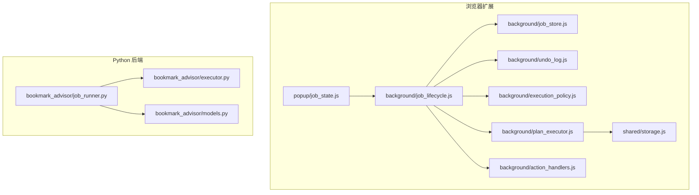
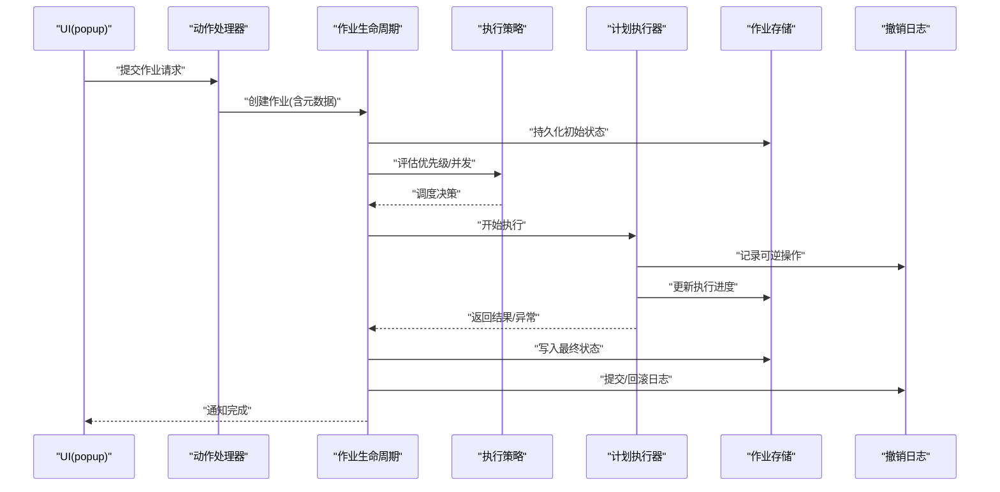
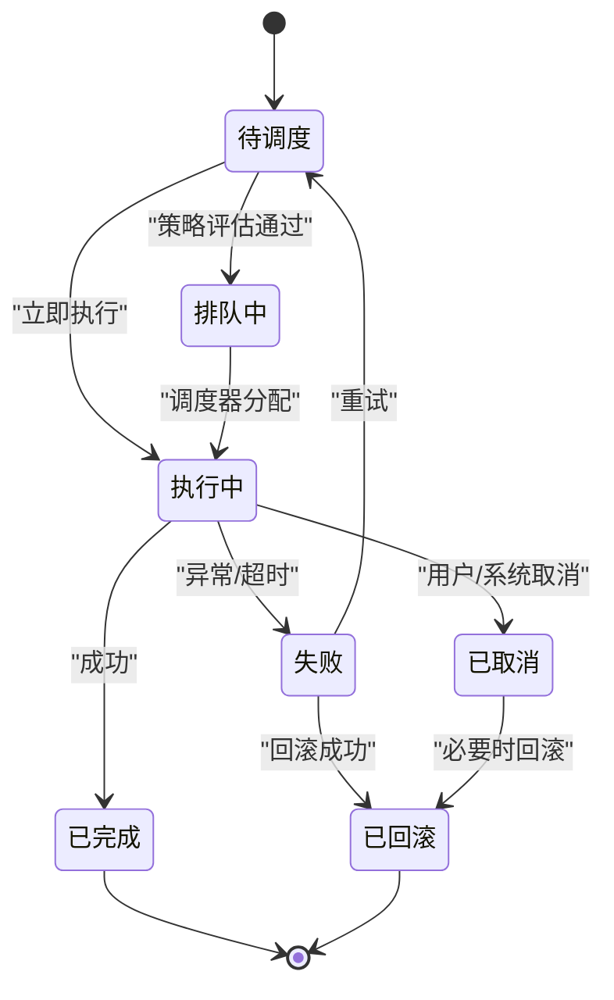
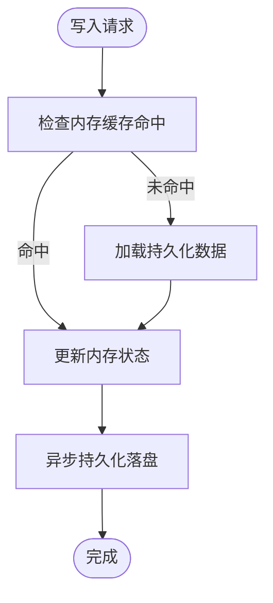
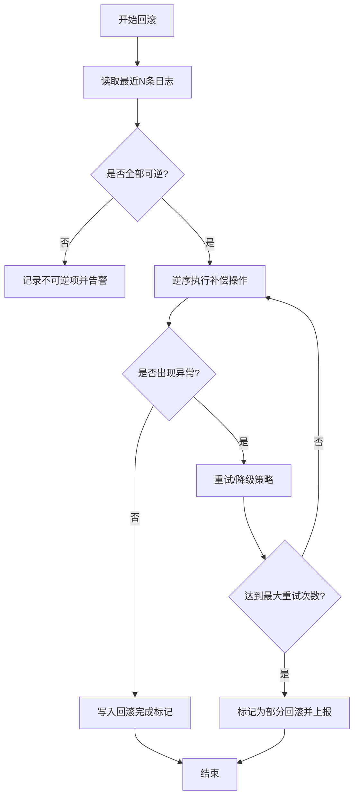
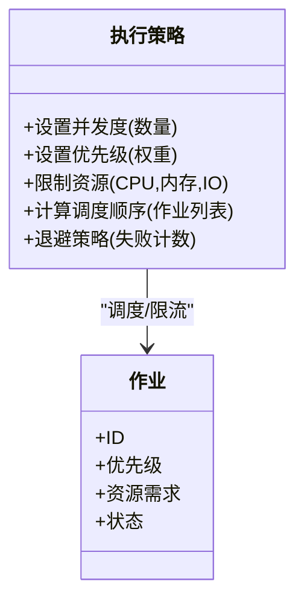
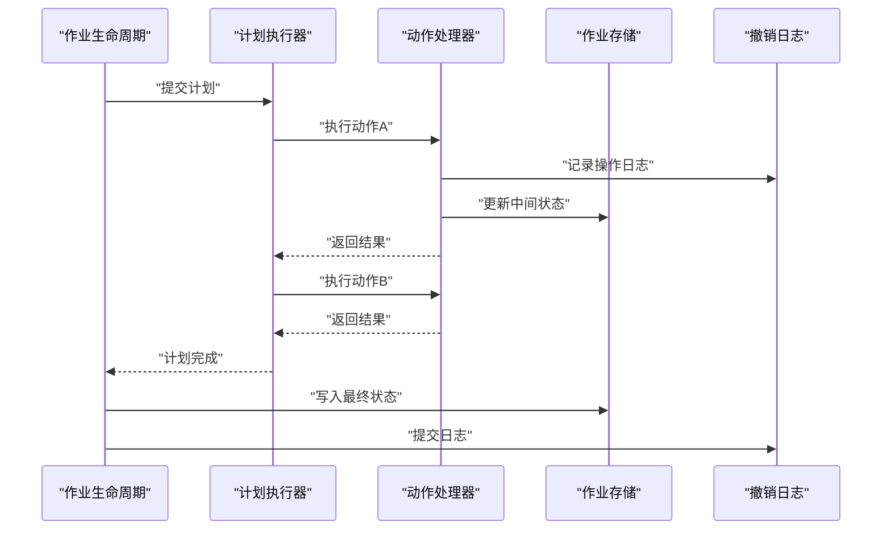
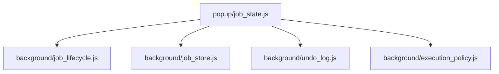
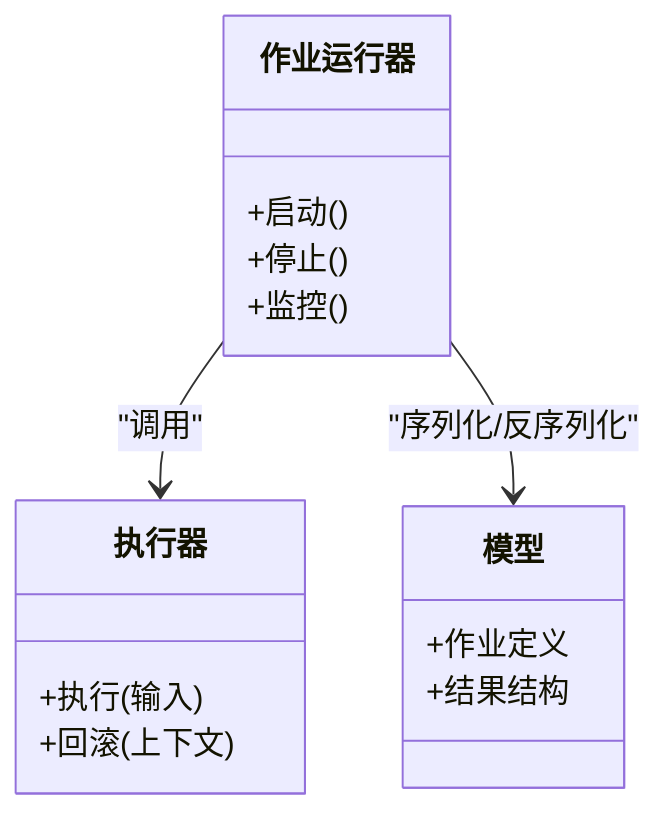
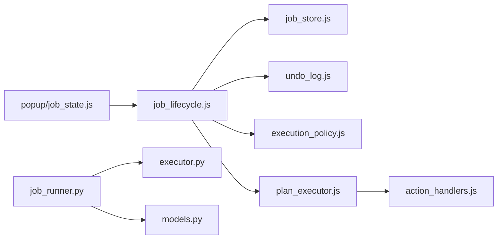

# 作业管理系统

<cite>
**本文引用的文件**   
- [extension/background/job_lifecycle.js](file://extension/background/job_lifecycle.js)
- [extension/background/job_store.js](file://extension/background/job_store.js)
- [extension/background/undo_log.js](file://extension/background/undo_log.js)
- [extension/background/execution_policy.js](file://extension/background/execution_policy.js)
- [extension/background/plan_executor.js](file://extension/background/plan_executor.js)
- [extension/background/action_handlers.js](file://extension/background/action_handlers.js)
- [extension/popup/job_state.js](file://extension/popup/job_state.js)
- [extension/shared/storage.js](file://extension/shared/storage.js)
- [src/bookmark_advisor/job_runner.py](file://src/bookmark_advisor/job_runner.py)
- [src/bookmark_advisor/executor.py](file://src/bookmark_advisor/executor.py)
- [src/bookmark_advisor/models.py](file://src/bookmark_advisor/models.py)
</cite>

## 目录
1. [简介](#简介)
2. [项目结构](#项目结构)
3. [核心组件](#核心组件)
4. [架构总览](#架构总览)
5. [详细组件分析](#详细组件分析)
6. [依赖关系分析](#依赖关系分析)
7. [性能考虑](#性能考虑)
8. [故障排查指南](#故障排查指南)
9. [结论](#结论)
10. [附录](#附录)

## 简介
本文件面向“作业管理系统”的设计与实现，聚焦于作业的全生命周期管理（创建、调度、执行、完成、清理）、状态机设计、存储机制、撤销与回滚、执行策略（并发控制、优先级调度、资源管理），以及监控调试工具与方法。文档同时提供实际作业定义示例与高级配置选项说明，帮助读者快速理解并正确使用该系统。

## 项目结构
系统由浏览器扩展侧（background/popup）与 Python 侧（bookmark_advisor）两部分组成：
- 扩展侧负责 UI 交互、消息路由、作业持久化、撤销日志、执行策略与计划执行器；
- Python 侧提供离线批处理与任务运行能力，作为扩展的补充执行后端。

图表来源
- [extension/background/job_lifecycle.js](file://extension/background/job_lifecycle.js)
- [extension/background/job_store.js](file://extension/background/job_store.js)
- [extension/background/undo_log.js](file://extension/background/undo_log.js)
- [extension/background/execution_policy.js](file://extension/background/execution_policy.js)
- [extension/background/plan_executor.js](file://extension/background/plan_executor.js)
- [extension/background/action_handlers.js](file://extension/background/action_handlers.js)
- [extension/popup/job_state.js](file://extension/popup/job_state.js)
- [extension/shared/storage.js](file://extension/shared/storage.js)
- [src/bookmark_advisor/job_runner.py](file://src/bookmark_advisor/job_runner.py)
- [src/bookmark_advisor/executor.py](file://src/bookmark_advisor/executor.py)
- [src/bookmark_advisor/models.py](file://src/bookmark_advisor/models.py)

章节来源
- [extension/background/job_lifecycle.js](file://extension/background/job_lifecycle.js)
- [extension/background/job_store.js](file://extension/background/job_store.js)
- [extension/background/undo_log.js](file://extension/background/undo_log.js)
- [extension/background/execution_policy.js](file://extension/background/execution_policy.js)
- [extension/background/plan_executor.js](file://extension/background/plan_executor.js)
- [extension/background/action_handlers.js](file://extension/background/action_handlers.js)
- [extension/popup/job_state.js](file://extension/popup/job_state.js)
- [extension/shared/storage.js](file://extension/shared/storage.js)
- [src/bookmark_advisor/job_runner.py](file://src/bookmark_advisor/job_runner.py)
- [src/bookmark_advisor/executor.py](file://src/bookmark_advisor/executor.py)
- [src/bookmark_advisor/models.py](file://src/bookmark_advisor/models.py)

## 核心组件
- 作业生命周期管理器：负责作业的创建、入队、调度、执行、完成与清理，驱动状态机转换。
- 作业存储：提供内存与持久化两种存储策略，支持查询、更新与一致性保障。
- 撤销日志：记录可逆操作序列，支持重放与一致性恢复。
- 执行策略：定义并发度、优先级、资源上限与退避策略。
- 计划执行器：将高层计划分解为原子动作并顺序或并行执行。
- 动作处理器：对外暴露的作业入口，接收来自 UI 或其他模块的请求。
- 前端状态视图：用于展示作业状态与进度，便于监控与调试。
- Python 作业运行器：在独立进程中执行复杂任务，与扩展侧协同工作。

章节来源
- [extension/background/job_lifecycle.js](file://extension/background/job_lifecycle.js)
- [extension/background/job_store.js](file://extension/background/job_store.js)
- [extension/background/undo_log.js](file://extension/background/undo_log.js)
- [extension/background/execution_policy.js](file://extension/background/execution_policy.js)
- [extension/background/plan_executor.js](file://extension/background/plan_executor.js)
- [extension/background/action_handlers.js](file://extension/background/action_handlers.js)
- [extension/popup/job_state.js](file://extension/popup/job_state.js)
- [src/bookmark_advisor/job_runner.py](file://src/bookmark_advisor/job_runner.py)
- [src/bookmark_advisor/executor.py](file://src/bookmark_advisor/executor.py)
- [src/bookmark_advisor/models.py](file://src/bookmark_advisor/models.py)

## 架构总览
下图展示了从用户触发到作业完成的关键流程，包括状态转换、存储写入、撤销日志记录与执行策略应用。

图表来源
- [extension/background/action_handlers.js](file://extension/background/action_handlers.js)
- [extension/background/job_lifecycle.js](file://extension/background/job_lifecycle.js)
- [extension/background/execution_policy.js](file://extension/background/execution_policy.js)
- [extension/background/plan_executor.js](file://extension/background/plan_executor.js)
- [extension/background/job_store.js](file://extension/background/job_store.js)
- [extension/background/undo_log.js](file://extension/background/undo_log.js)
- [extension/popup/job_state.js](file://extension/popup/job_state.js)

## 详细组件分析

### 作业生命周期与状态机
- 状态集合：待调度、排队中、执行中、已完成、失败、已取消、已回滚等。
- 转换条件：
  - 创建后进入待调度；根据执行策略进入排队中或直接执行中。
  - 执行成功则进入已完成；执行异常则进入失败并可尝试重试或回滚。
  - 用户或系统触发取消时进入已取消；若需要恢复一致性则进入已回滚。
- 持久化策略：每次状态变更均落盘，确保崩溃恢复后可重建状态。
- 幂等性：同一作业 ID 的状态迁移需幂等，避免重复提交导致不一致。

图表来源
- [extension/background/job_lifecycle.js](file://extension/background/job_lifecycle.js)
- [extension/background/job_store.js](file://extension/background/job_store.js)
- [extension/background/undo_log.js](file://extension/background/undo_log.js)

章节来源
- [extension/background/job_lifecycle.js](file://extension/background/job_lifecycle.js)
- [extension/background/job_store.js](file://extension/background/job_store.js)
- [extension/background/undo_log.js](file://extension/background/undo_log.js)

### 作业存储机制
- 内存存储：适用于短期运行与快速查询，具备低延迟特性。
- 持久化存储：使用共享存储接口进行跨会话保存，保证重启后状态一致。
- 选择策略：
  - 热路径（频繁读写）优先内存，定期快照至持久化。
  - 冷路径（历史查询）直接读取持久化。
- 一致性：采用事务式写入与版本号校验，防止竞态条件。

图表来源
- [extension/background/job_store.js](file://extension/background/job_store.js)
- [extension/shared/storage.js](file://extension/shared/storage.js)

章节来源
- [extension/background/job_store.js](file://extension/background/job_store.js)
- [extension/shared/storage.js](file://extension/shared/storage.js)

### 撤销与回滚机制
- 操作日志：每个可逆动作生成一条日志条目，包含前置状态、后置状态与补偿操作。
- 重放与一致性：
  - 提交阶段：按序重放日志以确认最终一致性。
  - 回滚阶段：逆序执行补偿操作，直至恢复到目标状态。
- 错误处理：部分失败时自动重试或降级，确保整体一致性。

图表来源
- [extension/background/undo_log.js](file://extension/background/undo_log.js)

章节来源
- [extension/background/undo_log.js](file://extension/background/undo_log.js)

### 执行策略（并发、优先级、资源）
- 并发控制：基于令牌桶或信号量限制同时运行的作业数，避免资源争用。
- 优先级调度：高优先级作业抢占低优先级队列，支持权重与截止时间。
- 资源管理：CPU/IO 配额、内存上限、外部 API 速率限制。
- 退避与熔断：对失败作业实施指数退避，对下游服务熔断保护。

图表来源
- [extension/background/execution_policy.js](file://extension/background/execution_policy.js)

章节来源
- [extension/background/execution_policy.js](file://extension/background/execution_policy.js)

### 计划执行器与动作处理器
- 计划执行器：将高层计划解析为原子动作序列，支持顺序、分支与并行执行。
- 动作处理器：封装具体业务动作（如书签增删改），提供幂等与可逆能力。
- 错误传播：执行器捕获异常并转换为作业状态变更，触发回滚或重试。

图表来源
- [extension/background/plan_executor.js](file://extension/background/plan_executor.js)
- [extension/background/action_handlers.js](file://extension/background/action_handlers.js)
- [extension/background/job_store.js](file://extension/background/job_store.js)
- [extension/background/undo_log.js](file://extension/background/undo_log.js)

章节来源
- [extension/background/plan_executor.js](file://extension/background/plan_executor.js)
- [extension/background/action_handlers.js](file://extension/background/action_handlers.js)

### 前端监控与调试
- 状态查询：通过前端状态视图订阅作业状态变化，实时渲染进度与结果。
- 日志分析：聚合执行日志与撤销日志，提供时间线与过滤能力。
- 性能统计：采集关键指标（执行时长、失败率、队列长度、资源占用）。

图表来源
- [extension/popup/job_state.js](file://extension/popup/job_state.js)
- [extension/background/job_lifecycle.js](file://extension/background/job_lifecycle.js)
- [extension/background/job_store.js](file://extension/background/job_store.js)
- [extension/background/undo_log.js](file://extension/background/undo_log.js)
- [extension/background/execution_policy.js](file://extension/background/execution_policy.js)

章节来源
- [extension/popup/job_state.js](file://extension/popup/job_state.js)

### Python 侧作业运行器
- 运行器：负责启动与协调底层执行器，提供进程隔离与资源回收。
- 执行器：实现具体算法与数据处理逻辑，输出结构化结果。
- 模型：定义作业输入输出契约，确保前后端一致性。

图表来源
- [src/bookmark_advisor/job_runner.py](file://src/bookmark_advisor/job_runner.py)
- [src/bookmark_advisor/executor.py](file://src/bookmark_advisor/executor.py)
- [src/bookmark_advisor/models.py](file://src/bookmark_advisor/models.py)

章节来源
- [src/bookmark_advisor/job_runner.py](file://src/bookmark_advisor/job_runner.py)
- [src/bookmark_advisor/executor.py](file://src/bookmark_advisor/executor.py)
- [src/bookmark_advisor/models.py](file://src/bookmark_advisor/models.py)

## 依赖关系分析
- 内聚性：各组件职责清晰，生命周期、存储、撤销、策略、执行器边界明确。
- 耦合度：通过消息协议与存储接口解耦，降低模块间直接依赖。
- 外部依赖：共享存储接口、浏览器扩展 API、Python 运行时。
- 潜在循环：应避免生命周期与执行器之间的双向直接调用，建议通过事件总线或回调解耦。

图表来源
- [extension/background/job_lifecycle.js](file://extension/background/job_lifecycle.js)
- [extension/background/job_store.js](file://extension/background/job_store.js)
- [extension/background/undo_log.js](file://extension/background/undo_log.js)
- [extension/background/execution_policy.js](file://extension/background/execution_policy.js)
- [extension/background/plan_executor.js](file://extension/background/plan_executor.js)
- [extension/background/action_handlers.js](file://extension/background/action_handlers.js)
- [extension/popup/job_state.js](file://extension/popup/job_state.js)
- [src/bookmark_advisor/job_runner.py](file://src/bookmark_advisor/job_runner.py)
- [src/bookmark_advisor/executor.py](file://src/bookmark_advisor/executor.py)
- [src/bookmark_advisor/models.py](file://src/bookmark_advisor/models.py)

章节来源
- [extension/background/job_lifecycle.js](file://extension/background/job_lifecycle.js)
- [extension/background/job_store.js](file://extension/background/job_store.js)
- [extension/background/undo_log.js](file://extension/background/undo_log.js)
- [extension/background/execution_policy.js](file://extension/background/execution_policy.js)
- [extension/background/plan_executor.js](file://extension/background/plan_executor.js)
- [extension/background/action_handlers.js](file://extension/background/action_handlers.js)
- [extension/popup/job_state.js](file://extension/popup/job_state.js)
- [src/bookmark_advisor/job_runner.py](file://src/bookmark_advisor/job_runner.py)
- [src/bookmark_advisor/executor.py](file://src/bookmark_advisor/executor.py)
- [src/bookmark_advisor/models.py](file://src/bookmark_advisor/models.py)

## 性能考虑
- 批量写入：合并多次状态更新，减少持久化开销。
- 惰性加载：仅按需加载历史作业详情，降低内存占用。
- 并发优化：合理设置并发度，避免上下文切换过多。
- 缓存策略：热点作业状态常驻内存，冷数据走持久化。
- 监控指标：跟踪队列长度、平均执行时长、失败率、回滚耗时。

[本节为通用指导，不直接分析具体文件]

## 故障排查指南
- 常见症状：
  - 作业长时间停留在排队中：检查执行策略与资源配额。
  - 执行失败但无回滚：查看撤销日志是否完整，确认补偿操作可用性。
  - 状态不一致：核对持久化版本与内存缓存一致性。
- 定位方法：
  - 使用前端状态视图筛选失败作业，查看关联日志。
  - 导出撤销日志进行时间线回放，定位异常点。
  - 收集性能统计，识别瓶颈环节。
- 恢复步骤：
  - 对失败作业执行重试或手动回滚。
  - 修复不可逆操作后重新提交。
  - 清理僵尸作业并重置相关资源。

章节来源
- [extension/background/undo_log.js](file://extension/background/undo_log.js)
- [extension/popup/job_state.js](file://extension/popup/job_state.js)
- [extension/background/job_store.js](file://extension/background/job_store.js)

## 结论
本作业管理系统通过清晰的状态机、可靠的存储与撤销机制、灵活的执行策略与完善的监控手段，实现了端到端的作业全生命周期管理。建议在部署前充分验证一致性、幂等性与回滚能力，并结合监控指标持续优化性能与稳定性。

[本节为总结性内容，不直接分析具体文件]

## 附录

### 作业定义示例（概念性）
- 基本字段：作业名称、类型、优先级、资源需求、计划描述、依赖关系。
- 高级配置：重试次数、超时时间、并发度、回滚策略、审计开关。
- 示例结构（示意）：
  - 名称：书签重组
  - 类型：批处理
  - 优先级：高
  - 资源：CPU=2, 内存=512MB
  - 计划：解析书签树 -> 去重 -> 排序 -> 写回
  - 依赖：无
  - 重试：3次，指数退避
  - 超时：300秒
  - 回滚：启用，记录所有可逆操作

[本节为概念性示例，不直接分析具体文件]

### 高级配置选项（概念性）
- 存储策略：内存优先+定时快照；或纯持久化模式。
- 调度策略：FIFO、优先级加权、截止时间优先。
- 资源限制：全局并发上限、每作业资源配额、外部 API 限速。
- 监控与告警：阈值配置、采样频率、告警通道。

[本节为概念性配置说明，不直接分析具体文件]