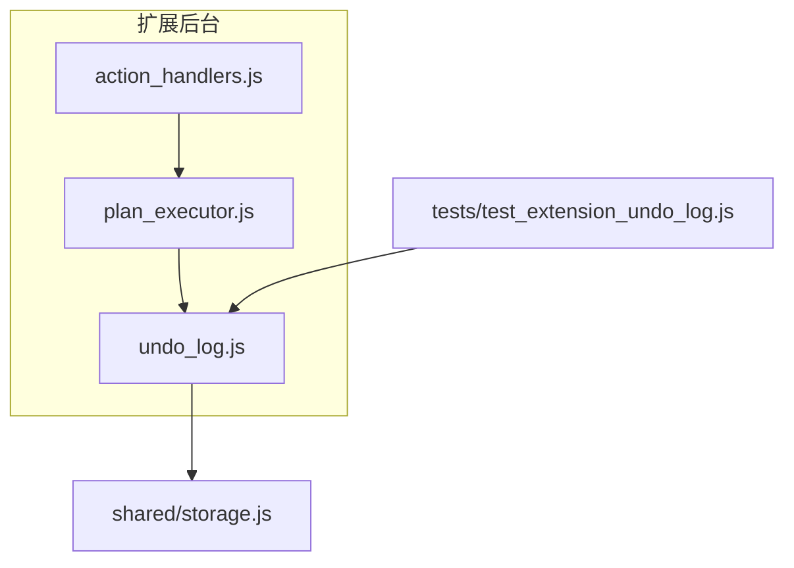
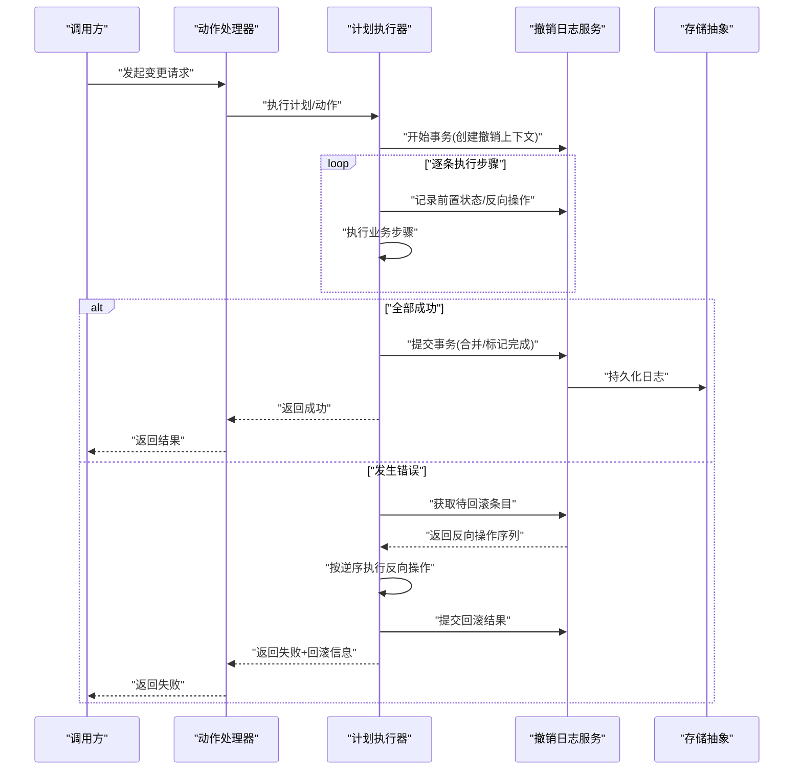
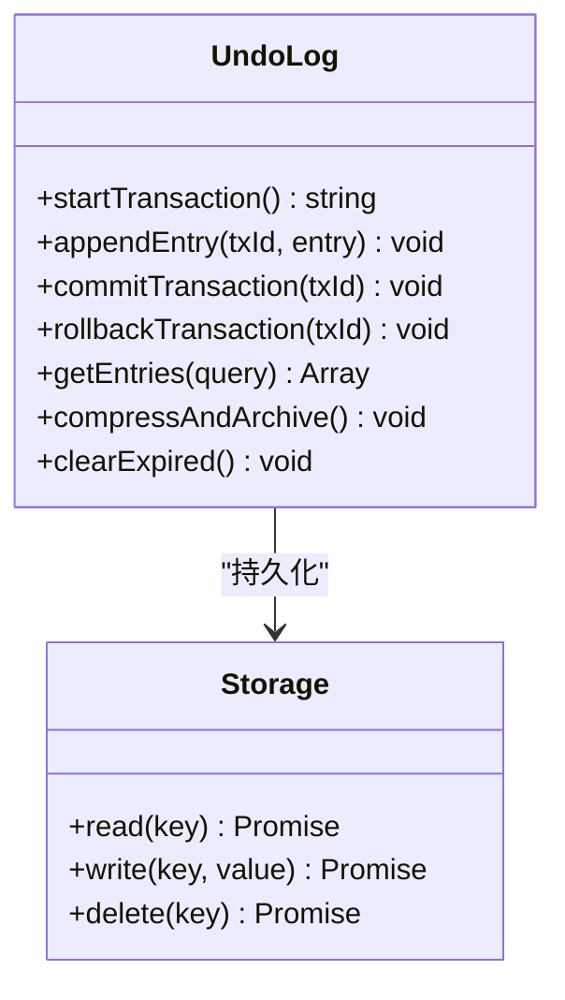
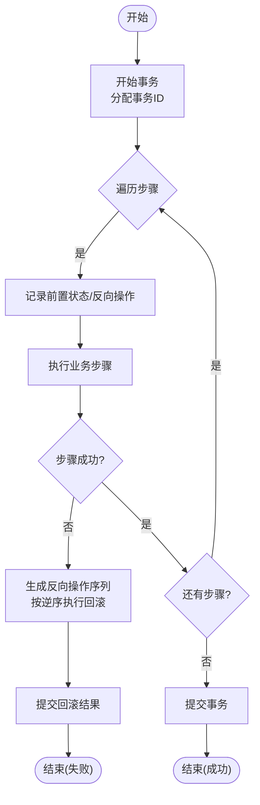

# 撤销和回滚机制

<cite>
**本文引用的文件**   
- [extension/background/undo_log.js](file://extension/background/undo_log.js)
- [extension/background/plan_executor.js](file://extension/background/plan_executor.js)
- [extension/background/action_handlers.js](file://extension/background/action_handlers.js)
- [extension/shared/storage.js](file://extension/shared/storage.js)
- [tests/test_extension_undo_log.js](file://tests/test_extension_undo_log.js)
</cite>

## 目录
1. [简介](#简介)
2. [项目结构](#项目结构)
3. [核心组件](#核心组件)
4. [架构总览](#架构总览)
5. [详细组件分析](#详细组件分析)
6. [依赖关系分析](#依赖关系分析)
7. [性能考虑](#性能考虑)
8. [故障排查指南](#故障排查指南)
9. [结论](#结论)
10. [附录](#附录)

## 简介
本文件面向“撤销与回滚”能力，围绕操作日志记录、原子操作识别、日志格式设计、日志压缩策略、回滚算法（依赖分析与反向操作生成）、事务性多步骤操作的原子性与一致性保证、撤销范围控制（部分撤销与全局撤销）、以及撤销性能优化（归档与空间回收）进行系统化说明。文档同时提供复杂业务场景的回滚示例与故障恢复方案，帮助读者快速理解并正确使用该机制。

## 项目结构
与撤销和回滚相关的代码主要位于扩展后台脚本与共享存储模块中：
- 撤销日志持久化与查询：extension/background/undo_log.js
- 计划执行与撤销触发：extension/background/plan_executor.js
- 动作处理入口（可能触发撤销）：extension/background/action_handlers.js
- 通用存储封装：extension/shared/storage.js
- 单元测试覆盖：tests/test_extension_undo_log.js

图表来源
- [extension/background/action_handlers.js](file://extension/background/action_handlers.js)
- [extension/background/plan_executor.js](file://extension/background/plan_executor.js)
- [extension/background/undo_log.js](file://extension/background/undo_log.js)
- [extension/shared/storage.js](file://extension/shared/storage.js)
- [tests/test_extension_undo_log.js](file://tests/test_extension_undo_log.js)

章节来源
- [extension/background/undo_log.js](file://extension/background/undo_log.js)
- [extension/background/plan_executor.js](file://extension/background/plan_executor.js)
- [extension/background/action_handlers.js](file://extension/background/action_handlers.js)
- [extension/shared/storage.js](file://extension/shared/storage.js)
- [tests/test_extension_undo_log.js](file://tests/test_extension_undo_log.js)

## 核心组件
- 撤销日志服务（UndoLog）
  - 负责记录的追加、查询、清理与压缩；维护时间顺序与版本边界；对外暴露提交、撤销、清空等接口。
- 计划执行器（PlanExecutor）
  - 在执行业务计划时，协调撤销日志的开启、提交与失败回滚；确保多步操作的原子性与一致性。
- 动作处理器（ActionHandlers）
  - 作为外部触发的入口点，调用计划执行器或具体动作逻辑，并在必要时发起撤销流程。
- 存储抽象（Storage）
  - 对底层持久化的统一封装，为撤销日志提供可靠的读写保障。

章节来源
- [extension/background/undo_log.js](file://extension/background/undo_log.js)
- [extension/background/plan_executor.js](file://extension/background/plan_executor.js)
- [extension/background/action_handlers.js](file://extension/background/action_handlers.js)
- [extension/shared/storage.js](file://extension/shared/storage.js)

## 架构总览
撤销与回滚的整体交互如下：用户或系统触发某项变更，动作处理器将请求委派给计划执行器；计划执行器在执行前开启撤销上下文，执行过程中按步骤写入撤销日志；执行完成后提交事务；若中途失败，则基于已记录的日志进行回滚。

图表来源
- [extension/background/action_handlers.js](file://extension/background/action_handlers.js)
- [extension/background/plan_executor.js](file://extension/background/plan_executor.js)
- [extension/background/undo_log.js](file://extension/background/undo_log.js)
- [extension/shared/storage.js](file://extension/shared/storage.js)

## 详细组件分析

### 撤销日志服务（UndoLog）
职责与能力
- 记录机制
  - 支持以“事务”为单位组织多条操作记录，每条记录包含操作类型、目标标识、前置状态快照、可选的反向操作描述、时间戳与版本信息。
  - 通过唯一的事务ID聚合同一批次的操作，便于整体提交或回滚。
- 原子操作识别
  - 由上层（计划执行器）在开启事务时声明原子边界；日志服务不拆分事务内的子步骤，确保要么全部提交，要么全部回滚。
- 日志格式设计
  - 字段包括：事务ID、操作序号、操作类型、目标键/路径、前置状态、反向操作、元数据（如来源、标签）。
  - 采用稳定且可扩展的结构，便于未来新增字段而不破坏兼容性。
- 日志压缩策略
  - 相邻可合并的操作会被压缩（例如连续更新同一目标的多次写，仅保留最终状态与必要的前置快照）。
  - 过期或不可用的快照可按策略清理，但需保留足够信息用于回滚。
- 查询与裁剪
  - 支持按事务ID、时间窗口、目标键等维度检索；支持获取最近N条或指定范围的日志片段。
- 持久化与一致性
  - 通过存储抽象层进行落盘；提交阶段保证事务内所有条目的一致性写入。

图表来源
- [extension/background/undo_log.js](file://extension/background/undo_log.js)
- [extension/shared/storage.js](file://extension/shared/storage.js)

章节来源
- [extension/background/undo_log.js](file://extension/background/undo_log.js)
- [extension/shared/storage.js](file://extension/shared/storage.js)

### 计划执行器（PlanExecutor）
职责与能力
- 事务编排
  - 在开始执行前调用撤销日志服务开启事务；在每步执行前后收集必要的状态快照与反向操作。
- 原子性与一致性
  - 若任意步骤失败，立即中止后续步骤，并基于已记录日志生成反向操作序列，按逆序执行以实现一致回滚。
- 撤销触发
  - 提供显式撤销API，允许根据事务ID或时间范围选择性地回滚。
- 错误处理
  - 捕获异常并记录到日志；区分可重试与不可重试错误，避免重复回滚。

图表来源
- [extension/background/plan_executor.js](file://extension/background/plan_executor.js)
- [extension/background/undo_log.js](file://extension/background/undo_log.js)

章节来源
- [extension/background/plan_executor.js](file://extension/background/plan_executor.js)
- [extension/background/undo_log.js](file://extension/background/undo_log.js)

### 动作处理器（ActionHandlers）
职责与能力
- 作为外部入口，接收来自UI或其他模块的请求，校验参数后委派给计划执行器。
- 在需要时直接调用撤销日志服务进行局部撤销（例如针对特定事务ID）。
- 负责将执行结果与撤销状态反馈给调用方。

章节来源
- [extension/background/action_handlers.js](file://extension/background/action_handlers.js)
- [extension/background/plan_executor.js](file://extension/background/plan_executor.js)
- [extension/background/undo_log.js](file://extension/background/undo_log.js)

### 存储抽象（Storage）
职责与能力
- 提供统一的读/写/删除接口，屏蔽底层实现差异。
- 为撤销日志提供可靠的数据持久化保障，确保事务提交时的原子写入。

章节来源
- [extension/shared/storage.js](file://extension/shared/storage.js)
- [extension/background/undo_log.js](file://extension/background/undo_log.js)

## 依赖关系分析
- 低耦合高内聚
  - 撤销日志服务独立于业务逻辑，仅依赖存储抽象；计划执行器依赖撤销日志服务但不感知其内部实现细节。
- 关键依赖链
  - 动作处理器 → 计划执行器 → 撤销日志服务 → 存储抽象
- 潜在循环依赖
  - 当前结构无循环依赖；各模块职责清晰，易于测试与维护。

图表来源
- [extension/background/action_handlers.js](file://extension/background/action_handlers.js)
- [extension/background/plan_executor.js](file://extension/background/plan_executor.js)
- [extension/background/undo_log.js](file://extension/background/undo_log.js)
- [extension/shared/storage.js](file://extension/shared/storage.js)

章节来源
- [extension/background/action_handlers.js](file://extension/background/action_handlers.js)
- [extension/background/plan_executor.js](file://extension/background/plan_executor.js)
- [extension/background/undo_log.js](file://extension/background/undo_log.js)
- [extension/shared/storage.js](file://extension/shared/storage.js)

## 性能考虑
- 日志压缩
  - 合并相邻同目标操作，减少冗余快照体积；对频繁更新的热点键采用增量快照策略。
- 归档与空间回收
  - 定期归档已完成且不再需要回滚的历史事务；清理过期快照，释放存储空间。
- 批量写入
  - 在事务提交阶段批量落盘，降低I/O次数。
- 索引与查询优化
  - 对常用查询条件建立轻量索引（如事务ID、时间戳、目标键），提升检索效率。
- 并发安全
  - 使用锁或队列串行化写入，避免并发竞争导致的不一致。

[本节为通用性能建议，无需源码引用]

## 故障排查指南
常见问题与定位方法
- 回滚未生效
  - 检查事务是否成功提交；确认反向操作是否正确生成并按逆序执行。
- 日志丢失或不完整
  - 验证存储层的写入是否成功；检查事务提交阶段的批量写入是否被中断。
- 性能退化
  - 观察日志大小增长趋势；评估是否需要启用压缩与归档策略。
- 部分撤销异常
  - 确认撤销范围限定正确（事务ID或时间窗口）；避免跨事务误删。

参考用例
- 单元测试覆盖撤销日志的核心行为，可作为回归与排障依据。

章节来源
- [tests/test_extension_undo_log.js](file://tests/test_extension_undo_log.js)
- [extension/background/undo_log.js](file://extension/background/undo_log.js)

## 结论
本机制通过“事务化日志 + 反向操作 + 统一存储抽象”的组合，实现了可靠的撤销与回滚能力。计划执行器负责编排与一致性保证，撤销日志服务专注记录与压缩，存储抽象提供持久化保障。配合合理的压缩与归档策略，可在保证功能正确性的同时兼顾性能与空间占用。

[本节为总结性内容，无需源码引用]

## 附录

### 日志格式设计要点
- 必填字段
  - 事务ID、操作序号、操作类型、目标标识、前置状态、反向操作、时间戳、版本
- 可选字段
  - 来源、标签、备注、额外元数据
- 扩展性
  - 新增字段应向后兼容；旧版本读取时可忽略未知字段

[本节为概念性说明，无需源码引用]

### 撤销范围控制策略
- 部分撤销
  - 基于事务ID精确回滚；适用于单批次操作失败后的精准修复。
- 全局撤销
  - 基于时间窗口或全量回滚；适用于严重不一致时的紧急恢复。
- 选择原则
  - 优先局部撤销，最小化影响面；仅在必要时使用全局撤销。

[本节为概念性说明，无需源码引用]

### 复杂业务场景回滚示例
- 批量迁移书签
  - 步骤：导出源数据 → 转换 → 批量写入 → 更新索引
  - 原子边界：整个迁移过程为一个事务
  - 失败处理：任一环节失败即触发回滚，按逆序撤销写入与索引更新
- 配置热更新
  - 步骤：加载新配置 → 校验 → 应用 → 刷新缓存
  - 原子边界：应用与刷新为原子单元
  - 失败处理：应用失败则回滚至旧配置并恢复缓存

[本节为概念性说明，无需源码引用]

### 故障恢复方案
- 自动恢复
  - 启动时检测未完成事务，尝试重放或回滚；必要时进入只读模式等待人工干预。
- 手动恢复
  - 提供工具列出未完成事务与最新快照；管理员可选择回滚到指定时间点。
- 审计与追踪
  - 记录每次撤销与回滚的触发者、范围与结果，便于事后审计与复盘。

[本节为概念性说明，无需源码引用]