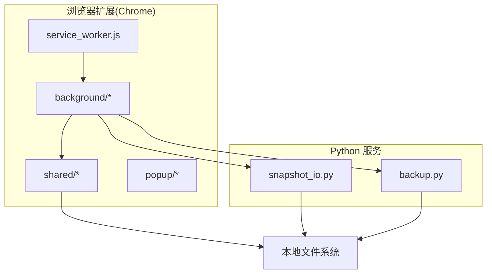
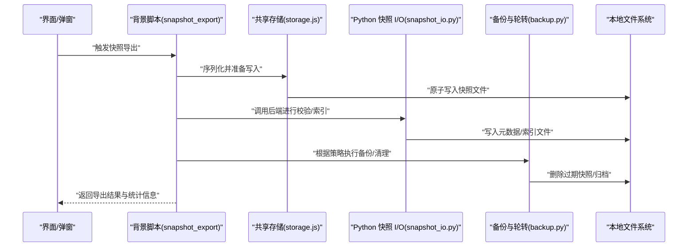
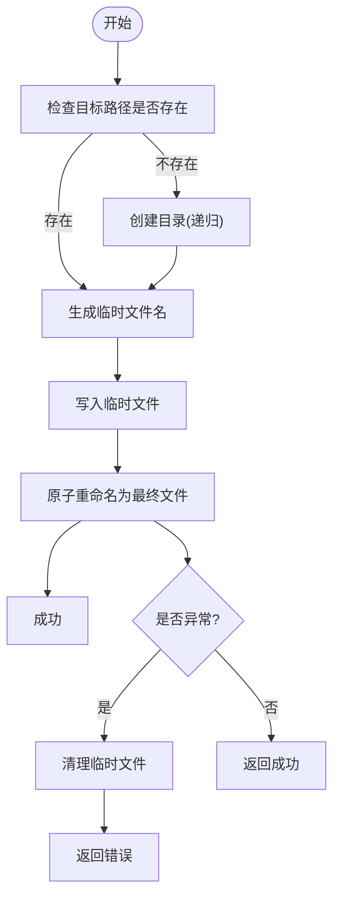
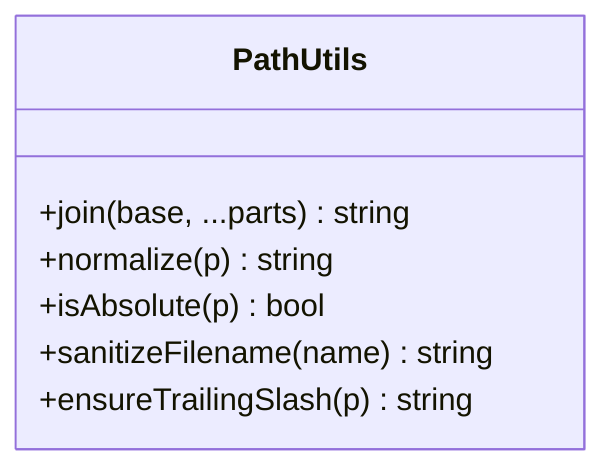
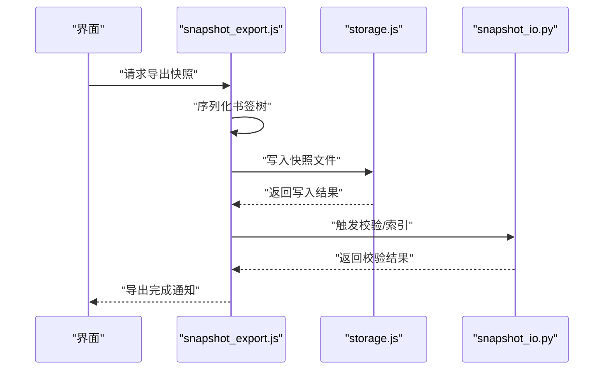
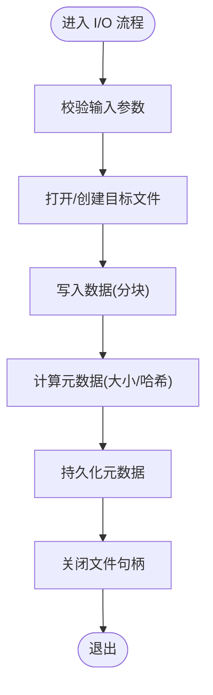
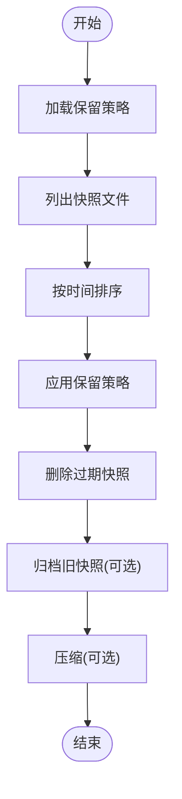
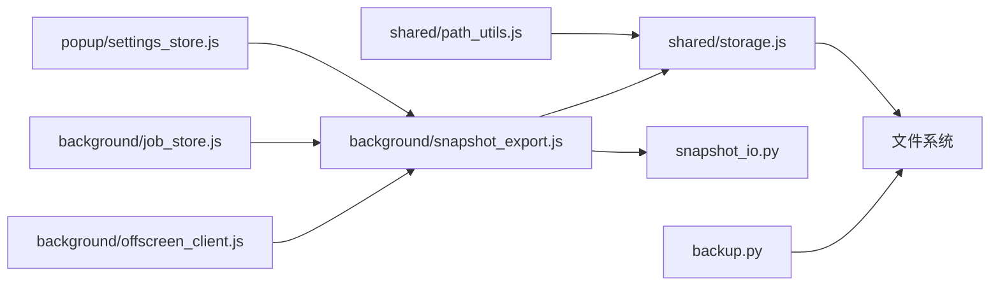

# 存储管理与清理

<cite>
**本文引用的文件**   
- [extension/shared/storage.js](file://extension/shared/storage.js)
- [extension/background/snapshot_export.js](file://extension/background/snapshot_export.js)
- [src/bookmark_advisor/snapshot_io.py](file://src/bookmark_advisor/snapshot_io.py)
- [src/bookmark_advisor/backup.py](file://src/bookmark_advisor/backup.py)
- [extension/shared/path_utils.js](file://extension/shared/path_utils.js)
- [extension/popup/settings_store.js](file://extension/popup/settings_store.js)
- [extension/background/job_store.js](file://extension/background/job_store.js)
- [extension/background/offscreen_client.js](file://extension/background/offscreen_client.js)
- [extension/service_worker.js](file://extension/service_worker.js)
</cite>

## 目录
1. [简介](#简介)
2. [项目结构](#项目结构)
3. [核心组件](#核心组件)
4. [架构总览](#架构总览)
5. [详细组件分析](#详细组件分析)
6. [依赖关系分析](#依赖关系分析)
7. [性能考量](#性能考量)
8. [故障诊断指南](#故障诊断指南)
9. [结论](#结论)
10. [附录](#附录)

## 简介
本文件聚焦于“快照存储管理”的本地文件系统实现与策略，覆盖以下方面：
- 本地文件系统存储架构：目录结构设计、文件命名规范与路径管理策略
- 存储空间监控与管理：容量检查、磁盘空间预警与自动清理策略
- 存储优化技术：文件压缩、去重存储与索引优化
- 跨平台兼容性：路径分隔符、权限控制与字符编码处理
- 配置选项：存储位置自定义、保留策略与备份轮转
- 性能监控与故障诊断方法

## 项目结构
本项目在浏览器扩展侧（JavaScript）与服务端侧（Python）分别实现了快照的导出、持久化与生命周期管理。关键文件包括：
- 共享层：通用存储抽象、路径工具与设置存储
- 背景脚本：快照导出、作业存储与后台任务协调
- Python 服务：快照 I/O、备份与轮转逻辑

图表来源
- [extension/service_worker.js](file://extension/service_worker.js)
- [extension/background/snapshot_export.js](file://extension/background/snapshot_export.js)
- [extension/shared/storage.js](file://extension/shared/storage.js)
- [extension/shared/path_utils.js](file://extension/shared/path_utils.js)
- [src/bookmark_advisor/snapshot_io.py](file://src/bookmark_advisor/snapshot_io.py)
- [src/bookmark_advisor/backup.py](file://src/bookmark_advisor/backup.py)

章节来源
- [extension/shared/storage.js](file://extension/shared/storage.js)
- [extension/shared/path_utils.js](file://extension/shared/path_utils.js)
- [extension/background/snapshot_export.js](file://extension/background/snapshot_export.js)
- [src/bookmark_advisor/snapshot_io.py](file://src/bookmark_advisor/snapshot_io.py)
- [src/bookmark_advisor/backup.py](file://src/bookmark_advisor/backup.py)

## 核心组件
- 共享存储抽象（storage.js）：封装本地文件读写、原子写入与错误处理，为上层提供一致的存储接口
- 路径工具（path_utils.js）：统一路径拼接、规范化与跨平台兼容处理
- 快照导出（snapshot_export.js）：负责将内存中的书签快照序列化为文件并落盘
- Python 快照 I/O（snapshot_io.py）：提供快照文件的读取、写入、校验与元数据管理
- 备份与轮转（backup.py）：实现保留策略、增量/全量备份与过期清理
- 设置存储（settings_store.js）：持久化用户配置项（如存储位置、保留天数等）
- 作业存储（job_store.js）：记录快照相关作业的状态与结果，便于追踪与恢复
- Offscreen 客户端（offscreen_client.js）：在受限环境中执行需要页面上下文的 I/O 操作

章节来源
- [extension/shared/storage.js](file://extension/shared/storage.js)
- [extension/shared/path_utils.js](file://extension/shared/path_utils.js)
- [extension/background/snapshot_export.js](file://extension/background/snapshot_export.js)
- [src/bookmark_advisor/snapshot_io.py](file://src/bookmark_advisor/snapshot_io.py)
- [src/bookmark_advisor/backup.py](file://src/bookmark_advisor/backup.py)
- [extension/popup/settings_store.js](file://extension/popup/settings_store.js)
- [extension/background/job_store.js](file://extension/background/job_store.js)
- [extension/background/offscreen_client.js](file://extension/background/offscreen_client.js)

## 架构总览
整体采用“前端导出 + 后端持久化 + 本地文件系统”的分层设计：
- 前端负责序列化与初步校验，通过共享存储抽象进行落盘或上传
- 后端负责更严格的校验、索引构建与备份轮转
- 文件系统作为最终持久化介质，受路径工具与权限模型约束

图表来源
- [extension/background/snapshot_export.js](file://extension/background/snapshot_export.js)
- [extension/shared/storage.js](file://extension/shared/storage.js)
- [src/bookmark_advisor/snapshot_io.py](file://src/bookmark_advisor/snapshot_io.py)
- [src/bookmark_advisor/backup.py](file://src/bookmark_advisor/backup.py)

## 详细组件分析

### 共享存储抽象（storage.js）
职责与特性：
- 提供统一的读写接口，屏蔽底层差异
- 支持原子写入（先写临时文件再替换），避免部分写入导致的数据损坏
- 对常见错误（权限不足、路径不存在、磁盘满）进行捕获与上报

建议的目录结构与命名规范：
- 根目录由配置项指定，默认位于用户可写目录
- 快照文件按时间戳与版本命名，便于排序与回溯
- 元数据与索引文件与快照文件同目录，保持强关联

图表来源
- [extension/shared/storage.js](file://extension/shared/storage.js)

章节来源
- [extension/shared/storage.js](file://extension/shared/storage.js)

### 路径工具（path_utils.js）
职责与特性：
- 统一路径拼接与规范化，避免跨平台差异
- 处理 Windows 与 POSIX 的路径分隔符差异
- 对非法字符进行安全过滤或转义，确保文件名合法

图表来源
- [extension/shared/path_utils.js](file://extension/shared/path_utils.js)

章节来源
- [extension/shared/path_utils.js](file://extension/shared/path_utils.js)

### 快照导出（snapshot_export.js）
职责与特性：
- 从内存中收集书签树，转换为可持久化的格式
- 调用共享存储进行落盘，并记录导出作业状态
- 可选地触发后端校验与索引构建

图表来源
- [extension/background/snapshot_export.js](file://extension/background/snapshot_export.js)
- [extension/shared/storage.js](file://extension/shared/storage.js)
- [src/bookmark_advisor/snapshot_io.py](file://src/bookmark_advisor/snapshot_io.py)

章节来源
- [extension/background/snapshot_export.js](file://extension/background/snapshot_export.js)

### Python 快照 I/O（snapshot_io.py）
职责与特性：
- 提供快照文件的读取、写入与校验
- 维护元数据（大小、哈希、时间戳等）
- 支持并发访问下的锁机制与一致性保证

图表来源
- [src/bookmark_advisor/snapshot_io.py](file://src/bookmark_advisor/snapshot_io.py)

章节来源
- [src/bookmark_advisor/snapshot_io.py](file://src/bookmark_advisor/snapshot_io.py)

### 备份与轮转（backup.py）
职责与特性：
- 基于保留策略（天数、数量）执行清理
- 支持全量与增量备份，减少重复存储
- 提供归档与压缩能力，降低磁盘占用

图表来源
- [src/bookmark_advisor/backup.py](file://src/bookmark_advisor/backup.py)

章节来源
- [src/bookmark_advisor/backup.py](file://src/bookmark_advisor/backup.py)

### 设置存储（settings_store.js）
职责与特性：
- 持久化用户配置项，如存储位置、保留天数、是否启用压缩等
- 提供默认值与验证逻辑，防止无效配置

章节来源
- [extension/popup/settings_store.js](file://extension/popup/settings_store.js)

### 作业存储（job_store.js）
职责与特性：
- 记录快照相关作业的状态、开始/结束时间与结果
- 支持查询历史作业，辅助问题定位与审计

章节来源
- [extension/background/job_store.js](file://extension/background/job_store.js)

### Offscreen 客户端（offscreen_client.js）
职责与特性：
- 在受限环境中执行需要页面上下文的 I/O 操作
- 与背景脚本通信，转发存储请求

章节来源
- [extension/background/offscreen_client.js](file://extension/background/offscreen_client.js)

## 依赖关系分析
- 前端模块依赖共享存储抽象与路径工具，确保一致性与跨平台兼容
- 背景脚本协调导出、作业状态与后端交互
- Python 服务负责更复杂的 I/O 与备份逻辑，直接操作文件系统

图表来源
- [extension/shared/storage.js](file://extension/shared/storage.js)
- [extension/shared/path_utils.js](file://extension/shared/path_utils.js)
- [extension/background/snapshot_export.js](file://extension/background/snapshot_export.js)
- [src/bookmark_advisor/snapshot_io.py](file://src/bookmark_advisor/snapshot_io.py)
- [src/bookmark_advisor/backup.py](file://src/bookmark_advisor/backup.py)
- [extension/popup/settings_store.js](file://extension/popup/settings_store.js)
- [extension/background/job_store.js](file://extension/background/job_store.js)
- [extension/background/offscreen_client.js](file://extension/background/offscreen_client.js)

章节来源
- [extension/shared/storage.js](file://extension/shared/storage.js)
- [extension/shared/path_utils.js](file://extension/shared/path_utils.js)
- [extension/background/snapshot_export.js](file://extension/background/snapshot_export.js)
- [src/bookmark_advisor/snapshot_io.py](file://src/bookmark_advisor/snapshot_io.py)
- [src/bookmark_advisor/backup.py](file://src/bookmark_advisor/backup.py)
- [extension/popup/settings_store.js](file://extension/popup/settings_store.js)
- [extension/background/job_store.js](file://extension/background/job_store.js)
- [extension/background/offscreen_client.js](file://extension/background/offscreen_client.js)

## 性能考量
- 原子写入：使用临时文件+重命名，避免部分写入导致的损坏
- 分块写入：大文件分块写入，降低内存峰值
- 并发控制：I/O 操作加锁，避免竞态条件
- 索引优化：构建轻量级索引文件，提升查找速度
- 压缩与去重：对历史快照进行压缩与去重，减少磁盘占用

[本节为通用指导，不直接分析具体文件]

## 故障诊断指南
常见问题与排查步骤：
- 权限不足：确认目标目录可写，必要时调整权限
- 磁盘空间不足：检查剩余空间，触发自动清理或手动删除旧快照
- 路径非法：使用路径工具进行规范化与过滤
- 编码问题：确保文件名与内容使用 UTF-8 编码
- 作业失败：查看作业存储记录，定位失败原因

章节来源
- [extension/shared/storage.js](file://extension/shared/storage.js)
- [extension/shared/path_utils.js](file://extension/shared/path_utils.js)
- [extension/background/job_store.js](file://extension/background/job_store.js)

## 结论
通过分层设计与共享抽象，系统在跨平台环境下提供了稳定可靠的快照存储管理能力。结合保留策略与自动化清理，有效控制了磁盘占用。未来可进一步优化索引结构与压缩算法，以提升性能与可用性。

[本节为总结性内容，不直接分析具体文件]

## 附录
- 配置项建议：
  - 存储位置：允许用户自定义根目录
  - 保留策略：支持按天数与数量双重限制
  - 压缩开关：可选启用，权衡 CPU 与磁盘空间
  - 编码设置：强制 UTF-8，避免乱码
- 监控指标：
  - 磁盘使用率与阈值告警
  - 快照文件大小分布与增长趋势
  - 作业成功率与平均耗时

[本节为补充说明，不直接分析具体文件]