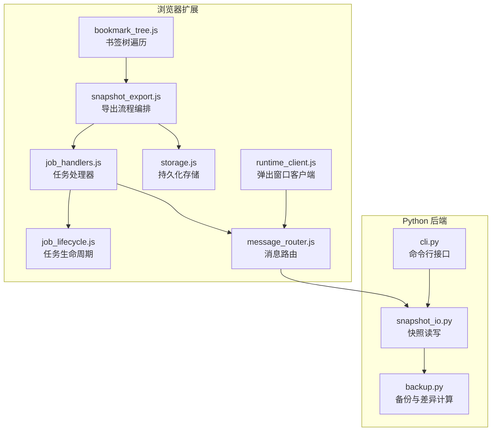
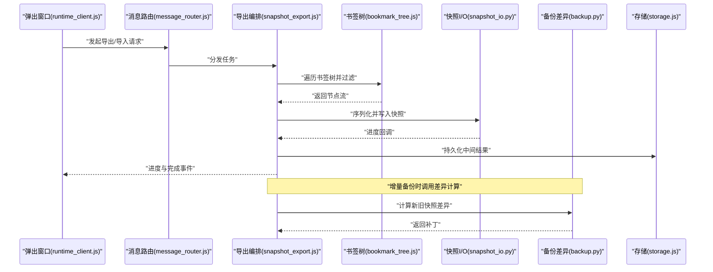
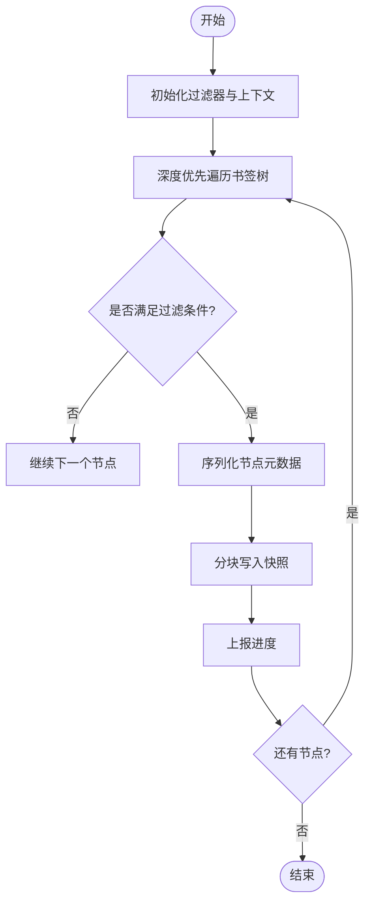
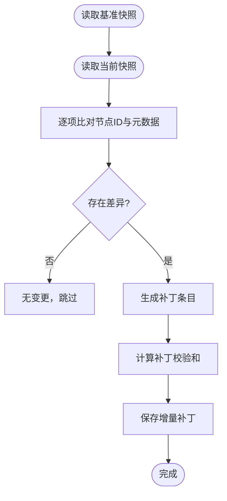
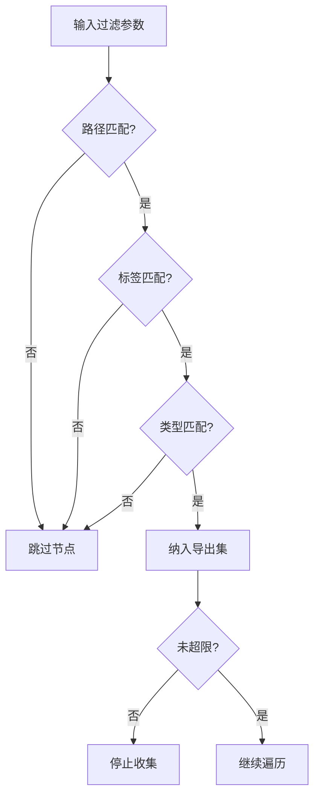
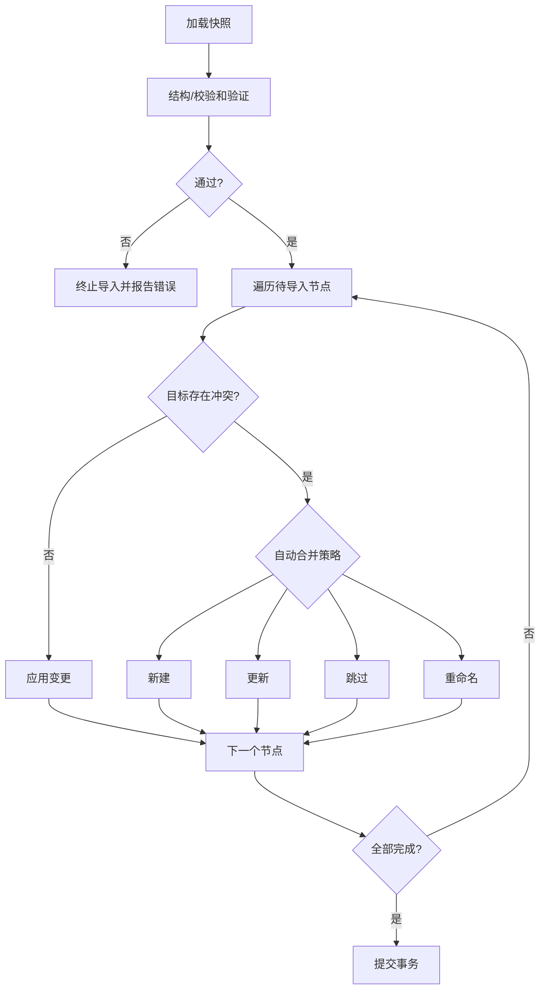
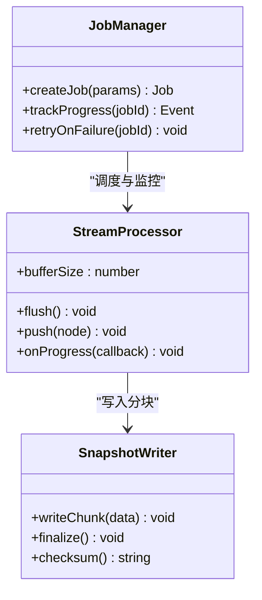
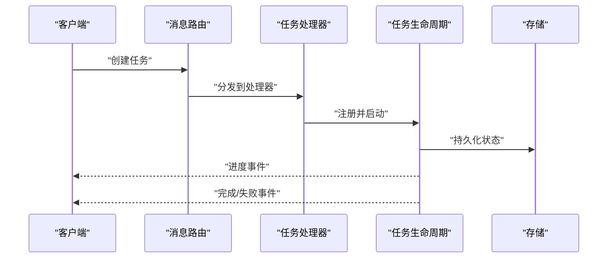
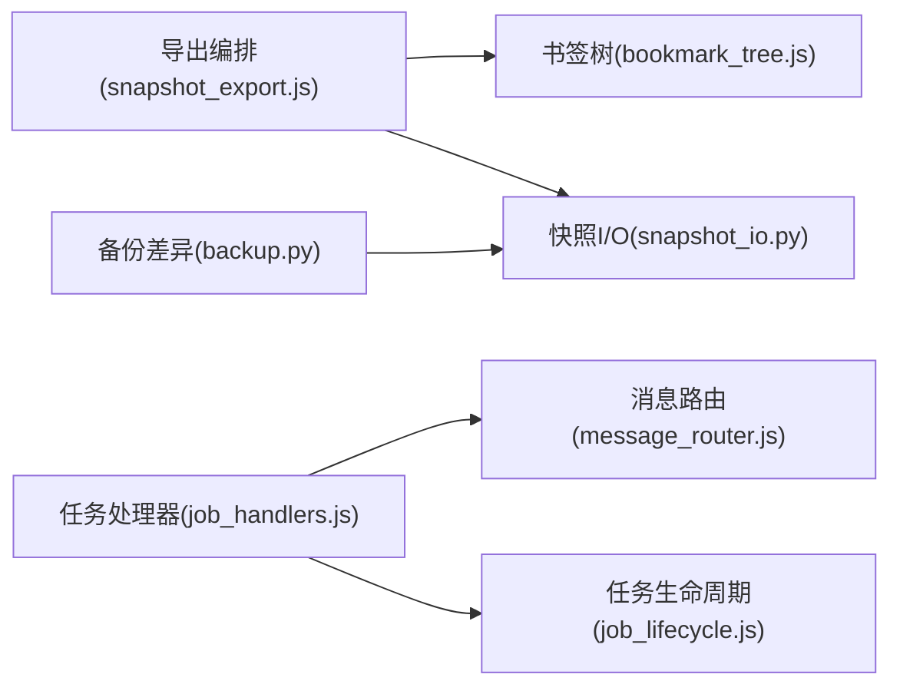

# 导出导入机制

<cite>
**本文引用的文件**   
- [extension/background/snapshot_export.js](file://extension/background/snapshot_export.js)
- [src/bookmark_advisor/snapshot_io.py](file://src/bookmark_advisor/snapshot_io.py)
- [src/bookmark_advisor/backup.py](file://src/bookmark_advisor/backup.py)
- [extension/background/bookmark_tree.js](file://extension/background/bookmark_tree.js)
- [extension/background/job_handlers.js](file://extension/background/job_handlers.js)
- [extension/background/job_lifecycle.js](file://extension/background/job_lifecycle.js)
- [extension/background/message_router.js](file://extension/background/message_router.js)
- [extension/shared/storage.js](file://extension/shared/storage.js)
- [extension/popup/runtime_client.js](file://extension/popup/runtime_client.js)
- [src/bookmark_advisor/cli.py](file://src/bookmark_advisor/cli.py)
- [tests/test_extension_background_snapshot.py](file://tests/test_extension_background_snapshot.py)
</cite>

## 目录
1. [简介](#简介)
2. [项目结构](#项目结构)
3. [核心组件](#核心组件)
4. [架构总览](#架构总览)
5. [详细组件分析](#详细组件分析)
6. [依赖关系分析](#依赖关系分析)
7. [性能考虑](#性能考虑)
8. [故障排查指南](#故障排查指南)
9. [结论](#结论)
10. [附录：API 使用示例](#附录api-使用示例)

## 简介
本文件系统化阐述书签快照的导出与导入机制，覆盖全量导出、增量备份差异计算、选择性导出的过滤策略；导入阶段的数据验证、冲突检测与自动合并；批量操作的性能优化（流式处理、内存管理、进度反馈）；完整的 API 使用示例（命令行工具与 JavaScript API）；错误恢复与数据完整性保证；以及大文件处理的调优建议与最佳实践。

## 项目结构
本项目在浏览器扩展侧与 Python 后端侧共同实现快照导出导入能力：
- 扩展侧负责与浏览器书签树交互、任务编排、消息路由、存储与 UI 集成。
- Python 侧提供快照 I/O、备份与差异计算、CLI 入口等能力。

图表来源
- [extension/background/bookmark_tree.js:1-200](file://extension/background/bookmark_tree.js#L1-L200)
- [extension/background/snapshot_export.js:1-200](file://extension/background/snapshot_export.js#L1-L200)
- [extension/background/job_handlers.js:1-200](file://extension/background/job_handlers.js#L1-L200)
- [extension/background/job_lifecycle.js:1-200](file://extension/background/job_lifecycle.js#L1-L200)
- [extension/background/message_router.js:1-200](file://extension/background/message_router.js#L1-L200)
- [extension/shared/storage.js:1-200](file://extension/shared/storage.js#L1-L200)
- [extension/popup/runtime_client.js:1-200](file://extension/popup/runtime_client.js#L1-L200)
- [src/bookmark_advisor/snapshot_io.py:1-200](file://src/bookmark_advisor/snapshot_io.py#L1-L200)
- [src/bookmark_advisor/backup.py:1-200](file://src/bookmark_advisor/backup.py#L1-L200)
- [src/bookmark_advisor/cli.py:1-200](file://src/bookmark_advisor/cli.py#L1-L200)

章节来源
- [extension/background/snapshot_export.js:1-200](file://extension/background/snapshot_export.js#L1-L200)
- [src/bookmark_advisor/snapshot_io.py:1-200](file://src/bookmark_advisor/snapshot_io.py#L1-L200)
- [src/bookmark_advisor/backup.py:1-200](file://src/bookmark_advisor/backup.py#L1-L200)
- [extension/background/bookmark_tree.js:1-200](file://extension/background/bookmark_tree.js#L1-L200)
- [extension/background/job_handlers.js:1-200](file://extension/background/job_handlers.js#L1-L200)
- [extension/background/job_lifecycle.js:1-200](file://extension/background/job_lifecycle.js#L1-L200)
- [extension/background/message_router.js:1-200](file://extension/background/message_router.js#L1-L200)
- [extension/shared/storage.js:1-200](file://extension/shared/storage.js#L1-L200)
- [extension/popup/runtime_client.js:1-200](file://extension/popup/runtime_client.js#L1-L200)
- [src/bookmark_advisor/cli.py:1-200](file://src/bookmark_advisor/cli.py#L1-L200)

## 核心组件
- 书签树遍历器：负责深度优先遍历书签节点，构建可序列化的树形结构，支持按路径或标签过滤。
- 导出编排器：协调遍历、过滤、序列化、分块写入与进度上报，支持全量与选择性导出。
- 快照 I/O：定义快照格式、校验和、压缩与流式读写，确保跨平台一致性与完整性。
- 备份与差异：对比新旧快照，生成增量补丁，支持基于节点 ID 与时间戳的差异计算。
- 任务系统：将导出/导入封装为任务，提供生命周期管理、状态同步与失败重试。
- 消息路由：统一前后端通信协议，转发导出/导入请求与进度事件。
- CLI：提供命令行接口，便于自动化与批处理。

章节来源
- [extension/background/bookmark_tree.js:1-200](file://extension/background/bookmark_tree.js#L1-L200)
- [extension/background/snapshot_export.js:1-200](file://extension/background/snapshot_export.js#L1-L200)
- [src/bookmark_advisor/snapshot_io.py:1-200](file://src/bookmark_advisor/snapshot_io.py#L1-L200)
- [src/bookmark_advisor/backup.py:1-200](file://src/bookmark_advisor/backup.py#L1-L200)
- [extension/background/job_handlers.js:1-200](file://extension/background/job_handlers.js#L1-L200)
- [extension/background/job_lifecycle.js:1-200](file://extension/background/job_lifecycle.js#L1-L200)
- [extension/background/message_router.js:1-200](file://extension/background/message_router.js#L1-L200)
- [src/bookmark_advisor/cli.py:1-200](file://src/bookmark_advisor/cli.py#L1-L200)

## 架构总览
下图展示从用户触发到完成导出/导入的整体流程，包括扩展侧与 Python 侧的协作。

图表来源
- [extension/popup/runtime_client.js:1-200](file://extension/popup/runtime_client.js#L1-L200)
- [extension/background/message_router.js:1-200](file://extension/background/message_router.js#L1-L200)
- [extension/background/snapshot_export.js:1-200](file://extension/background/snapshot_export.js#L1-L200)
- [extension/background/bookmark_tree.js:1-200](file://extension/background/bookmark_tree.js#L1-L200)
- [src/bookmark_advisor/snapshot_io.py:1-200](file://src/bookmark_advisor/snapshot_io.py#L1-L200)
- [src/bookmark_advisor/backup.py:1-200](file://src/bookmark_advisor/backup.py#L1-L200)
- [extension/shared/storage.js:1-200](file://extension/shared/storage.js#L1-L200)

## 详细组件分析

### 全量导出：书签树遍历与序列化
- 遍历算法：采用深度优先遍历，自根节点向下递归，记录每个节点的元数据（ID、标题、URL、父路径、创建/更新时间等）。
- 过滤机制：支持按路径前缀、标签集合、节点类型进行筛选，减少不必要数据的序列化。
- 序列化与分块：将节点流转换为可传输的片段，逐块写入快照文件，避免一次性加载至内存。
- 进度反馈：每处理一定数量的节点后上报进度，供 UI 显示。

图表来源
- [extension/background/bookmark_tree.js:1-200](file://extension/background/bookmark_tree.js#L1-L200)
- [extension/background/snapshot_export.js:1-200](file://extension/background/snapshot_export.js#L1-L200)

章节来源
- [extension/background/bookmark_tree.js:1-200](file://extension/background/bookmark_tree.js#L1-L200)
- [extension/background/snapshot_export.js:1-200](file://extension/background/snapshot_export.js#L1-L200)

### 增量备份：差异计算与补丁生成
- 基准快照：以最近一次全量快照作为基准。
- 差异维度：基于节点 ID 唯一性、路径变化、时间戳比较，识别新增、修改、删除的节点。
- 补丁格式：仅包含变更的最小集，附带操作类型与目标位置信息。
- 一致性校验：对补丁内容计算校验和，确保传输与落盘完整。

图表来源
- [src/bookmark_advisor/backup.py:1-200](file://src/bookmark_advisor/backup.py#L1-L200)
- [src/bookmark_advisor/snapshot_io.py:1-200](file://src/bookmark_advisor/snapshot_io.py#L1-L200)

章节来源
- [src/bookmark_advisor/backup.py:1-200](file://src/bookmark_advisor/backup.py#L1-L200)
- [src/bookmark_advisor/snapshot_io.py:1-200](file://src/bookmark_advisor/snapshot_io.py#L1-L200)

### 选择性导出：过滤机制与范围限定
- 路径过滤：支持指定根文件夹路径，仅导出该子树。
- 标签过滤：根据节点标签集合匹配，支持交集/并集策略。
- 类型过滤：仅导出特定类型的节点（如网页、文件夹）。
- 大小限制：可选最大节点数或总大小阈值，防止资源耗尽。

图表来源
- [extension/background/bookmark_tree.js:1-200](file://extension/background/bookmark_tree.js#L1-L200)
- [extension/background/snapshot_export.js:1-200](file://extension/background/snapshot_export.js#L1-L200)

章节来源
- [extension/background/bookmark_tree.js:1-200](file://extension/background/bookmark_tree.js#L1-L200)
- [extension/background/snapshot_export.js:1-200](file://extension/background/snapshot_export.js#L1-L200)

### 导入过程：数据验证、冲突检测与自动合并
- 数据验证：检查快照结构、必填字段、引用完整性与校验和。
- 冲突检测：当目标位置已存在同名或同 URL 节点时标记冲突。
- 自动合并策略：
  - 新建：目标不存在则直接插入。
  - 更新：目标存在且元数据不同则更新。
  - 跳过：目标存在且完全一致则跳过。
  - 重命名：发生冲突时按策略追加后缀或选择保留旧值。
- 事务回滚：导入过程中出现异常时回滚已应用的操作，保证最终一致性。

图表来源
- [src/bookmark_advisor/snapshot_io.py:1-200](file://src/bookmark_advisor/snapshot_io.py#L1-L200)
- [extension/background/snapshot_export.js:1-200](file://extension/background/snapshot_export.js#L1-L200)

章节来源
- [src/bookmark_advisor/snapshot_io.py:1-200](file://src/bookmark_advisor/snapshot_io.py#L1-L200)
- [extension/background/snapshot_export.js:1-200](file://extension/background/snapshot_export.js#L1-L200)

### 批量操作：流式处理、内存管理与进度反馈
- 流式处理：节点以迭代器形式产生，避免一次性构建完整树。
- 内存管理：设置缓冲区上限，达到阈值时刷新到磁盘。
- 进度反馈：周期性上报已完成节点数、耗时与剩余估算。
- 并发控制：限制并行度，避免阻塞主线程或造成 I/O 争用。

图表来源
- [extension/background/snapshot_export.js:1-200](file://extension/background/snapshot_export.js#L1-L200)
- [extension/background/job_lifecycle.js:1-200](file://extension/background/job_lifecycle.js#L1-L200)
- [extension/shared/storage.js:1-200](file://extension/shared/storage.js#L1-L200)

章节来源
- [extension/background/snapshot_export.js:1-200](file://extension/background/snapshot_export.js#L1-L200)
- [extension/background/job_lifecycle.js:1-200](file://extension/background/job_lifecycle.js#L1-L200)
- [extension/shared/storage.js:1-200](file://extension/shared/storage.js#L1-L200)

### 任务系统与消息路由
- 任务创建：由弹出窗口或外部客户端发起，携带参数（导出范围、目标路径、增量标志等）。
- 生命周期：启动、运行中、暂停、完成、失败、重试。
- 消息协议：统一的消息类型与载荷结构，支持进度事件与错误上报。
- 持久化：任务状态与中间结果落盘，崩溃后可恢复。

图表来源
- [extension/background/message_router.js:1-200](file://extension/background/message_router.js#L1-L200)
- [extension/background/job_handlers.js:1-200](file://extension/background/job_handlers.js#L1-L200)
- [extension/background/job_lifecycle.js:1-200](file://extension/background/job_lifecycle.js#L1-L200)
- [extension/shared/storage.js:1-200](file://extension/shared/storage.js#L1-L200)

章节来源
- [extension/background/message_router.js:1-200](file://extension/background/message_router.js#L1-L200)
- [extension/background/job_handlers.js:1-200](file://extension/background/job_handlers.js#L1-L200)
- [extension/background/job_lifecycle.js:1-200](file://extension/background/job_lifecycle.js#L1-L200)
- [extension/shared/storage.js:1-200](file://extension/shared/storage.js#L1-L200)

## 依赖关系分析
- 模块耦合：
  - 导出编排器依赖书签树遍历器与快照 I/O。
  - 任务处理器依赖消息路由与任务生命周期。
  - 增量备份依赖快照 I/O 与差异计算逻辑。
- 外部依赖：
  - 浏览器书签 API（扩展侧）。
  - 文件系统与压缩库（Python 侧）。
- 潜在循环依赖：
  - 通过消息路由解耦前后端，避免直接相互引用。

图表来源
- [extension/background/snapshot_export.js:1-200](file://extension/background/snapshot_export.js#L1-L200)
- [extension/background/bookmark_tree.js:1-200](file://extension/background/bookmark_tree.js#L1-L200)
- [src/bookmark_advisor/snapshot_io.py:1-200](file://src/bookmark_advisor/snapshot_io.py#L1-L200)
- [extension/background/job_handlers.js:1-200](file://extension/background/job_handlers.js#L1-L200)
- [extension/background/message_router.js:1-200](file://extension/background/message_router.js#L1-L200)
- [extension/background/job_lifecycle.js:1-200](file://extension/background/job_lifecycle.js#L1-L200)
- [src/bookmark_advisor/backup.py:1-200](file://src/bookmark_advisor/backup.py#L1-L200)

章节来源
- [extension/background/snapshot_export.js:1-200](file://extension/background/snapshot_export.js#L1-L200)
- [extension/background/bookmark_tree.js:1-200](file://extension/background/bookmark_tree.js#L1-L200)
- [src/bookmark_advisor/snapshot_io.py:1-200](file://src/bookmark_advisor/snapshot_io.py#L1-L200)
- [extension/background/job_handlers.js:1-200](file://extension/background/job_handlers.js#L1-L200)
- [extension/background/message_router.js:1-200](file://extension/background/message_router.js#L1-L200)
- [extension/background/job_lifecycle.js:1-200](file://extension/background/job_lifecycle.js#L1-L200)
- [src/bookmark_advisor/backup.py:1-200](file://src/bookmark_advisor/backup.py#L1-L200)

## 性能考虑
- 流式处理：以迭代器方式生成节点，降低峰值内存占用。
- 分块写入：设定合适的块大小，平衡 I/O 次数与内存占用。
- 并发控制：限制并行度，避免 CPU 与磁盘争用。
- 缓存策略：对频繁访问的路径索引进行缓存，提升过滤效率。
- 压缩与校验：仅在必要时启用压缩，权衡体积与速度；校验和计算尽量异步。
- 进度反馈：合理频率上报，避免 UI 卡顿。

[本节为通用指导，不直接分析具体文件]

## 故障排查指南
- 常见问题：
  - 导出中断：检查任务状态与中间文件完整性，尝试重试。
  - 导入失败：核对快照结构与校验和，确认目标环境兼容性。
  - 冲突过多：调整自动合并策略，或手动干预冲突节点。
- 日志与诊断：
  - 查看任务生命周期事件与错误堆栈。
  - 检查消息路由的错误上报通道。
- 恢复策略：
  - 利用持久化状态恢复未完成的任务。
  - 使用最近成功快照作为回滚点。

章节来源
- [extension/background/job_lifecycle.js:1-200](file://extension/background/job_lifecycle.js#L1-L200)
- [extension/background/message_router.js:1-200](file://extension/background/message_router.js#L1-L200)
- [tests/test_extension_background_snapshot.py:1-200](file://tests/test_extension_background_snapshot.py#L1-L200)

## 结论
本机制通过模块化设计与流式处理，实现了高效、可靠的书签快照导出与导入。全量导出与增量备份相结合，既保证了数据一致性，又提升了性能。完善的任务系统与消息路由使批量操作具备可观测性与可恢复性。配合合理的性能调优与故障排查策略，可在大规模书签场景下稳定运行。

[本节为总结，不直接分析具体文件]

## 附录：API 使用示例

### 命令行工具（Python）
- 导出全量快照：
  - 命令：调用 CLI 导出入口，指定输出路径与可选过滤参数。
  - 参考路径：[src/bookmark_advisor/cli.py:1-200](file://src/bookmark_advisor/cli.py#L1-L200)
- 增量备份：
  - 命令：指定基准快照与当前快照，生成补丁。
  - 参考路径：[src/bookmark_advisor/backup.py:1-200](file://src/bookmark_advisor/backup.py#L1-L200)
- 导入快照：
  - 命令：加载快照并执行导入，支持冲突策略选项。
  - 参考路径：[src/bookmark_advisor/snapshot_io.py:1-200](file://src/bookmark_advisor/snapshot_io.py#L1-L200)

章节来源
- [src/bookmark_advisor/cli.py:1-200](file://src/bookmark_advisor/cli.py#L1-L200)
- [src/bookmark_advisor/backup.py:1-200](file://src/bookmark_advisor/backup.py#L1-L200)
- [src/bookmark_advisor/snapshot_io.py:1-200](file://src/bookmark_advisor/snapshot_io.py#L1-L200)

### JavaScript API（扩展侧）
- 发起导出：
  - 通过弹出窗口客户端发送导出请求，监听进度与完成事件。
  - 参考路径：[extension/popup/runtime_client.js:1-200](file://extension/popup/runtime_client.js#L1-L200)
- 任务管理：
  - 使用任务处理器创建与管理导出/导入任务。
  - 参考路径：[extension/background/job_handlers.js:1-200](file://extension/background/job_handlers.js#L1-L200)
- 消息路由：
  - 通过消息路由统一收发导出/导入相关消息。
  - 参考路径：[extension/background/message_router.js:1-200](file://extension/background/message_router.js#L1-L200)

章节来源
- [extension/popup/runtime_client.js:1-200](file://extension/popup/runtime_client.js#L1-L200)
- [extension/background/job_handlers.js:1-200](file://extension/background/job_handlers.js#L1-L200)
- [extension/background/message_router.js:1-200](file://extension/background/message_router.js#L1-L200)