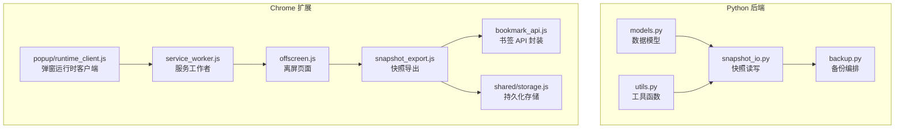
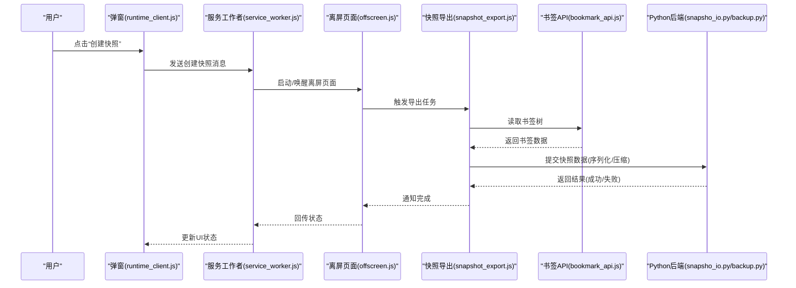
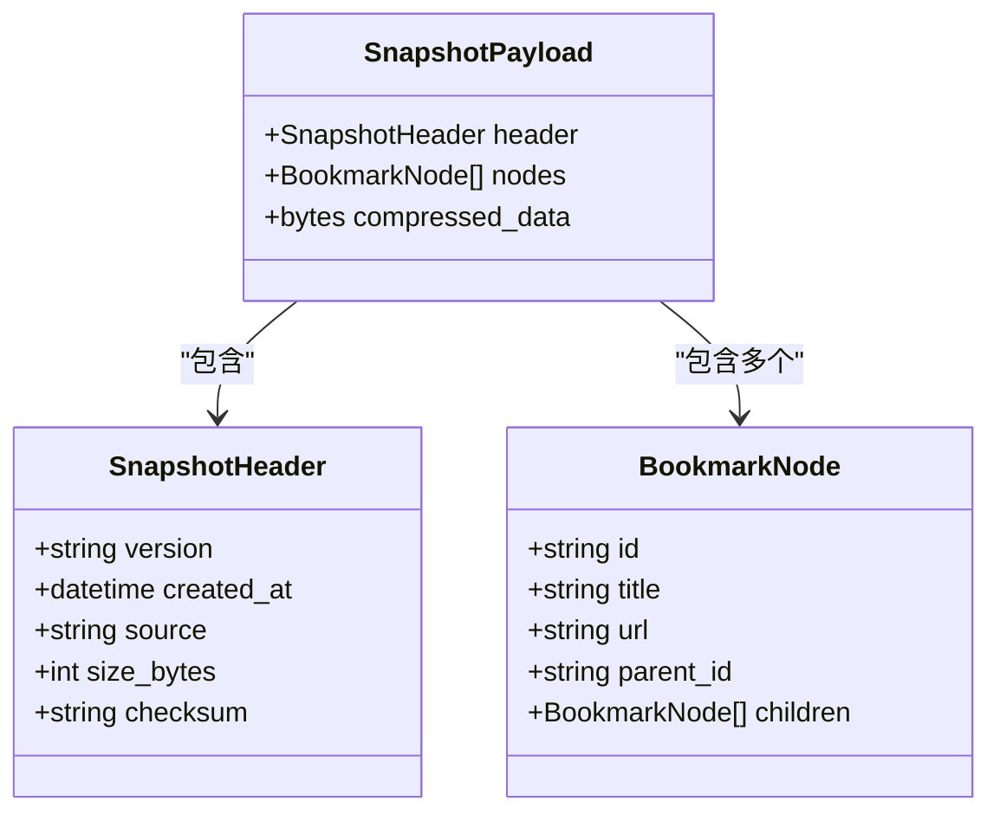
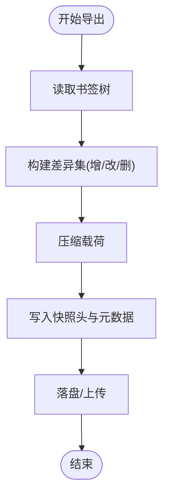
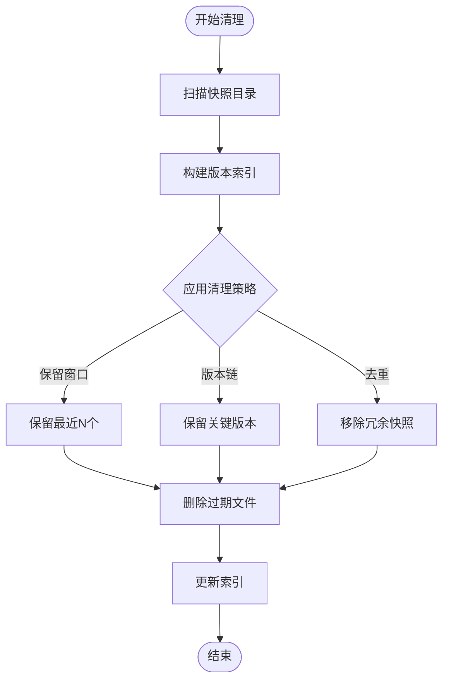
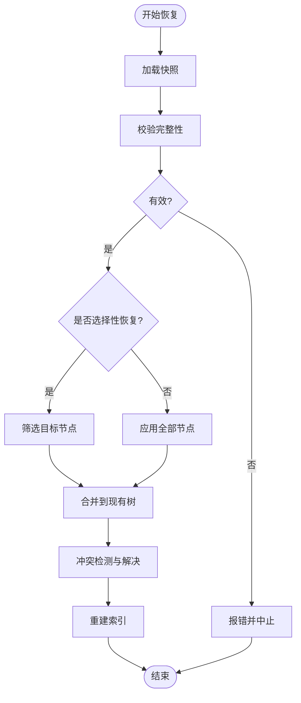
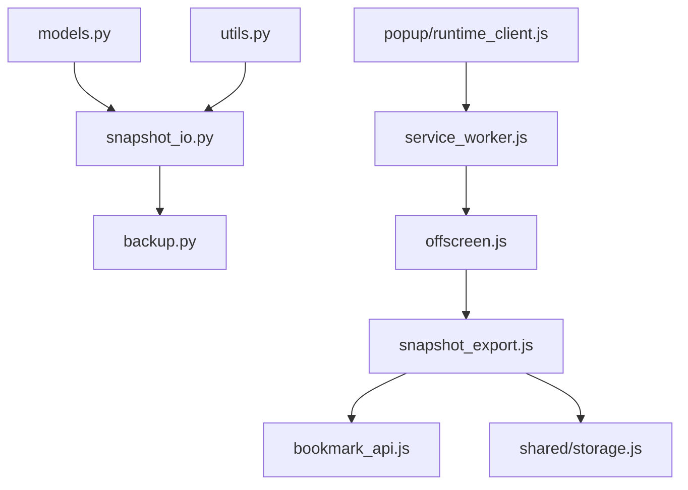

# 快照备份系统

<cite>
**本文引用的文件**   
- [README.md](file://README.md)
- [pyproject.toml](file://pyproject.toml)
- [src/bookmark_advisor/snapshot_io.py](file://src/bookmark_advisor/snapshot_io.py)
- [src/bookmark_advisor/backup.py](file://src/bookmark_advisor/backup.py)
- [src/bookmark_advisor/models.py](file://src/bookmark_advisor/models.py)
- [src/bookmark_advisor/utils.py](file://src/bookmark_advisor/utils.py)
- [extension/background/snapshot_export.js](file://extension/background/snapshot_export.js)
- [extension/background/bookmark_api.js](file://extension/background/bookmark_api.js)
- [extension/shared/storage.js](file://extension/shared/storage.js)
- [extension/offscreen.js](file://extension/offscreen.js)
- [extension/service_worker.js](file://extension/service_worker.js)
- [extension/popup/runtime_client.js](file://extension/popup/runtime_client.js)
- [tests/test_extension_background_snapshot.py](file://tests/test_extension_background_snapshot.py)
</cite>

## 目录
1. [简介](#简介)
2. [项目结构](#项目结构)
3. [核心组件](#核心组件)
4. [架构总览](#架构总览)
5. [详细组件分析](#详细组件分析)
6. [依赖关系分析](#依赖关系分析)
7. [性能考虑](#性能考虑)
8. [故障排查指南](#故障排查指南)
9. [结论](#结论)
10. [附录](#附录)

## 简介
本文件面向“书签快照备份系统”，围绕以下目标展开：
- 数据结构与序列化：书签数据模型、快照文件格式、版本兼容策略
- 导出与导入：增量备份、差异计算、压缩优化
- 存储管理：本地文件系统操作、空间管理与清理策略
- 恢复机制：全量恢复、选择性恢复、冲突解决
- 版本控制与历史：时间线浏览、版本比较
- 使用示例：手动备份、自动备份计划、灾难恢复
- 安全与性能：数据安全与性能优化建议

该系统由两部分组成：
- Python 后端（src/bookmark_advisor）：负责快照 I/O、备份编排、模型定义与工具函数
- Chrome 扩展前端（extension）：负责从浏览器读取书签、触发导出、与后台通信

## 项目结构
仓库采用前后端分离的组织方式：
- src/bookmark_advisor：Python 实现的快照 I/O、备份流程、模型与工具
- extension：Chrome 扩展，包含背景脚本、弹窗界面、共享模块与测试
- tests：覆盖扩展行为与部分逻辑的测试用例
- docs：设计文档与审计记录
- pyproject.toml：Python 包配置与入口点

图表来源
- [src/bookmark_advisor/snapshot_io.py](file://src/bookmark_advisor/snapshot_io.py)
- [src/bookmark_advisor/backup.py](file://src/bookmark_advisor/backup.py)
- [src/bookmark_advisor/models.py](file://src/bookmark_advisor/models.py)
- [src/bookmark_advisor/utils.py](file://src/bookmark_advisor/utils.py)
- [extension/service_worker.js](file://extension/service_worker.js)
- [extension/offscreen.js](file://extension/offscreen.js)
- [extension/background/snapshot_export.js](file://extension/background/snapshot_export.js)
- [extension/background/bookmark_api.js](file://extension/background/bookmark_api.js)
- [extension/shared/storage.js](file://extension/shared/storage.js)
- [extension/popup/runtime_client.js](file://extension/popup/runtime_client.js)

章节来源
- [README.md](file://README.md)
- [pyproject.toml](file://pyproject.toml)

## 核心组件
- 快照 I/O（snapshot_io.py）：提供快照文件的写入、读取、校验与元数据管理，是备份与恢复的核心。
- 备份编排（backup.py）：协调快照生成、增量/差异计算、归档与清理等流程。
- 数据模型（models.py）：定义书签节点、快照头、版本字段等结构化类型。
- 工具函数（utils.py）：提供原子写、路径处理、时间戳与校验和等通用能力。
- 扩展侧导出（snapshot_export.js）：在离屏页面中收集书签树并调用后端接口或落盘。
- 书签 API（bookmark_api.js）：封装浏览器书签 API 的访问与错误处理。
- 共享存储（storage.js）：跨上下文持久化配置与状态。
- 服务工作者与离屏页面（service_worker.js、offscreen.js）：承载异步任务与 UI 隔离。
- 弹窗运行时客户端（runtime_client.js）：为弹窗提供与后台通信的便捷方法。

章节来源
- [src/bookmark_advisor/snapshot_io.py](file://src/bookmark_advisor/snapshot_io.py)
- [src/bookmark_advisor/backup.py](file://src/bookmark_advisor/backup.py)
- [src/bookmark_advisor/models.py](file://src/bookmark_advisor/models.py)
- [src/bookmark_advisor/utils.py](file://src/bookmark_advisor/utils.py)
- [extension/background/snapshot_export.js](file://extension/background/snapshot_export.js)
- [extension/background/bookmark_api.js](file://extension/background/bookmark_api.js)
- [extension/shared/storage.js](file://extension/shared/storage.js)
- [extension/offscreen.js](file://extension/offscreen.js)
- [extension/service_worker.js](file://extension/service_worker.js)
- [extension/popup/runtime_client.js](file://extension/popup/runtime_client.js)

## 架构总览
整体交互流程如下：
- 用户通过弹窗发起备份请求
- 服务工作者调度离屏页面执行导出
- 离屏页面读取书签树并组装快照数据
- 快照数据通过共享存储或 IPC 传递到后端
- 后端进行序列化、校验、压缩与落盘
- 可选地生成增量/差异文件并维护版本索引

图表来源
- [extension/popup/runtime_client.js](file://extension/popup/runtime_client.js)
- [extension/service_worker.js](file://extension/service_worker.js)
- [extension/offscreen.js](file://extension/offscreen.js)
- [extension/background/snapshot_export.js](file://extension/background/snapshot_export.js)
- [extension/background/bookmark_api.js](file://extension/background/bookmark_api.js)
- [src/bookmark_advisor/snapshot_io.py](file://src/bookmark_advisor/snapshot_io.py)
- [src/bookmark_advisor/backup.py](file://src/bookmark_advisor/backup.py)

## 详细组件分析

### 快照数据模型与序列化
- 数据模型（models.py）定义了书签节点、快照头、版本字段等核心结构，确保前后端一致。
- 序列化格式（snapshot_io.py）将模型序列化为可传输/可持久化的字节流，支持：
  - 版本号字段用于向前/向后兼容
  - 元数据（时间戳、哈希、大小、来源）
  - 可选压缩载荷
- 兼容性策略：
  - 读取时根据版本号选择解析器分支
  - 对未知字段采取宽容解析（忽略或默认值）
  - 写入时始终携带当前最高版本

图表来源
- [src/bookmark_advisor/models.py](file://src/bookmark_advisor/models.py)
- [src/bookmark_advisor/snapshot_io.py](file://src/bookmark_advisor/snapshot_io.py)

章节来源
- [src/bookmark_advisor/models.py](file://src/bookmark_advisor/models.py)
- [src/bookmark_advisor/snapshot_io.py](file://src/bookmark_advisor/snapshot_io.py)

### 导出与导入机制（增量、差异、压缩）
- 导出流程（snapshot_export.js + bookmark_api.js）：
  - 遍历书签树，构建内存中的节点集合
  - 合并新增、修改、删除项，生成差异集
  - 将差异集与基线快照组合成完整快照
- 导入流程（snapshot_io.py + backup.py）：
  - 校验快照完整性（头部、校验和）
  - 解压并解析快照
  - 应用变更到目标存储
- 增量与差异：
  - 基于节点 ID 与时间戳对比，仅输出变化部分
  - 保留基线指针以便快速重建
- 压缩优化：
  - 对负载段使用高效压缩算法
  - 按块压缩以支持断点续传与并行解压

图表来源
- [extension/background/snapshot_export.js](file://extension/background/snapshot_export.js)
- [extension/background/bookmark_api.js](file://extension/background/bookmark_api.js)
- [src/bookmark_advisor/snapshot_io.py](file://src/bookmark_advisor/snapshot_io.py)
- [src/bookmark_advisor/backup.py](file://src/bookmark_advisor/backup.py)

章节来源
- [extension/background/snapshot_export.js](file://extension/background/snapshot_export.js)
- [extension/background/bookmark_api.js](file://extension/background/bookmark_api.js)
- [src/bookmark_advisor/snapshot_io.py](file://src/bookmark_advisor/snapshot_io.py)
- [src/bookmark_advisor/backup.py](file://src/bookmark_advisor/backup.py)

### 存储管理（本地文件系统、空间管理、清理策略）
- 本地文件系统操作（utils.py + snapshot_io.py）：
  - 原子写入（临时文件+重命名），避免损坏
  - 目录结构与命名约定（按时间戳/版本号组织）
- 存储空间管理：
  - 统计快照占用，限制最大数量或总容量
  - 识别冗余快照（被后续快照完全包含）
- 清理策略：
  - 基于保留窗口（如最近 N 天）
  - 基于版本链（保留关键里程碑）
  - 回收空间后更新索引

图表来源
- [src/bookmark_advisor/utils.py](file://src/bookmark_advisor/utils.py)
- [src/bookmark_advisor/snapshot_io.py](file://src/bookmark_advisor/snapshot_io.py)
- [src/bookmark_advisor/backup.py](file://src/bookmark_advisor/backup.py)

章节来源
- [src/bookmark_advisor/utils.py](file://src/bookmark_advisor/utils.py)
- [src/bookmark_advisor/snapshot_io.py](file://src/bookmark_advisor/snapshot_io.py)
- [src/bookmark_advisor/backup.py](file://src/bookmark_advisor/backup.py)

### 恢复机制（全量、选择性、冲突解决）
- 全量恢复：
  - 加载指定快照，解压并应用全部节点
  - 校验一致性，必要时重建索引
- 选择性恢复：
  - 按标签/文件夹/ID 过滤节点子集
  - 合并到现有书签树，避免重复
- 冲突解决：
  - 同名/同 URL 冲突时，优先保留最新时间戳
  - 提供“跳过/覆盖/重命名”策略选项

图表来源
- [src/bookmark_advisor/snapshot_io.py](file://src/bookmark_advisor/snapshot_io.py)
- [src/bookmark_advisor/backup.py](file://src/bookmark_advisor/backup.py)

章节来源
- [src/bookmark_advisor/snapshot_io.py](file://src/bookmark_advisor/snapshot_io.py)
- [src/bookmark_advisor/backup.py](file://src/bookmark_advisor/backup.py)

### 版本控制与历史管理（时间线、比较）
- 版本控制：
  - 每个快照包含唯一标识与时间戳
  - 维护版本链，支持回溯到任意时间点
- 时间线浏览：
  - 按时间排序展示快照列表
  - 显示大小、来源、校验和摘要
- 版本比较：
  - 基于节点 ID 与内容哈希计算差异
  - 可视化变更（新增/删除/修改）

图表来源
- [src/bookmark_advisor/snapshot_io.py](file://src/bookmark_advisor/snapshot_io.py)
- [src/bookmark_advisor/backup.py](file://src/bookmark_advisor/backup.py)

章节来源
- [src/bookmark_advisor/snapshot_io.py](file://src/bookmark_advisor/snapshot_io.py)
- [src/bookmark_advisor/backup.py](file://src/bookmark_advisor/backup.py)

### 使用示例（手动备份、自动计划、灾难恢复）
- 手动备份：
  - 在弹窗中点击“创建快照”，等待完成提示
- 自动备份计划：
  - 通过后台任务定时触发导出
  - 结合清理策略定期归档与回收
- 灾难恢复：
  - 选择最近可用快照进行全量恢复
  - 若需细粒度恢复，使用选择性恢复功能

章节来源
- [extension/popup/runtime_client.js](file://extension/popup/runtime_client.js)
- [extension/service_worker.js](file://extension/service_worker.js)
- [extension/offscreen.js](file://extension/offscreen.js)
- [extension/background/snapshot_export.js](file://extension/background/snapshot_export.js)
- [src/bookmark_advisor/backup.py](file://src/bookmark_advisor/backup.py)

## 依赖关系分析
- 模块内聚与耦合：
  - snapshot_io.py 与 models.py 高内聚，负责数据层
  - backup.py 作为编排层，依赖 snapshot_io.py 与 utils.py
  - 扩展侧 snapshot_export.js 依赖 bookmark_api.js 与 shared/storage.js
- 外部依赖：
  - 浏览器书签 API（扩展侧）
  - 操作系统文件系统（Python 侧）

图表来源
- [src/bookmark_advisor/models.py](file://src/bookmark_advisor/models.py)
- [src/bookmark_advisor/snapshot_io.py](file://src/bookmark_advisor/snapshot_io.py)
- [src/bookmark_advisor/utils.py](file://src/bookmark_advisor/utils.py)
- [src/bookmark_advisor/backup.py](file://src/bookmark_advisor/backup.py)
- [extension/background/snapshot_export.js](file://extension/background/snapshot_export.js)
- [extension/background/bookmark_api.js](file://extension/background/bookmark_api.js)
- [extension/shared/storage.js](file://extension/shared/storage.js)
- [extension/service_worker.js](file://extension/service_worker.js)
- [extension/offscreen.js](file://extension/offscreen.js)
- [extension/popup/runtime_client.js](file://extension/popup/runtime_client.js)

章节来源
- [src/bookmark_advisor/models.py](file://src/bookmark_advisor/models.py)
- [src/bookmark_advisor/snapshot_io.py](file://src/bookmark_advisor/snapshot_io.py)
- [src/bookmark_advisor/utils.py](file://src/bookmark_advisor/utils.py)
- [src/bookmark_advisor/backup.py](file://src/bookmark_advisor/backup.py)
- [extension/background/snapshot_export.js](file://extension/background/snapshot_export.js)
- [extension/background/bookmark_api.js](file://extension/background/bookmark_api.js)
- [extension/shared/storage.js](file://extension/shared/storage.js)
- [extension/service_worker.js](file://extension/service_worker.js)
- [extension/offscreen.js](file://extension/offscreen.js)
- [extension/popup/runtime_client.js](file://extension/popup/runtime_client.js)

## 性能考虑
- 增量与差异：
  - 仅传输与存储变更，降低带宽与磁盘占用
  - 使用节点 ID 与时间戳加速比对
- 压缩与分块：
  - 大负载分段压缩，提升 I/O 吞吐
  - 支持并行解压与随机访问
- 原子写入与校验：
  - 减少中断导致的损坏风险
  - 校验和保障数据一致性
- 资源管理：
  - 限制并发任务数，避免阻塞 UI
  - 合理设置缓存与索引刷新频率

[本节为通用指导，不直接分析具体文件]

## 故障排查指南
- 常见问题定位：
  - 导出失败：检查书签 API 权限与离屏页面状态
  - 快照损坏：验证校验和与头部完整性
  - 恢复冲突：确认冲突解决策略与时间戳优先级
- 日志与诊断：
  - 查看弹窗与服务工作者的消息路由
  - 检查 Python 端的异常堆栈与中间产物
- 参考测试用例：
  - 扩展背景快照相关测试有助于复现与回归

章节来源
- [tests/test_extension_background_snapshot.py](file://tests/test_extension_background_snapshot.py)
- [extension/popup/runtime_client.js](file://extension/popup/runtime_client.js)
- [extension/service_worker.js](file://extension/service_worker.js)
- [extension/offscreen.js](file://extension/offscreen.js)
- [extension/background/snapshot_export.js](file://extension/background/snapshot_export.js)
- [src/bookmark_advisor/snapshot_io.py](file://src/bookmark_advisor/snapshot_io.py)

## 结论
本快照备份系统通过清晰的数据模型、稳健的序列化与校验、灵活的增量与差异机制、完善的存储与恢复策略，提供了可靠的书签数据保护方案。配合自动化计划与灾难恢复场景，可在日常使用中显著提升数据安全性与可用性。建议在部署时关注性能调优与安全加固，以确保大规模书签环境下的稳定运行。

[本节为总结性内容，不直接分析具体文件]

## 附录
- 术语表：
  - 快照：某一时刻的书签数据完整或增量表示
  - 增量：相对于基线的变更集合
  - 差异：两个快照之间的变更集合
  - 原子写入：先写临时文件再重命名的写入方式
- 最佳实践：
  - 定期创建全量快照，并结合增量快照减少存储压力
  - 启用校验与压缩，确保数据完整性与传输效率
  - 制定合理的保留与清理策略，避免无限增长

[本节为补充信息，不直接分析具体文件]