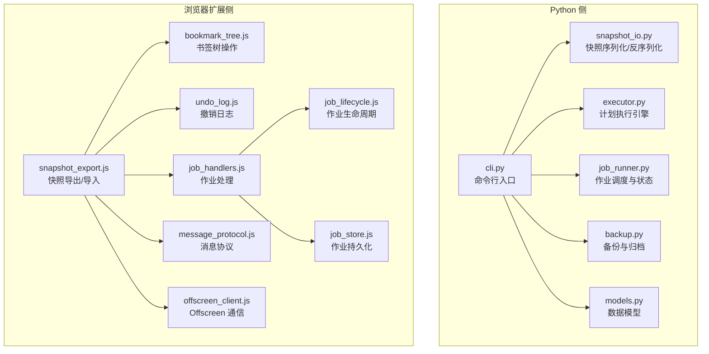
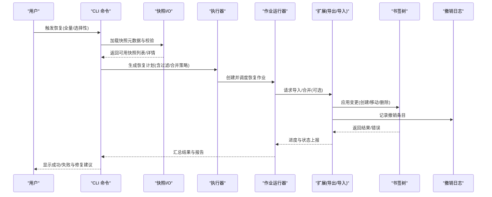
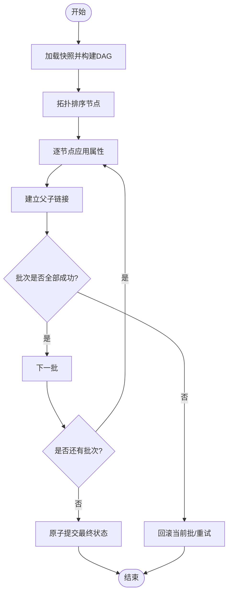
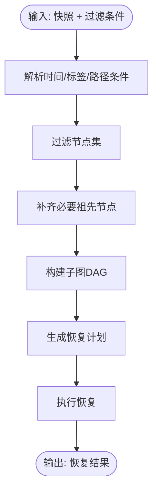
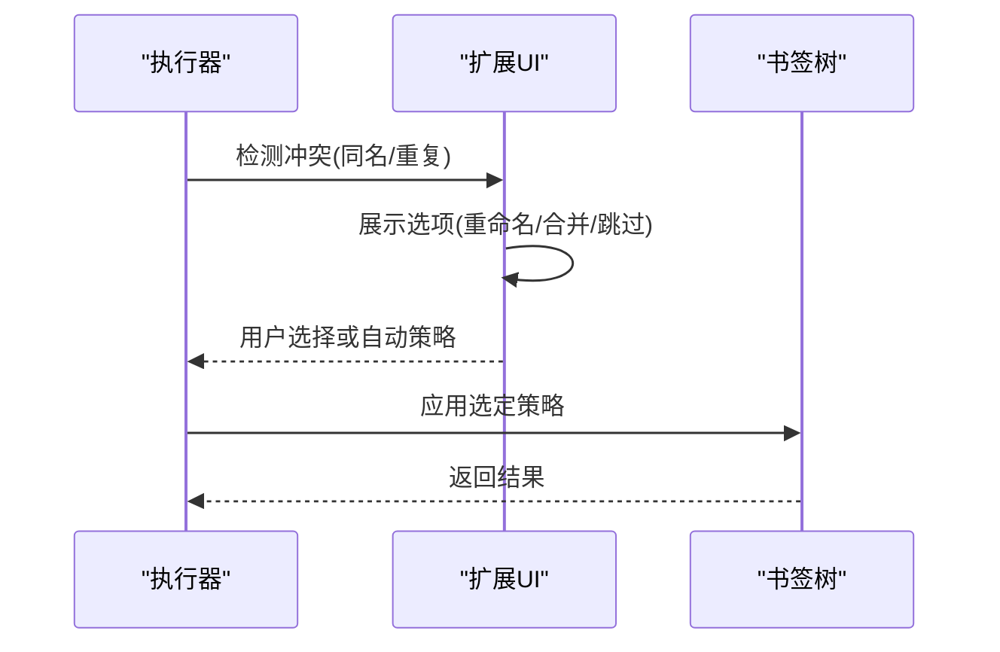
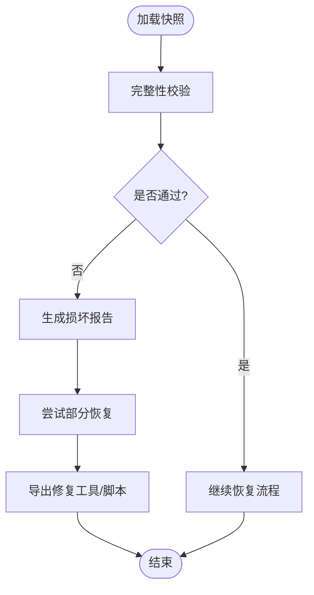
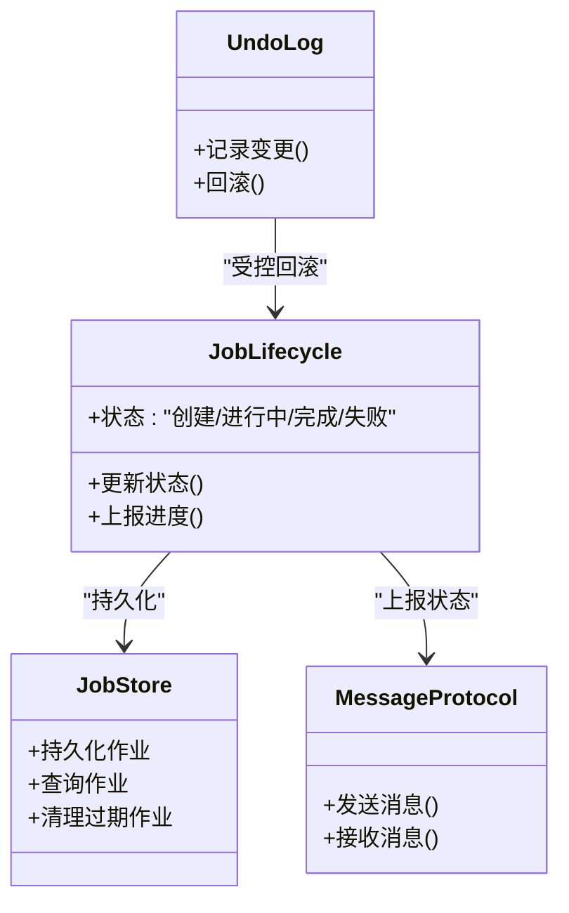
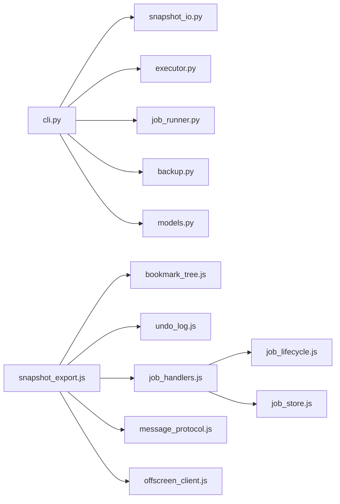

# 恢复机制与灾难恢复

<cite>
**本文引用的文件**   
- [snapshot_io.py](file://src/bookmark_advisor/snapshot_io.py)
- [executor.py](file://src/bookmark_advisor/executor.py)
- [job_runner.py](file://src/bookmark_advisor/job_runner.py)
- [backup.py](file://src/bookmark_advisor/backup.py)
- [cli.py](file://src/bookmark_advisor/cli.py)
- [models.py](file://src/bookmark_advisor/models.py)
- [plan_schema.js](file://extension/shared/plan_schema.js)
- [snapshot_export.js](file://extension/background/snapshot_export.js)
- [bookmark_tree.js](file://extension/background/bookmark_tree.js)
- [undo_log.js](file://extension/background/undo_log.js)
- [job_handlers.js](file://extension/background/job_handlers.js)
- [job_lifecycle.js](file://extension/background/job_lifecycle.js)
- [job_store.js](file://extension/background/job_store.js)
- [message_protocol.js](file://extension/shared/message_protocol.js)
- [offscreen_client.js](file://extension/background/offscreen_client.js)
- [atomic_write_test.py](file://tests/test_atomic_write.py)
</cite>

## 目录
1. [简介](#简介)
2. [项目结构](#项目结构)
3. [核心组件](#核心组件)
4. [架构总览](#架构总览)
5. [详细组件分析](#详细组件分析)
6. [依赖关系分析](#依赖关系分析)
7. [性能考虑](#性能考虑)
8. [故障排查指南](#故障排查指南)
9. [结论](#结论)
10. [附录](#附录)

## 简介
本文件围绕“快照恢复机制”提供系统化文档，覆盖全量恢复、选择性恢复、冲突解决、灾难恢复场景、用户界面反馈、错误提示以及性能优化策略。内容基于仓库中 Python 侧的快照 I/O、执行器、任务运行器、备份模块与浏览器扩展侧的快照导出、书签树操作、撤销日志、作业生命周期等实现进行综合梳理，帮助读者理解从数据重建到事务性提交、从原子写入到部分恢复的完整链路。

## 项目结构
本项目包含两部分：
- Python 侧（src/bookmark_advisor）：负责快照读写、计划生成与执行、作业调度与持久化、备份与工具入口。
- 浏览器扩展侧（extension）：负责在浏览器环境中导出/导入快照、管理书签树、维护撤销日志、协调后台作业与 UI。

图表来源
- [cli.py](file://src/bookmark_advisor/cli.py)
- [snapshot_io.py](file://src/bookmark_advisor/snapshot_io.py)
- [executor.py](file://src/bookmark_advisor/executor.py)
- [job_runner.py](file://src/bookmark_advisor/job_runner.py)
- [backup.py](file://src/bookmark_advisor/backup.py)
- [models.py](file://src/bookmark_advisor/models.py)
- [snapshot_export.js](file://extension/background/snapshot_export.js)
- [bookmark_tree.js](file://extension/background/bookmark_tree.js)
- [undo_log.js](file://extension/background/undo_log.js)
- [job_handlers.js](file://extension/background/job_handlers.js)
- [job_lifecycle.js](file://extension/background/job_lifecycle.js)
- [job_store.js](file://extension/background/job_store.js)
- [message_protocol.js](file://extension/shared/message_protocol.js)
- [offscreen_client.js](file://extension/background/offscreen_client.js)

章节来源
- [cli.py](file://src/bookmark_advisor/cli.py)
- [snapshot_io.py](file://src/bookmark_advisor/snapshot_io.py)
- [executor.py](file://src/bookmark_advisor/executor.py)
- [job_runner.py](file://src/bookmark_advisor/job_runner.py)
- [backup.py](file://src/bookmark_advisor/backup.py)
- [models.py](file://src/bookmark_advisor/models.py)
- [snapshot_export.js](file://extension/background/snapshot_export.js)
- [bookmark_tree.js](file://extension/background/bookmark_tree.js)
- [undo_log.js](file://extension/background/undo_log.js)
- [job_handlers.js](file://extension/background/job_handlers.js)
- [job_lifecycle.js](file://extension/background/job_lifecycle.js)
- [job_store.js](file://extension/background/job_store.js)
- [message_protocol.js](file://extension/shared/message_protocol.js)
- [offscreen_client.js](file://extension/background/offscreen_client.js)

## 核心组件
- 快照 I/O：负责将书签树序列化为可恢复的快照格式，并在恢复时按顺序重建节点、属性与层级关系。
- 执行器：解析并执行恢复计划，保证操作的有序性与一致性。
- 作业运行器：管理恢复作业的创建、调度、状态更新与失败重试。
- 备份模块：提供快照归档、版本管理与迁移支持。
- 扩展侧快照导出：在浏览器环境中读取当前书签树，导出为统一格式的快照；同时支持导入与增量合并。
- 书签树与撤销日志：提供树形结构的增删改查与可回滚的变更历史。
- 作业生命周期与存储：定义作业状态机、持久化与跨页面通信。

章节来源
- [snapshot_io.py](file://src/bookmark_advisor/snapshot_io.py)
- [executor.py](file://src/bookmark_advisor/executor.py)
- [job_runner.py](file://src/bookmark_advisor/job_runner.py)
- [backup.py](file://src/bookmark_advisor/backup.py)
- [snapshot_export.js](file://extension/background/snapshot_export.js)
- [bookmark_tree.js](file://extension/background/bookmark_tree.js)
- [undo_log.js](file://extension/background/undo_log.js)
- [job_handlers.js](file://extension/background/job_handlers.js)
- [job_lifecycle.js](file://extension/background/job_lifecycle.js)
- [job_store.js](file://extension/background/job_store.js)

## 架构总览
下图展示从“选择快照”到“完成恢复”的整体流程，涵盖 Python 侧与扩展侧的交互点。

图表来源
- [cli.py](file://src/bookmark_advisor/cli.py)
- [snapshot_io.py](file://src/bookmark_advisor/snapshot_io.py)
- [executor.py](file://src/bookmark_advisor/executor.py)
- [job_runner.py](file://src/bookmark_advisor/job_runner.py)
- [snapshot_export.js](file://extension/background/snapshot_export.js)
- [bookmark_tree.js](file://extension/background/bookmark_tree.js)
- [undo_log.js](file://extension/background/undo_log.js)

## 详细组件分析

### 全量恢复：数据重建算法、事务与原子性
- 数据重建算法
  - 快照反序列化阶段会构建一个有向无环图（DAG），节点表示书签项，边表示父子关系。
  - 通过拓扑排序确保父节点先于子节点创建，避免引用缺失。
  - 对每个节点依次应用属性（标题、URL、标签、时间戳等），再建立父子关系。
- 事务处理
  - 在执行器层以“批”为单位组织操作，每批内保持顺序一致。
  - 作业运行器维护作业级事务边界：若某批失败，则回滚该批已应用的变更或标记为可重试。
- 原子性保证
  - 使用原子写入策略：先将变更写入临时位置，成功后再替换目标位置，防止中间态损坏。
  - 测试用例验证了原子写入的幂等与一致性。

图表来源
- [snapshot_io.py](file://src/bookmark_advisor/snapshot_io.py)
- [executor.py](file://src/bookmark_advisor/executor.py)
- [job_runner.py](file://src/bookmark_advisor/job_runner.py)
- [test_atomic_write.py](file://tests/test_atomic_write.py)

章节来源
- [snapshot_io.py](file://src/bookmark_advisor/snapshot_io.py)
- [executor.py](file://src/bookmark_advisor/executor.py)
- [job_runner.py](file://src/bookmark_advisor/job_runner.py)
- [test_atomic_write.py](file://tests/test_atomic_write.py)

### 选择性恢复：按时间范围、按标签筛选、部分节点恢复
- 按时间范围恢复
  - 在快照元数据中携带节点的时间戳字段，恢复前根据起止时间过滤节点集合。
  - 过滤后重新构建子图，确保保留必要的祖先路径。
- 按标签筛选
  - 依据节点的标签集合进行匹配，仅恢复命中标签的节点及其必要祖先。
- 部分节点恢复
  - 支持指定根节点或路径前缀，仅恢复其子树。
  - 对于跨分支的重复节点，采用命名冲突策略（见下节）。

图表来源
- [snapshot_io.py](file://src/bookmark_advisor/snapshot_io.py)
- [executor.py](file://src/bookmark_advisor/executor.py)

章节来源
- [snapshot_io.py](file://src/bookmark_advisor/snapshot_io.py)
- [executor.py](file://src/bookmark_advisor/executor.py)

### 冲突解决：同名文件夹、重复书签合并、用户确认
- 同名文件夹处理
  - 当目标位置存在同名文件夹时，系统提供重命名策略（追加序号、时间戳后缀）或提示用户选择。
- 重复书签合并
  - 针对相同 URL 的重复书签，提供合并策略：保留最新修改时间、保留最长标题、或提示用户手动选择。
- 用户确认机制
  - 在扩展侧通过消息协议与 UI 交互，弹出确认对话框，允许用户选择冲突解决方案。
  - 未配置自动策略时，默认进入交互式确认模式。

图表来源
- [snapshot_export.js](file://extension/background/snapshot_export.js)
- [message_protocol.js](file://extension/shared/message_protocol.js)
- [bookmark_tree.js](file://extension/background/bookmark_tree.js)

章节来源
- [snapshot_export.js](file://extension/background/snapshot_export.js)
- [message_protocol.js](file://extension/shared/message_protocol.js)
- [bookmark_tree.js](file://extension/background/bookmark_tree.js)

### 灾难恢复：数据损坏检测、部分恢复、手动修复工具
- 数据损坏检测
  - 在快照加载阶段进行完整性校验（如结构一致性、必填字段检查、哈希校验等），发现异常即中止并给出修复建议。
- 部分恢复
  - 当检测到局部损坏时，跳过损坏片段，优先恢复健康部分，并生成修复报告。
- 手动修复工具
  - 提供 CLI 工具用于查看损坏快照的摘要、列出不可用节点、导出修复脚本。
  - 支持将损坏快照转换为最小可用子集，便于后续人工干预。

图表来源
- [snapshot_io.py](file://src/bookmark_advisor/snapshot_io.py)
- [backup.py](file://src/bookmark_advisor/backup.py)
- [cli.py](file://src/bookmark_advisor/cli.py)

章节来源
- [snapshot_io.py](file://src/bookmark_advisor/snapshot_io.py)
- [backup.py](file://src/bookmark_advisor/backup.py)
- [cli.py](file://src/bookmark_advisor/cli.py)

### 恢复操作示例：命令行脚本与交互式向导
- 命令行恢复脚本
  - 通过 CLI 入口调用快照 I/O 与执行器，支持参数化指定快照路径、过滤条件与冲突策略。
  - 示例用法（描述性）：
    - 全量恢复：指定快照路径与目标位置。
    - 选择性恢复：附加时间范围、标签列表与路径前缀。
    - 冲突策略：设置自动重命名或合并规则。
- 交互式恢复向导
  - 在扩展侧启动向导，逐步引导用户选择快照、预览差异、确认冲突方案。
  - 向导与作业处理器协作，实时显示进度与错误信息。

章节来源
- [cli.py](file://src/bookmark_advisor/cli.py)
- [snapshot_export.js](file://extension/background/snapshot_export.js)
- [job_handlers.js](file://extension/background/job_handlers.js)

### 用户界面反馈与错误提示
- 进度反馈
  - 作业生命周期模块维护状态机（创建、进行中、暂停、完成、失败），并通过消息协议推送给 UI。
- 错误提示
  - 捕获并分类错误（网络、权限、数据损坏、冲突），在 UI 中以友好文案呈现，并提供下一步建议。
- 撤销与回滚
  - 撤销日志记录每次变更，支持一键回滚最近一次恢复操作。

图表来源
- [job_lifecycle.js](file://extension/background/job_lifecycle.js)
- [job_store.js](file://extension/background/job_store.js)
- [message_protocol.js](file://extension/shared/message_protocol.js)
- [undo_log.js](file://extension/background/undo_log.js)

章节来源
- [job_lifecycle.js](file://extension/background/job_lifecycle.js)
- [job_store.js](file://extension/background/job_store.js)
- [message_protocol.js](file://extension/shared/message_protocol.js)
- [undo_log.js](file://extension/background/undo_log.js)

### 恢复性能优化与大数据量处理策略
- 批量写入与批大小调优
  - 将大量节点分组为批次，控制每批大小以降低内存峰值与磁盘抖动。
- 并行与并发控制
  - 对无依赖的子树进行有限并行处理，限制并发度以避免资源争用。
- 增量与差异恢复
  - 对比现有书签树与快照的差异，仅应用必要变更，减少不必要的写操作。
- 缓存与索引
  - 对常用查找键（如 URL、路径）建立索引，加速冲突检测与定位。
- 断点续传与检查点
  - 在作业级别保存检查点，失败后可从最近检查点恢复，避免从头开始。

章节来源
- [executor.py](file://src/bookmark_advisor/executor.py)
- [job_runner.py](file://src/bookmark_advisor/job_runner.py)
- [snapshot_export.js](file://extension/background/snapshot_export.js)

## 依赖关系分析
- Python 侧内部依赖
  - CLI 依赖 snapshot_io、executor、job_runner、backup、models。
  - executor 依赖 models 与 job_runner 的状态接口。
- 扩展侧内部依赖
  - snapshot_export 依赖 bookmark_tree、undo_log、job_handlers、message_protocol、offscreen_client。
  - job_handlers 依赖 job_lifecycle 与 job_store。
- 跨侧集成
  - 通过消息协议与 Offscreen 客户端进行异步通信，确保浏览器环境下的稳定传输。

图表来源
- [cli.py](file://src/bookmark_advisor/cli.py)
- [snapshot_io.py](file://src/bookmark_advisor/snapshot_io.py)
- [executor.py](file://src/bookmark_advisor/executor.py)
- [job_runner.py](file://src/bookmark_advisor/job_runner.py)
- [backup.py](file://src/bookmark_advisor/backup.py)
- [models.py](file://src/bookmark_advisor/models.py)
- [snapshot_export.js](file://extension/background/snapshot_export.js)
- [bookmark_tree.js](file://extension/background/bookmark_tree.js)
- [undo_log.js](file://extension/background/undo_log.js)
- [job_handlers.js](file://extension/background/job_handlers.js)
- [job_lifecycle.js](file://extension/background/job_lifecycle.js)
- [job_store.js](file://extension/background/job_store.js)
- [message_protocol.js](file://extension/shared/message_protocol.js)
- [offscreen_client.js](file://extension/background/offscreen_client.js)

章节来源
- [cli.py](file://src/bookmark_advisor/cli.py)
- [snapshot_io.py](file://src/bookmark_advisor/snapshot_io.py)
- [executor.py](file://src/bookmark_advisor/executor.py)
- [job_runner.py](file://src/bookmark_advisor/job_runner.py)
- [backup.py](file://src/bookmark_advisor/backup.py)
- [models.py](file://src/bookmark_advisor/models.py)
- [snapshot_export.js](file://extension/background/snapshot_export.js)
- [bookmark_tree.js](file://extension/background/bookmark_tree.js)
- [undo_log.js](file://extension/background/undo_log.js)
- [job_handlers.js](file://extension/background/job_handlers.js)
- [job_lifecycle.js](file://extension/background/job_lifecycle.js)
- [job_store.js](file://extension/background/job_store.js)
- [message_protocol.js](file://extension/shared/message_protocol.js)
- [offscreen_client.js](file://extension/background/offscreen_client.js)

## 性能考虑
- 批处理与内存控制：合理设置批大小，避免一次性加载过大快照导致内存溢出。
- 并发度限制：根据设备 CPU 与磁盘 IO 能力调整并发度，避免过度竞争。
- 增量恢复：优先计算差异，减少不必要的数据写入。
- 检查点与断点续传：长耗时恢复任务应支持中断与续跑。
- 索引与缓存：对高频查找键建立索引，提升冲突检测与定位效率。

[本节为通用指导，不直接分析具体文件]

## 故障排查指南
- 常见错误类型
  - 快照损坏：完整性校验失败，需使用修复工具导出最小可用子集。
  - 权限不足：无法写入目标位置，需检查文件系统权限。
  - 冲突未决：同名或重复书签未配置自动策略，需进入交互模式。
- 诊断步骤
  - 查看作业状态与日志，定位失败批次。
  - 使用 CLI 工具导出损坏快照摘要与不可用节点列表。
  - 在扩展侧打开撤销日志，确认最近变更并进行回滚。
- 恢复建议
  - 启用增量恢复与检查点，降低失败影响面。
  - 配置合理的冲突策略，减少交互成本。
  - 对大数据量任务分片执行，结合批大小与并发度调优。

章节来源
- [snapshot_io.py](file://src/bookmark_advisor/snapshot_io.py)
- [job_runner.py](file://src/bookmark_advisor/job_runner.py)
- [undo_log.js](file://extension/background/undo_log.js)
- [job_handlers.js](file://extension/background/job_handlers.js)

## 结论
本恢复机制通过严谨的数据重建算法、事务与原子性保障、选择性恢复与冲突解决策略，以及完善的灾难恢复与性能优化手段，提供了健壮且可扩展的快照恢复能力。结合 CLI 与扩展侧的交互体验，用户可在不同场景下高效完成书签数据的恢复与修复。

[本节为总结性内容，不直接分析具体文件]

## 附录
- 术语说明
  - 快照：书签树的序列化表示，包含节点、属性与关系。
  - 作业：一次恢复任务的抽象，包含状态、进度与结果。
  - 撤销日志：记录变更以便回滚的结构。
- 参考实现路径
  - 快照 I/O：[snapshot_io.py](file://src/bookmark_advisor/snapshot_io.py)
  - 执行器：[executor.py](file://src/bookmark_advisor/executor.py)
  - 作业运行器：[job_runner.py](file://src/bookmark_advisor/job_runner.py)
  - 备份模块：[backup.py](file://src/bookmark_advisor/backup.py)
  - 扩展导出：[snapshot_export.js](file://extension/background/snapshot_export.js)
  - 书签树：[bookmark_tree.js](file://extension/background/bookmark_tree.js)
  - 撤销日志：[undo_log.js](file://extension/background/undo_log.js)
  - 作业处理器：[job_handlers.js](file://extension/background/job_handlers.js)
  - 作业生命周期：[job_lifecycle.js](file://extension/background/job_lifecycle.js)
  - 作业存储：[job_store.js](file://extension/background/job_store.js)
  - 消息协议：[message_protocol.js](file://extension/shared/message_protocol.js)
  - Offscreen 客户端：[offscreen_client.js](file://extension/background/offscreen_client.js)
  - 原子写入测试：[test_atomic_write.py](file://tests/test_atomic_write.py)