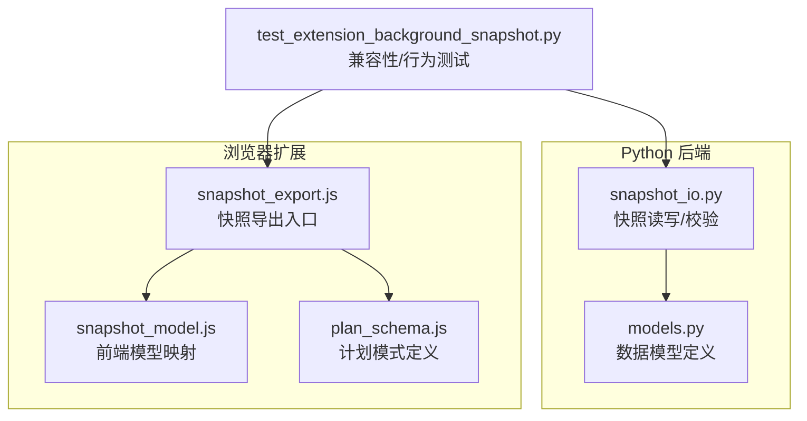
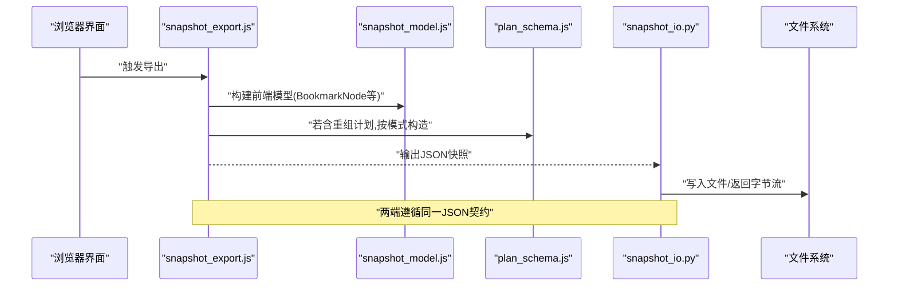
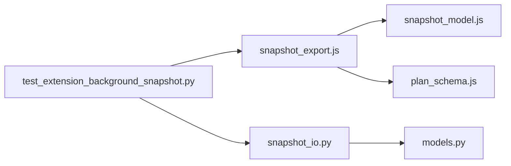

# 数据序列化与格式

<cite>
**本文引用的文件**   
- [bookmark_advisor/models.py](file://src/bookmark_advisor/models.py)
- [bookmark_advisor/snapshot_io.py](file://src/bookmark_advisor/snapshot_io.py)
- [extension/background/snapshot_export.js](file://extension/background/snapshot_export.js)
- [extension/shared/plan_schema.js](file://extension/shared/plan_schema.js)
- [extension/ai/snapshot_model.js](file://extension/ai/snapshot_model.js)
- [tests/test_extension_background_snapshot.py](file://tests/test_extension_background_snapshot.py)
</cite>

## 目录
1. [简介](#简介)
2. [项目结构](#项目结构)
3. [核心组件](#核心组件)
4. [架构总览](#架构总览)
5. [详细组件分析](#详细组件分析)
6. [依赖关系分析](#依赖关系分析)
7. [性能考虑](#性能考虑)
8. [故障排查指南](#故障排查指南)
9. [结论](#结论)
10. [附录](#附录)

## 简介
本文件聚焦于书签快照数据的序列化与格式，覆盖以下主题：
- 核心数据模型的JSON结构定义（如 BookmarkNode、ReorganizationPlan）
- 版本兼容策略（向后兼容、迁移方案、废弃字段处理）
- 序列化优化（字段压缩、空值处理、二进制编码选项）
- 复杂书签树结构的序列化和反序列化示例路径
- 数据验证规则与错误处理机制
- 跨平台差异与解决方案

## 项目结构
本项目包含Python后端与浏览器扩展两部分，分别负责书签快照的生成、读写与校验。关键位置如下：
- Python端模型与IO：src/bookmark_advisor/models.py、src/bookmark_advisor/snapshot_io.py
- 扩展端导出与模型：extension/background/snapshot_export.js、extension/ai/snapshot_model.js
- 共享计划模式：extension/shared/plan_schema.js
- 相关测试：tests/test_extension_background_snapshot.py

图表来源
- [bookmark_advisor/models.py](file://src/bookmark_advisor/models.py)
- [bookmark_advisor/snapshot_io.py](file://src/bookmark_advisor/snapshot_io.py)
- [extension/background/snapshot_export.js](file://extension/background/snapshot_export.js)
- [extension/ai/snapshot_model.js](file://extension/ai/snapshot_model.js)
- [extension/shared/plan_schema.js](file://extension/shared/plan_schema.js)
- [tests/test_extension_background_snapshot.py](file://tests/test_extension_background_snapshot.py)

章节来源
- [bookmark_advisor/models.py](file://src/bookmark_advisor/models.py)
- [bookmark_advisor/snapshot_io.py](file://src/bookmark_advisor/snapshot_io.py)
- [extension/background/snapshot_export.js](file://extension/background/snapshot_export.js)
- [extension/ai/snapshot_model.js](file://extension/ai/snapshot_model.js)
- [extension/shared/plan_schema.js](file://extension/shared/plan_schema.js)
- [tests/test_extension_background_snapshot.py](file://tests/test_extension_background_snapshot.py)

## 核心组件
- 数据模型层（Python）
  - 定义书签节点、书签树、重组计划等核心结构，提供类型化约束与默认值，便于稳定地序列化为JSON。
- 快照IO层（Python）
  - 负责将模型对象序列化为JSON字符串或字节流，写入本地文件；同时支持从JSON恢复为模型对象，并进行必要校验。
- 扩展导出层（JS）
  - 在浏览器环境中读取当前书签树，构建前端模型，再转换为统一快照格式并导出。
- 共享计划模式（JS）
  - 定义重组计划的结构模式，确保前后端对“计划”这一概念保持一致。

章节来源
- [bookmark_advisor/models.py](file://src/bookmark_advisor/models.py)
- [bookmark_advisor/snapshot_io.py](file://src/bookmark_advisor/snapshot_io.py)
- [extension/background/snapshot_export.js](file://extension/background/snapshot_export.js)
- [extension/shared/plan_schema.js](file://extension/shared/plan_schema.js)

## 架构总览
下图展示了从浏览器书签到持久化快照的关键流程，以及Python端的读写路径。

图表来源
- [extension/background/snapshot_export.js](file://extension/background/snapshot_export.js)
- [extension/ai/snapshot_model.js](file://extension/ai/snapshot_model.js)
- [extension/shared/plan_schema.js](file://extension/shared/plan_schema.js)
- [bookmark_advisor/snapshot_io.py](file://src/bookmark_advisor/snapshot_io.py)

## 详细组件分析

### 数据模型与JSON结构
- BookmarkNode（书签节点）
  - 典型字段包括唯一标识、标题、URL、父节点ID、子节点列表、创建/更新时间戳、是否文件夹、自定义元数据等。
  - JSON键名需保持小驼峰或下划线风格的一致性（以实现为准），并提供可选字段用于扩展。
- ReorganizationPlan（重组计划）
  - 描述对书签树的变更操作集合，如移动、重命名、删除、新建等，每条记录包含目标节点、动作类型、参数等。
  - 建议包含版本号与时间戳，便于迁移与审计。

说明
- 具体字段清单与类型约束请参考模型定义文件；所有字段均应在JSON中显式声明，避免隐式默认值导致歧义。

章节来源
- [bookmark_advisor/models.py](file://src/bookmark_advisor/models.py)
- [extension/shared/plan_schema.js](file://extension/shared/plan_schema.js)

### 版本兼容策略
- 向后兼容
  - 新增字段应为可选，旧版本读取时应忽略未知字段。
  - 保留历史字段至少一个主版本周期，并在日志中标记废弃。
- 数据迁移
  - 在读取时根据快照中的版本字段执行迁移逻辑，将旧结构转换为当前模型期望的结构。
  - 迁移过程应幂等且可回滚（通过备份原快照）。
- 废弃字段处理
  - 读取时丢弃废弃字段；写入时不再产生废弃字段，但允许兼容旧格式。

章节来源
- [bookmark_advisor/snapshot_io.py](file://src/bookmark_advisor/snapshot_io.py)

### 序列化优化技术
- 字段压缩
  - 对高频短字符串使用字典或枚举映射，减少重复文本。
  - 对嵌套树结构采用扁平化ID引用，必要时保留层级索引。
- 空值处理
  - 明确区分“缺失字段”和“空值”，在JSON中省略可选空字段以减少体积。
- 二进制编码选项
  - 对于大段元数据或图片缩略图，可采用Base64嵌入或外部引用；在需要极致体积控制时可引入二进制块（如MessagePack）作为可选通道。

章节来源
- [bookmark_advisor/snapshot_io.py](file://src/bookmark_advisor/snapshot_io.py)

### 复杂书签树的序列化与反序列化示例路径
- 导出（浏览器侧）
  - 入口：extension/background/snapshot_export.js
  - 模型映射：extension/ai/snapshot_model.js
- 导入（Python侧）
  - 读取与校验：bookmark_advisor/snapshot_io.py
  - 模型解析：bookmark_advisor/models.py

章节来源
- [extension/background/snapshot_export.js](file://extension/background/snapshot_export.js)
- [extension/ai/snapshot_model.js](file://extension/ai/snapshot_model.js)
- [bookmark_advisor/snapshot_io.py](file://src/bookmark_advisor/snapshot_io.py)
- [bookmark_advisor/models.py](file://src/bookmark_advisor/models.py)

### 数据验证规则与错误处理
- 必填字段校验
  - 节点ID、标题、URL（非文件夹）、父ID（存在时）等必须满足类型与范围约束。
- 结构一致性
  - 父子关系无环、ID唯一、根节点唯一、时间戳单调递增等。
- 错误处理
  - 遇到非法输入应抛出结构化异常，包含错误位置、字段名与修复建议。
  - 提供降级策略：跳过无效节点并记录警告，保证整体可读性。

章节来源
- [bookmark_advisor/snapshot_io.py](file://src/bookmark_advisor/snapshot_io.py)

### 跨平台差异与解决方案
- 时间与时区
  - 统一使用UTC时间戳或ISO 8601字符串，避免本地时区差异。
- 字符编码
  - 强制UTF-8，禁止BOM；文件名与路径使用规范化形式。
- 大小写敏感
  - 键名大小写严格一致；比较时使用小写归一化。
- 浮点精度
  - 避免直接存储浮点数，改用整数或高精度字符串表示。

章节来源
- [extension/background/snapshot_export.js](file://extension/background/snapshot_export.js)
- [bookmark_advisor/snapshot_io.py](file://src/bookmark_advisor/snapshot_io.py)

## 依赖关系分析
- 模块耦合
  - snapshot_export.js 依赖 snapshot_model.js 与 plan_schema.js，形成稳定的前端契约。
  - snapshot_io.py 依赖 models.py，承担IO与校验职责，保持与模型解耦。
- 外部依赖
  - 标准库JSON/IO；可选的二进制编解码器（如需要）。
- 循环依赖
  - 当前设计避免循环依赖，IO与模型分层清晰。

图表来源
- [extension/background/snapshot_export.js](file://extension/background/snapshot_export.js)
- [extension/ai/snapshot_model.js](file://extension/ai/snapshot_model.js)
- [extension/shared/plan_schema.js](file://extension/shared/plan_schema.js)
- [bookmark_advisor/snapshot_io.py](file://src/bookmark_advisor/snapshot_io.py)
- [bookmark_advisor/models.py](file://src/bookmark_advisor/models.py)
- [tests/test_extension_background_snapshot.py](file://tests/test_extension_background_snapshot.py)

章节来源
- [extension/background/snapshot_export.js](file://extension/background/snapshot_export.js)
- [extension/ai/snapshot_model.js](file://extension/ai/snapshot_model.js)
- [extension/shared/plan_schema.js](file://extension/shared/plan_schema.js)
- [bookmark_advisor/snapshot_io.py](file://src/bookmark_advisor/snapshot_io.py)
- [bookmark_advisor/models.py](file://src/bookmark_advisor/models.py)
- [tests/test_extension_background_snapshot.py](file://tests/test_extension_background_snapshot.py)

## 性能考虑
- 批量写入与缓冲
  - 大书签树建议分块写入，降低内存峰值。
- 增量更新
  - 仅序列化变更部分，合并为完整快照时进行去重与校验。
- 压缩与传输
  - 网络传输启用Gzip/Brotli；本地存储按需选择压缩格式。
- 索引与查找
  - 在快照中维护ID到路径的索引，提升反序列化后的查询效率。

[本节为通用指导，不直接分析具体文件]

## 故障排查指南
- 常见错误
  - 字段缺失或类型不符：检查模型定义与JSON键名一致性。
  - 时间格式错误：确认使用UTC与ISO 8601。
  - 循环引用或ID冲突：校验树结构与唯一性约束。
- 定位方法
  - 开启详细日志，记录失败节点ID与路径。
  - 使用最小复现用例隔离问题。
- 恢复策略
  - 优先使用最近一次有效快照；必要时执行迁移脚本。

章节来源
- [tests/test_extension_background_snapshot.py](file://tests/test_extension_background_snapshot.py)
- [bookmark_advisor/snapshot_io.py](file://src/bookmark_advisor/snapshot_io.py)

## 结论
通过统一的模型定义、严格的校验与清晰的版本策略，本项目实现了跨平台的书签快照序列化与可靠迁移。建议在后续迭代中持续完善字段压缩与二进制编码选项，以提升大规模书签场景下的性能与体积表现。

[本节为总结性内容，不直接分析具体文件]

## 附录
- 术语
  - 快照：某一时刻书签树与相关元数据的完整序列化表示。
  - 重组计划：对书签树进行批量化变更的操作清单。
- 参考路径
  - 模型定义：src/bookmark_advisor/models.py
  - 快照IO：src/bookmark_advisor/snapshot_io.py
  - 扩展导出：extension/background/snapshot_export.js
  - 前端模型：extension/ai/snapshot_model.js
  - 计划模式：extension/shared/plan_schema.js
  - 测试用例：tests/test_extension_background_snapshot.py

[本节为补充信息，不直接分析具体文件]