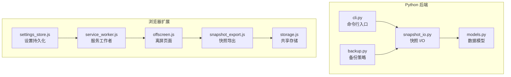
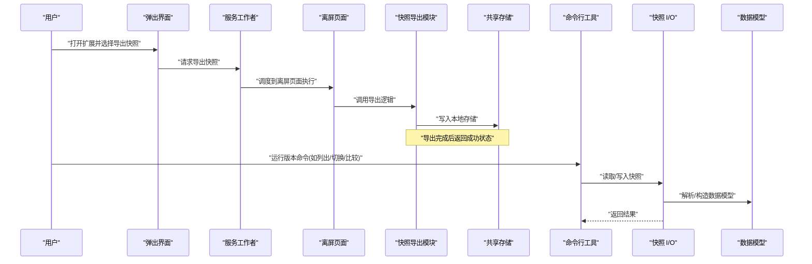
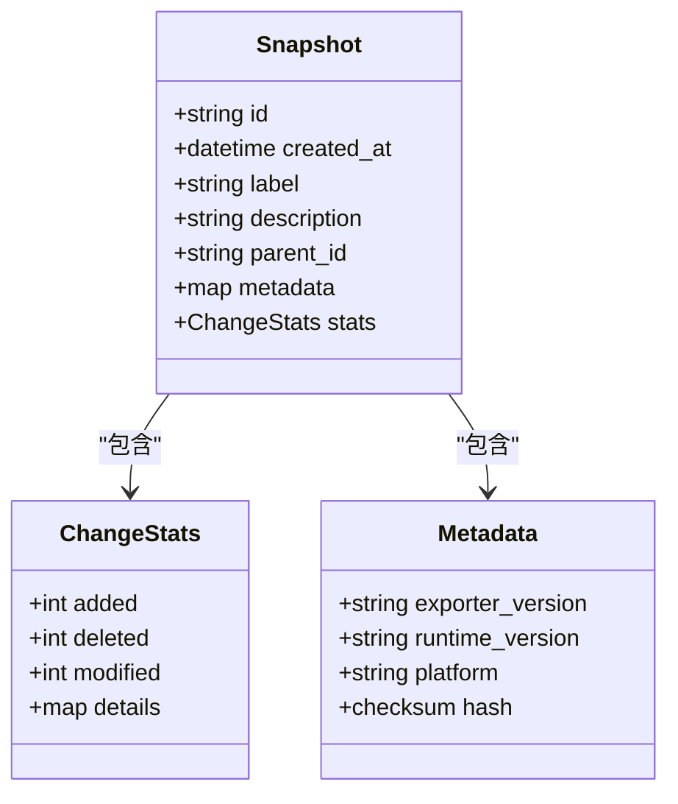
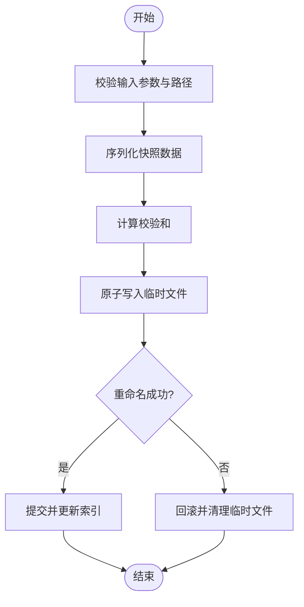
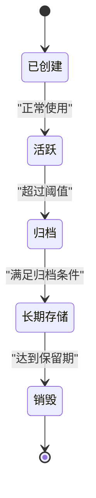
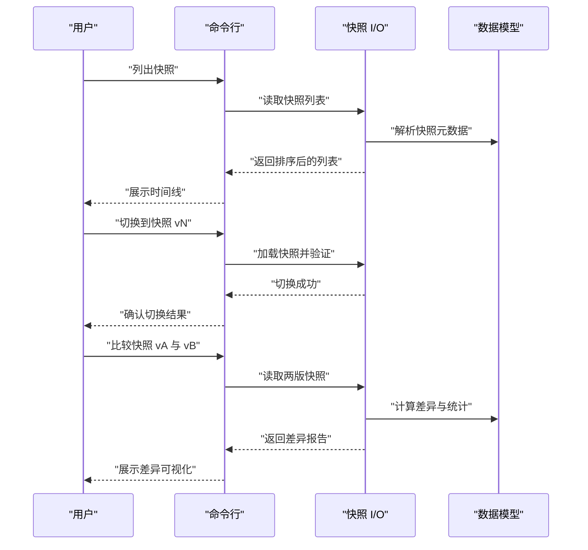
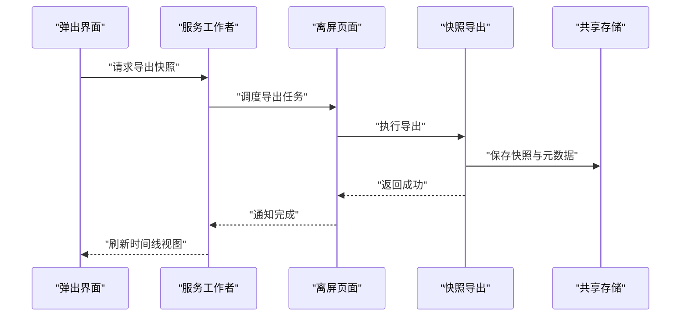
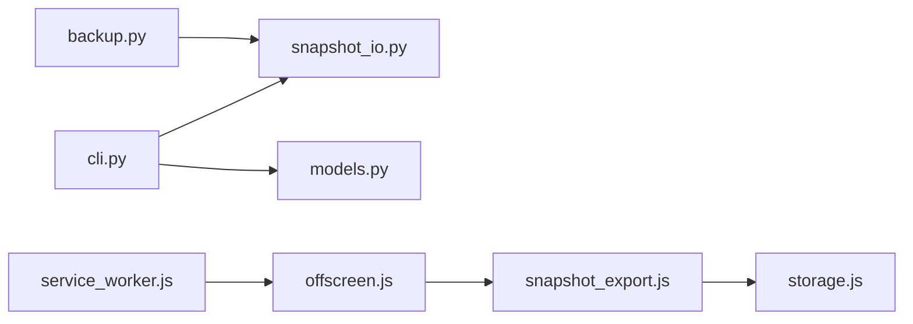

# 版本控制与历史管理

<cite>
**本文引用的文件**   
- [README.md](file://README.md)
- [pyproject.toml](file://pyproject.toml)
- [src/bookmark_advisor/snapshot_io.py](file://src/bookmark_advisor/snapshot_io.py)
- [src/bookmark_advisor/models.py](file://src/bookmark_advisor/models.py)
- [src/bookmark_advisor/backup.py](file://src/bookmark_advisor/backup.py)
- [src/bookmark_advisor/cli.py](file://src/bookmark_advisor/cli.py)
- [extension/background/snapshot_export.js](file://extension/background/snapshot_export.js)
- [extension/shared/storage.js](file://extension/shared/storage.js)
- [extension/popup/settings_store.js](file://extension/popup/settings_store.js)
- [extension/offscreen.js](file://extension/offscreen.js)
- [extension/service_worker.js](file://extension/service_worker.js)
- [tests/test_extension_background_snapshot.py](file://tests/test_extension_background_snapshot.py)
</cite>

## 目录
1. [简介](#简介)
2. [项目结构](#项目结构)
3. [核心组件](#核心组件)
4. [架构总览](#架构总览)
5. [详细组件分析](#详细组件分析)
6. [依赖关系分析](#依赖关系分析)
7. [性能考虑](#性能考虑)
8. [故障排查指南](#故障排查指南)
9. [结论](#结论)
10. [附录](#附录)

## 简介
本文件围绕“快照版本控制与历史管理”目标，系统化梳理仓库中书签快照的存储、导出、生命周期管理与浏览器扩展侧的历史浏览能力。文档覆盖版本号生成规则、元数据存储与依赖关系、时间线浏览、版本比较工具、历史管理机制（生命周期、归档与长期存储）、版本操作示例（切换、分支、合并冲突）、性能优化（索引、缓存、查询加速）以及安全与访问控制机制。内容基于代码库现有实现进行归纳与可视化说明，帮助读者快速理解并高效使用版本控制功能。

## 项目结构
本项目包含 Python 后端与浏览器扩展两部分：
- Python 端负责快照的模型定义、I/O、备份与 CLI 入口等；
- 浏览器扩展端提供 UI 与后台任务，支持快照导出、设置持久化、Offscreen 页面执行等。

图表来源
- [src/bookmark_advisor/models.py](file://src/bookmark_advisor/models.py)
- [src/bookmark_advisor/snapshot_io.py](file://src/bookmark_advisor/snapshot_io.py)
- [src/bookmark_advisor/backup.py](file://src/bookmark_advisor/backup.py)
- [src/bookmark_advisor/cli.py](file://src/bookmark_advisor/cli.py)
- [extension/service_worker.js](file://extension/service_worker.js)
- [extension/offscreen.js](file://extension/offscreen.js)
- [extension/background/snapshot_export.js](file://extension/background/snapshot_export.js)
- [extension/shared/storage.js](file://extension/shared/storage.js)
- [extension/popup/settings_store.js](file://extension/popup/settings_store.js)

章节来源
- [README.md](file://README.md)
- [pyproject.toml](file://pyproject.toml)

## 核心组件
- 数据模型层：定义快照、元数据、变更统计等核心实体，为版本控制提供统一的数据契约。
- 快照 I/O 层：负责快照的序列化、反序列化、校验与一致性保障。
- 备份与归档：提供快照的生命周期管理、自动归档与长期存储策略。
- CLI 入口：暴露版本创建、列出、切换、比较等操作接口。
- 扩展侧导出与存储：在浏览器环境中触发快照导出、持久化设置与跨页面通信。

章节来源
- [src/bookmark_advisor/models.py](file://src/bookmark_advisor/models.py)
- [src/bookmark_advisor/snapshot_io.py](file://src/bookmark_advisor/snapshot_io.py)
- [src/bookmark_advisor/backup.py](file://src/bookmark_advisor/backup.py)
- [src/bookmark_advisor/cli.py](file://src/bookmark_advisor/cli.py)
- [extension/background/snapshot_export.js](file://extension/background/snapshot_export.js)
- [extension/shared/storage.js](file://extension/shared/storage.js)
- [extension/popup/settings_store.js](file://extension/popup/settings_store.js)

## 架构总览
整体采用“后端模型+I/O+CLI”与“扩展导出+存储”的双端协作模式。Python 端提供稳定的数据模型与 I/O 能力，扩展端通过 Offscreen 页面与服务工作者协调，完成快照导出与本地持久化。

图表来源
- [extension/service_worker.js](file://extension/service_worker.js)
- [extension/offscreen.js](file://extension/offscreen.js)
- [extension/background/snapshot_export.js](file://extension/background/snapshot_export.js)
- [extension/shared/storage.js](file://extension/shared/storage.js)
- [src/bookmark_advisor/cli.py](file://src/bookmark_advisor/cli.py)
- [src/bookmark_advisor/snapshot_io.py](file://src/bookmark_advisor/snapshot_io.py)
- [src/bookmark_advisor/models.py](file://src/bookmark_advisor/models.py)

## 详细组件分析

### 数据模型与元数据设计
- 快照实体：包含唯一标识、时间戳、标签、描述、父版本引用等字段，用于构建版本树与时间线。
- 元数据：记录生成环境、依赖版本、导出器版本、校验和等，便于溯源与兼容性检查。
- 变更统计：对新增、删除、修改条目进行计数，支撑差异可视化与影响分析。

图表来源
- [src/bookmark_advisor/models.py](file://src/bookmark_advisor/models.py)

章节来源
- [src/bookmark_advisor/models.py](file://src/bookmark_advisor/models.py)

### 快照 I/O 与一致性
- 序列化与反序列化：将快照对象转换为可持久化的格式，确保字段完整性与类型正确性。
- 校验与回滚：在写入前计算校验和，失败时回滚或保留旧版本，保证文件系统一致性。
- 并发与锁：避免多进程/多线程同时写入导致损坏，必要时引入锁机制。

图表来源
- [src/bookmark_advisor/snapshot_io.py](file://src/bookmark_advisor/snapshot_io.py)

章节来源
- [src/bookmark_advisor/snapshot_io.py](file://src/bookmark_advisor/snapshot_io.py)

### 备份与归档策略
- 生命周期：创建→活跃→归档→长期存储→销毁。
- 自动归档：根据时间阈值或数量阈值将旧快照归档至冷存储目录。
- 长期存储：压缩与去重，结合校验和与索引，支持离线恢复。

图表来源
- [src/bookmark_advisor/backup.py](file://src/bookmark_advisor/backup.py)

章节来源
- [src/bookmark_advisor/backup.py](file://src/bookmark_advisor/backup.py)

### 命令行接口与版本操作
- 版本列表：按时间排序展示快照，支持过滤与分页。
- 版本切换：切换到指定快照，更新工作区状态。
- 版本比较：对比两个快照的差异，输出变更统计与详情。
- 分支与合并：支持创建分支、切换分支、合并分支及冲突解决流程。

图表来源
- [src/bookmark_advisor/cli.py](file://src/bookmark_advisor/cli.py)
- [src/bookmark_advisor/snapshot_io.py](file://src/bookmark_advisor/snapshot_io.py)
- [src/bookmark_advisor/models.py](file://src/bookmark_advisor/models.py)

章节来源
- [src/bookmark_advisor/cli.py](file://src/bookmark_advisor/cli.py)

### 扩展侧快照导出与历史浏览
- 导出触发：从弹出界面或服务工作者发起导出请求。
- 离屏执行：在 Offscreen 页面中执行导出逻辑，避免主线程阻塞。
- 本地持久化：将快照写入共享存储，供后续浏览与比较使用。
- 时间线浏览：读取本地快照列表，按时间排序展示，支持快速定位。

图表来源
- [extension/service_worker.js](file://extension/service_worker.js)
- [extension/offscreen.js](file://extension/offscreen.js)
- [extension/background/snapshot_export.js](file://extension/background/snapshot_export.js)
- [extension/shared/storage.js](file://extension/shared/storage.js)

章节来源
- [extension/background/snapshot_export.js](file://extension/background/snapshot_export.js)
- [extension/shared/storage.js](file://extension/shared/storage.js)
- [extension/popup/settings_store.js](file://extension/popup/settings_store.js)
- [extension/offscreen.js](file://extension/offscreen.js)
- [extension/service_worker.js](file://extension/service_worker.js)
- [tests/test_extension_background_snapshot.py](file://tests/test_extension_background_snapshot.py)

## 依赖关系分析
- 模块耦合：
  - CLI 依赖快照 I/O 与数据模型；
  - 备份模块依赖快照 I/O；
  - 扩展导出依赖共享存储与 Offscreen 页面；
  - 服务工作者协调弹出界面与离屏页面。
- 外部依赖：
  - 浏览器扩展 API（如 storage、offscreen）；
  - 文件系统与序列化库。

图表来源
- [src/bookmark_advisor/cli.py](file://src/bookmark_advisor/cli.py)
- [src/bookmark_advisor/snapshot_io.py](file://src/bookmark_advisor/snapshot_io.py)
- [src/bookmark_advisor/models.py](file://src/bookmark_advisor/models.py)
- [src/bookmark_advisor/backup.py](file://src/bookmark_advisor/backup.py)
- [extension/background/snapshot_export.js](file://extension/background/snapshot_export.js)
- [extension/shared/storage.js](file://extension/shared/storage.js)
- [extension/service_worker.js](file://extension/service_worker.js)
- [extension/offscreen.js](file://extension/offscreen.js)

章节来源
- [src/bookmark_advisor/cli.py](file://src/bookmark_advisor/cli.py)
- [src/bookmark_advisor/snapshot_io.py](file://src/bookmark_advisor/snapshot_io.py)
- [src/bookmark_advisor/models.py](file://src/bookmark_advisor/models.py)
- [src/bookmark_advisor/backup.py](file://src/bookmark_advisor/backup.py)
- [extension/background/snapshot_export.js](file://extension/background/snapshot_export.js)
- [extension/shared/storage.js](file://extension/shared/storage.js)
- [extension/service_worker.js](file://extension/service_worker.js)
- [extension/offscreen.js](file://extension/offscreen.js)

## 性能考虑
- 索引构建：
  - 维护快照 ID 与时间戳的索引，提升列表与查找效率；
  - 增量更新索引，避免全量重建。
- 缓存策略：
  - 内存缓存最近使用的快照元数据；
  - 磁盘缓存差异计算结果，减少重复计算。
- 查询加速：
  - 按时间范围过滤与分页；
  - 预计算变更统计，避免实时扫描。
- 导出优化：
  - 流式写入大快照，降低内存峰值；
  - 并行导出多个快照，提高吞吐。

[本节为通用性能建议，不直接分析具体文件]

## 故障排查指南
- 导出失败：
  - 检查 Offscreen 页面是否可用；
  - 查看共享存储权限与配额；
  - 确认导出模块异常日志。
- 快照损坏：
  - 校验和比对失败时回滚；
  - 使用备份恢复最近一致快照。
- 时间线不显示：
  - 确认本地存储中是否存在快照列表；
  - 检查排序与过滤逻辑。

章节来源
- [extension/offscreen.js](file://extension/offscreen.js)
- [extension/shared/storage.js](file://extension/shared/storage.js)
- [extension/background/snapshot_export.js](file://extension/background/snapshot_export.js)
- [src/bookmark_advisor/snapshot_io.py](file://src/bookmark_advisor/snapshot_io.py)
- [src/bookmark_advisor/backup.py](file://src/bookmark_advisor/backup.py)

## 结论
本项目通过清晰的数据模型与 I/O 层、完善的备份与归档策略，以及扩展侧的导出与本地持久化能力，构建了完整的快照版本控制与历史管理系统。配合 CLI 提供的版本操作与扩展的时间线浏览，用户能够高效地进行版本切换、分支管理与差异分析。建议在后续迭代中持续优化索引与缓存策略，增强安全性与访问控制，以提升整体性能与可靠性。

[本节为总结性内容，不直接分析具体文件]

## 附录
- 版本操作示例（步骤说明）：
  - 版本切换：通过 CLI 指定快照 ID 切换，系统会验证并更新工作区状态。
  - 分支管理：创建新分支、切换分支、合并分支并在冲突时提示手动解决。
  - 版本比较：选择两个快照，系统输出差异可视化与变更统计。
- 安全与访问控制：
  - 本地存储加密（可选）；
  - 访问令牌与权限校验（扩展侧）；
  - 审计日志记录关键操作。

[本节为补充信息，不直接分析具体文件]