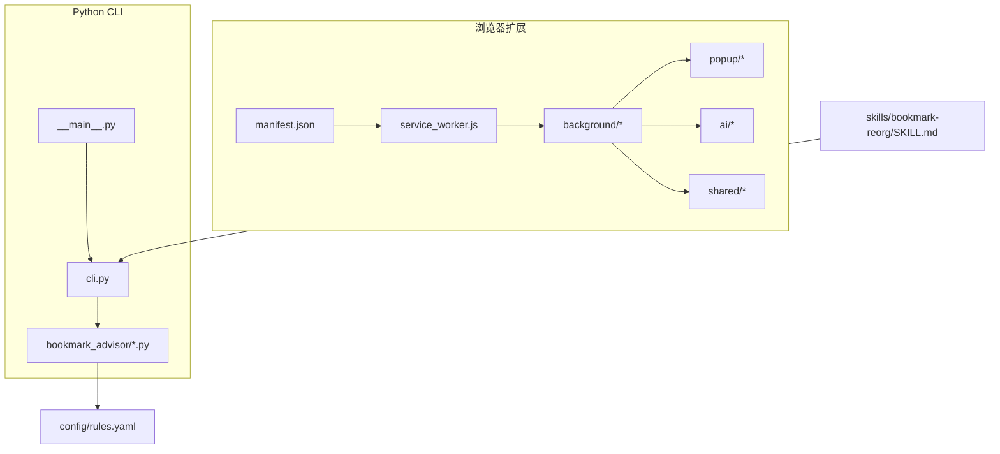
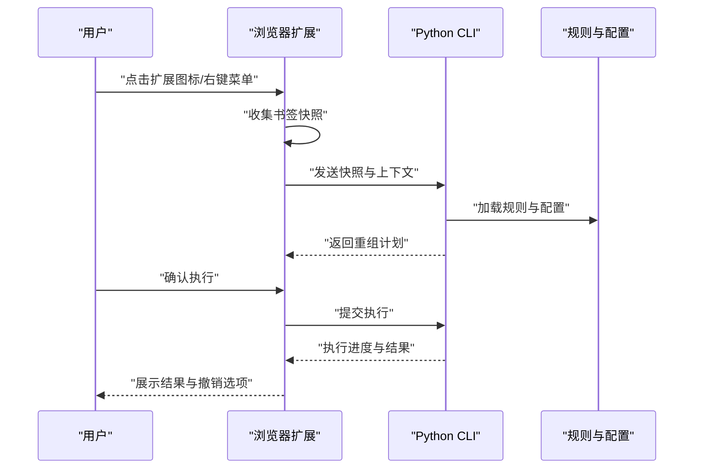
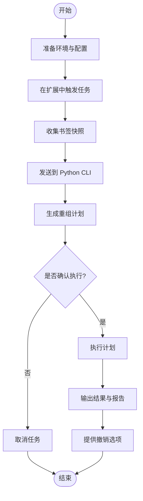
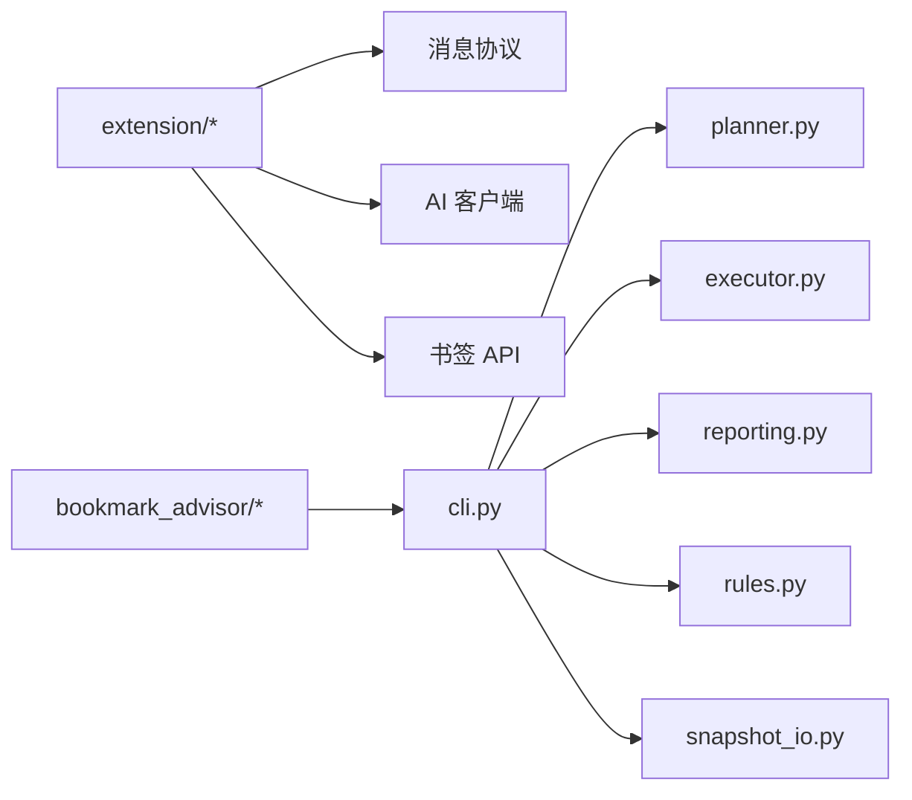

# 快速开始

<cite>
**本文引用的文件**   
- [README.md](file://README.md)
- [pyproject.toml](file://pyproject.toml)
- [extension/manifest.json](file://extension/manifest.json)
- [config/rules.yaml](file://config/rules.yaml)
- [src/bookmark_advisor/__main__.py](file://src/bookmark_advisor/__main__.py)
- [src/bookmark_advisor/cli.py](file://src/bookmark_advisor/cli.py)
- [skills/bookmark-reorg/SKILL.md](file://skills/bookmark-reorg/SKILL.md)
</cite>

## 目录
1. [简介](#简介)
2. [项目结构](#项目结构)
3. [核心组件](#核心组件)
4. [架构总览](#架构总览)
5. [详细组件分析](#详细组件分析)
6. [依赖分析](#依赖分析)
7. [性能考虑](#性能考虑)
8. [故障排除指南](#故障排除指南)
9. [结论](#结论)
10. [附录](#附录)

## 简介
本快速开始指南帮助你在最短时间内完成 Edge Bookmark 的安装与配置，体验从浏览器扩展到 Python CLI 的端到端书签重组能力。你将了解：
- 环境要求（浏览器、Node.js、Python）
- 如何安装或构建浏览器扩展
- 如何安装并初始化 Python CLI 工具
- 如何设置 AI 服务提供商密钥与基本规则
- 如何执行第一个书签重组任务
- 常见问题与排错提示

## 项目结构
Edge Bookmark 由两部分组成：
- 浏览器扩展（基于 Manifest V3），负责在 Microsoft Edge 中收集书签快照、与后端交互、展示计划与结果
- Python CLI 工具（bookmark-advisor），负责解析规则、生成重组计划、执行操作并提供报告

图表来源
- [extension/manifest.json](file://extension/manifest.json)
- [src/bookmark_advisor/__main__.py](file://src/bookmark_advisor/__main__.py)
- [src/bookmark_advisor/cli.py](file://src/bookmark_advisor/cli.py)
- [config/rules.yaml](file://config/rules.yaml)
- [skills/bookmark-reorg/SKILL.md](file://skills/bookmark-reorg/SKILL.md)

章节来源
- [README.md](file://README.md)
- [extension/manifest.json](file://extension/manifest.json)
- [src/bookmark_advisor/__main__.py](file://src/bookmark_advisor/__main__.py)
- [src/bookmark_advisor/cli.py](file://src/bookmark_advisor/cli.py)
- [config/rules.yaml](file://config/rules.yaml)
- [skills/bookmark-reorg/SKILL.md](file://skills/bookmark-reorg/SKILL.md)

## 核心组件
- 浏览器扩展
  - 清单与服务工作线程：定义权限、入口点与消息路由
  - 后台模块：书签树读取、快照导出、作业生命周期、撤销日志等
  - 弹出界面：状态展示、计划视图、运行时客户端、密钥与设置存储
  - AI 客户端：批量请求、提示编解码、响应编解码、提供者客户端、快照模型
- Python CLI
  - 命令行入口与子命令
  - 规划器与执行器：根据规则生成计划并执行
  - 快照读写、备份、分析与报告
  - 规则解析与校验

章节来源
- [extension/manifest.json](file://extension/manifest.json)
- [extension/background/action_handlers.js](file://extension/background/action_handlers.js)
- [extension/popup/runtime_client.js](file://extension/popup/runtime_client.js)
- [extension/ai/provider_client.js](file://extension/ai/provider_client.js)
- [src/bookmark_advisor/__main__.py](file://src/bookmark_advisor/__main__.py)
- [src/bookmark_advisor/cli.py](file://src/bookmark_advisor/cli.py)
- [src/bookmark_advisor/planner.py](file://src/bookmark_advisor/planner.py)
- [src/bookmark_advisor/executor.py](file://src/bookmark_advisor/executor.py)
- [src/bookmark_advisor/snapshot_io.py](file://src/bookmark_advisor/snapshot_io.py)
- [src/bookmark_advisor/reporting.py](file://src/bookmark_advisor/reporting.py)
- [src/bookmark_advisor/rules.py](file://src/bookmark_advisor/rules.py)

## 架构总览
下图展示了从用户触发到最终执行的端到端流程：用户在扩展中发起任务，扩展将书签快照发送给 Python CLI；CLI 依据规则生成计划并执行，最后回写结果与报告。

图表来源
- [extension/background/action_handlers.js](file://extension/background/action_handlers.js)
- [extension/background/job_lifecycle.js](file://extension/background/job_lifecycle.js)
- [extension/popup/runtime_client.js](file://extension/popup/runtime_client.js)
- [src/bookmark_advisor/cli.py](file://src/bookmark_advisor/cli.py)
- [src/bookmark_advisor/planner.py](file://src/bookmark_advisor/planner.py)
- [src/bookmark_advisor/executor.py](file://src/bookmark_advisor/executor.py)
- [config/rules.yaml](file://config/rules.yaml)

## 详细组件分析

### 环境要求
- 浏览器
  - 支持 Microsoft Edge（Manifest V3 扩展）
  - 建议保持最新稳定版本以获得最佳兼容性与安全性
- Node.js
  - 用于本地开发或可选的构建步骤（如需要）
  - 建议使用长期支持版本
- Python
  - 使用 pyproject.toml 管理依赖与可执行入口
  - 建议在虚拟环境中运行以避免系统包冲突

章节来源
- [extension/manifest.json](file://extension/manifest.json)
- [pyproject.toml](file://pyproject.toml)

### 安装浏览器扩展
两种方法任选其一：
- 直接安装（开发者模式）
  - 打开 Edge 扩展管理页面，启用“开发者模式”
  - 选择“加载已解压的扩展”，指向 extension 目录
  - 授予所需权限后，扩展图标出现在工具栏
- 从源码构建（如需自定义或调试）
  - 若存在构建脚本，按仓库说明执行构建
  - 将产物作为“加载已解压的扩展”进行安装

章节来源
- [extension/manifest.json](file://extension/manifest.json)

### 安装 Python CLI 工具
- 进入项目根目录
- 使用 pyproject.toml 创建并激活虚拟环境
- 安装依赖并注册可执行入口（具体命令以 pyproject.toml 为准）
- 验证安装：运行命令行入口查看帮助信息

章节来源
- [pyproject.toml](file://pyproject.toml)
- [src/bookmark_advisor/__main__.py](file://src/bookmark_advisor/__main__.py)
- [src/bookmark_advisor/cli.py](file://src/bookmark_advisor/cli.py)

### 初始配置
- 规则文件
  - 在 config/rules.yaml 中编写你的重组规则
  - 参考 skills/bookmark-reorg/SKILL.md 中的示例与约定
- AI 提供商密钥
  - 通过扩展弹出界面的“密钥管理”或环境变量注入
  - 确保扩展能访问你配置的端点与凭据

章节来源
- [config/rules.yaml](file://config/rules.yaml)
- [skills/bookmark-reorg/SKILL.md](file://skills/bookmark-reorg/SKILL.md)
- [extension/popup/secrets.js](file://extension/popup/secrets.js)
- [extension/shared/ai_endpoint.js](file://extension/shared/ai_endpoint.js)

### 第一个书签重组任务（端到端）
- 准备阶段
  - 安装并启用扩展
  - 配置 rules.yaml 与 AI 密钥
- 触发阶段
  - 在 Edge 中打开任意页面，点击扩展图标或右键菜单
  - 扩展会收集当前书签快照并显示预览
- 计划阶段
  - 扩展将快照发送至 Python CLI
  - CLI 加载规则并生成重组计划
- 执行阶段
  - 在扩展中确认执行
  - CLI 执行计划并回写结果
  - 扩展展示成功/失败状态与撤销选项

图表来源
- [extension/background/action_handlers.js](file://extension/background/action_handlers.js)
- [extension/background/snapshot_export.js](file://extension/background/snapshot_export.js)
- [extension/popup/runtime_client.js](file://extension/popup/runtime_client.js)
- [src/bookmark_advisor/cli.py](file://src/bookmark_advisor/cli.py)
- [src/bookmark_advisor/planner.py](file://src/bookmark_advisor/planner.py)
- [src/bookmark_advisor/executor.py](file://src/bookmark_advisor/executor.py)
- [src/bookmark_advisor/reporting.py](file://src/bookmark_advisor/reporting.py)

章节来源
- [skills/bookmark-reorg/SKILL.md](file://skills/bookmark-reorg/SKILL.md)
- [extension/background/action_handlers.js](file://extension/background/action_handlers.js)
- [extension/background/snapshot_export.js](file://extension/background/snapshot_export.js)
- [extension/popup/runtime_client.js](file://extension/popup/runtime_client.js)
- [src/bookmark_advisor/cli.py](file://src/bookmark_advisor/cli.py)
- [src/bookmark_advisor/planner.py](file://src/bookmark_advisor/planner.py)
- [src/bookmark_advisor/executor.py](file://src/bookmark_advisor/executor.py)
- [src/bookmark_advisor/reporting.py](file://src/bookmark_advisor/reporting.py)

## 依赖分析
- 浏览器扩展依赖
  - Manifest V3 运行时与书签 API
  - 弹出界面与背景脚本的消息通信
  - AI 客户端与共享协议
- Python CLI 依赖
  - 由 pyproject.toml 声明
  - 命令行入口与子命令组织
  - 规则解析、计划生成、执行与报告

图表来源
- [extension/shared/message_protocol.js](file://extension/shared/message_protocol.js)
- [extension/ai/provider_client.js](file://extension/ai/provider_client.js)
- [extension/background/bookmark_api.js](file://extension/background/bookmark_api.js)
- [src/bookmark_advisor/cli.py](file://src/bookmark_advisor/cli.py)
- [src/bookmark_advisor/planner.py](file://src/bookmark_advisor/planner.py)
- [src/bookmark_advisor/executor.py](file://src/bookmark_advisor/executor.py)
- [src/bookmark_advisor/reporting.py](file://src/bookmark_advisor/reporting.py)
- [src/bookmark_advisor/rules.py](file://src/bookmark_advisor/rules.py)
- [src/bookmark_advisor/snapshot_io.py](file://src/bookmark_advisor/snapshot_io.py)

章节来源
- [extension/shared/message_protocol.js](file://extension/shared/message_protocol.js)
- [extension/ai/provider_client.js](file://extension/ai/provider_client.js)
- [extension/background/bookmark_api.js](file://extension/background/bookmark_api.js)
- [src/bookmark_advisor/cli.py](file://src/bookmark_advisor/cli.py)
- [src/bookmark_advisor/planner.py](file://src/bookmark_advisor/planner.py)
- [src/bookmark_advisor/executor.py](file://src/bookmark_advisor/executor.py)
- [src/bookmark_advisor/reporting.py](file://src/bookmark_advisor/reporting.py)
- [src/bookmark_advisor/rules.py](file://src/bookmark_advisor/rules.py)
- [src/bookmark_advisor/snapshot_io.py](file://src/bookmark_advisor/snapshot_io.py)

## 性能考虑
- 批量处理与缓存
  - 扩展侧对 AI 请求进行批处理与提示压缩，减少网络往返
- 增量快照与差异计算
  - 仅传输必要数据，降低带宽与解析开销
- 规则预编译与快速路径
  - 对常见场景采用快速规则匹配，提升响应速度
- 异步执行与撤销日志
  - 后台执行避免阻塞 UI，记录变更以便快速回滚

章节来源
- [extension/ai/batching.js](file://extension/ai/batching.js)
- [extension/ai/fast_rules.js](file://extension/ai/fast_rules.js)
- [extension/background/undo_log.js](file://extension/background/undo_log.js)

## 故障排除指南
- 扩展无法加载
  - 检查 manifest.json 的版本与权限声明
  - 确认以“开发者模式”加载的是正确目录
- 无法连接 AI 服务
  - 核对扩展中的端点与密钥配置
  - 检查网络代理与防火墙策略
- CLI 命令不可用
  - 确认虚拟环境已激活且依赖已安装
  - 检查 pyproject.toml 的可执行入口是否正确注册
- 规则不生效
  - 检查 config/rules.yaml 语法与字段命名
  - 参考 skills/bookmark-reorg/SKILL.md 中的示例进行对比
- 执行失败或无变化
  - 查看 CLI 输出的报告与错误信息
  - 使用扩展提供的撤销功能恢复状态

章节来源
- [extension/manifest.json](file://extension/manifest.json)
- [extension/shared/ai_endpoint.js](file://extension/shared/ai_endpoint.js)
- [extension/popup/secrets.js](file://extension/popup/secrets.js)
- [pyproject.toml](file://pyproject.toml)
- [src/bookmark_advisor/reporting.py](file://src/bookmark_advisor/reporting.py)
- [config/rules.yaml](file://config/rules.yaml)
- [skills/bookmark-reorg/SKILL.md](file://skills/bookmark-reorg/SKILL.md)

## 结论
通过以上步骤，你已经完成了 Edge Bookmark 的环境准备、扩展安装、CLI 配置与首次书签重组任务的执行。建议进一步阅读规则文档与技能说明，逐步完善你的自动化策略。

## 附录
- 相关文档与技能
  - 设计文档与审计记录位于 docs 目录
  - 书签重组技能说明位于 skills/bookmark-reorg/SKILL.md
- 测试与质量
  - tests 目录包含大量单元测试与集成用例，可作为行为参考

章节来源
- [skills/bookmark-reorg/SKILL.md](file://skills/bookmark-reorg/SKILL.md)
- [tests/test_reorg_job.py](file://tests/test_reorg_job.py)
- [tests/test_planner.py](file://tests/test_planner.py)
- [tests/test_execution_policy.py](file://tests/test_extension_execution_policy.py)