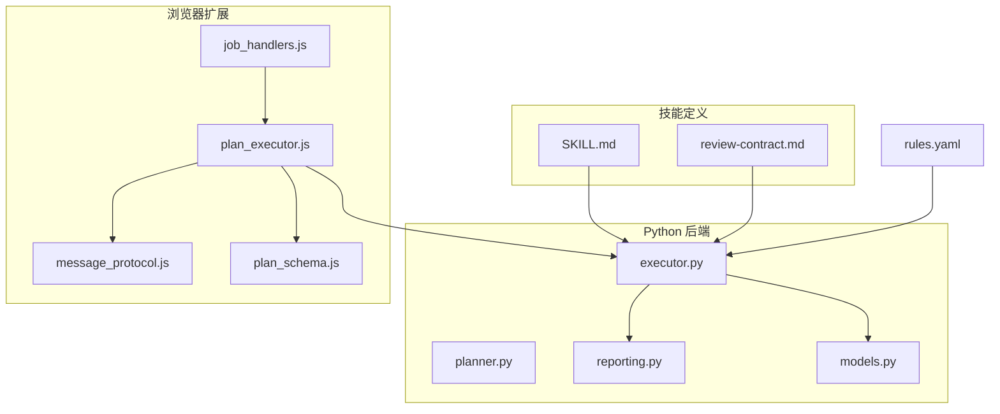
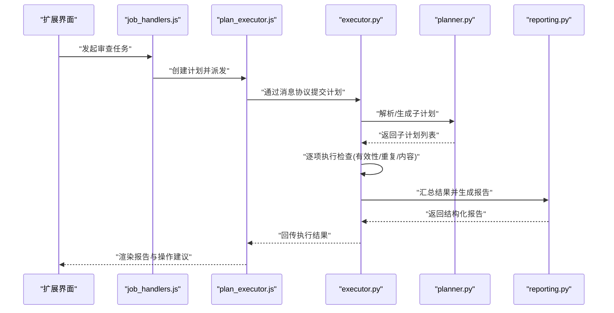
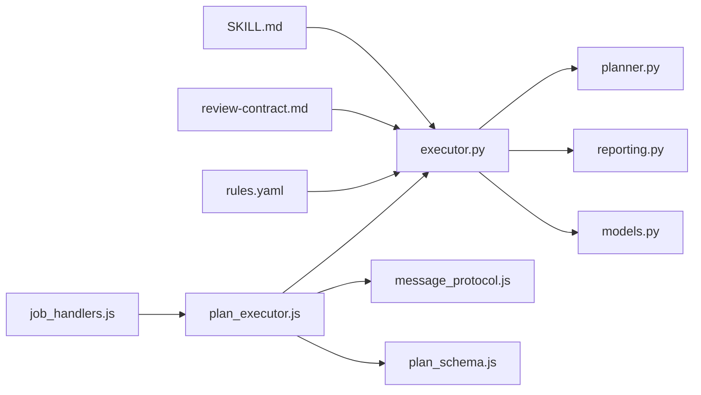
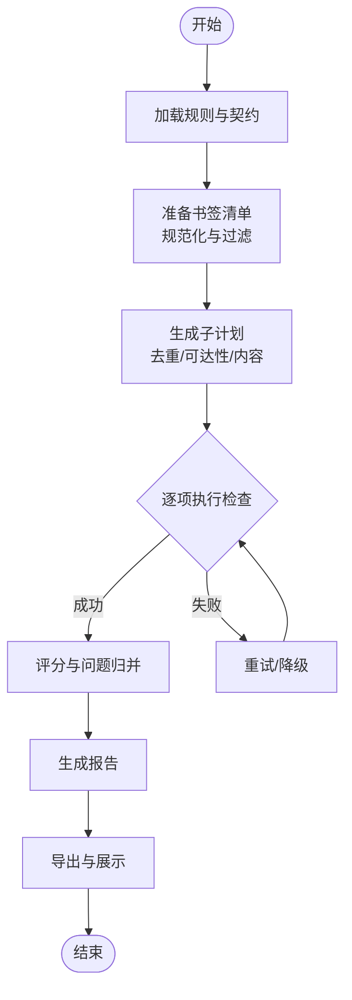

# URL 审查技能

<cite>
**本文引用的文件**   
- [skills/bookmark-url-review/SKILL.md](file://skills/bookmark-url-review/SKILL.md)
- [skills/bookmark-url-review/references/review-contract.md](file://skills/bookmark-url-review/references/review-contract.md)
- [src/bookmark_advisor/executor.py](file://src/bookmark_advisor/executor.py)
- [src/bookmark_advisor/planner.py](file://src/bookmark_advisor/planner.py)
- [src/bookmark_advisor/reporting.py](file://src/bookmark_advisor/reporting.py)
- [src/bookmark_advisor/models.py](file://src/bookmark_advisor/models.py)
- [extension/background/job_handlers.js](file://extension/background/job_handlers.js)
- [extension/background/plan_executor.js](file://extension/background/plan_executor.js)
- [extension/shared/message_protocol.js](file://extension/shared/message_protocol.js)
- [extension/shared/plan_schema.js](file://extension/shared/plan_schema.js)
- [config/rules.yaml](file://config/rules.yaml)
</cite>

## 目录
1. [简介](#简介)
2. [项目结构](#项目结构)
3. [核心组件](#核心组件)
4. [架构总览](#架构总览)
5. [详细组件分析](#详细组件分析)
6. [依赖关系分析](#依赖关系分析)
7. [性能考虑](#性能考虑)
8. [故障排查指南](#故障排查指南)
9. [结论](#结论)
10. [附录](#附录)

## 简介
本文件面向“URL 审查技能”的使用者与集成者，系统阐述该技能在书签管理场景中的能力与用法。重点覆盖：
- 链接质量评估：有效性、可达性、安全性、稳定性等维度
- 重复检测：基于规范化策略的重复识别与合并建议
- 内容分析：标题、描述、可见文本密度、外链数量等指标
- 工作机制：从任务编排到执行、报告生成的端到端流程
- 使用方法：审查标准配置、阈值设置、报告输出与解读
- 审查契约（review contract）：输入输出规范与质量标准
- 常见问题诊断与结果解读

## 项目结构
本项目采用“前端扩展 + Python 后端服务 + 技能定义”的分层组织方式：
- skills 目录：以 SKILL.md 形式声明技能能力、使用方式与约束
- src/bookmark_advisor：Python 侧的执行器、计划器、报告生成与数据模型
- extension：浏览器扩展侧的任务调度、消息协议与计划执行
- config：规则与阈值配置文件

图表来源
- [skills/bookmark-url-review/SKILL.md](file://skills/bookmark-url-review/SKILL.md)
- [skills/bookmark-url-review/references/review-contract.md](file://skills/bookmark-url-review/references/review-contract.md)
- [src/bookmark_advisor/executor.py](file://src/bookmark_advisor/executor.py)
- [src/bookmark_advisor/planner.py](file://src/bookmark_advisor/planner.py)
- [src/bookmark_advisor/reporting.py](file://src/bookmark_advisor/reporting.py)
- [src/bookmark_advisor/models.py](file://src/bookmark_advisor/models.py)
- [extension/background/job_handlers.js](file://extension/background/job_handlers.js)
- [extension/background/plan_executor.js](file://extension/background/plan_executor.js)
- [extension/shared/message_protocol.js](file://extension/shared/message_protocol.js)
- [extension/shared/plan_schema.js](file://extension/shared/plan_schema.js)
- [config/rules.yaml](file://config/rules.yaml)

章节来源
- [skills/bookmark-url-review/SKILL.md](file://skills/bookmark-url-review/SKILL.md)
- [skills/bookmark-url-review/references/review-contract.md](file://skills/bookmark-url-review/references/review-contract.md)
- [src/bookmark_advisor/executor.py](file://src/bookmark_advisor/executor.py)
- [src/bookmark_advisor/planner.py](file://src/bookmark_advisor/planner.py)
- [src/bookmark_advisor/reporting.py](file://src/bookmark_advisor/reporting.py)
- [src/bookmark_advisor/models.py](file://src/bookmark_advisor/models.py)
- [extension/background/job_handlers.js](file://extension/background/job_handlers.js)
- [extension/background/plan_executor.js](file://extension/background/plan_executor.js)
- [extension/shared/message_protocol.js](file://extension/shared/message_protocol.js)
- [extension/shared/plan_schema.js](file://extension/shared/plan_schema.js)
- [config/rules.yaml](file://config/rules.yaml)

## 核心组件
- 技能定义（SKILL.md）：描述 URL 审查技能的目标、能力边界、输入输出约定与使用步骤
- 审查契约（review-contract.md）：明确输入数据结构、输出报告格式、字段语义与质量门槛
- 执行器（executor.py）：加载规则与契约、解析待审清单、驱动各检查项并汇总结果
- 计划器（planner.py）：将用户意图或批量任务拆解为可执行的子计划（如去重、可达性、内容摘要）
- 报告器（reporting.py）：将检查结果序列化为结构化报告，支持导出与可视化
- 数据模型（models.py）：定义书签条目、审查结果、评分与问题清单等核心类型
- 扩展侧任务处理（job_handlers.js / plan_executor.js）：接收 UI 操作，构造计划并通过消息协议调用后端
- 消息协议与计划模式（message_protocol.js / plan_schema.js）：前后端交互的消息结构与计划 JSON Schema
- 规则配置（rules.yaml）：阈值、白名单、黑名单、启发式规则与权重

章节来源
- [skills/bookmark-url-review/SKILL.md](file://skills/bookmark-url-review/SKILL.md)
- [skills/bookmark-url-review/references/review-contract.md](file://skills/bookmark-url-review/references/review-contract.md)
- [src/bookmark_advisor/executor.py](file://src/bookmark_advisor/executor.py)
- [src/bookmark_advisor/planner.py](file://src/bookmark_advisor/planner.py)
- [src/bookmark_advisor/reporting.py](file://src/bookmark_advisor/reporting.py)
- [src/bookmark_advisor/models.py](file://src/bookmark_advisor/models.py)
- [extension/background/job_handlers.js](file://extension/background/job_handlers.js)
- [extension/background/plan_executor.js](file://extension/background/plan_executor.js)
- [extension/shared/message_protocol.js](file://extension/shared/message_protocol.js)
- [extension/shared/plan_schema.js](file://extension/shared/plan_schema.js)
- [config/rules.yaml](file://config/rules.yaml)

## 架构总览
下图展示一次完整的 URL 审查请求从扩展 UI 到后端执行与报告输出的关键路径。

图表来源
- [extension/background/job_handlers.js](file://extension/background/job_handlers.js)
- [extension/background/plan_executor.js](file://extension/background/plan_executor.js)
- [extension/shared/message_protocol.js](file://extension/shared/message_protocol.js)
- [src/bookmark_advisor/executor.py](file://src/bookmark_advisor/executor.py)
- [src/bookmark_advisor/planner.py](file://src/bookmark_advisor/planner.py)
- [src/bookmark_advisor/reporting.py](file://src/bookmark_advisor/reporting.py)

## 详细组件分析

### 技能定义与使用（SKILL.md）
- 目标与范围：说明 URL 审查技能用于对书签集合进行链接质量评估、重复检测与内容分析
- 输入：书签清单、审查范围、过滤条件
- 输出：结构化报告、问题清单、修复建议
- 使用步骤：选择书签集 -> 配置规则与阈值 -> 启动审查 -> 查看报告与导出
- 注意事项：网络访问限制、隐私与合规要求、大规模批量的资源控制

章节来源
- [skills/bookmark-url-review/SKILL.md](file://skills/bookmark-url-review/SKILL.md)

### 审查契约（review-contract.md）
- 输入规范：书签条目结构（标识、URL、元数据）、可选上下文（标签、分组）
- 输出规范：每条 URL 的评分、问题列表、证据与定位信息；整体统计与建议
- 质量标准：评分区间、严重等级、置信度、时间戳与版本标记
- 兼容性：字段增删的向后兼容策略与弃用提示

章节来源
- [skills/bookmark-url-review/references/review-contract.md](file://skills/bookmark-url-review/references/review-contract.md)

### 执行器（executor.py）
- 职责：加载规则与契约、校验输入、协调计划器、分发检查项、聚合结果
- 关键流程：
  - 初始化：读取 rules.yaml 与 review-contract.md
  - 预处理：规范化 URL、去重候选预筛、过滤无效条目
  - 执行：按子计划并行或串行执行检查（有效性、重复、内容）
  - 后处理：评分计算、问题归并、置信度修正
  - 输出：调用 reporting 生成报告
- 错误处理：网络超时、权限不足、解析失败、契约不匹配等异常捕获与降级策略

章节来源
- [src/bookmark_advisor/executor.py](file://src/bookmark_advisor/executor.py)
- [config/rules.yaml](file://config/rules.yaml)
- [skills/bookmark-url-review/references/review-contract.md](file://skills/bookmark-url-review/references/review-contract.md)

### 计划器（planner.py）
- 职责：将高层任务拆解为可执行的子计划（例如：去重扫描、可达性探测、内容摘要）
- 策略：
  - 基于规则的拆分：根据 rules.yaml 中的优先级与阈值决定子计划组合
  - 动态裁剪：跳过低价值或高风险站点
  - 并发控制：限制并发数与重试次数
- 输出：标准化的子计划列表供执行器消费

章节来源
- [src/bookmark_advisor/planner.py](file://src/bookmark_advisor/planner.py)

### 报告器（reporting.py）
- 职责：将执行结果转换为符合审查契约的结构化报告
- 功能：
  - 汇总统计：通过率、问题分布、平均评分
  - 明细条目：每个 URL 的问题清单、证据、修复建议
  - 导出：JSON/CSV/HTML 等多格式输出
  - 变更对比：与上次报告的差异高亮

章节来源
- [src/bookmark_advisor/reporting.py](file://src/bookmark_advisor/reporting.py)
- [skills/bookmark-url-review/references/review-contract.md](file://skills/bookmark-url-review/references/review-contract.md)

### 数据模型（models.py）
- 核心实体：
  - 书签条目：唯一标识、URL、元数据
  - 检查结果：评分、问题、证据、置信度
  - 报告：总体统计、明细列表、元信息（版本、时间、规则集）
- 约束：必填字段、枚举值、长度与格式校验

章节来源
- [src/bookmark_advisor/models.py](file://src/bookmark_advisor/models.py)

### 扩展侧任务处理（job_handlers.js / plan_executor.js）
- job_handlers.js：接收 UI 动作，构建任务上下文，转发给计划执行器
- plan_executor.js：组装计划对象，通过消息协议与后端通信，处理回调与错误
- 交互要点：
  - 消息协议：统一的消息类型、载荷结构与错误码
  - 进度反馈：分阶段状态上报，便于 UI 显示进度条
  - 取消与重试：支持中断与自动重试策略

章节来源
- [extension/background/job_handlers.js](file://extension/background/job_handlers.js)
- [extension/background/plan_executor.js](file://extension/background/plan_executor.js)
- [extension/shared/message_protocol.js](file://extension/shared/message_protocol.js)

### 消息协议与计划模式（message_protocol.js / plan_schema.js）
- message_protocol.js：定义前后端消息类型、字段含义与序列化方式
- plan_schema.js：计划的 JSON Schema，确保计划结构的合法性与一致性
- 作用：保障跨语言（JS/Python）协作时的契约稳定与演进兼容

章节来源
- [extension/shared/message_protocol.js](file://extension/shared/message_protocol.js)
- [extension/shared/plan_schema.js](file://extension/shared/plan_schema.js)

### 规则配置（rules.yaml）
- 典型键位：
  - thresholds：评分阈值、严重等级阈值
  - allowlist/denylist：站点白名单/黑名单
  - heuristics：启发式规则（如短链、跳转链、参数污染）
  - concurrency：并发与重试策略
- 影响面：直接影响计划器的拆分策略与执行器的评分逻辑

章节来源
- [config/rules.yaml](file://config/rules.yaml)

## 依赖关系分析

图表来源
- [skills/bookmark-url-review/SKILL.md](file://skills/bookmark-url-review/SKILL.md)
- [skills/bookmark-url-review/references/review-contract.md](file://skills/bookmark-url-review/references/review-contract.md)
- [src/bookmark_advisor/executor.py](file://src/bookmark_advisor/executor.py)
- [src/bookmark_advisor/planner.py](file://src/bookmark_advisor/planner.py)
- [src/bookmark_advisor/reporting.py](file://src/bookmark_advisor/reporting.py)
- [src/bookmark_advisor/models.py](file://src/bookmark_advisor/models.py)
- [extension/background/job_handlers.js](file://extension/background/job_handlers.js)
- [extension/background/plan_executor.js](file://extension/background/plan_executor.js)
- [extension/shared/message_protocol.js](file://extension/shared/message_protocol.js)
- [extension/shared/plan_schema.js](file://extension/shared/plan_schema.js)
- [config/rules.yaml](file://config/rules.yaml)

## 性能考虑
- 并发与限流：依据 rules.yaml 的并发上限与站点限速策略，避免对远端站点造成压力
- 增量审查：仅对新增或变更的书签执行检查，减少重复工作
- 缓存与复用：对可达性与内容摘要结果做短期缓存，提升二次审查速度
- 资源隔离：大任务拆分为多批次，防止内存与 CPU 峰值过高
- 网络容错：超时、重试与退避策略，降低偶发失败的抖动

[本节为通用指导，无需特定文件引用]

## 故障排查指南
- 无法连接远端站点
  - 检查网络连通性与代理设置
  - 确认 rules.yaml 中是否对该站点启用白名单或特殊策略
  - 查看执行日志中的超时与错误码
- 报告缺失字段或结构不一致
  - 核对 review-contract.md 的版本与字段要求
  - 确认 models.py 与 reporting.py 的输出是否符合契约
- 评分异常或阈值不生效
  - 检查 rules.yaml 的 thresholds 与 heuristics 配置
  - 验证 planner.py 的子计划是否包含对应检查项
- 扩展侧无响应或卡住
  - 检查 message_protocol.js 的消息类型与载荷
  - 确认 plan_executor.js 的错误回调与重试逻辑
  - 观察 job_handlers.js 的任务生命周期状态

章节来源
- [skills/bookmark-url-review/references/review-contract.md](file://skills/bookmark-url-review/references/review-contract.md)
- [src/bookmark_advisor/reporting.py](file://src/bookmark_advisor/reporting.py)
- [src/bookmark_advisor/models.py](file://src/bookmark_advisor/models.py)
- [config/rules.yaml](file://config/rules.yaml)
- [extension/shared/message_protocol.js](file://extension/shared/message_protocol.js)
- [extension/background/plan_executor.js](file://extension/background/plan_executor.js)
- [extension/background/job_handlers.js](file://extension/background/job_handlers.js)

## 结论
URL 审查技能通过“技能定义 + 审查契约 + 规则配置 + 可扩展执行器”的组合，提供了从链接有效性、重复检测到内容分析的完整能力闭环。借助清晰的输入输出规范与灵活的阈值配置，用户可按需定制审查策略，获得高质量、可解释的审查报告，并在大规模书签管理中持续保持链接健康度。

[本节为总结性内容，无需特定文件引用]

## 附录

### 审查流程流程图（概念）

[本图为概念流程示意，无需特定文件引用]