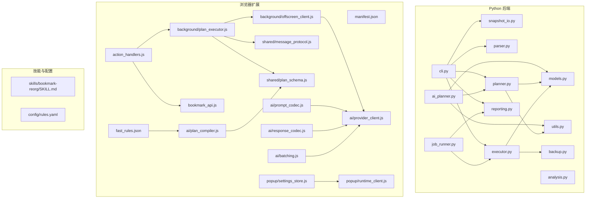
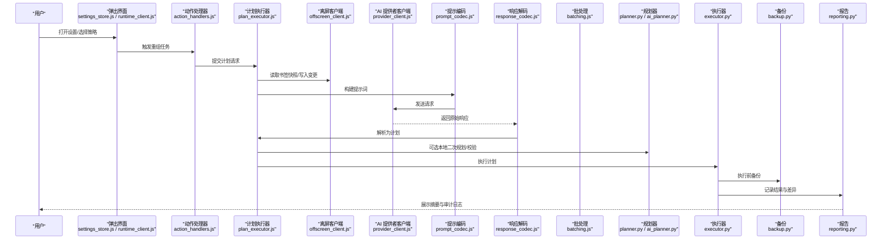
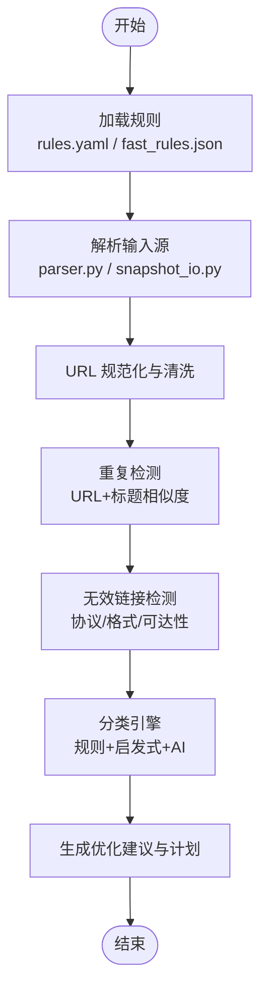
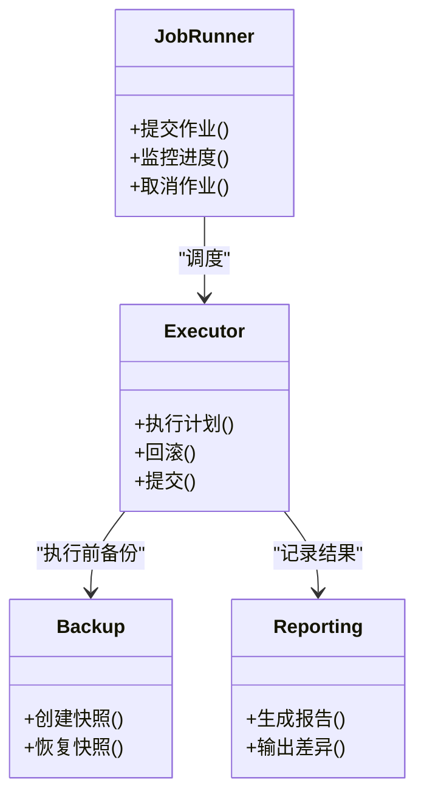
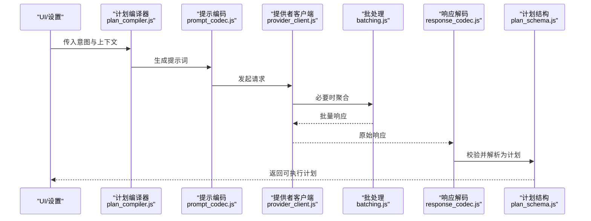
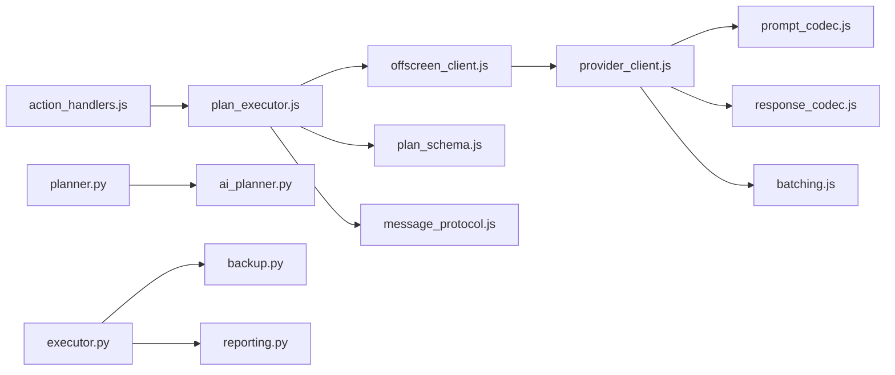

# 书签重组技能

<cite>
**本文引用的文件**   
- [SKILL.md](file://skills/bookmark-reorg/SKILL.md)
- [rules.yaml](file://config/rules.yaml)
- [ai_planner.py](file://src/bookmark_advisor/ai_planner.py)
- [planner.py](file://src/bookmark_advisor/planner.py)
- [executor.py](file://src/bookmark_advisor/executor.py)
- [job_runner.py](file://src/bookmark_advisor/job_runner.py)
- [models.py](file://src/bookmark_advisor/models.py)
- [parser.py](file://src/bookmark_advisor/parser.py)
- [snapshot_io.py](file://src/bookmark_advisor/snapshot_io.py)
- [backup.py](file://src/bookmark_advisor/backup.py)
- [reporting.py](file://src/bookmark_advisor/reporting.py)
- [utils.py](file://src/bookmark_advisor/utils.py)
- [AGENTS.md](file://src/bookmark_advisor/AGENTS.md)
- [fast_rules.json](file://extension/fast_rules.json)
- [plan_compiler.js](file://extension/ai/plan_compiler.js)
- [plan_executor.js](file://extension/background/plan_executor.js)
- [action_handlers.js](file://extension/background/action_handlers.js)
- [bookmark_api.js](file://extension/background/bookmark_api.js)
- [message_protocol.js](file://extension/shared/message_protocol.js)
- [plan_schema.js](file://extension/shared/plan_schema.js)
- [prompt_codec.js](file://extension/ai/prompt_codec.js)
- [response_codec.js](file://extension/ai/response_codec.js)
- [provider_client.js](file://extension/ai/provider_client.js)
- [batching.js](file://extension/ai/batching.js)
- [offscreen_client.js](file://extension/background/offscreen_client.js)
- [settings_store.js](file://extension/popup/settings_store.js)
- [runtime_client.js](file://extension/popup/runtime_client.js)
- [cli.py](file://src/bookmark_advisor/cli.py)
</cite>

## 目录
1. [简介](#简介)
2. [项目结构](#项目结构)
3. [核心组件](#核心组件)
4. [架构总览](#架构总览)
5. [详细组件分析](#详细组件分析)
6. [依赖关系分析](#依赖关系分析)
7. [性能考虑](#性能考虑)
8. [故障排除指南](#故障排除指南)
9. [结论](#结论)
10. [附录](#附录)

## 简介
本文件为“书签重组技能”的权威使用文档，面向希望系统化整理浏览器书签的用户与开发者。该技能提供：
- 智能分类算法：基于规则与语义理解对书签进行归类、合并与去重。
- 批量操作能力：支持大规模书签树的扫描、分析与执行计划生成，并安全地批量应用变更。
- 自定义规则配置：通过 YAML/JSON 规则定义分类策略、命名规范、路径模板等。
- AI 规划器集成：结合提示词模板与响应解析，自动生成可执行的重组计划，并在扩展或 CLI 中执行。

本技能既可作为独立命令行工具运行，也可作为浏览器扩展的一部分，在后台服务中协同工作。

## 项目结构
仓库采用多语言混合架构：
- Python 后端（src/bookmark_advisor）：负责分析、规划、执行、备份、报告与数据模型。
- 浏览器扩展（extension）：提供 UI、消息路由、AI 客户端、计划编译与执行、与书签 API 交互。
- 技能说明与规则（skills、config）：描述技能用法与规则配置。
- 测试（tests）：覆盖关键流程与兼容性。

图表来源
- [cli.py](file://src/bookmark_advisor/cli.py)
- [planner.py](file://src/bookmark_advisor/planner.py)
- [ai_planner.py](file://src/bookmark_advisor/ai_planner.py)
- [executor.py](file://src/bookmark_advisor/executor.py)
- [job_runner.py](file://src/bookmark_advisor/job_runner.py)
- [models.py](file://src/bookmark_advisor/models.py)
- [parser.py](file://src/bookmark_advisor/parser.py)
- [snapshot_io.py](file://src/bookmark_advisor/snapshot_io.py)
- [backup.py](file://src/bookmark_advisor/backup.py)
- [reporting.py](file://src/bookmark_advisor/reporting.py)
- [utils.py](file://src/bookmark_advisor/utils.py)
- [action_handlers.js](file://extension/background/action_handlers.js)
- [bookmark_api.js](file://extension/background/bookmark_api.js)
- [plan_executor.js](file://extension/background/plan_executor.js)
- [offscreen_client.js](file://extension/background/offscreen_client.js)
- [message_protocol.js](file://extension/shared/message_protocol.js)
- [plan_schema.js](file://extension/shared/plan_schema.js)
- [prompt_codec.js](file://extension/ai/prompt_codec.js)
- [response_codec.js](file://extension/ai/response_codec.js)
- [provider_client.js](file://extension/ai/provider_client.js)
- [batching.js](file://extension/ai/batching.js)
- [fast_rules.json](file://extension/fast_rules.json)
- [settings_store.js](file://extension/popup/settings_store.js)
- [runtime_client.js](file://extension/popup/runtime_client.js)
- [plan_compiler.js](file://extension/ai/plan_compiler.js)
- [SKILL.md](file://skills/bookmark-reorg/SKILL.md)
- [rules.yaml](file://config/rules.yaml)

章节来源
- [SKILL.md](file://skills/bookmark-reorg/SKILL.md)
- [rules.yaml](file://config/rules.yaml)
- [AGENTS.md](file://src/bookmark_advisor/AGENTS.md)

## 核心组件
- 规则与配置
  - YAML 规则用于定义分类策略、命名规范、路径模板、重复检测阈值等。
  - fast_rules.json 提供快速匹配规则，提升前端编译效率。
- 数据模型与快照
  - models.py 定义书签节点、分组、计划项等数据结构。
  - snapshot_io.py 负责书签树快照的导入导出，便于离线分析与恢复。
  - backup.py 在执行前创建可回滚的备份。
- 分析与规划
  - parser.py 解析输入源（如 JSON/HTML 书签导出）。
  - planner.py 基于规则与启发式算法生成优化建议与执行计划。
  - ai_planner.py 将自然语言意图与上下文转换为结构化计划，并与 prompt_codec/response_codec 协作。
- 执行与作业
  - executor.py 将计划逐项应用到书签树，支持事务性提交与回滚。
  - job_runner.py 管理作业生命周期、并发与重试。
- 报告与工具
  - reporting.py 输出统计、差异与审计日志。
  - utils.py 提供通用工具函数（路径处理、校验、序列化等）。
- 扩展侧集成
  - action_handlers.js 接收用户触发事件，调用 plan_executor.js。
  - plan_executor.js 编译并执行计划，与 offscreen_client.js 通信以访问受限 API。
  - message_protocol.js 与 plan_schema.js 定义跨进程消息与计划结构契约。
  - provider_client.js 封装 AI 提供商客户端，prompt_codec.js 与 response_codec.js 编解码提示与响应。
  - batching.js 聚合请求以提升吞吐。
  - settings_store.js 与 runtime_client.js 管理设置与运行时状态。

章节来源
- [models.py](file://src/bookmark_advisor/models.py)
- [snapshot_io.py](file://src/bookmark_advisor/snapshot_io.py)
- [backup.py](file://src/bookmark_advisor/backup.py)
- [parser.py](file://src/bookmark_advisor/parser.py)
- [planner.py](file://src/bookmark_advisor/planner.py)
- [ai_planner.py](file://src/bookmark_advisor/ai_planner.py)
- [executor.py](file://src/bookmark_advisor/executor.py)
- [job_runner.py](file://src/bookmark_advisor/job_runner.py)
- [reporting.py](file://src/bookmark_advisor/reporting.py)
- [utils.py](file://src/bookmark_advisor/utils.py)
- [action_handlers.js](file://extension/background/action_handlers.js)
- [plan_executor.js](file://extension/background/plan_executor.js)
- [offscreen_client.js](file://extension/background/offscreen_client.js)
- [message_protocol.js](file://extension/shared/message_protocol.js)
- [plan_schema.js](file://extension/shared/plan_schema.js)
- [prompt_codec.js](file://extension/ai/prompt_codec.js)
- [response_codec.js](file://extension/ai/response_codec.js)
- [provider_client.js](file://extension/ai/provider_client.js)
- [batching.js](file://extension/ai/batching.js)
- [settings_store.js](file://extension/popup/settings_store.js)
- [runtime_client.js](file://extension/popup/runtime_client.js)
- [fast_rules.json](file://extension/fast_rules.json)

## 架构总览
系统由“分析-规划-执行-报告”四阶段组成，并通过扩展侧 UI 与 AI 客户端桥接用户与后端。

图表来源
- [action_handlers.js](file://extension/background/action_handlers.js)
- [plan_executor.js](file://extension/background/plan_executor.js)
- [offscreen_client.js](file://extension/background/offscreen_client.js)
- [prompt_codec.js](file://extension/ai/prompt_codec.js)
- [response_codec.js](file://extension/ai/response_codec.js)
- [provider_client.js](file://extension/ai/provider_client.js)
- [batching.js](file://extension/ai/batching.js)
- [planner.py](file://src/bookmark_advisor/planner.py)
- [ai_planner.py](file://src/bookmark_advisor/ai_planner.py)
- [executor.py](file://src/bookmark_advisor/executor.py)
- [backup.py](file://src/bookmark_advisor/backup.py)
- [reporting.py](file://src/bookmark_advisor/reporting.py)

## 详细组件分析

### 智能分类算法与重复/无效链接识别
- 分类依据
  - 规则驱动：基于 config/rules.yaml 中的分类条件、命名模板与路径映射。
  - 启发式：根据 URL 模式、标题相似度、历史分组分布进行聚类。
  - AI 辅助：当规则不足以覆盖时，调用 AI 规划器生成更细粒度的分类建议。
- 重复与无效链接
  - 重复检测：基于 URL 规范化、标题相似度与路径深度比较，标记潜在重复项。
  - 无效链接：通过协议白名单、域名可达性检查（可选）、空标题/空白 URL 过滤。
- 输出建议
  - 生成“移动/合并/删除/重命名”等操作建议，附带置信度与原因说明。

图表来源
- [rules.yaml](file://config/rules.yaml)
- [fast_rules.json](file://extension/fast_rules.json)
- [parser.py](file://src/bookmark_advisor/parser.py)
- [snapshot_io.py](file://src/bookmark_advisor/snapshot_io.py)
- [planner.py](file://src/bookmark_advisor/planner.py)
- [ai_planner.py](file://src/bookmark_advisor/ai_planner.py)

章节来源
- [rules.yaml](file://config/rules.yaml)
- [fast_rules.json](file://extension/fast_rules.json)
- [parser.py](file://src/bookmark_advisor/parser.py)
- [snapshot_io.py](file://src/bookmark_advisor/snapshot_io.py)
- [planner.py](file://src/bookmark_advisor/planner.py)
- [ai_planner.py](file://src/bookmark_advisor/ai_planner.py)

### 批量操作能力与事务性执行
- 批量扫描：一次性遍历整个书签树，构建内存图结构，减少 I/O 次数。
- 计划生成：将多个原子操作打包为计划，支持预览与分步确认。
- 事务性执行：执行前自动备份，失败时按逆序回滚，保证一致性。
- 并发控制：作业调度器限制并发度，避免阻塞浏览器主线程。

图表来源
- [job_runner.py](file://src/bookmark_advisor/job_runner.py)
- [executor.py](file://src/bookmark_advisor/executor.py)
- [backup.py](file://src/bookmark_advisor/backup.py)
- [reporting.py](file://src/bookmark_advisor/reporting.py)

章节来源
- [job_runner.py](file://src/bookmark_advisor/job_runner.py)
- [executor.py](file://src/bookmark_advisor/executor.py)
- [backup.py](file://src/bookmark_advisor/backup.py)
- [reporting.py](file://src/bookmark_advisor/reporting.py)

### 自定义规则配置
- rules.yaml 典型字段
  - categories：分类规则集合，包含名称、匹配条件、目标路径模板。
  - naming：命名规范，包括大小写、分隔符、长度限制。
  - dedup：重复检测阈值与策略。
  - invalid：无效链接判定条件。
  - templates：路径模板变量与默认值。
- fast_rules.json
  - 预编译的快速匹配表，用于前端加速判断，减少 AI 调用。

章节来源
- [rules.yaml](file://config/rules.yaml)
- [fast_rules.json](file://extension/fast_rules.json)

### 与 AI 规划器的集成
- 提示词模板
  - prompt_codec.js 负责将当前书签快照、规则与用户意图组装为结构化提示。
- 响应解析
  - response_codec.js 将 AI 返回的自然语言或半结构化文本解析为计划对象。
- 提供者客户端
  - provider_client.js 封装 HTTP/WS 调用，支持鉴权、重试与超时。
- 批处理
  - batching.js 聚合多条请求，降低延迟与成本。
- 计划编译与校验
  - plan_compiler.js 将高层意图编译为可执行计划，plan_schema.js 定义结构约束。

图表来源
- [plan_compiler.js](file://extension/ai/plan_compiler.js)
- [prompt_codec.js](file://extension/ai/prompt_codec.js)
- [provider_client.js](file://extension/ai/provider_client.js)
- [batching.js](file://extension/ai/batching.js)
- [response_codec.js](file://extension/ai/response_codec.js)
- [plan_schema.js](file://extension/shared/plan_schema.js)

章节来源
- [prompt_codec.js](file://extension/ai/prompt_codec.js)
- [response_codec.js](file://extension/ai/response_codec.js)
- [provider_client.js](file://extension/ai/provider_client.js)
- [batching.js](file://extension/ai/batching.js)
- [plan_compiler.js](file://extension/ai/plan_compiler.js)
- [plan_schema.js](file://extension/shared/plan_schema.js)

### 使用方法与参数配置
- 触发方式
  - 扩展：通过弹出界面选择策略并点击“开始重组”。
  - CLI：通过命令行指定输入快照、规则文件与输出目录。
- 关键参数
  - 输入源：书签快照文件或实时读取。
  - 规则文件：rules.yaml 与 fast_rules.json。
  - 执行策略：仅预览/仅建议/实际执行；是否启用 AI 辅助。
  - 并发与重试：最大并发数、重试次数、超时时间。
- 输出结果
  - 计划预览：待执行的操作列表与影响范围。
  - 审计报告：变更摘要、重复/无效项清单、分类分布变化。
  - 备份文件：可恢复的快照副本。

章节来源
- [cli.py](file://src/bookmark_advisor/cli.py)
- [settings_store.js](file://extension/popup/settings_store.js)
- [runtime_client.js](file://extension/popup/runtime_client.js)
- [action_handlers.js](file://extension/background/action_handlers.js)
- [plan_executor.js](file://extension/background/plan_executor.js)

### 使用场景示例
- 个人学习类书签库
  - 策略：按主题与来源分类，保留高质量资源，清理过期链接。
  - 规则要点：提高分类粒度，严格无效链接检测，适度重复合并。
- 团队共享书签库
  - 策略：统一命名规范，按部门/项目组织，避免冲突。
  - 规则要点：强一致的路径模板，禁用高风险自动删除，增加人工确认步骤。
- 收藏型站点归档
  - 策略：按站点域聚合，保留快照元信息，定期更新。
  - 规则要点：域名级分类优先，保留历史版本，增量更新。

[本节为概念性内容，不直接分析具体文件]

## 依赖关系分析
- 模块耦合
  - 规划层与执行层解耦：planner/ai_planner 只产出计划，executor 专注应用变更。
  - 扩展与后端通过消息契约（message_protocol.js）与计划结构（plan_schema.js）通信。
- 外部依赖
  - AI 提供商：通过 provider_client.js 抽象，支持替换不同后端。
  - 书签 API：通过 bookmark_api.js 与 offscreen_client.js 访问受限接口。
- 潜在循环依赖
  - 通过分层与接口隔离避免循环引用；计划结构与消息协议作为稳定边界。

图表来源
- [action_handlers.js](file://extension/background/action_handlers.js)
- [plan_executor.js](file://extension/background/plan_executor.js)
- [offscreen_client.js](file://extension/background/offscreen_client.js)
- [plan_schema.js](file://extension/shared/plan_schema.js)
- [message_protocol.js](file://extension/shared/message_protocol.js)
- [provider_client.js](file://extension/ai/provider_client.js)
- [prompt_codec.js](file://extension/ai/prompt_codec.js)
- [response_codec.js](file://extension/ai/response_codec.js)
- [batching.js](file://extension/ai/batching.js)
- [planner.py](file://src/bookmark_advisor/planner.py)
- [ai_planner.py](file://src/bookmark_advisor/ai_planner.py)
- [executor.py](file://src/bookmark_advisor/executor.py)
- [backup.py](file://src/bookmark_advisor/backup.py)
- [reporting.py](file://src/bookmark_advisor/reporting.py)

章节来源
- [message_protocol.js](file://extension/shared/message_protocol.js)
- [plan_schema.js](file://extension/shared/plan_schema.js)
- [planner.py](file://src/bookmark_advisor/planner.py)
- [ai_planner.py](file://src/bookmark_advisor/ai_planner.py)
- [executor.py](file://src/bookmark_advisor/executor.py)
- [backup.py](file://src/bookmark_advisor/backup.py)
- [reporting.py](file://src/bookmark_advisor/reporting.py)

## 性能考虑
- 规则预编译
  - 使用 fast_rules.json 在前端快速匹配，减少 AI 调用与网络开销。
- 批处理与缓存
  - batching.js 聚合请求；对热点规则与分类结果做短期缓存。
- 并发与限流
  - job_runner.py 控制并发度，避免阻塞 UI 与浏览器主线程。
- 增量更新
  - 对大型书签库采用增量快照对比，仅处理变更部分。
- 内存占用
  - 大书签树分块处理，避免一次性加载导致 OOM。

[本节为通用指导，不直接分析具体文件]

## 故障排除指南
- 常见问题
  - AI 响应解析失败：检查 response_codec.js 的解析逻辑与 plan_schema.js 的结构约束。
  - 权限不足：确认 offscreen_client.js 已正确申请书签相关权限。
  - 规则冲突：审查 rules.yaml 的分类优先级与命名模板冲突。
  - 执行中断：查看 executor.py 的回滚日志与 backup.py 的快照完整性。
- 调试建议
  - 启用详细日志：在 reporting.py 输出差异与审计信息。
  - 先预览后执行：使用计划预览功能验证影响范围。
  - 逐步缩小范围：针对特定分组或标签进行测试。
- 恢复方案
  - 使用备份快照恢复：通过 backup.py 提供的恢复接口还原到执行前状态。

章节来源
- [response_codec.js](file://extension/ai/response_codec.js)
- [plan_schema.js](file://extension/shared/plan_schema.js)
- [offscreen_client.js](file://extension/background/offscreen_client.js)
- [rules.yaml](file://config/rules.yaml)
- [executor.py](file://src/bookmark_advisor/executor.py)
- [backup.py](file://src/bookmark_advisor/backup.py)
- [reporting.py](file://src/bookmark_advisor/reporting.py)

## 结论
书签重组技能通过“规则+启发式+AI”的多层策略，实现了高效、可控且可审计的书签整理流程。其模块化设计与清晰的契约接口，使得在不同规模与类型的书签库中都能灵活适配。建议在生产环境中优先启用预览与备份机制，并结合 fast_rules.json 与批处理优化性能。

[本节为总结性内容，不直接分析具体文件]

## 附录
- 术语
  - 计划：一组原子操作的有序集合，包含移动、合并、重命名、删除等。
  - 快照：书签树的静态表示，用于离线分析与恢复。
  - 作业：一次完整的重组任务，包含规划、执行与报告。
- 参考
  - 技能说明：skills/bookmark-reorg/SKILL.md
  - 规则配置：config/rules.yaml
  - 扩展入口：extension/manifest.json

[本节为补充信息，不直接分析具体文件]