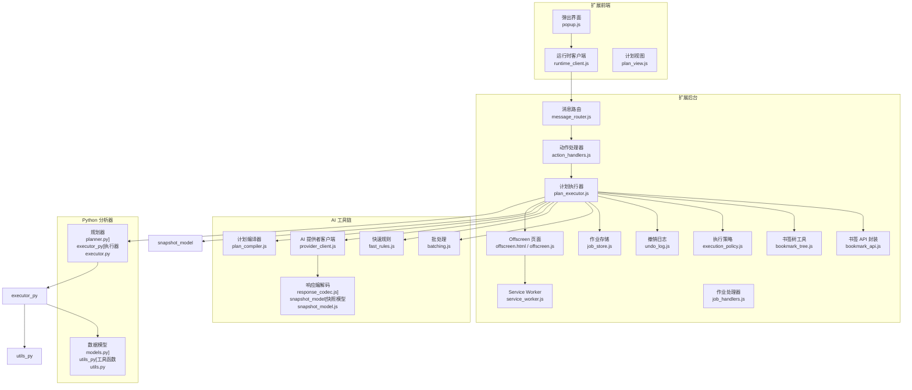
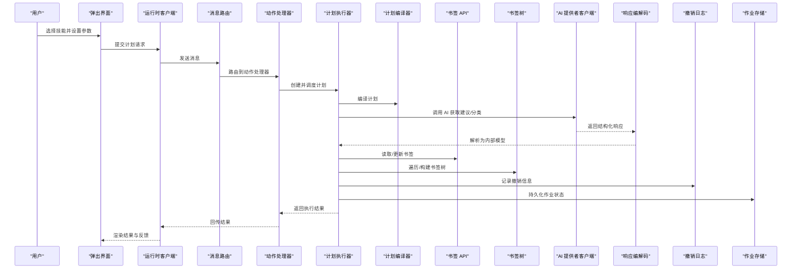
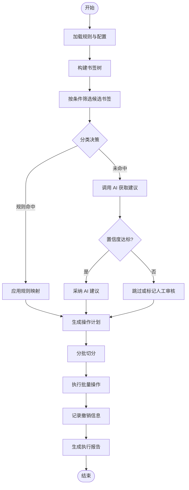
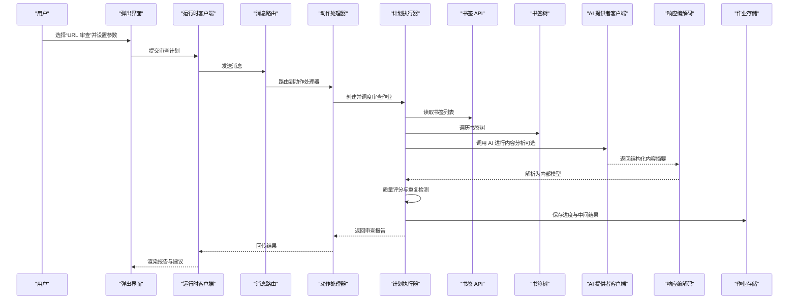
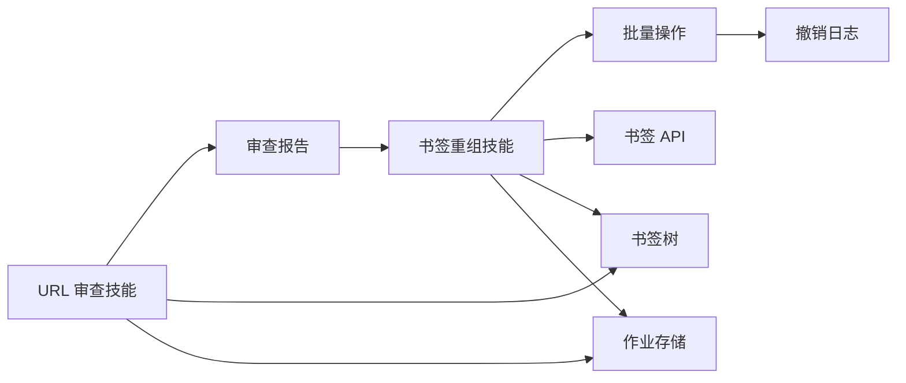
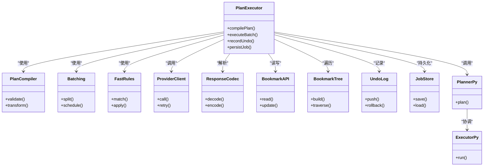

# 内置技能详解

<cite>
**本文引用的文件**   
- [skills/bookmark-reorg/SKILL.md](file://skills/bookmark-reorg/SKILL.md)
- [skills/bookmark-url-review/SKILL.md](file://skills/bookmark-url-review/SKILL.md)
- [skills/bookmark-url-review/references/review-contract.md](file://skills/bookmark-url-review/references/review-contract.md)
- [extension/ai/batching.js](file://extension/ai/batching.js)
- [extension/ai/fast_rules.js](file://extension/ai/fast_rules.js)
- [extension/ai/plan_compiler.js](file://extension/ai/plan_compiler.js)
- [extension/ai/provider_client.js](file://extension/ai/provider_client.js)
- [extension/ai/response_codec.js](file://extension/ai/response_codec.js)
- [extension/ai/snapshot_model.js](file://extension/ai/snapshot_model.js)
- [extension/background/action_handlers.js](file://extension/background/action_handlers.js)
- [extension/background/bookmark_api.js](file://extension/background/bookmark_api.js)
- [extension/background/bookmark_tree.js](file://extension/background/bookmark_tree.js)
- [extension/background/execution_policy.js](file://extension/background/execution_policy.js)
- [extension/background/job_handlers.js](file://extension/background/job_handlers.js)
- [extension/background/job_lifecycle.js](file://extension/background/job_lifecycle.js)
- [extension/background/job_store.js](file://extension/background/job_store.js)
- [extension/background/message_router.js](file://extension/background/message_router.js)
- [extension/background/offscreen_client.js](file://extension/background/offscreen_client.js)
- [extension/background/plan_executor.js](file://extension/background/plan_executor.js)
- [extension/background/undo_log.js](file://extension/background/undo_log.js)
- [extension/popup/runtime_client.js](file://extension/popup/runtime_client.js)
- [extension/shared/plan_schema.js](file://extension/shared/plan_schema.js)
- [extension/shared/storage.js](file://extension/shared/storage.js)
- [extension/service_worker.js](file://extension/service_worker.js)
- [extension/offscreen.js](file://extension/offscreen.js)
- [config/rules.yaml](file://config/rules.yaml)
- [src/bookmark_advisor/planner.py](file://src/bookmark_advisor/planner.py)
- [src/bookmark_advisor/executor.py](file://src/bookmark_advisor/executor.py)
- [src/bookmark_advisor/models.py](file://src/bookmark_advisor/models.py)
- [src/bookmark_advisor/utils.py](file://src/bookmark_advisor/utils.py)
</cite>

## 目录
1. [简介](#简介)
2. [项目结构](#项目结构)
3. [核心组件](#核心组件)
4. [架构总览](#架构总览)
5. [详细组件分析](#详细组件分析)
6. [依赖关系分析](#依赖关系分析)
7. [性能考虑](#性能考虑)
8. [故障排除指南](#故障排除指南)
9. [结论](#结论)
10. [附录](#附录)

## 简介
本文件面向使用与扩展“内置技能”的用户与开发者，聚焦以下两大技能：
- 书签重组技能：提供智能分类、批量操作与自定义规则配置能力，帮助用户对浏览器书签进行系统化整理。
- URL 审查技能：对书签中的链接进行质量评估、重复检测与内容分析，辅助清理与优化书签库。

文档将深入说明技能的工作原理、触发条件、参数配置、输出结果、实际使用场景与配置示例，并解释技能间的协作机制（数据共享与流程编排），最后给出故障排除与性能优化建议。

## 项目结构
本项目采用“前端扩展 + 后台执行 + Python 分析器”的混合架构：
- 扩展层（Chrome Extension）负责 UI、消息路由、计划编译与执行、与 AI 服务交互、以及书签树与存储访问。
- 后台任务通过 Offscreen Document 与 Service Worker 协同，保障长时间运行任务的稳定性。
- Python 侧提供规划与执行引擎，用于复杂分析与批处理。

图表来源
- [extension/popup/runtime_client.js](file://extension/popup/runtime_client.js)
- [extension/background/message_router.js](file://extension/background/message_router.js)
- [extension/background/action_handlers.js](file://extension/background/action_handlers.js)
- [extension/background/plan_executor.js](file://extension/background/plan_executor.js)
- [extension/background/bookmark_api.js](file://extension/background/bookmark_api.js)
- [extension/background/bookmark_tree.js](file://extension/background/bookmark_tree.js)
- [extension/background/execution_policy.js](file://extension/background/execution_policy.js)
- [extension/background/undo_log.js](file://extension/background/undo_log.js)
- [extension/background/job_store.js](file://extension/background/job_store.js)
- [extension/ai/batching.js](file://extension/ai/batching.js)
- [extension/ai/fast_rules.js](file://extension/ai/fast_rules.js)
- [extension/ai/plan_compiler.js](file://extension/ai/plan_compiler.js)
- [extension/ai/provider_client.js](file://extension/ai/provider_client.js)
- [extension/ai/response_codec.js](file://extension/ai/response_codec.js)
- [extension/ai/snapshot_model.js](file://extension/ai/snapshot_model.js)
- [extension/offscreen.js](file://extension/offscreen.js)
- [extension/service_worker.js](file://extension/service_worker.js)
- [src/bookmark_advisor/planner.py](file://src/bookmark_advisor/planner.py)
- [src/bookmark_advisor/executor.py](file://src/bookmark_advisor/executor.py)
- [src/bookmark_advisor/models.py](file://src/bookmark_advisor/models.py)
- [src/bookmark_advisor/utils.py](file://src/bookmark_advisor/utils.py)

章节来源
- [extension/popup/runtime_client.js](file://extension/popup/runtime_client.js)
- [extension/background/message_router.js](file://extension/background/message_router.js)
- [extension/background/action_handlers.js](file://extension/background/action_handlers.js)
- [extension/background/plan_executor.js](file://extension/background/plan_executor.js)
- [extension/ai/plan_compiler.js](file://extension/ai/plan_compiler.js)
- [extension/ai/batching.js](file://extension/ai/batching.js)
- [extension/ai/fast_rules.js](file://extension/ai/fast_rules.js)
- [extension/ai/provider_client.js](file://extension/ai/provider_client.js)
- [extension/ai/response_codec.js](file://extension/ai/response_codec.js)
- [extension/ai/snapshot_model.js](file://extension/ai/snapshot_model.js)
- [extension/offscreen.js](file://extension/offscreen.js)
- [extension/service_worker.js](file://extension/service_worker.js)
- [src/bookmark_advisor/planner.py](file://src/bookmark_advisor/planner.py)
- [src/bookmark_advisor/executor.py](file://src/bookmark_advisor/executor.py)
- [src/bookmark_advisor/models.py](file://src/bookmark_advisor/models.py)
- [src/bookmark_advisor/utils.py](file://src/bookmark_advisor/utils.py)

## 核心组件
- 书签重组技能：基于规则与 AI 的混合方案，支持智能分类、批量移动/重命名/合并等能力，并提供可配置的规则集。
- URL 审查技能：围绕链接质量评估、重复检测与内容分析，形成结构化审查报告，便于后续自动化或人工复核。

章节来源
- [skills/bookmark-reorg/SKILL.md](file://skills/bookmark-reorg/SKILL.md)
- [skills/bookmark-url-review/SKILL.md](file://skills/bookmark-url-review/SKILL.md)
- [skills/bookmark-url-review/references/review-contract.md](file://skills/bookmark-url-review/references/review-contract.md)

## 架构总览
下图展示从用户触发到技能执行的端到端流程，包括计划生成、AI 调用、书签操作与撤销记录。

图表来源
- [extension/popup/runtime_client.js](file://extension/popup/runtime_client.js)
- [extension/background/message_router.js](file://extension/background/message_router.js)
- [extension/background/action_handlers.js](file://extension/background/action_handlers.js)
- [extension/background/plan_executor.js](file://extension/background/plan_executor.js)
- [extension/ai/plan_compiler.js](file://extension/ai/plan_compiler.js)
- [extension/ai/provider_client.js](file://extension/ai/provider_client.js)
- [extension/ai/response_codec.js](file://extension/ai/response_codec.js)
- [extension/background/bookmark_api.js](file://extension/background/bookmark_api.js)
- [extension/background/bookmark_tree.js](file://extension/background/bookmark_tree.js)
- [extension/background/undo_log.js](file://extension/background/undo_log.js)
- [extension/background/job_store.js](file://extension/background/job_store.js)

## 详细组件分析

### 书签重组技能
该技能提供三类核心能力：
- 智能分类算法：结合规则与 AI 建议，自动识别主题、来源或用途，生成目标文件夹路径。
- 批量操作能力：支持批量移动、重命名、合并、去重等操作，具备幂等性与事务性保障。
- 自定义规则配置：通过规则文件定义匹配条件与目标路径，支持正则、关键词、域名白名单等。

#### 触发条件与入口
- 在弹出界面中选择“书签重组”，输入筛选条件（如标签、路径前缀、时间范围）。
- 点击“生成计划”后，系统进入计划编译与执行阶段。

#### 参数配置
- 规则来源：本地规则文件或远程配置。
- 分类策略：优先规则匹配，其次 AI 建议；可设置置信度阈值。
- 批量大小：控制每次处理的书签数量，避免一次性过大导致性能问题。
- 安全模式：是否启用预览与确认步骤。

#### 输出结果
- 计划清单：包含待执行的操作序列与预期影响。
- 执行报告：成功/失败统计、受影响书签列表、撤销信息索引。
- 变更预览：可在执行前查看拟进行的移动/重命名/合并操作。

图表来源
- [extension/background/plan_executor.js](file://extension/background/plan_executor.js)
- [extension/ai/plan_compiler.js](file://extension/ai/plan_compiler.js)
- [extension/ai/fast_rules.js](file://extension/ai/fast_rules.js)
- [extension/ai/batching.js](file://extension/ai/batching.js)
- [extension/background/bookmark_api.js](file://extension/background/bookmark_api.js)
- [extension/background/bookmark_tree.js](file://extension/background/bookmark_tree.js)
- [extension/background/undo_log.js](file://extension/background/undo_log.js)
- [extension/background/job_store.js](file://extension/background/job_store.js)

章节来源
- [skills/bookmark-reorg/SKILL.md](file://skills/bookmark-reorg/SKILL.md)
- [extension/ai/fast_rules.js](file://extension/ai/fast_rules.js)
- [extension/ai/plan_compiler.js](file://extension/ai/plan_compiler.js)
- [extension/ai/batching.js](file://extension/ai/batching.js)
- [extension/background/plan_executor.js](file://extension/background/plan_executor.js)
- [extension/background/bookmark_api.js](file://extension/background/bookmark_api.js)
- [extension/background/bookmark_tree.js](file://extension/background/bookmark_tree.js)
- [extension/background/undo_log.js](file://extension/background/undo_log.js)
- [extension/background/job_store.js](file://extension/background/job_store.js)
- [config/rules.yaml](file://config/rules.yaml)

### URL 审查技能
该技能围绕链接质量评估、重复检测与内容分析展开，输出结构化审查报告，便于后续清理与优化。

#### 工作原理
- 链接质量评估：基于域名信誉、历史访问频率、标题/描述完整性、协议与端口合法性等指标打分。
- 重复检测：对 URL 进行规范化（去除片段、排序查询参数、归一化大小写），计算相似度或哈希冲突，识别潜在重复。
- 内容分析：可选地抓取页面元信息（标题、描述、语言、站点类型），结合 AI 摘要判断内容价值。

#### 触发条件与入口
- 在弹出界面中选择“URL 审查”，指定书签范围（全部、某文件夹、按标签）。
- 可选择是否启用“内容分析”（会触发额外网络请求与 AI 调用）。

#### 参数配置
- 质量阈值：低于阈值的链接将被标记为低质。
- 重复策略：严格匹配或模糊匹配（允许一定差异）。
- 并发限制：控制并行抓取与 AI 调用数量，避免资源争用。
- 超时与重试：设置网络请求与 AI 调用的超时时间与重试次数。

#### 输出结果
- 审查报告：每条链接的质量分数、重复组、内容摘要与风险标签。
- 建议操作：删除、归档、合并、重命名等推荐动作。
- 可导出格式：JSON/CSV，便于外部工具进一步处理。

图表来源
- [extension/popup/runtime_client.js](file://extension/popup/runtime_client.js)
- [extension/background/message_router.js](file://extension/background/message_router.js)
- [extension/background/action_handlers.js](file://extension/background/action_handlers.js)
- [extension/background/plan_executor.js](file://extension/background/plan_executor.js)
- [extension/ai/provider_client.js](file://extension/ai/provider_client.js)
- [extension/ai/response_codec.js](file://extension/ai/response_codec.js)
- [extension/background/bookmark_api.js](file://extension/background/bookmark_api.js)
- [extension/background/bookmark_tree.js](file://extension/background/bookmark_tree.js)
- [extension/background/job_store.js](file://extension/background/job_store.js)
- [skills/bookmark-url-review/references/review-contract.md](file://skills/bookmark-url-review/references/review-contract.md)

章节来源
- [skills/bookmark-url-review/SKILL.md](file://skills/bookmark-url-review/SKILL.md)
- [skills/bookmark-url-review/references/review-contract.md](file://skills/bookmark-url-review/references/review-contract.md)
- [extension/ai/provider_client.js](file://extension/ai/provider_client.js)
- [extension/ai/response_codec.js](file://extension/ai/response_codec.js)
- [extension/background/plan_executor.js](file://extension/background/plan_executor.js)
- [extension/background/bookmark_api.js](file://extension/background/bookmark_api.js)
- [extension/background/bookmark_tree.js](file://extension/background/bookmark_tree.js)
- [extension/background/job_store.js](file://extension/background/job_store.js)

### 技能间协作机制
- 数据共享：书签树与作业存储在两个技能间复用，确保一致性与可追溯性。
- 流程编排：先执行“URL 审查”生成报告，再作为输入驱动“书签重组”的规则与 AI 建议，实现“先诊断、后治疗”的流水线。
- 撤销与回滚：所有变更均记录撤销日志，支持一键回滚。

图表来源
- [extension/background/bookmark_api.js](file://extension/background/bookmark_api.js)
- [extension/background/bookmark_tree.js](file://extension/background/bookmark_tree.js)
- [extension/background/undo_log.js](file://extension/background/undo_log.js)
- [extension/background/job_store.js](file://extension/background/job_store.js)
- [extension/background/plan_executor.js](file://extension/background/plan_executor.js)

章节来源
- [extension/background/plan_executor.js](file://extension/background/plan_executor.js)
- [extension/background/bookmark_api.js](file://extension/background/bookmark_api.js)
- [extension/background/bookmark_tree.js](file://extension/background/bookmark_tree.js)
- [extension/background/undo_log.js](file://extension/background/undo_log.js)
- [extension/background/job_store.js](file://extension/background/job_store.js)

## 依赖关系分析
- 扩展内部依赖：
  - 计划执行器依赖计划编译器、批处理、快速规则、AI 提供者客户端与响应编解码。
  - 书签操作依赖书签 API 与书签树工具。
  - 作业状态依赖作业存储与撤销日志。
- 外部依赖：
  - AI 服务：通过提供者客户端与响应编解码进行通信。
  - Python 分析器：通过计划执行器调用规划器与执行器，使用统一的数据模型与工具函数。

图表来源
- [extension/background/plan_executor.js](file://extension/background/plan_executor.js)
- [extension/ai/plan_compiler.js](file://extension/ai/plan_compiler.js)
- [extension/ai/batching.js](file://extension/ai/batching.js)
- [extension/ai/fast_rules.js](file://extension/ai/fast_rules.js)
- [extension/ai/provider_client.js](file://extension/ai/provider_client.js)
- [extension/ai/response_codec.js](file://extension/ai/response_codec.js)
- [extension/background/bookmark_api.js](file://extension/background/bookmark_api.js)
- [extension/background/bookmark_tree.js](file://extension/background/bookmark_tree.js)
- [extension/background/undo_log.js](file://extension/background/undo_log.js)
- [extension/background/job_store.js](file://extension/background/job_store.js)
- [src/bookmark_advisor/planner.py](file://src/bookmark_advisor/planner.py)
- [src/bookmark_advisor/executor.py](file://src/bookmark_advisor/executor.py)

章节来源
- [extension/background/plan_executor.js](file://extension/background/plan_executor.js)
- [extension/ai/plan_compiler.js](file://extension/ai/plan_compiler.js)
- [extension/ai/batching.js](file://extension/ai/batching.js)
- [extension/ai/fast_rules.js](file://extension/ai/fast_rules.js)
- [extension/ai/provider_client.js](file://extension/ai/provider_client.js)
- [extension/ai/response_codec.js](file://extension/ai/response_codec.js)
- [extension/background/bookmark_api.js](file://extension/background/bookmark_api.js)
- [extension/background/bookmark_tree.js](file://extension/background/bookmark_tree.js)
- [extension/background/undo_log.js](file://extension/background/undo_log.js)
- [extension/background/job_store.js](file://extension/background/job_store.js)
- [src/bookmark_advisor/planner.py](file://src/bookmark_advisor/planner.py)
- [src/bookmark_advisor/executor.py](file://src/bookmark_advisor/executor.py)

## 性能考虑
- 批处理与分页：通过批处理模块将大规模操作拆分为小批次，降低单次内存占用与阻塞时间。
- 并发控制：对网络请求与 AI 调用设置并发上限，避免资源争用与服务限流。
- 缓存与增量：对书签树与审查结果进行缓存，仅对变更部分重新计算。
- 超时与重试：合理设置超时与重试策略，提升鲁棒性。
- 异步与后台：利用 Offscreen 与 Service Worker 保证长任务稳定执行。

[本节为通用指导，不直接分析具体文件]

## 故障排除指南
- 常见问题
  - AI 调用失败：检查网络连通性、凭据与配额；查看响应编解码错误日志。
  - 书签操作无变化：确认权限与执行策略；检查撤销日志是否存在对应条目。
  - 审查报告不完整：调整并发与超时；确认内容分析开关与站点可达性。
- 定位方法
  - 查看作业存储中的状态与中间结果。
  - 核对计划编译器的校验与转换输出。
  - 使用快速规则调试匹配逻辑。
- 恢复措施
  - 使用撤销日志进行回滚。
  - 重置作业状态并重试。
  - 降级策略：关闭内容分析或放宽重复检测阈值。

章节来源
- [extension/background/job_store.js](file://extension/background/job_store.js)
- [extension/ai/response_codec.js](file://extension/ai/response_codec.js)
- [extension/ai/plan_compiler.js](file://extension/ai/plan_compiler.js)
- [extension/ai/fast_rules.js](file://extension/ai/fast_rules.js)
- [extension/background/undo_log.js](file://extension/background/undo_log.js)
- [extension/background/execution_policy.js](file://extension/background/execution_policy.js)

## 结论
书签重组与 URL 审查两大技能通过统一的计划执行框架与数据模型紧密协作，既满足日常整理的效率需求，又提供可扩展的规则与 AI 能力。建议在大规模操作时启用批处理与并发控制，并结合撤销日志保障安全性。通过合理的配置与流程编排，可实现从诊断到治理的闭环。

[本节为总结性内容，不直接分析具体文件]

## 附录
- 配置示例要点
  - 规则文件：在规则文件中定义匹配条件与目标路径，支持正则与关键词。
  - 审查阈值：根据业务需要设定质量阈值与重复策略。
  - 并发与超时：依据网络与服务状况调整并发上限与超时时间。
- 参考契约
  - URL 审查契约定义了输入输出结构与字段含义，便于集成与测试。

章节来源
- [config/rules.yaml](file://config/rules.yaml)
- [skills/bookmark-url-review/references/review-contract.md](file://skills/bookmark-url-review/references/review-contract.md)