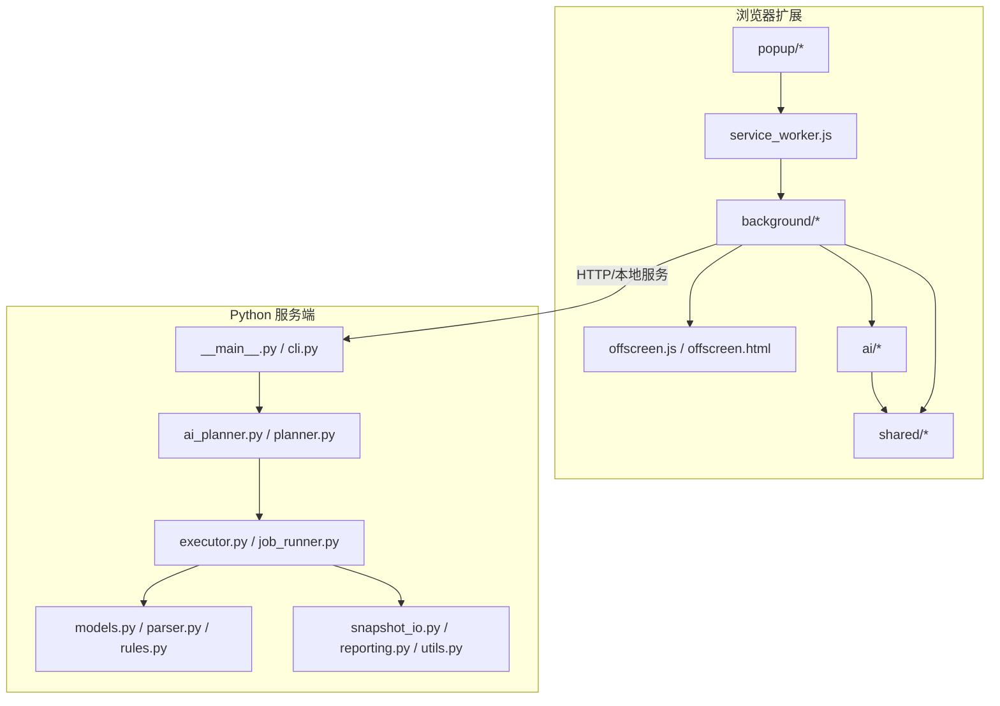
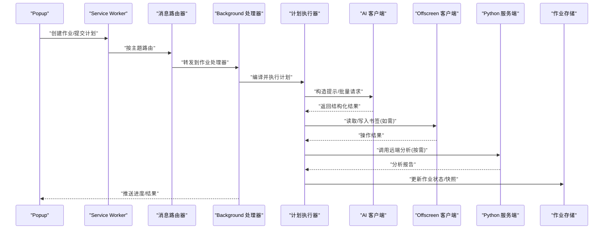
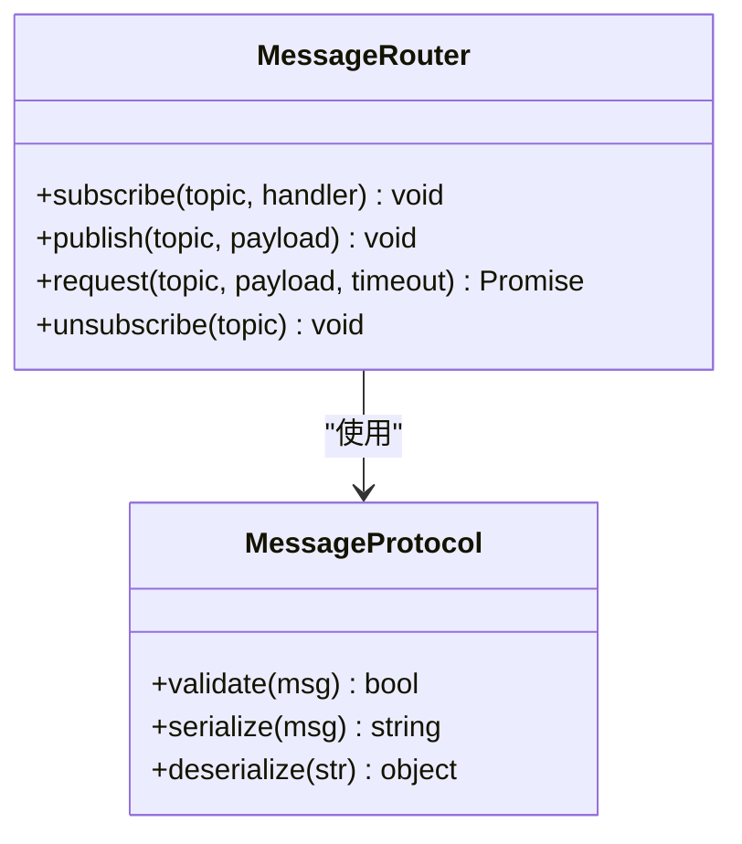
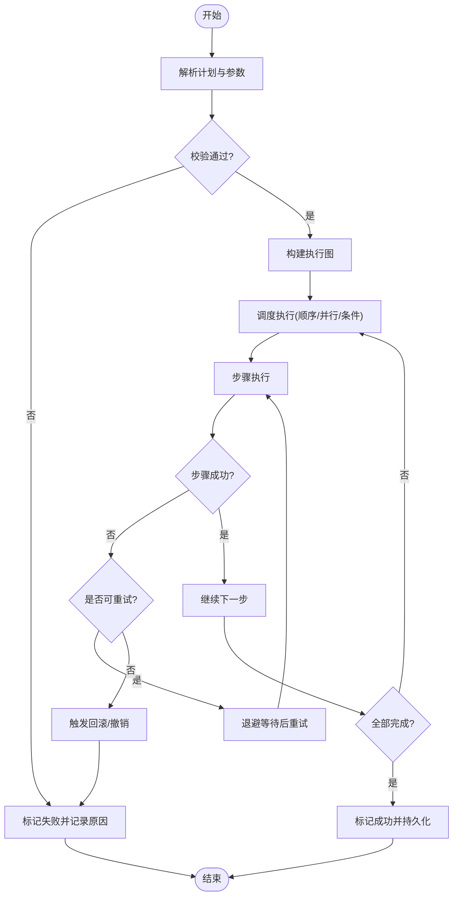
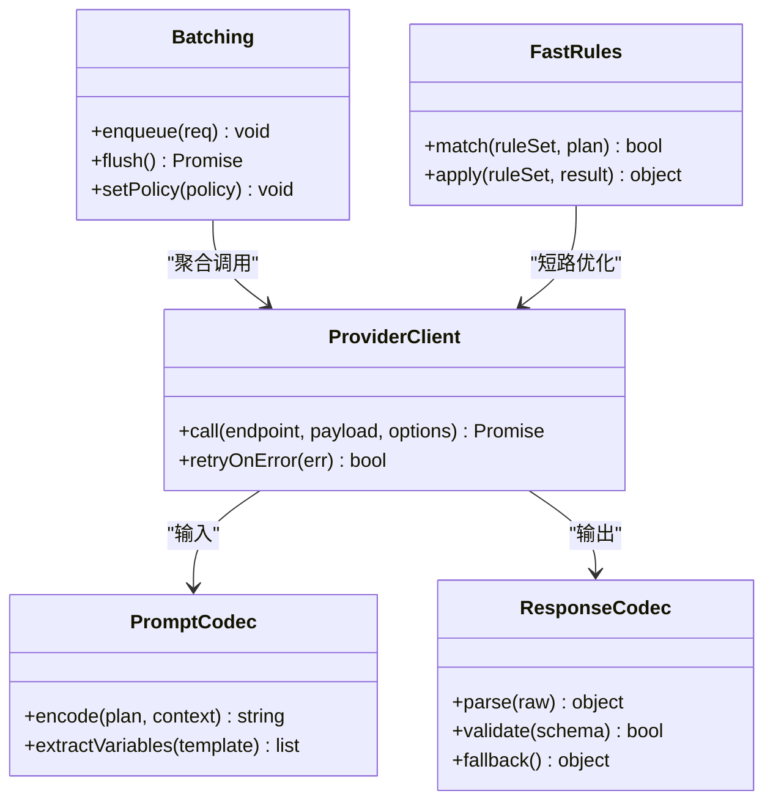
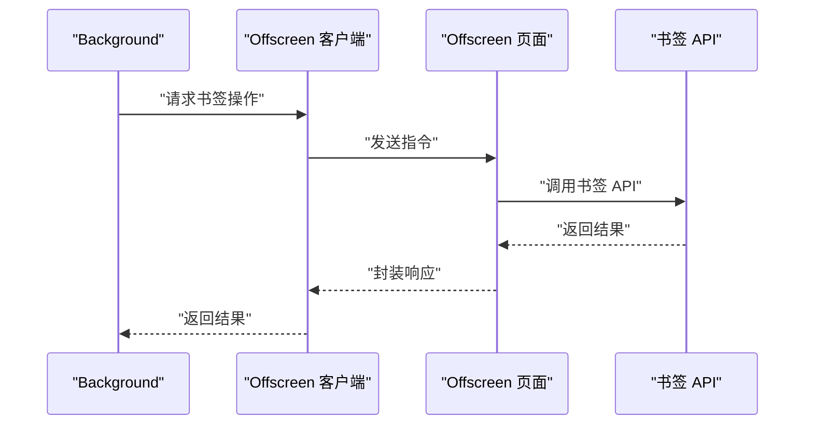
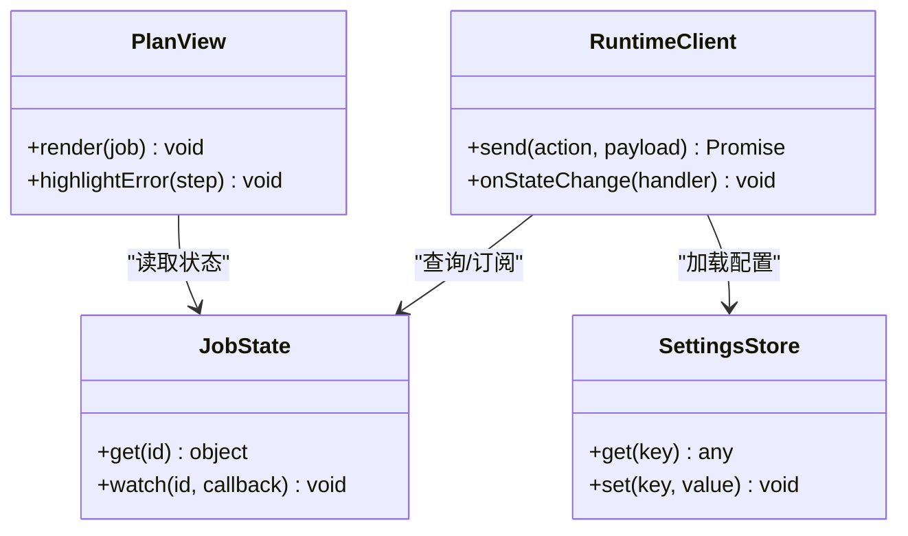
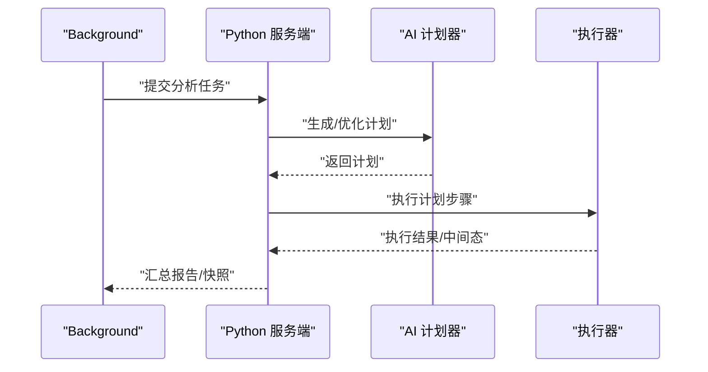
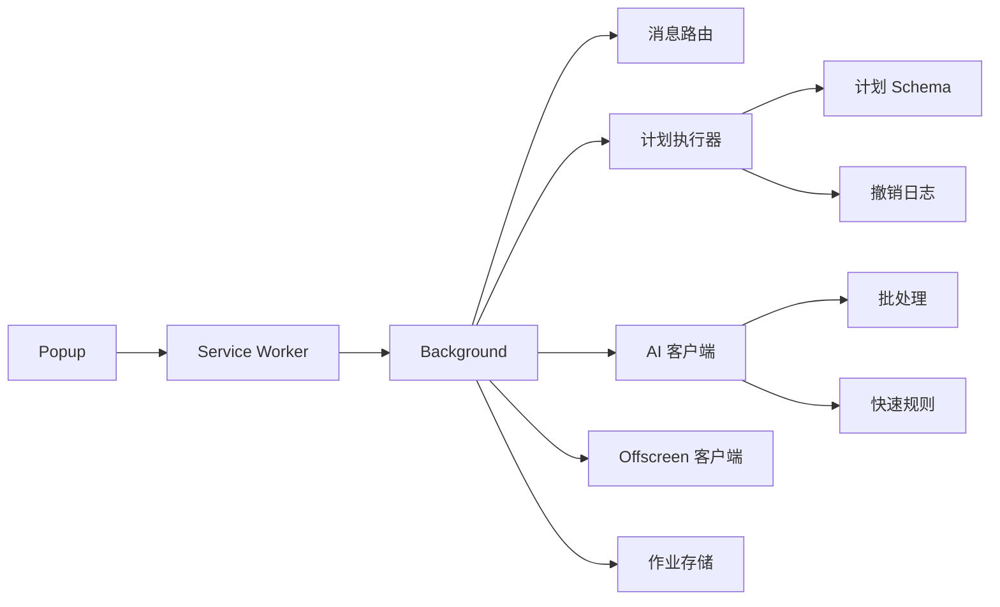

# 多代理协作机制

<cite>
**本文引用的文件**   
- [README.md](file://README.md)
- [AGENTS.md](file://AGENTS.md)
- [extension/AGENTS.md](file://extension/AGENTS.md)
- [src/bookmark_advisor/AGENTS.md](file://src/bookmark_advisor/AGENTS.md)
- [config/rules.yaml](file://config/rules.yaml)
- [extension/shared/message_protocol.js](file://extension/shared/message_protocol.js)
- [extension/background/message_router.js](file://extension/background/message_router.js)
- [extension/background/job_handlers.js](file://extension/background/job_handlers.js)
- [extension/background/job_lifecycle.js](file://extension/background/job_lifecycle.js)
- [extension/background/job_store.js](file://extension/background/job_store.js)
- [extension/background/plan_executor.js](file://extension/background/plan_executor.js)
- [extension/popup/runtime_client.js](file://extension/popup/runtime_client.js)
- [extension/offscreen.js](file://extension/offscreen.js)
- [extension/service_worker.js](file://extension/service_worker.js)
- [extension/ai/provider_client.js](file://extension/ai/provider_client.js)
- [extension/ai/batching.js](file://extension/ai/batching.js)
- [extension/ai/response_codec.js](file://extension/ai/response_codec.js)
- [extension/ai/prompt_codec.js](file://extension/ai/prompt_codec.js)
- [extension/ai/fast_rules.js](file://extension/ai/fast_rules.js)
- [extension/ai/plan_compiler.js](file://extension/ai/plan_compiler.js)
- [extension/ai/snapshot_model.js](file://extension/ai/snapshot_model.js)
- [extension/background/action_handlers.js](file://extension/background/action_handlers.js)
- [extension/background/execution_policy.js](file://extension/background/execution_policy.js)
- [extension/background/undo_log.js](file://extension/background/undo_log.js)
- [extension/background/snapshot_export.js](file://extension/background/snapshot_export.js)
- [extension/background/offscreen_client.js](file://extension/background/offscreen_client.js)
- [extension/popup/job_state.js](file://extension/popup/job_state.js)
- [extension/popup/plan_view.js](file://extension/popup/plan_view.js)
- [extension/popup/settings_store.js](file://extension/popup/settings_store.js)
- [extension/popup/secrets.js](file://extension/popup/secrets.js)
- [extension/shared/storage.js](file://extension/shared/storage.js)
- [extension/shared/plan_schema.js](file://extension/shared/plan_schema.js)
- [extension/shared/path_utils.js](file://extension/shared/path_utils.js)
- [extension/shared/ai_endpoint.js](file://extension/shared/ai_endpoint.js)
- [extension/manifest.json](file://extension/manifest.json)
- [extension/popup.html](file://extension/popup.html)
- [extension/offscreen.html](file://extension/offscreen.html)
- [extension/popup.js](file://extension/popup.js)
- [extension/ai_planner.js](file://extension/ai_planner.js)
- [extension/plan_lint.js](file://extension/plan_lint.js)
- [extension/storage_helpers.js](file://extension/storage_helpers.js)
- [extension/background/bookmark_api.js](file://extension/background/bookmark_api.js)
- [extension/background/bookmark_tree.js](file://extension/background/bookmark_tree.js)
- [extension/action_constants.js](file://extension/action_constants.js)
- [extension/fast_rules.json](file://extension/fast_rules.json)
- [src/bookmark_advisor/__main__.py](file://src/bookmark_advisor/__main__.py)
- [src/bookmark_advisor/cli.py](file://src/bookmark_advisor/cli.py)
- [src/bookmark_advisor/ai_planner.py](file://src/bookmark_advisor/ai_planner.py)
- [src/bookmark_advisor/planner.py](file://src/bookmark_advisor/planner.py)
- [src/bookmark_advisor/executor.py](file://src/bookmark_advisor/executor.py)
- [src/bookmark_advisor/job_runner.py](file://src/bookmark_advisor/job_runner.py)
- [src/bookmark_advisor/models.py](file://src/bookmark_advisor/models.py)
- [src/bookmark_advisor/parser.py](file://src/bookmark_advisor/parser.py)
- [src/bookmark_advisor/reporting.py](file://src/bookmark_advisor/reporting.py)
- [src/bookmark_advisor/rules.py](file://src/bookmark_advisor/rules.py)
- [src/bookmark_advisor/snapshot_io.py](file://src/bookmark_advisor/snapshot_io.py)
- [src/bookmark_advisor/utils.py](file://src/bookmark_advisor/utils.py)
- [tests/test_extension_message_router.js](file://tests/test_extension_message_router.js)
- [tests/test_extension_job_handlers.js](file://tests/test_extension_job_handlers.js)
- [tests/test_extension_job_lifecycle.js](file://tests/test_extension_job_lifecycle.js)
- [tests/test_extension_plan_executor_module.js](file://tests/test_extension_plan_executor_module.js)
- [tests/test_extension_ai_batching.js](file://tests/test_extension_ai_batching.js)
- [tests/test_extension_ai_provider_client.js](file://tests/test_extension_ai_provider_client.js)
- [tests/test_extension_ai_response_codec.js](file://tests/test_extension_ai_response_codec.js)
- [tests/test_extension_ai_prompt_codec.js](file://tests/test_extension_ai_prompt_codec.js)
- [tests/test_extension_ai_snapshot_model.js](file://tests/test_extension_ai_snapshot_model.js)
- [tests/test_extension_offscreen_client.js](file://tests/test_extension_offscreen_client.js)
- [tests/test_extension_execution_policy.js](file://tests/test_extension_execution_policy.js)
- [tests/test_extension_undo_log.js](file://tests/test_extension_undo_log.js)
- [tests/test_extension_popup_runtime_client.js](file://tests/test_extension_popup_runtime_client.js)
- [tests/test_extension_shared_contracts.js](file://tests/test_extension_shared_contracts.js)
</cite>

## 目录
1. [简介](#简介)
2. [项目结构](#项目结构)
3. [核心组件](#核心组件)
4. [架构总览](#架构总览)
5. [详细组件分析](#详细组件分析)
6. [依赖关系分析](#依赖关系分析)
7. [性能考量](#性能考量)
8. [故障排查指南](#故障排查指南)
9. [结论](#结论)
10. [附录](#附录)

## 简介
本文件面向“多代理协作机制”的设计与实现，聚焦于以下目标：
- 代理角色定义、任务分配策略与负载均衡
- 代理间通信协议（消息格式、路由规则、错误处理）
- 状态同步机制（一致性保证、冲突解决、回滚策略）
- 协作工作流编排（顺序执行、并行处理、条件分支）
- 代理生命周期管理（启动、监控、重启、销毁）
- 协作模式配置示例与性能调优建议
- 调试工具与监控指标使用方法

本项目采用浏览器扩展（Chrome Extension Manifest V3）作为前端与调度层，结合后台脚本、Offscreen Document 与可选的 Python 服务端（bookmark_advisor），形成跨进程的多代理协作系统。

## 项目结构
整体由三大部分组成：
- 浏览器扩展侧：Service Worker、Popup、Background、Offscreen、AI 客户端与共享协议
- Python 服务端：计划生成、执行器、作业运行器、快照 I/O 等
- 测试与文档：覆盖关键模块的行为契约与稳定性

图表来源
- [extension/service_worker.js](file://extension/service_worker.js)
- [extension/background/message_router.js](file://extension/background/message_router.js)
- [extension/offscreen.js](file://extension/offscreen.js)
- [extension/ai/provider_client.js](file://extension/ai/provider_client.js)
- [src/bookmark_advisor/__main__.py](file://src/bookmark_advisor/__main__.py)
- [src/bookmark_advisor/ai_planner.py](file://src/bookmark_advisor/ai_planner.py)
- [src/bookmark_advisor/executor.py](file://src/bookmark_advisor/executor.py)

章节来源
- [README.md](file://README.md)
- [extension/manifest.json](file://extension/manifest.json)
- [extension/popup.html](file://extension/popup.html)
- [extension/offscreen.html](file://extension/offscreen.html)

## 核心组件
- 消息协议与路由
  - 统一消息协议定义与类型约束，确保跨进程一致
  - 基于主题的路由分发，支持请求-响应与事件广播
- 作业与计划执行
  - 作业生命周期管理、持久化存储、撤销日志
  - 计划编译、执行策略、批量与重试
- AI 客户端与批处理
  - 提示词编码、响应解码、快速规则过滤
  - 批处理聚合、去抖与限流
- Offscreen 与书签 API
  - 受限上下文中的 DOM/书签访问封装
- 前端交互与状态展示
  - Popup 运行时客户端、作业状态视图、设置与密钥管理

章节来源
- [extension/shared/message_protocol.js](file://extension/shared/message_protocol.js)
- [extension/background/message_router.js](file://extension/background/message_router.js)
- [extension/background/job_handlers.js](file://extension/background/job_handlers.js)
- [extension/background/job_lifecycle.js](file://extension/background/job_lifecycle.js)
- [extension/background/job_store.js](file://extension/background/job_store.js)
- [extension/background/plan_executor.js](file://extension/background/plan_executor.js)
- [extension/ai/provider_client.js](file://extension/ai/provider_client.js)
- [extension/ai/batching.js](file://extension/ai/batching.js)
- [extension/ai/response_codec.js](file://extension/ai/response_codec.js)
- [extension/ai/prompt_codec.js](file://extension/ai/prompt_codec.js)
- [extension/ai/fast_rules.js](file://extension/ai/fast_rules.js)
- [extension/ai/plan_compiler.js](file://extension/ai/plan_compiler.js)
- [extension/ai/snapshot_model.js](file://extension/ai/snapshot_model.js)
- [extension/background/offscreen_client.js](file://extension/background/offscreen_client.js)
- [extension/popup/runtime_client.js](file://extension/popup/runtime_client.js)
- [extension/popup/job_state.js](file://extension/popup/job_state.js)
- [extension/popup/plan_view.js](file://extension/popup/plan_view.js)
- [extension/popup/settings_store.js](file://extension/popup/settings_store.js)
- [extension/popup/secrets.js](file://extension/popup/secrets.js)
- [extension/shared/storage.js](file://extension/shared/storage.js)
- [extension/shared/plan_schema.js](file://extension/shared/plan_schema.js)
- [extension/shared/path_utils.js](file://extension/shared/path_utils.js)
- [extension/shared/ai_endpoint.js](file://extension/shared/ai_endpoint.js)

## 架构总览
多代理协作围绕“计划驱动”的异步作业展开。Popup 发起请求，Service Worker 将消息路由到 Background；Background 负责编排计划、调用 AI 客户端或 Offscreen 能力，并通过 Job Store 持久化作业状态。必要时通过 HTTP 与 Python 服务端交互，完成复杂分析与快照导出。

图表来源
- [extension/popup/runtime_client.js](file://extension/popup/runtime_client.js)
- [extension/background/message_router.js](file://extension/background/message_router.js)
- [extension/background/job_handlers.js](file://extension/background/job_handlers.js)
- [extension/background/plan_executor.js](file://extension/background/plan_executor.js)
- [extension/ai/provider_client.js](file://extension/ai/provider_client.js)
- [extension/background/offscreen_client.js](file://extension/background/offscreen_client.js)
- [extension/background/job_store.js](file://extension/background/job_store.js)
- [src/bookmark_advisor/__main__.py](file://src/bookmark_advisor/__main__.py)

## 详细组件分析

### 消息协议与路由
- 消息协议
  - 定义统一的请求/响应/事件消息体结构，包含类型、标识、载荷与元数据字段
  - 提供校验与序列化/反序列化辅助，确保跨进程一致性
- 路由规则
  - 基于主题订阅的分发模型，支持一对多广播与一对一应答
  - 路由表维护与动态注册，避免硬编码耦合
- 错误处理
  - 超时、网络异常、协议不兼容等错误的统一包装与上报
  - 重试与退避策略在路由层可插拔

图表来源
- [extension/shared/message_protocol.js](file://extension/shared/message_protocol.js)
- [extension/background/message_router.js](file://extension/background/message_router.js)

章节来源
- [extension/shared/message_protocol.js](file://extension/shared/message_protocol.js)
- [extension/background/message_router.js](file://extension/background/message_router.js)
- [tests/test_extension_message_router.js](file://tests/test_extension_message_router.js)

### 作业与计划执行
- 作业生命周期
  - 新建、排队、执行中、成功、失败、取消、重试
  - 持久化存储与断点续跑
- 计划执行器
  - 解析计划 Schema，构建 DAG/线性序列
  - 支持顺序执行、并行扇出、条件分支与合并
  - 执行策略：并发度、超时、幂等性、重试次数
- 撤销与快照
  - 记录变更日志，支持原子回滚
  - 导出/导入快照用于审计与恢复

图表来源
- [extension/background/plan_executor.js](file://extension/background/plan_executor.js)
- [extension/background/job_lifecycle.js](file://extension/background/job_lifecycle.js)
- [extension/background/job_store.js](file://extension/background/job_store.js)
- [extension/background/undo_log.js](file://extension/background/undo_log.js)
- [extension/shared/plan_schema.js](file://extension/shared/plan_schema.js)

章节来源
- [extension/background/job_handlers.js](file://extension/background/job_handlers.js)
- [extension/background/job_lifecycle.js](file://extension/background/job_lifecycle.js)
- [extension/background/job_store.js](file://extension/background/job_store.js)
- [extension/background/plan_executor.js](file://extension/background/plan_executor.js)
- [extension/background/undo_log.js](file://extension/background/undo_log.js)
- [extension/shared/plan_schema.js](file://extension/shared/plan_schema.js)
- [tests/test_extension_job_handlers.js](file://tests/test_extension_job_handlers.js)
- [tests/test_extension_job_lifecycle.js](file://tests/test_extension_job_lifecycle.js)
- [tests/test_extension_plan_executor_module.js](file://tests/test_extension_plan_executor_module.js)
- [tests/test_extension_undo_log.js](file://tests/test_extension_undo_log.js)

### AI 客户端与批处理
- 提示与响应编解码
  - 提示词模板化与变量注入，输出结构化 JSON
  - 响应容错与降级，缺失字段补全
- 快速规则与预检查
  - 基于规则的快速路径，减少大模型调用
- 批处理与限流
  - 合并相邻请求、去重、窗口限流与指数退避
- 提供者客户端
  - 抽象不同后端接口，统一错误码与重试语义

图表来源
- [extension/ai/prompt_codec.js](file://extension/ai/prompt_codec.js)
- [extension/ai/response_codec.js](file://extension/ai/response_codec.js)
- [extension/ai/batching.js](file://extension/ai/batching.js)
- [extension/ai/provider_client.js](file://extension/ai/provider_client.js)
- [extension/ai/fast_rules.js](file://extension/ai/fast_rules.js)

章节来源
- [extension/ai/prompt_codec.js](file://extension/ai/prompt_codec.js)
- [extension/ai/response_codec.js](file://extension/ai/response_codec.js)
- [extension/ai/batching.js](file://extension/ai/batching.js)
- [extension/ai/provider_client.js](file://extension/ai/provider_client.js)
- [extension/ai/fast_rules.js](file://extension/ai/fast_rules.js)
- [extension/ai/plan_compiler.js](file://extension/ai/plan_compiler.js)
- [extension/ai/snapshot_model.js](file://extension/ai/snapshot_model.js)
- [tests/test_extension_ai_batching.js](file://tests/test_extension_ai_batching.js)
- [tests/test_extension_ai_provider_client.js](file://tests/test_extension_ai_provider_client.js)
- [tests/test_extension_ai_response_codec.js](file://tests/test_extension_ai_response_codec.js)
- [tests/test_extension_ai_prompt_codec.js](file://tests/test_extension_ai_prompt_codec.js)
- [tests/test_extension_ai_snapshot_model.js](file://tests/test_extension_ai_snapshot_model.js)

### Offscreen 与书签 API
- Offscreen 客户端
  - 在受限页面中执行 DOM/书签相关操作，屏蔽权限差异
- 书签 API 与树
  - 提供增删改查、移动、排序等原子操作
  - 树形结构与路径工具辅助定位节点

图表来源
- [extension/background/offscreen_client.js](file://extension/background/offscreen_client.js)
- [extension/offscreen.js](file://extension/offscreen.js)
- [extension/background/bookmark_api.js](file://extension/background/bookmark_api.js)
- [extension/background/bookmark_tree.js](file://extension/background/bookmark_tree.js)

章节来源
- [extension/background/offscreen_client.js](file://extension/background/offscreen_client.js)
- [extension/offscreen.js](file://extension/offscreen.js)
- [extension/background/bookmark_api.js](file://extension/background/bookmark_api.js)
- [extension/background/bookmark_tree.js](file://extension/background/bookmark_tree.js)
- [extension/shared/path_utils.js](file://extension/shared/path_utils.js)
- [tests/test_extension_offscreen_client.js](file://tests/test_extension_offscreen_client.js)

### 前端交互与状态展示
- Popup 运行时客户端
  - 向 Service Worker 发送命令，监听作业状态变更
- 作业状态与计划视图
  - 渲染执行进度、步骤详情、错误信息
- 设置与密钥
  - 管理 AI 端点、速率限制、重试策略等

图表来源
- [extension/popup/runtime_client.js](file://extension/popup/runtime_client.js)
- [extension/popup/job_state.js](file://extension/popup/job_state.js)
- [extension/popup/plan_view.js](file://extension/popup/plan_view.js)
- [extension/popup/settings_store.js](file://extension/popup/settings_store.js)
- [extension/popup/secrets.js](file://extension/popup/secrets.js)

章节来源
- [extension/popup/runtime_client.js](file://extension/popup/runtime_client.js)
- [extension/popup/job_state.js](file://extension/popup/job_state.js)
- [extension/popup/plan_view.js](file://extension/popup/plan_view.js)
- [extension/popup/settings_store.js](file://extension/popup/settings_store.js)
- [extension/popup/secrets.js](file://extension/popup/secrets.js)
- [tests/test_extension_popup_runtime_client.js](file://tests/test_extension_popup_runtime_client.js)

### 与 Python 服务端的协作
- 入口与 CLI
  - 提供命令行与本地服务两种接入方式
- 计划与服务端协同
  - 复杂分析、报告生成、快照导出
- 数据模型与规则
  - 统一的模型定义、解析器与规则引擎

图表来源
- [src/bookmark_advisor/__main__.py](file://src/bookmark_advisor/__main__.py)
- [src/bookmark_advisor/cli.py](file://src/bookmark_advisor/cli.py)
- [src/bookmark_advisor/ai_planner.py](file://src/bookmark_advisor/ai_planner.py)
- [src/bookmark_advisor/planner.py](file://src/bookmark_advisor/planner.py)
- [src/bookmark_advisor/executor.py](file://src/bookmark_advisor/executor.py)
- [src/bookmark_advisor/job_runner.py](file://src/bookmark_advisor/job_runner.py)
- [src/bookmark_advisor/models.py](file://src/bookmark_advisor/models.py)
- [src/bookmark_advisor/parser.py](file://src/bookmark_advisor/parser.py)
- [src/bookmark_advisor/rules.py](file://src/bookmark_advisor/rules.py)
- [src/bookmark_advisor/snapshot_io.py](file://src/bookmark_advisor/snapshot_io.py)
- [src/bookmark_advisor/reporting.py](file://src/bookmark_advisor/reporting.py)
- [src/bookmark_advisor/utils.py](file://src/bookmark_advisor/utils.py)

章节来源
- [src/bookmark_advisor/__main__.py](file://src/bookmark_advisor/__main__.py)
- [src/bookmark_advisor/cli.py](file://src/bookmark_advisor/cli.py)
- [src/bookmark_advisor/ai_planner.py](file://src/bookmark_advisor/ai_planner.py)
- [src/bookmark_advisor/planner.py](file://src/bookmark_advisor/planner.py)
- [src/bookmark_advisor/executor.py](file://src/bookmark_advisor/executor.py)
- [src/bookmark_advisor/job_runner.py](file://src/bookmark_advisor/job_runner.py)
- [src/bookmark_advisor/models.py](file://src/bookmark_advisor/models.py)
- [src/bookmark_advisor/parser.py](file://src/bookmark_advisor/parser.py)
- [src/bookmark_advisor/rules.py](file://src/bookmark_advisor/rules.py)
- [src/bookmark_advisor/snapshot_io.py](file://src/bookmark_advisor/snapshot_io.py)
- [src/bookmark_advisor/reporting.py](file://src/bookmark_advisor/reporting.py)
- [src/bookmark_advisor/utils.py](file://src/bookmark_advisor/utils.py)

## 依赖关系分析
- 内部依赖
  - Popup 依赖 Service Worker 与 Background 提供的运行时接口
  - Background 依赖消息路由、计划执行器、AI 客户端、Offscreen 客户端与作业存储
  - AI 客户端依赖提示/响应编解码、快速规则与批处理
- 外部依赖
  - Chrome 书签 API（通过 Offscreen 页面访问）
  - 可选 Python 服务端（HTTP/CLI）
- 潜在循环依赖
  - 通过模块化与接口隔离避免，如将协议与路由解耦

图表来源
- [extension/popup/runtime_client.js](file://extension/popup/runtime_client.js)
- [extension/background/message_router.js](file://extension/background/message_router.js)
- [extension/background/plan_executor.js](file://extension/background/plan_executor.js)
- [extension/ai/provider_client.js](file://extension/ai/provider_client.js)
- [extension/ai/batching.js](file://extension/ai/batching.js)
- [extension/ai/fast_rules.js](file://extension/ai/fast_rules.js)
- [extension/background/job_store.js](file://extension/background/job_store.js)
- [extension/shared/plan_schema.js](file://extension/shared/plan_schema.js)
- [extension/background/undo_log.js](file://extension/background/undo_log.js)

章节来源
- [extension/manifest.json](file://extension/manifest.json)
- [extension/service_worker.js](file://extension/service_worker.js)
- [extension/background/message_router.js](file://extension/background/message_router.js)
- [extension/background/plan_executor.js](file://extension/background/plan_executor.js)
- [extension/ai/provider_client.js](file://extension/ai/provider_client.js)
- [extension/ai/batching.js](file://extension/ai/batching.js)
- [extension/ai/fast_rules.js](file://extension/ai/fast_rules.js)
- [extension/background/job_store.js](file://extension/background/job_store.js)
- [extension/shared/plan_schema.js](file://extension/shared/plan_schema.js)
- [extension/background/undo_log.js](file://extension/background/undo_log.js)

## 性能考量
- 批处理与去抖
  - 合并相近时间窗口的请求，降低网络开销与模型调用成本
- 快速规则短路
  - 对简单场景直接返回结果，跳过昂贵的大模型调用
- 并发与限流
  - 控制并行度，避免阻塞 UI 与资源争用
- 重试与退避
  - 指数退避与最大重试次数，提高鲁棒性
- 快照与增量更新
  - 仅持久化必要字段，减少 IO 压力

[本节为通用指导，无需特定文件引用]

## 故障排查指南
- 常见问题
  - 消息未到达：检查路由订阅与主题匹配
  - 作业卡住：查看作业状态与撤销日志，确认是否进入重试或死锁
  - AI 调用失败：检查端点、鉴权、配额与响应格式
  - Offscreen 权限问题：确认页面已初始化且具备所需权限
- 诊断手段
  - 启用详细日志与追踪 ID，关联上下游调用链
  - 使用单元测试与契约测试验证协议与行为
  - 导出快照与报告进行离线分析

章节来源
- [extension/background/job_handlers.js](file://extension/background/job_handlers.js)
- [extension/background/job_lifecycle.js](file://extension/background/job_lifecycle.js)
- [extension/background/job_store.js](file://extension/background/job_store.js)
- [extension/ai/provider_client.js](file://extension/ai/provider_client.js)
- [extension/ai/response_codec.js](file://extension/ai/response_codec.js)
- [extension/background/offscreen_client.js](file://extension/background/offscreen_client.js)
- [tests/test_extension_shared_contracts.js](file://tests/test_extension_shared_contracts.js)

## 结论
本多代理协作机制以“计划驱动+消息路由+作业持久化”为核心，结合 AI 客户端与 Offscreen 能力，实现了可扩展、可观测、可回滚的协作流程。通过批处理、快速规则与重试退避等策略，系统在可用性与性能之间取得平衡。未来可在一致性协议、冲突检测与自动修复方面进一步增强。

[本节为总结，无需特定文件引用]

## 附录

### 代理角色定义与职责
- 用户界面代理（Popup）
  - 发起任务、展示状态、收集配置
- 调度代理（Service Worker/Background）
  - 接收请求、路由分发、编排计划、管理作业生命周期
- 能力代理（AI 客户端/Offscreen 客户端）
  - 对外部能力进行封装与适配
- 数据代理（Job Store/Undo Log/Snapshot）
  - 持久化状态、记录变更、导出快照
- 远端代理（Python 服务端）
  - 提供复杂分析、报告与批量处理能力

章节来源
- [extension/popup/runtime_client.js](file://extension/popup/runtime_client.js)
- [extension/background/message_router.js](file://extension/background/message_router.js)
- [extension/background/plan_executor.js](file://extension/background/plan_executor.js)
- [extension/ai/provider_client.js](file://extension/ai/provider_client.js)
- [extension/background/offscreen_client.js](file://extension/background/offscreen_client.js)
- [extension/background/job_store.js](file://extension/background/job_store.js)
- [extension/background/undo_log.js](file://extension/background/undo_log.js)
- [src/bookmark_advisor/__main__.py](file://src/bookmark_advisor/__main__.py)

### 任务分配策略与负载均衡
- 策略
  - 基于负载与队列长度的动态选择
  - 优先级队列与抢占式调度（谨慎使用）
  - 亲和性绑定（将特定任务固定到某代理）
- 负载均衡
  - 滑动窗口统计与自适应调整
  - 健康检查与故障剔除
- 公平性
  - 防止饥饿，保障低优先级任务的推进

[本节为通用指导，无需特定文件引用]

### 代理间通信协议
- 消息格式
  - 类型、ID、时间戳、载荷、签名/版本
- 路由规则
  - 主题订阅、通配符匹配、优先级
- 错误处理
  - 统一错误码、可重试分类、幂等键

章节来源
- [extension/shared/message_protocol.js](file://extension/shared/message_protocol.js)
- [extension/background/message_router.js](file://extension/background/message_router.js)

### 状态同步机制
- 一致性保证
  - 最终一致性为主，关键路径引入乐观锁
- 冲突解决
  - 基于时间戳/版本号合并策略
- 回滚策略
  - 原子事务与撤销日志，支持分段回滚

章节来源
- [extension/background/job_store.js](file://extension/background/job_store.js)
- [extension/background/undo_log.js](file://extension/background/undo_log.js)
- [extension/shared/plan_schema.js](file://extension/shared/plan_schema.js)

### 协作工作流编排
- 顺序执行
  - 严格依赖链，前一步成功后再执行下一步
- 并行处理
  - 扇出/扇入，控制并发度与超时
- 条件分支
  - 基于上一步结果动态选择后续路径

章节来源
- [extension/background/plan_executor.js](file://extension/background/plan_executor.js)
- [extension/shared/plan_schema.js](file://extension/shared/plan_schema.js)

### 代理生命周期管理
- 启动
  - 按需初始化 Offscreen 页面与连接
- 监控
  - 心跳与健康检查，异常告警
- 重启
  - 自动恢复与状态重建
- 销毁
  - 清理资源与持久化收尾

章节来源
- [extension/offscreen.js](file://extension/offscreen.js)
- [extension/background/job_lifecycle.js](file://extension/background/job_lifecycle.js)
- [extension/background/job_store.js](file://extension/background/job_store.js)

### 协作模式配置示例
- 基础配置
  - 端点、超时、重试次数、并发度
- 高级配置
  - 批处理窗口、快速规则集、快照策略
- 规则文件
  - YAML/JSON 规则定义与热加载

章节来源
- [config/rules.yaml](file://config/rules.yaml)
- [extension/popup/settings_store.js](file://extension/popup/settings_store.js)
- [extension/ai/fast_rules.js](file://extension/ai/fast_rules.js)
- [extension/fast_rules.json](file://extension/fast_rules.json)

### 调试工具与监控指标
- 调试工具
  - 控制台日志、Trace ID、快照导出
- 监控指标
  - 作业成功率、平均耗时、重试率、队列长度
- 可视化
  - Popup 中的计划视图与错误高亮

章节来源
- [extension/popup/plan_view.js](file://extension/popup/plan_view.js)
- [extension/background/job_store.js](file://extension/background/job_store.js)
- [extension/background/undo_log.js](file://extension/background/undo_log.js)
- [extension/background/snapshot_export.js](file://extension/background/snapshot_export.js)

### 最佳实践
- 幂等设计
  - 所有外部调用与副作用需幂等
- 最小权限
  - 仅在 Offscreen 页面访问必要 API
- 可观测性
  - 结构化日志与指标上报
- 渐进增强
  - 快速规则优先，失败再走大模型

[本节为通用指导，无需特定文件引用]

### 参考文档与约定
- 代理约定与规范
  - 各子系统的代理说明与协作约定
- 计划与动作常量
  - 计划 Schema、动作常量与规则

章节来源
- [AGENTS.md](file://AGENTS.md)
- [extension/AGENTS.md](file://extension/AGENTS.md)
- [src/bookmark_advisor/AGENTS.md](file://src/bookmark_advisor/AGENTS.md)
- [extension/action_constants.js](file://extension/action_constants.js)
- [extension/shared/plan_schema.js](file://extension/shared/plan_schema.js)