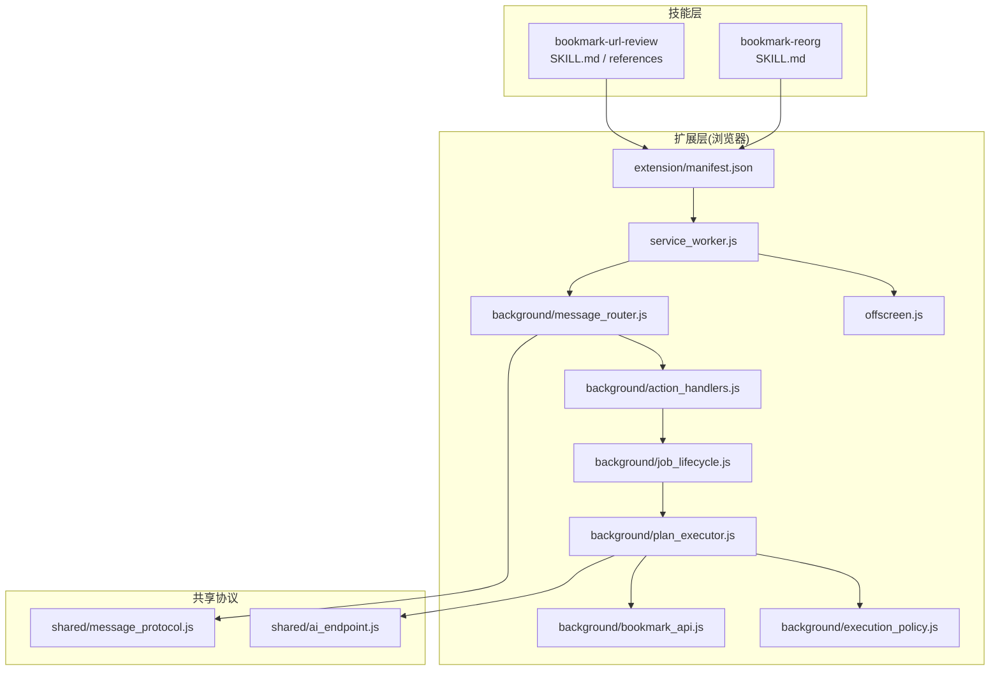
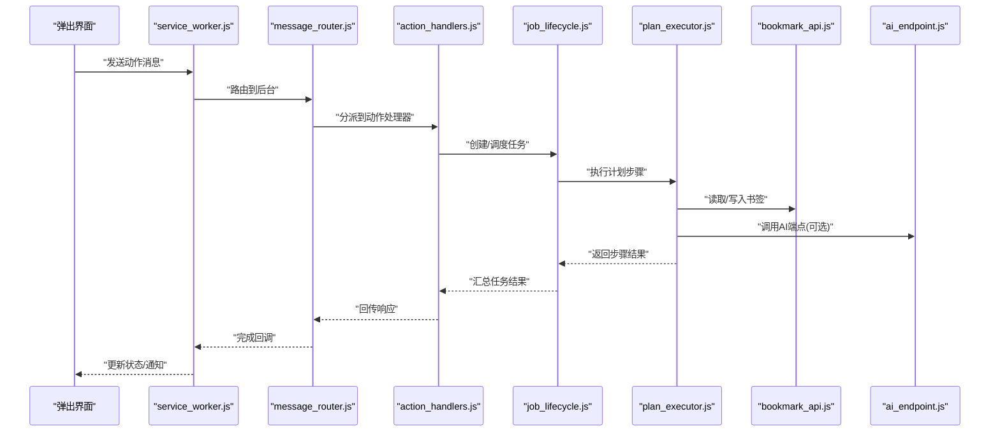
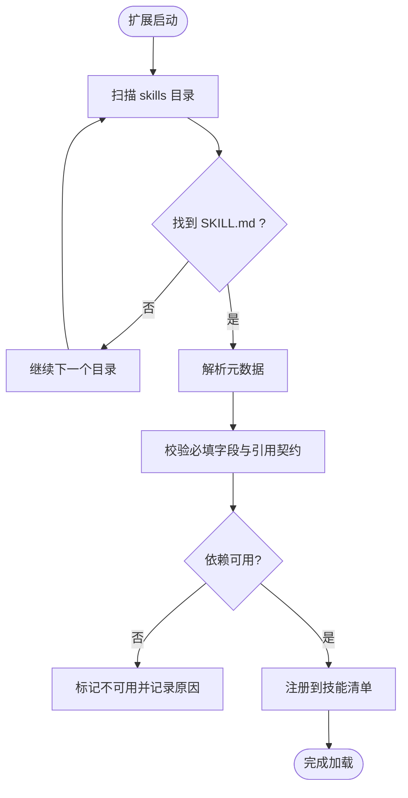
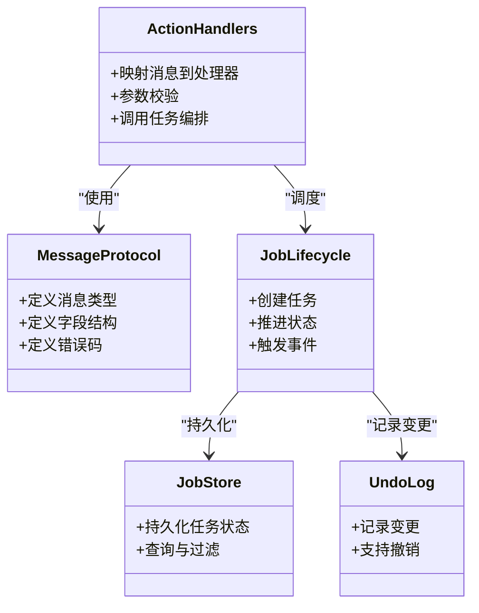
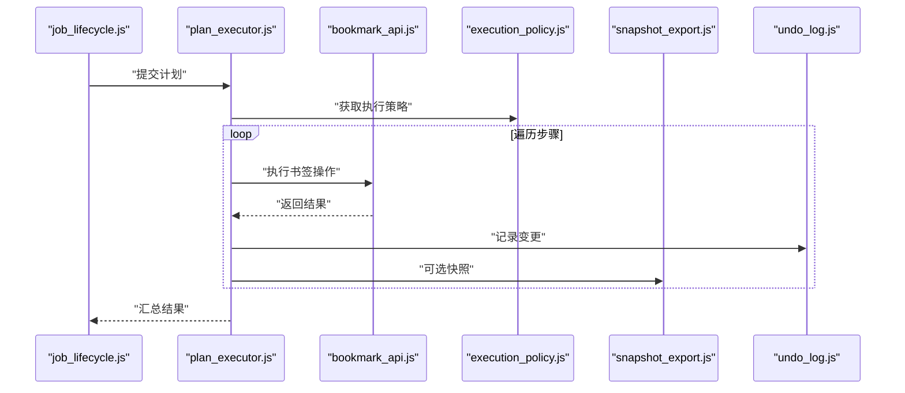
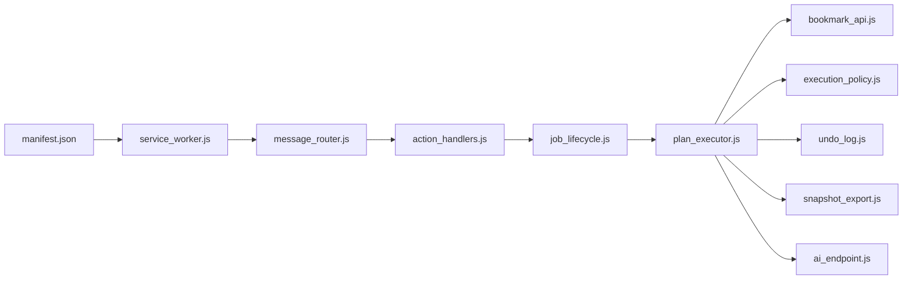

# 技能架构设计

<cite>
**本文引用的文件**   
- [SKILL.md](file://skills/bookmark-reorg/SKILL.md)
- [SKILL.md](file://skills/bookmark-url-review/SKILL.md)
- [review-contract.md](file://skills/bookmark-url-review/references/review-contract.md)
- [manifest.json](file://extension/manifest.json)
- [service_worker.js](file://extension/service_worker.js)
- [offscreen.js](file://extension/offscreen.js)
- [message_router.js](file://extension/background/message_router.js)
- [action_handlers.js](file://extension/background/action_handlers.js)
- [job_lifecycle.js](file://extension/background/job_lifecycle.js)
- [plan_executor.js](file://extension/background/plan_executor.js)
- [bookmark_api.js](file://extension/background/bookmark_api.js)
- [execution_policy.js](file://extension/background/execution_policy.js)
- [message_protocol.js](file://extension/shared/message_protocol.js)
- [ai_endpoint.js](file://extension/shared/ai_endpoint.js)
- [snapshot_export.js](file://extension/background/snapshot_export.js)
- [undo_log.js](file://extension/background/undo_log.js)
- [job_store.js](file://extension/background/job_store.js)
- [bookmark_tree.js](file://extension/background/bookmark_tree.js)
- [AGENTS.md](file://extension/AGENTS.md)
- [DESIGN.md](file://docs/design/DESIGN.md)
</cite>

## 目录
1. [引言](#引言)
2. [项目结构](#项目结构)
3. [核心组件](#核心组件)
4. [架构总览](#架构总览)
5. [详细组件分析](#详细组件分析)
6. [依赖关系分析](#依赖关系分析)
7. [性能考量](#性能考量)
8. [故障排查指南](#故障排查指南)
9. [结论](#结论)
10. [附录](#附录)

## 引言
本文件面向“技能”（Skill）体系的设计与实现，目标是提供一份可落地的架构文档。内容覆盖：
- 技能的目录结构与元数据规范
- 技能的发现、初始化与依赖解析流程
- 技能与核心系统的通信协议、事件处理与状态同步
- 安全模型：权限控制、沙箱隔离与资源限制
- 版本管理与兼容性策略
- 架构图与数据流图，以及最佳实践与设计模式示例

## 项目结构
仓库采用“前端扩展 + 后端脚本 + 技能包”的三层组织方式：
- skills：以目录为单位的技能包，每个技能包含 SKILL.md 描述与可选 references 等辅助材料
- extension：浏览器扩展侧，承载 UI、消息路由、任务编排与书签 API 访问
- src：Python 侧工具链（规划器、执行器、快照导出等），用于离线或批处理场景
- docs：设计与规范文档

图表来源
- [manifest.json](file://extension/manifest.json)
- [service_worker.js](file://extension/service_worker.js)
- [message_router.js](file://extension/background/message_router.js)
- [action_handlers.js](file://extension/background/action_handlers.js)
- [job_lifecycle.js](file://extension/background/job_lifecycle.js)
- [plan_executor.js](file://extension/background/plan_executor.js)
- [bookmark_api.js](file://extension/background/bookmark_api.js)
- [execution_policy.js](file://extension/background/execution_policy.js)
- [offscreen.js](file://extension/offscreen.js)
- [message_protocol.js](file://extension/shared/message_protocol.js)
- [ai_endpoint.js](file://extension/shared/ai_endpoint.js)
- [SKILL.md](file://skills/bookmark-reorg/SKILL.md)
- [SKILL.md](file://skills/bookmark-url-review/SKILL.md)
- [review-contract.md](file://skills/bookmark-url-review/references/review-contract.md)

章节来源
- [manifest.json](file://extension/manifest.json)
- [AGENTS.md](file://extension/AGENTS.md)
- [DESIGN.md](file://docs/design/DESIGN.md)

## 核心组件
- 技能定义与契约
  - 每个技能以目录为单位，根目录包含 SKILL.md 作为能力说明与使用契约；可选 references 存放参考契约或约束
- 扩展入口与注册
  - manifest.json 声明扩展能力与后台脚本；service_worker.js 负责启动与生命周期管理
- 消息路由与动作分发
  - message_router.js 统一接收并转发消息；action_handlers.js 将消息映射到具体动作处理器
- 任务编排与执行
  - job_lifecycle.js 管理任务生命周期；plan_executor.js 根据计划执行步骤；execution_policy.js 控制执行策略
- 数据与持久化
  - bookmark_api.js 封装书签读写；job_store.js 持久化任务状态；undo_log.js 记录撤销日志；snapshot_export.js 导出快照
- 外部服务与协议
  - ai_endpoint.js 提供 AI 端点访问；message_protocol.js 定义跨上下文消息格式

章节来源
- [SKILL.md](file://skills/bookmark-reorg/SKILL.md)
- [SKILL.md](file://skills/bookmark-url-review/SKILL.md)
- [review-contract.md](file://skills/bookmark-url-review/references/review-contract.md)
- [manifest.json](file://extension/manifest.json)
- [service_worker.js](file://extension/service_worker.js)
- [message_router.js](file://extension/background/message_router.js)
- [action_handlers.js](file://extension/background/action_handlers.js)
- [job_lifecycle.js](file://extension/background/job_lifecycle.js)
- [plan_executor.js](file://extension/background/plan_executor.js)
- [execution_policy.js](file://extension/background/execution_policy.js)
- [bookmark_api.js](file://extension/background/bookmark_api.js)
- [job_store.js](file://extension/background/job_store.js)
- [undo_log.js](file://extension/background/undo_log.js)
- [snapshot_export.js](file://extension/background/snapshot_export.js)
- [ai_endpoint.js](file://extension/shared/ai_endpoint.js)
- [message_protocol.js](file://extension/shared/message_protocol.js)

## 架构总览
系统由“技能包 + 扩展运行时 + 协议层”构成。技能通过约定式目录与元数据被识别，扩展在启动时扫描并加载；UI 与后台通过消息协议交互，任务按计划逐步执行，必要时调用书签 API 与外部 AI 端点。

图表来源
- [service_worker.js](file://extension/service_worker.js)
- [message_router.js](file://extension/background/message_router.js)
- [action_handlers.js](file://extension/background/action_handlers.js)
- [job_lifecycle.js](file://extension/background/job_lifecycle.js)
- [plan_executor.js](file://extension/background/plan_executor.js)
- [bookmark_api.js](file://extension/background/bookmark_api.js)
- [ai_endpoint.js](file://extension/shared/ai_endpoint.js)

## 详细组件分析

### 技能目录结构与元数据规范
- 目录规范
  - 每个技能一个目录，位于 skills 下
  - 必须包含 SKILL.md，描述技能用途、输入输出、前置条件与注意事项
  - 可选 references 目录存放契约、参考实现或约束说明
- 元数据要点
  - 名称、版本、作者、许可证
  - 能力边界与依赖项（如是否需要 AI 端点）
  - 与书签操作的关联范围（只读/读写）
  - 兼容性与升级策略说明

章节来源
- [SKILL.md](file://skills/bookmark-reorg/SKILL.md)
- [SKILL.md](file://skills/bookmark-url-review/SKILL.md)
- [review-contract.md](file://skills/bookmark-url-review/references/review-contract.md)

### 技能发现与加载机制
- 发现阶段
  - 扩展启动时扫描 skills 目录，收集所有包含 SKILL.md 的目录作为候选技能
- 初始化阶段
  - 解析 SKILL.md 中的元数据，构建技能清单
  - 校验必要字段与引用契约是否存在
- 依赖解析
  - 若技能声明依赖外部端点或特定权限，则在加载时进行可用性检查
  - 对不满足条件的技能标记为不可用并记录原因

图表来源
- [manifest.json](file://extension/manifest.json)
- [service_worker.js](file://extension/service_worker.js)
- [SKILL.md](file://skills/bookmark-reorg/SKILL.md)
- [SKILL.md](file://skills/bookmark-url-review/SKILL.md)
- [review-contract.md](file://skills/bookmark-url-review/references/review-contract.md)

章节来源
- [manifest.json](file://extension/manifest.json)
- [service_worker.js](file://extension/service_worker.js)
- [SKILL.md](file://skills/bookmark-reorg/SKILL.md)
- [SKILL.md](file://skills/bookmark-url-review/SKILL.md)
- [review-contract.md](file://skills/bookmark-url-review/references/review-contract.md)

### 与核心系统的通信协议
- 消息格式
  - 使用 shared/message_protocol.js 定义的统一消息类型与字段
  - 支持请求/响应、事件推送与错误码
- 事件处理
  - action_handlers.js 将消息映射到具体动作处理器
  - job_lifecycle.js 维护任务状态机，触发相应事件
- 状态同步
  - job_store.js 持久化任务状态，供 UI 与后台一致读取
  - undo_log.js 记录变更以便撤销与审计

图表来源
- [message_protocol.js](file://extension/shared/message_protocol.js)
- [action_handlers.js](file://extension/background/action_handlers.js)
- [job_lifecycle.js](file://extension/background/job_lifecycle.js)
- [job_store.js](file://extension/background/job_store.js)
- [undo_log.js](file://extension/background/undo_log.js)

章节来源
- [message_protocol.js](file://extension/shared/message_protocol.js)
- [action_handlers.js](file://extension/background/action_handlers.js)
- [job_lifecycle.js](file://extension/background/job_lifecycle.js)
- [job_store.js](file://extension/background/job_store.js)
- [undo_log.js](file://extension/background/undo_log.js)

### 任务编排与执行
- 计划执行
  - plan_executor.js 按步骤顺序执行，支持分支与重试
- 书签操作
  - bookmark_api.js 封装增删改查，确保事务性与一致性
- 执行策略
  - execution_policy.js 控制并发、超时与幂等性
- 快照与撤销
  - snapshot_export.js 导出当前书签快照
  - undo_log.js 记录原子变更，支持回滚

图表来源
- [job_lifecycle.js](file://extension/background/job_lifecycle.js)
- [plan_executor.js](file://extension/background/plan_executor.js)
- [bookmark_api.js](file://extension/background/bookmark_api.js)
- [execution_policy.js](file://extension/background/execution_policy.js)
- [snapshot_export.js](file://extension/background/snapshot_export.js)
- [undo_log.js](file://extension/background/undo_log.js)

章节来源
- [plan_executor.js](file://extension/background/plan_executor.js)
- [bookmark_api.js](file://extension/background/bookmark_api.js)
- [execution_policy.js](file://extension/background/execution_policy.js)
- [snapshot_export.js](file://extension/background/snapshot_export.js)
- [undo_log.js](file://extension/background/undo_log.js)

### 安全模型
- 权限控制
  - 通过 manifest.json 声明最小权限集，仅开放必要的书签与网络访问
- 沙箱隔离
  - offscreen.js 提供受限执行环境，限制 DOM 与全局对象访问
- 资源限制
  - execution_policy.js 设置并发上限、超时与内存阈值
- 审计与回溯
  - undo_log.js 与 snapshot_export.js 提供变更追踪与恢复能力

章节来源
- [manifest.json](file://extension/manifest.json)
- [offscreen.js](file://extension/offscreen.js)
- [execution_policy.js](file://extension/background/execution_policy.js)
- [undo_log.js](file://extension/background/undo_log.js)
- [snapshot_export.js](file://extension/background/snapshot_export.js)

### 版本管理与兼容性策略
- 版本标识
  - 在 SKILL.md 中声明版本号与变更日志
- 向后兼容
  - 新增字段需默认值，废弃字段保留过渡期
- 依赖约束
  - 明确最低兼容的扩展版本与外部端点版本
- 灰度发布
  - 通过执行策略与开关控制新特性启用范围

章节来源
- [SKILL.md](file://skills/bookmark-reorg/SKILL.md)
- [SKILL.md](file://skills/bookmark-url-review/SKILL.md)
- [execution_policy.js](file://extension/background/execution_policy.js)

### 最佳实践与设计模式
- 命令模式
  - 将书签操作封装为命令，便于撤销与重放
- 观察者模式
  - 任务状态变化通过事件通知 UI 与其他模块
- 工厂模式
  - 基于 SKILL.md 元数据动态创建处理器实例
- 策略模式
  - 通过 execution_policy.js 注入不同执行策略

章节来源
- [action_handlers.js](file://extension/background/action_handlers.js)
- [job_lifecycle.js](file://extension/background/job_lifecycle.js)
- [execution_policy.js](file://extension/background/execution_policy.js)
- [SKILL.md](file://skills/bookmark-reorg/SKILL.md)
- [SKILL.md](file://skills/bookmark-url-review/SKILL.md)

## 依赖关系分析
- 内部依赖
  - service_worker.js 依赖 message_router.js 与 action_handlers.js
  - action_handlers.js 依赖 job_lifecycle.js 与 message_protocol.js
  - plan_executor.js 依赖 bookmark_api.js、execution_policy.js、undo_log.js、snapshot_export.js
- 外部依赖
  - ai_endpoint.js 访问外部 AI 服务
  - manifest.json 声明浏览器 API 权限

图表来源
- [service_worker.js](file://extension/service_worker.js)
- [message_router.js](file://extension/background/message_router.js)
- [action_handlers.js](file://extension/background/action_handlers.js)
- [job_lifecycle.js](file://extension/background/job_lifecycle.js)
- [plan_executor.js](file://extension/background/plan_executor.js)
- [bookmark_api.js](file://extension/background/bookmark_api.js)
- [execution_policy.js](file://extension/background/execution_policy.js)
- [undo_log.js](file://extension/background/undo_log.js)
- [snapshot_export.js](file://extension/background/snapshot_export.js)
- [ai_endpoint.js](file://extension/shared/ai_endpoint.js)
- [manifest.json](file://extension/manifest.json)

章节来源
- [service_worker.js](file://extension/service_worker.js)
- [message_router.js](file://extension/background/message_router.js)
- [action_handlers.js](file://extension/background/action_handlers.js)
- [job_lifecycle.js](file://extension/background/job_lifecycle.js)
- [plan_executor.js](file://extension/background/plan_executor.js)
- [bookmark_api.js](file://extension/background/bookmark_api.js)
- [execution_policy.js](file://extension/background/execution_policy.js)
- [undo_log.js](file://extension/background/undo_log.js)
- [snapshot_export.js](file://extension/background/snapshot_export.js)
- [ai_endpoint.js](file://extension/shared/ai_endpoint.js)
- [manifest.json](file://extension/manifest.json)

## 性能考量
- 批量操作
  - 合并多次书签写入，减少 I/O 次数
- 异步与并发
  - 通过 execution_policy.js 控制并发度，避免阻塞主线程
- 缓存与去重
  - 对频繁读取的树结构使用 bookmark_tree.js 缓存
- 快照优化
  - 增量快照与压缩存储，降低磁盘占用

[本节为通用指导，无需列出具体文件来源]

## 故障排查指南
- 常见问题定位
  - 检查 manifest.json 权限是否缺失
  - 核对 message_protocol.js 的消息字段是否匹配
  - 查看 job_store.js 的任务状态与错误码
  - 确认 ai_endpoint.js 的网络可达性与鉴权
- 调试建议
  - 启用 undo_log.js 的变更记录，对比期望与实际差异
  - 使用 snapshot_export.js 导出前后快照进行比对
  - 在 action_handlers.js 增加日志输出，跟踪调用链

章节来源
- [manifest.json](file://extension/manifest.json)
- [message_protocol.js](file://extension/shared/message_protocol.js)
- [job_store.js](file://extension/background/job_store.js)
- [ai_endpoint.js](file://extension/shared/ai_endpoint.js)
- [undo_log.js](file://extension/background/undo_log.js)
- [snapshot_export.js](file://extension/background/snapshot_export.js)
- [action_handlers.js](file://extension/background/action_handlers.js)

## 结论
本架构以“技能即配置”的理念，通过约定式目录与元数据驱动技能发现与加载；以统一消息协议贯穿 UI、后台与外部服务；以任务编排与策略控制保障执行的可控性与可观测性。配合安全模型与版本策略，形成可扩展、可维护的技能生态。

[本节为总结性内容，无需列出具体文件来源]

## 附录
- 相关规范与背景
  - 扩展总体设计与约定见 DESIGN.md
  - 扩展侧开发约定见 AGENTS.md

章节来源
- [DESIGN.md](file://docs/design/DESIGN.md)
- [AGENTS.md](file://extension/AGENTS.md)