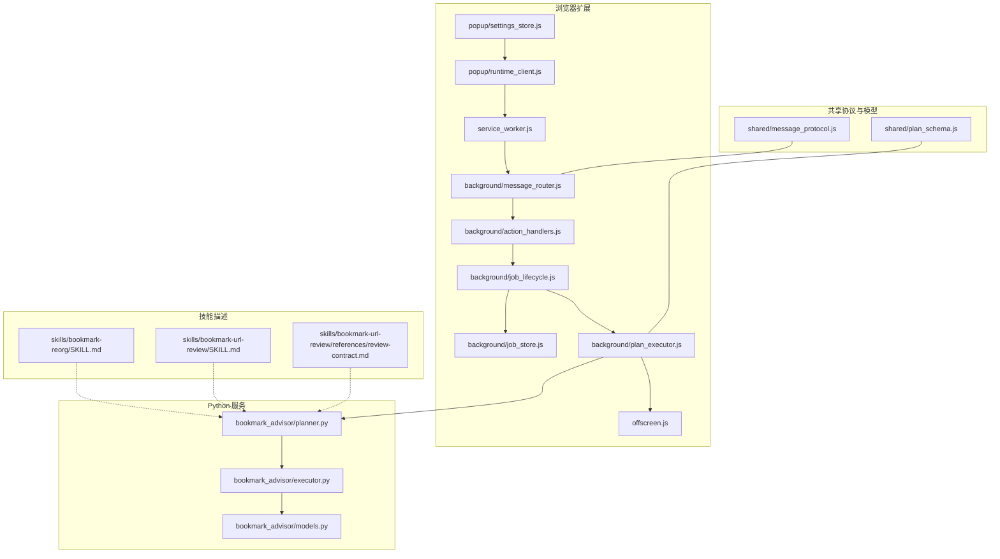
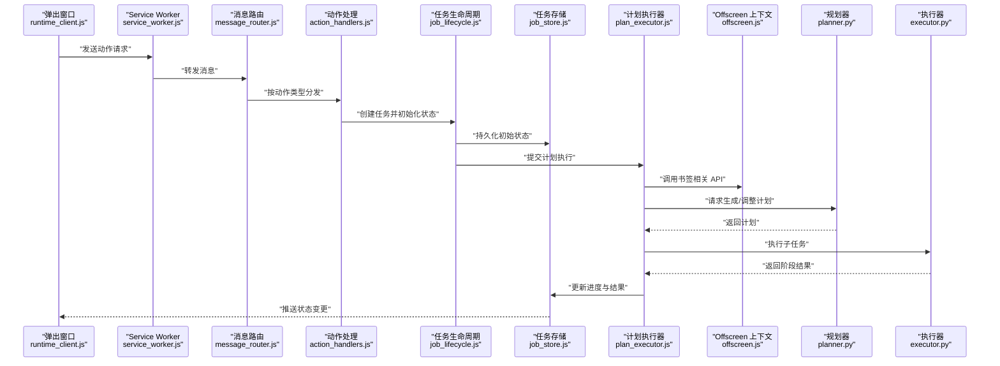
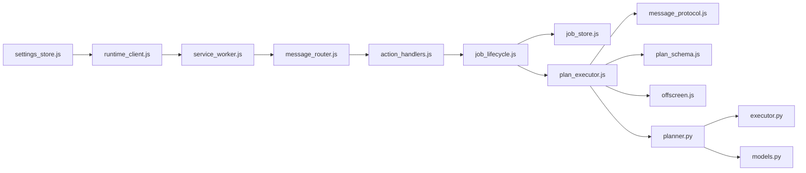
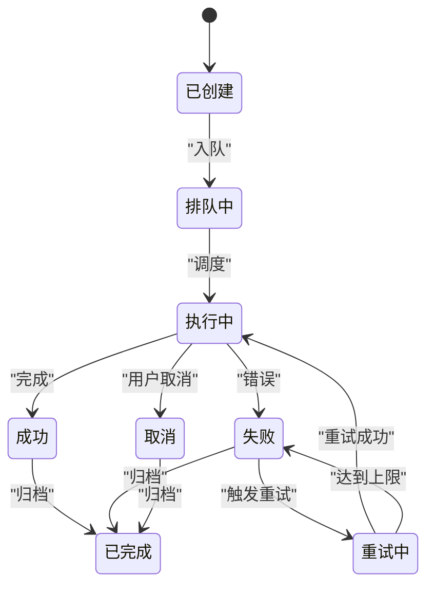

# 技能系统

<cite>
**本文引用的文件**   
- [skills/bookmark-reorg/SKILL.md](file://skills/bookmark-reorg/SKILL.md)
- [skills/bookmark-url-review/SKILL.md](file://skills/bookmark-url-review/SKILL.md)
- [skills/bookmark-url-review/references/review-contract.md](file://skills/bookmark-url-review/references/review-contract.md)
- [extension/manifest.json](file://extension/manifest.json)
- [extension/service_worker.js](file://extension/service_worker.js)
- [extension/offscreen.js](file://extension/offscreen.js)
- [extension/background/message_router.js](file://extension/background/message_router.js)
- [extension/background/action_handlers.js](file://extension/background/action_handlers.js)
- [extension/background/job_lifecycle.js](file://extension/background/job_lifecycle.js)
- [extension/background/job_store.js](file://extension/background/job_store.js)
- [extension/background/plan_executor.js](file://extension/background/plan_executor.js)
- [extension/shared/message_protocol.js](file://extension/shared/message_protocol.js)
- [extension/shared/plan_schema.js](file://extension/shared/plan_schema.js)
- [extension/popup/runtime_client.js](file://extension/popup/runtime_client.js)
- [extension/popup/settings_store.js](file://extension/popup/settings_store.js)
- [src/bookmark_advisor/planner.py](file://src/bookmark_advisor/planner.py)
- [src/bookmark_advisor/executor.py](file://src/bookmark_advisor/executor.py)
- [src/bookmark_advisor/models.py](file://src/bookmark_advisor/models.py)
- [pyproject.toml](file://pyproject.toml)
</cite>

## 目录
1. [简介](#简介)
2. [项目结构](#项目结构)
3. [核心组件](#核心组件)
4. [架构总览](#架构总览)
5. [详细组件分析](#详细组件分析)
6. [依赖关系分析](#依赖关系分析)
7. [性能考虑](#性能考虑)
8. [故障排查指南](#故障排查指南)
9. [结论](#结论)
10. [附录](#附录)

## 简介
本文件系统化阐述“技能系统”的设计与实现，覆盖技能生命周期、加载机制、通信协议、内置技能（书签重组、URL 审查）的实现要点、多代理协作机制、配置与定制方法、开发规范以及自定义技能从创建到部署的完整流程。文档同时提供最佳实践与性能优化建议，帮助读者快速理解并扩展该系统。

## 项目结构
技能系统由浏览器扩展侧（Extension）、后台任务执行侧（Background/Offscreen）、Python 服务端（bookmark_advisor）以及技能描述层（skills）组成。整体采用“声明式技能 + 运行时编排”的模式：技能以结构化描述定义能力边界与契约，运行时根据计划（Plan）进行任务分配、状态同步与结果聚合。

图表来源
- [extension/service_worker.js](file://extension/service_worker.js)
- [extension/background/message_router.js](file://extension/background/message_router.js)
- [extension/background/action_handlers.js](file://extension/background/action_handlers.js)
- [extension/background/job_lifecycle.js](file://extension/background/job_lifecycle.js)
- [extension/background/job_store.js](file://extension/background/job_store.js)
- [extension/background/plan_executor.js](file://extension/background/plan_executor.js)
- [extension/offscreen.js](file://extension/offscreen.js)
- [extension/popup/runtime_client.js](file://extension/popup/runtime_client.js)
- [extension/popup/settings_store.js](file://extension/popup/settings_store.js)
- [extension/shared/message_protocol.js](file://extension/shared/message_protocol.js)
- [extension/shared/plan_schema.js](file://extension/shared/plan_schema.js)
- [src/bookmark_advisor/planner.py](file://src/bookmark_advisor/planner.py)
- [src/bookmark_advisor/executor.py](file://src/bookmark_advisor/executor.py)
- [src/bookmark_advisor/models.py](file://src/bookmark_advisor/models.py)
- [skills/bookmark-reorg/SKILL.md](file://skills/bookmark-reorg/SKILL.md)
- [skills/bookmark-url-review/SKILL.md](file://skills/bookmark-url-review/SKILL.md)
- [skills/bookmark-url-review/references/review-contract.md](file://skills/bookmark-url-review/references/review-contract.md)

章节来源
- [extension/manifest.json](file://extension/manifest.json)
- [extension/service_worker.js](file://extension/service_worker.js)
- [extension/offscreen.js](file://extension/offscreen.js)
- [extension/background/message_router.js](file://extension/background/message_router.js)
- [extension/background/action_handlers.js](file://extension/background/action_handlers.js)
- [extension/background/job_lifecycle.js](file://extension/background/job_lifecycle.js)
- [extension/background/job_store.js](file://extension/background/job_store.js)
- [extension/background/plan_executor.js](file://extension/background/plan_executor.js)
- [extension/shared/message_protocol.js](file://extension/shared/message_protocol.js)
- [extension/shared/plan_schema.js](file://extension/shared/plan_schema.js)
- [src/bookmark_advisor/planner.py](file://src/bookmark_advisor/planner.py)
- [src/bookmark_advisor/executor.py](file://src/bookmark_advisor/executor.py)
- [src/bookmark_advisor/models.py](file://src/bookmark_advisor/models.py)
- [skills/bookmark-reorg/SKILL.md](file://skills/bookmark-reorg/SKILL.md)
- [skills/bookmark-url-review/SKILL.md](file://skills/bookmark-url-review/SKILL.md)
- [skills/bookmark-url-review/references/review-contract.md](file://skills/bookmark-url-review/references/review-contract.md)

## 核心组件
- 技能描述层（SKILL.md 与参考契约）：以人类可读的结构化文档定义技能的能力、输入输出、约束与行为约定，供规划器解析与校验。
- 消息路由与协议（message_protocol.js）：统一前后端与跨上下文的消息格式、事件命名与错误码，确保可扩展的通信契约。
- 计划模式（plan_schema.js）：对 Plan 的结构进行强类型约束，保证任务分解、参数传递与结果聚合的一致性。
- 任务编排（job_lifecycle.js, job_store.js, plan_executor.js）：负责任务的创建、持久化、调度、执行与状态机流转。
- 浏览器上下文桥接（offscreen.js）：在受限的 Offscreen 上下文中访问书签等敏感 API，并通过安全通道与主进程通信。
- Python 规划与执行（planner.py, executor.py, models.py）：将自然语言或高层意图转化为可执行的 Plan，并在服务端完成复杂计算与决策。
- 用户界面与设置（runtime_client.js, settings_store.js）：提供交互入口与配置管理，驱动技能运行与展示结果。

章节来源
- [extension/shared/message_protocol.js](file://extension/shared/message_protocol.js)
- [extension/shared/plan_schema.js](file://extension/shared/plan_schema.js)
- [extension/background/job_lifecycle.js](file://extension/background/job_lifecycle.js)
- [extension/background/job_store.js](file://extension/background/job_store.js)
- [extension/background/plan_executor.js](file://extension/background/plan_executor.js)
- [extension/offscreen.js](file://extension/offscreen.js)
- [src/bookmark_advisor/planner.py](file://src/bookmark_advisor/planner.py)
- [src/bookmark_advisor/executor.py](file://src/bookmark_advisor/executor.py)
- [src/bookmark_advisor/models.py](file://src/bookmark_advisor/models.py)
- [extension/popup/runtime_client.js](file://extension/popup/runtime_client.js)
- [extension/popup/settings_store.js](file://extension/popup/settings_store.js)

## 架构总览
技能系统的控制流遵循“UI 触发 → 路由分发 → 任务编排 → 计划生成 → 执行与回传 → 状态更新”的闭环。关键路径如下：
- 用户通过弹出窗口发起操作，runtime_client 构造请求并发送至 service_worker。
- message_router 按动作类型分派至 action_handlers，后者创建 Job 并交由 job_lifecycle 管理。
- plan_executor 依据 plan_schema 校验并协调 offscreen 与 Python 服务，完成计划执行。
- 所有中间状态与最终结果写入 job_store，UI 实时订阅并渲染。

图表来源
- [extension/popup/runtime_client.js](file://extension/popup/runtime_client.js)
- [extension/service_worker.js](file://extension/service_worker.js)
- [extension/background/message_router.js](file://extension/background/message_router.js)
- [extension/background/action_handlers.js](file://extension/background/action_handlers.js)
- [extension/background/job_lifecycle.js](file://extension/background/job_lifecycle.js)
- [extension/background/job_store.js](file://extension/background/job_store.js)
- [extension/background/plan_executor.js](file://extension/background/plan_executor.js)
- [extension/offscreen.js](file://extension/offscreen.js)
- [src/bookmark_advisor/planner.py](file://src/bookmark_advisor/planner.py)
- [src/bookmark_advisor/executor.py](file://src/bookmark_advisor/executor.py)

## 详细组件分析

### 技能描述与契约
- 书签重组技能（bookmark-reorg）：定义重组目标、分组策略、冲突处理与回滚策略，供规划器据此生成迁移计划。
- URL 审查技能（bookmark-url-review）：定义审查维度（如重复、失效、分类一致性）、证据收集方式与报告格式；其参考契约（review-contract.md）明确输入输出结构与校验规则。

章节来源
- [skills/bookmark-reorg/SKILL.md](file://skills/bookmark-reorg/SKILL.md)
- [skills/bookmark-url-review/SKILL.md](file://skills/bookmark-url-review/SKILL.md)
- [skills/bookmark-url-review/references/review-contract.md](file://skills/bookmark-url-review/references/review-contract.md)

### 消息协议与计划模式
- 消息协议（message_protocol.js）：定义消息类型、字段语义、错误码与重试策略，确保跨上下文通信的一致性与可观测性。
- 计划模式（plan_schema.js）：对 Plan 节点、参数、依赖关系与结果结构进行约束，保障执行器与规划器的契约稳定。

章节来源
- [extension/shared/message_protocol.js](file://extension/shared/message_protocol.js)
- [extension/shared/plan_schema.js](file://extension/shared/plan_schema.js)

### 任务生命周期与存储
- 任务生命周期（job_lifecycle.js）：维护任务状态机（创建、排队、执行中、成功、失败、取消），处理超时、重试与幂等。
- 任务存储（job_store.js）：提供持久化与查询接口，支持增量更新与快照导出，便于审计与恢复。

章节来源
- [extension/background/job_lifecycle.js](file://extension/background/job_lifecycle.js)
- [extension/background/job_store.js](file://extension/background/job_store.js)

### 计划执行器与 Offscreen 桥接
- 计划执行器（plan_executor.js）：解析 Plan，调度子任务，聚合阶段结果，并与 offscreen 和 Python 服务交互。
- Offscreen 桥接（offscreen.js）：封装书签树读取、批量修改等操作，限制权限范围并通过消息协议与主进程通信。

章节来源
- [extension/background/plan_executor.js](file://extension/background/plan_executor.js)
- [extension/offscreen.js](file://extension/offscreen.js)

### Python 规划与执行
- 规划器（planner.py）：基于技能描述与当前书签状态生成可执行计划，包含任务拆分、顺序与依赖。
- 执行器（executor.py）：在服务端执行具体步骤，产出中间产物与最终报告。
- 数据模型（models.py）：定义 Plan、Job、Result 等核心数据结构，贯穿前后端。

章节来源
- [src/bookmark_advisor/planner.py](file://src/bookmark_advisor/planner.py)
- [src/bookmark_advisor/executor.py](file://src/bookmark_advisor/executor.py)
- [src/bookmark_advisor/models.py](file://src/bookmark_advisor/models.py)

### 用户界面与设置
- 运行时客户端（runtime_client.js）：封装与 Service Worker 的交互，提供统一的调用方法与事件订阅。
- 设置存储（settings_store.js）：管理用户偏好、技能开关与默认参数，影响计划生成与执行策略。

章节来源
- [extension/popup/runtime_client.js](file://extension/popup/runtime_client.js)
- [extension/popup/settings_store.js](file://extension/popup/settings_store.js)

## 依赖关系分析
- 扩展侧内部耦合：
  - service_worker.js 作为入口，依赖 message_router.js 进行消息分发。
  - action_handlers.js 依赖 job_lifecycle.js 与 job_store.js 完成任务创建与持久化。
  - plan_executor.js 依赖 message_protocol.js 与 plan_schema.js 进行协议与模式校验。
  - offscreen.js 作为受控上下文，仅暴露必要 API，降低风险面。
- 跨进程与跨语言：
  - 前端通过 runtime_client.js 与服务端 planner.py/executor.py 交互，使用 models.py 定义的模型进行序列化。
- 外部依赖：
  - pyproject.toml 声明 Python 包依赖，确保规划与执行环境的稳定性。

图表来源
- [extension/service_worker.js](file://extension/service_worker.js)
- [extension/background/message_router.js](file://extension/background/message_router.js)
- [extension/background/action_handlers.js](file://extension/background/action_handlers.js)
- [extension/background/job_lifecycle.js](file://extension/background/job_lifecycle.js)
- [extension/background/job_store.js](file://extension/background/job_store.js)
- [extension/background/plan_executor.js](file://extension/background/plan_executor.js)
- [extension/shared/message_protocol.js](file://extension/shared/message_protocol.js)
- [extension/shared/plan_schema.js](file://extension/shared/plan_schema.js)
- [extension/offscreen.js](file://extension/offscreen.js)
- [extension/popup/runtime_client.js](file://extension/popup/runtime_client.js)
- [extension/popup/settings_store.js](file://extension/popup/settings_store.js)
- [src/bookmark_advisor/planner.py](file://src/bookmark_advisor/planner.py)
- [src/bookmark_advisor/executor.py](file://src/bookmark_advisor/executor.py)
- [src/bookmark_advisor/models.py](file://src/bookmark_advisor/models.py)

章节来源
- [pyproject.toml](file://pyproject.toml)

## 性能考虑
- 批处理与去重：在执行器中对批量操作进行合并与去重，减少 I/O 与浏览器 API 调用次数。
- 惰性加载与分页：对大规模书签树采用分页与懒加载，避免一次性载入导致卡顿。
- 异步与背压：通过消息队列与限流策略，防止高并发下内存与 CPU 峰值过高。
- 缓存与增量更新：对静态元数据与中间结果进行缓存，仅在必要时刷新。
- 失败重试与幂等：为网络与外部服务调用增加指数退避重试，并确保操作幂等以避免重复副作用。

[本节为通用指导，不直接分析具体文件]

## 故障排查指南
- 消息协议不一致：检查 message_protocol.js 中的消息类型与字段是否匹配，确认两端版本一致。
- 计划模式校验失败：核对 plan_schema.js 的约束与传入 Plan 结构，定位缺失或非法字段。
- 任务卡死或超时：查看 job_lifecycle.js 的状态机与超时策略，确认是否有未释放的资源或阻塞调用。
- Offscreen 权限问题：确认 offscreen.js 的权限声明与 manifest.json 的配置一致，避免访问受限 API。
- Python 服务异常：检查 planner.py 与 executor.py 的错误日志，结合 models.py 的数据结构验证序列化是否正确。

章节来源
- [extension/shared/message_protocol.js](file://extension/shared/message_protocol.js)
- [extension/shared/plan_schema.js](file://extension/shared/plan_schema.js)
- [extension/background/job_lifecycle.js](file://extension/background/job_lifecycle.js)
- [extension/offscreen.js](file://extension/offscreen.js)
- [extension/manifest.json](file://extension/manifest.json)
- [src/bookmark_advisor/planner.py](file://src/bookmark_advisor/planner.py)
- [src/bookmark_advisor/executor.py](file://src/bookmark_advisor/executor.py)
- [src/bookmark_advisor/models.py](file://src/bookmark_advisor/models.py)

## 结论
技能系统通过“声明式技能 + 运行时编排”的方式，实现了灵活、可扩展且可观测的任务处理能力。消息协议与计划模式保证了跨上下文与跨语言的契约稳定，任务生命周期与存储提供了可靠的执行保障。在此基础上，内置技能覆盖了常见的书签管理与审查场景，并为后续扩展提供了清晰的开发规范与最佳实践。

[本节为总结性内容，不直接分析具体文件]

## 附录

### 技能生命周期

[该图为概念性状态图，不映射具体源码文件]

### 自定义技能开发指南
- 目录结构
  - 在 skills 目录下新建技能文件夹，包含 SKILL.md 与可选 references 目录存放契约与参考材料。
- 元数据定义
  - 在 SKILL.md 中描述技能名称、版本、输入输出、约束、错误处理与示例。
- 接口契约
  - 若需要新的消息类型或计划节点，先在 message_protocol.js 与 plan_schema.js 中扩展，保持向后兼容。
- 行为调整与扩展点
  - 通过 settings_store.js 暴露用户可配置项，影响 planner.py 的策略与 executor.py 的执行细节。
- 测试与验证
  - 编写单元测试覆盖协议与模式校验，集成测试验证端到端流程。
- 部署流程
  - 更新 extension/manifest.json 的权限与背景脚本，确保 offscreen.js 可用；发布前进行回归测试与性能基准。

章节来源
- [skills/bookmark-reorg/SKILL.md](file://skills/bookmark-reorg/SKILL.md)
- [skills/bookmark-url-review/SKILL.md](file://skills/bookmark-url-review/SKILL.md)
- [skills/bookmark-url-review/references/review-contract.md](file://skills/bookmark-url-review/references/review-contract.md)
- [extension/shared/message_protocol.js](file://extension/shared/message_protocol.js)
- [extension/shared/plan_schema.js](file://extension/shared/plan_schema.js)
- [extension/popup/settings_store.js](file://extension/popup/settings_store.js)
- [extension/manifest.json](file://extension/manifest.json)

### 内置技能使用方法
- 书签重组技能
  - 在弹出窗口选择“书签重组”，设置分组策略与冲突处理方式，预览计划后执行。
- URL 审查技能
  - 在弹出窗口选择“URL 审查”，选择审查维度与范围，生成报告并导出结果。

章节来源
- [skills/bookmark-reorg/SKILL.md](file://skills/bookmark-reorg/SKILL.md)
- [skills/bookmark-url-review/SKILL.md](file://skills/bookmark-url-review/SKILL.md)

### 多代理协作机制
- 任务分配：planner.py 将高层意图拆分为子任务，标注依赖与优先级。
- 状态同步：job_store.js 提供增量更新，UI 实时订阅状态变化。
- 结果聚合：plan_executor.js 汇总各子任务结果，形成最终报告或变更集。

章节来源
- [src/bookmark_advisor/planner.py](file://src/bookmark_advisor/planner.py)
- [extension/background/job_store.js](file://extension/background/job_store.js)
- [extension/background/plan_executor.js](file://extension/background/plan_executor.js)