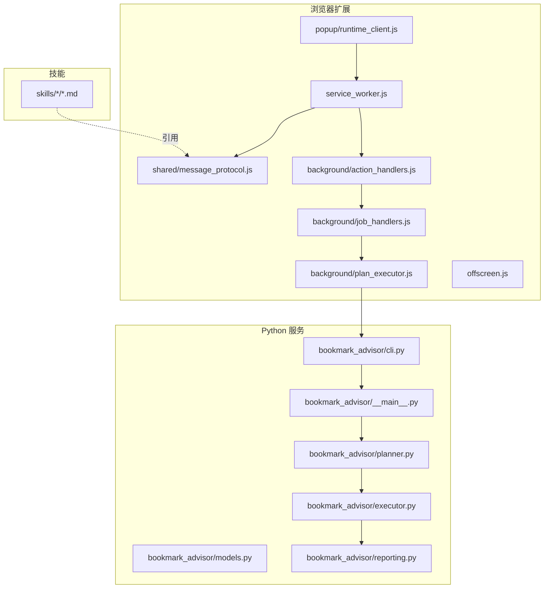
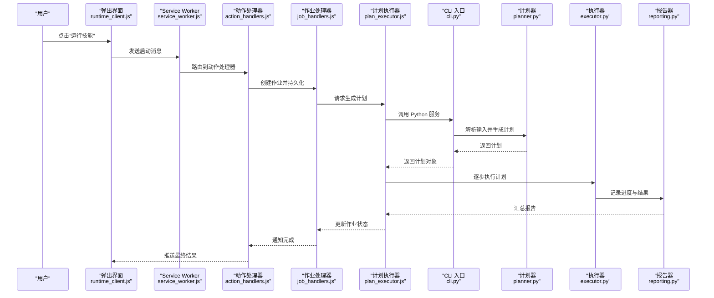
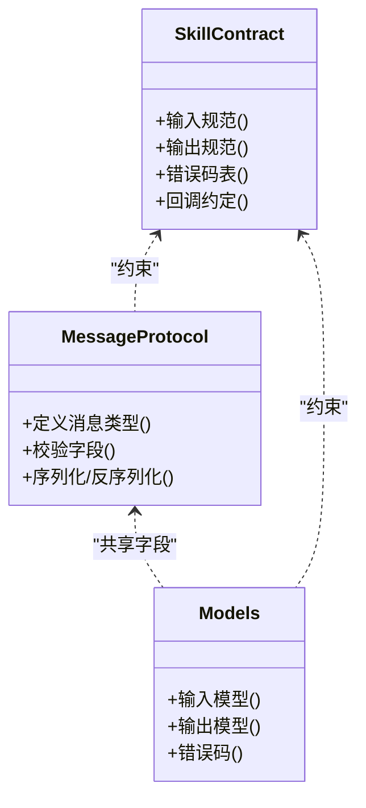
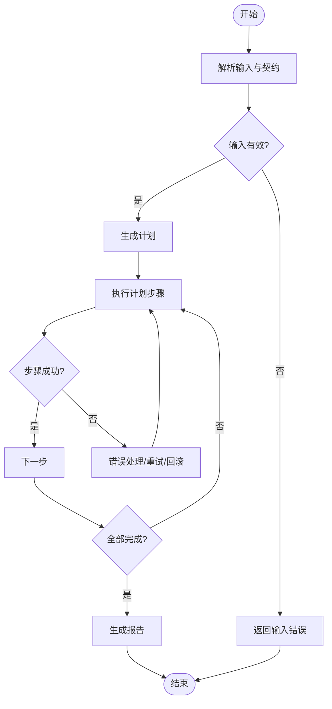
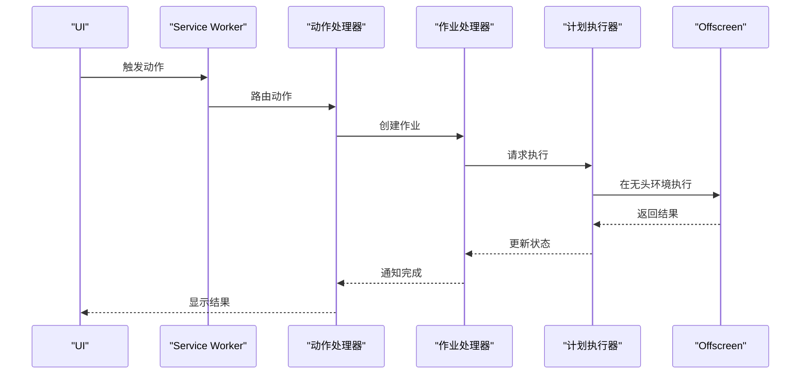
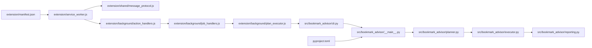

# 自定义技能开发

<cite>
**本文引用的文件**   
- [README.md](file://README.md)
- [AGENTS.md](file://AGENTS.md)
- [CLAUDE.md](file://CLAUDE.md)
- [pyproject.toml](file://pyproject.toml)
- [extension/manifest.json](file://extension/manifest.json)
- [extension/service_worker.js](file://extension/service_worker.js)
- [extension/offscreen.html](file://extension/offscreen.html)
- [extension/offscreen.js](file://extension/offscreen.js)
- [extension/shared/message_protocol.js](file://extension/shared/message_protocol.js)
- [extension/background/action_handlers.js](file://extension/background/action_handlers.js)
- [extension/background/job_handlers.js](file://extension/background/job_handlers.js)
- [extension/background/plan_executor.js](file://extension/background/plan_executor.js)
- [extension/popup/runtime_client.js](file://extension/popup/runtime_client.js)
- [skills/bookmark-url-review/SKILL.md](file://skills/bookmark-url-review/SKILL.md)
- [skills/bookmark-url-review/references/review-contract.md](file://skills/bookmark-url-review/references/review-contract.md)
- [src/bookmark_advisor/__main__.py](file://src/bookmark_advisor/__main__.py)
- [src/bookmark_advisor/cli.py](file://src/bookmark_advisor/cli.py)
- [src/bookmark_advisor/models.py](file://src/bookmark_advisor/models.py)
- [src/bookmark_advisor/planner.py](file://src/bookmark_advisor/planner.py)
- [src/bookmark_advisor/executor.py](file://src/bookmark_advisor/executor.py)
- [src/bookmark_advisor/reporting.py](file://src/bookmark_advisor/reporting.py)
- [tests/test_extension_shared_contracts.py](file://tests/test_extension_shared_contracts.py)
- [tests/test_planner.py](file://tests/test_planner.py)
- [tests/test_reorg_job.py](file://tests/test_reorg_job.py)
</cite>

## 目录
1. [简介](#简介)
2. [项目结构](#项目结构)
3. [核心组件](#核心组件)
4. [架构总览](#架构总览)
5. [详细组件分析](#详细组件分析)
6. [依赖分析](#依赖分析)
7. [性能考虑](#性能考虑)
8. [故障排查指南](#故障排查指南)
9. [结论](#结论)
10. [附录](#附录)

## 简介
本指南面向希望在本仓库中创建“自定义技能”的开发者，目标是提供从技能目录搭建、元数据定义、接口契约约定、核心逻辑实现到测试、打包分发与发布社区的全流程说明。本项目采用浏览器扩展（Manifest V3）作为前端交互与消息路由层，Python 服务作为计划生成与执行后端，技能以“声明式文档 + 参考契约”的方式组织在 skills 目录下，并通过扩展与服务之间的协议进行协作。

## 项目结构
- 浏览器扩展侧：负责 UI、消息路由、任务调度以及与 Python 后端的通信。
- Python 服务侧：负责解析输入、生成可执行计划、执行动作并输出报告。
- 技能目录：每个技能一个子目录，包含 SKILL.md 描述与 references 中的契约或参考材料。
- 测试：覆盖扩展协议、计划器、执行器及关键业务路径。

图表来源
- [extension/service_worker.js](file://extension/service_worker.js)
- [extension/shared/message_protocol.js](file://extension/shared/message_protocol.js)
- [extension/background/action_handlers.js](file://extension/background/action_handlers.js)
- [extension/background/job_handlers.js](file://extension/background/job_handlers.js)
- [extension/background/plan_executor.js](file://extension/background/plan_executor.js)
- [extension/popup/runtime_client.js](file://extension/popup/runtime_client.js)
- [extension/offscreen.js](file://extension/offscreen.js)
- [src/bookmark_advisor/cli.py](file://src/bookmark_advisor/cli.py)
- [src/bookmark_advisor/__main__.py](file://src/bookmark_advisor/__main__.py)
- [src/bookmark_advisor/planner.py](file://src/bookmark_advisor/planner.py)
- [src/bookmark_advisor/executor.py](file://src/bookmark_advisor/executor.py)
- [src/bookmark_advisor/models.py](file://src/bookmark_advisor/models.py)
- [src/bookmark_advisor/reporting.py](file://src/bookmark_advisor/reporting.py)
- [skills/bookmark-url-review/SKILL.md](file://skills/bookmark-url-review/SKILL.md)

章节来源
- [README.md](file://README.md)
- [AGENTS.md](file://AGENTS.md)
- [CLAUDE.md](file://CLAUDE.md)

## 核心组件
- 扩展入口与消息协议
  - service_worker.js：注册事件、转发消息、协调 offscreen 页面。
  - message_protocol.js：定义扩展内部消息类型、字段与校验规则。
  - action_handlers.js / job_handlers.js：处理用户操作与作业生命周期。
  - plan_executor.js：将高层计划转换为具体动作序列并驱动执行。
  - runtime_client.js：弹出窗口与后台通信的客户端封装。
  - offscreen.js：在无头环境中运行长耗时任务。
- Python 服务
  - cli.py / __main__.py：命令行入口与参数解析。
  - models.py：输入/输出数据模型与约束。
  - planner.py：根据输入与技能契约生成计划。
  - executor.py：按步骤执行计划，调用外部能力并收集结果。
  - reporting.py：汇总执行结果与错误信息。
- 技能
  - skills/<name>/SKILL.md：技能的用途、输入输出、使用方式与注意事项。
  - skills/<name>/references/*：契约、参考规范等辅助材料。

章节来源
- [extension/service_worker.js](file://extension/service_worker.js)
- [extension/shared/message_protocol.js](file://extension/shared/message_protocol.js)
- [extension/background/action_handlers.js](file://extension/background/action_handlers.js)
- [extension/background/job_handlers.js](file://extension/background/job_handlers.js)
- [extension/background/plan_executor.js](file://extension/background/plan_executor.js)
- [extension/popup/runtime_client.js](file://extension/popup/runtime_client.js)
- [extension/offscreen.js](file://extension/offscreen.js)
- [src/bookmark_advisor/cli.py](file://src/bookmark_advisor/cli.py)
- [src/bookmark_advisor/__main__.py](file://src/bookmark_advisor/__main__.py)
- [src/bookmark_advisor/models.py](file://src/bookmark_advisor/models.py)
- [src/bookmark_advisor/planner.py](file://src/bookmark_advisor/planner.py)
- [src/bookmark_advisor/executor.py](file://src/bookmark_advisor/executor.py)
- [src/bookmark_advisor/reporting.py](file://src/bookmark_advisor/reporting.py)
- [skills/bookmark-url-review/SKILL.md](file://skills/bookmark-url-review/SKILL.md)

## 架构总览
下图展示了从用户触发到计划生成、执行与反馈的端到端流程，以及技能契约如何影响计划与执行。

图表来源
- [extension/popup/runtime_client.js](file://extension/popup/runtime_client.js)
- [extension/service_worker.js](file://extension/service_worker.js)
- [extension/background/action_handlers.js](file://extension/background/action_handlers.js)
- [extension/background/job_handlers.js](file://extension/background/job_handlers.js)
- [extension/background/plan_executor.js](file://extension/background/plan_executor.js)
- [src/bookmark_advisor/cli.py](file://src/bookmark_advisor/cli.py)
- [src/bookmark_advisor/planner.py](file://src/bookmark_advisor/planner.py)
- [src/bookmark_advisor/executor.py](file://src/bookmark_advisor/executor.py)
- [src/bookmark_advisor/reporting.py](file://src/bookmark_advisor/reporting.py)

## 详细组件分析

### 技能目录与元数据
- 目录结构建议
  - skills/<skill-name>/SKILL.md：描述技能目标、输入输出、前置条件、使用示例与注意事项。
  - skills/<skill-name>/references/*：存放契约、参考规范、样例数据等。
- 元数据要点
  - 明确输入字段、必填项、取值范围与语义。
  - 明确输出结构、成功/失败分支与错误码。
  - 标注回调机制（如异步作业的状态轮询或事件推送）。
- 参考契约
  - 通过 references 下的契约文件定义跨模块一致的数据结构与行为约定。

章节来源
- [skills/bookmark-url-review/SKILL.md](file://skills/bookmark-url-review/SKILL.md)
- [skills/bookmark-url-review/references/review-contract.md](file://skills/bookmark-url-review/references/review-contract.md)

### 消息协议与接口契约
- 消息类型与字段
  - 统一在 message_protocol.js 中定义消息类型、字段名、是否必填与校验规则。
  - 所有跨进程通信必须遵循该协议，避免前后端不一致。
- 输入输出规范
  - 输入：由 SKILL.md 与 models.py 共同约束；扩展侧负责基础校验，Python 侧做严格校验。
  - 输出：结构化响应，包含状态码、消息、数据体与可选的错误详情。
- 错误码定义
  - 建议在 SKILL.md 与 references 中列出错误码表，并在 models.py 中映射为枚举或常量。
- 回调机制
  - 对于长耗时任务，采用作业 ID + 状态查询或事件推送模式，确保 UI 可感知进度与结果。

图表来源
- [extension/shared/message_protocol.js](file://extension/shared/message_protocol.js)
- [src/bookmark_advisor/models.py](file://src/bookmark_advisor/models.py)
- [skills/bookmark-url-review/references/review-contract.md](file://skills/bookmark-url-review/references/review-contract.md)

章节来源
- [extension/shared/message_protocol.js](file://extension/shared/message_protocol.js)
- [src/bookmark_advisor/models.py](file://src/bookmark_advisor/models.py)
- [skills/bookmark-url-review/references/review-contract.md](file://skills/bookmark-url-review/references/review-contract.md)

### 计划生成与执行
- 计划生成
  - planner.py 依据输入与技能契约生成可执行计划，包括步骤顺序、依赖关系与回滚策略。
- 执行引擎
  - executor.py 按步骤执行计划，支持重试、超时、幂等与部分失败恢复。
- 报告与日志
  - reporting.py 聚合执行结果、错误堆栈与审计日志，供 UI 展示与问题定位。

图表来源
- [src/bookmark_advisor/planner.py](file://src/bookmark_advisor/planner.py)
- [src/bookmark_advisor/executor.py](file://src/bookmark_advisor/executor.py)
- [src/bookmark_advisor/reporting.py](file://src/bookmark_advisor/reporting.py)

章节来源
- [src/bookmark_advisor/planner.py](file://src/bookmark_advisor/planner.py)
- [src/bookmark_advisor/executor.py](file://src/bookmark_advisor/executor.py)
- [src/bookmark_advisor/reporting.py](file://src/bookmark_advisor/reporting.py)

### 扩展侧工作流
- Service Worker 与 Offscreen
  - service_worker.js 负责事件注册与消息转发；offscreen.js 承载无头环境中的长任务。
- 动作与作业
  - action_handlers.js 接收 UI 动作，job_handlers.js 管理作业生命周期（创建、执行、完成、清理）。
- 计划执行器
  - plan_executor.js 将计划转为动作序列，驱动执行并与 Python 服务交互。

图表来源
- [extension/service_worker.js](file://extension/service_worker.js)
- [extension/offscreen.js](file://extension/offscreen.js)
- [extension/background/action_handlers.js](file://extension/background/action_handlers.js)
- [extension/background/job_handlers.js](file://extension/background/job_handlers.js)
- [extension/background/plan_executor.js](file://extension/background/plan_executor.js)

章节来源
- [extension/service_worker.js](file://extension/service_worker.js)
- [extension/offscreen.js](file://extension/offscreen.js)
- [extension/background/action_handlers.js](file://extension/background/action_handlers.js)
- [extension/background/job_handlers.js](file://extension/background/job_handlers.js)
- [extension/background/plan_executor.js](file://extension/background/plan_executor.js)

### 常见技能功能模板
- 模板清单
  - 目录：skills/<your-skill>/SKILL.md 与 references/*
  - 契约：输入/输出模型、错误码、回调约定
  - 扩展：消息协议适配、作业生命周期、UI 展示
  - 后端：模型定义、计划生成、执行与报告
- 示例参考
  - 书签 URL 审查技能：查看其 SKILL.md 与 review-contract.md 了解契约写法与字段约定。
  - 书签重组技能：参考其 SKILL.md 了解任务编排与注意事项。

章节来源
- [skills/bookmark-url-review/SKILL.md](file://skills/bookmark-url-review/SKILL.md)
- [skills/bookmark-url-review/references/review-contract.md](file://skills/bookmark-url-review/references/review-contract.md)
- [skills/bookmark-reorg/SKILL.md](file://skills/bookmark-reorg/SKILL.md)

## 依赖分析
- 扩展依赖
  - manifest.json：声明权限、脚本与页面资源。
  - service_worker.js：主入口，注册事件与路由。
  - offscreen.html / offscreen.js：无头执行环境。
- Python 依赖
  - pyproject.toml：声明包元数据、依赖与可执行入口。
  - __main__.py / cli.py：命令行入口与参数解析。
- 测试依赖
  - tests/*：覆盖协议一致性、计划器、执行器与作业流程。

图表来源
- [extension/manifest.json](file://extension/manifest.json)
- [extension/service_worker.js](file://extension/service_worker.js)
- [extension/shared/message_protocol.js](file://extension/shared/message_protocol.js)
- [extension/background/action_handlers.js](file://extension/background/action_handlers.js)
- [extension/background/job_handlers.js](file://extension/background/job_handlers.js)
- [extension/background/plan_executor.js](file://extension/background/plan_executor.js)
- [src/bookmark_advisor/cli.py](file://src/bookmark_advisor/cli.py)
- [src/bookmark_advisor/__main__.py](file://src/bookmark_advisor/__main__.py)
- [src/bookmark_advisor/planner.py](file://src/bookmark_advisor/planner.py)
- [src/bookmark_advisor/executor.py](file://src/bookmark_advisor/executor.py)
- [src/bookmark_advisor/reporting.py](file://src/bookmark_advisor/reporting.py)
- [pyproject.toml](file://pyproject.toml)

章节来源
- [extension/manifest.json](file://extension/manifest.json)
- [pyproject.toml](file://pyproject.toml)

## 性能考虑
- 消息体积控制：尽量精简 payload，避免大对象频繁传输。
- 批处理与去重：对重复或批量操作进行合并，减少执行次数。
- 异步与无头执行：长任务放入 offscreen 环境，避免阻塞 UI。
- 缓存与增量：对只读数据建立缓存，仅拉取变更部分。
- 错误快速失败：尽早校验输入与权限，缩短失败路径。

## 故障排查指南
- 常见问题
  - 消息协议不一致：检查 message_protocol.js 与 models.py 字段对齐。
  - 计划生成失败：核对 SKILL.md 与 references 契约，确认输入合法性。
  - 执行中断：查看 reporting.py 输出的错误信息与步骤状态。
  - 作业状态不同步：确认 job_handlers.js 与 plan_executor.js 的状态流转。
- 调试技巧
  - 在扩展侧打印消息收发与状态变化。
  - 在 Python 侧增加详细日志，记录输入、计划与每步执行结果。
  - 使用最小复现用例与固定输入数据进行回归验证。

章节来源
- [extension/shared/message_protocol.js](file://extension/shared/message_protocol.js)
- [src/bookmark_advisor/models.py](file://src/bookmark_advisor/models.py)
- [src/bookmark_advisor/reporting.py](file://src/bookmark_advisor/reporting.py)
- [extension/background/job_handlers.js](file://extension/background/job_handlers.js)
- [extension/background/plan_executor.js](file://extension/background/plan_executor.js)

## 结论
通过统一的协议与契约、清晰的职责划分与完善的测试体系，本仓库为“自定义技能”的开发提供了稳定可扩展的基础。按照本指南搭建目录、编写元数据与契约、实现计划与执行逻辑，并配合测试与调试手段，即可高效交付高质量技能。

## 附录

### 技能开发清单
- 目录与元数据
  - 创建 skills/<skill-name>/SKILL.md，明确目标、输入输出、错误码与回调。
  - 在 references 下维护契约与参考材料。
- 接口契约
  - 在 message_protocol.js 中新增或复用消息类型。
  - 在 models.py 中定义输入输出模型与错误码。
- 核心逻辑
  - 在 planner.py 中实现计划生成。
  - 在 executor.py 中实现步骤执行与容错。
  - 在 reporting.py 中输出结构化报告。
- 扩展集成
  - 在 action_handlers.js / job_handlers.js 中接入新技能。
  - 在 plan_executor.js 中适配新计划的执行。
  - 在 popup 中提供用户交互入口。
- 测试
  - 单元测试：针对模型、计划器与执行器。
  - 集成测试：覆盖消息协议、作业生命周期与端到端流程。
  - 模拟环境：使用 offscreen 环境与固定输入数据。
- 打包与分发
  - 使用 pyproject.toml 管理依赖与版本。
  - 构建扩展包与 Python 包，发布至内部仓库或社区。
- 安全与合规
  - 最小权限原则：仅在 manifest.json 声明必要权限。
  - 输入校验与白名单：防止注入与越权访问。
  - 敏感信息保护：避免在日志与报告中泄露密钥。

章节来源
- [extension/shared/message_protocol.js](file://extension/shared/message_protocol.js)
- [src/bookmark_advisor/models.py](file://src/bookmark_advisor/models.py)
- [src/bookmark_advisor/planner.py](file://src/bookmark_advisor/planner.py)
- [src/bookmark_advisor/executor.py](file://src/bookmark_advisor/executor.py)
- [src/bookmark_advisor/reporting.py](file://src/bookmark_advisor/reporting.py)
- [extension/background/action_handlers.js](file://extension/background/action_handlers.js)
- [extension/background/job_handlers.js](file://extension/background/job_handlers.js)
- [extension/background/plan_executor.js](file://extension/background/plan_executor.js)
- [extension/manifest.json](file://extension/manifest.json)
- [pyproject.toml](file://pyproject.toml)

### 测试方法与示例
- 单元测试
  - 协议一致性：test_extension_shared_contracts.py
  - 计划器：test_planner.py
  - 作业执行：test_reorg_job.py
- 集成测试
  - 端到端流程：从 UI 触发到 Python 服务执行与结果回传。
- 模拟环境
  - 使用 offscreen.js 承载无头执行，隔离外部依赖。

章节来源
- [tests/test_extension_shared_contracts.py](file://tests/test_extension_shared_contracts.py)
- [tests/test_planner.py](file://tests/test_planner.py)
- [tests/test_reorg_job.py](file://tests/test_reorg_job.py)
- [extension/offscreen.js](file://extension/offscreen.js)