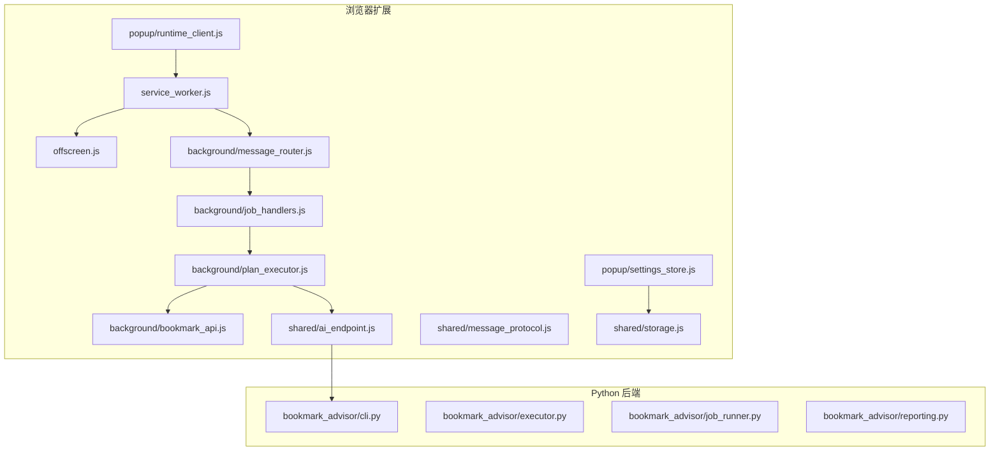
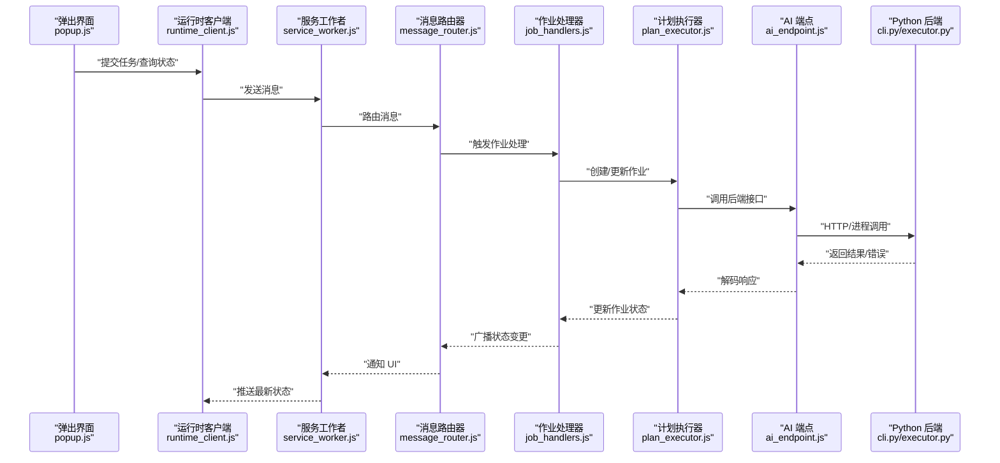
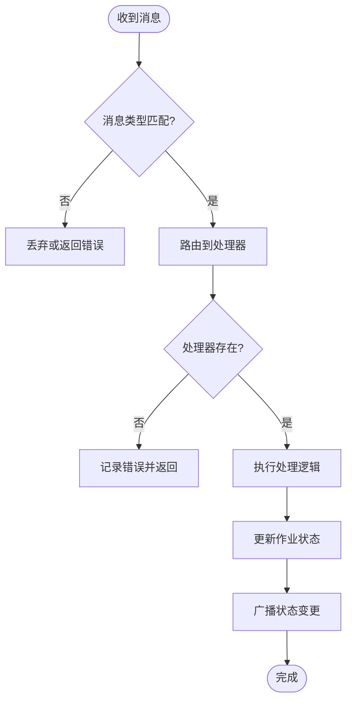
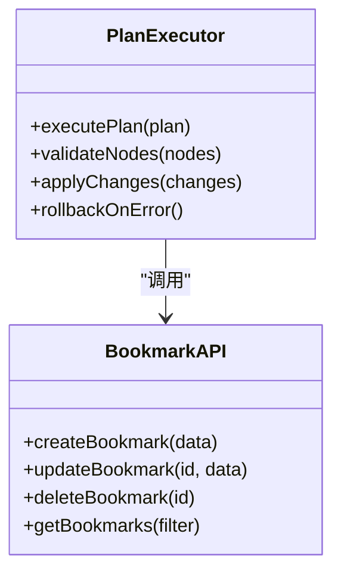
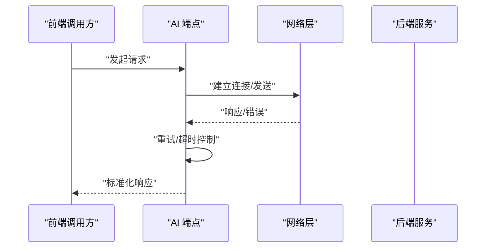

# 故障排除

<cite>
**本文引用的文件**   
- [README.md](file://README.md)
- [manifest.json](file://extension/manifest.json)
- [service_worker.js](file://extension/service_worker.js)
- [offscreen.js](file://extension/offscreen.js)
- [message_router.js](file://extension/background/message_router.js)
- [job_handlers.js](file://extension/background/job_handlers.js)
- [plan_executor.js](file://extension/background/plan_executor.js)
- [bookmark_api.js](file://extension/background/bookmark_api.js)
- [ai_endpoint.js](file://extension/shared/ai_endpoint.js)
- [message_protocol.js](file://extension/shared/message_protocol.js)
- [storage.js](file://extension/shared/storage.js)
- [settings_store.js](file://extension/popup/settings_store.js)
- [runtime_client.js](file://extension/popup/runtime_client.js)
- [cli.py](file://src/bookmark_advisor/cli.py)
- [executor.py](file://src/bookmark_advisor/executor.py)
- [job_runner.py](file://src/bookmark_advisor/job_runner.py)
- [reporting.py](file://src/bookmark_advisor/reporting.py)
- [pyproject.toml](file://pyproject.toml)
</cite>

## 目录
1. [简介](#简介)
2. [项目结构](#项目结构)
3. [核心组件](#核心组件)
4. [架构总览](#架构总览)
5. [详细组件分析](#详细组件分析)
6. [依赖分析](#依赖分析)
7. [性能考虑](#性能考虑)
8. [故障排除指南](#故障排除指南)
9. [结论](#结论)
10. [附录](#附录)

## 简介
本指南面向书签管理扩展与后端服务的用户与维护者，聚焦安装、配置、运行时异常、调试技巧、性能诊断、多代理协作问题与健康检查等常见场景。文档以仓库实际实现为依据，提供可操作的排障步骤、错误码参考与可视化流程图，帮助快速定位并解决问题。

## 项目结构
本项目由浏览器扩展（Chrome/Edge）与 Python 后端服务组成：
- 扩展侧负责 UI、消息路由、任务编排、与后端通信及本地存储
- 后端侧提供 CLI、执行器、作业运行器与报告能力
- 共享协议与端点定义在 shared 目录中

图表来源
- [service_worker.js](file://extension/service_worker.js)
- [offscreen.js](file://extension/offscreen.js)
- [message_router.js](file://extension/background/message_router.js)
- [job_handlers.js](file://extension/background/job_handlers.js)
- [plan_executor.js](file://extension/background/plan_executor.js)
- [bookmark_api.js](file://extension/background/bookmark_api.js)
- [ai_endpoint.js](file://extension/shared/ai_endpoint.js)
- [message_protocol.js](file://extension/shared/message_protocol.js)
- [storage.js](file://extension/shared/storage.js)
- [settings_store.js](file://extension/popup/settings_store.js)
- [runtime_client.js](file://extension/popup/runtime_client.js)
- [cli.py](file://src/bookmark_advisor/cli.py)
- [executor.py](file://src/bookmark_advisor/executor.py)
- [job_runner.py](file://src/bookmark_advisor/job_runner.py)
- [reporting.py](file://src/bookmark_advisor/reporting.py)

章节来源
- [README.md](file://README.md)
- [manifest.json](file://extension/manifest.json)

## 核心组件
- 服务工作者与 Offscreen 页面：承载扩展生命周期、后台任务与受限上下文交互
- 消息路由器与作业处理器：统一消息分发、作业创建/调度/状态同步
- 计划执行器与书签 API：解析执行计划、调用书签 API 完成变更
- AI 端点与消息协议：封装与后端的通信契约、重试与超时策略
- 设置与运行时客户端：UI 设置持久化、向后台发起请求
- Python 后端 CLI/执行器/作业运行器/报告：接收任务、执行、产出报告

章节来源
- [service_worker.js](file://extension/service_worker.js)
- [offscreen.js](file://extension/offscreen.js)
- [message_router.js](file://extension/background/message_router.js)
- [job_handlers.js](file://extension/background/job_handlers.js)
- [plan_executor.js](file://extension/background/plan_executor.js)
- [bookmark_api.js](file://extension/background/bookmark_api.js)
- [ai_endpoint.js](file://extension/shared/ai_endpoint.js)
- [message_protocol.js](file://extension/shared/message_protocol.js)
- [settings_store.js](file://extension/popup/settings_store.js)
- [runtime_client.js](file://extension/popup/runtime_client.js)
- [cli.py](file://src/bookmark_advisor/cli.py)
- [executor.py](file://src/bookmark_advisor/executor.py)
- [job_runner.py](file://src/bookmark_advisor/job_runner.py)
- [reporting.py](file://src/bookmark_advisor/reporting.py)

## 架构总览
下图展示从 UI 到后端执行的端到端流程，包括消息路由、作业生命周期与网络通信。

图表来源
- [runtime_client.js](file://extension/popup/runtime_client.js)
- [service_worker.js](file://extension/service_worker.js)
- [message_router.js](file://extension/background/message_router.js)
- [job_handlers.js](file://extension/background/job_handlers.js)
- [plan_executor.js](file://extension/background/plan_executor.js)
- [ai_endpoint.js](file://extension/shared/ai_endpoint.js)
- [cli.py](file://src/bookmark_advisor/cli.py)
- [executor.py](file://src/bookmark_advisor/executor.py)

## 详细组件分析

### 消息路由与作业处理
- 职责：统一消息分发、作业生命周期管理、状态广播
- 常见问题：消息未路由、重复订阅、状态不同步
- 排查要点：确认消息类型匹配、监听器注册顺序、作业 ID 唯一性

图表来源
- [message_router.js](file://extension/background/message_router.js)
- [job_handlers.js](file://extension/background/job_handlers.js)

章节来源
- [message_router.js](file://extension/background/message_router.js)
- [job_handlers.js](file://extension/background/job_handlers.js)

### 计划执行器与书签 API
- 职责：解析执行计划、调用书签 API 进行增删改查、事务性回滚
- 常见问题：权限不足、节点不存在、并发冲突
- 排查要点：校验目标节点路径、检查书签 API 权限、查看回滚日志

图表来源
- [plan_executor.js](file://extension/background/plan_executor.js)
- [bookmark_api.js](file://extension/background/bookmark_api.js)

章节来源
- [plan_executor.js](file://extension/background/plan_executor.js)
- [bookmark_api.js](file://extension/background/bookmark_api.js)

### AI 端点与消息协议
- 职责：封装与后端通信、重试与超时、错误编码
- 常见问题：连接失败、超时、协议不兼容
- 排查要点：检查端点 URL、网络可达性、协议版本

图表来源
- [ai_endpoint.js](file://extension/shared/ai_endpoint.js)
- [message_protocol.js](file://extension/shared/message_protocol.js)

章节来源
- [ai_endpoint.js](file://extension/shared/ai_endpoint.js)
- [message_protocol.js](file://extension/shared/message_protocol.js)

### 设置与运行时客户端
- 职责：持久化设置、向后台发起请求、错误提示
- 常见问题：设置未生效、跨上下文通信失败
- 排查要点：确认存储键名、权限范围、消息通道可用性

章节来源
- [settings_store.js](file://extension/popup/settings_store.js)
- [runtime_client.js](file://extension/popup/runtime_client.js)

### Python 后端 CLI/执行器/作业运行器/报告
- 职责：命令行入口、任务执行、作业调度、报告生成
- 常见问题：依赖缺失、参数错误、输出路径不可写
- 排查要点：检查环境、验证参数、确认文件系统权限

章节来源
- [cli.py](file://src/bookmark_advisor/cli.py)
- [executor.py](file://src/bookmark_advisor/executor.py)
- [job_runner.py](file://src/bookmark_advisor/job_runner.py)
- [reporting.py](file://src/bookmark_advisor/reporting.py)

## 依赖分析
- 扩展依赖 Chrome/Edge 平台 API（书签、消息、存储、Offscreen）
- 后端依赖 Python 环境与第三方库（见 pyproject.toml）
- 前后端通过消息协议与端点约定耦合

图表来源
- [manifest.json](file://extension/manifest.json)
- [service_worker.js](file://extension/service_worker.js)
- [message_router.js](file://extension/background/message_router.js)
- [job_handlers.js](file://extension/background/job_handlers.js)
- [plan_executor.js](file://extension/background/plan_executor.js)
- [ai_endpoint.js](file://extension/shared/ai_endpoint.js)
- [cli.py](file://src/bookmark_advisor/cli.py)
- [executor.py](file://src/bookmark_advisor/executor.py)
- [job_runner.py](file://src/bookmark_advisor/job_runner.py)
- [reporting.py](file://src/bookmark_advisor/reporting.py)

章节来源
- [pyproject.toml](file://pyproject.toml)

## 性能考虑
- 批量操作与节流：避免频繁调用书签 API，合并变更
- 重试与退避：对网络请求实施指数退避，防止雪崩
- 内存使用：及时释放大对象引用，避免长驻内存
- CPU 热点：减少复杂计算在主线程执行，必要时拆分任务
- 网络优化：复用连接、压缩载荷、合理分页

[本节为通用指导，无需具体文件来源]

## 故障排除指南

### 安装与权限问题
- 症状：扩展无法访问书签、菜单项不可用、弹窗空白
- 可能原因：权限声明缺失、Manifest 版本不兼容、离线脚本未加载
- 解决步骤：
  - 核对 Manifest 中的权限与内容脚本声明
  - 确认扩展已启用且无安全拦截
  - 检查 Offscreen 页面是否成功加载
- 参考文件
  - [manifest.json](file://extension/manifest.json)
  - [service_worker.js](file://extension/service_worker.js)
  - [offscreen.js](file://extension/offscreen.js)

章节来源
- [manifest.json](file://extension/manifest.json)
- [service_worker.js](file://extension/service_worker.js)
- [offscreen.js](file://extension/offscreen.js)

### 配置错误
- 症状：后端地址无效、认证失败、设置不生效
- 可能原因：端点 URL 错误、密钥未正确注入、存储键名不一致
- 解决步骤：
  - 校验 AI 端点 URL 与网络可达性
  - 检查设置存储键名与默认值
  - 确认运行时客户端能连接到后台
- 参考文件
  - [ai_endpoint.js](file://extension/shared/ai_endpoint.js)
  - [settings_store.js](file://extension/popup/settings_store.js)
  - [runtime_client.js](file://extension/popup/runtime_client.js)

章节来源
- [ai_endpoint.js](file://extension/shared/ai_endpoint.js)
- [settings_store.js](file://extension/popup/settings_store.js)
- [runtime_client.js](file://extension/popup/runtime_client.js)

### 运行时异常与错误码参考
- 常见错误类别与含义：
  - 网络错误：连接失败、超时、DNS 解析失败
  - 协议错误：消息类型未知、字段缺失、版本不兼容
  - 权限错误：书签 API 拒绝访问、节点不存在
  - 执行错误：计划校验失败、回滚触发、作业状态非法
- 发生原因与解决步骤：
  - 网络错误：检查代理与防火墙；增加重试与超时；查看端点日志
  - 协议错误：对齐 message_protocol 定义；校验请求体结构
  - 权限错误：确认扩展权限；检查目标节点路径有效性
  - 执行错误：审查执行计划；查看作业状态机转换
- 参考文件
  - [message_protocol.js](file://extension/shared/message_protocol.js)
  - [ai_endpoint.js](file://extension/shared/ai_endpoint.js)
  - [plan_executor.js](file://extension/background/plan_executor.js)
  - [job_handlers.js](file://extension/background/job_handlers.js)

章节来源
- [message_protocol.js](file://extension/shared/message_protocol.js)
- [ai_endpoint.js](file://extension/shared/ai_endpoint.js)
- [plan_executor.js](file://extension/background/plan_executor.js)
- [job_handlers.js](file://extension/background/job_handlers.js)

### 调试技巧与工具
- 浏览器开发者工具：
  - 服务工作者：在“应用”面板查看 Service Worker 状态、事件与缓存
  - Offscreen 页面：在“多标签页”中打开 offscreen.html 控制台
  - 消息流：监听 runtime.sendMessage 与 onMessage 回调
- 日志分析：
  - 集中记录关键路径（路由、作业状态、网络请求）
  - 关联作业 ID 追踪端到端流程
- 性能监控：
  - 使用 Performance 面板观察长任务与主线程阻塞
  - 监控内存快照，识别未释放引用

章节来源
- [service_worker.js](file://extension/service_worker.js)
- [offscreen.js](file://extension/offscreen.js)
- [message_router.js](file://extension/background/message_router.js)

### 性能问题诊断与优化
- 内存泄漏检测：
  - 捕获堆快照对比差异，关注闭包与全局变量
  - 避免在循环中创建大对象，及时清理定时器
- CPU 使用率分析：
  - 使用火焰图定位热点函数
  - 将耗时任务拆分为微任务或 Web Worker（如适用）
- 网络请求优化：
  - 合并请求、分页拉取、缓存热点数据
  - 实施指数退避与熔断策略

[本节为通用指导，无需具体文件来源]

### 多代理协作问题
- 通信失败：
  - 症状：消息丢失、响应超时
  - 排查：检查消息路由表、监听器注册、端口连通性
- 状态不一致：
  - 症状：UI 显示与后台不一致
  - 排查：确保状态广播幂等、去重处理、最终一致性
- 任务阻塞：
  - 症状：作业长时间 Pending
  - 排查：检查作业队列、资源锁、外部依赖可用性
- 参考文件
  - [message_router.js](file://extension/background/message_router.js)
  - [job_handlers.js](file://extension/background/job_handlers.js)
  - [plan_executor.js](file://extension/background/plan_executor.js)

章节来源
- [message_router.js](file://extension/background/message_router.js)
- [job_handlers.js](file://extension/background/job_handlers.js)
- [plan_executor.js](file://extension/background/plan_executor.js)

### 系统健康检查与告警
- 定期检查项：
  - 服务工作者存活与事件响应
  - Offscreen 页面加载成功率
  - 消息路由命中率与错误率
  - 作业成功率与平均耗时
  - 后端端点可达性与延迟
- 告警配置建议：
  - 错误率阈值、超时比例、内存/CPU 水位线
  - 关键路径失败立即告警，非关键路径聚合告警
- 参考文件
  - [reporting.py](file://src/bookmark_advisor/reporting.py)
  - [job_runner.py](file://src/bookmark_advisor/job_runner.py)

章节来源
- [reporting.py](file://src/bookmark_advisor/reporting.py)
- [job_runner.py](file://src/bookmark_advisor/job_runner.py)

### 社区支持与获取帮助
- 渠道：
  - 仓库 Issues 与 Discussions
  - 贡献指南与行为准则
  - 文档与设计说明
- 反馈前准备：
  - 收集错误日志、复现步骤、环境信息
  - 提供最小可复现示例与相关截图

章节来源
- [README.md](file://README.md)

## 结论
通过系统化地梳理安装、配置、运行时异常、调试与性能问题，并结合可视化流程图与错误码参考，能够快速定位并解决书签管理扩展与后端服务中的典型故障。建议在生产环境中启用健康检查与告警，持续监控关键指标，提升稳定性与用户体验。

## 附录
- 术语表：
  - 服务工作者：浏览器后台脚本，管理扩展生命周期
  - Offscreen 页面：受限上下文，用于渲染与 DOM 操作
  - 消息路由：统一分发消息到对应处理器
  - 作业：一次任务的抽象，包含状态与元数据
  - 执行计划：描述要执行的书签变更序列
- 相关文件索引：
  - 扩展入口与生命周期：[service_worker.js](file://extension/service_worker.js)、[offscreen.js](file://extension/offscreen.js)
  - 消息与作业：[message_router.js](file://extension/background/message_router.js)、[job_handlers.js](file://extension/background/job_handlers.js)
  - 执行与 API：[plan_executor.js](file://extension/background/plan_executor.js)、[bookmark_api.js](file://extension/background/bookmark_api.js)
  - 通信与协议：[ai_endpoint.js](file://extension/shared/ai_endpoint.js)、[message_protocol.js](file://extension/shared/message_protocol.js)
  - 设置与客户端：[settings_store.js](file://extension/popup/settings_store.js)、[runtime_client.js](file://extension/popup/runtime_client.js)
  - 后端服务：[cli.py](file://src/bookmark_advisor/cli.py)、[executor.py](file://src/bookmark_advisor/executor.py)、[job_runner.py](file://src/bookmark_advisor/job_runner.py)、[reporting.py](file://src/bookmark_advisor/reporting.py)