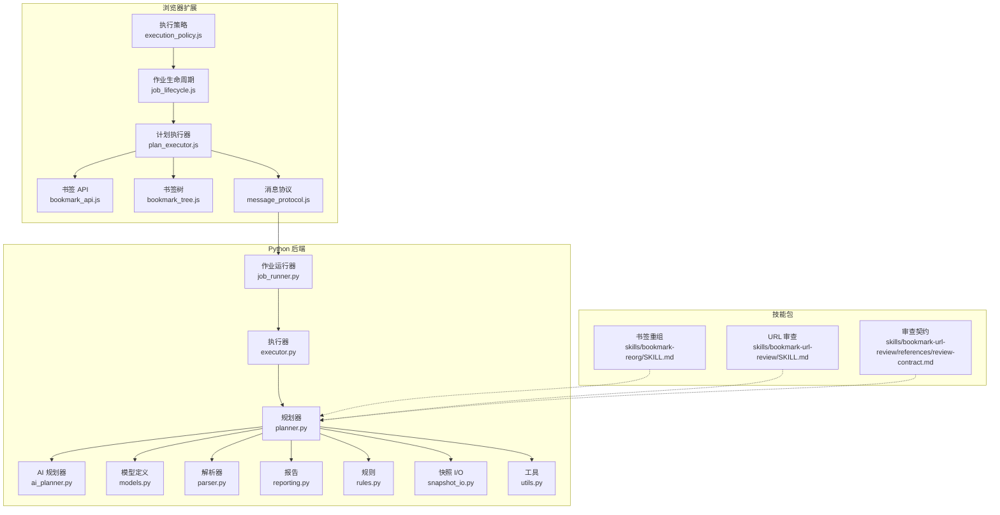
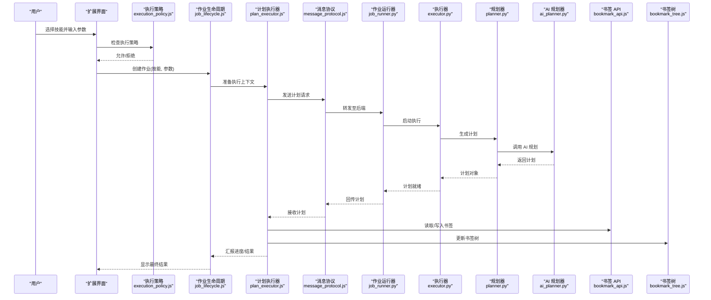
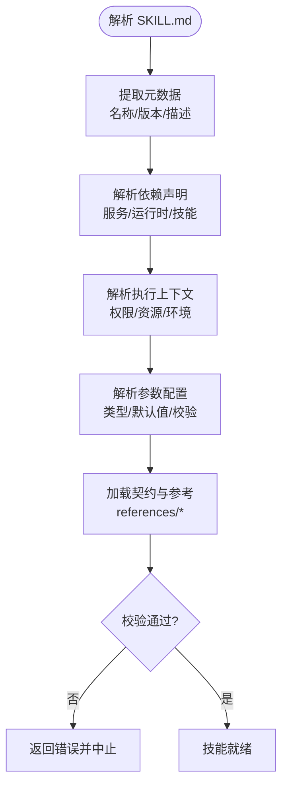
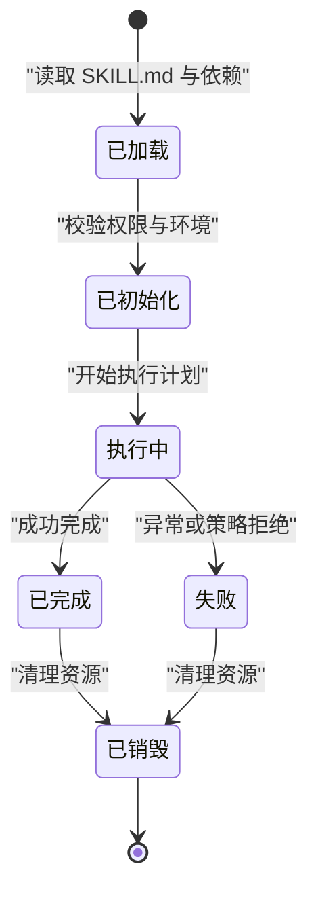
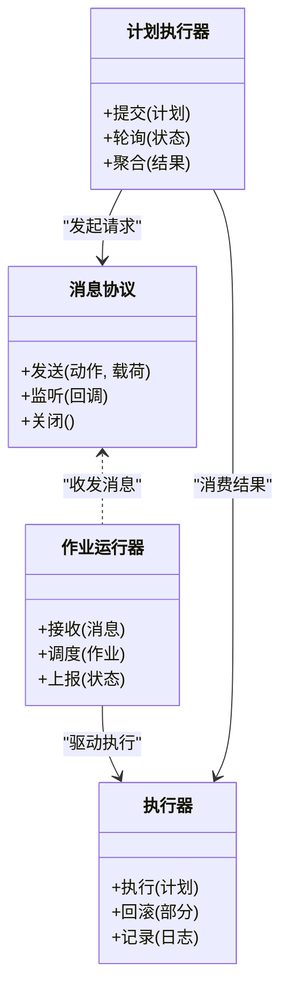
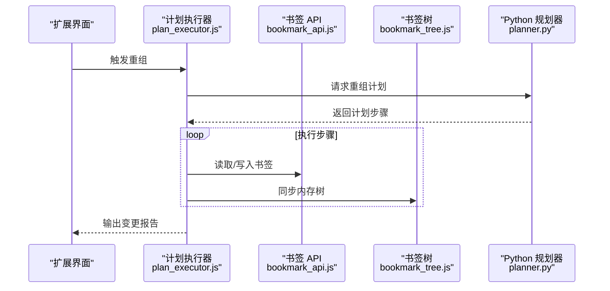
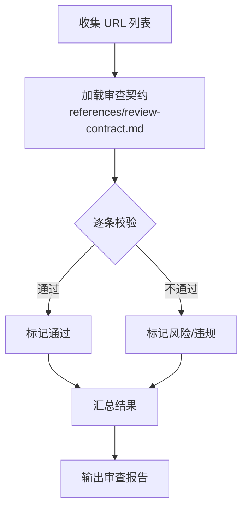
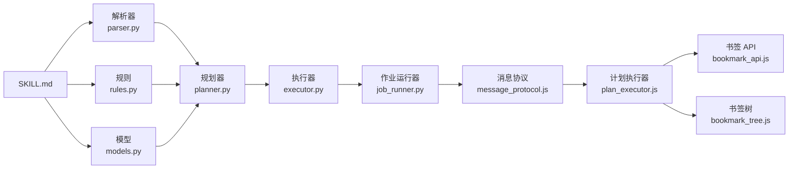

# 技能系统

<cite>
**本文引用的文件**   
- [SKILL.md](file://skills/bookmark-reorg/SKILL.md)
- [SKILL.md](file://skills/bookmark-url-review/SKILL.md)
- [review-contract.md](file://skills/bookmark-url-review/references/review-contract.md)
- [execution_policy.js](file://extension/background/execution_policy.js)
- [job_lifecycle.js](file://extension/background/job_lifecycle.js)
- [plan_executor.js](file://extension/background/plan_executor.js)
- [message_protocol.js](file://extension/shared/message_protocol.js)
- [bookmark_api.js](file://extension/background/bookmark_api.js)
- [bookmark_tree.js](file://extension/background/bookmark_tree.js)
- [AGENTS.md](file://extension/AGENTS.md)
- [ai_planner.py](file://src/bookmark_advisor/ai_planner.py)
- [executor.py](file://src/bookmark_advisor/executor.py)
- [job_runner.py](file://src/bookmark_advisor/job_runner.py)
- [models.py](file://src/bookmark_advisor/models.py)
- [parser.py](file://src/bookmark_advisor/parser.py)
- [planner.py](file://src/bookmark_advisor/planner.py)
- [reporting.py](file://src/bookmark_advisor/reporting.py)
- [rules.py](file://src/bookmark_advisor/rules.py)
- [snapshot_io.py](file://src/bookmark_advisor/snapshot_io.py)
- [utils.py](file://src/bookmark_advisor/utils.py)
- [test_reorg_job.py](file://tests/test_reorg_job.py)
- [test_url_parity.py](file://tests/test_url_parity.py)
</cite>

## 目录
1. [简介](#简介)
2. [项目结构](#项目结构)
3. [核心组件](#核心组件)
4. [架构总览](#架构总览)
5. [详细组件分析](#详细组件分析)
6. [依赖关系分析](#依赖关系分析)
7. [性能考虑](#性能考虑)
8. [故障排查指南](#故障排查指南)
9. [结论](#结论)
10. [附录](#附录)

## 简介
本文件为 Edge Bookmark 的技能系统提供系统化文档，覆盖以下关键主题：
- SKILL.md 文件格式规范（元数据、依赖声明、执行上下文与参数配置）
- 技能生命周期管理（加载、初始化、执行、销毁）
- 多代理协作机制（通信协议、任务分发、结果聚合）
- 内置技能工作原理（书签重组、URL 审查）
- 自定义技能开发指南（模板、测试、部署）
- 安全沙箱、权限控制与错误处理策略

## 项目结构
Edge Bookmark 的技能系统由浏览器扩展侧与 Python 后端共同实现。扩展负责 UI、消息路由、计划编排与执行策略；Python 后端负责计划生成、作业调度与报告输出。技能以“目录 + SKILL.md”的形式组织，并通过共享协议在前后端之间传递。

图表来源
- [execution_policy.js](file://extension/background/execution_policy.js)
- [job_lifecycle.js](file://extension/background/job_lifecycle.js)
- [plan_executor.js](file://extension/background/plan_executor.js)
- [bookmark_api.js](file://extension/background/bookmark_api.js)
- [bookmark_tree.js](file://extension/background/bookmark_tree.js)
- [message_protocol.js](file://extension/shared/message_protocol.js)
- [ai_planner.py](file://src/bookmark_advisor/ai_planner.py)
- [executor.py](file://src/bookmark_advisor/executor.py)
- [job_runner.py](file://src/bookmark_advisor/job_runner.py)
- [planner.py](file://src/bookmark_advisor/planner.py)
- [models.py](file://src/bookmark_advisor/models.py)
- [parser.py](file://src/bookmark_advisor/parser.py)
- [reporting.py](file://src/bookmark_advisor/reporting.py)
- [rules.py](file://src/bookmark_advisor/rules.py)
- [snapshot_io.py](file://src/bookmark_advisor/snapshot_io.py)
- [utils.py](file://src/bookmark_advisor/utils.py)
- [SKILL.md](file://skills/bookmark-reorg/SKILL.md)
- [SKILL.md](file://skills/bookmark-url-review/SKILL.md)
- [review-contract.md](file://skills/bookmark-url-review/references/review-contract.md)

章节来源
- [AGENTS.md](file://extension/AGENTS.md)

## 核心组件
- 技能描述与契约
  - 每个技能位于独立目录，包含一个 SKILL.md 用于声明元数据、依赖、执行上下文与参数。
  - 可选 references 目录存放契约或参考文档，供规划器与执行器约束行为。
- 执行策略与作业生命周期
  - 执行策略决定何时允许运行某项技能以及资源限制。
  - 作业生命周期管理技能的加载、初始化、执行与销毁。
- 计划执行器与书签操作
  - 计划执行器将高层计划转换为具体步骤，调用书签 API 与书签树进行读写。
- 消息协议与多代理协作
  - 通过统一的消息协议在扩展与后端之间传递计划、作业状态与结果。
- Python 后端规划与执行
  - AI 规划器根据技能描述与用户意图生成可执行计划。
  - 规划器组合规则、模型、解析器与快照 I/O 完成计划构建。
  - 执行器与作业运行器驱动计划落地并产出报告。

章节来源
- [SKILL.md](file://skills/bookmark-reorg/SKILL.md)
- [SKILL.md](file://skills/bookmark-url-review/SKILL.md)
- [execution_policy.js](file://extension/background/execution_policy.js)
- [job_lifecycle.js](file://extension/background/job_lifecycle.js)
- [plan_executor.js](file://extension/background/plan_executor.js)
- [message_protocol.js](file://extension/shared/message_protocol.js)
- [ai_planner.py](file://src/bookmark_advisor/ai_planner.py)
- [planner.py](file://src/bookmark_advisor/planner.py)
- [executor.py](file://src/bookmark_advisor/executor.py)
- [job_runner.py](file://src/bookmark_advisor/job_runner.py)
- [models.py](file://src/bookmark_advisor/models.py)
- [parser.py](file://src/bookmark_advisor/parser.py)
- [reporting.py](file://src/bookmark_advisor/reporting.py)
- [rules.py](file://src/bookmark_advisor/rules.py)
- [snapshot_io.py](file://src/bookmark_advisor/snapshot_io.py)
- [utils.py](file://src/bookmark_advisor/utils.py)

## 架构总览
下图展示从用户触发到计划落地的端到端流程，涵盖扩展侧与 Python 后端的交互。

图表来源
- [execution_policy.js](file://extension/background/execution_policy.js)
- [job_lifecycle.js](file://extension/background/job_lifecycle.js)
- [plan_executor.js](file://extension/background/plan_executor.js)
- [message_protocol.js](file://extension/shared/message_protocol.js)
- [job_runner.py](file://src/bookmark_advisor/job_runner.py)
- [executor.py](file://src/bookmark_advisor/executor.py)
- [planner.py](file://src/bookmark_advisor/planner.py)
- [ai_planner.py](file://src/bookmark_advisor/ai_planner.py)
- [bookmark_api.js](file://extension/background/bookmark_api.js)
- [bookmark_tree.js](file://extension/background/bookmark_tree.js)

## 详细组件分析

### SKILL.md 文件格式规范
SKILL.md 是技能的自描述清单，用于指导规划器与执行器正确加载与运行技能。建议包含以下字段：
- 元数据
  - 名称、版本、作者、许可证、摘要与详细描述
  - 图标与分类标签（便于 UI 展示与筛选）
- 依赖声明
  - 外部服务或插件（如 AI 提供商、网络访问）
  - 运行时要求（Node/Python 版本、浏览器能力）
  - 其他技能依赖（顺序或条件依赖）
- 执行上下文
  - 所需权限（书签读写、跨域访问等）
  - 资源限制（并发度、超时、重试次数）
  - 环境配置（密钥、端点、开关）
- 参数配置
  - 参数名、类型、默认值、校验规则与说明
  - 必填/选填标记与分组
- 契约与参考
  - 输入/输出格式约定
  - 与 references 目录中契约的关联

图表来源
- [SKILL.md](file://skills/bookmark-reorg/SKILL.md)
- [SKILL.md](file://skills/bookmark-url-review/SKILL.md)
- [review-contract.md](file://skills/bookmark-url-review/references/review-contract.md)

章节来源
- [SKILL.md](file://skills/bookmark-reorg/SKILL.md)
- [SKILL.md](file://skills/bookmark-url-review/SKILL.md)
- [review-contract.md](file://skills/bookmark-url-review/references/review-contract.md)

### 技能生命周期管理
技能的生命周期贯穿加载、初始化、执行与销毁四个阶段，由扩展的作业生命周期模块统一管理。

图表来源
- [job_lifecycle.js](file://extension/background/job_lifecycle.js)
- [execution_policy.js](file://extension/background/execution_policy.js)

章节来源
- [job_lifecycle.js](file://extension/background/job_lifecycle.js)
- [execution_policy.js](file://extension/background/execution_policy.js)

### 多代理协作机制
多代理协作围绕统一的消息协议展开，扩展作为客户端，Python 后端作为服务端，双方通过结构化消息交换计划与状态。

图表来源
- [message_protocol.js](file://extension/shared/message_protocol.js)
- [job_runner.py](file://src/bookmark_advisor/job_runner.py)
- [executor.py](file://src/bookmark_advisor/executor.py)
- [plan_executor.js](file://extension/background/plan_executor.js)

章节来源
- [message_protocol.js](file://extension/shared/message_protocol.js)
- [job_runner.py](file://src/bookmark_advisor/job_runner.py)
- [executor.py](file://src/bookmark_advisor/executor.py)
- [plan_executor.js](file://extension/background/plan_executor.js)

### 内置技能工作原理

#### 书签重组技能
该技能用于对书签进行批量整理与重组，通常包括：
- 读取当前书签树结构
- 依据规则或计划移动/重命名/合并节点
- 写回书签存储并更新内存树
- 输出变更报告与撤销信息

图表来源
- [plan_executor.js](file://extension/background/plan_executor.js)
- [bookmark_api.js](file://extension/background/bookmark_api.js)
- [bookmark_tree.js](file://extension/background/bookmark_tree.js)
- [planner.py](file://src/bookmark_advisor/planner.py)

章节来源
- [test_reorg_job.py](file://tests/test_reorg_job.py)
- [plan_executor.js](file://extension/background/plan_executor.js)
- [bookmark_api.js](file://extension/background/bookmark_api.js)
- [bookmark_tree.js](file://extension/background/bookmark_tree.js)
- [planner.py](file://src/bookmark_advisor/planner.py)

#### URL 审查技能
该技能用于对书签中的 URL 进行合规性与安全性审查，遵循 references 中的契约定义。典型流程：
- 收集待审查的 URL 列表
- 按契约规则逐项校验（黑名单、白名单、域名信誉等）
- 汇总审查结果并生成报告
- 支持人工复核与反馈闭环

图表来源
- [SKILL.md](file://skills/bookmark-url-review/SKILL.md)
- [review-contract.md](file://skills/bookmark-url-review/references/review-contract.md)

章节来源
- [test_url_parity.py](file://tests/test_url_parity.py)
- [SKILL.md](file://skills/bookmark-url-review/SKILL.md)
- [review-contract.md](file://skills/bookmark-url-review/references/review-contract.md)

### 自定义技能开发指南
- 模板代码与目录结构
  - 新建技能目录并在根目录放置 SKILL.md，填写元数据、依赖、上下文与参数。
  - 如有契约或参考文档，放入 references 目录并在 SKILL.md 中引用。
- 测试方法
  - 使用现有测试用例模式验证计划生成与执行路径（参考 reorg 与 url parity 测试）。
  - 针对边界条件与错误路径编写断言，确保幂等与可回滚。
- 部署流程
  - 将技能目录纳入扩展资源，确保加载时能发现并解析 SKILL.md。
  - 在扩展设置中启用相应权限与开关，必要时配置外部服务端点。
- 最佳实践
  - 明确参数校验与默认值，避免空指针与非法输入。
  - 使用幂等操作与事务式回滚，保证一致性。
  - 输出结构化报告，便于 UI 展示与审计。

章节来源
- [SKILL.md](file://skills/bookmark-reorg/SKILL.md)
- [SKILL.md](file://skills/bookmark-url-review/SKILL.md)
- [test_reorg_job.py](file://tests/test_reorg_job.py)
- [test_url_parity.py](file://tests/test_url_parity.py)

### 安全沙箱、权限控制与错误处理
- 安全沙箱
  - 限制网络访问范围与超时时间，禁止任意命令执行。
  - 隔离环境变量与文件系统访问，仅暴露必要接口。
- 权限控制
  - 基于执行策略在运行前校验权限，拒绝高风险操作。
  - 细粒度授权书签读写、跨域访问与外部服务调用。
- 错误处理策略
  - 捕获并分类异常（网络、IO、校验、策略），记录上下文。
  - 支持部分失败的回滚与重试，保障整体一致性。
  - 向用户呈现可读的错误信息与修复建议。

章节来源
- [execution_policy.js](file://extension/background/execution_policy.js)
- [job_lifecycle.js](file://extension/background/job_lifecycle.js)
- [plan_executor.js](file://extension/background/plan_executor.js)
- [message_protocol.js](file://extension/shared/message_protocol.js)

## 依赖关系分析
技能系统与扩展及后端之间的依赖如下：

图表来源
- [parser.py](file://src/bookmark_advisor/parser.py)
- [rules.py](file://src/bookmark_advisor/rules.py)
- [models.py](file://src/bookmark_advisor/models.py)
- [planner.py](file://src/bookmark_advisor/planner.py)
- [executor.py](file://src/bookmark_advisor/executor.py)
- [job_runner.py](file://src/bookmark_advisor/job_runner.py)
- [message_protocol.js](file://extension/shared/message_protocol.js)
- [plan_executor.js](file://extension/background/plan_executor.js)
- [bookmark_api.js](file://extension/background/bookmark_api.js)
- [bookmark_tree.js](file://extension/background/bookmark_tree.js)

章节来源
- [parser.py](file://src/bookmark_advisor/parser.py)
- [rules.py](file://src/bookmark_advisor/rules.py)
- [models.py](file://src/bookmark_advisor/models.py)
- [planner.py](file://src/bookmark_advisor/planner.py)
- [executor.py](file://src/bookmark_advisor/executor.py)
- [job_runner.py](file://src/bookmark_advisor/job_runner.py)
- [message_protocol.js](file://extension/shared/message_protocol.js)
- [plan_executor.js](file://extension/background/plan_executor.js)
- [bookmark_api.js](file://extension/background/bookmark_api.js)
- [bookmark_tree.js](file://extension/background/bookmark_tree.js)

## 性能考虑
- 批处理与缓存
  - 对大规模书签操作采用批处理与增量更新，减少 IO 与渲染开销。
  - 缓存书签树与审查结果，避免重复计算。
- 异步与限流
  - 使用异步消息与事件驱动，避免阻塞主线程。
  - 对外部服务调用实施速率限制与退避重试。
- 资源监控
  - 监控 CPU、内存与网络占用，设置阈值告警。
  - 对长耗时任务提供进度与取消能力。

[本节为通用指导，无需特定文件来源]

## 故障排查指南
- 常见问题定位
  - 技能未加载：检查 SKILL.md 语法与依赖声明是否完整。
  - 权限不足：确认执行策略与权限配置是否匹配。
  - 计划失败：查看计划执行器日志与后端报告，定位具体步骤。
  - 网络异常：检查消息协议连接与后端服务可用性。
- 调试技巧
  - 开启详细日志，记录输入参数与中间状态。
  - 使用最小复现用例与单元测试快速定位问题。
  - 利用快照 I/O 导出与对比变更集。

章节来源
- [reporting.py](file://src/bookmark_advisor/reporting.py)
- [snapshot_io.py](file://src/bookmark_advisor/snapshot_io.py)
- [utils.py](file://src/bookmark_advisor/utils.py)
- [plan_executor.js](file://extension/background/plan_executor.js)
- [message_protocol.js](file://extension/shared/message_protocol.js)

## 结论
Edge Bookmark 的技能系统通过标准化的 SKILL.md 描述、严格的执行策略与清晰的生命周期管理，实现了可扩展、可维护且安全的技能生态。多代理协作与统一消息协议保障了前后端的高效协同，内置技能展示了典型工作流与最佳实践。开发者可据此快速构建自定义技能，并通过完善的测试与部署流程确保质量与稳定性。

[本节为总结性内容，无需特定文件来源]

## 附录
- 术语表
  - 技能：以 SKILL.md 描述的、可被系统加载与执行的单元。
  - 计划：由规划器生成的、可逐步执行的操作序列。
  - 作业：一次具体的计划执行实例，具有生命周期与状态。
  - 契约：对输入/输出与行为的约束文档，常置于 references 目录。
- 参考文件
  - 扩展侧：执行策略、作业生命周期、计划执行器、消息协议、书签 API 与书签树。
  - 后端侧：AI 规划器、规划器、执行器、作业运行器、模型、解析器、规则、报告、快照 I/O 与工具。
  - 技能包：书签重组与 URL 审查的 SKILL.md 与契约文档。

[本节为补充信息，无需特定文件来源]