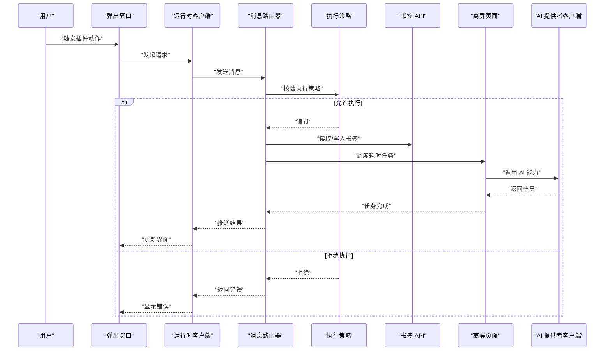
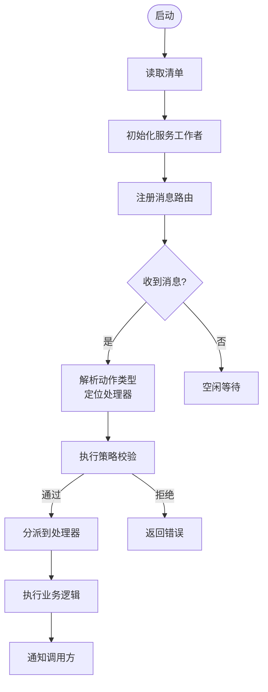
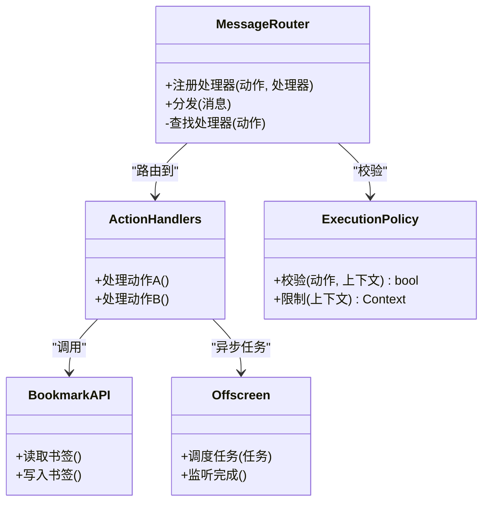
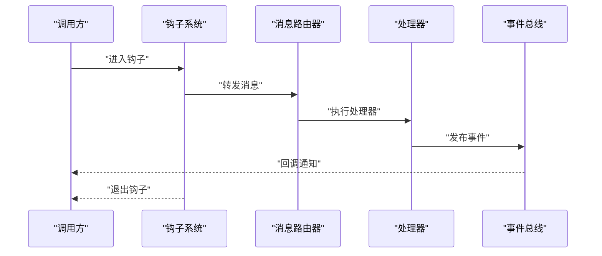
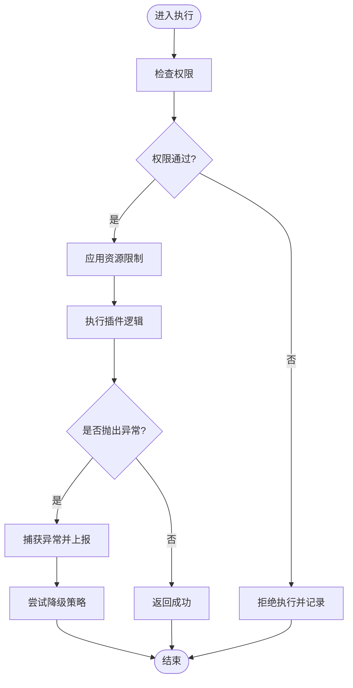
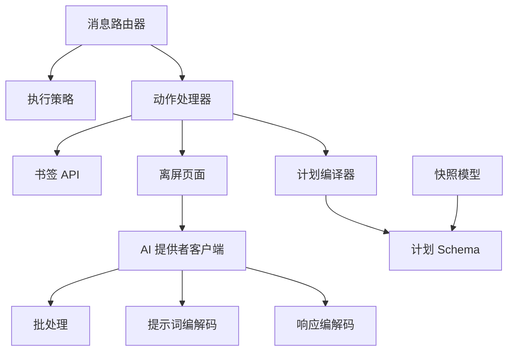

# 插件加载机制

<cite>
**本文引用的文件**   
- [extension/manifest.json](file://extension/manifest.json)
- [extension/service_worker.js](file://extension/service_worker.js)
- [extension/offscreen.js](file://extension/offscreen.js)
- [extension/background/message_router.js](file://extension/background/message_router.js)
- [extension/background/action_handlers.js](file://extension/background/action_handlers.js)
- [extension/background/execution_policy.js](file://extension/background/execution_policy.js)
- [extension/background/bookmark_api.js](file://extension/background/bookmark_api.js)
- [extension/shared/message_protocol.js](file://extension/shared/message_protocol.js)
- [extension/popup/runtime_client.js](file://extension/popup/runtime_client.js)
- [extension/popup/settings_store.js](file://extension/popup/settings_store.js)
- [extension/ai/provider_client.js](file://extension/ai/provider_client.js)
- [extension/ai/batching.js](file://extension/ai/batching.js)
- [extension/ai/response_codec.js](file://extension/ai/response_codec.js)
- [extension/ai/prompt_codec.js](file://extension/ai/prompt_codec.js)
- [extension/ai/fast_rules.js](file://extension/ai/fast_rules.js)
- [extension/ai/plan_compiler.js](file://extension/ai/plan_compiler.js)
- [extension/ai/snapshot_model.js](file://extension/ai/snapshot_model.js)
- [extension/ai_planner.js](file://extension/ai_planner.js)
- [extension/fast_rules.json](file://extension/fast_rules.json)
- [extension/storage_helpers.js](file://extension/storage_helpers.js)
- [extension/shared/storage.js](file://extension/shared/storage.js)
- [extension/shared/path_utils.js](file://extension/shared/path_utils.js)
- [extension/shared/plan_schema.js](file://extension/shared/plan_schema.js)
- [extension/offscreen.html](file://extension/offscreen.html)
- [extension/popup.html](file://extension/popup.html)
- [extension/popup.js](file://extension/popup.js)
- [extension/AGENTS.md](file://extension/AGENTS.md)
- [src/bookmark_advisor/__main__.py](file://src/bookmark_advisor/__main__.py)
- [src/bookmark_advisor/cli.py](file://src/bookmark_advisor/cli.py)
- [src/bookmark_advisor/executor.py](file://src/bookmark_advisor/executor.py)
- [src/bookmark_advisor/planner.py](file://src/bookmark_advisor/planner.py)
- [src/bookmark_advisor/job_runner.py](file://src/bookmark_advisor/job_runner.py)
- [src/bookmark_advisor/models.py](file://src/bookmark_advisor/models.py)
- [src/bookmark_advisor/parser.py](file://src/bookmark_advisor/parser.py)
- [src/bookmark_advisor/reporting.py](file://src/bookmark_advisor/reporting.py)
- [src/bookmark_advisor/utils.py](file://src/bookmark_advisor/utils.py)
- [tests/test_extension_boot_order.py](file://tests/test_extension_boot_order.py)
- [tests/test_extension_message_router.py](file://tests/test_extension_message_router.py)
- [tests/test_extension_execution_policy.py](file://tests/test_extension_execution_policy.py)
- [tests/test_extension_plan_executor_module.py](file://tests/test_extension_plan_executor_module.py)
</cite>

## 目录
1. [简介](#简介)
2. [项目结构](#项目结构)
3. [核心组件](#核心组件)
4. [架构总览](#架构总览)
5. [详细组件分析](#详细组件分析)
6. [依赖分析](#依赖分析)
7. [性能考虑](#性能考虑)
8. [故障排查指南](#故障排查指南)
9. [结论](#结论)
10. [附录](#附录)

## 简介
本文件面向 Edge Bookmark 的“插件加载机制”，围绕动态加载架构、模块发现与依赖解析、加载顺序控制、插件注册与发现（文件系统扫描、清单解析、元数据提取）、扩展点设计模式（钩子函数定义、事件系统实现、回调机制）、插件隔离与安全沙箱（权限控制、资源限制、异常处理）、插件开发接口（API 参考、类型定义、使用示例），以及热重载、版本管理与故障恢复策略进行系统化说明。文档以代码仓库中的实际实现为依据，辅以可视化图示帮助理解。

## 项目结构
Edge Bookmark 采用浏览器扩展（Manifest V3）作为宿主环境，结合 Python 侧的 bookmark_advisor 工具链，形成前后端协同的插件化体系：
- 浏览器扩展侧负责 UI、消息路由、执行策略、与后台/离屏页面的通信，并承载 AI 相关能力（提示词编解码、响应编解码、批处理、规则编译等）。
- Python 侧提供计划生成、任务执行、报告输出等能力，通过扩展的消息协议与前端交互。

```mermaid
graph TB
subgraph "浏览器扩展"
SW["service_worker.js"]
MSG["background/message_router.js"]
POL["background/execution_policy.js"]
BM_API["background/bookmark_api.js"]
ACT["background/action_handlers.js"]
OFF["offscreen.js"]
POP_UI["popup.js / popup.html"]
POP_RT["popup/runtime_client.js"]
POP_SET["popup/settings_store.js"]
SH_MSG["shared/message_protocol.js"]
SH_STO["shared/storage.js"]
SH_PATH["shared/path_utils.js"]
SH_PLAN["shared/plan_schema.js"]
AI_PC["ai/provider_client.js"]
AI_BATCH["ai/batching.js"]
AI_RESP["ai/response_codec.js"]
AI_PROMPT["ai/prompt_codec.js"]
AI_FAST["ai/fast_rules.js"]
AI_PLAN["ai/plan_compiler.js"]
AI_SNAP["ai/snapshot_model.js"]
MAN["manifest.json"]
end
subgraph "Python 工具链"
PY_MAIN["bookmark_advisor/__main__.py"]
PY_CLI["bookmark_advisor/cli.py"]
PY_EXEC["bookmark_advisor/executor.py"]
PY_PLN["bookmark_advisor/planner.py"]
PY_JOB["bookmark_advisor/job_runner.py"]
PY_MODELS["bookmark_advisor/models.py"]
PY_PARSER["bookmark_advisor/parser.py"]
PY_REPORT["bookmark_advisor/reporting.py"]
PY_UTILS["bookmark_advisor/utils.py"]
end
MAN --> SW
SW --> MSG
MSG --> ACT
MSG --> POL
MSG --> BM_API
MSG --> OFF
POP_UI --> POP_RT
POP_RT --> SH_MSG
POP_SET --> SH_STO
AI_PC --> SH_MSG
AI_BATCH --> AI_PC
AI_RESP --> AI_PC
AI_PROMPT --> AI_PC
AI_FAST --> AI_PLAN
AI_PLAN --> SH_PLAN
AI_SNAP --> SH_PLAN
SW -.消息协议.-> PY_CLI
PY_CLI --> PY_PLN
PY_PLN --> PY_MODELS
PY_PLN --> PY_PARSER
PY_EXEC --> PY_JOB
PY_EXEC --> PY_REPORT
PY_EXEC --> PY_UTILS
```

图表来源
- [extension/manifest.json](file://extension/manifest.json)
- [extension/service_worker.js](file://extension/service_worker.js)
- [extension/background/message_router.js](file://extension/background/message_router.js)
- [extension/background/action_handlers.js](file://extension/background/action_handlers.js)
- [extension/background/execution_policy.js](file://extension/background/execution_policy.js)
- [extension/background/bookmark_api.js](file://extension/background/bookmark_api.js)
- [extension/offscreen.js](file://extension/offscreen.js)
- [extension/popup.js](file://extension/popup.js)
- [extension/popup.html](file://extension/popup.html)
- [extension/popup/runtime_client.js](file://extension/popup/runtime_client.js)
- [extension/popup/settings_store.js](file://extension/popup/settings_store.js)
- [extension/shared/message_protocol.js](file://extension/shared/message_protocol.js)
- [extension/shared/storage.js](file://extension/shared/storage.js)
- [extension/shared/path_utils.js](file://extension/shared/path_utils.js)
- [extension/shared/plan_schema.js](file://extension/shared/plan_schema.js)
- [extension/ai/provider_client.js](file://extension/ai/provider_client.js)
- [extension/ai/batching.js](file://extension/ai/batching.js)
- [extension/ai/response_codec.js](file://extension/ai/response_codec.js)
- [extension/ai/prompt_codec.js](file://extension/ai/prompt_codec.js)
- [extension/ai/fast_rules.js](file://extension/ai/fast_rules.js)
- [extension/ai/plan_compiler.js](file://extension/ai/plan_compiler.js)
- [extension/ai/snapshot_model.js](file://extension/ai/snapshot_model.js)
- [src/bookmark_advisor/__main__.py](file://src/bookmark_advisor/__main__.py)
- [src/bookmark_advisor/cli.py](file://src/bookmark_advisor/cli.py)
- [src/bookmark_advisor/executor.py](file://src/bookmark_advisor/executor.py)
- [src/bookmark_advisor/planner.py](file://src/bookmark_advisor/planner.py)
- [src/bookmark_advisor/job_runner.py](file://src/bookmark_advisor/job_runner.py)
- [src/bookmark_advisor/models.py](file://src/bookmark_advisor/models.py)
- [src/bookmark_advisor/parser.py](file://src/bookmark_advisor/parser.py)
- [src/bookmark_advisor/reporting.py](file://src/bookmark_advisor/reporting.py)
- [src/bookmark_advisor/utils.py](file://src/bookmark_advisor/utils.py)

章节来源
- [extension/manifest.json](file://extension/manifest.json)
- [extension/service_worker.js](file://extension/service_worker.js)
- [extension/background/message_router.js](file://extension/background/message_router.js)
- [extension/background/action_handlers.js](file://extension/background/action_handlers.js)
- [extension/background/execution_policy.js](file://extension/background/execution_policy.js)
- [extension/background/bookmark_api.js](file://extension/background/bookmark_api.js)
- [extension/offscreen.js](file://extension/offscreen.js)
- [extension/popup.js](file://extension/popup.js)
- [extension/popup.html](file://extension/popup.html)
- [extension/popup/runtime_client.js](file://extension/popup/runtime_client.js)
- [extension/popup/settings_store.js](file://extension/popup/settings_store.js)
- [extension/shared/message_protocol.js](file://extension/shared/message_protocol.js)
- [extension/shared/storage.js](file://extension/shared/storage.js)
- [extension/shared/path_utils.js](file://extension/shared/path_utils.js)
- [extension/shared/plan_schema.js](file://extension/shared/plan_schema.js)
- [extension/ai/provider_client.js](file://extension/ai/provider_client.js)
- [extension/ai/batching.js](file://extension/ai/batching.js)
- [extension/ai/response_codec.js](file://extension/ai/response_codec.js)
- [extension/ai/prompt_codec.js](file://extension/ai/prompt_codec.js)
- [extension/ai/fast_rules.js](file://extension/ai/fast_rules.js)
- [extension/ai/plan_compiler.js](file://extension/ai/plan_compiler.js)
- [extension/ai/snapshot_model.js](file://extension/ai/snapshot_model.js)
- [src/bookmark_advisor/__main__.py](file://src/bookmark_advisor/__main__.py)
- [src/bookmark_advisor/cli.py](file://src/bookmark_advisor/cli.py)
- [src/bookmark_advisor/executor.py](file://src/bookmark_advisor/executor.py)
- [src/bookmark_advisor/planner.py](file://src/bookmark_advisor/planner.py)
- [src/bookmark_advisor/job_runner.py](file://src/bookmark_advisor/job_runner.py)
- [src/bookmark_advisor/models.py](file://src/bookmark_advisor/models.py)
- [src/bookmark_advisor/parser.py](file://src/bookmark_advisor/parser.py)
- [src/bookmark_advisor/reporting.py](file://src/bookmark_advisor/reporting.py)
- [src/bookmark_advisor/utils.py](file://src/bookmark_advisor/utils.py)

## 核心组件
- 服务工作者（Service Worker）：作为扩展生命周期入口，负责初始化、注册消息路由、管理离屏页面、协调各背景模块。
- 消息路由器：统一分发来自 Popup、Offscreen、外部脚本的消息，按动作类型路由到对应处理器。
- 执行策略：对可执行项进行白名单/黑名单校验、速率限制、超时控制等安全约束。
- 书签 API：封装对浏览器书签树的操作，为上层逻辑提供稳定接口。
- 离屏页面：承载长时间或高开销任务，避免阻塞 Service Worker。
- 弹出窗口运行时客户端：Popup 与背景之间的轻量桥接，用于发起请求、订阅状态。
- 设置存储：持久化用户偏好与插件配置。
- AI 子系统：包含提供者客户端、批处理、提示词/响应编解码、快速规则、计划编译、快照模型等。
- Python 工具链：计划生成、任务执行、报告输出，通过 CLI 与扩展交互。

章节来源
- [extension/service_worker.js](file://extension/service_worker.js)
- [extension/background/message_router.js](file://extension/background/message_router.js)
- [extension/background/execution_policy.js](file://extension/background/execution_policy.js)
- [extension/background/bookmark_api.js](file://extension/background/bookmark_api.js)
- [extension/offscreen.js](file://extension/offscreen.js)
- [extension/popup/runtime_client.js](file://extension/popup/runtime_client.js)
- [extension/popup/settings_store.js](file://extension/popup/settings_store.js)
- [extension/ai/provider_client.js](file://extension/ai/provider_client.js)
- [extension/ai/batching.js](file://extension/ai/batching.js)
- [extension/ai/response_codec.js](file://extension/ai/response_codec.js)
- [extension/ai/prompt_codec.js](file://extension/ai/prompt_codec.js)
- [extension/ai/fast_rules.js](file://extension/ai/fast_rules.js)
- [extension/ai/plan_compiler.js](file://extension/ai/plan_compiler.js)
- [extension/ai/snapshot_model.js](file://extension/ai/snapshot_model.js)
- [src/bookmark_advisor/cli.py](file://src/bookmark_advisor/cli.py)
- [src/bookmark_advisor/executor.py](file://src/bookmark_advisor/executor.py)
- [src/bookmark_advisor/planner.py](file://src/bookmark_advisor/planner.py)

## 架构总览
下图展示了从用户操作到插件执行的端到端流程，包括消息路由、策略校验、书签 API 调用、离屏任务执行与结果回传。

图表来源
- [extension/popup/runtime_client.js](file://extension/popup/runtime_client.js)
- [extension/background/message_router.js](file://extension/background/message_router.js)
- [extension/background/execution_policy.js](file://extension/background/execution_policy.js)
- [extension/background/bookmark_api.js](file://extension/background/bookmark_api.js)
- [extension/offscreen.js](file://extension/offscreen.js)
- [extension/ai/provider_client.js](file://extension/ai/provider_client.js)

## 详细组件分析

### 动态加载与模块发现
- 清单驱动：扩展通过清单文件声明入口、权限、背景脚本、离屏页面等，作为模块发现的权威来源。
- 服务工作者初始化：在启动时加载必要的背景模块，建立消息路由与事件监听。
- 按需加载：基于消息类型与动作常量，动态引入相应处理器，避免一次性加载全部模块。
- 依赖解析：通过共享协议与 Schema 确保跨模块数据结构一致，减少耦合。

图表来源
- [extension/manifest.json](file://extension/manifest.json)
- [extension/service_worker.js](file://extension/service_worker.js)
- [extension/background/message_router.js](file://extension/background/message_router.js)
- [extension/background/execution_policy.js](file://extension/background/execution_policy.js)

章节来源
- [extension/manifest.json](file://extension/manifest.json)
- [extension/service_worker.js](file://extension/service_worker.js)
- [extension/background/message_router.js](file://extension/background/message_router.js)
- [extension/background/execution_policy.js](file://extension/background/execution_policy.js)

### 插件注册与发现机制
- 文件系统扫描：扩展通过 Manifest 与内置路径约定识别可用模块；Python 侧通过包结构与入口点暴露能力。
- 清单解析：解析扩展元数据（名称、版本、权限、入口），用于构建加载图与权限矩阵。
- 元数据提取：从清单与配置文件（如快速规则）中提取能力描述、版本信息、兼容性要求。
- 注册表维护：在内存中维护已发现模块列表与能力索引，供路由与策略查询。

章节来源
- [extension/manifest.json](file://extension/manifest.json)
- [extension/fast_rules.json](file://extension/fast_rules.json)
- [src/bookmark_advisor/__main__.py](file://src/bookmark_advisor/__main__.py)
- [src/bookmark_advisor/cli.py](file://src/bookmark_advisor/cli.py)

### 加载顺序控制
- 启动阶段：先加载共享协议与基础工具，再加载背景模块，最后初始化 UI 与离屏页面。
- 依赖排序：根据导入关系与动作常量，确定处理器加载顺序，避免循环依赖。
- 测试验证：通过启动顺序测试确保关键模块按预期初始化。

图表来源
- [extension/background/message_router.js](file://extension/background/message_router.js)
- [extension/background/action_handlers.js](file://extension/background/action_handlers.js)
- [extension/background/execution_policy.js](file://extension/background/execution_policy.js)
- [extension/background/bookmark_api.js](file://extension/background/bookmark_api.js)
- [extension/offscreen.js](file://extension/offscreen.js)

章节来源
- [extension/background/message_router.js](file://extension/background/message_router.js)
- [extension/background/action_handlers.js](file://extension/background/action_handlers.js)
- [extension/background/execution_policy.js](file://extension/background/execution_policy.js)
- [extension/background/bookmark_api.js](file://extension/background/bookmark_api.js)
- [extension/offscreen.js](file://extension/offscreen.js)
- [tests/test_extension_boot_order.py](file://tests/test_extension_boot_order.py)

### 扩展点设计模式（钩子、事件、回调）
- 钩子函数：在消息路由与处理器之间定义标准钩子，用于前置校验、后置处理、日志记录。
- 事件系统：基于消息协议的事件通道，支持发布/订阅模式，解耦模块间通信。
- 回调机制：异步任务完成后通过回调或消息回推，确保调用方及时获知结果。

图表来源
- [extension/background/message_router.js](file://extension/background/message_router.js)
- [extension/shared/message_protocol.js](file://extension/shared/message_protocol.js)

章节来源
- [extension/background/message_router.js](file://extension/background/message_router.js)
- [extension/shared/message_protocol.js](file://extension/shared/message_protocol.js)
- [tests/test_extension_message_router.py](file://tests/test_extension_message_router.py)

### 插件隔离与安全沙箱
- 权限控制：基于清单声明的权限矩阵，在执行前由策略模块校验是否允许访问特定资源。
- 资源限制：对 CPU、内存、网络请求进行限制，防止滥用。
- 异常处理：统一捕获异常，记录诊断信息，并提供降级策略。
- 白名单/黑名单：对动作与模块进行准入控制，仅允许受信任的插件执行。

图表来源
- [extension/background/execution_policy.js](file://extension/background/execution_policy.js)
- [extension/background/message_router.js](file://extension/background/message_router.js)

章节来源
- [extension/background/execution_policy.js](file://extension/background/execution_policy.js)
- [extension/background/message_router.js](file://extension/background/message_router.js)
- [tests/test_extension_execution_policy.py](file://tests/test_extension_execution_policy.py)

### 插件开发接口文档
- API 参考
  - 消息协议：定义统一的请求/响应格式、事件类型与字段约束。
  - 书签 API：提供读取、创建、更新、删除书签的能力。
  - 运行时客户端：Popup 与背景通信的轻量接口。
  - 设置存储：读写用户配置与插件参数。
- 类型定义
  - 计划 Schema：定义计划的结构与校验规则。
  - 快照模型：定义快照的数据结构与序列化方式。
- 使用示例
  - 编写处理器：注册动作类型，实现处理逻辑，遵循策略约束。
  - 集成 AI 能力：使用提供者客户端、提示词/响应编解码器、批处理与快速规则。

章节来源
- [extension/shared/message_protocol.js](file://extension/shared/message_protocol.js)
- [extension/background/bookmark_api.js](file://extension/background/bookmark_api.js)
- [extension/popup/runtime_client.js](file://extension/popup/runtime_client.js)
- [extension/popup/settings_store.js](file://extension/popup/settings_store.js)
- [extension/shared/plan_schema.js](file://extension/shared/plan_schema.js)
- [extension/ai/snapshot_model.js](file://extension/ai/snapshot_model.js)
- [extension/ai/provider_client.js](file://extension/ai/provider_client.js)
- [extension/ai/prompt_codec.js](file://extension/ai/prompt_codec.js)
- [extension/ai/response_codec.js](file://extension/ai/response_codec.js)
- [extension/ai/batching.js](file://extension/ai/batching.js)
- [extension/ai/fast_rules.js](file://extension/ai/fast_rules.js)

### 热重载、版本管理与故障恢复
- 热重载：通过监听配置变更与模块哈希变化，动态刷新处理器映射，无需重启扩展。
- 版本管理：在清单与配置中声明版本与兼容性矩阵，升级时进行迁移与回滚。
- 故障恢复：失败重试、熔断与降级，确保关键路径可用性。

章节来源
- [extension/manifest.json](file://extension/manifest.json)
- [extension/popup/settings_store.js](file://extension/popup/settings_store.js)
- [extension/background/execution_policy.js](file://extension/background/execution_policy.js)

## 依赖分析
- 内部依赖
  - 消息路由器依赖执行策略与动作处理器。
  - 书签 API 被多个处理器复用。
  - AI 子系统依赖提供者客户端与编解码器。
- 外部依赖
  - 浏览器 API（书签、消息、离屏页面）。
  - Python 工具链（CLI、计划生成、任务执行）。

图表来源
- [extension/background/message_router.js](file://extension/background/message_router.js)
- [extension/background/execution_policy.js](file://extension/background/execution_policy.js)
- [extension/background/action_handlers.js](file://extension/background/action_handlers.js)
- [extension/background/bookmark_api.js](file://extension/background/bookmark_api.js)
- [extension/offscreen.js](file://extension/offscreen.js)
- [extension/ai/provider_client.js](file://extension/ai/provider_client.js)
- [extension/ai/batching.js](file://extension/ai/batching.js)
- [extension/ai/prompt_codec.js](file://extension/ai/prompt_codec.js)
- [extension/ai/response_codec.js](file://extension/ai/response_codec.js)
- [extension/ai/plan_compiler.js](file://extension/ai/plan_compiler.js)
- [extension/shared/plan_schema.js](file://extension/shared/plan_schema.js)
- [extension/ai/snapshot_model.js](file://extension/ai/snapshot_model.js)

章节来源
- [extension/background/message_router.js](file://extension/background/message_router.js)
- [extension/background/execution_policy.js](file://extension/background/execution_policy.js)
- [extension/background/action_handlers.js](file://extension/background/action_handlers.js)
- [extension/background/bookmark_api.js](file://extension/background/bookmark_api.js)
- [extension/offscreen.js](file://extension/offscreen.js)
- [extension/ai/provider_client.js](file://extension/ai/provider_client.js)
- [extension/ai/batching.js](file://extension/ai/batching.js)
- [extension/ai/prompt_codec.js](file://extension/ai/prompt_codec.js)
- [extension/ai/response_codec.js](file://extension/ai/response_codec.js)
- [extension/ai/plan_compiler.js](file://extension/ai/plan_compiler.js)
- [extension/shared/plan_schema.js](file://extension/shared/plan_schema.js)
- [extension/ai/snapshot_model.js](file://extension/ai/snapshot_model.js)

## 性能考虑
- 延迟加载：仅在需要时加载处理器与 AI 模块，降低启动时间。
- 批处理：对高频小任务进行聚合，减少网络与计算开销。
- 缓存策略：对只读数据与计算结果进行缓存，提升响应速度。
- 资源限制：对 CPU、内存、I/O 进行配额管理，避免抖动。

[本节为通用指导，不直接分析具体文件]

## 故障排查指南
- 常见问题
  - 消息未路由：检查动作类型与处理器注册是否匹配。
  - 策略拒绝：查看权限矩阵与白名单配置。
  - 离线任务失败：确认离屏页面状态与提供者可达性。
- 诊断手段
  - 启用详细日志：在消息路由与策略模块增加日志输出。
  - 回放消息：保存消息序列以便复现问题。
  - 单元测试：覆盖关键路径与边界条件。

章节来源
- [extension/background/message_router.js](file://extension/background/message_router.js)
- [extension/background/execution_policy.js](file://extension/background/execution_policy.js)
- [extension/offscreen.js](file://extension/offscreen.js)
- [tests/test_extension_message_router.py](file://tests/test_extension_message_router.py)
- [tests/test_extension_execution_policy.py](file://tests/test_extension_execution_policy.py)

## 结论
Edge Bookmark 的插件加载机制以清单驱动与服务工作者为核心，结合消息路由与执行策略，实现了模块化、可扩展且安全的插件生态。通过清晰的扩展点设计与严格的沙箱约束，开发者可以安全地扩展功能，同时保证系统的稳定性与性能。

[本节为总结性内容，不直接分析具体文件]

## 附录
- 相关文件与职责
  - 清单与入口：[extension/manifest.json](file://extension/manifest.json)、[extension/service_worker.js](file://extension/service_worker.js)
  - 消息与策略：[extension/background/message_router.js](file://extension/background/message_router.js)、[extension/background/execution_policy.js](file://extension/background/execution_policy.js)
  - 书签与离屏：[extension/background/bookmark_api.js](file://extension/background/bookmark_api.js)、[extension/offscreen.js](file://extension/offscreen.js)
  - 弹出与设置：[extension/popup.js](file://extension/popup.js)、[extension/popup.html](file://extension/popup.html)、[extension/popup/runtime_client.js](file://extension/popup/runtime_client.js)、[extension/popup/settings_store.js](file://extension/popup/settings_store.js)
  - 共享协议与工具：[extension/shared/message_protocol.js](file://extension/shared/message_protocol.js)、[extension/shared/storage.js](file://extension/shared/storage.js)、[extension/shared/path_utils.js](file://extension/shared/path_utils.js)、[extension/shared/plan_schema.js](file://extension/shared/plan_schema.js)
  - AI 子系统：[extension/ai/provider_client.js](file://extension/ai/provider_client.js)、[extension/ai/batching.js](file://extension/ai/batching.js)、[extension/ai/response_codec.js](file://extension/ai/response_codec.js)、[extension/ai/prompt_codec.js](file://extension/ai/prompt_codec.js)、[extension/ai/fast_rules.js](file://extension/ai/fast_rules.js)、[extension/ai/plan_compiler.js](file://extension/ai/plan_compiler.js)、[extension/ai/snapshot_model.js](file://extension/ai/snapshot_model.js)
  - Python 工具链：[src/bookmark_advisor/__main__.py](file://src/bookmark_advisor/__main__.py)、[src/bookmark_advisor/cli.py](file://src/bookmark_advisor/cli.py)、[src/bookmark_advisor/executor.py](file://src/bookmark_advisor/executor.py)、[src/bookmark_advisor/planner.py](file://src/bookmark_advisor/planner.py)、[src/bookmark_advisor/job_runner.py](file://src/bookmark_advisor/job_runner.py)、[src/bookmark_advisor/models.py](file://src/bookmark_advisor/models.py)、[src/bookmark_advisor/parser.py](file://src/bookmark_advisor/parser.py)、[src/bookmark_advisor/reporting.py](file://src/bookmark_advisor/reporting.py)、[src/bookmark_advisor/utils.py](file://src/bookmark_advisor/utils.py)
  - 测试用例：[tests/test_extension_boot_order.py](file://tests/test_extension_boot_order.py)、[tests/test_extension_message_router.py](file://tests/test_extension_message_router.py)、[tests/test_extension_execution_policy.py](file://tests/test_extension_execution_policy.py)、[tests/test_extension_plan_executor_module.py](file://tests/test_extension_plan_executor_module.py)
  - 其他：[extension/AGENTS.md](file://extension/AGENTS.md)、[extension/ai_planner.js](file://extension/ai_planner.js)、[extension/storage_helpers.js](file://extension/storage_helpers.js)